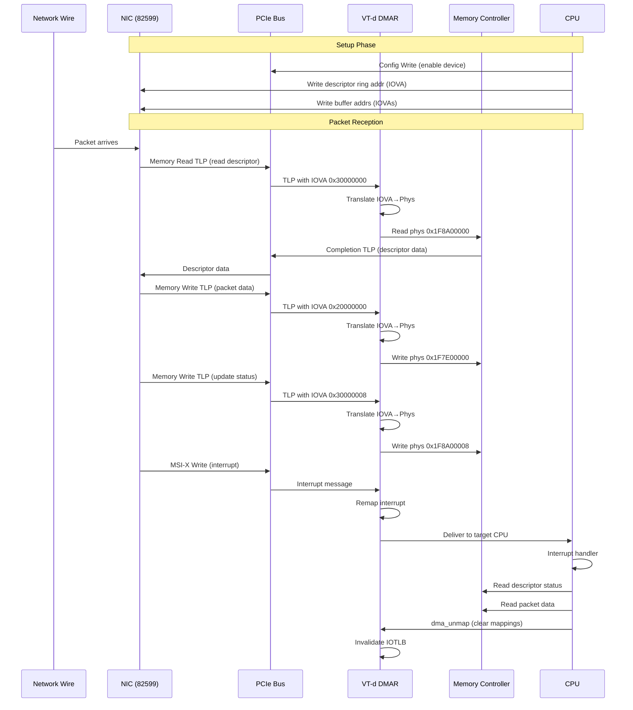

# DMA & IOMMU

## Overview

**Direct Memory Access (DMA)** allows devices to transfer data to/from system memory without CPU involvement, enabling high-performance I/O. The **IOMMU (Input-Output Memory Management Unit)** provides memory protection and address translation for DMA operations, analogous to how the CPU's MMU provides virtual memory for software.

This chapter covers:

1. **DMA (Direct Memory Access)**: How devices transfer data, DMA APIs (coherent and streaming), scatter-gather, and constraints
2. **Intel VT-d**: Intel's IOMMU implementation for address translation, protection, domains, interrupt remapping, and VFIO
3. **Integration**: How PCIe, DMA, and VT-d work together with complete packet flow examples

**Prerequisites**: This chapter builds on PCIe fundamentals covered in the [PCIe](./pcie.md) chapter, including bus mastering, TLPs, and device driver basics. The PCIe chapter covers how to set up DMA capability (`pci_set_master()`), which is required before any DMA operations.

## DMA (Direct Memory Access)

**Direct Memory Access (DMA)** allows devices to transfer data to/from system memory without CPU involvement. This is fundamental to high-performance I/O - without DMA, the CPU would need to copy every byte between device and memory, wasting cycles and limiting throughput.

### Why DMA?

**Without DMA** (Programmed I/O):
```
CPU reads packet from device register → CPU writes to memory
│
├─ CPU busy for entire transfer
├─ Limited by CPU speed
├─ Wastes CPU cycles that could run applications
└─ ~100-200 MB/s practical limit
```

**With DMA**:
```
CPU programs DMA descriptor → Device transfers directly to memory → Device interrupts CPU when done
│
├─ CPU free during transfer
├─ Limited by bus bandwidth (PCIe: 8-64+ GB/s)
├─ CPU does useful work while I/O happens
└─ Zero-copy: data goes directly to application buffers
```

For a 10 Gbps network card (Intel 82599), DMA is essential:
- 10 Gbps = ~1.25 GB/s of data
- At 3 GHz, CPU has ~2400 cycles per 1 KB packet
- Without DMA: CPU would spend all cycles copying data
- With DMA: CPU has 2400 cycles for actual packet processing

### DMA Fundamentals

#### Bus Mastering

For a device to perform DMA, it must act as a **bus master** - initiating memory transactions rather than just responding to them:

```
Traditional I/O:              DMA (Bus Mastering):
CPU → Device Register         Device → Memory
(CPU is master)               (Device is master)
```

The device becomes a bus master when:
1. Driver sets `PCI_COMMAND_MASTER` bit (bit 2) in PCI Command Register
2. Device's DMA engine is enabled
3. Device is given memory addresses to transfer to/from

```c
/* Enable bus mastering during probe() */
pci_set_master(pdev);  /* Sets Command Register bit 2 */
```

#### DMA Descriptors

Devices use **DMA descriptors** to know what to transfer and where. A descriptor typically contains:

```c
/* Simplified RX descriptor from ixgbe */
struct ixgbe_rx_desc {
    __le64 pkt_addr;      /* Physical address of packet buffer */
    __le64 hdr_addr;      /* Physical address of header buffer (optional) */
};

/* Simplified TX descriptor from ixgbe */
struct ixgbe_tx_desc {
    __le64 buffer_addr;   /* Physical address of packet data */
    __le32 cmd_type_len;  /* Command, descriptor type, buffer length */
    __le32 olinfo_status; /* Offload info and status */
};
```

The driver creates a **descriptor ring** in memory:

```
Descriptor Ring (in RAM):
┌────────────────┬────────────────┬────────────────┐
│ Desc 0         │ Desc 1         │ Desc 2         │ ...
│ pkt_addr: 0x.. │ pkt_addr: 0x.. │ pkt_addr: 0x.. │
└────────────────┴────────────────┴────────────────┘
       ▲                                       │
       │                                       │
       └───────── wraps around ────────────────┘

Device maintains:
- Head pointer: next descriptor for hardware to process
- Tail pointer: written by driver to indicate new descriptors
```

#### DMA Transfer Flow

**Receive (RX) path**:
```
1. Driver allocates packet buffers
2. Driver maps buffers for DMA (gets DMA addresses)
3. Driver writes DMA addresses to RX descriptors
4. Driver updates tail pointer (tells device: "descriptors ready")
5. Packet arrives from network
6. Device DMAs packet data to buffer (using address from descriptor)
7. Device writes status to descriptor
8. Device triggers interrupt
9. Driver reads descriptor status
10. Driver unmaps buffer
11. Driver processes packet data
```

**Transmit (TX) path**:
```
1. Network stack hands packet (skb) to driver
2. Driver maps packet buffer for DMA
3. Driver writes DMA address to TX descriptor
4. Driver sets length, offload flags in descriptor
5. Driver updates tail pointer (tells device: "descriptor ready")
6. Device reads descriptor
7. Device DMAs packet data from memory
8. Device transmits packet on wire
9. Device writes completion status to descriptor
10. Device triggers interrupt (or driver polls)
11. Driver unmaps buffer
12. Driver frees packet (skb)
```

### DMA Address Types

Understanding address types is critical for correct DMA programming:

```c
/* Virtual address - what CPU uses */
void *virt_addr = kmalloc(size, GFP_KERNEL);

/* Physical address - actual RAM address */
phys_addr_t phys_addr = virt_to_phys(virt_addr);

/* DMA/bus address - what device uses */
dma_addr_t dma_addr = dma_map_single(dev, virt_addr, size, direction);
```

**Why three address types?**

1. **Virtual addresses**: CPU uses page tables for translation
   - Allows memory protection, swapping, virtual memory
   - Not visible to devices

2. **Physical addresses**: Actual RAM addresses
   - What you'd see on memory bus without any translation
   - On x86-64 with no IOMMU: `dma_addr == phys_addr`

3. **DMA/bus addresses**: What device sees on PCIe bus
   - On x86-64 with IOMMU (VT-d): IOMMU translates `dma_addr` → `phys_addr`
   - IOMMU provides protection and address translation
   - On systems with limited device addressing: may use bounce buffers

```
No IOMMU:                      With VT-d IOMMU:
┌─────────────┐               ┌─────────────┐
│   Device    │               │   Device    │
│             │               │             │
│ DMA addr:   │               │ DMA addr:   │
│ 0xF0000000  │               │ 0x20000000  │
└──────┬──────┘               └──────┬──────┘
       │                             │
       │ (no translation)            │ (IOMMU translates)
       ▼                             ▼
┌─────────────┐               ┌─────────────┐
│   Memory    │               │  VT-d IOMMU │
│             │               │             │
│ Phys addr:  │               │  Page Table │
│ 0xF0000000  │               │  Lookup     │
└─────────────┘               └──────┬──────┘
                                     │
                                     ▼
                              ┌─────────────┐
                              │   Memory    │
                              │             │
                              │ Phys addr:  │
                              │ 0xF0000000  │
                              └─────────────┘
```

**Rule**: Always use `dma_addr_t` for device addresses, never assume it equals physical address.

### Coherent DMA

**Coherent DMA** (also called **consistent DMA**) provides memory that both CPU and device can access without explicit cache synchronization.

#### Use Cases

Coherent DMA is used for:
- **Descriptor rings**: CPU and device both read/write frequently
- **Shared control structures**: Status fields, mailboxes
- **Small frequently-accessed buffers**: Where cache overhead matters less than convenience

#### API

```c
/* Allocate coherent DMA memory */
void *dma_alloc_coherent(struct device *dev, size_t size,
                         dma_addr_t *dma_handle, gfp_t gfp);

/* Free coherent DMA memory */
void dma_free_coherent(struct device *dev, size_t size,
                       void *cpu_addr, dma_addr_t dma_handle);
```

**Example from ixgbe** (allocating RX descriptor ring):

```c
/* From drivers/net/ethernet/intel/ixgbe/ixgbe_main.c */
static int ixgbe_setup_rx_resources(struct ixgbe_ring *rx_ring)
{
    struct device *dev = rx_ring->dev;
    int size;
    
    /* Calculate size: number of descriptors * descriptor size */
    size = sizeof(union ixgbe_adv_rx_desc) * rx_ring->count;
    
    /* Allocate coherent DMA memory for descriptor ring */
    rx_ring->desc = dma_alloc_coherent(dev, size,
                                       &rx_ring->dma,
                                       GFP_KERNEL);
    if (!rx_ring->desc) {
        netdev_err(rx_ring->netdev,
                  "Unable to allocate memory for RX descriptor ring\n");
        return -ENOMEM;
    }
    
    /* Clear descriptor ring */
    memset(rx_ring->desc, 0, size);
    
    /* Initialize software ring (metadata) */
    rx_ring->rx_buffer_info = vzalloc(sizeof(struct ixgbe_rx_buffer) *
                                       rx_ring->count);
    if (!rx_ring->rx_buffer_info) {
        dma_free_coherent(dev, size, rx_ring->desc, rx_ring->dma);
        return -ENOMEM;
    }
    
    return 0;
}
```

After allocation:
- `rx_ring->desc`: CPU virtual address to access descriptors
- `rx_ring->dma`: DMA address to program into device registers

```c
/* Program descriptor ring base address into device */
IXGBE_WRITE_REG(hw, IXGBE_RDBAL(reg_idx), (u32)(rx_ring->dma & 0xFFFFFFFF));
IXGBE_WRITE_REG(hw, IXGBE_RDBAH(reg_idx), (u32)(rx_ring->dma >> 32));
IXGBE_WRITE_REG(hw, IXGBE_RDLEN(reg_idx), rx_ring->count * sizeof(union ixgbe_adv_rx_desc));
```

#### Cache Coherency on x86-64

On x86-64, hardware enforces cache coherency:
- Device writes are snooped by cache controllers
- CPU writes to coherent DMA memory are immediately visible to devices
- **No explicit cache flushing needed**

Coherent DMA allocations are set up so the CPU and device have a consistent view without explicit cache maintenance. The exact CPU mapping/caching attributes can vary by platform/IOMMU configuration, but the key correctness property remains: **you should not need `dma_sync_*()` for coherent DMA memory**.

On non-coherent architectures, explicit cache maintenance is primarily a concern for **streaming DMA mappings** (e.g., `dma_map_single()`/`dma_map_page()`), which is why drivers use `dma_sync_*()` and the DMA API direction (`DMA_TO_DEVICE`/`DMA_FROM_DEVICE`) correctly.

### Streaming DMA

**Streaming DMA** is used for large data transfers where performance matters:
- Packet buffers
- Block I/O data
- Large transfers where cache overhead is negligible

The CPU **owns** the buffer XOR the device owns it - never both simultaneously.

#### API

```c
/* Map a single buffer for DMA */
dma_addr_t dma_map_single(struct device *dev, void *ptr,
                          size_t size, enum dma_data_direction dir);

/* Unmap when done */
void dma_unmap_single(struct device *dev, dma_addr_t addr,
                      size_t size, enum dma_data_direction dir);

/* Map a page */
dma_addr_t dma_map_page(struct device *dev, struct page *page,
                        size_t offset, size_t size,
                        enum dma_data_direction dir);

void dma_unmap_page(struct device *dev, dma_addr_t addr,
                    size_t size, enum dma_data_direction dir);
```

#### DMA Directions

```c
enum dma_data_direction {
    DMA_BIDIRECTIONAL = 0,  /* Device can read and write */
    DMA_TO_DEVICE = 1,      /* Device will read (TX) */
    DMA_FROM_DEVICE = 2,    /* Device will write (RX) */
    DMA_NONE = 3,
};
```

**Why specify direction?**
- Optimization: unidirectional allows cache flushing in only one direction
- On x86-64: direction mostly ignored (hardware coherency)
- On other architectures: critical for cache management

#### Example: TX Path

```c
/* From drivers/net/ethernet/intel/ixgbe/ixgbe_main.c */
static int ixgbe_tx_map(struct ixgbe_ring *tx_ring,
                        struct ixgbe_tx_buffer *first,
                        const u8 hdr_len)
{
    struct sk_buff *skb = first->skb;
    struct ixgbe_tx_buffer *tx_buffer;
    union ixgbe_adv_tx_desc *tx_desc;
    dma_addr_t dma;
    unsigned int data_len, size;
    u16 i = tx_ring->next_to_use;
    
    /* Get first fragment (linear skb data) */
    data_len = skb->data_len;
    size = skb_headlen(skb);
    
    /* Map linear portion */
    dma = dma_map_single(tx_ring->dev, skb->data, size, DMA_TO_DEVICE);
    if (dma_mapping_error(tx_ring->dev, dma))
        goto dma_error;
    
    /* Store mapping info for later unmap */
    tx_buffer = &tx_ring->tx_buffer_info[i];
    tx_buffer->length = size;
    tx_buffer->dma = dma;
    
    /* Fill descriptor */
    tx_desc = IXGBE_TX_DESC(tx_ring, i);
    tx_desc->read.buffer_addr = cpu_to_le64(dma);
    tx_desc->read.cmd_type_len = cpu_to_le32(size | IXGBE_TXD_CMD_EOP |
                                               IXGBE_TXD_CMD_RS);
    
    /* Map remaining fragments */
    for (frag = &skb_shinfo(skb)->frags[0];; frag++) {
        if (!data_len)
            break;
            
        size = skb_frag_size(frag);
        data_len -= size;
        
        /* Move to next descriptor */
        i++;
        if (i == tx_ring->count)
            i = 0;
        
        /* Map fragment */
        dma = skb_frag_dma_map(tx_ring->dev, frag, 0, size, DMA_TO_DEVICE);
        if (dma_mapping_error(tx_ring->dev, dma))
            goto dma_error;
        
        /* Fill descriptor */
        tx_buffer = &tx_ring->tx_buffer_info[i];
        tx_buffer->length = size;
        tx_buffer->dma = dma;
        
        tx_desc = IXGBE_TX_DESC(tx_ring, i);
        tx_desc->read.buffer_addr = cpu_to_le64(dma);
        tx_desc->read.cmd_type_len = cpu_to_le32(size);
    }
    
    /* Set last descriptor flag */
    tx_desc->read.cmd_type_len |= cpu_to_le32(IXGBE_TXD_CMD_EOP |
                                                IXGBE_TXD_CMD_RS);
    
    /* Update ring state */
    tx_ring->next_to_use = i;
    
    return 0;
    
dma_error:
    dev_err(tx_ring->dev, "TX DMA map failed\n");
    
    /* Unmap any successfully mapped fragments */
    for (;;) {
        tx_buffer = &tx_ring->tx_buffer_info[i];
        if (tx_buffer->dma)
            dma_unmap_page(tx_ring->dev, tx_buffer->dma,
                          tx_buffer->length, DMA_TO_DEVICE);
        tx_buffer->dma = 0;
        if (tx_buffer == first)
            break;
        if (i == 0)
            i = tx_ring->count;
        i--;
    }
    
    return -1;
}
```

**After transmission completes**:

```c
static bool ixgbe_clean_tx_irq(struct ixgbe_q_vector *q_vector,
                                struct ixgbe_ring *tx_ring, int napi_budget)
{
    struct ixgbe_tx_buffer *tx_buffer;
    union ixgbe_adv_tx_desc *tx_desc;
    unsigned int total_bytes = 0, total_packets = 0;
    u16 i = tx_ring->next_to_clean;
    
    /* Process completed descriptors */
    tx_desc = IXGBE_TX_DESC(tx_ring, i);
    tx_buffer = &tx_ring->tx_buffer_info[i];
    
    while (tx_desc->wb.status & cpu_to_le32(IXGBE_TXD_STAT_DD)) {
        /* Descriptor done - DMA completed */
        
        /* Unmap DMA buffer */
        if (tx_buffer->dma) {
            dma_unmap_page(tx_ring->dev,
                          tx_buffer->dma,
                          tx_buffer->length,
                          DMA_TO_DEVICE);
            tx_buffer->dma = 0;
        }
        
        /* Free skb when we reach last fragment */
        if (tx_buffer->skb) {
            total_bytes += tx_buffer->bytecount;
            total_packets += tx_buffer->gso_segs;
            dev_kfree_skb_any(tx_buffer->skb);
            tx_buffer->skb = NULL;
        }
        
        /* Clear descriptor */
        tx_desc->wb.status = 0;
        
        /* Move to next descriptor */
        tx_buffer++;
        tx_desc++;
        i++;
        if (unlikely(i == tx_ring->count)) {
            i = 0;
            tx_buffer = tx_ring->tx_buffer_info;
            tx_desc = IXGBE_TX_DESC(tx_ring, 0);
        }
    }
    
    tx_ring->next_to_clean = i;
    
    /* Update statistics */
    u64_stats_update_begin(&tx_ring->syncp);
    tx_ring->stats.bytes += total_bytes;
    tx_ring->stats.packets += total_packets;
    u64_stats_update_end(&tx_ring->syncp);
    
    return true;
}
```

#### Example: RX Path

```c
static void ixgbe_alloc_rx_buffers(struct ixgbe_ring *rx_ring, u16 cleaned_count)
{
    union ixgbe_adv_rx_desc *rx_desc;
    struct ixgbe_rx_buffer *bi;
    u16 i = rx_ring->next_to_use;
    
    /* Allocate buffers for cleaned descriptors */
    while (cleaned_count--) {
        rx_desc = IXGBE_RX_DESC(rx_ring, i);
        bi = &rx_ring->rx_buffer_info[i];
        
        /* Allocate page if needed */
        if (!bi->page) {
            bi->page = alloc_page(GFP_ATOMIC);
            if (!bi->page) {
                rx_ring->rx_stats.alloc_rx_page_failed++;
                break;
            }
        }
        
        /* Map page for DMA */
        if (!bi->dma) {
            bi->dma = dma_map_page(rx_ring->dev, bi->page,
                                  0, PAGE_SIZE,
                                  DMA_FROM_DEVICE);
            
            if (dma_mapping_error(rx_ring->dev, bi->dma)) {
                __free_page(bi->page);
                bi->page = NULL;
                rx_ring->rx_stats.alloc_rx_buff_failed++;
                break;
            }
            bi->page_offset = 0;
        }
        
        /* Write DMA address to descriptor */
        rx_desc->read.pkt_addr = cpu_to_le64(bi->dma + bi->page_offset);
        
        /* Move to next descriptor */
        i++;
        if (i == rx_ring->count)
            i = 0;
    }
    
    /* Update tail pointer - tell device buffers are ready */
    if (rx_ring->next_to_use != i) {
        rx_ring->next_to_use = i;
        
        /* Ensure descriptor writes complete before tail update */
        wmb();
        
        writel(i, rx_ring->tail);
    }
}
```

**After packet received**:

```c
static int ixgbe_clean_rx_irq(struct ixgbe_q_vector *q_vector,
                               struct ixgbe_ring *rx_ring,
                               int budget)
{
    unsigned int total_rx_bytes = 0, total_rx_packets = 0;
    u16 cleaned_count = 0;
    
    while (likely(total_rx_packets < budget)) {
        union ixgbe_adv_rx_desc *rx_desc;
        struct ixgbe_rx_buffer *rx_buffer;
        struct sk_buff *skb;
        u16 ntc = rx_ring->next_to_clean;
        
        /* Get descriptor and check if ready */
        rx_desc = IXGBE_RX_DESC(rx_ring, ntc);
        
        if (!(rx_desc->wb.upper.status_error &
              cpu_to_le32(IXGBE_RXD_STAT_DD)))
            break;  /* Not ready - no more packets */
        
        /* Ensure we read descriptor after checking status */
        dma_rmb();
        
        rx_buffer = &rx_ring->rx_buffer_info[ntc];
        
        /* Get packet size */
        size = le16_to_cpu(rx_desc->wb.upper.length);
        
        /* Sync DMA buffer for CPU access */
        dma_sync_single_range_for_cpu(rx_ring->dev,
                                      rx_buffer->dma,
                                      rx_buffer->page_offset,
                                      size,
                                      DMA_FROM_DEVICE);
        
        /* Build skb from received page */
        skb = ixgbe_build_skb(rx_ring, rx_buffer, rx_desc, size);
        if (!skb) {
            /* Reuse buffer on failure */
            rx_ring->rx_stats.alloc_rx_buff_failed++;
            break;
        }
        
        /* Unmap DMA - CPU now owns buffer */
        dma_unmap_page(rx_ring->dev, rx_buffer->dma,
                      PAGE_SIZE, DMA_FROM_DEVICE);
        rx_buffer->dma = 0;
        rx_buffer->page = NULL;
        
        /* Process packet (checksum validation, etc.) */
        ixgbe_process_skb_fields(rx_ring, rx_desc, skb);
        
        /* Pass to network stack */
        napi_gro_receive(&q_vector->napi, skb);
        
        /* Update stats */
        total_rx_bytes += skb->len;
        total_rx_packets++;
        
        /* Move to next descriptor */
        ntc++;
        if (ntc == rx_ring->count)
            ntc = 0;
        
        cleaned_count++;
    }
    
    rx_ring->next_to_clean = ntc;
    
    /* Allocate new buffers for cleaned descriptors */
    if (cleaned_count)
        ixgbe_alloc_rx_buffers(rx_ring, cleaned_count);
    
    /* Update statistics */
    u64_stats_update_begin(&rx_ring->syncp);
    rx_ring->stats.packets += total_rx_packets;
    rx_ring->stats.bytes += total_rx_bytes;
    u64_stats_update_end(&rx_ring->syncp);
    
    return total_rx_packets;
}
```

### Scatter-Gather DMA

**Scatter-gather** allows a single DMA operation to transfer multiple discontiguous memory regions, eliminating the need to copy data into a contiguous buffer.

```c
/* Map scatter-gather list */
int dma_map_sg(struct device *dev, struct scatterlist *sg,
               int nents, enum dma_data_direction dir);

/* Unmap scatter-gather list */
void dma_unmap_sg(struct device *dev, struct scatterlist *sg,
                  int nents, enum dma_data_direction dir);
```

**Use case**: Network packet with fragmented data:

```
skb structure:
┌──────────────┐
│ Linear data  │ ← skb->data (headers)
│ (256 bytes)  │
├──────────────┤
│ Fragment 0   │ ← Page 1
│ (1024 bytes) │
├──────────────┤
│ Fragment 1   │ ← Page 2
│ (1024 bytes) │
├──────────────┤
│ Fragment 2   │ ← Page 3
│ (512 bytes)  │
└──────────────┘

With scatter-gather:
→ One descriptor per fragment
→ Device fetches from multiple addresses
→ No copying needed
```

### DMA Constraints and Bounce Buffers

Not all devices can address all memory:

**32-bit DMA limitation**:
```c
/* Device can only address 4 GB */
dma_set_mask_and_coherent(&pdev->dev, DMA_BIT_MASK(32));
```

On systems with >4 GB RAM:
- Kernel may allocate buffers above 4 GB
- Device can't access them directly
- **Bounce buffer** needed: data copied to/from low memory

**SWIOTLB (Software IOMMU)**:

When hardware IOMMU unavailable or insufficient:
```c
/* From kernel/dma/swiotlb.c */
swiotlb_map_page(...)
{
    /* If physical address unreachable by device */
    if (dma_capable(dev, phys_to_dma(dev, phys), size))
        return phys_to_dma(dev, phys);  /* Direct mapping OK */
    
    /* Allocate bounce buffer in low memory */
    bounce_buf = swiotlb_alloc_buffer(...);
    
    /* For DMA_TO_DEVICE: copy to bounce buffer */
    if (dir == DMA_TO_DEVICE || dir == DMA_BIDIRECTIONAL)
        memcpy(bounce_buf, orig_buf, size);
    
    return bounce_buf_dma_addr;
}
```

**Performance impact**:
- Extra memory copy (defeats zero-copy benefit)
- Limited bounce buffer pool (can exhaust)
- Why 64-bit DMA is strongly preferred

### DMA Mapping Errors

Always check for mapping errors:

```c
dma_addr_t dma = dma_map_single(dev, buf, size, DMA_TO_DEVICE);
if (dma_mapping_error(dev, dma)) {
    /* Mapping failed - IOMMU out of resources, etc. */
    return -ENOMEM;
}

/* Use dma address... */

dma_unmap_single(dev, dma, size, DMA_TO_DEVICE);
```

**Common causes of mapping failure**:
- IOMMU address space exhausted
- Bounce buffer pool exhausted  
- Invalid address/size parameters
- Device removed/in error state

---

This completes the DMA subsystem section. The next section will cover Intel VT-d IOMMU in detail, explaining how it provides address translation and protection for DMA operations.

## Intel VT-d: IOMMU for x86-64

**Intel Virtualization Technology for Directed I/O (VT-d)** is Intel's IOMMU implementation. It provides hardware-based DMA address translation and protection, analogous to how the CPU's MMU provides virtual memory for software.

### Why VT-d?

Without VT-d, devices access physical memory directly:
```
Device DMA → Physical Address → RAM
│
└─ No protection: malicious/buggy device can access any memory
└─ No translation: device limited to physical address space
└─ No isolation: devices can interfere with each other
```

With VT-d:
```
Device DMA → VT-d Translation → Physical Address → RAM
             │
             ├─ Translation: device uses virtual addresses
             ├─ Protection: page tables enforce access control
             └─ Isolation: each device has separate address space
```

**Key benefits**:

1. **Security**: Prevents DMA attacks (e.g., malicious PCIe device reading all RAM)
2. **Safety**: Contains buggy drivers (DMA to wrong address → page fault, not corruption)
3. **Virtualization**: Safely assign devices to VMs (guest physical → host physical translation)
4. **Address extension**: 32-bit DMA devices can access memory above 4 GB

### VT-d Architecture Overview

VT-d consists of **DMA Remapping (DMAR) hardware units** integrated into the chipset:

```
                      ┌────────────────────┐
                      │       CPU          │
                      │   (with MMU)       │
                      └──────────┬─────────┘
                                 │
                      ┌──────────┴─────────┐
                      │   Memory           │
                      │   Controller       │
                      └──────────┬─────────┘
                                 │
              ┌──────────────────┼──────────────────┐
              │                  │                  │
       ┌──────┴──────┐     ┌─────┴──────┐     ┌─────┴──────┐
       │  DMAR Unit  │     │ DMAR Unit  │     │ DMAR Unit  │
       │  (VT-d)     │     │  (VT-d)    │     │  (VT-d)    │
       └──────┬──────┘     └─────┬──────┘     └─────┬──────┘
              │                  │                  │
       ┌──────┴──────┐     ┌─────┴──────┐     ┌─────┴──────┐
       │Root Complex │     │ Root       │     │ Root       │
       │   Port 1    │     │ Complex    │     │ Complex    │
       │             │     │   Port 2   │     │   Port 3   │
       └──────┬──────┘     └─────┬──────┘     └─────┬──────┘
              │                  │                  │
         ┌────┴─────┐        ┌───┴───┐          ┌───┴───┐
         │ PCIe     │        │ PCIe  │          │ PCIe  │
         │ Device   │        │ Device│          │ Device│
         │ (NIC)    │        │(NVMe) │          │ (GPU) │
         └──────────┘        └───────┘          └───────┘
```

Each DMAR unit:
- Intercepts DMA requests from devices
- Translates DMA addresses using page tables
- Enforces access permissions
- Optionally remaps interrupts (Interrupt Remapping)

Typically, systems have one DMAR unit per root complex or per set of PCIe root ports.

### VT-d Address Translation

VT-d translation mirrors CPU page table structure:

```
Device generates DMA request:
┌────────────────────────────┐
│ Requester ID (BDF)         │ ← Bus:Device:Function
│ DMA Address (48-bit)       │ ← Virtual address for DMA
│ Transaction Type (R/W)     │
└────────────────────────────┘
              │
              ▼
┌──────────────────────────────────────┐
│       VT-d DMAR Unit                 │
│                                      │
│  1. Look up device in Root Table     │
│     (indexed by Bus number)          │
│                                      │
│  2. Get Context Entry for device     │
│     (indexed by Device:Function)     │
│                                      │
│  3. Read page table pointer          │
│                                      │
│  4. Walk page tables (4-level)       │
│     DMA Address → Physical Address   │
│                                      │
│  5. Check permissions (R/W/X)        │
│                                      │
│  6. Cache in IOTLB                   │
└──────────────┬───────────────────────┘
               ▼
      ┌────────────────┐
      │  Translated    │
      │  Physical Addr │
      └───────┬────────┘
              │
              ▼
      ┌────────────────┐
      │     Memory     │
      │   Controller   │
      └────────────────┘
```

### VT-d Data Structures

#### Root Table

The **Root Table** is the starting point for VT-d translation:

```c
/* From drivers/iommu/intel/iommu.h */
struct root_entry {
    __le64 lo;   /* Lower 64 bits */
    __le64 hi;   /* Upper 64 bits */
};

/* Root entry format */
#define ROOT_ENTRY_PRESENT  (1ULL << 0)     /* Entry valid */
#define ROOT_ENTRY_CTP_MASK (~0xFFFULL)     /* Context table pointer (4K-aligned) */
```

```
Root Table (4 KB, 256 entries):
┌──────────────┬──────────────┬──────────────┬─────┐
│ Entry 0      │ Entry 1      │ Entry 2      │ ... │
│ (Bus 0)      │ (Bus 1)      │ (Bus 2)      │     │
├──────────────┼──────────────┼──────────────┼─────┤
│ Present: 1   │ Present: 1   │ Present: 0   │     │
│ CTP: 0x...   │ CTP: 0x...   │ (No devices) │     │
└──────────────┴──────────────┴──────────────┴─────┘
      │                │
      │                └─────────────┐
      ▼                              ▼
Context Table (256 entries)    Context Table (256 entries)
```

Each root entry points to a **Context Table** for devices on that bus.

#### Context Entry

The **Context Entry** contains per-device configuration:

```c
/* From drivers/iommu/intel/iommu.h */
struct context_entry {
    __le64 lo;
    __le64 hi;
};

/* Context entry format - Lower 64 bits */
#define CONTEXT_PRESENT     (1ULL << 0)      /* Entry valid */
#define CONTEXT_FPD         (1ULL << 1)      /* Fault Processing Disable */
#define CONTEXT_TT_MASK     (3ULL << 2)      /* Translation Type */
#define CONTEXT_TT_MULTI_LEVEL  (0ULL << 2)  /* Multi-level page table */
#define CONTEXT_TT_PASS_THROUGH (2ULL << 2)  /* Pass-through (no translation) */
#define CONTEXT_SLPTPTR_MASK (~0xFFFULL)     /* Second Level Page Table Pointer */

/* Context entry format - Upper 64 bits */
#define CONTEXT_AW_MASK     (7ULL << 0)      /* Address Width */
#define CONTEXT_AW_39       (0ULL << 0)      /* 3-level paging (39-bit) */
#define CONTEXT_AW_48       (1ULL << 0)      /* 4-level paging (48-bit) */
#define CONTEXT_AW_57       (2ULL << 0)      /* 5-level paging (57-bit) */
#define CONTEXT_DID_MASK    (0xFFFFULL << 8) /* Domain ID */
```

```
Context Table (4 KB, indexed by Dev:Func):
┌──────────────────────────────────────┐
│ Entry 0 (Device 0, Function 0)       │
│   Present: 1                         │
│   Translation Type: Multi-level      │
│   Page Table Pointer: 0xABCD000      │─┐
│   Address Width: 48-bit              │ │
│   Domain ID: 1                       │ │
├──────────────────────────────────────┤ │
│ Entry 1 (Device 0, Function 1)       │ │
│   Present: 1                         │ │
│   Translation Type: Pass-through     │ │
│   (No page table needed)             │ │
├──────────────────────────────────────┤ │
│ Entry 2 (Device 0, Function 2)       │ │
│   Present: 0                         │ │
│   (Not configured)                   │ │
└──────────────────────────────────────┘ │
                                         │
         ┌───────────────────────────────┘
         ▼
VT-d Page Tables (4-level, like CPU paging)
```

**Translation Types**:
- **Multi-level**: Full translation using page tables (security/isolation)
- **Pass-through**: Direct access to physical addresses (performance)
- **Request without PASID**: Simplified for devices without PASID support
- **Nested translation**: For virtualization (guest DMA → guest physical → host physical)

#### VT-d Page Tables

VT-d uses the same 4-level page table structure as x86-64 CPU paging:

```
Virtual DMA Address (48-bit):
┌────────┬────────┬────────┬────────┬────────┐
│ PML4   │ PDPT   │ PD     │ PT     │ Offset │
│ [47:39]│ [38:30]│ [29:21]│ [20:12]│ [11:0] │
│ 9 bits │ 9 bits │ 9 bits │ 9 bits │ 12 bits│
└────────┴────────┴────────┴────────┴────────┘
    │        │        │        │         │
    │        │        │        │         └─> Offset in 4KB page
    │        │        │        └──────────> PT index (512 entries)
    │        │        └───────────────────> PD index (512 entries)
    │        └────────────────────────────> PDPT index (512 entries)
    └─────────────────────────────────────> PML4 index (512 entries)
```

**Page Table Entry format** (similar to CPU PTEs):

```c
/* VT-d page table entry bits */
#define DMA_PTE_READ    (1ULL << 0)   /* Read permission */
#define DMA_PTE_WRITE   (1ULL << 1)   /* Write permission */
#define DMA_PTE_LARGE   (1ULL << 7)   /* Large page (2MB or 1GB) */
#define DMA_PTE_SNP     (1ULL << 11)  /* Snoop (cache coherent) */
#define DMA_PTE_ADDR_MASK  (0x000FFFFFFFFFF000ULL)  /* Physical address */
```

Example page table entry:
```
┌───────────────────────────────────────────────────┐
│ Physical Address [51:12] │ Flags │ W │ R │ Present│
│  0x000000F7E00           │       │ 1 │ 1 │   1    │
└───────────────────────────────────────────────────┘
   Points to physical page 0xF7E00000
   Readable, Writable, Present
```

#### IOTLB (I/O Translation Lookaside Buffer)

Like the CPU TLB, VT-d maintains an **IOTLB** cache:

```
DMA Request:
  BDF: 01:00.0
  DMA Addr: 0x12345000
         │
         ▼
  ┌─────────────┐
  │   IOTLB     │
  │   Lookup    │
  └──────┬──────┘
         │
    ┌────┴────┐
    │         │
  Hit?      Miss?
    │         │
    │         └──> Page table walk (4 memory accesses)
    │              Cache result in IOTLB
    │              
    └──> Use cached translation
```

**IOTLB characteristics**:
- Indexed by `{Domain ID, DMA Address}`
- Typical size: 256-512 entries
- Hardware-managed (transparent to software)
- Must be invalidated when mappings change

**IOTLB invalidation**:

```c
/* From drivers/iommu/intel/iommu.c */
static void iommu_flush_iotlb_psi(struct intel_iommu *iommu,
                                   struct dmar_domain *domain,
                                   unsigned long pfn,
                                   unsigned int pages, int ih, int map)
{
    unsigned int mask = ilog2(__roundup_pow_of_two(pages));
    uint64_t addr = (uint64_t)pfn << VTD_PAGE_SHIFT;
    u16 did = domain->iommu_did[iommu->seq_id];
    
    /* Issue IOTLB invalidation command */
    if (domain_use_first_level(domain)) {
        qi_flush_piotlb(iommu, did, PASID_RID2PASID, addr, pages, ih);
    } else {
        qi_flush_iotlb(iommu, did, addr, mask, DMA_TLB_PSI_FLUSH);
    }
}
```

### VT-d Initialization

#### ACPI DMAR Table

The BIOS/UEFI describes VT-d hardware via the **DMAR table** in ACPI:

```c
/* From include/acpi/actbl2.h */
struct acpi_table_dmar {
    struct acpi_table_header header;
    u8  width;          /* Host Address Width (e.g., 48 for 48-bit) */
    u8  flags;          /* INTR_REMAP, X2APIC_OPT_OUT, etc. */
    u8  reserved[10];
};

/* DMAR subtable types */
#define ACPI_DMAR_TYPE_HARDWARE_UNIT       0  /* DRHD */
#define ACPI_DMAR_TYPE_RESERVED_MEMORY     1  /* RMRR */
#define ACPI_DMAR_TYPE_ROOT_ATS            2  /* ATSR */
#define ACPI_DMAR_TYPE_HARDWARE_AFFINITY   3  /* RHSA */
#define ACPI_DMAR_TYPE_NAMESPACE           4  /* ANDD */
#define ACPI_DMAR_TYPE_SATC                5  /* SATC */
```

**DRHD (DMA Remapping Hardware Definition)**:

```c
struct acpi_dmar_hardware_unit {
    struct acpi_dmar_header header;
    u8  flags;
    u8  reserved;
    u16 segment;        /* PCI Segment */
    u64 address;        /* Register base address */
};

#define ACPI_DMAR_INCLUDE_ALL  0x01  /* Handles all devices on segment */
```

**Kernel parses DMAR table during boot**:

```c
/* From drivers/iommu/intel/dmar.c */
static int __init dmar_table_init(void)
{
    static int dmar_table_initialized;
    int ret;
    
    if (dmar_table_initialized)
        return 0;
    
    dmar_table_initialized = 1;
    
    /* Parse ACPI DMAR table */
    ret = parse_dmar_table();
    if (ret < 0) {
        if (ret != -ENODEV)
            pr_info("Parse DMAR table failure.\n");
    } else if (list_empty(&dmar_drhd_units)) {
        pr_info("No DMAR devices found\n");
        ret = -ENODEV;
    }
    
    if (ret < 0)
        dmar_table_initialized = 0;
    
    return ret;
}
```

#### VT-d Hardware Registers

Each DMAR unit exposes registers via MMIO:

```c
/* From drivers/iommu/intel/iommu.h */

/* Register offsets */
#define DMAR_VER_REG      0x00   /* Version */
#define DMAR_CAP_REG      0x08   /* Capability */
#define DMAR_ECAP_REG     0x10   /* Extended Capability */
#define DMAR_GCMD_REG     0x18   /* Global Command */
#define DMAR_GSTS_REG     0x1C   /* Global Status */
#define DMAR_RTADDR_REG   0x20   /* Root Table Address */
#define DMAR_CCMD_REG     0x28   /* Context Command */
#define DMAR_FSTS_REG     0x34   /* Fault Status */
#define DMAR_FECTL_REG    0x38   /* Fault Event Control */
#define DMAR_FEDATA_REG   0x3C   /* Fault Event Data */
#define DMAR_FEADDR_REG   0x40   /* Fault Event Address */
#define DMAR_FEUADDR_REG  0x44   /* Fault Event Upper Address */
#define DMAR_IVA_REG      0x50   /* Invalidate Address */
#define DMAR_IOTLB_REG    0x58   /* IOTLB Invalidate */

/* Capability Register bits */
#define DMA_CAP_SAGAW_39  (0x2ULL << 8)  /* 3-level page table support */
#define DMA_CAP_SAGAW_48  (0x4ULL << 8)  /* 4-level page table support */
#define DMA_CAP_CM        (1ULL << 7)    /* Caching mode */
#define DMA_CAP_PHMR      (1ULL << 6)    /* Protected High Memory Region */
#define DMA_CAP_PLMR      (1ULL << 5)    /* Protected Low Memory Region */
#define DMA_CAP_RWBF      (1ULL << 4)    /* Required Write Buffer Flushing */
#define DMA_CAP_AFL       (1ULL << 3)    /* Advanced Fault Logging */
#define DMA_CAP_NFR(x)    ((((x) >> 40) & 0xFF) + 1)  /* Number of Fault Recording Registers */
#define DMA_CAP_DOMAIN(x) ((x) & 0x7)    /* Number of domains (2^x) */

/* Extended Capability Register bits */
#define DMA_ECAP_IR       (1ULL << 3)    /* Interrupt Remapping */
#define DMA_ECAP_EIM      (1ULL << 4)    /* Extended Interrupt Mode (x2APIC) */
#define DMA_ECAP_PT       (1ULL << 6)    /* Pass-through */
#define DMA_ECAP_SC       (1ULL << 7)    /* Snoop Control */
#define DMA_ECAP_PASID    (1ULL << 40)   /* Process Address Space ID */

/* Global Command Register */
#define DMA_GCMD_TE       (1U << 31)     /* Translation Enable */
#define DMA_GCMD_SRTP     (1U << 30)     /* Set Root Table Pointer */
#define DMA_GCMD_SFL      (1U << 29)     /* Set Fault Log */
#define DMA_GCMD_EAFL     (1U << 28)     /* Enable Advanced Fault Logging */
#define DMA_GCMD_WBF      (1U << 27)     /* Write Buffer Flush */
#define DMA_GCMD_QIE      (1U << 26)     /* Queued Invalidation Enable */
#define DMA_GCMD_IRE      (1U << 25)     /* Interrupt Remapping Enable */
#define DMA_GCMD_SIRTP    (1U << 24)     /* Set Interrupt Remap Table Pointer */
```

**Enabling VT-d translation**:

```c
/* From drivers/iommu/intel/iommu.c */
static int iommu_enable_translation(struct intel_iommu *iommu)
{
    u32 sts;
    unsigned long flags;
    
    raw_spin_lock_irqsave(&iommu->register_lock, flags);
    
    /* Write root table address */
    dmar_writeq(iommu->reg + DMAR_RTADDR_REG, virt_to_phys(iommu->root_entry));
    
    /* Set root table pointer */
    writel(iommu->gcmd | DMA_GCMD_SRTP, iommu->reg + DMAR_GCMD_REG);
    
    /* Wait for completion */
    IOMMU_WAIT_OP(iommu, DMAR_GSTS_REG,
                  readl, (sts & DMA_GSTS_RTPS), sts);
    
    /* Enable translation */
    writel(iommu->gcmd | DMA_GCMD_TE, iommu->reg + DMAR_GCMD_REG);
    
    /* Wait for translation enable */
    IOMMU_WAIT_OP(iommu, DMAR_GSTS_REG,
                  readl, (sts & DMA_GSTS_TES), sts);
    
    raw_spin_unlock_irqrestore(&iommu->register_lock, flags);
    
    return 0;
}
```

### VT-d Domains and Groups

#### IOMMU Domains

An **IOMMU domain** is an isolated address space:

```c
/* From include/linux/iommu.h */
struct iommu_domain {
    unsigned type;              /* IOMMU_DOMAIN_DMA, IOMMU_DOMAIN_IDENTITY, etc. */
    const struct iommu_ops *ops;
    unsigned long pgsize_bitmap;
    struct iommu_domain_geometry geometry;
    void *priv;                 /* Intel VT-d: struct dmar_domain */
};

/* Domain types */
#define IOMMU_DOMAIN_BLOCKED    (0U)       /* Block all DMA */
#define IOMMU_DOMAIN_IDENTITY   (1U)       /* Pass-through (DMA addr = physical addr) */
#define IOMMU_DOMAIN_UNMANAGED  (2U)       /* Managed by user (VFIO) */
#define IOMMU_DOMAIN_DMA        (3U)       /* Kernel DMA API */
```

**Intel VT-d domain structure**:

```c
/* From drivers/iommu/intel/iommu.h */
struct dmar_domain {
    int nid;                    /* Node ID */
    unsigned int iommu_refcnt[DMAR_UNITS_SUPPORTED];  /* Refcount per IOMMU */
    u16 iommu_did[DMAR_UNITS_SUPPORTED];              /* Domain ID per IOMMU */
    u8 has_iotlb_device : 1;
    u8 iommu_coherency : 1;     /* All devices support cache coherency */
    u8 iommu_snooping : 1;      /* IOMMU supports snoop control */
    
    struct list_head devices;   /* Devices in this domain */
    struct list_head subdevices;  /* Sub-devices (e.g., aliases) */
    struct iova_domain iovad;   /* IOVA allocator */
    
    struct dma_pte *pgd;        /* Page global directory (page table root) */
    int gaw;                    /* Guest address width */
    int agaw;                   /* Adjusted guest address width */
    int max_addr;               /* Maximum mapped address */
};
```

Each domain has:
- Independent page tables
- Separate IOTLB entries
- Device list
- IOVA (I/O Virtual Address) allocator

#### IOMMU Groups

An **IOMMU group** represents devices that cannot be isolated from each other:

```c
/* From include/linux/iommu.h */
struct iommu_group {
    struct kobject kobj;
    struct kobject *devices_kobj;
    struct list_head devices;
    struct mutex mutex;
    void *iommu_data;
    void (*iommu_data_release)(void *iommu_data);
    char *name;
    int id;
    struct iommu_domain *default_domain;
    struct iommu_domain *domain;
};
```

Devices are in the same group if:
- Behind the same PCIe-to-PCI bridge (can't distinguish requester IDs)
- Multi-function device (can perform peer-to-peer DMA)
- Connected via internal paths that bypass IOMMU

```bash
# View IOMMU groups
$ ls -l /sys/kernel/iommu_groups/
drwxr-xr-x 3 root root 0 Jan 20 10:00 0/
drwxr-xr-x 3 root root 0 Jan 20 10:00 1/
drwxr-xr-x 3 root root 0 Jan 20 10:00 2/

$ ls /sys/kernel/iommu_groups/1/devices/
0000:01:00.0  0000:01:00.1

# Both functions of the same device in one group
```

### DMA Remapping with VT-d

#### Kernel DMA API with VT-d

When VT-d is enabled, the kernel DMA API uses VT-d for translation:

```c
/* From drivers/iommu/intel/iommu.c */
static dma_addr_t intel_map_page(struct device *dev, struct page *page,
                                  unsigned long offset, size_t size,
                                  enum dma_data_direction dir,
                                  unsigned long attrs)
{
    struct dmar_domain *domain;
    phys_addr_t phys_addr;
    dma_addr_t iova;
    
    /* Get VT-d domain for device */
    domain = find_domain(dev);
    if (!domain)
        return DMA_MAPPING_ERROR;
    
    /* Get physical address */
    phys_addr = page_to_phys(page) + offset;
    
    /* Allocate IOVA (I/O virtual address) */
    iova = __intel_alloc_iova(dev, domain, size, dir);
    if (!iova)
        return DMA_MAPPING_ERROR;
    
    /* Create VT-d page table mappings: IOVA → Physical */
    if (domain_pfn_mapping(domain, iova >> VTD_PAGE_SHIFT,
                          phys_addr >> VTD_PAGE_SHIFT,
                          size >> VTD_PAGE_SHIFT, dir)) {
        __free_iova(&domain->iovad, iova);
        return DMA_MAPPING_ERROR;
    }
    
    /* Invalidate IOTLB */
    iommu_flush_iotlb_psi(domain->iommu, domain,
                          iova >> VTD_PAGE_SHIFT,
                          size >> VTD_PAGE_SHIFT, 1, 0);
    
    /* Return IOVA for device to use */
    return iova + offset;
}
```

**Flow**:
1. Driver calls `dma_map_page()`
2. VT-d allocates IOVA from domain's address space
3. VT-d creates page table entries mapping IOVA → physical address
4. VT-d invalidates IOTLB
5. Returns IOVA to driver
6. Driver programs IOVA into device descriptor
7. Device DMAs using IOVA
8. VT-d translates IOVA → physical address

#### IOVA Allocation

VT-d maintains a pool of IOVAs per domain:

```c
/* From drivers/iommu/iova.c */
struct iova_domain {
    spinlock_t iova_rbtree_lock;
    struct rb_root rbroot;      /* Red-black tree of allocated ranges */
    struct rb_node *cached_node;
    unsigned long granule;      /* IOVA granularity (page size) */
    unsigned long start_pfn;    /* Start of IOVA space */
    unsigned long dma_32bit_pfn;  /* End of 32-bit addressable space */
};
```

Allocating IOVA:
```c
static unsigned long alloc_iova_fast(struct iova_domain *iovad,
                                     unsigned long size,
                                     unsigned long limit_pfn,
                                     bool size_aligned)
{
    unsigned long iova_pfn;
    
    /* Try per-CPU cache first (fast path) */
    iova_pfn = iova_rcache_get(iovad, size, limit_pfn);
    if (iova_pfn)
        return iova_pfn;
    
    /* Allocate from red-black tree (slow path) */
    iova_pfn = alloc_iova(iovad, size, limit_pfn, size_aligned);
    
    return iova_pfn;
}
```

**IOVA address space layout**:
```
0x00000000 ┌──────────────────────┐
           │ Reserved             │
           │ (avoid NULL pointer) │
0x00001000 ├──────────────────────┤
           │                      │
           │ IOVA allocations     │
           │ (dynamically managed)│
           │                      │
0xFFFFFFFF ├──────────────────────┤ ← 4 GB boundary
           │                      │
           │ IOVA allocations     │
           │ (64-bit space)       │
           │                      │
0xFFFFFFFF │                      │
 FFFFFFFF  └──────────────────────┘
```

### VT-d Interrupt Remapping

VT-d can also remap interrupts (MSI/MSI-X), providing:
- Interrupt isolation (prevent device from triggering arbitrary interrupts)
- Interrupt routing to specific CPUs
- Posted interrupts (for virtualization)

> **Note**: For comprehensive coverage of interrupt remapping architecture, IRTE structure details, posted interrupts, and performance analysis, see [Interrupts](./interrupts_hardware.md) (Advanced Topics section).

**Interrupt Remapping Table**:

```c
/* From drivers/iommu/intel/irq_remapping.c */
struct irte {
    union {
        struct {
            __u64 present       : 1,
                  fpd           : 1,    /* Fault Processing Disable */
                  dst_mode      : 1,    /* Destination Mode: 0=physical, 1=logical */
                  rh            : 1,    /* Redirection Hint */
                  tm            : 1,    /* Trigger Mode: 0=edge, 1=level */
                  dlvry_mode    : 3,    /* Delivery Mode */
                  avail         : 4,
                  reserved_0    : 3,
                  irte_mode     : 1,
                  vector        : 8,    /* Interrupt vector */
                  reserved_1    : 8,
                  dest_id       : 32;   /* Destination (APIC ID) */
        };
        __u64 low;
    };
    union {
        struct {
            __u64 sid           : 16,   /* Source ID (requester ID) */
                  sq            : 2,    /* Source-ID Qualifier */
                  svt           : 2,    /* Source Validation Type */
                  reserved_2    : 44;
        };
        __u64 high;
    };
};
```

When device triggers MSI:
1. Device writes to MSI address with data
2. VT-d intercepts the write
3. VT-d looks up Interrupt Remapping Table Entry (IRTE)
4. VT-d validates source (requester ID matches)
5. VT-d remaps to target vector and APIC
6. Interrupt delivered to CPU

### VT-d Fault Handling

VT-d detects and reports DMA faults:

**Fault types**:
- Page fault: DMA to unmapped IOVA
- Invalid request: Malformed DMA request
- Read/Write violation: Access not permitted by page table
- Context fault: Device not in root/context tables

**Fault recording**:

```c
/* From drivers/iommu/intel/iommu.h */
struct dmar_fault {
    u64 fault_reason : 8;   /* Reason code */
    u64 pasid        : 20;  /* Process Address Space ID */
    u64 reserved     : 36;
    u64 sid          : 16;  /* Source (requester) ID */
    u64 reserved2    : 44;
    u64 fault_type   : 4;   /* Fault type */
    u64 fault_addr;         /* Faulting IOVA */
};
```

**Fault handler**:

```c
/* From drivers/iommu/intel/dmar.c */
irqreturn_t dmar_fault(int irq, void *dev_id)
{
    struct intel_iommu *iommu = dev_id;
    int reg, fault_index;
    u32 fault_status;
    
    /* Read fault status register */
    fault_status = readl(iommu->reg + DMAR_FSTS_REG);
    
    if (fault_status & DMA_FSTS_PFO) {
        /* Primary Fault Overflow - too many faults */
        pr_err("DMAR:[Intr] Primary fault overflow\n");
    }
    
    /* Process recorded faults */
    reg = dmar_readq(iommu->reg + DMAR_CAP_REG);
    fault_index = dma_fsts_fault_record_index(fault_status);
    
    for (/* each fault */; ; ) {
        u8 fault_reason;
        u16 source_id;
        u64 guest_addr;
        int type;
        u32 data;
        
        /* Read fault recording register */
        data = readl(iommu->reg + fault_index);
        if (!(data & DMA_FRCD_F))
            break;  /* No more faults */
        
        fault_reason = dma_frcd_fault_reason(data);
        type = dma_frcd_type(data);
        source_id = dma_frcd_source_id(data);
        guest_addr = dmar_readq(iommu->reg + fault_index + 8);
        
        /* Log fault */
        pr_err("DMAR:[%s] Request device [%02x:%02x.%d] fault addr %llx [fault reason %02x] %s\n",
               type ? "DMA Read" : "DMA Write",
               PCI_BUS_NUM(source_id), PCI_SLOT(source_id), PCI_FUNC(source_id),
               guest_addr, fault_reason, dmar_get_fault_reason(fault_reason, &fault_type));
        
        /* Clear fault */
        dmar_writeq(iommu->reg + fault_index, DMA_FRCD_F);
        
        /* Move to next fault */
        fault_index = (fault_index + 16) % (cap_num_fault_regs(reg) * 16);
    }
    
    /* Clear fault status */
    writel(DMA_FSTS_PFO | DMA_FSTS_PPF, iommu->reg + DMAR_FSTS_REG);
    
    return IRQ_HANDLED;
}
```

**Example fault log**:
```
DMAR:[DMA Write] Request device [01:00.0] fault addr 0xdeadbeef000 
  [fault reason 06] PTE Write access is not set
```

### Pass-Through vs Translation Mode

**Translation mode**: Full VT-d protection
- Security: Prevents invalid DMA
- Overhead: IOTLB lookups, page table walks
- Use case: Untrusted devices, VMs

**Pass-through mode**: Direct memory access
- Performance: No translation overhead
- Risk: No DMA protection
- Use case: Trusted drivers, performance-critical devices

```c
/* Configure pass-through for device */
static int iommu_identity_mapping(struct device *dev)
{
    struct device_domain_info *info = dev_iommu_priv_get(dev);
    struct dmar_domain *domain;
    
    domain = get_domain_for_dev(dev, DEFAULT_DOMAIN_ADDRESS_WIDTH);
    if (!domain)
        return -ENOMEM;
    
    /* Create identity mapping (DMA addr = physical addr) */
    domain->flags |= DOMAIN_FLAG_IDENTITY_MAP;
    
    return 0;
}
```

Check mode:
```bash
$ cat /sys/kernel/iommu_groups/1/type
DMA       # Translation mode

$ cat /sys/kernel/iommu_groups/2/type
identity  # Pass-through mode
```

### VFIO and Device Assignment

**VFIO (Virtual Function I/O)** uses VT-d to safely assign devices to VMs or user-space drivers:

```c
/* Open VFIO device */
container_fd = open("/dev/vfio/vfio", O_RDWR);

/* Attach IOMMU group to container */
group_fd = open("/dev/vfio/1", O_RDWR);
ioctl(group_fd, VFIO_GROUP_SET_CONTAINER, &container_fd);

/* Set IOMMU type (VT-d) */
ioctl(container_fd, VFIO_SET_IOMMU, VFIO_TYPE1_IOMMU);

/* Map memory for DMA */
struct vfio_iommu_type1_dma_map dma_map = {
    .argsz = sizeof(dma_map),
    .flags = VFIO_DMA_MAP_FLAG_READ | VFIO_DMA_MAP_FLAG_WRITE,
    .vaddr = (unsigned long)buffer,    /* User-space virtual address */
    .iova = 0x10000000,                /* IOVA for device */
    .size = 4096,
};
ioctl(container_fd, VFIO_IOMMU_MAP_DMA, &dma_map);
```

VT-d ensures:
- Device can only access mapped regions
- VM cannot access host memory
- Different VMs cannot access each other's memory

---

This completes the Intel VT-d IOMMU section. The final section will integrate everything together with a complete example.

## Putting It All Together: PCIe + DMA + VT-d

This section demonstrates how PCIe, DMA, and VT-d work together in a real-world scenario, using the Intel ixgbe 10-Gigabit NIC as an example.

### Complete Packet Reception Flow

Let's trace a packet from the network wire through PCIe, DMA, VT-d, and into application memory.

#### Setup Phase (Driver Initialization)

```c
/* 1. Driver probes PCIe device */
static int ixgbe_probe(struct pci_dev *pdev, const struct pci_device_id *ent)
{
    /* Enable PCIe device */
    pci_enable_device_mem(pdev);                    // Set Command Register bit 1
    
    /* Enable 64-bit DMA */
    dma_set_mask_and_coherent(&pdev->dev, DMA_BIT_MASK(64));
    
    /* Reserve and map BAR 0 (device registers) */
    pci_request_mem_regions(pdev, "ixgbe");
    hw->hw_addr = ioremap(pci_resource_start(pdev, 0),
                          pci_resource_len(pdev, 0));
    
    /* Enable bus mastering (for DMA) */
    pci_set_master(pdev);                           // Set Command Register bit 2
    
    /* Allocate RX descriptor ring (coherent DMA) */
    rx_ring->desc = dma_alloc_coherent(&pdev->dev,
                                       ring_size,
                                       &rx_ring->dma,  // Gets IOVA if VT-d enabled
                                       GFP_KERNEL);
    
    /* Program ring address into device registers */
    IXGBE_WRITE_REG(hw, IXGBE_RDBAL(0), (u32)(rx_ring->dma));
    IXGBE_WRITE_REG(hw, IXGBE_RDBAH(0), (u32)(rx_ring->dma >> 32));
    IXGBE_WRITE_REG(hw, IXGBE_RDLEN(0), ring_size);
    
    /* Allocate packet buffers */
    for (i = 0; i < ring_count; i++) {
        /* Allocate page */
        page = alloc_page(GFP_ATOMIC);
        
        /* Map for DMA */
        dma_addr = dma_map_page(&pdev->dev, page, 0, PAGE_SIZE,
                                DMA_FROM_DEVICE);
        
        /* Write DMA address to descriptor */
        rx_desc[i].pkt_addr = cpu_to_le64(dma_addr);
    }
    
    /* Update tail pointer - tell device buffers are ready */
    writel(ring_count - 1, rx_ring->tail);
}
```

**What happens with VT-d enabled**:

When `dma_map_page()` is called:
```c
/* VT-d path */
dma_addr = intel_map_page(dev, page, 0, PAGE_SIZE, DMA_FROM_DEVICE);
  ↓
1. Allocate IOVA from device's domain: iova = 0x20000000 (example)
2. Get physical address: phys = page_to_phys(page) = 0x1F7E00000
3. Create VT-d page table entry: IOVA 0x20000000 → Physical 0x1F7E00000
4. Invalidate IOTLB
5. Return IOVA (0x20000000) to driver
```

**Memory layout after setup**:

```
Physical Memory:
┌─────────────────────────────┐
│ 0x00000000                  │
│   System RAM                │
│                             │
│ 0x1F7E00000                 │
│   ┌─────────────────────┐   │ ← Packet buffer page
│   │ RX Buffer (4 KB)    │   │
│   └─────────────────────┘   │
│                             │
│ 0x1F8A00000                 │
│   ┌─────────────────────┐   │ ← Descriptor ring
│   │ RX Descriptors      │   │
│   └─────────────────────┘   │
└─────────────────────────────┘

VT-d IOVA Space (Device's view):
┌─────────────────────────────┐
│ 0x20000000                  │
│   ┌─────────────────────┐   │ ← Maps to phys 0x1F7E00000
│   │ RX Buffer           │   │
│   └─────────────────────┘   │
│                             │
│ 0x30000000                  │
│   ┌─────────────────────┐   │ ← Maps to phys 0x1F8A00000
│   │ RX Descriptors      │   │
│   └─────────────────────┘   │
└─────────────────────────────┘

Device Registers (BAR 0, MMIO):
┌─────────────────────────────┐
│ 0xF7E00000                  │
│   RDBAL[0] = 0x30000000     │ ← Low 32 bits of descriptor ring IOVA
│   RDBAH[0] = 0x00000000     │ ← High 32 bits
│   RDLEN[0] = 4096           │ ← Ring size
│   RDH[0]   = 0              │ ← Head (hardware)
│   RDT[0]   = 255            │ ← Tail (software)
└─────────────────────────────┘
```

#### Packet Reception Flow

**Step 1: Packet arrives on wire**

```
    Network
       │
       ▼
┌──────────────┐
│  PHY/MAC     │ ← Physical layer receives bits
│              │   MAC layer parses Ethernet frame
└──────┬───────┘
       │
       ▼
┌──────────────┐
│  DMA Engine  │ ← NIC prepares to DMA packet to memory
└──────────────┘
```

**Step 2: Device reads descriptor**

Device fetches next RX descriptor to find buffer address:

```
Device Logic:
  idx = RDH[0]  // Read head pointer = 0
  desc_addr = RDBAL[0] + (idx * 16)  // Descriptor 0 address
           = 0x30000000 + 0 = 0x30000000
```

Device generates PCIe Memory Read TLP:
```
TLP Header:
  Format/Type: Memory Read (64-bit address)
  Requester ID: 01:00.0 (Bus 1, Device 0, Function 0)
  Address: 0x30000000  ← IOVA
  Length: 2 DW (16 bytes - one descriptor)
```

**Step 3: VT-d translates descriptor read**

```
VT-d DMAR Unit receives TLP:
  
  1. Extract Requester ID: 01:00.0
  2. Look up Root Table[Bus 1] → Context Table
  3. Look up Context Entry[Dev 0, Func 0]:
       Present: 1
       Page Table Pointer: 0xABCD000
       Domain ID: 5
  
  4. Walk VT-d page tables for IOVA 0x30000000:
       PML4[0] → PDPT[0] → PD[0] → PT[0]
       (4KB pages: pt_index = (IOVA >> 12) & 0x1ff = 0)
       PTE[0] = Physical 0x1F8A00000 | Read | Present
  
  5. Check permissions: Read allowed ✓
  
  6. Check IOTLB: Miss → cache translation
  
  7. Translate: IOVA 0x30000000 → Physical 0x1F8A00000
  
  8. Forward to Memory Controller
```

**Step 4: Memory read completion**

```
Memory Controller:
  Read 16 bytes from physical address 0x1F8A00000
  ┌──────────────────────────────────┐
  │ pkt_addr: 0x20000000 (IOVA)      │ ← Packet buffer address
  │ status: 0 (not written yet)      │
  └──────────────────────────────────┘
  
  Send Completion TLP back to device:
    Type: Completion with Data (CplD)
    Completer ID: 00:00.0 (root complex)
    Data: [16 bytes of descriptor]
```

**Step 5: Device DMAs packet data**

Device now knows packet buffer address (0x20000000 IOVA):

```
Device generates Memory Write TLP:
  Format/Type: Memory Write (64-bit, with data)
  Requester ID: 01:00.0
  Address: 0x20000000  ← IOVA from descriptor
  Length: Packet size / 4 (in DW)
  Data: [Packet bytes from wire]
```

**Step 6: VT-d translates packet write**

```
VT-d receives Memory Write TLP:
  
  1. Requester ID 01:00.0 → Domain 5 (same as before)
  
  2. Walk page tables for IOVA 0x20000000:
       PML4[0] → PDPT[0] → PD[0] → PT[0]
       (4KB pages: pt_index = (IOVA >> 12) & 0x1ff = 0)
       PTE[0] = Physical 0x1F7E00000 | Write | Present
  
  3. Check permissions: Write allowed ✓
  
  4. Check IOTLB: Hit! (if recently used)
  
  5. Translate: IOVA 0x20000000 → Physical 0x1F7E00000
  
  6. Forward to Memory Controller
```

**Step 7: Memory controller writes packet**

```
Memory Controller:
  Write packet bytes to physical 0x1F7E00000
  
  Cache coherency (x86-64):
    - Snoop CPU caches
    - Invalidate any cached lines for this address
    - Ensures CPU sees latest data
```

**Step 8: Device writes descriptor status**

```
Device generates Memory Write TLP:
  Address: 0x30000000 + 8  ← Status field offset in descriptor
  Data: DD | EOP | length  ← Descriptor Done, End of Packet
```

VT-d translates: IOVA 0x30000000 → Physical 0x1F8A00000 (from IOTLB cache)

Descriptor now marked complete:
```
┌──────────────────────────────────┐
│ pkt_addr: 0x20000000             │
│ status: DD | EOP | length=1518   │ ← Packet ready!
└──────────────────────────────────┘
```

**Step 9: Device raises interrupt**

If using MSI-X with VT-d interrupt remapping:

```
Device writes to MSI-X address:
  TLP Type: Memory Write
  Address: 0xFEE00000 (MSI address)
  Data: Vector number
```

VT-d Interrupt Remapping Unit:
```
1. Intercept MSI write
2. Look up Interrupt Remapping Table Entry (IRTE):
     Index: Extracted from MSI address/data
     Source ID: 01:00.0 (validate)
3. Remap to target:
     Destination APIC ID: CPU 2
     Vector: 45
4. Deliver interrupt to CPU 2
```

**Step 10: Driver processes packet**

Interrupt handler runs on CPU 2:

```c
static irqreturn_t ixgbe_msix_clean_rings(int irq, void *data)
{
    struct ixgbe_q_vector *q_vector = data;
    
    /* Schedule NAPI poll */
    napi_schedule_irqoff(&q_vector->napi);
    
    return IRQ_HANDLED;
}

static int ixgbe_clean_rx_irq(struct ixgbe_q_vector *q_vector,
                               struct ixgbe_ring *rx_ring, int budget)
{
    u16 i = rx_ring->next_to_clean;
    
    /* Get descriptor */
    rx_desc = IXGBE_RX_DESC(rx_ring, i);
    
    /* Check status (written by device) */
    if (!(rx_desc->wb.upper.status_error & cpu_to_le32(IXGBE_RXD_STAT_DD)))
        return 0;  /* Not ready */
    
    /* Ensure we read after checking DD flag */
    dma_rmb();
    
    /* Get buffer info */
    rx_buffer = &rx_ring->rx_buffer_info[i];
    size = le16_to_cpu(rx_desc->wb.upper.length);
    
    /* Sync DMA for CPU access (mostly no-op on x86-64 with VT-d) */
    dma_sync_single_range_for_cpu(rx_ring->dev, rx_buffer->dma,
                                  0, size, DMA_FROM_DEVICE);
    
    /* Build skb */
    skb = build_skb(page_address(rx_buffer->page), ...);
    skb_put(skb, size);
    
    /* Unmap DMA */
    dma_unmap_page(rx_ring->dev, rx_buffer->dma, PAGE_SIZE, DMA_FROM_DEVICE);
```

**What happens during `dma_unmap_page()` with VT-d**:

```c
/* VT-d unmap */
intel_unmap_page(dev, dma_addr, size, DMA_FROM_DEVICE);
  ↓
1. Look up domain for device
2. Look up page table entries for IOVA range [0x20000000, 0x20001000)
3. Clear PTEs (unmap IOVA)
4. Invalidate IOTLB for this range
5. Free IOVA back to allocator
6. Device can no longer access this memory
```

```c
    /* Pass to network stack */
    napi_gro_receive(&q_vector->napi, skb);
    
    /* Allocate new buffer for this descriptor */
    new_page = alloc_page(GFP_ATOMIC);
    new_dma = dma_map_page(rx_ring->dev, new_page, 0, PAGE_SIZE,
                           DMA_FROM_DEVICE);
    
    /* VT-d allocates new IOVA, creates new mapping */
    
    /* Write new address to descriptor */
    rx_desc->read.pkt_addr = cpu_to_le64(new_dma);
    
    /* Update tail pointer */
    rx_ring->next_to_clean = i + 1;
    writel(rx_ring->next_to_clean, rx_ring->tail);
}
```

### Complete Data Flow Diagram



### Performance Implications

#### VT-d Overhead

**Without VT-d**:
- DMA address = physical address (direct)
- No translation overhead
- No protection

**With VT-d**:
- IOTLB hit: typically a small added latency (cached translation; often lost in the noise of normal memory access)
- IOTLB miss: can cost **hundreds of cycles** (page-table walk + caching), depending on chipset/CPU and mapping patterns
- IOTLB invalidation: cost varies with invalidation mode and batching; can be significant if you invalidate frequently

**Optimization strategies**:

1. **Large pages**: Reduce TLB pressure
   ```c
   /* Use 2MB pages instead of 4KB */
   #define IOVA_LARGE_PAGE_SIZE  (2 * 1024 * 1024)
   ```

2. **Batching**: Amortize IOTLB invalidation cost
   ```c
   /* Defer IOTLB flush until many mappings changed */
   intel_iommu_strict = 0;  /* Lazy mode */
   ```

3. **Pass-through for trusted devices**:
   ```bash
   # Kernel command line
   intel_iommu=on iommu=pt
   ```

4. **Pin frequently-used buffers**: Avoid repeated map/unmap

#### Typical Performance Impact

Real-world measurements (Intel 82599 10GbE):

| Workload | VT-d Off | VT-d On | Overhead |
|----------|----------|---------|----------|
| Large packets (9KB) | 9.8 Gbps | 9.7 Gbps | ~1% |
| Small packets (64B) | 14.8 Mpps | 13.2 Mpps | ~11% |
| Single flow | 9.9 Gbps | 9.9 Gbps | <0.5% |
| Many flows | 9.8 Gbps | 9.3 Gbps | ~5% |

**Why small packets affected more?**
- Higher packet rate → more DMA operations
- More IOTLB pressure
- More map/unmap overhead

### Security Benefits

**DMA attack without VT-d**:

```
Malicious PCIe device:
  1. Enumerate memory by DMA reads
  2. Find kernel code/data
  3. Overwrite kernel function pointer
  4. Escalate privileges
  
No protection - device can access any physical address!
```

**DMA attack with VT-d**:

```
Malicious PCIe device:
  1. Attempt DMA to unmapped IOVA
     → VT-d fault: Page not present
  2. Attempt DMA to read-only mapping
     → VT-d fault: Write permission denied
  3. Attempt to use another device's IOVA
     → VT-d fault: Wrong domain
     
Device contained - can only access explicitly mapped memory!
```

**Real-world attack prevented**: Thunderbolt DMA attacks (Thunderspy)
- Attacker connects malicious Thunderbolt device
- Device attempts to read/write arbitrary memory
- VT-d blocks unauthorized access
- System remains secure

### Debugging VT-d Issues

**Check if VT-d is enabled**:

```bash
$ dmesg | grep -i dmar
[    0.000000] ACPI: DMAR 0x000000007F7E4000 000088 (v01 INTEL  BDW      00000001 INTL 00000001)
[    0.011893] DMAR: IOMMU enabled
[    0.011894] DMAR: Host address width 39
[    0.011895] DMAR: DRHD base: 0x000000fed90000 flags: 0x0
[    0.011898] DMAR: dmar0: reg_base_addr fed90000 ver 1:0 cap c0000020660462 ecap f0101a
[    0.011899] DMAR: DRHD base: 0x000000fed91000 flags: 0x1
[    0.011901] DMAR: dmar1: reg_base_addr fed91000 ver 1:0 cap d2008020660462 ecap f010da
[    0.011902] DMAR: RMRR base: 0x0000007f000000 end: 0x0000007f7fffff
[    0.011903] DMAR: RMRR base: 0x0000009d800000 end: 0x0000009fffffff
[    0.013819] DMAR-IR: IOAPIC id 2 under DRHD base  0xfed91000 IOMMU 1
[    0.013820] DMAR-IR: HPET id 0 under DRHD base 0xfed91000
[    0.013821] DMAR-IR: Queued invalidation will be enabled to support x2apic and Intr-remapping.
[    0.014397] DMAR-IR: Enabled IRQ remapping in x2apic mode
```

**Check device IOMMU group**:

```bash
$ ls -l /sys/kernel/iommu_groups/1/devices/
lrwxrwxrwx 1 root root 0 Jan 22 10:00 0000:01:00.0 -> ../../../../devices/pci0000:00/0000:00:01.0/0000:01:00.0

$ cat /sys/kernel/iommu_groups/1/type
DMA
```

**Monitor VT-d faults**:

```bash
$ dmesg -w | grep DMAR
DMAR:[DMA Write] Request device [01:00.0] fault addr 0x12345000 [fault reason 06] PTE Write access is not set
```

**Disable VT-d for debugging**:

```bash
# Kernel command line
intel_iommu=off
```

**Or pass-through mode**:

```bash
intel_iommu=on iommu=pt
```

### Summary

This chapter covered the complete stack of DMA I/O on x86-64 Linux:

1. **DMA Fundamentals**: Bus mastering, descriptors, transfer flows, address types
2. **DMA APIs**: Coherent DMA, streaming DMA, scatter-gather, constraints
3. **Intel VT-d**: IOMMU architecture, page tables, IOTLB, domains, interrupt remapping
4. **Integration**: Complete packet flow from wire to application with PCIe + DMA + VT-d

**Key takeaways**:

- **DMA enables zero-copy data transfer**, essential for high-performance I/O
- **VT-d provides security and isolation**, preventing malicious/buggy DMA while enabling safe device assignment
- **Performance vs security tradeoff**: VT-d adds overhead but prevents serious attacks
- **Modern drivers must handle**: DMA mapping, address types, error checking, IOMMU domains

For PCIe fundamentals including device discovery and configuration, see [PCIe](./pcie.md). For network-specific details on how NICs use these mechanisms, see [nics.md](nics.md). For interrupt handling specifics, see [Linux Interrupt Handling](linux_interrupts.md).
