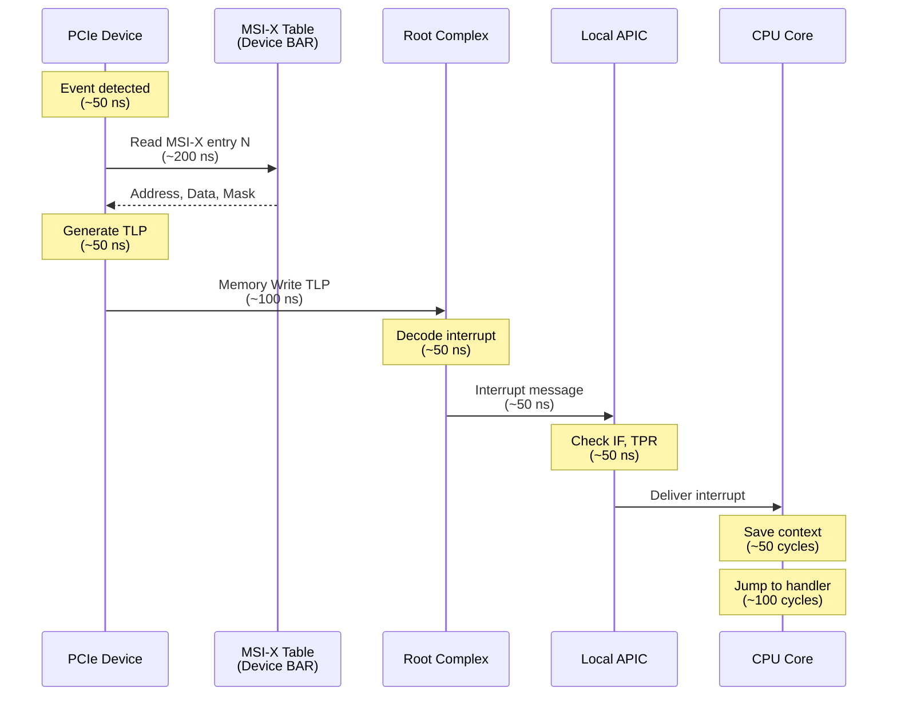

# Interrupts

This chapter covers interrupt handling at the Intel CPU and hardware level, focusing on the architecture and mechanisms that enable devices to signal the processor. For kernel-level interrupt handling implementation details, see [Linux Interrupt Handling](./linux_interrupts.md).

## Overview

**Interrupts** are hardware signals that notify the CPU of events requiring immediate attention. They are fundamental to modern computing, enabling asynchronous I/O, preemptive multitasking, and efficient device communication.

### What Are Interrupts?

At the hardware level, an interrupt is a mechanism by which a device or internal CPU component can request processor attention:

- **Device interrupts**: Network packet arrival, disk I/O completion, timer expiration
- **Inter-processor interrupts (IPIs)**: CPU-to-CPU signaling for TLB shootdowns, scheduling
- **Exceptions**: Page faults, divide-by-zero, debug traps

Unlike polling (where the CPU repeatedly checks device status), interrupts allow the CPU to perform other work until a device signals completion.

### Historical Evolution

The x86 interrupt architecture has evolved significantly:

**8259 PIC (Programmable Interrupt Controller)**
- Original IBM PC design (1981)
- Two cascaded 8259 chips = 15 interrupt lines
- **Limitations**:
  - Fixed priority scheme
  - No support for SMP (Symmetric Multi-Processing)
  - Limited to 15 interrupt vectors
  - Requires serial acknowledgment protocol (slow)

**APIC (Advanced Programmable Interrupt Controller)**
- Introduced with Pentium (1993)
- Composed of:
  - **Local APIC (LAPIC)**: One per CPU core
  - **I/O APIC**: Centralized device interrupt router
- **Improvements**:
  - 240+ interrupt vectors (vs 15 in PIC)
  - SMP support with per-CPU LAPICs
  - Inter-processor interrupts (IPIs)
  - Flexible priority and routing
  - Message-based interrupt delivery

**x2APIC (Extended xAPIC)**
- Introduced with Nehalem (2008)
- **Key improvements**:
  - 32-bit APIC IDs (vs 8-bit in xAPIC) → supports >255 CPUs
  - MSR-based register access (vs MMIO) → ~50 cycles faster
  - Required for systems with >255 logical processors
  - Cluster mode addressing for large systems

### Why Interrupts Matter for Performance

Interrupts are critical for I/O performance but introduce latency:

**Benefits:**
- Low-latency notification (vs polling loops)
- CPU can perform useful work instead of waiting
- Enables asynchronous I/O

**Costs:**
- Interrupt handling latency: **0.5-10 μs** depending on mechanism
- Context save/restore overhead: **50-200 cycles**
- Cache pollution from handler execution
- Potential for interrupt storms under high load

For high-performance systems, optimizing interrupt handling is essential:
- Modern NICs use **MSI-X** with per-queue vectors → **~1 μs latency**
- Legacy INTx shared interrupts → **~5-10 μs latency**
- Interrupt coalescing trades latency for throughput
- CPU affinity ensures cache-hot processing

### Chapter Scope

This chapter focuses on the **hardware architecture** of interrupts:

1. **APIC Architecture**: Local APIC, I/O APIC, x2APIC structures and operation
2. **Interrupt Mechanisms**: INTx, MSI, MSI-X generation and delivery
3. **Routing & Delivery**: How interrupts travel from device to CPU
4. **Priorities & Control**: Vector assignment, masking, preemption
5. **Performance**: Latency breakdowns, optimization techniques
6. **Advanced Topics**: VT-d interrupt remapping, posted interrupts, NMI

**What this chapter does NOT cover:**
- Kernel software implementation (see [Linux Interrupt Handling](./linux_interrupts.md))
- Driver-level interrupt handling
- Specific device interrupt details (see [NICs](./nics.md), [PCIe](./pcie.md))

### Relationship to Other Chapters

- **[PCIe](./pcie.md)**: How PCIe devices generate interrupts (MSI/MSI-X TLPs)
- **[DMA & IOMMU](./dma.md)**: VT-d interrupt remapping for security and virtualization
- **[Linux Interrupt Handling](./linux_interrupts.md)**: Kernel software layers (softirq, NAPI, workqueues)
- **[Kernel Latency](./latency.md)**: Impact of interrupt handling on end-to-end latency
- **[NICs](./nics.md)**: Interrupt coalescing and multi-queue configurations

## APIC Architecture

The **Advanced Programmable Interrupt Controller (APIC)** is the interrupt controller architecture used in modern x86 systems. It consists of multiple components working together to deliver interrupts from devices to CPU cores.

### Local APIC (LAPIC)

Every CPU core has its own **Local APIC** that handles interrupt delivery to that core. The LAPIC also provides timing functions and inter-processor interrupt capabilities.

#### LAPIC Register Layout

The LAPIC is memory-mapped at a fixed address (default **0xFEE00000**) in physical memory. Key registers include:

```c
/* From arch/x86/include/asm/apicdef.h */
#define APIC_BASE_MSR           0x1B
#define APIC_DEFAULT_PHYS_BASE  0xFEE00000

/* Register offsets from APIC base */
#define APIC_ID         0x020    /* Local APIC ID Register */
#define APIC_LVR        0x030    /* Local APIC Version Register */
#define APIC_TASKPRI    0x080    /* Task Priority Register (TPR) */
#define APIC_PROCPRI    0x0A0    /* Processor Priority Register (PPR) */
#define APIC_EOI        0x0B0    /* End Of Interrupt Register */
#define APIC_LDR        0x0D0    /* Logical Destination Register */
#define APIC_DFR        0x0E0    /* Destination Format Register */
#define APIC_SPIV       0x0F0    /* Spurious Interrupt Vector Register */
#define APIC_ISR        0x100    /* In-Service Register (256 bits, 8 32-bit regs) */
#define APIC_TMR        0x180    /* Trigger Mode Register (256 bits) */
#define APIC_IRR        0x200    /* Interrupt Request Register (256 bits) */
#define APIC_ESR        0x280    /* Error Status Register */
#define APIC_ICR        0x300    /* Interrupt Command Register (64 bits) */
#define APIC_ICR2       0x310    /* Interrupt Command Register High */
#define APIC_LVTT       0x320    /* LVT Timer Register */
#define APIC_LVTTHMR    0x330    /* LVT Thermal Monitor Register */
#define APIC_LVTPC      0x340    /* LVT Performance Counter Register */
#define APIC_LVT0       0x350    /* LVT LINT0 Register */
#define APIC_LVT1       0x360    /* LVT LINT1 Register */
#define APIC_LVTERR     0x370    /* LVT Error Register */
#define APIC_TMICT      0x380    /* Initial Count Register (for timer) */
#define APIC_TMCCT      0x390    /* Current Count Register (for timer) */
#define APIC_TDCR       0x3E0    /* Divide Configuration Register */
```

**ID Register (offset 0x20):**
```
Bits 31-24: APIC ID (xAPIC mode)
Bits 23-0:  Reserved
```

In xAPIC mode, only 8 bits are used for APIC ID, limiting systems to 256 logical processors.

**Task Priority Register (TPR, offset 0x80):**
```
Bits 7-4: Task Priority Class
Bits 3-0: Task Priority Sub-Class
Bits 31-8: Reserved
```

The TPR sets the minimum priority level for interrupts to be delivered to this CPU. Interrupts with priority ≤ TPR are held pending.

**End-of-Interrupt Register (EOI, offset 0xB0):**
```
Write any value to signal interrupt completion
```

Writing to EOI signals the LAPIC that the current interrupt has been serviced, allowing lower-priority interrupts to be delivered.

**Interrupt Command Register (ICR, offset 0x300/0x310):**

Used to send inter-processor interrupts (IPIs):

```
ICR Low (0x300):
Bits 7-0:   Vector
Bits 10-8:  Delivery Mode
            000 = Fixed
            001 = Lowest Priority
            010 = SMI
            011 = Reserved
            100 = NMI
            101 = INIT
            110 = Start-Up (SIPI)
            111 = Reserved
Bit 11:     Destination Mode (0=Physical, 1=Logical)
Bit 12:     Delivery Status (0=Idle, 1=Send Pending)
Bit 13:     Reserved
Bit 14:     Level (0=Deassert, 1=Assert)
Bit 15:     Trigger Mode (0=Edge, 1=Level)
Bits 17-16: Reserved
Bits 19-18: Destination Shorthand
            00 = No shorthand
            01 = Self
            10 = All including self
            11 = All excluding self
Bits 31-20: Reserved

ICR High (0x310):
Bits 31-24: Destination Field (xAPIC)
Bits 23-0:  Reserved
```

**Local Vector Table (LVT):**

The LVT configures local interrupt sources:

```c
/* LVT entry format */
Bits 7-0:   Vector
Bits 10-8:  Delivery Mode
Bit 12:     Delivery Status
Bit 13:     Interrupt Input Pin Polarity
Bit 14:     Remote IRR
Bit 15:     Trigger Mode
Bit 16:     Mask (0=unmasked, 1=masked)
Bits 17-18: Timer Mode (LVTT only)
```

Each LVT entry controls a local interrupt source:
- **LVTT**: APIC timer interrupts
- **LVTTHMR**: Thermal sensor interrupts
- **LVTPC**: Performance counter overflow interrupts
- **LVT0/LVT1**: External interrupt pins (LINT0/LINT1)
- **LVTERR**: APIC internal error interrupts

#### LAPIC Addressing Modes

**Physical Mode:**
- Destination is an explicit APIC ID
- Interrupt delivered to CPU with matching APIC ID
- Used for directed interrupts (e.g., specific CPU targeting)

**Logical Mode:**
- Destination is a logical group
- Configured via Logical Destination Register (LDR) and Destination Format Register (DFR)
- Allows multicast interrupts (one interrupt → multiple CPUs)
- Two schemes:
  - **Flat Model**: Up to 8 CPUs, each with a bit in an 8-bit mask
  - **Cluster Model**: Up to 60 CPUs organized in clusters

#### LAPIC Timer

The LAPIC includes a programmable timer used by the kernel for:
- Scheduler tick (preemption)
- High-resolution timers
- Deadline-based scheduling

> For kernel scheduler tick implementation, timer interrupt handling, and high-resolution timer details, see [Linux Interrupt Handling](./linux_interrupts.md) and [Scheduler](./scheduler.md).

```c
/* Timer operation */
1. Write divide value to TDCR (Divide Configuration Register)
2. Set LVTT with vector and mode (one-shot, periodic, TSC-deadline)
3. Write initial count to TMICT
4. Timer counts down from TMICT to 0, then fires interrupt
5. Read current count from TMCCT
```

**Timer modes:**
- **One-shot**: Count down once, fire interrupt, stop
- **Periodic**: Count down, fire interrupt, reload TMICT, repeat
- **TSC-Deadline**: Fire interrupt when TSC reaches specified value (most accurate)

#### LAPIC Initialization

Typical LAPIC initialization sequence:

```c
/* From arch/x86/kernel/apic/apic.c */

1. Enable LAPIC via IA32_APIC_BASE MSR (bit 11 = global enable, bit 10 = BSP)
2. Set Spurious Interrupt Vector Register (SPIV):
   - Bit 8: APIC Software Enable (1 = enabled)
   - Bits 7-0: Spurious vector number (usually 0xFF)
3. Configure LVT entries (timer, error, performance counter, thermal)
4. Set Task Priority Register (TPR) to 0 (accept all interrupts)
5. Clear Error Status Register (ESR)
```

**Latency Considerations:**

- **LAPIC message delivery**: ~50-100 ns from reception to CPU interrupt
- **LAPIC message acceptance**: ~50 ns processing time
- **MMIO register access** (xAPIC): ~80-100 cycles (~30-40 ns @ 3 GHz)
- **MSR register access** (x2APIC): ~30-50 cycles (~10-20 ns @ 3 GHz)

The LAPIC's low latency is critical for fast interrupt delivery, especially with modern devices generating millions of interrupts per second.

### I/O APIC

The **I/O APIC** is a centralized interrupt controller that receives interrupts from external devices and routes them to one or more Local APICs. Unlike the distributed LAPICs (one per CPU), a system typically has 1-4 I/O APICs.

#### I/O APIC Registers

The I/O APIC uses **indirect register access**:

```c
/* Memory-mapped registers */
#define IOAPIC_IOREGSEL     0x00    /* Register Select */
#define IOAPIC_IOWIN        0x10    /* Register Window (data) */

/* Indirect register addresses (written to IOREGSEL) */
#define IOAPIC_ID           0x00    /* I/O APIC ID */
#define IOAPIC_VER          0x01    /* Version */
#define IOAPIC_ARB          0x02    /* Arbitration ID */
#define IOAPIC_REDTBL       0x10    /* Redirection Table (base) */
```

**Access pattern:**
```c
/* Read I/O APIC register */
static inline u32 io_apic_read(u32 reg) {
    writel(reg, IOAPIC_IOREGSEL);
    return readl(IOAPIC_IOWIN);
}

/* Write I/O APIC register */
static inline void io_apic_write(u32 reg, u32 value) {
    writel(reg, IOAPIC_IOREGSEL);
    writel(value, IOAPIC_IOWIN);
}
```

**Version Register:**
```
Bits 7-0:   Version (typically 0x11 or 0x20)
Bits 15-8:  Reserved
Bits 23-16: Maximum Redirection Entry (N-1, where N = number of pins)
Bits 31-24: Reserved
```

Most I/O APICs have 24 redirection entries (pins 0-23), but some server chipsets have 48 or more.

#### Redirection Table

The **Redirection Table** is the core of the I/O APIC, with one entry per interrupt pin. Each entry is 64 bits (accessed as two 32-bit registers):

```c
/* Redirection Table Entry (RTE) format */

Low 32 bits (IOAPIC_REDTBL + 2*pin):
Bits 7-0:   Interrupt Vector (0-255)
Bits 10-8:  Delivery Mode
            000 = Fixed
            001 = Lowest Priority
            010 = SMI
            011 = Reserved
            100 = NMI
            101 = INIT
            110 = Reserved
            111 = ExtINT (8259 compatibility)
Bit 11:     Destination Mode (0=Physical, 1=Logical)
Bit 12:     Delivery Status (read-only, 0=Idle, 1=Pending)
Bit 13:     Interrupt Input Pin Polarity (0=Active High, 1=Active Low)
Bit 14:     Remote IRR (read-only, for level-triggered)
Bit 15:     Trigger Mode (0=Edge, 1=Level)
Bit 16:     Mask (0=Unmasked, 1=Masked)
Bits 31-17: Reserved

High 32 bits (IOAPIC_REDTBL + 2*pin + 1):
Bits 31-24: Destination (APIC ID in physical mode, logical set in logical mode)
Bits 23-0:  Reserved
```

**Example RTE configuration:**

```c
/* Route IRQ 16 to vector 0x30 on CPU 0 */
union ioapic_rte {
    struct {
        u64 vector              : 8;
        u64 delivery_mode       : 3;
        u64 dest_mode           : 1;
        u64 delivery_status     : 1;
        u64 polarity            : 1;
        u64 remote_irr          : 1;
        u64 trigger             : 1;
        u64 mask                : 1;
        u64 reserved1           : 39;
        u64 destination         : 8;
    };
    struct {
        u32 low;
        u32 high;
    };
};

struct ioapic_rte rte = {
    .vector = 0x30,
    .delivery_mode = 0,  /* Fixed */
    .dest_mode = 0,      /* Physical */
    .polarity = 0,       /* Active high */
    .trigger = 0,        /* Edge */
    .mask = 0,           /* Unmasked */
    .destination = 0,    /* APIC ID 0 */
};
```

#### Pin-Based Interrupts

Legacy devices connect to I/O APIC pins:

- **ISA IRQs**: IRQ 0-15 typically mapped to I/O APIC pins 0-15
  - IRQ 0: Timer
  - IRQ 1: Keyboard
  - IRQ 2: Cascade from second 8259 (unused in APIC mode)
  - IRQ 8: RTC
  - Others: COM ports, LPT ports, sound cards, etc.

- **PCI INTx**: PCI devices' INTA#-INTD# pins routed to I/O APIC pins 16-23+
  - Routing defined in ACPI tables (MADT, _PRT methods)
  - Multiple devices can share pins (level-triggered interrupts)

#### Multiple I/O APICs

Large systems may have multiple I/O APICs:

- **Chipset I/O APIC**: Handles legacy devices and integrated peripherals
- **PCIe Root Complex I/O APICs**: One per root complex, handles PCIe INTx
- Each I/O APIC has its own ID and pin range

The kernel discovers I/O APICs via:
- **ACPI MADT (Multiple APIC Description Table)**: Lists all I/O APICs with addresses and interrupt bases
- **MP Table** (older systems): Legacy multi-processor specification

#### I/O APIC Interrupt Flow

```
1. Device asserts interrupt pin (or sends INTx message for PCIe)
2. I/O APIC receives interrupt on specific pin
3. I/O APIC looks up Redirection Table Entry for that pin
4. If masked: ignore
5. If unmasked: read destination, vector, delivery mode
6. I/O APIC sends interrupt message to target LAPIC(s)
7. LAPIC delivers to CPU
8. For level-triggered: I/O APIC sets Remote IRR bit
9. CPU handler acknowledges interrupt, writes EOI to LAPIC
10. LAPIC notifies I/O APIC
11. I/O APIC clears Remote IRR bit
```

**Latency:**
- **I/O APIC processing**: ~100-200 ns
- **I/O APIC to LAPIC message**: ~50-100 ns
- **Total I/O APIC overhead**: ~150-300 ns (on top of LAPIC delivery)

### x2APIC

**x2APIC** is an extended APIC mode introduced to overcome xAPIC limitations in large systems.

#### Why x2APIC?

**xAPIC Limitations:**
- 8-bit APIC IDs → max 255 logical processors
- MMIO register access → slower than MSRs
- Flat logical mode limited to 8 CPUs
- Becoming inadequate for modern servers (128+ core systems)

**x2APIC Solutions:**
- 32-bit APIC IDs → support 2^32 logical processors
- MSR-based registers → faster access
- Extended cluster mode for large-scale logical addressing
- Mandatory for systems with >255 processors

#### x2APIC Mode

x2APIC is enabled via the **IA32_APIC_BASE** MSR:

```c
#define MSR_IA32_APICBASE       0x1B

Bit 11: Global APIC Enable
Bit 10: x2APIC Mode (read-only after enabled)
Bit 8:  BSP Flag (Bootstrap Processor)
Bits 35-12: APIC Base Address (xAPIC mode only)
```

**Transition sequence:**
```
xAPIC disabled → xAPIC enabled → x2APIC enabled
```

Once x2APIC is enabled, it cannot be disabled without a CPU reset. Systems boot in xAPIC mode and the kernel transitions to x2APIC during initialization if supported.

#### x2APIC MSR Register Map

In x2APIC mode, APIC registers are accessed via MSRs instead of MMIO:

```c
/* MSR addresses for x2APIC registers */
#define MSR_X2APIC_BASE         0x800

#define MSR_X2APIC_ID           (MSR_X2APIC_BASE + 0x02)
#define MSR_X2APIC_VERSION      (MSR_X2APIC_BASE + 0x03)
#define MSR_X2APIC_TPR          (MSR_X2APIC_BASE + 0x08)
#define MSR_X2APIC_PPR          (MSR_X2APIC_BASE + 0x0A)
#define MSR_X2APIC_EOI          (MSR_X2APIC_BASE + 0x0B)
#define MSR_X2APIC_LDR          (MSR_X2APIC_BASE + 0x0D)
#define MSR_X2APIC_SIVR         (MSR_X2APIC_BASE + 0x0F)
#define MSR_X2APIC_ISR0         (MSR_X2APIC_BASE + 0x10)
/* ... ISR1-ISR7 ... */
#define MSR_X2APIC_TMR0         (MSR_X2APIC_BASE + 0x18)
/* ... TMR1-TMR7 ... */
#define MSR_X2APIC_IRR0         (MSR_X2APIC_BASE + 0x20)
/* ... IRR1-IRR7 ... */
#define MSR_X2APIC_ESR          (MSR_X2APIC_BASE + 0x28)
#define MSR_X2APIC_ICR          (MSR_X2APIC_BASE + 0x30)  /* 64-bit, single MSR */
#define MSR_X2APIC_LVT_TIMER    (MSR_X2APIC_BASE + 0x32)
#define MSR_X2APIC_LVT_THERMAL  (MSR_X2APIC_BASE + 0x33)
#define MSR_X2APIC_LVT_PMI      (MSR_X2APIC_BASE + 0x34)
#define MSR_X2APIC_LVT_LINT0    (MSR_X2APIC_BASE + 0x35)
#define MSR_X2APIC_LVT_LINT1    (MSR_X2APIC_BASE + 0x36)
#define MSR_X2APIC_LVT_ERROR    (MSR_X2APIC_BASE + 0x37)
#define MSR_X2APIC_TIMER_ICR    (MSR_X2APIC_BASE + 0x38)
#define MSR_X2APIC_TIMER_CCR    (MSR_X2APIC_BASE + 0x39)
#define MSR_X2APIC_TIMER_DCR    (MSR_X2APIC_BASE + 0x3E)
#define MSR_X2APIC_SELF_IPI     (MSR_X2APIC_BASE + 0x3F)
```

**MSR access example:**
```c
/* Read APIC ID in x2APIC mode */
static inline u32 x2apic_read_id(void) {
    u32 low, high;
    rdmsr(MSR_X2APIC_ID, low, high);
    return low;  /* Full 32-bit ID in low bits */
}

/* Write EOI */
static inline void x2apic_send_EOI(void) {
    wrmsr(MSR_X2APIC_EOI, 0, 0);
}
```

#### x2APIC ID Format

In x2APIC mode, the APIC ID is a full 32-bit value:

```
Bits 31-0: APIC ID (uniquely identifies logical processor)
```

The ID is typically constructed from CPU topology:
```
Bits [high:N]: Socket ID
Bits [N-1:M]: Core ID within socket
Bits [M-1:0]: Thread ID within core
```

Example on a 2-socket, 32-core-per-socket, 2-thread-per-core system:
```
Bit 31:    Socket (0 or 1)
Bits 30-25: Core (0-31)
Bit 24:    Thread (0 or 1)
```

#### x2APIC Logical Addressing (Cluster Mode)

x2APIC logical mode uses hierarchical clustering:

```
Logical Destination Register (LDR) format:
Bits 31-16: Cluster ID (65536 possible clusters)
Bits 15-0:  Logical ID within cluster (bitmask, up to 16 CPUs per cluster)
```

This allows addressing up to 65536 × 16 = 1,048,576 logical processors with multicast capability.

#### x2APIC Interrupt Command Register (ICR)

In x2APIC mode, the ICR is a single 64-bit MSR:

```
MSR_X2APIC_ICR (0x830):
Bits 7-0:   Vector
Bits 10-8:  Delivery Mode
Bit 11:     Destination Mode
Bit 14:     Level
Bit 15:     Trigger Mode
Bits 17-16: Reserved
Bits 19-18: Destination Shorthand
Bits 31-20: Reserved
Bits 63-32: Destination (full 32-bit APIC ID)
```

**Simplified IPI sending:**
```c
/* xAPIC: write ICR high, then low (two MMIO writes) */
writel(dest << 24, APIC_ICR2);
writel(vector | delivery_mode, APIC_ICR);

/* x2APIC: write single 64-bit MSR */
wrmsr(MSR_X2APIC_ICR, vector | delivery_mode, dest);
```

This is faster and atomic, eliminating race conditions.

#### x2APIC Self-IPI

x2APIC adds a dedicated self-IPI register for fast local interrupts:

```c
MSR_X2APIC_SELF_IPI (0x83F):
Bits 7-0:   Vector
Bits 63-8:  Reserved
```

**Usage:**
```c
/* Send vector 0x40 to self */
wrmsr(MSR_X2APIC_SELF_IPI, 0x40, 0);
```

This is faster than using the full ICR with "self" shorthand.

#### x2APIC Performance Benefits

**MSR vs MMIO access latency:**

| Operation | xAPIC (MMIO) | x2APIC (MSR) | Improvement |
|-----------|--------------|--------------|-------------|
| Read APIC ID | ~80-100 cycles | ~30-50 cycles | ~2x faster |
| Write EOI | ~80-100 cycles | ~30-50 cycles | ~2x faster |
| Send IPI | ~150-200 cycles | ~80-120 cycles | ~1.5x faster |

**Why MSRs are faster:**
- MMIO requires:
  1. Address translation (page tables)
  2. Cache coherency protocol
  3. Memory ordering barriers
  4. Potential TLB/cache misses

- MSRs are:
  1. CPU-internal registers
  2. No memory bus traffic
  3. Direct CPU access

**Real-world impact:**
- On a 100-core system sending thousands of IPIs per second, x2APIC saves **up to ~10 ms per million IPIs**
- Enables efficient operation of systems with >255 cores (otherwise impossible)

#### x2APIC Availability and Detection

**Detection:**
```c
/* CPUID.01H:ECX[21] = 1 indicates x2APIC support */
static inline bool cpu_has_x2apic(void) {
    u32 eax, ebx, ecx, edx;
    cpuid(1, &eax, &ebx, &ecx, &edx);
    return ecx & (1 << 21);
}
```

**Kernel enablement:**
- Linux automatically uses x2APIC if available and beneficial
- Can be disabled with `nox2apic` boot parameter
- Required for systems with >255 CPUs (no fallback)

**Latency summary:**
- **MSR access**: ~30-50 cycles (~10-20 ns @ 3 GHz)
- **MMIO access** (xAPIC): ~80-100 cycles (~30-40 ns @ 3 GHz)
- **Savings**: ~50 cycles (~20 ns) per APIC operation

For interrupt-heavy workloads (millions of interrupts per second), this adds up to significant CPU time savings.

### Inter-Processor Interrupts (IPIs)

**Inter-Processor Interrupts** are a mechanism for one CPU to interrupt another CPU. IPIs are essential for SMP operating systems and are used extensively by the Linux kernel.

#### IPI Delivery Mechanism

IPIs are sent via the **Interrupt Command Register (ICR)** in the Local APIC.

**Basic IPI sending (xAPIC):**
```c
/* From arch/x86/kernel/apic/ipi.c */

static inline void __xapic_send_IPI_dest(unsigned int apicid, int vector,
                                           unsigned int dest_mode)
{
    unsigned long cfg;

    /* Construct ICR low value */
    cfg = __prepare_ICR(0, vector, dest_mode);

    /* Write destination to ICR high */
    native_apic_mem_write(APIC_ICR2, SET_APIC_DEST_FIELD(apicid));
    
    /* Write command to ICR low (triggers send) */
    native_apic_mem_write(APIC_ICR, cfg);
}
```

**x2APIC IPI sending:**
```c
static inline void __x2apic_send_IPI_dest(unsigned int apicid, int vector,
                                            unsigned int dest_mode)
{
    u64 cfg = __prepare_ICR(dest_mode, vector, dest_mode) |
              ((u64)apicid << 32);
    
    /* Single 64-bit MSR write */
    native_x2apic_icr_write(cfg, 0);
}
```

#### Destination Modes

**Physical Mode:**
- Destination specifies exact APIC ID
- IPI delivered to that specific CPU
- Most common for targeted IPIs

**Logical Mode:**
- Destination specifies logical group/cluster
- IPI delivered to all CPUs in the group
- Used for broadcasting to subsets of CPUs

**Destination Shorthand:**
- **No shorthand** (00): Use destination field
- **Self** (01): Send to self only
- **All including self** (10): Broadcast to all CPUs
- **All excluding self** (11): Broadcast to all other CPUs

#### IPI Delivery Modes

The delivery mode field in ICR determines how the IPI is processed:

**Fixed (000):**
- Deliver interrupt with specified vector
- Most common mode for general-purpose IPIs
- Example: TLB shootdown, scheduler wake-up

**NMI (100):**
- Deliver as Non-Maskable Interrupt
- Ignores interrupt flag (IF) and TPR
- Used for critical events (panics, profiling, deadlock detection)

**INIT (101):**
- Initialize target processor
- Resets CPU to initial state
- Used during CPU hotplug and system initialization

**SIPI - Startup (110):**
- Start-Up IPI
- Boots a halted CPU and sets initial instruction pointer
- Vector field contains memory page (real mode address >> 12)
- Used to bring up secondary CPUs during boot

**Example SIPI sequence:**
```c
/* Wake up secondary CPU */
1. Send INIT IPI to target CPU (resets it)
2. Wait 10 ms
3. Send SIPI with vector = (startup_code_address >> 12)
4. Wait 200 μs
5. Send second SIPI (per Intel spec, for reliability)
6. Secondary CPU begins executing at startup_code_address
```

**SMI (010):**
- System Management Interrupt
- Enters System Management Mode (SMM)
- Reserved for BIOS/firmware use

#### Common Kernel IPI Uses

**1. TLB Shootdowns:**

When a CPU modifies page tables, other CPUs' TLBs may have stale entries:

```c
/* From arch/x86/mm/tlb.c */

void flush_tlb_mm_range(struct mm_struct *mm, unsigned long start,
                         unsigned long end, unsigned int stride_shift,
                         bool freed_tables)
{
    /* ... */
    
    /* Send IPI to all CPUs using this mm */
    on_each_cpu_mask(mm_cpumask(mm), flush_tlb_func_remote, &info, 1);
}
```

**Flow:**
1. CPU 0 changes page tables
2. CPU 0 sends "flush TLB" IPI to all other CPUs
3. Each CPU receives IPI, flushes its TLB, sends EOI
4. CPU 0 waits for all acknowledgments
5. CPU 0 continues (page tables now safe)

**Cost:**
- Single TLB shootdown: ~1-3 μs per remote CPU
- 64-core system: ~64-200 μs per shootdown
- High-frequency operations (e.g., munmap in loop) can cause IPI storms

**2. Scheduler IPIs:**

The scheduler sends IPIs to wake up idle CPUs or migrate tasks:

```c
/* From kernel/sched/core.c */

static void ttwu_queue_wakelist(struct task_struct *p, int cpu)
{
    /* Add task to target CPU's wake list */
    __smp_call_single_queue(cpu, llist_add(&p->wake_entry, &per_cpu(call_single_queue, cpu)));
    
    /* Send IPI to wake target CPU */
    send_call_function_single_ipi(cpu);
}
```

**Use cases:**
- Wake idle CPU to run newly-runnable task
- Notify CPU of priority change
- Force preemption check on remote CPU

**3. smp_call_function:**

Execute a function on remote CPUs:

```c
/* From kernel/smp.c */

void smp_call_function_single(int cpu, smp_call_func_t func, 
                                void *info, int wait)
{
    struct __call_single_data *csd;
    
    csd = &per_cpu(csd_data, cpu);
    csd->func = func;
    csd->info = info;
    
    /* Send IPI */
    arch_send_call_function_single_ipi(cpu);
    
    /* Optionally wait for completion */
    if (wait)
        csd_lock_wait(csd);
}
```

**Common uses:**
- Update per-CPU data structures
- Stop CPUs for kernel debugging (kdb, kgdb)
- CPU hotplug operations
- Performance counter programming

**4. Stop/Restart CPUs:**

```c
/* Halt all CPUs except this one */
int stop_machine(cpu_stop_fn_t fn, void *data, const struct cpumask *cpus)
{
    /* Send IPI to all target CPUs */
    /* CPUs enter busy-wait loop */
    /* Execute fn on designated CPU */
    /* Release other CPUs */
}
```

Used for:
- Module loading/unloading (patch kernel code)
- CPU hotplug
- Firmware updates

> For details on how the Linux kernel uses IPIs in the scheduler (load balancing, task migration), softirq processing (ksoftirqd wakeups), and workqueue system, see [Linux Interrupt Handling](./linux_interrupts.md) and [Scheduler](./scheduler.md).

#### IPI Latency

**Breakdown by Component:**

```
Total IPI latency = Sender overhead + Transmission + Receiver overhead
```

**1. Sender Overhead (~100-200 cycles):**
- Prepare ICR value: ~20 cycles
- Write to APIC registers:
  - xAPIC: ~80-100 cycles (MMIO write)
  - x2APIC: ~30-50 cycles (MSR write)
- Wait for delivery status: ~50 cycles

**2. Transmission (~200-500 cycles):**
- Local APIC message generation: ~50 cycles
- Bus/interconnect traversal:
  - Same socket (QPI/UPI within package): ~100-200 cycles
  - Cross-socket (inter-package link): ~300-500 cycles
  - NUMA remote node: ~500-1000 cycles

**3. Receiver Overhead (~1000-2500 cycles):**
- LAPIC acceptance: ~50 cycles
- Interrupt dispatch (IDT lookup, privilege check): ~100-200 cycles
- Context save (registers, flags): ~100-200 cycles
- Kernel entry/exit overhead (PTI, mitigations): ~200-500 cycles
- Cache/TLB effects: ~100-300 cycles
- Handler execution: ~200-500 cycles (varies)
- Context restore: ~100-200 cycles
- EOI write: ~30-100 cycles

**Latency by Topology:**

| Configuration | Latency | Notes |
|---------------|---------|-------|
| Same core (SMT/hyperthreading) | 0.5-1 μs | Shared L1/L2 cache |
| Same socket, different core | 1-2 μs | L3 cache shared |
| Different socket, same node | 3-6 μs | QPI/UPI inter-socket |
| Different NUMA node | 5-10 μs | Remote memory access |
| x2APIC vs xAPIC improvement | 15-20% | MSR vs MMIO |

**Real measurements (Intel Xeon Platinum 8280, 3 GHz):**
```
Same socket IPI:      1.2 μs (3600 cycles)
Cross-socket IPI:     4.8 μs (14400 cycles)
Remote NUMA node IPI: 7.5 μs (22500 cycles)
```

#### IPI Scalability Concerns

**IPI Storms:**

In large systems (100+ cores), IPIs can become a bottleneck:

**Example: TLB shootdown on 64-core system:**
```
Operation: munmap() of a single page
Result:    1 CPU sends IPI to 63 other CPUs

Cost Analysis:
  Aggregate CPU time: 63 × ~2 μs = ~126 μs (total CPU cycles consumed)
  Wall-clock latency: ~10-20 μs (sender overhead + slowest target + coordination)
```

For frequent operations (e.g., memory allocator), this is devastating. In the worst
case a sequence of allocations might require mmap():
```
Application: malloc/free in a loop (1000 iterations)
Result:      1000 TLB shootdowns = 63,000 IPIs
Latency:     63,000 × 2 μs = 126 ms (!!!)
```

**IPI Storm Symptoms:**
- High CPU time in kernel mode
- `perf top` shows `flush_tlb_func_remote`, `smp_call_function`, `generic_exec_single`
- Poor scalability beyond certain core count

**Mitigation Strategies:**

**1. Batching:**
```c
/* Instead of: */
for (i = 0; i < 1000; i++) {
    unmap_page(page[i]);  /* Each sends IPI */
}

/* Do: */
for (i = 0; i < 1000; i++) {
    mark_page_for_unmap(page[i]);
}
flush_tlb_all();  /* Single IPI */
```

**2. Lazy TLB Invalidation:**
```c
/* Don't flush immediately */
/* Mark TLB as "needs flush" */
/* Flush on next context switch or page fault */
```

Used by Linux for kernel threads that don't have their own mm_struct.

**3. RCU (Read-Copy-Update):**
```c
/* Instead of locking + IPI: */
old = data;
new = update(old);
rcu_assign_pointer(data, new);
synchronize_rcu();  /* Wait for readers, no IPI */
free(old);
```

RCU avoids IPIs by deferring synchronization to context switch points.

**4. Per-CPU Data Structures:**
```c
/* Avoid cross-CPU operations */
DEFINE_PER_CPU(struct data, my_data);

/* Each CPU operates on its own data, no IPIs */
get_cpu_var(my_data).counter++;
put_cpu_var(my_data);
```

**5. Interrupt Affinityand Task Pinning:**
```c
/* Pin task to specific CPUs */
taskset -c 0-7 ./workload

/* Avoid cross-NUMA IPIs */
numactl --cpunodebind=0 --membind=0 ./workload
```

#### IPI Performance Comparison

| Operation | Latency | Cost Equivalent |
|-----------|---------|-----------------|
| IPI (same socket) | 1-3 μs | ~3000-9000 cycles @ 3 GHz |
| IPI (cross socket) | 3-6 μs | ~9000-18000 cycles |
| IPI (remote NUMA) | 5-10 μs | ~15000-30000 cycles |
| Device interrupt (MSI-X) | 0.5-2 μs | Often faster than IPI! |
| Context switch | 1-3 μs | Similar cost to IPI |
| Mutex (uncontended) | 20-50 ns | 50-100× faster |
| Atomic operation (local) | 10-30 ns | 100-300× faster |
| System call | 50-150 ns | 10-30× faster |
| TLB shootdown (64 cores) | 100-640 μs | Major bottleneck |
| Function call | 2-10 ns | 500-1000× faster |

**Key Takeaway:** IPIs are expensive. They're comparable to context switches and often more expensive than device interrupts. Kernel code must minimize IPI usage for scalability.

#### IPI Overhead in Perspective

**Example: High-performance packet processing on 64-core system:**

```
Scenario: 10 Gbps traffic, 64-byte packets = 14.88 Mpps
Per-core rate: 14.88 Mpps / 64 = 232,500 pps per core
Per-packet budget: 1 / 232,500 = 4.3 μs

IPI cost: ~2-10 μs
Conclusion: A single IPI consumes 50-230% of per-packet budget!
```

This is why high-performance networking avoids IPIs:
- Pin interrupts to specific CPUs
- Use per-CPU queues
- Avoid cross-CPU synchronization
- Use lock-free algorithms
- Employ kernel bypass (DPDK)

**TLB Shootdown Impact:**

```
Operation: Application frequently calls mmap/munmap
System: 64-core server
Measurement: perf stat -a -e 'smp:smp_*' sleep 10

Result:
  smp:smp_call_function_single: 5,234,123 calls
  Average cost per call: ~2 μs
  Total time: 5,234,123 × 2 μs = 10.5 seconds (!!!)

Impact: 10.5 seconds of CPU time spent on IPIs in 10 seconds of wall time
```

This is why:
- `mmap`/`munmap` are relatively expensive
- Memory allocation uses per-thread caches (tcmalloc, jemalloc)
- Huge pages reduce TLB pressure and shootdowns

## Interrupt Mechanisms

This section covers how devices actually generate interrupts, from legacy pin-based interrupts to modern message-based mechanisms.

### Legacy Interrupts (INTx)

**INTx** refers to the traditional PCI interrupt mechanism using dedicated physical pins. While largely superseded by MSI/MSI-X, INTx is still used by legacy devices and provides backward compatibility.

#### Physical INTx Pins

Traditional PCI devices have four interrupt pins:

```
INTA#, INTB#, INTC#, INTD#
```

- **Active-low signals**: Asserted by driving low (# suffix indicates active-low)
- **Shared interrupts**: Multiple devices can connect to the same interrupt line
- **Routing**: Pins are routed through PCI bus hierarchy to interrupt controller

**PCI INTx Routing Example:**

```
Device A (slot 1): INTA# → IRQ 16
Device B (slot 2): INTA# → IRQ 17
Device C (slot 3): INTA# → IRQ 18
Device D (slot 1): INTB# → IRQ 17  (shares with Device B's INTA#)
```

The routing is defined by the motherboard design and documented in ACPI tables (`_PRT` methods).

#### Edge vs Level-Triggered

**Edge-Triggered:**
- Interrupt is a pulse (0 → 1 or 1 → 0 transition)
- Controller detects the edge
- **Advantage**: Simple hardware
- **Disadvantage**: Can be lost if CPU/controller busy during pulse

**Level-Triggered:**
- Interrupt is a sustained signal level
- Pin held active until acknowledged
- **Advantage**: Reliable (cannot be lost)
- **Disadvantage**: Requires acknowledge mechanism
- **Standard for PCI**: Level-triggered, active-low

**Level-Triggered Flow:**

```
1. Device asserts INTA# (drives pin low)
2. I/O APIC detects low level on pin
3. I/O APIC sends interrupt to CPU
4. CPU runs interrupt handler
5. Handler services device (reads/writes device registers)
6. Device deasserts INTA# (releases pin to high)
7. I/O APIC sees pin go high, clears Remote IRR
```

If the device doesn't deassert, the interrupt is considered "spurious" or "stuck" and the kernel may disable it.

#### PCIe INTx Emulation

**PCIe has no physical interrupt pins.** All communication is via packets over the serial link. PCIe emulates INTx using in-band messages:

**Assert_INTx Message:**
```
Type: Message (Msg)
Routing: To Root Complex
Code: Assert_INTA / Assert_INTB / Assert_INTC / Assert_INTD
```

When a PCIe device wants to assert an interrupt:
1. Device sends `Assert_INTx` message TLP upstream
2. TLP propagates through switches to root complex
3. Root complex converts message to I/O APIC interrupt
4. I/O APIC delivers to CPU

**Deassert_INTx Message:**
```
Type: Message (Msg)
Routing: To Root Complex
Code: Deassert_INTA / Deassert_INTB / Deassert_INTC / Deassert_INTD
```

When the device no longer needs the interrupt:
1. Device sends `Deassert_INTx` message TLP
2. Root complex clears corresponding I/O APIC interrupt

This maintains compatibility with legacy software expecting level-triggered interrupts.

#### Shared Interrupts

Because only four INTx pins exist per device, and multiple devices often share the same I/O APIC pin, interrupt handlers must poll to determine the source:

```c
/* From drivers/net/ethernet/intel/e1000/e1000_main.c */

static irqreturn_t e1000_intr(int irq, void *data)
{
    struct net_device *netdev = data;
    struct e1000_adapter *adapter = netdev_priv(netdev);
    struct e1000_hw *hw = &adapter->hw;
    u32 icr = er32(ICR);  /* Read Interrupt Cause Register */
    
    if (!icr)
        return IRQ_NONE;  /* Not our interrupt */
    
    /* Handle our interrupt */
    /* ... */
    
    return IRQ_HANDLED;
}
```

When an interrupt fires on a shared line:
1. Kernel calls all handlers registered for that IRQ
2. Each handler checks its device's status register
3. If the device has a pending interrupt: handle it, return `IRQ_HANDLED`
4. If the device has no pending interrupt: return `IRQ_NONE`
5. If all handlers return `IRQ_NONE`: spurious interrupt (kernel may eventually disable IRQ)

**Performance Impact of Sharing:**
- Every interrupt requires polling all devices on the line
- Cache misses from accessing multiple device registers
- Higher latency than dedicated interrupts
- Risk of spurious interrupt storms

#### INTx Limitations

**1. Limited Vectors:**
- Only 4 interrupt pins per device
- Multi-queue devices (e.g., NICs with 32 RX queues) cannot use INTx effectively

**2. Shared Interrupts:**
- Multiple devices → polling required
- Higher latency and CPU overhead

**3. Configuration Complexity:**
- Interrupt routing depends on slot/motherboard
- Difficult to predict which IRQ a device will use
- ACPI parsing required

**4. High Latency:**
- PCIe message to root complex: ~100-200 ns
- Root complex to I/O APIC: ~100-200 ns
- I/O APIC processing: ~100-200 ns
- I/O APIC to LAPIC: ~50-100 ns
- LAPIC to CPU: ~50-100 ns
- Polling overhead: ~100-500 ns (for shared IRQs)
- **Total: ~5-10 μs**

**5. No per-vector control:**
- Cannot mask individual interrupt sources
- All or nothing for the device

### Message Signaled Interrupts (MSI)

**MSI** replaces pin-based interrupts with memory writes. This is simpler, faster, and more flexible.

#### MSI Concept

Instead of a physical pin, the device generates an interrupt by writing to a special memory address:

```
Device interrupt flow:
1. Device detects event (packet arrival, I/O completion)
2. Device performs Memory Write TLP to special address
3. Write is routed to interrupt controller (not actual memory)
4. Interrupt controller delivers to target CPU
```

**Key Advantages:**
- No shared interrupts (each device has unique address/data)
- No polling required
- Faster than INTx
- Simpler routing (just a memory write)

#### MSI Capability Structure

MSI is configured via a PCI capability structure in configuration space:

```c
/* PCI MSI Capability (Cap ID = 0x05) */

struct msi_capability {
    u8  cap_id;          /* 0x05 = MSI */
    u8  next_cap;        /* Pointer to next capability */
    u16 msg_ctrl;        /* Message Control */
    u32 msg_addr_lo;     /* Message Address (low 32 bits) */
    u32 msg_addr_hi;     /* Message Address (high 32 bits, if 64-bit) */
    u16 msg_data;        /* Message Data */
    u16 reserved;
    u32 mask_bits;       /* Mask Bits (if per-vector masking supported) */
    u32 pending_bits;    /* Pending Bits (if per-vector masking supported) */
};
```

**Message Control Register (offset +0x02):**

```
Bit 0:      MSI Enable (1 = MSI enabled, 0 = use INTx)
Bits 1-3:   Multiple Message Capable (read-only)
            000 = 1 vector
            001 = 2 vectors
            010 = 4 vectors
            011 = 8 vectors
            100 = 16 vectors
            101 = 32 vectors
Bits 4-6:   Multiple Message Enable (read-write)
            000 = 1 vector enabled
            001 = 2 vectors enabled
            ...
            (Software sets this based on allocation)
Bit 7:      64-bit Address Capable (read-only)
            0 = 32-bit address only
            1 = 64-bit address supported
Bit 8:      Per-Vector Masking Capable (read-only)
            0 = No per-vector masking
            1 = Mask bits supported
Bits 9-15:  Reserved
```

**Message Address Format (Intel/x86):**

The address encodes the target APIC and delivery mode:

```
Message Address (32-bit format):
Bits 31-20: 0xFEE (fixed prefix for interrupt region)
Bits 19-12: Destination ID (APIC ID in physical mode)
Bit 11-10:  Reserved (0)
Bit 9:      Reserved (0)
Bit 8:      Redirection Hint (RH)
            0 = No redirection
            1 = Allow redirection (for lowest priority mode)
Bits 7-4:   Reserved (0)
Bit 3:      Destination Mode (DM)
            0 = Physical (explicit APIC ID)
            1 = Logical (logical destination)
Bit 2:      Reserved (0)
Bits 1-0:   Reserved (must be 00)
```

**Example:**
```
Address for CPU 4 (APIC ID 0x04), physical mode:
  0xFEE00000 | (0x04 << 12) | (0 << 3) = 0xFEE04000
```

**Message Data Format:**

```
Bits 15:    Trigger Mode (0 = Edge, 1 = Level)
            (Usually 0 for MSI)
Bit 14:     Level (0 = Deassert, 1 = Assert)
            (Ignored for edge-triggered)
Bits 13-11: Reserved (0)
Bits 10-8:  Delivery Mode
            000 = Fixed
            001 = Lowest Priority
            010 = SMI
            011 = Reserved
            100 = NMI
            101 = INIT
            110 = Reserved
            111 = ExtINT
Bits 7-0:   Vector (interrupt vector number, 0x00-0xFF)
```

**Example:**
```
Vector 0x30, Fixed delivery, Edge-triggered:
  Data = 0x0030
```

#### MSI Configuration by Kernel

The kernel configures MSI during device initialization:

```c
/* From drivers/pci/msi/msi.c */

int pci_enable_msi(struct pci_dev *dev)
{
    int nvec;
    
    /* Find MSI capability */
    int pos = pci_find_capability(dev, PCI_CAP_ID_MSI);
    if (!pos)
        return -EINVAL;
    
    /* Read Multiple Message Capable */
    pci_read_config_word(dev, pos + PCI_MSI_FLAGS, &flags);
    nvec = 1 << ((flags & PCI_MSI_FLAGS_QMASK) >> 1);
    
    /* Allocate interrupt vector */
    int irq = pci_msi_alloc_irq(dev, nvec);
    
    /* Write Message Address and Data */
    u64 addr = msi_compose_address(cpu_to_apicid(target_cpu));
    u16 data = msi_compose_data(irq_to_vector(irq));
    
    pci_write_config_dword(dev, pos + PCI_MSI_ADDRESS_LO, (u32)addr);
    if (flags & PCI_MSI_FLAGS_64BIT)
        pci_write_config_dword(dev, pos + PCI_MSI_ADDRESS_HI, (u32)(addr >> 32));
    pci_write_config_word(dev, pos + PCI_MSI_DATA, data);
    
    /* Enable MSI */
    flags |= PCI_MSI_FLAGS_ENABLE;
    pci_write_config_word(dev, pos + PCI_MSI_FLAGS, flags);
    
    return 0;
}
```

> For how device drivers register interrupt handlers with `request_irq()`, handle MSI interrupts in hardirq/softirq context, and use threaded interrupt handlers, see [Linux Interrupt Handling](./linux_interrupts.md).

#### MSI Interrupt Generation

When the device wants to signal an interrupt:

```
1. Device writes Message Data to Message Address
2. Write becomes Memory Write TLP on PCIe
3. TLP header:
   - Type: Memory Write
   - Address: 0xFEExxxxx (MSI address)
   - Data: Vector + delivery mode
4. TLP travels upstream through switches
5. Root complex recognizes address as interrupt
6. Root complex decodes destination from address
7. Root complex sends interrupt message to target LAPIC
8. LAPIC delivers interrupt to CPU core
```

**No response required:** Memory writes are posted (no completion), so the device doesn't wait for acknowledgment. This keeps latency low.

#### Multiple MSI Vectors

MSI supports up to 32 vectors per device, allocated as a contiguous power-of-2 block:

**Allocation:**
```
Device requests: 4 vectors
Kernel allocates: Vectors 0x30, 0x31, 0x32, 0x33 (contiguous)
```

**Encoding:**
The Message Data base vector is programmed, and the device modifies the lower bits:

```
Base Message Data: 0x0030 (vector 0x30)

Device interrupt encoding:
  Vector 0: Message Data = 0x0030 | 0 = 0x0030
  Vector 1: Message Data = 0x0030 | 1 = 0x0031
  Vector 2: Message Data = 0x0030 | 2 = 0x0032
  Vector 3: Message Data = 0x0030 | 3 = 0x0033
```

**Limitations:**
- Must be contiguous and power-of-2 aligned
- Device must support multiple messages (check Multiple Message Capable)
- Kernel may not be able to allocate requested number (limited vectors)

#### MSI Masking

Basic MSI has **no per-vector masking**. To disable interrupts, the device must either:
1. Disable MSI entirely (clear MSI Enable bit)
2. Use device-specific registers to mask interrupt sources

Some MSI implementations support **Per-Vector Masking** (PVM):

```
Mask Bits Register (optional, +0x10 or +0x14):
  Bit N: Mask for vector N (1 = masked, 0 = unmasked)

Pending Bits Register (optional, +0x14 or +0x18):
  Bit N: Pending for vector N (1 = interrupt occurred while masked)
```

When an interrupt is masked, the device sets the corresponding pending bit. When unmasked, the device fires the interrupt if pending.

#### MSI Latency

**Breakdown:**

```
1. Device event detection:         50-100 ns
2. MSI capability read (cached):    50-100 ns
3. Memory Write TLP generation:     50-100 ns
4. PCIe transmission:               50-100 ns (per hop)
   - Device to switch: 50-100 ns
   - Switch to root complex: 50-100 ns
5. Root complex processing:         50-100 ns
6. Interrupt message to LAPIC:      50-100 ns
7. LAPIC delivery:                  50-100 ns
8. CPU interrupt acceptance:        50 ns

Total: ~1-3 μs (typical)
```

**Compared to INTx:**
- INTx: ~5-10 μs
- MSI: ~1-3 μs
- **MSI is 2-5× faster**

**Why faster?**
- No I/O APIC processing
- No shared interrupt polling
- Direct memory write (simpler protocol)
- Fewer hops in interrupt controller hierarchy

### MSI-X

**MSI-X** (MSI Extended) is an enhanced version of MSI that removes its limitations, enabling modern high-performance devices.

#### MSI-X Improvements

**Key Enhancements:**
1. **More vectors**: Up to 2048 (vs 32 for MSI)
2. **Independent configuration**: Each vector has its own address and data
3. **Per-vector masking**: Built-in mask/pending bits
4. **Separate BAR**: Table in device memory (not config space)
5. **Non-power-of-2 allocation**: Request exactly what you need

#### MSI-X Capability Structure

MSI-X is configured via a PCI capability (Cap ID = 0x11):

```c
/* PCI MSI-X Capability */

struct msix_capability {
    u8  cap_id;          /* 0x11 = MSI-X */
    u8  next_cap;        /* Pointer to next capability */
    u16 msg_ctrl;        /* Message Control */
    u32 table_offset;    /* Table Offset/BIR */
    u32 pba_offset;      /* PBA Offset/BIR */
};
```

**Message Control Register (+0x02):**

```
Bits 10-0:  Table Size (N-1, where N = number of entries)
            Example: 0x03F = 64 entries (0-63)
Bits 13-11: Reserved
Bit 14:     Function Mask
            1 = All vectors masked
            0 = Vectors controlled by per-entry mask bits
Bit 15:     MSI-X Enable
            1 = MSI-X enabled
            0 = MSI-X disabled (device uses INTx or MSI)
```

**Table Offset/BIR (+0x04):**

```
Bits 2-0:   BIR (BAR Indicator Register)
            000 = BAR0, 001 = BAR1, ..., 101 = BAR5
Bits 31-3:  Table Offset
            Offset within the BAR (8-byte aligned)
```

**PBA Offset/BIR (+0x08):**

```
Bits 2-0:   BIR (BAR Indicator Register)
Bits 31-3:  PBA Offset
            Offset within the BAR (8-byte aligned)
```

#### MSI-X Table

The **MSI-X Table** is an array of 16-byte entries in device memory (pointed to by BAR + Table Offset):

```c
/* MSI-X Table Entry (16 bytes) */

struct msix_entry {
    u32 msg_addr_lo;     /* +0x00: Message Address (low 32 bits) */
    u32 msg_addr_hi;     /* +0x04: Message Address (high 32 bits) */
    u32 msg_data;        /* +0x08: Message Data */
    u32 vector_ctrl;     /* +0x0C: Vector Control */
};
```

**Vector Control Register (+0x0C):**

```
Bit 0:      Mask Bit
            0 = Unmasked (interrupts enabled)
            1 = Masked (interrupts disabled)
Bits 31-1:  Reserved
```

**Example Table Layout:**

```
Assume BAR0 = 0xC0000000, Table Offset = 0x2000, 4 vectors

Entry 0 @ 0xC0002000:
  +0x00: msg_addr_lo  = 0xFEE00000  (CPU 0)
  +0x04: msg_addr_hi  = 0x00000000
  +0x08: msg_data     = 0x00000030  (Vector 0x30)
  +0x0C: vector_ctrl  = 0x00000000  (Unmasked)

Entry 1 @ 0xC0002010:
  +0x00: msg_addr_lo  = 0xFEE01000  (CPU 1)
  +0x04: msg_addr_hi  = 0x00000000
  +0x08: msg_data     = 0x00000031  (Vector 0x31)
  +0x0C: vector_ctrl  = 0x00000000  (Unmasked)

Entry 2 @ 0xC0002020:
  +0x00: msg_addr_lo  = 0xFEE02000  (CPU 2)
  +0x04: msg_addr_hi  = 0x00000000
  +0x08: msg_data     = 0x00000032  (Vector 0x32)
  +0x0C: vector_ctrl  = 0x00000000  (Unmasked)

Entry 3 @ 0xC0002030:
  +0x00: msg_addr_lo  = 0xFEE03000  (CPU 3)
  +0x04: msg_addr_hi  = 0x00000000
  +0x08: msg_data     = 0x00000033  (Vector 0x33)
  +0x0C: vector_ctrl  = 0x00000000  (Unmasked)
```

Notice:
- Each entry targets a different CPU
- Vectors are not required to be contiguous
- Software can freely configure each entry

#### Pending Bit Array (PBA)

The **PBA** tracks pending interrupts for masked vectors:

```c
/* PBA is a bit array in device memory */
/* One bit per vector */

For N vectors:
  PBA size = (N + 63) / 64 * 8 bytes (64-bit aligned)

Bit N in PBA:
  0 = No pending interrupt for vector N
  1 = Interrupt occurred while vector N was masked
```

**Operation:**
1. Vector N is masked (vector_ctrl.mask = 1)
2. Device event occurs that would trigger vector N
3. Device sets PBA bit N
4. Later, software unmasks vector N (vector_ctrl.mask = 0)
5. Device sees PBA bit N is set
6. Device fires interrupt for vector N
7. Device clears PBA bit N

#### MSI-X Configuration by Kernel

```c
/* From drivers/pci/msi/msi.c */

int pci_enable_msix_range(struct pci_dev *dev, struct msix_entry *entries,
                           int minvec, int maxvec)
{
    int nvec, ret;
    
    /* Find MSI-X capability */
    int pos = pci_find_capability(dev, PCI_CAP_ID_MSIX);
    if (!pos)
        return -EINVAL;
    
    /* Read table size */
    pci_read_config_word(dev, pos + PCI_MSIX_FLAGS, &control);
    nvec = (control & PCI_MSIX_FLAGS_QSIZE) + 1;
    
    /* Clamp to requested range */
    nvec = min(nvec, maxvec);
    nvec = max(nvec, minvec);
    
    /* Allocate vectors */
    ret = __pci_enable_msix(dev, entries, nvec);
    if (ret)
        return ret;
    
    /* Map MSI-X table */
    base = pci_ioremap_msix_bar(dev);
    
    /* Configure each entry */
    for (i = 0; i < nvec; i++) {
        u64 addr = msi_compose_address(entries[i].cpu);
        u16 data = msi_compose_data(entries[i].vector);
        
        writel((u32)addr, base + i * 16 + 0);
        writel((u32)(addr >> 32), base + i * 16 + 4);
        writel(data, base + i * 16 + 8);
        writel(0, base + i * 16 + 12);  /* Unmask */
    }
    
    /* Enable MSI-X */
    control |= PCI_MSIX_FLAGS_ENABLE;
    pci_write_config_word(dev, pos + PCI_MSIX_FLAGS, control);
    
    return nvec;
}
```

> For multi-queue interrupt handling patterns, per-queue threaded IRQs, NAPI polling integration, and how drivers manage multiple MSI-X vectors, see [Linux Interrupt Handling](./linux_interrupts.md).

#### MSI-X Interrupt Generation

When the device wants to signal interrupt for vector N:

```
1. Device reads MSI-X table entry N from its own memory
2. Check vector_ctrl: if masked, set PBA bit N and stop
3. If unmasked, perform Memory Write TLP:
   - Address: msg_addr from entry N
   - Data: msg_data from entry N
4. TLP travels to root complex
5. Root complex decodes and delivers to target LAPIC
```

**Key Difference from MSI:**
- Device reads table entry from **its own BAR** (fast, local memory)
- No PCI config space access required
- Can be dynamically reconfigured by software

#### Multi-Queue Devices and MSI-X

Modern NICs use MSI-X for per-queue interrupts:

**Example: Intel X710 NIC with 64 RX/TX queues:**

```
MSI-X vector allocation:
  Vector 0:     Link state change
  Vector 1:     Mailbox (management)
  Vectors 2-33: RX queues 0-31
  Vectors 34-65: TX queues 0-31

Configuration:
  Vector 2 → CPU 0, handles RX queue 0
  Vector 3 → CPU 1, handles RX queue 1
  ...
  Vector 33 → CPU 31, handles RX queue 31

Benefits:
  - Each CPU handles its own queue
  - No cross-CPU synchronization
  - No cache bouncing
  - Optimal NUMA placement
```

**RSS (Receive Side Scaling):**
```
Packet arrives → NIC computes hash of (src IP, dst IP, src port, dst port)
Hash selects RX queue N
RX queue N triggers MSI-X vector N
Vector N targets CPU N
CPU N processes packet
```

This ensures packets for the same flow always go to the same CPU, maintaining cache locality.

#### MSI-X Masking

MSI-X has built-in per-vector masking:

```c
/* Mask vector 5 */
void mask_msix_vector(struct pci_dev *dev, int vec)
{
    void __iomem *base = dev->msix_base;
    u32 ctrl;
    
    ctrl = readl(base + vec * 16 + 12);
    ctrl |= PCI_MSIX_ENTRY_CTRL_MASKBIT;
    writel(ctrl, base + vec * 16 + 12);
}

/* Unmask vector 5 */
void unmask_msix_vector(struct pci_dev *dev, int vec)
{
    void __iomem *base = dev->msix_base;
    u32 ctrl;
    
    ctrl = readl(base + vec * 16 + 12);
    ctrl &= ~PCI_MSIX_ENTRY_CTRL_MASKBIT;
    writel(ctrl, base + vec * 16 + 12);
}
```

**Function Mask:**

The MSI-X capability also has a global mask:

```c
/* Mask all MSI-X vectors for this device */
void mask_all_msix(struct pci_dev *dev)
{
    u16 control;
    
    pci_read_config_word(dev, pos + PCI_MSIX_FLAGS, &control);
    control |= PCI_MSIX_FLAGS_MASKALL;
    pci_write_config_word(dev, pos + PCI_MSIX_FLAGS, control);
}
```

This is useful during device reconfiguration or error handling.

#### MSI-X Latency

**Breakdown:**

```
1. Device event detection:          50-100 ns
2. MSI-X table read (local BAR):    50-100 ns
3. Memory Write TLP generation:     50-100 ns
4. PCIe transmission:               50-200 ns
5. Root complex processing:         50-100 ns
6. Interrupt message to LAPIC:      50-100 ns
7. LAPIC delivery:                  50-100 ns
8. CPU interrupt acceptance:        50 ns

Total: ~0.5-2 μs (typical: ~1 μs)
```

**Comparison:**

| Mechanism | Latency | Notes |
|-----------|---------|-------|
| MSI-X | 0.5-2 μs | Fastest, modern devices |
| MSI | 1-3 μs | Faster than INTx, limited vectors |
| INTx | 5-10 μs | Slowest, shared, legacy |

**Why MSI-X is fastest:**
- Direct path: device → root complex → LAPIC → CPU
- No I/O APIC processing
- No shared interrupt polling
- Per-queue targeting (optimal CPU placement)
- Hardware table lookup (no software overhead)

#### Real-World MSI-X Usage

**High-Performance NIC (Intel XL710):**

```c
/* From drivers/net/ethernet/intel/i40e/i40e_main.c */

static int i40e_setup_misc_vector(struct i40e_pf *pf)
{
    /* Vector 0: Admin queue, link events, etc. */
    i40e_enable_msix_vector(pf, 0);
}

static int i40e_setup_queue_vector(struct i40e_vsi *vsi, int queue_idx)
{
    struct i40e_q_vector *q_vector = vsi->q_vectors[queue_idx];
    int vec_idx = queue_idx + 1;  /* +1 to skip misc vector */
    
    /* Assign RX and TX queues to this vector */
    q_vector->rx.ring = vsi->rx_rings[queue_idx];
    q_vector->tx.ring = vsi->tx_rings[queue_idx];
    
    /* Set interrupt affinity to specific CPU */
    int cpu = cpumask_local_spread(queue_idx, numa_node_id());
    irq_set_affinity_hint(q_vector->irq, get_cpu_mask(cpu));
    
    return 0;
}
```

**NVMe SSD:**

```c
/* From drivers/nvme/host/pci.c */

static int nvme_setup_irqs(struct nvme_dev *dev, int nr_io_queues)
{
    /* Vector 0: Admin queue */
    /* Vectors 1-N: I/O completion queues */
    
    int nvec = nr_io_queues + 1;
    return pci_alloc_irq_vectors(dev->pdev, 1, nvec, PCI_IRQ_MSIX);
}
```

**Benefits in practice:**
- **10 GbE NIC at 10 Mpps**: 100 ns inter-arrival time
  - **Challenge**: 1 μs interrupt cost > 100 ns budget (1000% overhead)
  - **Solution**: Must use interrupt coalescing (e.g., 1 interrupt per 64 packets)
  - **Latency Impact**: MSI-X (1 μs) adds minimal latency to end-to-end RTT (~50 μs), whereas INTx (5-10 μs) adds significant delay (10-20%).
  
- **NVMe SSD at 1M IOPS**: 1 μs per operation budget
  - MSI-X critical for meeting latency targets
  - Per-queue vectors enable parallelism

#### MSI vs MSI-X Comparison

| Feature | MSI | MSI-X |
|---------|-----|-------|
| Max vectors | 32 | 2048 |
| Vector allocation | Power-of-2, contiguous | Arbitrary |
| Per-vector control | Optional (PVM) | Always available |
| Per-vector targeting | No (all share same address) | Yes (each has own address) |
| Configuration | PCI config space | Device BAR (memory-mapped) |
| Latency | ~1-3 μs | ~0.5-2 μs |
| Typical use | Low/mid-end devices | High-performance devices |
| Flexibility | Limited | High |

**When to use:**
- **MSI**: Simple devices with 1-4 interrupt sources, legacy devices
- **MSI-X**: High-performance devices, multi-queue NICs, NVMe, GPUs

## Interrupt Routing & Delivery

This section examines how interrupts travel from devices to CPUs, including the complete delivery flow, affinity configuration, and modern steering mechanisms.

### Complete Delivery Flow

#### MSI-X Path (Modern, Fastest)

The most common path for modern high-performance devices:

```
┌─────────────────────────────────────────────────────────────────┐
│ 1. Device Event                                                 │
│    - Packet arrives at NIC                                      │
│    - NVMe write completes                                       │
│    - GPU computation finishes                                   │
│    Latency: ~50-100 ns (device-internal)                        │
└─────────────────────────────────────────────────────────────────┘
                           ↓
┌─────────────────────────────────────────────────────────────────┐
│ 2. MSI-X Table Read                                             │
│    - Device reads entry N from MSI-X table (in device BAR)      │
│    - Gets: Message Address, Message Data, Mask bit              │
│    Latency: ~200-300 ns (memory read from device RAM)           │
└─────────────────────────────────────────────────────────────────┘
                           ↓
┌─────────────────────────────────────────────────────────────────┐
│ 3. Memory Write TLP Generation                                  │
│    - Device constructs Memory Write TLP:                        │
│      • Address: 0xFEExxxxx (from table entry)                   │
│      • Data: Vector + delivery mode (from table entry)          │
│    Latency: ~50 ns                                              │
└─────────────────────────────────────────────────────────────────┘
                           ↓
┌─────────────────────────────────────────────────────────────────┐
│ 4. PCIe Transmission                                            │
│    - TLP travels through PCIe hierarchy:                        │
│      • Device → PCIe switch (if present): ~50-100 ns            │
│      • Switch → Root complex: ~50-100 ns                        │
│    - Gen3 x1: ~10-30 ns per 64 bytes                            │
│    - Gen4 x1: ~5-15 ns per 64 bytes                             │
│    Latency: ~10-30 ns per 64 bytes + ~50-100 ns per hop         │
└─────────────────────────────────────────────────────────────────┘
                           ↓
┌─────────────────────────────────────────────────────────────────┐
│ 5. Root Complex Processing                                      │
│    - Root complex receives Memory Write TLP                     │
│    - Recognizes address 0xFEExxxxx as interrupt                 │
│    - Decodes destination APIC ID from address                   │
│    - Decodes vector from data                                   │
│    - Generates interrupt message                                │
│    Latency: ~50-100 ns                                          │
└─────────────────────────────────────────────────────────────────┘
                           ↓
┌─────────────────────────────────────────────────────────────────┐
│ 6. LAPIC Delivery                                               │
│    - Root complex sends interrupt to target LAPIC               │
│    - Via system bus (QPI/UPI) or integrated pathway             │
│    - LAPIC receives and queues interrupt                        │
│    Latency: ~50-100 ns                                          │
└─────────────────────────────────────────────────────────────────┘
                           ↓
┌─────────────────────────────────────────────────────────────────┐
│ 7. CPU Interrupt Acceptance                                     │
│    - LAPIC checks:                                              │
│      • IF flag (EFLAGS.IF) - must be 1                          │
│      • TPR (Task Priority) - vector priority must exceed TPR    │
│      • PPR (Processor Priority) - not servicing higher priority │
│    - If conditions met: interrupt accepted                      │
│    Latency: ~50 ns                                              │
└─────────────────────────────────────────────────────────────────┘
                           ↓
┌─────────────────────────────────────────────────────────────────┐
│ 8. Pipeline Flush & Context Save                                │
│    - CPU finishes current instruction                           │
│    - Flushes instruction pipeline                               │
│    - Saves: RIP, CS, RFLAGS, RSP, SS onto stack                 │
│    - Sets ISR bit for this vector                               │
│    Latency: ~50-100 cycles (~20-40 ns @ 3 GHz)                  │
└─────────────────────────────────────────────────────────────────┘
                           ↓
┌─────────────────────────────────────────────────────────────────┐
│ 9. Handler Dispatch                                             │
│    - Load IDT entry for vector                                  │
│    - Jump to interrupt handler                                  │
│    - Handler prologue (save additional registers)               │
│    Latency: ~100-200 cycles (~40-80 ns @ 3 GHz)                 │
└─────────────────────────────────────────────────────────────────┘

Total Best Case:  ~500-800 ns
Total Typical:    ~1-2 μs
Total Worst Case: ~3-5 μs (cross-NUMA, congestion)

**Latency Contributors Breakdown:**

```
Hardware Path (Device → CPU):
  Device internal:          50-100 ns    (5-10%)
  PCIe + Root Complex:      100-300 ns   (10-30%)
  LAPIC delivery:           50-100 ns    (5-10%)
  
CPU Processing:
  Interrupt acceptance:     50 ns        (5%)
  Pipeline flush:           20-40 ns     (2-4%)
  Context save/restore:     40-80 ns     (4-8%)
  Handler dispatch:         40-80 ns     (4-8%)
  
Additional Factors:
  Interrupt coalescing:     0-200 μs     (0-95% if enabled)
  Cross-NUMA penalty:       1-5 μs       (50-250% overhead)
  Interrupt disabled time:  0-10 ms      (Can be dominant)
  Queued interrupts:        0-5 μs       (Waiting for higher priority)
```
```

#### Legacy INTx Path (Slowest)

The legacy path through I/O APIC:

```
┌─────────────────────────────────────────────────────────────────┐
│ 1. Device Event                                                 │
│    Latency: ~50-100 ns                                          │
└─────────────────────────────────────────────────────────────────┘
                           ↓
┌─────────────────────────────────────────────────────────────────┐
│ 2. Assert INTx Pin/Message                                      │
│    - Physical PCI: Assert INTA# pin (drive low)                 │
│    - PCIe: Send Assert_INTx message TLP                         │
│    Latency: ~100-200 ns                                         │
└─────────────────────────────────────────────────────────────────┘
                           ↓
┌─────────────────────────────────────────────────────────────────┐
│ 3. I/O APIC Receives Interrupt                                  │
│    - I/O APIC detects pin assertion or receives message         │
│    - Looks up Redirection Table Entry (RTE) for this pin        │
│    Latency: ~100-200 ns                                         │
└─────────────────────────────────────────────────────────────────┘
                           ↓
┌─────────────────────────────────────────────────────────────────┐
│ 4. I/O APIC Processes RTE                                       │
│    - Read: vector, destination, delivery mode, mask bit         │
│    - Check mask bit (if masked, stop here)                      │
│    - Set Remote IRR bit (for level-triggered)                   │
│    Latency: ~50-100 ns                                          │
└─────────────────────────────────────────────────────────────────┘
                           ↓
┌─────────────────────────────────────────────────────────────────┐
│ 5. I/O APIC Sends Interrupt Message                             │
│    - Format interrupt message with vector and destination       │
│    - Send to target LAPIC (or all LAPICs if lowest priority)    │
│    Latency: ~50-100 ns                                          │
└─────────────────────────────────────────────────────────────────┘
                           ↓
┌─────────────────────────────────────────────────────────────────┐
│ 6. LAPIC Delivers to CPU                                        │
│    Latency: ~50-100 ns                                          │
└─────────────────────────────────────────────────────────────────┘
                           ↓
┌─────────────────────────────────────────────────────────────────┐
│ 7. CPU Runs Handler                                             │
│    Latency: ~100-200 cycles                                     │
└─────────────────────────────────────────────────────────────────┘
                           ↓
┌─────────────────────────────────────────────────────────────────┐
│ 8. Handler Polls All Shared Devices                             │
│    - Read status register of device A: not our interrupt        │
│    - Read status register of device B: not our interrupt        │
│    - Read status register of device C: this is our interrupt!   │
│    Latency: ~100-500 ns (depends on # of devices sharing IRQ)   │
└─────────────────────────────────────────────────────────────────┘
                           ↓
┌─────────────────────────────────────────────────────────────────┐
│ 9. Handler Services Device                                      │
│    - Process interrupt                                          │
│    - Clear interrupt source in device                           │
│    - Device deasserts INTx pin/message                          │
│    Latency: variable (handler-dependent)                        │
└─────────────────────────────────────────────────────────────────┘
                           ↓
┌─────────────────────────────────────────────────────────────────┐
│ 10. EOI to I/O APIC                                             │
│    - CPU writes EOI to LAPIC                                    │
│    - LAPIC notifies I/O APIC                                    │
│    - I/O APIC clears Remote IRR bit                             │
│    Latency: ~100-200 ns                                         │
└─────────────────────────────────────────────────────────────────┘

Total: ~5-10 μs (significantly slower than MSI-X)
```

#### Sequence Diagram

Visual representation of MSI-X delivery:



### Interrupt Affinity

**Interrupt affinity** determines which CPU(s) handle a specific interrupt. Proper affinity configuration is critical for performance.

#### Hardware Affinity (MSI/MSI-X)

The interrupt destination is encoded in the Message Address:

```c
/* MSI/MSI-X Address Format */
0xFEE[DESTID]000

Where DESTID bits 19-12 contain the target APIC ID.

Example:
  APIC ID 0x04 → Address 0xFEE04000 → Always goes to CPU 4
```

**Configuration:** The kernel programs the MSI-X table entry with the desired CPU's APIC ID.

```c
/* Set MSI-X vector to target CPU 5 */
u32 apicid = cpu_to_apicid(5);
u64 addr = 0xFEE00000ULL | ((u64)apicid << 12);

writel((u32)addr, msix_table + vector * 16 + 0);
writel((u32)(addr >> 32), msix_table + vector * 16 + 4);
```

#### Software Affinity

Linux exposes interrupt affinity via `/proc/irq/`:

```bash
# View current affinity for IRQ 129
cat /proc/irq/129/smp_affinity
# Output: 000000ff (bitmask: CPUs 0-7)

# View in list format
cat /proc/irq/129/smp_affinity_list
# Output: 0-7

# Set affinity to CPU 2 only
echo 4 > /proc/irq/129/smp_affinity
# (4 = 0b00000100 = bit 2 = CPU 2)

# Set affinity to CPUs 0-3
echo f > /proc/irq/129/smp_affinity
# (0xf = 0b00001111 = CPUs 0-3)

# Set affinity using list format
echo 2 > /proc/irq/129/smp_affinity_list
# Set to CPU 2

echo 0-3 > /proc/irq/129/smp_affinity_list
# Set to CPUs 0-3

echo 0,4,8 > /proc/irq/129/smp_affinity_list
# Set to CPUs 0, 4, and 8
```

**Effect:** The kernel updates the MSI-X table entry (for MSI-X) or I/O APIC RTE (for INTx) to target the specified CPU(s).

#### irqbalance Daemon

**irqbalance** is a daemon that automatically distributes interrupts across CPUs:

```bash
# Check if running
systemctl status irqbalance

# Disable for manual tuning
systemctl stop irqbalance
systemctl disable irqbalance
```

**Algorithm:**
1. Measure CPU load and interrupt rates
2. Move interrupts from overloaded CPUs to idle CPUs
3. Consider NUMA topology (prefer local CPUs)
4. Avoid moving interrupts too frequently (hysteresis)

**When to use:**
- **Enable irqbalance**: General-purpose workloads, mixed interrupt sources
- **Disable irqbalance**: Performance-critical applications with manual tuning

**Example: High-performance networking**
```bash
# Disable irqbalance
systemctl stop irqbalance

# Manually pin NIC queue 0 interrupt to CPU 0
echo 0 > /proc/irq/130/smp_affinity_list

# Pin application to CPU 0
taskset -c 0 ./high_perf_app

# Result: Interrupt and application on same CPU
# Benefits: Cache hot, no cross-CPU traffic, lower latency
```

#### Effective vs Actual Affinity

Linux distinguishes between two affinity concepts:

```bash
# Affinity hint (desired CPUs, set by driver or admin)
cat /proc/irq/129/smp_affinity
# Output: 000000ff (CPUs 0-7)

# Effective affinity (actual CPU handling interrupt)
cat /proc/irq/129/effective_affinity
# Output: 00000004 (CPU 2 only)

# Effective affinity (list format)
cat /proc/irq/129/effective_affinity_list
# Output: 2
```

**Why different?**
- `smp_affinity`: Which CPUs are **allowed** to handle this interrupt
- `effective_affinity`: Which CPU **actually** handles this interrupt

For MSI-X (single target), `effective_affinity` is always a single CPU, even if `smp_affinity` allows multiple.

#### NUMA-Aware Affinity

On NUMA systems, interrupt affinity should consider memory locality:

```bash
# Show NUMA topology
numactl --hardware
# Output:
#   node 0 cpus: 0 1 2 3 16 17 18 19
#   node 1 cpus: 4 5 6 7 20 21 22 23
#   node 0 size: 64GB
#   node 1 size: 64GB

# NIC is on PCIe slot attached to node 0
cat /sys/class/net/eth0/device/numa_node
# Output: 0

# Pin interrupts to node 0 CPUs
for irq in $(grep eth0 /proc/interrupts | cut -d: -f1); do
    echo 0-3,16-19 > /proc/irq/$irq/smp_affinity_list
done

# Pin application to node 0
numactl --cpunodebind=0 --membind=0 ./network_app
```

**Benefits:**
- Packet data allocated on local node
- Lower memory access latency
- Higher bandwidth to local memory
- Avoids QPI/UPI inter-socket traffic

**Measurement:**
```bash
# Before NUMA tuning
numastat -p $(pgrep network_app)
# Shows high "node1" memory accesses (remote)

# After NUMA tuning
numastat -p $(pgrep network_app)
# Shows most accesses on "node0" (local)
```

#### Affinity Tuning Examples

**Pin Interrupt and Application to Same CPU:**

```bash
# Find NIC interrupt
NIC_IRQ=$(grep eth0-TxRx-0 /proc/interrupts | cut -d: -f1 | tr -d ' ')

# Pin interrupt to CPU 2
echo 2 > /proc/irq/$NIC_IRQ/smp_affinity_list

# Pin application to CPU 2
taskset -c 2 ./network_app

# Result: Interrupt and app on same CPU
# Benefits:
#   - L1/L2 cache hot
#   - No cache coherency traffic
#   - Lower latency (~200-500 ns improvement)
```

#### CPU Isolation

**Isolate CPUs for Latency-Sensitive Work:**

```bash
# Boot parameter
isolcpus=2,3,4,5

# Or at runtime (cgroups v2)
echo "+cpuset" > /sys/fs/cgroup/cgroup.subtree_control
mkdir /sys/fs/cgroup/system
mkdir /sys/fs/cgroup/isolated
echo 0,1,6,7 > /sys/fs/cgroup/system/cpuset.cpus
echo 2,3,4,5 > /sys/fs/cgroup/isolated/cpuset.cpus

# Move all tasks to system group
echo 0 > /sys/fs/cgroup/system/cgroup.procs

# Pin latency-sensitive app to isolated CPUs
taskset -c 2-5 ./latency_app
```

**Pin interrupts to non-isolated CPUs:**

```bash
for irq in $(cat /proc/interrupts | grep -v "CPU\|2:\|3:\|4:\|5:" | cut -d: -f1 | tr -d ' '); do
    echo 0,1,6,7 > /proc/irq/$irq/smp_affinity_list 2>/dev/null
done
```

**Benefits:**
- Isolated CPUs not interrupted by general system activity
- Predictable latency
- Critical for real-time applications

### Interrupt Steering & RSS

Modern devices (especially NICs) can distribute interrupts across multiple CPUs using multiple MSI-X vectors. This improves performance by spreading the interrupt load and maintaining cache locality.

#### Receive Side Scaling (RSS)

**RSS** is a NIC hardware feature that distributes incoming packets across multiple receive queues based on a hash of packet headers (e.g., 4-tuple of src/dst IP and ports). Each queue is assigned a unique MSI-X vector, which can be targeted to a specific CPU.

**Key Benefits:**
1.  **Load Balancing**: Distributes packet processing across multiple CPUs.
2.  **Cache Locality**: Packets from the same flow are always processed by the same CPU.
3.  **Scalability**: Throughput scales linearly with the number of queues/CPUs.

> For detailed configuration of RSS, aRFS (Accelerated Receive Flow Steering), and network interrupt steering examples, see [NICs](./nics.md).

## Interrupt Priorities & Control

This section covers how interrupts are prioritized, how vectors are assigned, and the various masking and throttling mechanisms available.

### Priority Levels

#### APIC Priority Mechanism

The x86 interrupt architecture implements a sophisticated priority system based on interrupt vectors. Higher vector numbers have higher priority.

**Vector Priority Classes:**

Vectors are grouped into 16 priority classes of 16 vectors each:

```
Class 0:   Vectors 0-15    (Reserved for CPU exceptions)
Class 1:   Vectors 16-31   (CPU exceptions continue)
Class 2:   Vectors 32-47   (Available for devices/system)
Class 3:   Vectors 48-63
...
Class 15:  Vectors 240-255 (Highest priority, system use)
```

**Priority Calculation:**

```
Vector Priority Class = Vector / 16
Vector Priority Sub-Class = Vector % 16

Example:
  Vector 0x50 (80):
    Class = 80 / 16 = 5
    Sub-class = 80 % 16 = 0
    Priority = Class 5

  Vector 0x60 (96):
    Class = 96 / 16 = 6
    Sub-class = 96 % 16 = 0
    Priority = Class 6 (higher than 0x50)

  Vector 0x5F (95):
    Class = 95 / 16 = 5
    Sub-class = 95 % 16 = 15
    Priority = Class 5 (same as 0x50, but higher sub-class)
```

**Interrupt Preemption:**

Higher-priority interrupts can preempt lower-priority interrupt handlers:

```
CPU running handler for vector 0x50 (priority class 5)
New interrupt arrives: vector 0x60 (priority class 6)
Result: Handler for 0x50 is interrupted, 0x60 handler runs
When 0x60 completes: Resume 0x50 handler
```

#### Task Priority Register (TPR)

The **TPR** in the Local APIC sets a threshold for interrupt delivery:

```c
/* TPR format */
Bits 7-4: Task Priority Class
Bits 3-0: Task Priority Sub-Class
Bits 31-8: Reserved
```

**Operation:**

```
if (interrupt_priority_class <= TPR_class) {
    /* Block interrupt, keep it pending */
} else {
    /* Deliver interrupt */
}
```

**Example:**

```
TPR = 0x40 (priority class 4)

Interrupt vectors:
  0x30 (class 3): BLOCKED (3 <= 4)
  0x45 (class 4): BLOCKED (4 <= 4)
  0x50 (class 5): DELIVERED (5 > 4)
  0x60 (class 6): DELIVERED (6 > 4)
```

**Use by Kernel:**

The kernel uses TPR to temporarily raise priority and prevent interrupt preemption during critical sections:

```c
/* From arch/x86/include/asm/apic.h */

static inline void apic_set_tpr(unsigned long tpr)
{
    /* Raise TPR to block lower-priority interrupts */
    apic_write(APIC_TASKPRI, tpr);
}

/* Critical section */
unsigned long old_tpr = apic_read(APIC_TASKPRI);
apic_set_tpr(0x80);  /* Block priority classes 0-7 */

/* ... critical code ... */

apic_set_tpr(old_tpr);  /* Restore */
```

This is faster than `cli` (disable all interrupts) because high-priority interrupts (e.g., NMI, critical errors) can still be delivered.

#### Processor Priority Register (PPR)

The **PPR** represents the current effective priority:

```
PPR = max(TPR, priority_of_current_interrupt)
```

**Reading PPR:**

```c
u32 ppr = apic_read(APIC_PROCPRI);
```

**Example:**

```
TPR = 0x40 (class 4)
CPU currently servicing interrupt 0x50 (class 5)
PPR = max(0x40, 0x50) = 0x50 (class 5)

New interrupt arrives:
  Vector 0x45 (class 4): PENDING (4 < 5)
  Vector 0x55 (class 5): PENDING (5 == 5, same class)
  Vector 0x60 (class 6): DELIVERED (6 > 5, preempts)
```

**Key Insight:** An interrupt can only preempt if its priority class is **strictly greater** than the PPR priority class.

#### In-Service Register (ISR)

The **ISR** tracks which interrupts are currently being serviced:

```
ISR is a 256-bit register (8 x 32-bit registers at offsets 0x100-0x170)
Each bit represents a vector (bit 0 = vector 0, bit 255 = vector 255)
```

**Operation:**

```
When interrupt vector N is delivered:
  1. Set ISR bit N
  2. Update PPR based on highest ISR bit set
  3. Dispatch handler

When handler writes EOI:
  1. Clear ISR bit N
  2. Recalculate PPR
  3. Deliver pending interrupts if priority now permits
```

**Reading ISR:**

```c
/* Read ISR for vectors 32-63 */
u32 isr_1 = apic_read(APIC_ISR + 0x10);

/* Check if vector 0x50 is in-service */
bool is_servicing_0x50 = (isr_1 >> (0x50 - 32)) & 1;
```

#### Interrupt Request Register (IRR)

The **IRR** tracks pending interrupts:

```
IRR is a 256-bit register (8 x 32-bit registers at offsets 0x200-0x270)
```

**Operation:**

```
When interrupt arrives but cannot be delivered (due to TPR/PPR):
  1. Set IRR bit N
  2. Interrupt remains pending

When conditions allow delivery:
  1. Move highest-priority IRR bit to ISR
  2. Clear IRR bit
  3. Dispatch handler
```

**Example: Interrupt Priority Queue:**

```
Current state:
  ISR: bit 0x50 set (servicing vector 0x50, class 5)
  PPR: 0x50 (class 5)
  TPR: 0x40 (class 4)

Interrupts arrive:
  Vector 0x30: IRR bit 0x30 set (pending, class 3 < class 5)
  Vector 0x55: IRR bit 0x55 set (pending, class 5 == class 5)
  Vector 0x60: IRR bit 0x60 set (pending, class 6 > class 5)

Delivery check:
  Highest IRR bit: 0x60 (class 6)
  PPR: class 5
  Result: 6 > 5, deliver 0x60 (preempt current handler)

After 0x60 handler writes EOI:
  ISR: bit 0x50 set (resume servicing 0x50)
  PPR: class 5
  Highest IRR: 0x55 (class 5)
  Result: 5 == 5, cannot deliver yet

After 0x50 handler writes EOI:
  ISR: empty
  PPR: TPR = 0x40 (class 4)
  Highest IRR: 0x55 (class 5)
  Result: 5 > 4, deliver 0x55
```

This implements a priority queue entirely in hardware.

### Vector Assignment

#### Vector Ranges

The x86 architecture reserves and allocates vectors in specific ranges:

```c
/* From arch/x86/include/asm/irq_vectors.h */

/* CPU Exceptions (Reserved by architecture) */
#define FIRST_EXTERNAL_VECTOR    0x20  /* 32 */

/* 0-31: CPU exceptions */
#define DIVIDE_ERROR             0x00
#define DEBUG_EXCEPTION          0x01
#define NMI_INTERRUPT            0x02
#define BREAKPOINT               0x03
#define OVERFLOW                 0x04
#define BOUNDS_CHECK             0x05
#define INVALID_OPCODE           0x06
#define DEVICE_NOT_AVAILABLE     0x07
#define DOUBLE_FAULT             0x08
/* ... more exceptions ... */
#define PAGE_FAULT               0x0E
/* ... */

/* System vectors (High priority) */
#define SPURIOUS_APIC_VECTOR     0xFF  /* 255 */
#define ERROR_APIC_VECTOR        0xFE  /* 254 */
#define RESCHEDULE_VECTOR        0xFD  /* 253 */
#define CALL_FUNCTION_VECTOR     0xFC  /* 252 */
#define CALL_FUNCTION_SINGLE_VECTOR  0xFB  /* 251 */
#define THERMAL_APIC_VECTOR      0xFA  /* 250 */
#define THRESHOLD_APIC_VECTOR    0xF9  /* 249 */
#define REBOOT_VECTOR            0xF8  /* 248 */
#define X86_PLATFORM_IPI_VECTOR  0xF7  /* 247 */
#define IRQ_WORK_VECTOR          0xF6  /* 246 */
#define UV_BAU_MESSAGE           0xF5  /* 245 */
#define DEFERRED_ERROR_VECTOR    0xF4  /* 244 */
#define LOCAL_TIMER_VECTOR       0xEC  /* 236 */

/* Device interrupt range */
#define FIRST_DEVICE_VECTOR      0x20  /* 32 */
#define LAST_DEVICE_VECTOR       0xDF  /* 223 */
/* Vectors 32-223 available for device interrupts (192 vectors) */

/* Legacy PIC range (if used) */
#define FIRST_LEGACY_VECTOR      0x20
#define LAST_LEGACY_VECTOR       0x2F
```

**Typical Allocation:**

```
0-31:    CPU exceptions (fixed by architecture)
32-47:   Legacy 8259 PIC (if compatibility mode)
48-223:  Device interrupts (MSI/MSI-X)
224-243: Reserved
244-255: System IPIs and APIC management
```

#### Dynamic Vector Allocation

The kernel maintains a pool of available vectors and allocates them dynamically:

```c
/* Simplified vector allocation */

struct irq_vector {
    unsigned int vector;
    unsigned int dest_cpu;
};

static DECLARE_BITMAP(used_vectors, NR_VECTORS);

int alloc_vector(int irq, int cpu)
{
    int vector;
    
    /* Find free vector in device range */
    for (vector = FIRST_DEVICE_VECTOR; vector <= LAST_DEVICE_VECTOR; vector++) {
        if (!test_bit(vector, used_vectors)) {
            /* Found free vector */
            set_bit(vector, used_vectors);
            return vector;
        }
    }
    
    return -ENOSPC;  /* No free vectors */
}

void free_vector(int vector)
{
    clear_bit(vector, used_vectors);
}
```

**Per-CPU Vector Allocation:**

Modern kernels allocate vectors per-CPU, allowing the same vector number to be reused on different CPUs:

```
CPU 0: Vector 0x30 → Device A interrupt
CPU 1: Vector 0x30 → Device B interrupt  (different device, same vector OK)
CPU 2: Vector 0x30 → Device C interrupt
```

This increases the number of available interrupt sources beyond 192 vectors.

#### Vector Assignment Strategy

**Priority-Based Assignment:**

The kernel can assign higher vectors to latency-sensitive devices:

```c
/* High-priority NIC */
int high_prio_vector = alloc_vector_in_range(irq, cpu, 0xC0, 0xDF);

/* Lower-priority disk */
int low_prio_vector = alloc_vector_in_range(irq, cpu, 0x40, 0x5F);
```

Result: NIC interrupts (class 12-13) can preempt disk handlers (class 4-5).

**Avoiding Conflicts:**

Vectors must be unique per CPU:

```c
/* Bad: Two devices on same CPU with same vector */
Device A → CPU 0, Vector 0x30
Device B → CPU 0, Vector 0x30  /* CONFLICT */

/* Good: Different vectors */
Device A → CPU 0, Vector 0x30
Device B → CPU 0, Vector 0x31  /* OK */

/* Also good: Same vector, different CPUs */
Device A → CPU 0, Vector 0x30
Device B → CPU 1, Vector 0x30  /* OK */
```

### Masking

Masking allows selective disabling of interrupts without affecting other interrupt sources.

#### CPU-Level Masking (IF Flag)

The **IF (Interrupt Flag)** in EFLAGS controls all maskable interrupts:

```asm
cli     ; Clear IF, disable maskable interrupts
sti     ; Set IF, enable maskable interrupts

; Check IF status
pushfq
pop rax
test rax, 0x200  ; IF is bit 9
jz interrupts_disabled
```

**C equivalents:**

```c
/* Disable interrupts */
unsigned long flags;
local_irq_save(flags);  /* Save EFLAGS, then cli */

/* Critical section */
/* ... */

/* Restore interrupts */
local_irq_restore(flags);  /* Restore previous IF state */
```

**Behavior:**

```
IF = 0: All maskable interrupts blocked (go to IRR, remain pending)
IF = 1: Interrupts delivered according to TPR/PPR
```

**NMI Not Affected:** Non-Maskable Interrupts (NMI) ignore the IF flag.

#### LAPIC Masking

The Local APIC supports masking via LVT entries:

```c
/* LVT entry mask bit (bit 16) */
#define APIC_LVT_MASKED  (1 << 16)

/* Mask LAPIC timer interrupt */
u32 lvt_timer = apic_read(APIC_LVTT);
lvt_timer |= APIC_LVT_MASKED;
apic_write(APIC_LVTT, lvt_timer);

/* Unmask */
lvt_timer = apic_read(APIC_LVTT);
lvt_timer &= ~APIC_LVT_MASKED;
apic_write(APIC_LVTT, lvt_timer);
```

This masks **local** interrupt sources (timer, performance counters, thermal, error, LINT0/1).

#### I/O APIC Masking

I/O APIC pins can be masked via Redirection Table Entries:

```c
/* RTE mask bit (bit 16) */
#define IOAPIC_RTE_MASKED  (1 << 16)

/* Mask I/O APIC pin 16 */
union ioapic_rte rte;
rte.low = io_apic_read(IOAPIC_REDTBL + 2 * 16);
rte.high = io_apic_read(IOAPIC_REDTBL + 2 * 16 + 1);

rte.mask = 1;  /* Set mask bit */

io_apic_write(IOAPIC_REDTBL + 2 * 16, rte.low);
io_apic_write(IOAPIC_REDTBL + 2 * 16 + 1, rte.high);
```

**Use cases:**
- Disable interrupt during device reconfiguration
- Prevent interrupt storms
- Temporarily disable misbehaving device

#### MSI-X Per-Vector Masking

MSI-X provides built-in per-vector masking:

```c
/* Mask MSI-X vector 5 */
void __iomem *msix_table = pci_ioremap_msix_bar(dev);
u32 vector_control;

vector_control = readl(msix_table + 5 * 16 + 12);
vector_control |= PCI_MSIX_ENTRY_CTRL_MASKBIT;
writel(vector_control, msix_table + 5 * 16 + 12);

/* Unmask */
vector_control = readl(msix_table + 5 * 16 + 12);
vector_control &= ~PCI_MSIX_ENTRY_CTRL_MASKBIT;
writel(vector_control, msix_table + 5 * 16 + 12);
```

**Pending Bit Array (PBA):**

When a masked interrupt fires:
```
1. Device sets corresponding PBA bit
2. Interrupt not sent to CPU
3. Later, when unmasked:
   - Device checks PBA bit
   - If set: generate interrupt
   - Clear PBA bit
```

This ensures no interrupts are lost due to masking.

#### Global Masking (MSI-X Function Mask)

MSI-X supports masking all vectors for a device:

```c
/* Mask all MSI-X vectors */
u16 control;
pci_read_config_word(dev, dev->msix_cap + PCI_MSIX_FLAGS, &control);
control |= PCI_MSIX_FLAGS_MASKALL;
pci_write_config_word(dev, dev->msix_cap + PCI_MSIX_FLAGS, control);

/* Unmask all */
control &= ~PCI_MSIX_FLAGS_MASKALL;
pci_write_config_word(dev, dev->msix_cap + PCI_MSIX_FLAGS, control);
```

**Use cases:**
- Device reset or error recovery
- Driver unload
- Power management

### Interrupt Moderation

**Interrupt moderation** (also called coalescing or throttling) reduces interrupt rate by batching multiple events into a single interrupt.

#### Interrupt Coalescing

**Concept:** Delay interrupt until either:
1. **N events** have occurred, or
2. **T time** has elapsed since first event

**Example:**

```
Without coalescing:
  Packet 1 arrives → interrupt (time 0)
  Packet 2 arrives → interrupt (time 100 ns)
  Packet 3 arrives → interrupt (time 200 ns)
  Total: 3 interrupts

With coalescing (64 packets OR 50 μs):
  Packet 1 arrives (time 0)
  ... (wait for more packets)
  Packet 64 arrives (time 6.4 μs)
  Generate single interrupt
  Total: 1 interrupt (3× reduction)
```

#### NIC Interrupt Coalescing Configuration

**View current settings:**

```bash
ethtool -c eth0
```

**Output:**

```
Coalesce parameters for eth0:
Adaptive RX: off  TX: off
rx-usecs: 1
rx-frames: 0
rx-usecs-irq: 0
rx-frames-irq: 0
tx-usecs: 1
tx-frames: 0
...
```

**Set coalescing parameters:**

```bash
# Wait 50 μs OR 64 packets before RX interrupt
ethtool -C eth0 rx-usecs 50 rx-frames 64

# Wait 100 μs OR 128 packets
ethtool -C eth0 rx-usecs 100 rx-frames 128

# No coalescing (minimum latency)
ethtool -C eth0 rx-usecs 1 rx-frames 1

# Aggressive coalescing (maximum throughput)
ethtool -C eth0 rx-usecs 200 rx-frames 256
```

**RX vs TX Parameters:**

- **rx-usecs**: Microseconds to wait after RX event
- **rx-frames**: Number of RX packets to wait for
- **tx-usecs**: Microseconds to wait after TX event
- **tx-frames**: Number of TX packets to wait for

#### Adaptive Interrupt Moderation

**Adaptive moderation** adjusts coalescing dynamically based on traffic rate:

```bash
# Enable adaptive RX coalescing
ethtool -C eth0 adaptive-rx on

# Enable adaptive TX coalescing
ethtool -C eth0 adaptive-tx on
```

**Algorithm (simplified):**

```
Low traffic rate (<1000 pps):
  → Aggressive coalescing (low CPU usage, latency less critical)
  → rx-usecs = 100, rx-frames = 64

Medium traffic rate (1000-10000 pps):
  → Moderate coalescing (balance)
  → rx-usecs = 50, rx-frames = 32

High traffic rate (>10000 pps):
  → Minimal coalescing (throughput critical)
  → rx-usecs = 10, rx-frames = 8

Low latency required (detected via packet rate patterns):
  → Disable coalescing
  → rx-usecs = 1, rx-frames = 1
```

**Benefits:**

- **Low traffic**: Reduce CPU usage, save power
- **High traffic**: Maximize throughput
- **Low latency**: Minimize latency for interactive traffic
- **Automatic**: No manual tuning required

#### Coalescing Tradeoffs

| Setting | Latency | Throughput | CPU Usage | Use Case |
|---------|---------|------------|-----------|----------|
| **No coalescing**<br/>(rx-usecs=1) | ~1 μs | Lower | High | Low-latency trading, HPC, VoIP |
| **Light coalescing**<br/>(rx-usecs=25) | ~25 μs | Medium | Medium | General purpose |
| **Moderate coalescing**<br/>(rx-usecs=50) | ~50 μs | Higher | Low | Web servers, databases |
| **Aggressive coalescing**<br/>(rx-usecs=100-200) | ~100-200 μs | Highest | Lowest | Bulk transfers, backup |
| **Adaptive** | Variable | Optimal | Optimal | Most workloads |

**Performance Example:**

```
10 GbE NIC, 64-byte packets:
  Line rate: 14.88 Mpps
  Per-packet processing: ~500 cycles @ 3 GHz = ~167 ns

No coalescing:
  Interrupts: 14.88M / sec
  CPU for interrupt handling: 14.88M × 1000 cycles = 44.6 billion cycles/sec
  Result: 14.8 cores @ 3 GHz just for interrupts!

Coalescing (50 μs OR 64 packets):
  At 14.88 Mpps: 64 packets arrive in ~4.3 μs
  Interrupts: 14.88M / 64 = 232,500 / sec
  CPU for interrupt handling: 232,500 × 1000 cycles = 232.5 million cycles/sec
  Result: ~0.08 cores @ 3 GHz (64× reduction)

Tradeoff: +4.3 μs latency for -14.7 cores CPU usage
```

#### Hardware Interrupt Throttling

Some NICs implement hardware-level throttling:

**Intel ITR (Interrupt Throttle Rate):**

```bash
# Set maximum interrupt rate to 20000 per second
ethtool -C eth0 rx-usecs 50  # 1,000,000 / 50 = 20,000 Hz
```

The hardware enforces a minimum interval between interrupts.

**Example:**

```
ITR = 50 μs
Minimum interval between interrupts: 50 μs
Maximum interrupt rate: 1,000,000 / 50 = 20,000 interrupts/sec

Packet stream arrives at 1 Mpps:
  Without ITR: 1M interrupts/sec
  With ITR: 20K interrupts/sec
  Batch size: 1M / 20K = 50 packets per interrupt (on average)
```

#### Polling vs Interrupts

For extremely high packet rates, polling may be more efficient than interrupts.

**When Interrupts Are Inefficient:**

```
High packet rate (>1 Mpps per core):
  Interrupt overhead dominates
  Solution: Busy polling (NAPI, SO_BUSY_POLL)
  
Ultra-low latency requirements (<10 μs):
  Interrupt latency too high
  Solution: Kernel bypass (DPDK, io_uring with polling)
```

**1. Hybrid Approach (NAPI):**

Linux uses NAPI (New API) for NIC drivers to combine interrupt-driven mode with polling. See [Linux Interrupt Handling](./linux_interrupts.md) and [NICs](./nics.md) for details.

**2. Kernel Busy Polling:**

Allows sockets to busy-poll the receive queue, bypassing interrupts and context switches.

**3. DPDK (Kernel Bypass):**

Polls NIC directly from userspace, completely bypassing the kernel and interrupts for maximum throughput.

> For detailed configuration and examples of NAPI, Busy Polling, and DPDK, see the [NICs](./nics.md) chapter.

#### Coalescing Best Practices

**Low-Latency Applications:**
```bash
# Minimize latency (trading, gaming, VoIP)
ethtool -C eth0 rx-usecs 1 rx-frames 1 adaptive-rx off
ethtool -L eth0 combined 1  # Single queue, single CPU
echo 0 > /proc/irq/$IRQ/smp_affinity_list  # Pin to CPU 0
taskset -c 0 ./latency_sensitive_app
```

**High-Throughput Applications:**
```bash
# Maximize throughput (backup, CDN, storage)
ethtool -C eth0 rx-usecs 100 rx-frames 128 adaptive-rx off
ethtool -L eth0 combined 16  # Many queues
# Let irqbalance distribute
```

**General Purpose:**
```bash
# Adaptive moderation (most flexible)
ethtool -C eth0 adaptive-rx on adaptive-tx on
ethtool -L eth0 combined 8
```

**Measurement:**
```bash
# Monitor interrupt rate
watch -n1 'cat /proc/interrupts | grep eth0'

# Measure latency (requires traffic)
ping -i 0.001 target  # 1ms interval
# Or use sockperf, netperf with latency tests

# Tune iteratively based on metrics
```

## Performance Summary

This section summarizes interrupt latency characteristics and performance factors.

### Comparison by Mechanism

#### Interrupt Delivery Mechanisms

| Mechanism | Best Case | Typical | Worst Case | Notes |
|-----------|-----------|---------|------------|-------|
| **MSI-X** | 0.5 μs | 1 μs | 2 μs | Fastest, modern devices, per-vector routing |
| **MSI** | 1 μs | 2 μs | 3 μs | Good, limited to 32 vectors, shared address |
| **INTx (PCIe)** | 3 μs | 5 μs | 10 μs | Slow, shared, requires polling |
| **INTx (legacy PCI)** | 5 μs | 7 μs | 15 μs | Slowest, physical pins, shared |
| **IPI (same socket)** | 1 μs | 2 μs | 3 μs | CPU-to-CPU, comparable to MSI |
| **IPI (cross socket)** | 3 μs | 5 μs | 10 μs | NUMA penalty, slower interconnect |
| **IPI (remote NUMA)** | 5 μs | 8 μs | 15 μs | Multiple hops, memory access delays |
| **Posted Interrupt** | 0.3 μs | 0.5 μs | 1 μs | Virtualization, no VM exit |

### Factors Affecting Latency

#### Hardware Factors

**1. CPU Frequency:**

Higher frequency = faster interrupt processing:

```
At 2 GHz:
  100 cycles = 50 ns
  
At 3 GHz:
  100 cycles = 33 ns
  
At 4 GHz:
  100 cycles = 25 ns

Impact: ~25% latency reduction from 2 GHz to 4 GHz
```

**2. PCIe Generation and Width:**

| PCIe Gen | Bandwidth (x1) | Transfer Time (64B) | Latency Impact |
|----------|----------------|---------------------|----------------|
| Gen 3 | 8 GT/s | ~64 ns | Baseline |
| Gen 4 | 16 GT/s | ~32 ns | -50% |
| Gen 5 | 32 GT/s | ~16 ns | -75% |

**3. PCIe Topology:**

```
Direct Connection:
  Device → Root Complex
  Hops: 1
  Latency: ~50 ns

With Switch:
  Device → Switch → Root Complex
  Hops: 2
  Latency: ~100-150 ns (each hop +50-100 ns)

Multiple Switches:
  Device → Switch1 → Switch2 → Root Complex
  Hops: 3
  Latency: ~150-250 ns
```

**4. NUMA Topology:**

```
Same NUMA Node:
  Device and CPU on same socket
  Memory access: local
  Latency: baseline

Cross-Socket (Same Node):
  Device on socket 0, CPU on socket 1
  Interconnect: QPI/UPI
  Latency: +1-3 μs

Remote NUMA Node:
  Device on node 0, CPU on node 2
  Interconnect: multiple hops
  Latency: +3-7 μs
```

**5. x2APIC vs xAPIC:**

```
xAPIC (MMIO):
  Register access: ~80-100 cycles
  IPI send: ~150-200 cycles
  
x2APIC (MSR):
  Register access: ~30-50 cycles
  IPI send: ~80-120 cycles
  
Improvement: ~40-50% faster APIC operations
```

#### Software Factors

**1. Interrupt Disabled Sections:**

```c
/* Interrupts disabled during this code */
local_irq_save(flags);
/* Critical section - interrupts queued */
local_irq_restore(flags);
/* Queued interrupts now delivered */
```

**Impact:**
- Short critical section (<10 μs): +latency = critical section time
- Long critical section (>100 μs): Can cause interrupt storms when re-enabled
- Worst case: Milliseconds (e.g., during firmware calls)

**2. Interrupt Coalescing:**

```
Coalescing = 50 μs:
  Minimum added latency: 0 μs (if event count threshold met)
  Maximum added latency: 50 μs (if timeout triggers)
  Average added latency: ~25 μs (half of timeout)
```

**3. Kernel Preemption:**

```
CONFIG_PREEMPT_NONE:
  Interrupt handler runs immediately, but kernel not preemptible
  Impact: Higher worst-case latency
  
CONFIG_PREEMPT:
  Kernel fully preemptible
  Impact: Lower latency, slight overhead
  
CONFIG_PREEMPT_RT:
  Real-time preemption, interrupt threads
  Impact: Lowest worst-case latency, highest overhead
```

**4. Other Interrupts:**

```
High-priority interrupt arrives while servicing low-priority:
  Low-priority handler preempted
  High-priority handler runs
  Low-priority handler resumes
  
Additional latency: Time to service high-priority interrupt
```

### Worst-Case Scenarios

#### Interrupt Disabled Section

**Example: Firmware Call (BIOS/EFI)**

```c
/* Some firmware calls disable interrupts for milliseconds */
efi_call(...);  /* May take 1-10 ms with interrupts disabled */
```

**Impact:**
```
Device interrupt arrives during firmware call:
  Interrupt latency: 1-10 ms (!!!)
  Result: Packet loss, timeout, poor QoS
```

**Mitigation:**
- Avoid firmware calls in latency-sensitive code paths
- Use asynchronous firmware interfaces if available
- Real-time kernel with threaded interrupts

#### Heavy IPI Traffic

**Example: TLB Shootdown Storm**

```
64-core system, application doing frequent munmap():
  Each munmap() → TLB shootdown → 63 IPIs
  IPI cost: ~2 μs each
  Total: 63 × 2 μs = 126 μs per munmap()
  
During TLB shootdown:
  Device interrupt arrives
  CPU busy servicing IPI
  Interrupt latency: +10-100 μs
```

**Mitigation:**
- Batch operations (single TLB flush instead of multiple)
- Use huge pages (fewer TLB entries)
- CPU isolation for latency-sensitive tasks

#### Priority Inversion

**Example: Low-priority handler blocks high-priority interrupt**

```
Low-priority device (vector 0x40) interrupt arrives
Handler acquires spinlock
High-priority device (vector 0x80) interrupt arrives
Should preempt, but cannot (spinlock held)
Additional latency: Time low-priority handler holds lock
```

**Mitigation:**
- Keep interrupt handlers short
- Defer work to softirq/workqueue
- Use lockless algorithms
- Disable interrupts briefly when holding critical locks

#### Interrupt Coalescing Timeout

**Example: Single packet with aggressive coalescing**

```
Coalescing: 200 μs timeout
Single packet arrives (no more following)
Wait 200 μs for timeout
Interrupt fires
Total latency: 200 μs (100× normal)
```

**Mitigation:**
- Adaptive coalescing (detects low traffic)
- Lower timeout for latency-sensitive traffic
- Application-level busy polling

### Performance Optimization

#### Affinity Tuning

**Pin Interrupt and Application to Same CPU:**

```bash
# Find NIC interrupt
NIC_IRQ=$(grep eth0-TxRx-0 /proc/interrupts | cut -d: -f1 | tr -d ' ')

# Pin interrupt to CPU 2
echo 2 > /proc/irq/$NIC_IRQ/smp_affinity_list

# Pin application to CPU 2
taskset -c 2 ./network_app

# Result: Interrupt and app on same CPU
# Benefits:
#   - L1/L2 cache hot
#   - No cache coherency traffic
#   - Lower latency (~200-500 ns improvement)
```

**NUMA-Aware Placement:**

```bash
# Check device NUMA node
cat /sys/class/net/eth0/device/numa_node
# Output: 0

# Get CPUs on node 0
numactl --hardware | grep "node 0 cpus"
# Output: node 0 cpus: 0 1 2 3 8 9 10 11

# Pin all eth0 interrupts to node 0
for irq in $(grep eth0 /proc/interrupts | cut -d: -f1 | tr -d ' '); do
    echo 0-3,8-11 > /proc/irq/$irq/smp_affinity_list
done

# Run application on node 0
numactl --cpunodebind=0 --membind=0 ./network_app

# Benefits:
#   - Local memory access (~70 ns vs ~140 ns remote)
#   - Avoid QPI/UPI traffic
#   - Higher aggregate bandwidth
```

#### Multi-Queue Utilization

**Enable All Queues:**

```bash
# Check max queues
ethtool -l eth0
# Output:
#   Current hardware settings:
#   RX:             8
#   TX:             8
#   Combined:       8

# Enable maximum
ethtool -L eth0 combined 8

# Configure RSS
ethtool -X eth0 equal 8

# Result: 8 queues, each with dedicated MSI-X vector
```

**Per-Queue Affinity:**

```bash
# Pin each queue to dedicated CPU
for i in {0..7}; do
    irq=$(grep "eth0-TxRx-$i" /proc/interrupts | cut -d: -f1 | tr -d ' ')
    echo $i > /proc/irq/$irq/smp_affinity_list
done

# Verify
cat /proc/interrupts | grep eth0
# Each queue interrupt count should be balanced
```

**Benefits:**
- Parallelism: 8 CPUs process packets simultaneously
- No contention: Each CPU has dedicated queue
- Cache locality: Each CPU processes specific flows
- Scalability: Linear with number of queues/CPUs

#### Polling vs Interrupts

**When Interrupts Are Inefficient:**

```
High packet rate (>1 Mpps per core):
  Interrupt overhead dominates
  Solution: Busy polling (NAPI, SO_BUSY_POLL)
  
Ultra-low latency requirements (<10 μs):
  Interrupt latency too high
  Solution: Kernel bypass (DPDK, io_uring with polling)
```

**Kernel Busy Polling:**

```bash
# Enable busy polling
echo 50 > /proc/sys/net/core/busy_read
echo 50 > /proc/sys/net/core/busy_poll

# Application uses SO_BUSY_POLL
setsockopt(sock, SOL_SOCKET, SO_BUSY_POLL, &val, sizeof(val));
```

**Result:**
- Latency: ~5-10 μs (vs ~10-20 μs with interrupts)
- CPU usage: 100% (vs ~10-50% with interrupts)
- Tradeoff: Lower latency, higher CPU cost

**DPDK (Kernel Bypass):**

```
DPDK polls NIC directly from userspace:
  - No interrupts
  - No kernel involvement
  - No context switches
  
Result:
  - Latency: ~1-3 μs
  - Throughput: Line rate at any packet size
  - CPU: 100% dedicated to polling
```

#### Interrupt Moderation Tuning

**Latency-Optimized (Disable Coalescing):**

```bash
ethtool -C eth0 rx-usecs 1 rx-frames 1 adaptive-rx off
```

**Result:**
- Minimum latency (~1 μs)
- High interrupt rate (1 per packet)
- High CPU usage

**Throughput-Optimized (Aggressive Coalescing):**

```bash
ethtool -C eth0 rx-usecs 100 rx-frames 128 adaptive-rx off
```

**Result:**
- Higher latency (~50-100 μs average)
- Low interrupt rate (batch processing)
- Low CPU usage
- Maximum throughput

**Balanced (Adaptive):**

```bash
ethtool -C eth0 adaptive-rx on adaptive-tx on
```

**Result:**
- Dynamic adjustment based on traffic
- Best of both worlds for mixed workloads

#### CPU Isolation

**Isolate CPUs for Latency-Sensitive Work:**

```bash
# Boot parameter
isolcpus=2,3,4,5

# Or at runtime (cgroups v2)
echo "+cpuset" > /sys/fs/cgroup/cgroup.subtree_control
mkdir /sys/fs/cgroup/system
mkdir /sys/fs/cgroup/isolated
echo 0,1,6,7 > /sys/fs/cgroup/system/cpuset.cpus
echo 2,3,4,5 > /sys/fs/cgroup/isolated/cpuset.cpus

# Move all tasks to system group
echo 0 > /sys/fs/cgroup/system/cgroup.procs

# Pin latency-sensitive app to isolated CPUs
taskset -c 2-5 ./latency_app
```

**Pin interrupts to non-isolated CPUs:**

```bash
for irq in $(cat /proc/interrupts | grep -v "CPU\|2:\|3:\|4:\|5:" | cut -d: -f1 | tr -d ' '); do
    echo 0,1,6,7 > /proc/irq/$irq/smp_affinity_list 2>/dev/null
done
```

**Benefits:**
- Isolated CPUs not interrupted by general system activity
- Predictable latency
- Critical for real-time applications

### Performance Comparison Table

#### Latency Comparison

| Configuration | Min | Typical | Max | Best For |
|---------------|-----|---------|-----|----------|
| MSI-X + no coalescing | 0.5 μs | 1 μs | 3 μs | Low latency |
| MSI-X + adaptive | 1 μs | 10 μs | 100 μs | General purpose |
| MSI-X + aggressive | 10 μs | 50 μs | 200 μs | High throughput |
| MSI + no coalescing | 1 μs | 2 μs | 5 μs | Mid-range devices |
| INTx | 5 μs | 7 μs | 20 μs | Legacy only |
| Busy polling | 0.3 μs | 5 μs | 10 μs | Ultra-low latency |
| DPDK | 0.2 μs | 1 μs | 2 μs | Maximum performance |

#### Throughput vs CPU Usage

| Configuration | Throughput (10 GbE) | CPU Usage (8 cores) | Efficiency |
|---------------|---------------------|---------------------|------------|
| INTx | 1-2 Gbps | 100% | Poor |
| MSI (single queue) | 3-5 Gbps | 100% (1 core) | Moderate |
| MSI-X (8 queues) + coalescing | 10 Gbps | 30-50% | Good |
| MSI-X (8 queues) + no coalescing | 10 Gbps | 60-80% | Moderate |
| NAPI (polling) | 10 Gbps | 40-60% | Good |
| Busy polling | 10 Gbps | 100% | Poor (high CPU) |
| DPDK | 10 Gbps | 100% (dedicated) | Excellent (max throughput) |

## Advanced Topics

### VT-d Interrupt Remapping

When the **Intel VT-d (Virtualization Technology for Directed I/O)** IOMMU is enabled, interrupt remapping provides additional security and flexibility.

#### Purpose of Interrupt Remapping

**Security:**
- Validate interrupt source (prevent spoofing)
- Malicious device cannot impersonate another device's interrupts
- Prevents DMA attacks via interrupt injection

**Flexibility:**
- Remap interrupts to different vectors or CPUs
- Essential for virtualization (route to guest VM)
- Allows more interrupt vectors (extended beyond 256)

**Virtualization:**
- Direct device assignment to VMs
- Route physical device interrupts to virtual APIC
- Enable posted interrupts (no VM exit)

#### Interrupt Remapping Table

VT-d maintains an **Interrupt Remapping Table** (IRT) with one entry (IRTE) per interrupt source:

```c
/* Interrupt Remapping Table Entry (IRTE) - 128 bits */

struct irte {
    u64 present        : 1;   /* Entry valid */
    u64 fpd            : 1;   /* Fault Processing Disable */
    u64 dest_mode      : 1;   /* 0=physical, 1=logical */
    u64 redir_hint     : 1;   /* Redirection hint */
    u64 trigger_mode   : 1;   /* 0=edge, 1=level */
    u64 dlvry_mode     : 3;   /* Delivery mode (fixed, NMI, etc.) */
    u64 avail          : 4;   /* Available for software use */
    u64 reserved1      : 3;
    u64 irte_mode      : 1;   /* 0=remapped, 1=posted */
    u64 vector         : 8;   /* Interrupt vector */
    u64 reserved2      : 8;
    u64 dest_id        : 32;  /* Destination APIC ID */
    u64 sid            : 16;  /* Source ID (requester ID) */
    u64 sq             : 2;   /* Source-ID Qualifier */
    u64 svt            : 2;   /* Source Validation Type */
    u64 reserved3      : 44;
};
```

**Key Fields:**

- **present**: Entry is valid and active
- **vector**: Remapped interrupt vector (can differ from original)
- **dest_id**: Target APIC ID (can differ from MSI address)
- **sid**: Requester ID (Bus:Device:Function) for validation
- **svt/sq**: Source validation type (exact match, masked, etc.)

#### Interrupt Remapping Flow

**With Remapping Enabled:**

```
1. Device sends MSI/MSI-X Memory Write
   - Address: 0xFEExxxxx (appears normal)
   - Data: Vector + metadata
   
2. VT-d Intercepts Write
   - Recognizes interrupt address range
   - Extracts interrupt index from address/data
   
3. IRTE Lookup
   - Index = f(MSI address, MSI data, requester ID)
   - Read IRTE from interrupt remapping table
   
4. Validation
   - Check IRTE.present == 1
   - Verify requester ID matches IRTE.sid (prevent spoofing)
   - Check source validation type (IRTE.svt/sq)
   
5. Remap
   - New vector = IRTE.vector
   - New destination = IRTE.dest_id
   - New delivery mode = IRTE.dlvry_mode
   
6. Generate Remapped Interrupt
   - Send to target LAPIC with remapped parameters
   
7. LAPIC Delivers to CPU
   - As normal MSI-X interrupt
```

**Example:**

```
Device Configuration:
  MSI Address: 0xFEE00000 (CPU 0, index 0)
  MSI Data:    0x0030     (Vector 0x30)
  
IRTE[0]:
  present:  1
  vector:   0x50         (REMAPPED from 0x30)
  dest_id:  0x04         (REMAPPED to CPU 4)
  sid:      0x0510       (Bus 5, Device 2, Function 0)
  svt:      01           (Exact match required)
  
Result:
  Device thinks it's sending to CPU 0, vector 0x30
  VT-d remaps to CPU 4, vector 0x50
  Application: VM sees vector 0x30, host handles 0x50
```

#### Interrupt Index Calculation

**Interrupt Index Calculation:**

To support a large number of interrupt sources, VT-d defines a **Remappable Interrupt Format**. The MSI address and data fields are repurposed to encode a unique **Interrupt Index** (Handle + Subhandle) pointing to the IRTE.

```
MSI Address (Remappable):
  Bits 31-20: 0xFEE (interrupt region)
  Bit 4:      SHV (Subhandle Valid)
  Bit 3:      Interrupt format (1 = remappable)
  Bit 2:      Reserved
  Bits 19-5:  Handle (15-bit interrupt index high part)
  
MSI Data (Remappable):
  Bits 15-0:  Subhandle (16-bit interrupt index low part)
  
Full index = (Handle << 16) | Subhandle
```

**Example:**
```
Target IRTE Index: 0x00100005
  Handle (high 15 bits):    0x0010
  Subhandle (low 16 bits):  0x0005

Constructed MSI Address:
  0xFEE00000 
  | (1 << 3)        (Remappable format)
  | (1 << 4)        (SHV = 1)
  | (0x0010 << 5)   (Handle)
  = 0xFEE00218

Constructed MSI Data:
  0x0005            (Subhandle)
```

This extends the index space to 31 bits, supporting ~2 billion interrupt sources.

#### Performance Impact

**Additional Latency:**

```
Without Remapping:
  MSI → Root Complex → LAPIC: ~100-200 ns
  
With Remapping:
  MSI → VT-d → IRTE lookup → Validation → Remap → LAPIC: ~150-300 ns
  
Added latency: ~50-100 ns (~5-10% overhead)
```

**Real-World Impact:**

For most workloads, the overhead is negligible:
```
Without VT-d remapping: 1.0 μs interrupt latency
With VT-d remapping:    1.1 μs interrupt latency
Overhead:               10% (~100 ns)
```

For extremely latency-sensitive applications (<1 μs target), this may be measurable but is often acceptable for the security benefits.

#### Configuration

**Enable Interrupt Remapping:**

```bash
# Kernel command line
intel_iommu=on intremap=on

# Verify enabled
dmesg | grep "Enabled Interrupt Remapping"
# Output: DMAR: Enabled IRQ remapping in x2apic mode
```

**Check Status:**

```bash
cat /sys/kernel/debug/iommu/intel/ir_translation_struct
# Shows interrupt remapping table entries

cat /proc/interrupts
# With remapping, you may see "IR-" prefix on interrupt names
```

#### Security Benefit Example

**Attack Without Remapping:**

```
Malicious PCIe device:
  1. Device assigned to untrusted VM
  2. Device sends MSI to 0xFEE00000 with vector 0x80
  3. Root complex delivers to CPU 0, vector 0x80
  4. If 0x80 is privileged vector (e.g., NMI): privilege escalation
```

**Defense With Remapping:**

```
Malicious PCIe device:
  1. Device assigned to untrusted VM
  2. Device sends MSI to 0xFEE00000 with vector 0x80
  3. VT-d intercepts, looks up IRTE
  4. IRTE.sid validation: Requester ID doesn't match
  5. VT-d blocks interrupt, logs fault
  6. Attack prevented
```

**Cross-Reference:** For complete VT-d architecture details, see [DMA & IOMMU](./dma.md).

### Posted Interrupts

**Posted Interrupts** are a VT-x (CPU virtualization) feature that allows direct interrupt delivery to a running VM without VM exit.

#### The Problem

**Traditional VM Interrupt Delivery:**

```
1. Physical device generates interrupt (MSI-X)
2. Interrupt delivered to host CPU
3. VM exit (guest → host transition, ~1000 cycles)
4. Host interrupt handler runs
5. Host determines interrupt is for VM
6. Host injects virtual interrupt into VM
7. VM entry (host → guest transition, ~1000 cycles)
8. Guest interrupt handler runs

Total overhead: ~2000 cycles (~600-800 ns @ 3 GHz) + handler time
```

For high-interrupt-rate workloads (e.g., 10 GbE NIC in VM), this overhead is devastating:

```
10 Gbps, 64-byte packets: 14.88 Mpps
With VM exits: 14.88M × 2000 cycles = 29.76 billion cycles/sec
Result: ~10 CPU cores @ 3 GHz just for VM exits!
```

#### Posted Interrupt Solution

**Posted interrupts** allow the CPU to deliver interrupts directly into a VM without host involvement:

```
1. Physical device generates interrupt (MSI-X)
2. Interrupt is "posted" to a data structure in memory
3. CPU delivers interrupt directly to running VM
4. No VM exit required
5. Guest interrupt handler runs immediately

Overhead: ~300-500 ns (no VM exit/entry)
```

#### Posted Interrupt Descriptor (PID)

The **Posted Interrupt Descriptor** is a 64-byte structure in memory:

```c
struct pi_desc {
    u32 pir[8];           /* Posted Interrupt Requests (256 bits) */
    u32 control;          /* Control field */
    u32 rsvd[3];
} __aligned(64);

/* Control field */
#define PI_ON   (1 << 0)      /* Outstanding Notification */
#define PI_SN   (1 << 1)      /* Suppress Notification */
#define PI_NV   (0xFF << 16)  /* Notification Vector */
```

**PIR (Posted Interrupt Requests):**
- 256-bit bitmap, one bit per vector
- Bit N = 1: Interrupt for vector N is pending

**Control:**
- **ON**: Outstanding notification bit (interrupt pending)
- **SN**: Suppress notification (VM not running, use normal path)
- **NV**: Notification vector (used if VM not running)

#### Posted Interrupt Flow

**Case 1: VM Running (Optimal)**

```
1. Device sends MSI-X interrupt
2. VT-d intercepts (with interrupt remapping)
3. IRTE configured for posted mode (IRTE.irte_mode = 1)
4. VT-d reads IRTE.dest_id → PID address
5. VT-d atomically sets bit in PID.pir[vector]
6. VT-d checks PID.control.SN:
   - If SN=0 (VM running): send notification
   - If SN=1 (VM not running): defer to VM entry
7. Notification interrupt sent to CPU
8. CPU recognizes posted interrupt notification
9. CPU reads PID, merges pending interrupts into VM's virtual APIC
10. CPU delivers interrupt inside VM (no VM exit!)
11. Guest handles interrupt
```

**Case 2: VM Not Running (Fallback)**

```
1-5. Same as above
6. VT-d checks PID.control.SN:
    SN=1 (VM not running/scheduled out)
7. VT-d sends notification to host
8. Host interrupt handler wakes/schedules VM
9. On VM entry, CPU reads PID
10. CPU injects pending interrupts into VM
11. Guest handles interrupts after VM entry
```

#### Configuration

**VMCS (Virtual Machine Control Structure) Setup:**

```c
/* Enable posted interrupts in VMCS */
vmcs_write16(POSTED_INTR_NV, POSTED_INTR_VECTOR);  /* E.g., 0xF2 */
vmcs_write64(POSTED_INTR_DESC_ADDR, pi_desc_phys);

/* Enable in secondary processor-based controls */
vmcs_set_bits(SECONDARY_VM_EXEC_CONTROL, 
              SECONDARY_EXEC_POSTED_INTR);
```

**IRTE Setup for Posted Mode:**

```c
struct irte_posted {
    u64 present        : 1;
    /* ... other fields ... */
    u64 irte_mode      : 1;   /* 1 = posted */
    u64 vector         : 8;   /* Vector in guest */
    /* ... */
    u64 pda_l          : 26;  /* Posted Descriptor Address (low) */
    u64 pda_h          : 32;  /* Posted Descriptor Address (high) */
    /* ... */
};
```

**PID Update by Hypervisor:**

```c
/* When VM is scheduled on CPU */
void vmx_vcpu_load(struct kvm_vcpu *vcpu, int cpu)
{
    struct pi_desc *pi_desc = vcpu_to_pi_desc(vcpu);
    
    /* Clear suppress notification - VM is running */
    pi_clear_sn(pi_desc);
    
    /* Update descriptor to point to current CPU */
    pi_set_dest(pi_desc, cpu_physical_id(cpu));
}

/* When VM is scheduled off CPU */
void vmx_vcpu_put(struct kvm_vcpu *vcpu)
{
    struct pi_desc *pi_desc = vcpu_to_pi_desc(vcpu);
    
    /* Set suppress notification - VM not running */
    pi_set_sn(pi_desc);
}
```

#### Performance Benefits

**Latency Reduction:**

```
Without Posted Interrupts:
  Device event → VM handler: ~2-5 μs (VM exit/entry overhead)
  
With Posted Interrupts:
  Device event → VM handler: ~0.5-1 μs (direct delivery)
  
Improvement: ~4-10× faster
```

**CPU Usage Reduction:**

```
High interrupt rate workload (1M interrupts/sec):
  Without posted: 1M × 2000 cycles = 2 billion cycles/sec
                  = ~0.67 cores @ 3 GHz wasted on VM exits
  
  With posted:    Negligible overhead
  
Savings: ~0.67 cores freed for useful work
```

**Throughput Improvement:**

Real-world measurements (10 GbE NIC in VM):
```
Without posted interrupts: ~7 Gbps
With posted interrupts:    ~9.5 Gbps
Improvement:               ~35%
```

#### Requirements

Posted interrupts require:
1. **CPU Support**: Intel VT-x with Posted Interrupts (Haswell+)
2. **VT-d Support**: Interrupt remapping and posted interrupts
3. **IOMMU Enabled**: `intel_iommu=on intremap=on`
4. **Hypervisor Support**: KVM/QEMU with posted interrupt support

**Check Support:**

```bash
# CPU support
grep vmx /proc/cpuinfo
cat /sys/module/kvm_intel/parameters/posted_intr
# Output: Y (if supported and enabled)

# VT-d support
dmesg | grep "Posted-Interrupts"
# Output: DMAR: Posted-Interrupts supported
```

### Non-Maskable Interrupts (NMI)

**NMI** is a special interrupt that cannot be masked by the IF flag.

#### NMI Sources

**Hardware NMI:**
- Memory errors (ECC failures)
- PCI/PCIe bus errors
- CPU errors (machine check)
- Watchdog timer expiration

**Software NMI:**
- Sent via LAPIC (ICR with NMI delivery mode)
- Used for cross-CPU signaling in special cases

#### NMI Delivery

**Local APIC NMI:**

```c
/* Send NMI to CPU N */
void send_NMI_to_cpu(int cpu)
{
    u32 apicid = cpu_to_apicid(cpu);
    u64 icr = APIC_INT_LEVELTRIG | APIC_INT_ASSERT | 
              APIC_DM_NMI | apicid << 24;
    
    /* Write ICR */
    apic_write(APIC_ICR2, icr >> 32);
    apic_write(APIC_ICR, icr & 0xFFFFFFFF);
}
```

**I/O APIC NMI:**

Configure RTE for NMI delivery:
```c
rte.delivery_mode = 0b100;  /* NMI */
rte.vector = 0;             /* Ignored for NMI */
```

#### NMI Characteristics

**Cannot Be Masked:**
```asm
cli              ; Disable maskable interrupts
; NMI can still be delivered here
sti              ; Re-enable
```

**Cannot Be Nested (By Default):**
```
NMI handler running
Another NMI arrives → blocked until IRET from current NMI
```

This prevents NMI re-entrancy issues but can lose NMIs.

**NMI Priority:**
- Higher than all maskable interrupts
- Lower than RESET, INIT, SMI

#### NMI Uses

**1. Watchdog Timer:**

Detect hung CPUs:
```c
/* NMI watchdog */
void nmi_watchdog_tick(void)
{
    static unsigned long last_timestamp[NR_CPUS];
    unsigned long now = jiffies;
    int cpu = smp_processor_id();
    
    if (now - last_timestamp[cpu] > WATCHDOG_TIMEOUT) {
        /* CPU appears hung */
        printk(KERN_CRIT "NMI watchdog: CPU %d hung\n", cpu);
        dump_stack();
        panic("NMI watchdog detected hard lockup");
    }
    
    last_timestamp[cpu] = now;
}
```

**2. Kernel Profiling:**

```bash
# perf uses NMI for sampling
perf record -a -g -- sleep 10

# NMI samples all CPUs periodically
# Records call stacks for profiling
```

**3. Kernel Debugging:**

```bash
# Trigger NMI to dump state of all CPUs
echo 1 > /proc/sys/kernel/nmi_watchdog

# Or via sysrq
echo l > /proc/sysrq-trigger  # Show backtrace of all CPUs (uses NMI)
```

**4. Panic/Crash Handling:**

When a CPU panics, send NMI to all other CPUs to halt them:
```c
void panic_smp_self_stop(void)
{
    /* Send NMI to all other CPUs */
    apic_send_IPI_allbutself(NMI_VECTOR);
    
    /* Wait for them to stop */
    while (1) cpu_relax();
}
```

#### NMI Handler Constraints

**Restrictions:**

NMI handlers must be extremely careful:
- May interrupt kernel at any point (even in critical sections)
- Cannot take locks (may deadlock)
- Cannot call sleeping functions
- Must be very short (blocking further NMIs)

**Example Handler:**

```c
static int nmi_handler(unsigned int cmd, struct pt_regs *regs)
{
    /* Check if this is our NMI */
    if (!is_our_nmi())
        return NMI_DONE;
    
    /* Handle NMI (must be lockless and fast) */
    handle_nmi();
    
    return NMI_HANDLED;
}
```

#### NMI Performance Impact

**Latency:**
- NMI delivery: ~300-500 ns
- Handler execution: ~1-10 μs (depends on handler)

**NMI Watchdog Overhead:**
```
NMI watchdog fires every 1 second
Handler time: ~1 μs
Overhead: 1 μs / 1 sec = 0.0001% (negligible)
```

**Profiling Overhead:**
```
perf sampling at 1000 Hz
Handler time: ~5 μs
Overhead: 1000 × 5 μs = 5 ms/sec = 0.5% (acceptable)
```

## Summary

This chapter covered interrupt handling at the hardware level:

1. **APIC Architecture**: Local APIC (per-CPU), I/O APIC (centralized), x2APIC (extended), and IPIs
2. **Interrupt Mechanisms**: INTx (legacy, slow), MSI (good), MSI-X (best, up to 2048 vectors)
3. **Routing & Delivery**: Complete interrupt path from device to CPU, affinity, RSS
4. **Priorities & Control**: Vector assignment, TPR/PPR, masking, coalescing
5. **Performance**: Latency breakdown, optimization strategies
6. **Advanced Topics**: VT-d remapping, posted interrupts, NMI

**Key Takeaways:**

- **MSI-X is the modern standard**: ~1 μs latency, per-vector control, multi-queue support
- **Interrupt affinity matters**: Pin interrupts near applications for cache locality
- **NUMA awareness is critical**: Cross-socket penalties can double latency
- **Coalescing trades latency for CPU**: Tune based on workload
- **IPIs are expensive**: Minimize cross-CPU operations for scalability
- **x2APIC significantly improves large systems**: ~50% faster APIC operations

For kernel software interrupt handling (softirq, NAPI, workqueues), see [Linux Interrupt Handling](./linux_interrupts.md).

