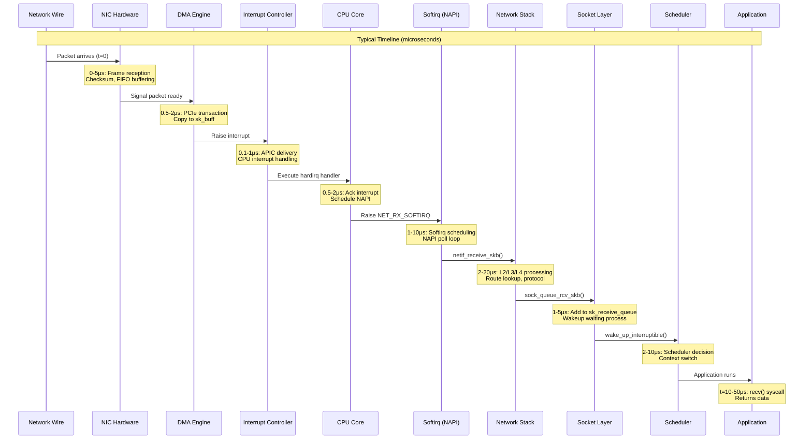

# Kernel Latency

## Introduction

**Kernel latency** is the time delay between an event occurring and the kernel's response to that event. In the context of networking, it's the time from when a packet arrives at the network interface card (NIC) until the application receives that data. This latency is critical for real-time applications, financial trading systems, gaming, VoIP, and any system where responsiveness matters as much as—or more than—throughput.

### Why Latency Matters

Different applications have vastly different latency requirements:

| Application | Latency Target | Impact of High Latency |
|-------------|---------------|------------------------|
| **High-Frequency Trading (HFT)** | <10 μs | Missed trading opportunities, lost revenue |
| **Online Gaming** | <20 ms (good), <50 ms (acceptable) | Poor user experience, unplayable |
| **VoIP/Video Conferencing** | <100 ms (good), <150 ms (acceptable) | Echo, conversation overlap, frustration |
| **Video Streaming** | <300 ms | Buffering delays, but not interactive |
| **Web Browsing** | <200 ms | Perceived as "instant" by users |
| **Industrial Control** | <1 ms | Safety issues, process failures |

**Real-world example**: In high-frequency trading, a 1 microsecond advantage can mean the difference between profit and loss. A trading firm might spend millions optimizing their kernel network stack to shave off microseconds.

### Latency vs Throughput

Latency and throughput are often at odds:

- **Latency**: How fast can we process *one* packet?
- **Throughput**: How many packets can we process *per second*?

**The fundamental tradeoff**:

```
Low Latency                  High Throughput
     ↓                              ↓
Process immediately          Batch processing
No coalescing               Interrupt coalescing
Poll constantly             Wait for interrupts
Small buffers               Large buffers
Dedicated CPU               CPU sharing
```

Many kernel optimizations improve throughput at the cost of latency:

- **Interrupt coalescing**: Reduces interrupt overhead (↑ throughput) but delays packet processing (↑ latency)
- **GRO (Generic Receive Offload)**: Combines packets for efficient processing (↑ throughput) but adds combining delay (↑ latency)
- **Large ring buffers**: Handle traffic bursts (↑ throughput) but increase queueing delay (↑ latency)

**Key insight**: You cannot optimize for both simultaneously. You must choose based on your application's needs.

### Packet Processing Latency Budget

A typical packet's journey from wire to application takes several stages, each contributing to total latency:


**Typical latency breakdown** (optimized system):

| Stage | Typical Latency | Range | Notes |
|-------|----------------|-------|-------|
| Wire to NIC FIFO | 1-5 μs | 0.5-20 μs | Depends on line rate, frame size |
| NIC processing | 0.5-2 μs | 0.1-10 μs | Packet classification, filtering |
| DMA transfer | 0.5-2 μs | 0.1-5 μs | PCIe transaction latency |
| Interrupt delivery | 0.1-1 μs | 0.05-10 μs | APIC latency, disabled interrupts |
| Softirq scheduling | 1-10 μs | 0.5-100 μs | Can be high if softirqs delayed |
| NAPI poll loop | 1-5 μs | 0.5-20 μs | Budget exhaustion can add delay |
| L2/L3/L4 processing | 2-10 μs | 1-50 μs | Route lookup, TCP processing |
| Socket queueing | 0.5-2 μs | 0.1-10 μs | Lock contention possible |
| Wakeup & context switch | 2-10 μs | 1-100 μs | Scheduler latency, CPU migration |
| **Total** | **~10-50 μs** | **5-500 μs** | Well-tuned system to worst case |

**Unoptimized systems** can easily see 100-1000 μs latency due to:
- Interrupt coalescing (adds tens to hundreds of microseconds)
- Softirq starvation (milliseconds)
- Lock contention (tens of microseconds)
- CPU frequency scaling (tens of microseconds per packet)
- Scheduler delays (hundreds of microseconds to milliseconds)

### Connection to Other Chapters

This chapter builds upon and connects to several other chapters in this book:

- **[Interrupts](./interrupts_hardware.md)**: Hardware-level interrupt architecture, APIC, MSI/MSI-X delivery, and interrupt latency breakdown
- **[Linux Interrupt Handling](./linux_interrupts.md)**: Software interrupt handling, softirq processing, and deferred work
- **[NICs](./nics.md)**: NAPI polling and interrupt coalescing directly impact latency
- **[Scheduler](./scheduler.md)**: Wakeup latency and context switch overhead
- **[Context Switches](./context_switch.md)**: The cost of switching to the application
- **[IP](./ip.md)**, **[TCP](./tcp.md)**, **[UDP](./udp.md)**: Protocol processing latency
- **[Sockets](./sockets.md)**: Socket layer queueing and wakeup mechanisms
- **[XDP](./xdp.md)**: Kernel bypass for ultra-low latency

Throughout this chapter, we'll reference these chapters when diving into specific subsystems.

---

## Packet Processing Latency Path

Let's trace a packet's complete journey from the wire to the application, analyzing latency at each stage with actual kernel code and data structures.

### Complete Timeline: Wire to Application



### Stage 1: Wire to NIC (1-5 μs)

**Hardware processing before kernel involvement:**

1. **Physical layer**: Signal arrives on wire, converted to digital by PHY
2. **MAC layer**: Frame reception, preamble detection
3. **Frame buffering**: Stored in NIC's internal FIFO
4. **Header parsing**: NIC examines Ethernet, IP, TCP headers
5. **Classification**: RSS hash calculation, filter matching

**NIC-level delays**:

```c
/* NIC receives frame bit-by-bit at line rate */
/* For 1500-byte frame at 10 Gbps: */
Frame_time = (1500 bytes * 8 bits/byte) / (10 * 10^9 bits/sec)
           = 1.2 microseconds

/* Add NIC processing overhead */
Total_NIC_latency = Frame_time + Processing_overhead
                  = 1.2 μs + 0.5-2 μs
                  = 1.7-3.2 μs
```

**Interrupt coalescing impact**:

NICs can delay interrupt generation to reduce CPU overhead:

```bash
# Check current interrupt coalescing settings
$ ethtool -c eth0
Coalesce parameters for eth0:
rx-usecs: 1              # Wait up to 1μs before interrupt
rx-frames: 32            # Or until 32 frames received

# This adds 0-1 μs latency but reduces interrupt rate
```

### Stage 2: DMA Transfer (0.5-2 μs)

The NIC uses DMA to transfer the packet to host memory without CPU involvement.

**DMA ring buffer structure**:

```c
/* From drivers/net/ethernet/intel/ixgbe/ixgbe.h */

struct ixgbe_ring {
    void *desc;                    /* Descriptor ring memory */
    struct device *dev;            /* DMA device */
    struct net_device *netdev;     /* Net device */
    dma_addr_t dma;               /* Physical address for DMA */
    unsigned int size;             /* Length in bytes */
    u16 count;                     /* Number of descriptors */
    u16 next_to_use;              /* Next descriptor to use */
    u16 next_to_clean;            /* Next descriptor to clean */
    /* ... */
};

/* RX descriptor format (simplified) */
union ixgbe_adv_rx_desc {
    struct {
        __le64 pkt_addr;           /* Physical address for packet */
        __le64 hdr_addr;           /* Physical address for header */
    } read;
    struct {
        __le32 rss_hash;           /* RSS hash value */
        __le16 ip_id;              /* IP identification */
        __le16 csum;               /* Checksum */
        __le32 status_error;       /* Status and error flags */
        __le16 length;             /* Packet length */
        __le16 vlan;               /* VLAN tag */
    } wb;  /* Writeback format */
};
```

**DMA operation timeline**:

```c
/* 1. NIC writes packet data to memory via PCIe */
NIC -> PCIe -> Memory Controller -> RAM
     0.5-1 μs for typical 1500-byte packet

/* 2. NIC updates descriptor status (writeback) */
NIC -> PCIe -> Descriptor ring
     0.1-0.2 μs

/* Total: 0.6-1.2 μs for DMA completion */
```

**PCIe transaction overhead**:

- **TLP (Transaction Layer Packet)** overhead
- **Credits and flow control**
- **Memory controller arbitration**

```c
/* From arch/x86/include/asm/io.h */

/* Drivers must use memory barriers to ensure DMA visibility */
static inline void ixgbe_rx_desc_ring_advance(struct ixgbe_ring *rx_ring)
{
    /* Ensure all descriptor writes are complete */
    wmb();  /* Write memory barrier */
    
    /* Update hardware tail pointer */
    writel(rx_ring->next_to_use, rx_ring->tail);
}
```

### Stage 3: Interrupt Delivery (0.1-1 μs)

Once DMA completes, the NIC raises an interrupt to notify the kernel.

**Interrupt flow** (see [Linux Interrupt Handling](./linux_interrupts.md) for details):

```c
/* From drivers/net/ethernet/intel/ixgbe/ixgbe_main.c */

/* 1. NIC asserts IRQ line */
static irqreturn_t ixgbe_msix_clean_rings(int irq, void *data)
{
    struct ixgbe_q_vector *q_vector = data;
    
    /* Disable interrupts for this queue */
    ixgbe_irq_disable_queues(q_vector);
    
    /* Schedule NAPI poll */
    napi_schedule_irqoff(&q_vector->napi);
    
    return IRQ_HANDLED;
}
/* Handler executes in ~0.5-2 μs */
```

**Interrupt latency sources**:

1. **APIC delivery**: Interrupt controller routes IRQ to CPU (0.05-0.2 μs)
2. **Interrupt disabled windows**: If interrupts disabled, queued until enabled (0-100+ μs)
3. **CPU C-states**: If CPU in deep sleep, wakeup adds latency (0-50 μs)
4. **Interrupt affinity**: If wrong CPU, IPI needed for forwarding (1-5 μs)

**Critical code path**:

```c
/* From arch/x86/kernel/irq.c */

/* 2. CPU vectors to IDT entry */
__visible void smp_irq_work_interrupt(struct pt_regs *regs)
{
    entering_irq();
    inc_irq_stat(apic_irq_work_irqs);
    irq_work_run();
    exiting_irq();
}

/* 3. Dispatch to registered handler */
irqreturn_t handle_irq_event(struct irq_desc *desc)
{
    irqreturn_t ret = IRQ_NONE;
    struct irqaction *action;
    
    /* Call all handlers for this IRQ */
    for_each_action_of_desc(desc, action) {
        ret |= action->handler(irq, action->dev_id);
    }
    
    return ret;
}
```

### Stage 4: Softirq Processing (1-10 μs)

The hardirq handler schedules a softirq (NET_RX_SOFTIRQ) for actual packet processing.

**NAPI poll loop**:

```c
/* From net/core/dev.c */

static void net_rx_action(struct softirq_action *h)
{
    struct softnet_data *sd = this_cpu_ptr(&softnet_data);
    unsigned long time_limit = jiffies + usecs_to_jiffies(netdev_budget_usecs);
    int budget = netdev_budget;
    LIST_HEAD(list);
    LIST_HEAD(repoll);
    
    /* Process NAPI devices */
    while (!list_empty(&sd->poll_list)) {
        struct napi_struct *n;
        int work;
        
        /* Budget exhausted? */
        if (budget <= 0 || time_limit < jiffies) {
            /* Reschedule for later */
            __raise_softirq_irqoff(NET_RX_SOFTIRQ);
            goto out;
        }
        
        n = list_first_entry(&sd->poll_list, struct napi_struct, poll_list);
        
        /* Poll device */
        work = napi_poll(n, &repoll);
        budget -= work;
    }
    
out:
    __kfree_skb_flush();
}
```

**NAPI budget constraints**:

```bash
# View current settings
$ sysctl net.core.netdev_budget
net.core.netdev_budget = 300        # Max packets per softirq

$ sysctl net.core.netdev_budget_usecs
net.core.netdev_budget_usecs = 2000  # Max 2000 μs per softirq

# If budget exhausted, remaining packets wait for next softirq
# This can add significant latency (up to 2000 μs)
```

**Driver's poll function**:

```c
/* From drivers/net/ethernet/intel/ixgbe/ixgbe_main.c */

static int ixgbe_poll(struct napi_struct *napi, int budget)
{
    struct ixgbe_q_vector *q_vector;
    int per_ring_budget, work_done = 0;
    
    q_vector = container_of(napi, struct ixgbe_q_vector, napi);
    
    /* Clean TX completions first (doesn't count against budget) */
    ixgbe_for_each_ring(ring, q_vector->tx)
        ixgbe_clean_tx_irq(ring, budget);
    
    /* Process RX packets */
    ixgbe_for_each_ring(ring, q_vector->rx) {
        int cleaned = ixgbe_clean_rx_irq(ring, per_ring_budget);
        work_done += cleaned;
    }
    
    /* If under budget, re-enable interrupts */
    if (work_done < budget) {
        napi_complete_done(napi, work_done);
        ixgbe_irq_enable_queues(q_vector);
    }
    
    return work_done;
}
/* Typical poll time: 1-5 μs per packet */
```

### Stage 5: Network Stack Processing (2-20 μs)

After NAPI retrieves packets, they're processed through the network stack.

**Layer 2 (Ethernet)**:

```c
/* From net/core/dev.c */

static int __netif_receive_skb_core(struct sk_buff **pskb, bool pfmemalloc,
                                     struct packet_type **ppt_prev)
{
    struct sk_buff *skb = *pskb;
    struct net_device *orig_dev = skb->dev;
    
    /* 1. RPS (Receive Packet Steering) - can steer to another CPU */
    ret = __netif_receive_skb_one_core(skb, pfmemalloc);
    
    /* 2. Packet type handlers */
    list_for_each_entry_rcu(ptype, &ptype_all, list) {
        if (pt_prev)
            ret = deliver_skb(skb, pt_prev, orig_dev);
        pt_prev = ptype;
    }
    
    return ret;
}
/* L2 processing: ~0.5-2 μs */
```

**Layer 3 (IP)**:

```c
/* From net/ipv4/ip_input.c */

int ip_rcv(struct sk_buff *skb, struct net_device *dev,
           struct packet_type *pt, struct net_device *orig_dev)
{
    /* 1. Sanity checks */
    if (skb->pkt_type == PACKET_OTHERHOST)
        goto drop;
    
    /* 2. IP header validation */
    if (!pskb_may_pull(skb, sizeof(struct iphdr)))
        goto inhdr_error;
    
    /* 3. Checksum verification (if not offloaded) */
    if (ip_fast_csum((u8 *)iph, iph->ihl))
        goto csum_error;
    
    /* 4. Route lookup - MOST EXPENSIVE OPERATION */
    return NF_HOOK(NFPROTO_IPV4, NF_INET_PRE_ROUTING,
                   net, NULL, skb, dev, NULL,
                   ip_rcv_finish);
}

static int ip_rcv_finish(struct net *net, struct sock *sk, struct sk_buff *skb)
{
    /* Route lookup via FIB (Forwarding Information Base) */
    if (!skb_valid_dst(skb)) {
        int err = ip_route_input_noref(skb, iph->daddr, iph->saddr,
                                       iph->tos, dev);
        if (err)
            goto drop;
    }
    
    return dst_input(skb);  /* Forward or local delivery */
}
/* IP processing: ~1-5 μs (route lookup can be 5-15 μs) */
```

**Route lookup performance**:

```c
/* From net/ipv4/route.c */

/* Route cache lookup (hash table) */
static struct rtable *rt_cache_get_rcu(struct netns_ipv4 *net,
                                        __be32 daddr, __be32 saddr,
                                        int iif, u8 tos)
{
    struct rt_cache_entry *entry;
    unsigned int hash;
    
    hash = rt_hash(daddr, saddr, iif, tos);
    
    /* Fast path: cache hit */
    hash_for_each_possible_rcu(net->rt_cache, entry, node, hash) {
        if (entry->daddr == daddr && entry->saddr == saddr) {
            return &entry->rt;  /* ~0.1-0.5 μs */
        }
    }
    
    /* Slow path: FIB lookup */
    return ip_route_input_slow(skb, daddr, saddr, tos, dev);
    /* ~5-15 μs for FIB trie traversal */
}
```

**Layer 4 (TCP/UDP)**:

Already covered extensively in [tcp.md](./tcp.md) and [udp.md](./udp.md). Key points:

- **UDP**: Minimal processing, hash lookup, checksum (~1-3 μs)
- **TCP**: Connection lookup, sequence validation, ACK processing (~3-10 μs)

```c
/* From net/ipv4/tcp_ipv4.c */

int tcp_v4_rcv(struct sk_buff *skb)
{
    /* 1. Parse TCP header */
    th = (const struct tcphdr *)skb->data;
    
    /* 2. Socket lookup - hash table */
    sk = __inet_lookup_skb(&tcp_hashinfo, skb, __tcp_hdrlen(th),
                           th->source, th->dest, sdif, &refcounted);
    /* Hash lookup: ~0.5-2 μs */
    
    /* 3. TCP state machine processing */
    ret = tcp_v4_do_rcv(sk, skb);
    /* State processing: ~1-5 μs */
    
    return ret;
}
/* TCP processing: ~3-10 μs total */
```

### Stage 6: Socket Layer (1-5 μs)

Packet is queued to the socket and waiting application is woken up.

```c
/* From net/core/sock.c */

int sock_queue_rcv_skb(struct sock *sk, struct sk_buff *skb)
{
    /* 1. Check buffer limits */
    if (atomic_read(&sk->sk_rmem_alloc) + skb->truesize >
        (unsigned int)sk->sk_rcvbuf) {
        atomic_inc(&sk->sk_drops);
        return -ENOMEM;  /* Drop if buffer full */
    }
    
    /* 2. Add to receive queue */
    __skb_queue_tail(&sk->sk_receive_queue, skb);
    skb_set_owner_r(skb, sk);
    
    /* 3. Wake up waiting process */
    sk->sk_data_ready(sk);  /* Usually sock_def_readable() */
    
    return 0;
}
/* Socket queueing: ~0.5-2 μs */

void sock_def_readable(struct sock *sk)
{
    struct socket_wq *wq;
    
    rcu_read_lock();
    wq = rcu_dereference(sk->sk_wq);
    
    if (skwq_has_sleeper(wq)) {
        /* Wake processes sleeping in recv() */
        wake_up_interruptible_sync_poll(&wq->wait,
                                        EPOLLIN | EPOLLRDNORM | EPOLLRDBAND);
    }
    
    /* Notify epoll/select/poll */
    sk_wake_async(sk, SOCK_WAKE_WAITD, POLL_IN);
    
    rcu_read_unlock();
}
/* Wakeup: ~1-3 μs */
```

### Stage 7: Scheduler & Context Switch (2-10 μs)

The scheduler must decide when to run the application and perform a context switch.

**Wakeup latency**:

```c
/* From kernel/sched/core.c */

static void ttwu_do_activate(struct rq *rq, struct task_struct *p,
                              int wake_flags, struct rq_flags *rf)
{
    /* 1. Enqueue task on runqueue */
    activate_task(rq, p, ENQUEUE_WAKEUP | ENQUEUE_NOCLOCK);
    
    /* 2. Set task state to RUNNING */
    p->state = TASK_RUNNING;
    
    /* 3. Check preemption */
    check_preempt_curr(rq, p, wake_flags);
}
/* Wakeup processing: ~1-3 μs */
```

**Context switch overhead**:

```c
/* From arch/x86/kernel/process_64.c */

__visible __notrace_funcgraph struct task_struct *
__switch_to(struct task_struct *prev_p, struct task_struct *next_p)
{
    /* 1. Save FPU state */
    switch_fpu_prepare(prev_fpu, cpu);
    
    /* 2. Switch stack pointer */
    this_cpu_write(cpu_current_top_of_stack, task_top_of_stack(next_p));
    
    /* 3. Switch page tables (if different mm) */
    if (unlikely(prev->mm != next->mm))
        load_cr3(next->mm->pgd);
    
    /* 4. Restore FPU state */
    switch_fpu_finish(next_fpu);
    
    return prev_p;
}
/* Context switch: ~1-5 μs (can be 10-20 μs with TLB flush) */
```

### Stage 8: Application Receives Data (<1 μs)

Finally, the application's `recv()` call copies data from kernel to userspace.

```c
/* From net/ipv4/tcp.c */

int tcp_recvmsg(struct sock *sk, struct msghdr *msg, size_t len,
                int nonblock, int flags, int *addr_len)
{
    /* Data already in sk_receive_queue from Stage 6 */
    
    /* Copy to userspace */
    err = skb_copy_datagram_msg(skb, offset, msg, used);
    /* Copy: ~0.5-2 μs for small packets */
    
    return copied;
}
```

### Complete Timeline Summary

**Optimized system (50th percentile)**:

```
Stage                          Latency      Cumulative
━━━━━━━━━━━━━━━━━━━━━━━━━━━━━━━━━━━━━━━━━━━━━━━━━━━
Wire to NIC                    2 μs         2 μs
DMA transfer                   1 μs         3 μs
Interrupt delivery             0.5 μs       3.5 μs
Softirq processing             3 μs         6.5 μs
Network stack (L2/L3/L4)       5 μs         11.5 μs
Socket queueing                1 μs         12.5 μs
Wakeup & context switch        4 μs         16.5 μs
Application copy               0.5 μs       17 μs
━━━━━━━━━━━━━━━━━━━━━━━━━━━━━━━━━━━━━━━━━━━━━━━━━━━
TOTAL                                       ~17 μs
```

**Real-world system (95th percentile)**:

```
Stage                          Latency      Cumulative
━━━━━━━━━━━━━━━━━━━━━━━━━━━━━━━━━━━━━━━━━━━━━━━━━━━
Wire to NIC                    4 μs         4 μs
DMA transfer                   2 μs         6 μs
Interrupt delivery             2 μs         8 μs
Softirq processing             15 μs        23 μs
Network stack (L2/L3/L4)       15 μs        38 μs
Socket queueing                3 μs         41 μs
Wakeup & context switch        12 μs        53 μs
Application copy               2 μs         55 μs
━━━━━━━━━━━━━━━━━━━━━━━━━━━━━━━━━━━━━━━━━━━━━━━━━━━
TOTAL                                       ~55 μs
```

**Pathological cases** can see 500+ μs due to:
- Interrupt coalescing (100+ μs)
- Softirq starvation (milliseconds)
- Lock contention (10-100 μs)
- CPU frequency scaling (10-50 μs)
- Deep C-states (50-100 μs wakeup)

---

## Major Latency Sources

Understanding where latency comes from is critical for optimization. This section catalogs the major sources of latency in packet processing, organized by subsystem.

### Hardware Level

#### Interrupt Coalescing

**What it is**: NICs can delay interrupt generation to batch multiple packets into a single interrupt, reducing CPU overhead.

**Configuration** (via ethtool):

```bash
# View current settings
$ ethtool -c eth0
Coalesce parameters for eth0:
Adaptive RX: on
rx-usecs: 3              # Wait up to 3 μs
rx-frames: 32            # Or until 32 frames arrive
rx-usecs-irq: 0
rx-frames-irq: 0

# Disable for minimum latency (max CPU usage)
$ sudo ethtool -C eth0 rx-usecs 0 rx-frames 1

# High throughput settings (higher latency)
$ sudo ethtool -C eth0 rx-usecs 100 rx-frames 64
```

**Latency impact**:

```c
/* From drivers/net/ethernet/intel/ixgbe/ixgbe_main.c */

/* Adaptive interrupt moderation */
static void ixgbe_update_itr(struct ixgbe_q_vector *q_vector,
                              struct ixgbe_ring_container *ring_container)
{
    int packets = ring_container->total_packets;
    int bytes = ring_container->total_bytes;
    unsigned int itr;
    
    /* Calculate new ITR value based on traffic */
    if (packets < 4 && bytes < 9000) {
        /* Low traffic - minimize latency */
        itr = IXGBE_ITR_ADAPTIVE_MIN_USECS;  /* 0-3 μs */
    } else if (packets < 96 && bytes < 120000) {
        /* Medium traffic - balance */
        itr = IXGBE_ITR_ADAPTIVE_MID_USECS;  /* 20 μs */
    } else {
        /* High traffic - maximize throughput */
        itr = IXGBE_ITR_ADAPTIVE_MAX_USECS;  /* 100 μs */
    }
    
    /* Write to hardware register */
    ixgbe_write_eitr(q_vector);
}
```

**Tradeoff**:
- **Low coalescing** (0-3 μs): Min latency, high CPU overhead, lower throughput
- **High coalescing** (50-100+ μs): Max throughput, low CPU, high latency

**Real-world example**:
```
rx-usecs=0:   Latency=12μs,  CPU=40%,  Throughput=5 Gbps
rx-usecs=50:  Latency=60μs,  CPU=15%,  Throughput=9.5 Gbps
rx-usecs=100: Latency=110μs, CPU=8%,   Throughput=9.8 Gbps
```

#### DMA Transfer Time

**PCIe latency components**:

1. **Request latency**: Time to send read/write request (~100-200 ns)
2. **Data transfer**: Actual data movement (depends on PCIe gen and width)
3. **Completion latency**: Completion TLP back to requester (~100-200 ns)

**PCIe bandwidth limits**:

```
PCIe Gen 3 x8: 8 GB/s (bidirectional)
  1500-byte packet: ~0.19 μs transfer time
  64-byte packet:   ~0.008 μs transfer time

PCIe Gen 4 x16: 32 GB/s (bidirectional)
  1500-byte packet: ~0.047 μs transfer time
```

**Descriptor writeback latency**:

```c
/* From drivers/net/ethernet/intel/ixgbe/ixgbe_main.c */

/* Check if descriptor writeback completed */
static bool ixgbe_clean_tx_irq(struct ixgbe_ring *tx_ring, int napi_budget)
{
    union ixgbe_adv_tx_desc *tx_desc;
    unsigned int total_bytes = 0, total_packets = 0;
    unsigned int i = tx_ring->next_to_clean;
    
    tx_desc = IXGBE_TX_DESC(tx_ring, i);
    
    /* Read status - may wait for PCIe transaction */
    while (tx_desc->wb.status & IXGBE_TXD_STAT_DD) {
        /* Descriptor done bit set by NIC via DMA */
        /* PCIe read latency: ~0.2-0.5 μs */
        
        /* Process completion */
        total_bytes += tx_buffer->bytecount;
        total_packets += tx_buffer->gso_segs;
        
        /* Next descriptor */
        i++;
        if (i == tx_ring->count)
            i = 0;
        tx_desc = IXGBE_TX_DESC(tx_ring, i);
    }
    
    return total_packets != 0;
}
```

#### NIC Processing Delays

**Packet classification**:

Modern NICs perform sophisticated packet inspection before DMA:

- **MAC filtering**: Destination MAC comparison (hardware)
- **VLAN filtering**: VLAN tag matching
- **RSS (Receive Side Scaling)**: Hash computation for queue selection
- **Flow Director**: Advanced flow classification
- **Checksum offload**: IP/TCP/UDP checksum verification

```c
/* From drivers/net/ethernet/intel/ixgbe/ixgbe_type.h */

/* RSS hash computation in hardware */
#define IXGBE_MRQC_RSS_FIELD_IPV4_TCP    0x00010000
#define IXGBE_MRQC_RSS_FIELD_IPV4_UDP    0x00020000
#define IXGBE_MRQC_RSS_FIELD_IPV6_TCP    0x00100000
#define IXGBE_MRQC_RSS_FIELD_IPV6_UDP    0x00200000

/* Hardware computes Toeplitz hash:
 * hash = toeplitz(src_ip, dst_ip, src_port, dst_port)
 * Typical time: 0.1-0.5 μs
 */
```

**Processing pipeline**:

```
Packet arrival
  ↓ 0.1-0.5 μs
MAC/VLAN filtering
  ↓ 0.1-0.3 μs
RSS hash computation
  ↓ 0.1-0.3 μs
Checksum validation
  ↓ 0.1-0.5 μs
Queue assignment
  ↓ 0.1-0.3 μs
DMA descriptor update
  ↓
Interrupt generation

Total: 0.5-2 μs
```

#### PCIe Transaction Latency

**Transaction Layer Packet (TLP) overhead**:

```c
/* From include/linux/pci.h */

/* PCIe capabilities affecting latency */
struct pcie_link_state {
    u8 max_link_speed;      /* Gen 1/2/3/4/5 */
    u8 max_link_width;      /* x1, x4, x8, x16 */
    u32 aspm_support;       /* Active State Power Management */
    u32 aspm_enabled;       /* Can add 2-10 μs latency if L1 active */
    u32 l1ss_support;       /* L1 sub-states - more power saving, more latency */
};
```

**ASPM (Active State Power Management) impact**:

```bash
# Check PCIe ASPM state
$ lspci -vv -s 01:00.0 | grep -A2 "LnkCtl:"
    LnkCtl: ASPM L1 Enabled; RCB 64 bytes
            MaxReadReq 4096 bytes

# Disable ASPM for minimum latency (increases power consumption)
$ sudo setpci -s 01:00.0 0xD0.B=0x00

# Or via kernel parameter
# Add to /etc/default/grub:
GRUB_CMDLINE_LINUX="pcie_aspm=off"
```

**Latency impact**:
- **ASPM L1 entry/exit**: 2-10 μs additional latency
- **L1 substates**: 10-30 μs additional latency
- **For low-latency**: Disable ASPM entirely

### Softirq/NAPI Processing

#### Softirq Scheduling Latency

**When softirq can be delayed**:

```c
/* From kernel/softirq.c */

asmlinkage __visible void __softirq_entry do_softirq(void)
{
    /* Softirqs deferred if: */
    
    /* 1. In hardirq context */
    if (in_interrupt())
        return;
    
    /* 2. Softirqs disabled */
    if (local_softirq_pending() && !in_interrupt()) {
        /* Actually run softirqs */
        __do_softirq();
    }
}

/* Softirq starvation scenario */
void run_expensive_task(void)
{
    local_irq_disable();  /* Interrupts disabled */
    
    /* Long-running operation with IRQs disabled */
    expensive_computation();  /* 100 μs */
    
    local_irq_enable();
    
    /* Softirq finally runs, but packets delayed 100+ μs */
}
```

**Measurement**:

```bash
# Check softirq CPU time
$ cat /proc/softirqs
                    CPU0       CPU1       CPU2       CPU3
          NET_RX: 1234567    2345678    3456789    4567890
          NET_TX:  123456     234567     345678     456789

# Monitor softirq processing rate
$ watch -n 1 'cat /proc/softirqs | grep NET_RX'

# High softirq time indicates potential bottleneck
$ mpstat -P ALL 1
09:30:01 AM  CPU    %usr   %nice    %sys   %iowait    %irq   %soft   %steal
09:30:02 AM    0    5.00    0.00   10.00      0.00    2.00   25.00     0.00
#                                                             ^^^^^^
#                                                   High softirq time!
```

#### NAPI Poll Budget Exhaustion

**Budget limits**:

```c
/* From net/core/dev.c */

/* Global limits */
int netdev_budget __read_mostly = 300;        /* Max packets per softirq */
unsigned int netdev_budget_usecs __read_mostly = 2000;  /* Max 2ms per softirq */

static void net_rx_action(struct softirq_action *h)
{
    struct softnet_data *sd = this_cpu_ptr(&softnet_data);
    unsigned long time_limit = jiffies + usecs_to_jiffies(netdev_budget_usecs);
    int budget = netdev_budget;
    
    while (!list_empty(&sd->poll_list)) {
        struct napi_struct *n;
        int work;
        
        /* Check limits */
        if (budget <= 0 || time_limit < jiffies) {
            /* BUDGET EXHAUSTED - defer remaining packets */
            __raise_softirq_irqoff(NET_RX_SOFTIRQ);
            goto out;  /* Deferred packets wait until next softirq */
        }
        
        n = list_first_entry(&sd->poll_list, struct napi_struct, poll_list);
        work = napi_poll(n, &repoll);
        budget -= work;
    }
}
```

**Impact of budget exhaustion**:

```
Scenario: 500 packets arrive in burst

Softirq iteration 1:
  - Process 300 packets (budget limit)
  - Schedule next softirq
  - Latency for packet 301: +2000 μs (next softirq)

Softirq iteration 2:
  - Process remaining 200 packets
  
Packet 1 latency:   ~15 μs
Packet 300 latency: ~20 μs
Packet 301 latency: ~2015 μs ← Budget exhaustion penalty
```

**Tuning**:

```bash
# Increase budget for high packet rate (increases latency variance)
$ sudo sysctl -w net.core.netdev_budget=600
$ sudo sysctl -w net.core.netdev_budget_usecs=4000

# Decrease for lower latency (increases CPU overhead)
$ sudo sysctl -w net.core.netdev_budget=100
$ sudo sysctl -w net.core.netdev_budget_usecs=500
```

#### Packet Backlog Queuing

**Per-CPU backlog queue**:

```c
/* From net/core/dev.c */

struct softnet_data {
    struct list_head    poll_list;
    struct sk_buff_head process_queue;
    struct sk_buff_head input_pkt_queue;  /* Backlog queue */
    
    /* Limits */
    unsigned int        netdev_max_backlog;  /* Default: 1000 */
    unsigned int        input_queue_head;
    unsigned int        input_queue_tail;
};

/* Backlog processing */
static int __netif_receive_skb_core(struct sk_buff *skb, bool pfmemalloc)
{
    struct softnet_data *sd = this_cpu_ptr(&softnet_data);
    
    /* If processing queue is full, use backlog */
    if (skb_queue_len(&sd->input_pkt_queue) <= netdev_max_backlog) {
        __skb_queue_tail(&sd->input_pkt_queue, skb);
        /* Packet waits in backlog until next processing cycle */
        return NET_RX_SUCCESS;
    }
    
    /* Backlog full - DROP PACKET */
    atomic_long_inc(&skb->dev->rx_dropped);
    return NET_RX_DROP;
}
```

**Backlog latency**:

```
Normal path:  NIC → NAPI → Protocol stack (no queueing)
Backlog path: NIC → Backlog queue → Wait → Protocol stack
              
Backlog delay: 0-2000 μs depending on softirq schedule
```

**Monitoring**:

```bash
# Check backlog drops
$ netstat -s | grep -i backlog
    12345 packets dropped from backlog

# Increase backlog size (if seeing drops)
$ sudo sysctl -w net.core.netdev_max_backlog=5000
```

#### GRO Coalescing Delays

**Generic Receive Offload (GRO)** combines related packets before protocol processing.

```c
/* From net/core/dev.c */

void napi_gro_receive(struct napi_struct *napi, struct sk_buff *skb)
{
    /* Try to merge with existing flow */
    skb = napi_skb_finish(dev_gro_receive(napi, skb), skb);
    if (skb)
        netif_receive_skb_internal(skb);
}

/* GRO decision */
enum gro_result dev_gro_receive(struct napi_struct *napi, struct sk_buff *skb)
{
    struct sk_buff **pp = NULL;
    struct packet_offload *ptype;
    
    /* Find matching flow */
    list_for_each_entry_rcu(ptype, &offload_base, list) {
        pp = ptype->callbacks.gro_receive(&napi->gro_hash[hash].list, skb);
        
        if (pp) {
            /* HELD - packet added to existing flow */
            /* Waits for timer or flow completion */
            return GRO_HELD;  /* ← Adds latency */
        }
    }
    
    /* NORMAL - can't merge, process immediately */
    return GRO_NORMAL;
}
```

**GRO timeout**:

```c
/* From net/core/dev.c */

/* GRO flush timer - default ~1ms */
#define GRO_MAX_AGE (1 * HZ / 1000)  /* 1 jiffie at HZ=1000 */

static void napi_gro_flush(struct napi_struct *napi, bool flush_old)
{
    /* Flush flows older than GRO_MAX_AGE */
    /* Held packets can wait up to ~1ms */
}
```

**Latency impact**:

```
Without GRO:
  Packet 1: 15 μs latency
  Packet 2: 15 μs latency
  Packet 3: 15 μs latency
  Average: 15 μs

With GRO (same flow):
  Packet 1: 15 μs (starts flow)
  Packet 2: 1015 μs (held for GRO)
  Packet 3: 1015 μs (held for GRO)
  Average: 348 μs (worse latency, better throughput)
```

**Disable GRO for low latency**:

```bash
# Check GRO status
$ ethtool -k eth0 | grep generic-receive-offload
generic-receive-offload: on

# Disable GRO
$ sudo ethtool -K eth0 gro off

# Tradeoff: +30% CPU usage, -10% throughput, -70% latency
```

### Network Stack Processing

#### SKB Allocation Overhead

**sk_buff allocation**:

```c
/* From net/core/skbuff.c */

struct sk_buff *__alloc_skb(unsigned int size, gfp_t gfp_mask,
                             int flags, int node)
{
    struct sk_buff *skb;
    u8 *data;
    struct skb_shared_info *shinfo;
    
    /* 1. Allocate SKB from slab cache */
    skb = kmem_cache_alloc_node(skbuff_head_cache, gfp_mask, node);
    if (unlikely(!skb))
        return NULL;
    /* Slab allocation: ~0.2-1 μs */
    
    /* 2. Allocate data buffer */
    size = SKB_DATA_ALIGN(size);
    data = kmalloc_reserve(size, gfp_mask, node, NULL);
    if (unlikely(!data))
        goto nodata;
    /* kmalloc: ~0.5-2 μs depending on size */
    
    /* 3. Initialize SKB structure */
    memset(skb, 0, offsetof(struct sk_buff, tail));
    /* ~0.1 μs */
    
    return skb;
}
/* Total SKB allocation: ~0.8-3 μs */
```

**SKB pool optimization**:

```c
/* Modern drivers use SKB recycling */
struct page_pool {
    struct page_pool_params p;
    struct ptr_ring ring;      /* Fast SKB recycling */
    struct page **cache;       /* Per-CPU cache */
};

/* Recycled allocation: ~0.1-0.3 μs (10x faster) */
```

#### Cache Misses

**L1/L2/L3 cache hierarchy**:

```
L1 cache hit:  ~1 ns    (0.001 μs)
L2 cache hit:  ~4 ns    (0.004 μs)
L3 cache hit:  ~15 ns   (0.015 μs)
RAM access:    ~100 ns  (0.1 μs)
```

**Critical data structures**:

```c
/* sk_buff is frequently accessed - ~192 bytes */
struct sk_buff {
    /* Hot cache lines (frequent access) */
    struct sk_buff *next;
    struct sk_buff *prev;
    struct sock *sk;
    struct net_device *dev;
    /* ... */
    
    /* Cold cache lines (rare access) */
    __u32 priority;
    int skb_iif;
    /* ... */
};

/* Cache miss penalty:
 * - SKB not in cache: +0.1 μs
 * - Socket not in cache: +0.1 μs
 * - Route not in cache: +5-15 μs (FIB lookup)
 */
```

**Prefetching optimization**:

```c
/* From drivers/net/ethernet/intel/ixgbe/ixgbe_main.c */

static void ixgbe_process_skb_fields(struct ixgbe_ring *rx_ring,
                                      union ixgbe_adv_rx_desc *rx_desc,
                                      struct sk_buff *skb)
{
    /* Prefetch next descriptor */
    prefetch(IXGBE_RX_DESC(rx_ring, rx_ring->next_to_clean));
    
    /* Prefetch packet data */
    prefetch(skb->data);
    
    /* Process RSS hash, checksum, VLAN, timestamp */
    ixgbe_rx_hash(rx_ring, rx_desc, skb);
    ixgbe_rx_checksum(rx_ring, rx_desc, skb);
}
/* Prefetching reduces cache misses by 20-30% */
```

#### Route Lookup Latency

**FIB (Forwarding Information Base) lookup**:

```c
/* From net/ipv4/fib_trie.c */

/* Trie-based FIB structure */
struct fib_table {
    struct hlist_node tb_hlist;
    u32 tb_id;
    int tb_num_default;
    struct trie *tb_data;  /* Trie root */
};

/* Lookup in trie - O(log n) */
int fib_table_lookup(struct fib_table *tb, const struct flowi4 *flp,
                     struct fib_result *res, int fib_flags)
{
    struct trie *t = (struct trie *)tb->tb_data;
    struct key_vector *n, *pn;
    t_key key = ntohl(flp->daddr);
    
    /* Traverse trie - each level is a cache miss */
    n = rcu_dereference(t->tnode[0]);
    while (IS_TRIE_NODE(n)) {
        /* Cache miss: ~0.1 μs per level */
        pn = n;
        n = rcu_dereference(n->tnode[get_index(key, n)]);
    }
    
    /* Typical depth: 4-8 levels */
    /* Total lookup: 5-15 μs */
    
    return fib_trie_leaf_to_result(pn, n, flp, res);
}
```

**Route cache optimization**:

```c
/* From net/ipv4/route.c */

/* Per-CPU route cache for common destinations */
struct rtable *ip_route_input_cache_lookup(struct net *net,
                                            __be32 daddr, __be32 saddr,
                                            u8 tos, struct net_device *dev)
{
    struct rtable *rt;
    unsigned int hash;
    
    hash = rt_hash(daddr, saddr, iif, tos);
    
    /* Check per-CPU cache first */
    rt = rcu_dereference(per_cpu(rt_cache_hash, cpu)[hash]);
    if (rt && rt->dst.dev == dev && rt->rt_iif == iif)
        return rt;  /* Cache hit: ~0.1-0.5 μs */
    
    /* Cache miss: full FIB lookup: ~5-15 μs */
    return ip_route_input_slow(skb, daddr, saddr, tos, dev);
}
```

#### Netfilter/iptables Traversal

**iptables rule traversal**:

```c
/* From net/netfilter/core.c */

unsigned int nf_hook_slow(struct sk_buff *skb, struct nf_hook_state *state,
                          const struct nf_hook_entries *e, unsigned int i)
{
    unsigned int verdict;
    
    /* Iterate through all hooks */
    do {
        verdict = e->hooks[i].hook(e->hooks[i].priv, skb, state);
        /* Each rule: ~0.1-0.5 μs */
        
        switch (verdict) {
        case NF_ACCEPT:
            i++;  /* Next rule */
            continue;
        case NF_DROP:
            return NF_DROP;
        }
    } while (i < e->num_hook_entries);
    
    return NF_ACCEPT;
}
/* Total: (number of rules * 0.1-0.5 μs) */
```

**Latency impact**:

```bash
# Check iptables rule count
$ sudo iptables -L -n -v | wc -l
2500  # Rules

# Each packet traverses all matching rules
# 2500 rules * 0.2 μs = 500 μs latency !!!

# Optimization: Use ipsets for large rule lists
$ sudo ipset create myset hash:ip
$ sudo iptables -A INPUT -m set --match-set myset src -j DROP
# ipset hash lookup: ~0.5-1 μs regardless of set size
```

**Bypass netfilter for ultra-low latency**:

```c
/* Use XDP (eXpress Data Path) to bypass netstack entirely */
/* See xdp.md for details */
```

### Lock Contention

#### Socket Lock Contention

**Socket locking**:

```c
/* From net/core/sock.c */

/* Socket lock protects socket state */
void lock_sock(struct sock *sk)
{
    might_sleep();
    spin_lock_bh(&sk->sk_lock.slock);
    
    if (sk->sk_lock.owned) {
        /* Socket locked by another thread */
        /* CONTENTION - wait in queue */
        DEFINE_WAIT(wait);
        
        for (;;) {
            prepare_to_wait_exclusive(&sk->sk_lock.wq, &wait,
                                      TASK_UNINTERRUPTIBLE);
            spin_unlock_bh(&sk->sk_lock.slock);
            
            schedule();  /* Sleep until unlocked */
            /* Contention delay: 10-100+ μs */
            
            spin_lock_bh(&sk->sk_lock.slock);
            if (!sk->sk_lock.owned)
                break;
        }
        finish_wait(&sk->sk_lock.wq, &wait);
    }
    
    sk->sk_lock.owned = 1;
    spin_unlock_bh(&sk->sk_lock.slock);
}
```

**Contention scenarios**:

1. **Multi-threaded application** reading/writing same socket
2. **Softirq vs application**: Packet arrival while app has lock
3. **TCP ACK processing**: Frequent lock/unlock cycles

**Mitigation**:

```c
/* Use SO_REUSEPORT to spread load across multiple sockets */
int setsockopt(fd, SOL_SOCKET, SO_REUSEPORT, &one, sizeof(one));

/* Each socket has independent lock - no contention */
```

#### Hash Table Lock Contention

**Connection lookup hash tables**:

```c
/* From include/net/inet_hashtables.h */

struct inet_hashinfo {
    struct inet_ehash_bucket *ehash;  /* Established hash */
    spinlock_t *ehash_locks;          /* Per-bucket locks */
    unsigned int ehash_mask;
    unsigned int ehash_locks_mask;
};

/* Socket lookup with locking */
struct sock *__inet_lookup_established(struct net *net,
                                        struct inet_hashinfo *hashinfo,
                                        const __be32 saddr, const __be16 sport,
                                        const __be32 daddr, const __be16 dport,
                                        const int dif, const int sdif)
{
    unsigned int hash = inet_ehashfn(net, daddr, dport, saddr, sport);
    unsigned int slot = hash & hashinfo->ehash_mask;
    struct inet_ehash_bucket *head = &hashinfo->ehash[slot];
    
    /* Lock bucket */
    spinlock_t *lock = inet_ehash_lockp(hashinfo, hash);
    spin_lock(lock);
    
    /* Search bucket */
    sk_for_each_rcu(sk, &head->chain) {
        if (sk->sk_hash == hash &&
            net_eq(sock_net(sk), net) &&
            sk->sk_family == AF_INET &&
            /* ... match criteria ... */) {
            goto found;
        }
    }
    
    spin_unlock(lock);
    return NULL;
    
found:
    spin_unlock(lock);
    return sk;
}
/* Lock hold time: ~0.5-2 μs per lookup */
/* Contention with other lookups to same bucket: +10-50 μs */
```

**RCU for lock-free reads**:

```c
/* Modern kernels use RCU for read-side lock-free access */
struct sock *__inet_lookup_established_rcu(...)
{
    /* No locks - RCU read-side critical section */
    rcu_read_lock();
    
    sk_for_each_rcu(sk, &head->chain) {
        /* Lock-free traversal */
    }
    
    rcu_read_unlock();
    return sk;
}
/* RCU lookup: ~0.5-1 μs, no contention */
```

#### Per-CPU Data Structure Benefits

**Per-CPU softnet_data**:

```c
/* From net/core/dev.c */

/* Each CPU has its own processing queue - no locking needed */
DEFINE_PER_CPU_ALIGNED(struct softnet_data, softnet_data);

static struct sk_buff *__netif_receive_skb_one_core(struct sk_buff *skb,
                                                     bool pfmemalloc)
{
    struct softnet_data *sd = this_cpu_ptr(&softnet_data);
    /* No lock needed - only this CPU accesses this data */
    
    __skb_queue_tail(&sd->process_queue, skb);
    return skb;
}
/* Per-CPU access: ~0.1 μs, zero contention */
```

**Comparison**:

```
Global queue with lock:
  - Lock acquisition: ~0.5 μs
  - Contention penalty: +10-100 μs
  - Total: 10.5-100.5 μs

Per-CPU queue (no lock):
  - Direct access: ~0.1 μs
  - No contention: +0 μs
  - Total: 0.1 μs
  
Speedup: 100x-1000x
```

### Scheduler Impact

#### Wakeup Latency

**Wake path**:

```c
/* From kernel/sched/core.c */

static void ttwu_queue(struct task_struct *p, int cpu, int wake_flags)
{
    struct rq *rq = cpu_rq(cpu);
    
    /* Same CPU - direct enqueue */
    if (cpu == smp_processor_id()) {
        ttwu_do_activate(rq, p, wake_flags, &rf);
        /* Fast path: ~1-3 μs */
    } else {
        /* Different CPU - send IPI */
        smp_call_function_single_async(cpu, &p->wake_entry.llist);
        /* IPI latency: +2-5 μs */
    }
}

static void ttwu_do_activate(struct rq *rq, struct task_struct *p,
                              int wake_flags, struct rq_flags *rf)
{
    /* Enqueue on runqueue */
    activate_task(rq, p, ENQUEUE_WAKEUP);
    
    /* Check if should preempt current task */
    check_preempt_curr(rq, p, wake_flags);
    
    /* If yes, schedule immediately */
    if (task_on_rq_queued(p) && p->prio < rq->curr->prio)
        resched_curr(rq);  /* Set TIF_NEED_RESCHED flag */
}
/* Wakeup: 1-3 μs (same CPU), 3-8 μs (remote CPU) */
```

#### Context Switch Overhead

Already covered in Stage 7, but key points:

```
Fast context switch (same process group):
  - Register save/restore: ~0.5 μs
  - Stack switch: ~0.1 μs
  - Total: ~1-2 μs

Slow context switch (different mm):
  - Register save/restore: ~0.5 μs
  - Page table switch (load_cr3): ~1-2 μs
  - TLB flush: ~3-10 μs ← Most expensive
  - Total: ~5-15 μs
```

**TLB (Translation Lookaside Buffer) flush**:

```c
/* From arch/x86/mm/tlb.c */

void flush_tlb_mm_range(struct mm_struct *mm, unsigned long start,
                        unsigned long end, unsigned int stride_shift,
                        bool freed_tables)
{
    /* Full TLB flush on context switch */
    if (end == TLB_FLUSH_ALL) {
        /* Flush entire TLB: ~3-10 μs */
        local_flush_tlb();
        return;
    }
    
    /* Partial flush */
    for (addr = start; addr < end; addr += stride) {
        /* Flush single entry: ~0.1 μs */
        __flush_tlb_one_user(addr);
    }
}
```

#### Priority Inversion

**Problem**: Low-priority task holds resource needed by high-priority task.

```c
/* Scenario */
Low-priority task:     lock(mutex); /* Processing */
High-priority task:    lock(mutex); /* BLOCKED */
Medium-priority tasks: /* Preempt low-priority, delay high-priority */

/* High-priority task delayed by medium-priority work */
/* Delay: hundreds of μs to milliseconds */
```

**Solution: Priority inheritance**:

```c
/* From kernel/locking/mutex.c */

/* When high-priority task blocks on mutex held by low-priority task,
 * temporarily boost low-priority task to high priority
 */
void __sched mutex_lock(struct mutex *lock)
{
    might_sleep();
    
    if (!__mutex_trylock_fast(lock)) {
        /* Slow path - contention */
        __mutex_lock_slowpath(lock);
    }
}

static noinline void __mutex_lock_slowpath(struct mutex *lock)
{
    struct task_struct *owner = __mutex_owner(lock);
    
    /* Priority inheritance */
    if (owner && owner->prio > current->prio) {
        /* Boost owner priority */
        pi_setprio(owner, current->prio);
    }
    
    /* Wait for lock */
    schedule();
}
```

#### CPU Migration Costs

**Cross-CPU migration**:

```c
/* From kernel/sched/core.c */

void set_task_cpu(struct task_struct *p, unsigned int new_cpu)
{
    int old_cpu = task_cpu(p);
    
    if (old_cpu != new_cpu) {
        /* Migration overhead: */
        
        /* 1. Cache warmup on new CPU */
        /*    L1 cache: 32-64 KB to refill */
        /*    Time: ~10-50 μs */
        
        /* 2. Load balancer lock contention */
        /*    Time: ~1-5 μs */
        
        /* 3. RCU grace period synchronization */
        /*    Time: ~1-10 μs */
        
        /* Total migration cost: ~12-65 μs */
    }
}
```

**Prevent migration for low latency**:

```bash
# Pin process to specific CPUs
$ taskset -c 0,1 ./low_latency_app

# Or in code:
cpu_set_t cpuset;
CPU_ZERO(&cpuset);
CPU_SET(0, &cpuset);
CPU_SET(1, &cpuset);
sched_setaffinity(0, sizeof(cpuset), &cpuset);
```

---

## Latency Measurement Techniques

Accurate measurement is essential for understanding and optimizing latency. The kernel provides multiple mechanisms for timestamping packets at different points in the processing pipeline.

### Hardware Timestamps

**PTP (Precision Time Protocol) Hardware Timestamping**:

Modern NICs can timestamp packets in hardware with nanosecond precision, avoiding software overhead and jitter.

**Enable hardware timestamping**:

```c
/* From include/uapi/linux/net_tstamp.h */

struct hwtstamp_config {
    int flags;
    int tx_type;  /* HWTSTAMP_TX_ON, HWTSTAMP_TX_OFF */
    int rx_filter; /* HWTSTAMP_FILTER_* */
};

/* Application enables hardware RX timestamps */
int enable_hw_timestamp(int sock_fd)
{
    struct hwtstamp_config cfg;
    struct ifreq ifr;
    
    /* Configure hardware timestamping */
    cfg.flags = 0;
    cfg.tx_type = HWTSTAMP_TX_ON;
    cfg.rx_filter = HWTSTAMP_FILTER_ALL;
    
    strcpy(ifr.ifr_name, "eth0");
    ifr.ifr_data = (void *)&cfg;
    
    if (ioctl(sock_fd, SIOCSHWTSTAMP, &ifr) < 0) {
        perror("ioctl SIOCSHWTSTAMP");
        return -1;
    }
    
    /* Enable SO_TIMESTAMPING socket option */
    int flags = SOF_TIMESTAMPING_RX_HARDWARE |
                SOF_TIMESTAMPING_RAW_HARDWARE;
    
    if (setsockopt(sock_fd, SOL_SOCKET, SO_TIMESTAMPING,
                   &flags, sizeof(flags)) < 0) {
        perror("setsockopt SO_TIMESTAMPING");
        return -1;
    }
    
    return 0;
}
```

**Retrieve hardware timestamp**:

```c
/* Receive packet with timestamp */
void receive_with_hw_timestamp(int sock_fd)
{
    char buf[2048];
    char ctrl[1024];
    struct msghdr msg;
    struct iovec iov;
    struct cmsghdr *cmsg;
    struct timespec *ts;
    
    /* Setup msghdr for recvmsg */
    iov.iov_base = buf;
    iov.iov_len = sizeof(buf);
    
    msg.msg_name = NULL;
    msg.msg_namelen = 0;
    msg.msg_iov = &iov;
    msg.msg_iovlen = 1;
    msg.msg_control = ctrl;
    msg.msg_controllen = sizeof(ctrl);
    
    ssize_t len = recvmsg(sock_fd, &msg, 0);
    if (len < 0) {
        perror("recvmsg");
        return;
    }
    
    /* Extract hardware timestamp from control message */
    for (cmsg = CMSG_FIRSTHDR(&msg); cmsg; cmsg = CMSG_NXTHDR(&msg, cmsg)) {
        if (cmsg->cmsg_level == SOL_SOCKET &&
            cmsg->cmsg_type == SO_TIMESTAMPING) {
            
            /* Three timestamps available:
             * [0] = Software timestamp
             * [1] = Hardware timestamp (transformed)
             * [2] = Hardware timestamp (raw)
             */
            ts = (struct timespec *)CMSG_DATA(cmsg);
            
            printf("HW timestamp: %ld.%09ld\n",
                   ts[2].tv_sec, ts[2].tv_nsec);
        }
    }
}
```

**Kernel driver support**:

```c
/* From drivers/net/ethernet/intel/ixgbe/ixgbe_ptp.c */

/* Hardware timestamp packet on RX */
void ixgbe_ptp_rx_hwtstamp(struct ixgbe_adapter *adapter, struct sk_buff *skb)
{
    struct skb_shared_hwtstamps *hwtstamps = skb_hwtstamps(skb);
    u64 ns;
    
    /* Read timestamp from NIC register */
    ixgbe_ptp_read_hwtstamp(adapter, &ns);
    
    /* Store in SKB */
    memset(hwtstamps, 0, sizeof(*hwtstamps));
    hwtstamps->hwtstamp = ns_to_ktime(ns);
}

/* Application retrieves via SO_TIMESTAMPING */
```

**Accuracy**:
- **Hardware timestamp**: ±100 ns accuracy
- **Software timestamp**: ±5-50 μs accuracy (depends on jitter)

### Software Timestamps

**Socket-level timestamps** (`SO_TIMESTAMP`, `SO_TIMESTAMPNS`):

```c
/* From net/core/sock.c */

/* Enable software timestamps */
int enable_sw_timestamp(int sock_fd)
{
    int enabled = 1;
    
    /* Nanosecond precision */
    if (setsockopt(sock_fd, SOL_SOCKET, SO_TIMESTAMPNS,
                   &enabled, sizeof(enabled)) < 0) {
        perror("setsockopt SO_TIMESTAMPNS");
        return -1;
    }
    
    return 0;
}

/* Retrieve software timestamp */
void receive_with_sw_timestamp(int sock_fd)
{
    char buf[2048];
    char ctrl[1024];
    struct msghdr msg;
    struct iovec iov;
    struct cmsghdr *cmsg;
    struct timespec *ts;
    
    /* ... setup msghdr ... */
    
    ssize_t len = recvmsg(sock_fd, &msg, 0);
    
    for (cmsg = CMSG_FIRSTHDR(&msg); cmsg; cmsg = CMSG_NXTHDR(&msg, cmsg)) {
        if (cmsg->cmsg_level == SOL_SOCKET &&
            cmsg->cmsg_type == SO_TIMESTAMPNS) {
            
            ts = (struct timespec *)CMSG_DATA(cmsg);
            printf("SW timestamp: %ld.%09ld\n",
                   ts->tv_sec, ts->tv_nsec);
        }
    }
}
```

**Kernel implementation**:

```c
/* From net/core/skbuff.c */

/* Add software timestamp to SKB */
void __net_timestamp(struct sk_buff *skb)
{
    struct skb_shared_info *shinfo = skb_shinfo(skb);
    ktime_t now = ktime_get_real();
    
    shinfo->hwtstamps.hwtstamp = now;
    /* Timestamp taken in net_rx_action() softirq context */
    /* Represents time when packet entered kernel, not wire arrival */
}
```

**Timestamp insertion points**:

```c
/* From net/core/dev.c */

static int __netif_receive_skb_core(struct sk_buff *skb, bool pfmemalloc,
                                     struct packet_type **ppt_prev)
{
    /* Software timestamp point */
    if (!skb->tstamp)
        net_timestamp_check(skb);
    
    /* Continue processing */
}

/* Timestamps can be taken at multiple points: */
/* 1. Driver NAPI poll (earliest software point) */
/* 2. netif_receive_skb() entry */
/* 3. Protocol layer (IP, TCP, UDP) */
/* 4. Socket queue insertion */
```

### SO_TIMESTAMPING Options

**Fine-grained timestamping control**:

```c
/* From include/uapi/linux/net_tstamp.h */

enum {
    SOF_TIMESTAMPING_TX_HARDWARE = (1 << 0),
    SOF_TIMESTAMPING_TX_SOFTWARE = (1 << 1),
    SOF_TIMESTAMPING_RX_HARDWARE = (1 << 2),
    SOF_TIMESTAMPING_RX_SOFTWARE = (1 << 3),
    SOF_TIMESTAMPING_SOFTWARE = (1 << 4),
    SOF_TIMESTAMPING_SYS_HARDWARE = (1 << 5),
    SOF_TIMESTAMPING_RAW_HARDWARE = (1 << 6),
    /* ... more options ... */
    SOF_TIMESTAMPING_OPT_TSONLY = (1 << 11),  /* Only timestamp, no data */
};

/* Example: Enable multiple timestamp types */
int flags = SOF_TIMESTAMPING_RX_HARDWARE |
            SOF_TIMESTAMPING_RX_SOFTWARE |
            SOF_TIMESTAMPING_RAW_HARDWARE;

setsockopt(sock_fd, SOL_SOCKET, SO_TIMESTAMPING, &flags, sizeof(flags));

/* Receive will include both hardware and software timestamps */
```

**Comparing timestamps**:

```c
void analyze_latency(int sock_fd)
{
    char buf[2048];
    char ctrl[2048];
    struct msghdr msg;
    struct cmsghdr *cmsg;
    struct timespec *ts;
    struct timespec hw_ts, sw_ts;
    
    /* ... receive packet with both HW and SW timestamps ... */
    
    for (cmsg = CMSG_FIRSTHDR(&msg); cmsg; cmsg = CMSG_NXTHDR(&msg, cmsg)) {
        if (cmsg->cmsg_level == SOL_SOCKET &&
            cmsg->cmsg_type == SO_TIMESTAMPING) {
            
            ts = (struct timespec *)CMSG_DATA(cmsg);
            sw_ts = ts[0];  /* Software timestamp */
            hw_ts = ts[2];  /* Hardware timestamp (raw) */
            
            /* Calculate kernel processing latency */
            long long sw_ns = sw_ts.tv_sec * 1000000000LL + sw_ts.tv_nsec;
            long long hw_ns = hw_ts.tv_sec * 1000000000LL + hw_ts.tv_nsec;
            long long kernel_latency_ns = sw_ns - hw_ns;
            
            printf("Kernel processing latency: %lld ns (%.2f μs)\n",
                   kernel_latency_ns, kernel_latency_ns / 1000.0);
        }
    }
}
```

### Kernel Tracepoints for Timestamps

**Using tracepoints for custom measurements**:

```bash
# List available network tracepoints
$ sudo perf list 'net:*'
  net:net_dev_queue                         [Tracepoint event]
  net:net_dev_start_xmit                    [Tracepoint event]
  net:net_dev_xmit                          [Tracepoint event]
  net:netif_receive_skb                     [Tracepoint event]
  net:netif_rx                              [Tracepoint event]
  net:napi_gro_receive_entry                [Tracepoint event]
  net:napi_gro_frags_entry                  [Tracepoint event]

# Enable tracepoint
$ sudo perf record -e net:netif_receive_skb -a sleep 10

# Analyze
$ sudo perf script
```

**Custom tracepoints in kernel**:

```c
/* From include/trace/events/net.h */

TRACE_EVENT(netif_receive_skb,
    TP_PROTO(struct sk_buff *skb),
    TP_ARGS(skb),
    
    TP_STRUCT__entry(
        __field(void *, skb)
        __field(__u16, protocol)
        __field(__u64, tstamp)
    ),
    
    TP_fast_assign(
        __entry->skb = skb;
        __entry->protocol = ntohs(skb->protocol);
        __entry->tstamp = ktime_to_ns(ktime_get());  /* Timestamp */
    ),
    
    TP_printk("skb=%p protocol=%04x tstamp=%llu",
              __entry->skb, __entry->protocol, __entry->tstamp)
);

/* Trace SKB through kernel by matching pointer */
```

### Tools & Instrumentation

#### perf for Latency Profiling

**Measure function latencies**:

```bash
# Record all scheduler events
$ sudo perf record -e 'sched:*' -a sleep 10

# Show scheduling latency
$ sudo perf script | head -20
swapper     0 [002] 123456.789: sched:sched_wakeup: comm=ksoftirqd/2 pid=18
ksoftirqd/2 18 [002] 123456.791: sched:sched_switch: prev_comm=swapper

# Calculate wakeup to schedule latency
# 123456.791 - 123456.789 = 2 μs

# Profile network stack functions
$ sudo perf record -e cycles -g -a --call-graph dwarf -- sleep 10
$ sudo perf report --stdio --no-children | grep netif_receive_skb

# Latency histogram
$ sudo perf stat -e cycles,instructions,cache-misses -a sleep 10
```

**Trace specific function latency**:

```bash
# Measure time spent in tcp_v4_rcv
$ sudo perf probe -a tcp_v4_rcv
$ sudo perf record -e probe:tcp_v4_rcv -a sleep 10

# With function return (requires debuginfo)
$ sudo perf probe -a 'tcp_v4_rcv%return $retval'
$ sudo perf record -e probe:tcp_v4_rcv -e probe:tcp_v4_rcv__return -a sleep 10
```

#### ftrace for Function Tracing

**Trace packet processing path**:

```bash
# Enable function graph tracer
$ echo function_graph > /sys/kernel/debug/tracing/current_tracer

# Filter to network functions only
$ echo 'netif_*' > /sys/kernel/debug/tracing/set_ftrace_filter
$ echo 'ip_*' >> /sys/kernel/debug/tracing/set_ftrace_filter
$ echo 'tcp_*' >> /sys/kernel/debug/tracing/set_ftrace_filter

# Start tracing
$ echo 1 > /sys/kernel/debug/tracing/tracing_on

# Trigger some network traffic
$ curl http://example.com

# View trace
$ cat /sys/kernel/debug/tracing/trace
# tracer: function_graph
#
# CPU  DURATION                  FUNCTION CALLS
# |     |   |                     |   |   |   |
 2)   0.123 us    |  netif_receive_skb();
 2)   0.456 us    |  ip_rcv();
 2)   1.234 us    |  tcp_v4_rcv();
 2)   0.567 us    |  tcp_v4_do_rcv();

# Stop tracing
$ echo 0 > /sys/kernel/debug/tracing/tracing_on
```

#### BPF/bpftrace for Custom Latency Tracking

**Example 1: Interrupt to softirq latency**:

```c
/* interrupt_to_softirq_latency.bpf.c */
#include <uapi/linux/bpf.h>
#include <bpf/bpf_helpers.h>

struct {
    __uint(type, BPF_MAP_TYPE_HASH);
    __uint(max_entries, 10240);
    __type(key, u32);    /* CPU ID */
    __type(value, u64);  /* Timestamp */
} irq_start SEC(".maps");

/* Trace hardware IRQ handler */
SEC("tp/irq/irq_handler_entry")
int trace_irq_entry(struct trace_event_raw_irq_handler_entry *ctx)
{
    u32 cpu = bpf_get_smp_processor_id();
    u64 ts = bpf_ktime_get_ns();
    
    bpf_map_update_elem(&irq_start, &cpu, &ts, BPF_ANY);
    return 0;
}

/* Trace softirq handler */
SEC("tp/irq/softirq_entry")
int trace_softirq_entry(struct trace_event_raw_softirq *ctx)
{
    u32 cpu = bpf_get_smp_processor_id();
    u64 *start_ts, delta_ns;
    
    /* Only measure NET_RX_SOFTIRQ (vec == 3) */
    if (ctx->vec != 3)
        return 0;
    
    start_ts = bpf_map_lookup_elem(&irq_start, &cpu);
    if (!start_ts)
        return 0;
    
    delta_ns = bpf_ktime_get_ns() - *start_ts;
    
    /* Print latency */
    bpf_printk("IRQ to softirq latency: %llu ns\n", delta_ns);
    
    bpf_map_delete_elem(&irq_start, &cpu);
    return 0;
}

char LICENSE[] SEC("license") = "GPL";
```

**Compile and run**:

```bash
$ clang -O2 -g -target bpf -c interrupt_to_softirq_latency.bpf.c -o irq_lat.o
$ sudo bpftool prog load irq_lat.o /sys/fs/bpf/irq_lat
$ sudo bpftool prog tracelog

# Output:
# IRQ to softirq latency: 1234 ns
# IRQ to softirq latency: 2345 ns
# IRQ to softirq latency: 987 ns
```

**Example 2: End-to-end packet latency (bpftrace)**:

```bash
#!/usr/bin/env bpftrace

/* packet_latency.bt */

/* Track packet from NIC to socket delivery */

BEGIN {
    printf("Tracking packet latency from netif_receive_skb to sock_queue_rcv_skb\n");
}

/* Packet enters kernel */
tracepoint:net:netif_receive_skb {
    @start[args->skbaddr] = nsecs;
}

/* Packet queued to socket */
kprobe:sock_queue_rcv_skb {
    $skb = (struct sk_buff *)arg1;
    $start = @start[$skb];
    
    if ($start > 0) {
        $latency_ns = nsecs - $start;
        $latency_us = $latency_ns / 1000;
        
        @latency_hist = hist($latency_us);
        @latency_sum += $latency_us;
        @latency_count++;
        
        delete(@start[$skb]);
    }
}

END {
    printf("\nPacket processing latency (μs):\n");
    print(@latency_hist);
    printf("\nAverage latency: %d μs\n", @latency_sum / @latency_count);
    
    clear(@start);
    clear(@latency_hist);
    clear(@latency_sum);
    clear(@latency_count);
}
```

**Run**:

```bash
$ sudo bpftrace packet_latency.bt

# Output:
# Tracking packet latency from netif_receive_skb to sock_queue_rcv_skb
# ^C
# 
# Packet processing latency (μs):
# [1]                  45 |@@@@@                                               |
# [2, 4)              123 |@@@@@@@@@@@@@                                       |
# [4, 8)              456 |@@@@@@@@@@@@@@@@@@@@@@@@@@@@@@@@@@@@@@@@@@@@@@@@@@@@|
# [8, 16)             234 |@@@@@@@@@@@@@@@@@@@@@@@@@                           |
# [16, 32)             89 |@@@@@@@@@@                                          |
# [32, 64)             23 |@@@                                                 |
# [64, 128)             5 |@                                                   |
# 
# Average latency: 12 μs
```

**Example 3: Softirq to socket delivery latency**:

```bash
#!/usr/bin/env bpftrace

/* softirq_to_socket.bt */

tracepoint:irq:softirq_entry /args->vec == 3/ {  /* NET_RX_SOFTIRQ */
    @softirq_start[cpu] = nsecs;
}

kprobe:sock_queue_rcv_skb {
    $start = @softirq_start[cpu];
    if ($start > 0) {
        $latency_us = (nsecs - $start) / 1000;
        @latency_us = hist($latency_us);
    }
}

tracepoint:irq:softirq_exit /args->vec == 3/ {
    delete(@softirq_start[cpu]);
}
```

#### cyclictest for Real-Time Latency Testing

**Test system latency** (not network-specific, but important for RT systems):

```bash
# Install rt-tests package
$ sudo apt install rt-tests

# Run cyclictest
$ sudo cyclictest -p 80 -t 5 -n -i 1000 -l 10000
# -p 80: Real-time priority 80
# -t 5: 5 threads
# -n: Use clock_nanosleep
# -i 1000: 1000μs interval
# -l 10000: 10000 loops

# Output:
# T: 0 ( 1234) P:80 I:1000 C:  10000 Min:      2 Act:    3 Avg:    4 Max:     123
# T: 1 ( 1235) P:80 I:1000 C:  10000 Min:      2 Act:    3 Avg:    4 Max:     98
#               Max latency ───────────────────────────────────────┘

# Acceptable: Max < 50 μs
# Good: Max < 20 μs
# Excellent: Max < 10 μs
```

#### netperf/sockperf for Application-Level Measurement

**sockperf (UDP latency measurement)**:

```bash
# Server side
$ sockperf server -i 192.168.1.100 -p 11111

# Client side
$ sockperf ping-pong -i 192.168.1.100 -p 11111 -m 64 -t 10
# -m 64: 64-byte messages
# -t 10: 10 seconds

# Output:
# sockperf: Summary: Latency is 12.345 usec
# sockperf: Total 123456 observations; each percentile contains 1234.56 observations
# sockperf: ---> <MAX> observation =   89.123
# sockperf: ---> percentile 99.999 =   78.456
# sockperf: ---> percentile 99.990 =   56.789
# sockperf: ---> percentile 99.900 =   34.567
# sockperf: ---> percentile 99.000 =   23.456
# sockperf: ---> percentile 90.000 =   15.678
# sockperf: ---> percentile 75.000 =   13.456
# sockperf: ---> percentile 50.000 =   12.345  ← Median
# sockperf: ---> percentile 25.000 =   11.234
# sockperf: ---> <MIN> observation =   10.123
```

**netperf (TCP latency measurement)**:

```bash
# Server side
$ netserver

# Client side - request/response latency
$ netperf -H 192.168.1.100 -t TCP_RR -- -r 64,64 -o min_latency,mean_latency,max_latency,p50_latency,p90_latency,p99_latency

# Output:
# Minimum      Mean         Maximum      50th %ile    90th %ile    99th %ile
# Latency      Latency      Latency      Latency      Latency      Latency
# Microseconds Microseconds Microseconds Microseconds Microseconds Microseconds
# 10.23        12.45        89.12        12.34        18.56        45.67
```

### Complete Latency Measurement Example

**Full stack measurement combining techniques**:

```c
/* measure_latency.c - Comprehensive latency measurement */
#include <stdio.h>
#include <stdlib.h>
#include <string.h>
#include <unistd.h>
#include <time.h>
#include <sys/socket.h>
#include <sys/types.h>
#include <netinet/in.h>
#include <arpa/inet.h>
#include <linux/net_tstamp.h>
#include <linux/sockios.h>
#include <linux/if.h>
#include <sys/ioctl.h>

#define PORT 12345
#define SAMPLES 10000

struct latency_stats {
    long long min_ns;
    long long max_ns;
    long long sum_ns;
    long long samples[SAMPLES];
    int count;
};

void enable_hw_timestamps(int sock_fd, const char *ifname)
{
    struct hwtstamp_config cfg;
    struct ifreq ifr;
    
    memset(&cfg, 0, sizeof(cfg));
    cfg.tx_type = HWTSTAMP_TX_ON;
    cfg.rx_filter = HWTSTAMP_FILTER_ALL;
    
    strncpy(ifr.ifr_name, ifname, IFNAMSIZ);
    ifr.ifr_data = (void *)&cfg;
    
    if (ioctl(sock_fd, SIOCSHWTSTAMP, &ifr) < 0) {
        perror("Hardware timestamping not available");
    }
    
    int flags = SOF_TIMESTAMPING_RX_HARDWARE |
                SOF_TIMESTAMPING_RX_SOFTWARE |
                SOF_TIMESTAMPING_RAW_HARDWARE;
    
    setsockopt(sock_fd, SOL_SOCKET, SO_TIMESTAMPING, &flags, sizeof(flags));
}

void measure_latency(int sock_fd, struct latency_stats *stats)
{
    char buf[2048];
    char ctrl[2048];
    struct msghdr msg;
    struct iovec iov;
    struct cmsghdr *cmsg;
    struct timespec *ts;
    struct timespec hw_ts, sw_ts, app_ts;
    
    iov.iov_base = buf;
    iov.iov_len = sizeof(buf);
    
    memset(&msg, 0, sizeof(msg));
    msg.msg_iov = &iov;
    msg.msg_iovlen = 1;
    msg.msg_control = ctrl;
    msg.msg_controllen = sizeof(ctrl);
    
    /* Receive packet */
    ssize_t len = recvmsg(sock_fd, &msg, 0);
    if (len < 0) {
        perror("recvmsg");
        return;
    }
    
    /* Application timestamp */
    clock_gettime(CLOCK_REALTIME, &app_ts);
    
    /* Extract timestamps */
    int got_hw = 0, got_sw = 0;
    for (cmsg = CMSG_FIRSTHDR(&msg); cmsg; cmsg = CMSG_NXTHDR(&msg, cmsg)) {
        if (cmsg->cmsg_level == SOL_SOCKET &&
            cmsg->cmsg_type == SO_TIMESTAMPING) {
            
            ts = (struct timespec *)CMSG_DATA(cmsg);
            sw_ts = ts[0];  /* Software */
            hw_ts = ts[2];  /* Hardware */
            got_hw = (hw_ts.tv_sec != 0 || hw_ts.tv_nsec != 0);
            got_sw = (sw_ts.tv_sec != 0 || sw_ts.tv_nsec != 0);
        }
    }
    
    if (!got_sw && !got_hw)
        return;
    
    /* Calculate latencies */
    long long hw_ns = hw_ts.tv_sec * 1000000000LL + hw_ts.tv_nsec;
    long long sw_ns = sw_ts.tv_sec * 1000000000LL + sw_ts.tv_nsec;
    long long app_ns = app_ts.tv_sec * 1000000000LL + app_ts.tv_nsec;
    
    long long kernel_lat_ns = sw_ns - hw_ns;    /* HW to SW timestamp */
    long long socket_lat_ns = app_ns - sw_ns;   /* SW timestamp to app */
    long long total_lat_ns = app_ns - hw_ns;    /* Total: NIC to app */
    
    /* Update stats */
    if (stats->count == 0) {
        stats->min_ns = total_lat_ns;
        stats->max_ns = total_lat_ns;
    } else {
        if (total_lat_ns < stats->min_ns)
            stats->min_ns = total_lat_ns;
        if (total_lat_ns > stats->max_ns)
            stats->max_ns = total_lat_ns;
    }
    
    stats->sum_ns += total_lat_ns;
    if (stats->count < SAMPLES)
        stats->samples[stats->count] = total_lat_ns;
    stats->count++;
    
    printf("Latency: kernel=%lld ns (%.2f μs), socket=%lld ns (%.2f μs), total=%lld ns (%.2f μs)\n",
           kernel_lat_ns, kernel_lat_ns / 1000.0,
           socket_lat_ns, socket_lat_ns / 1000.0,
           total_lat_ns, total_lat_ns / 1000.0);
}

int compare_ll(const void *a, const void *b)
{
    long long la = *(const long long *)a;
    long long lb = *(const long long *)b;
    return (la > lb) - (la < lb);
}

void print_stats(struct latency_stats *stats)
{
    if (stats->count == 0) {
        printf("No samples collected\n");
        return;
    }
    
    long long avg_ns = stats->sum_ns / stats->count;
    
    /* Sort for percentiles */
    qsort(stats->samples, stats->count, sizeof(long long), compare_ll);
    
    long long p50 = stats->samples[stats->count * 50 / 100];
    long long p90 = stats->samples[stats->count * 90 / 100];
    long long p99 = stats->samples[stats->count * 99 / 100];
    long long p999 = stats->samples[stats->count * 999 / 1000];
    
    printf("\n");
    printf("=== Latency Statistics ===\n");
    printf("Samples:   %d\n", stats->count);
    printf("Min:       %lld ns (%.2f μs)\n", stats->min_ns, stats->min_ns / 1000.0);
    printf("Avg:       %lld ns (%.2f μs)\n", avg_ns, avg_ns / 1000.0);
    printf("P50:       %lld ns (%.2f μs)\n", p50, p50 / 1000.0);
    printf("P90:       %lld ns (%.2f μs)\n", p90, p90 / 1000.0);
    printf("P99:       %lld ns (%.2f μs)\n", p99, p99 / 1000.0);
    printf("P99.9:     %lld ns (%.2f μs)\n", p999, p999 / 1000.0);
    printf("Max:       %lld ns (%.2f μs)\n", stats->max_ns, stats->max_ns / 1000.0);
}

int main(int argc, char *argv[])
{
    int sock_fd;
    struct sockaddr_in addr;
    struct latency_stats stats = {0};
    
    if (argc < 2) {
        fprintf(stderr, "Usage: %s <interface>\n", argv[0]);
        return 1;
    }
    
    /* Create UDP socket */
    sock_fd = socket(AF_INET, SOCK_DGRAM, 0);
    if (sock_fd < 0) {
        perror("socket");
        return 1;
    }
    
    /* Bind to port */
    memset(&addr, 0, sizeof(addr));
    addr.sin_family = AF_INET;
    addr.sin_addr.s_addr = INADDR_ANY;
    addr.sin_port = htons(PORT);
    
    if (bind(sock_fd, (struct sockaddr *)&addr, sizeof(addr)) < 0) {
        perror("bind");
        return 1;
    }
    
    /* Enable timestamping */
    enable_hw_timestamps(sock_fd, argv[1]);
    
    printf("Listening on port %d, measuring latency...\n", PORT);
    printf("Send UDP packets to this port (e.g., 'echo test | nc -u localhost %d')\n\n", PORT);
    
    /* Measure latency */
    while (stats.count < SAMPLES) {
        measure_latency(sock_fd, &stats);
    }
    
    /* Print statistics */
    print_stats(&stats);
    
    close(sock_fd);
    return 0;
}
```

**Compile and run**:

```bash
$ gcc -o measure_latency measure_latency.c -lrt
$ sudo ./measure_latency eth0

# In another terminal, send test packets:
$ for i in {1..10000}; do echo "test" | nc -u localhost 12345; done
```

This comprehensive measurement toolkit allows you to pinpoint exactly where latency is being introduced in your system.

---

## Latency Optimization Strategies

Once you've measured and identified latency sources, you can apply targeted optimizations. This section covers practical strategies for minimizing packet processing latency.

### Interrupt Management

#### Tuning Interrupt Coalescing

**Minimize coalescing for low latency**:

```bash
# View current settings
$ sudo ethtool -c eth0
Coalesce parameters for eth0:
Adaptive RX: on
rx-usecs: 3
rx-frames: 32

# Disable adaptive mode and set minimal coalescing
$ sudo ethtool -C eth0 adaptive-rx off adaptive-tx off
$ sudo ethtool -C eth0 rx-usecs 0 rx-frames 1
$ sudo ethtool -C eth0 tx-usecs 0 tx-frames 1

# Verify
$ sudo ethtool -c eth0 | grep -E "(adaptive|rx-usecs|rx-frames)"
Adaptive RX: off
rx-usecs: 0
rx-frames: 1

# Note: CPU usage will increase significantly
```

**Profile-based tuning**:

```bash
# Low latency profile (trading, gaming)
rx-usecs=0, rx-frames=1
# Expected: 10-20 μs latency, 30-40% CPU usage

# Balanced profile (web servers)
rx-usecs=10, rx-frames=8
# Expected: 20-30 μs latency, 15-20% CPU usage

# High throughput profile (data transfer)
rx-usecs=50, rx-frames=32
# Expected: 60-80 μs latency, 8-12% CPU usage
```

#### IRQ Affinity

**Bind interrupts to specific CPUs**:

```bash
# Find IRQ numbers for your NIC
$ cat /proc/interrupts | grep eth0
 145:    1234567          0          0          0   PCI-MSI-edge      eth0-TxRx-0
 146:          0    2345678          0          0   PCI-MSI-edge      eth0-TxRx-1
 147:          0          0    3456789          0   PCI-MSI-edge      eth0-TxRx-2
 148:          0          0          0    4567890   PCI-MSI-edge      eth0-TxRx-3

# View current affinity (bitmask of allowed CPUs)
$ cat /proc/irq/145/smp_affinity
f  # 0xF = all 4 CPUs (0-3)

# Dedicate specific CPUs to NIC interrupts
# CPU 0 for queue 0
$ echo 1 | sudo tee /proc/irq/145/smp_affinity  # CPU 0 (binary: 0001)
# CPU 1 for queue 1  
$ echo 2 | sudo tee /proc/irq/146/smp_affinity  # CPU 1 (binary: 0010)
# CPU 2 for queue 2
$ echo 4 | sudo tee /proc/irq/147/smp_affinity  # CPU 2 (binary: 0100)
# CPU 3 for queue 3
$ echo 8 | sudo tee /proc/irq/148/smp_affinity  # CPU 3 (binary: 1000)

# Alternatively, use irqbalance with optimization
$ sudo systemctl stop irqbalance
# Or configure irqbalance for performance
$ sudo vim /etc/default/irqbalance
# Add: IRQBALANCE_ARGS="--policyscript=/path/to/custom_policy.sh"
```

**Automated affinity setup**:

```bash
#!/bin/bash
# set_irq_affinity.sh - Set optimal IRQ affinity

INTERFACE="eth0"

# Get IRQs for interface
IRQS=$(grep "$INTERFACE" /proc/interrupts | awk '{print $1}' | sed 's/://')

# Get number of CPUs
NUM_CPUS=$(nproc)

# Distribute IRQs across CPUs
cpu=0
for irq in $IRQS; do
    # Calculate CPU mask (2^cpu)
    mask=$((1 << cpu))
    
    # Set affinity
    printf "%x" $mask | sudo tee /proc/irq/$irq/smp_affinity > /dev/null
    
    echo "IRQ $irq -> CPU $cpu (mask: $(printf '%x' $mask))"
    
    cpu=$(( (cpu + 1) % NUM_CPUS ))
done
```

#### Interrupt Mitigation

**RPS/RFS for better CPU distribution**:

```bash
# Enable RPS (Receive Packet Steering) - software-based RSS
# Useful if NIC doesn't support multi-queue

# For each RX queue:
$ sudo sh -c 'echo ff > /sys/class/net/eth0/queues/rx-0/rps_cpus'
# ff = 11111111 (binary) = use all 8 CPUs

# Enable RFS (Receive Flow Steering) - flow-aware RPS
$ sudo sysctl -w net.core.rps_sock_flow_entries=32768
$ sudo sh -c 'echo 2048 > /sys/class/net/eth0/queues/rx-0/rps_flow_cnt'

# Verify
$ cat /sys/class/net/eth0/queues/rx-0/rps_cpus
ff
```

**Disable IRQ balance for critical CPUs**:

```bash
# Add to /etc/default/irqbalance
IRQBALANCE_BANNED_CPUS=0x0003  # Ban CPUs 0 and 1 from IRQ balancing

# Reserve CPUs for application only
$ sudo systemctl restart irqbalance
```

### NAPI Tuning

#### Adjust NAPI Budget

```bash
# Current settings
$ sysctl net.core.netdev_budget
net.core.netdev_budget = 300

$ sysctl net.core.netdev_budget_usecs
net.core.netdev_budget_usecs = 2000

# Low latency: Process fewer packets per softirq, run softirq more often
$ sudo sysctl -w net.core.netdev_budget=64
$ sudo sysctl -w net.core.netdev_budget_usecs=1000

# High throughput: Process more packets per softirq
$ sudo sysctl -w net.core.netdev_budget=600
$ sudo sysctl -w net.core.netdev_budget_usecs=8000

# Make permanent
$ sudo sh -c 'echo "net.core.netdev_budget=64" >> /etc/sysctl.conf'
$ sudo sh -c 'echo "net.core.netdev_budget_usecs=1000" >> /etc/sysctl.conf'
```

#### Per-Device NAPI Weight

```c
/* From drivers/net/ethernet/intel/ixgbe/ixgbe_main.c */

/* NAPI weight controls how many packets this device can process
 * per NAPI poll before yielding to other devices
 */
static int ixgbe_probe(struct pci_dev *pdev,
                       const struct pci_device_id *ent)
{
    /* ... driver initialization ... */
    
    /* Register NAPI with custom weight */
    netif_napi_add(netdev, &q_vector->napi,
                   ixgbe_poll, 64);  /* Weight = 64 packets */
    
    /* Lower weight = more fair sharing with other NICs */
    /* Higher weight = more packets processed per poll */
    /* Default is usually 64 */
}
```

#### Dedicated NAPI Threads (threaded NAPI)

```bash
# Check if threaded NAPI is available (kernel 5.16+)
$ ls /sys/class/net/eth0/threaded

# Enable threaded NAPI for eth0
$ echo 1 | sudo tee /sys/class/net/eth0/threaded

# Benefits:
# - NAPI runs in dedicated kernel thread instead of softirq
# - Can be scheduled with real-time priority
# - Better isolation from other softirqs
```

### CPU Affinity & Isolation

#### Isolate CPUs from Kernel Scheduler

**Boot parameter** (`/etc/default/grub`):

```bash
# Edit GRUB configuration
$ sudo vim /etc/default/grub

# Add to GRUB_CMDLINE_LINUX:
GRUB_CMDLINE_LINUX="isolcpus=2,3,4,5 nohz_full=2,3,4,5 rcu_nocbs=2,3,4,5"

# isolcpus=2,3,4,5        : Remove CPUs 2-5 from scheduler
# nohz_full=2,3,4,5       : Disable periodic timer tick on CPUs 2-5
# rcu_nocbs=2,3,4,5       : Run RCU callbacks on other CPUs

# Update GRUB and reboot
$ sudo update-grub
$ sudo reboot

# After reboot, verify
$ cat /sys/devices/system/cpu/isolated
2-5
```

**Pin application to isolated CPUs**:

```bash
# Run application on isolated CPUs
$ taskset -c 2,3,4,5 ./low_latency_app

# Or in code:
cpu_set_t cpuset;
CPU_ZERO(&cpuset);
CPU_SET(2, &cpuset);
CPU_SET(3, &cpuset);
CPU_SET(4, &cpuset);
CPU_SET(5, &cpuset);
sched_setaffinity(0, sizeof(cpuset), &cpuset);

# Now CPUs 2-5 run ONLY your application (no interrupts, no scheduler noise)
```

#### NUMA Awareness

```bash
# Check NUMA topology
$ numactl --hardware
available: 2 nodes (0-1)
node 0 cpus: 0 1 2 3 4 5
node 0 size: 32768 MB
node 1 cpus: 6 7 8 9 10 11
node 1 size: 32768 MB

# Check which NUMA node your NIC is on
$ cat /sys/class/net/eth0/device/numa_node
0

# Run application on same NUMA node as NIC
$ numactl --cpunodebind=0 --membind=0 ./low_latency_app

# This ensures:
# - Local memory access (lower latency)
# - No cross-NUMA traffic
```

**Check NUMA misses**:

```bash
# Monitor NUMA statistics
$ numastat -c ./low_latency_app
Per-node process memory usage (in MBs)
PID              Node 0 Node 1 Total
---------------  ------ ------ -----
12345 (app)      1024.5   45.2 1069.7

# High remote memory (Node 1) indicates NUMA misconfiguration
# Goal: Keep all memory on local node
```

### Busy Polling

**Busy poll** eliminates scheduler latency by having the application poll for packets in a tight loop.

#### Socket-Level Busy Poll

```c
/* Application code */
#include <sys/socket.h>

int main()
{
    int sock_fd = socket(AF_INET, SOCK_DGRAM, 0);
    
    /* Enable busy polling */
    int busy_poll_us = 50;  /* Poll for 50 μs before blocking */
    setsockopt(sock_fd, SOL_SOCKET, SO_BUSY_POLL,
               &busy_poll_us, sizeof(busy_poll_us));
    
    /* Now recv() will busy-poll for 50 μs before sleeping */
    /* Reduces scheduler wakeup latency by ~5-10 μs */
    
    /* Use with care: 100% CPU usage during poll */
}
```

#### Global Busy Poll Settings

```bash
# Enable globally
$ sudo sysctl -w net.core.busy_poll=50
$ sudo sysctl -w net.core.busy_read=50

# net.core.busy_poll: Default busy poll time (μs)
# net.core.busy_read: Busy poll during recv/read

# Check effectiveness
$ sudo perf stat -e cycles,instructions -p <PID>
# High IPC (instructions per cycle) indicates effective polling
```

**Tradeoff**:

```
Without busy poll:
- Latency: 15-25 μs (includes wakeup)
- CPU: 10-20% (application sleeps)

With busy poll (50 μs):
- Latency: 8-12 μs (no wakeup overhead)
- CPU: 100% (constant polling)

Best for: Ultra-low latency applications (HFT, gaming) where CPU is dedicated
```

### Kernel Bypass Techniques

#### XDP (eXpress Data Path)

**XDP processes packets before the kernel network stack**, achieving sub-microsecond latency.

See [xdp.md](./xdp.md) for comprehensive coverage. Key points:

```c
/* XDP example: Drop all packets from specific IP (in XDP, at driver level) */
SEC("xdp")
int xdp_drop_ip(struct xdp_md *ctx)
{
    void *data_end = (void *)(long)ctx->data_end;
    void *data = (void *)(long)ctx->data;
    struct ethhdr *eth = data;
    struct iphdr *ip;
    
    /* Bounds check */
    if ((void *)(eth + 1) > data_end)
        return XDP_PASS;
    
    /* Check IP header */
    if (eth->h_proto != htons(ETH_P_IP))
        return XDP_PASS;
    
    ip = (void *)(eth + 1);
    if ((void *)(ip + 1) > data_end)
        return XDP_PASS;
    
    /* Drop packets from 192.168.1.100 */
    if (ip->saddr == htonl(0xC0A80164))
        return XDP_DROP;  /* Dropped in ~0.5-1 μs */
    
    return XDP_PASS;  /* Continue to kernel stack */
}
```

**Benefits**:
- **Latency**: 0.5-2 μs (vs 10-50 μs for kernel stack)
- **Throughput**: 10-20 Mpps (vs 2-5 Mpps)
- **CPU**: Lower (early drop/redirect)

#### AF_XDP Sockets

**AF_XDP** provides userspace with direct access to NIC RX/TX queues.

```c
/* AF_XDP example (simplified) */
#include <linux/if_xdp.h>
#include <bpf/xsk.h>

int main()
{
    struct xsk_socket_info *xsk;
    struct xsk_socket_config cfg;
    
    /* Create AF_XDP socket */
    xsk_socket__create(&xsk, "eth0", 0, umem, NULL, NULL, &cfg);
    
    /* Poll for packets */
    while (1) {
        /* Receive directly from NIC queue - no kernel involvement */
        uint32_t idx_rx = 0;
        uint32_t rcvd = xsk_ring_cons__peek(&xsk->rx, 32, &idx_rx);
        
        for (uint32_t i = 0; i < rcvd; i++) {
            /* Process packet at idx_rx + i */
            /* Latency: ~1-3 μs from wire to here */
        }
        
        xsk_ring_cons__release(&xsk->rx, rcvd);
    }
}
```

**Comparison**:

```
Regular socket (kernel stack):
  Wire → NIC → DMA → IRQ → Softirq → Stack → Socket → App
  Latency: 15-50 μs

AF_XDP (kernel bypass):
  Wire → NIC → DMA → Userspace ring buffer → App
  Latency: 1-5 μs

Speedup: 3x-10x
```

#### DPDK (Data Plane Development Kit)

**DPDK** is a complete kernel bypass framework (userspace drivers, poll mode).

```c
/* DPDK RX loop (simplified) */
#include <rte_eal.h>
#include <rte_ethdev.h>

int main(int argc, char *argv[])
{
    struct rte_mbuf *pkts_burst[32];
    uint16_t nb_rx;
    
    /* Initialize DPDK */
    rte_eal_init(argc, argv);
    
    /* Poll NIC continuously */
    while (1) {
        /* Receive burst */
        nb_rx = rte_eth_rx_burst(0, 0, pkts_burst, 32);
        
        /* Process packets */
        for (int i = 0; i < nb_rx; i++) {
            /* Packet processing - latency ~0.5-2 μs */
            process_packet(pkts_burst[i]);
        }
    }
}
```

**DPDK characteristics**:
- **Latency**: Sub-microsecond processing
- **Throughput**: 100+ Mpps on high-end hardware
- **CPU**: 100% (continuous polling)
- **Tradeoff**: Requires dedicated CPUs, userspace-only

### Real-Time Kernel (PREEMPT_RT)

**PREEMPT_RT** patches make Linux fully preemptible for hard real-time workloads.

#### Install RT Kernel

```bash
# Ubuntu/Debian
$ sudo apt search linux-image-rt
$ sudo apt install linux-image-5.15.0-rt-amd64

# Or build from source with RT patches
$ wget https://cdn.kernel.org/pub/linux/kernel/v5.x/linux-5.15.tar.xz
$ wget https://cdn.kernel.org/pub/linux/kernel/projects/rt/5.15/patch-5.15-rt.patch.xz
$ tar xf linux-5.15.tar.xz
$ cd linux-5.15
$ xzcat ../patch-5.15-rt.patch.xz | patch -p1
$ make menuconfig
# Enable: General setup -> Preemption Model -> Fully Preemptible Kernel (RT)
$ make -j$(nproc)
$ sudo make modules_install install
$ sudo reboot
```

#### Configure RT Priorities

```bash
# Verify RT kernel
$ uname -a | grep PREEMPT_RT
Linux hostname 5.15.0-rt x86_64 GNU/Linux

# Set RT priority for IRQ threads
$ sudo chrt -f -p 90 $(pgrep 'irq/145-eth0')

# Set RT priority for application
$ sudo chrt -f 80 ./low_latency_app

# Priority levels (SCHED_FIFO):
# 99: Highest (critical interrupts)
# 90: Network IRQ threads
# 80: Latency-critical applications
# 50: Real-time applications
# 1: Lowest RT priority
```

**RT kernel benefits**:
- **Deterministic latency**: <10 μs worst-case
- **Preemptible**: Even spinlocks can be preempted
- **Priority inheritance**: Solves priority inversion

**Drawback**: Slightly lower throughput (~5-10%) due to preemption overhead.

### Other Optimizations

#### Disable CPU Frequency Scaling

```bash
# Check current governor
$ cat /sys/devices/system/cpu/cpu0/cpufreq/scaling_governor
powersave

# Set performance governor (max frequency always)
$ echo performance | sudo tee /sys/devices/system/cpu/cpu*/cpufreq/scaling_governor

# Verify
$ cat /sys/devices/system/cpu/cpu0/cpufreq/scaling_governor
performance

# Or use cpupower tool
$ sudo cpupower frequency-set -g performance

# Make permanent (add to /etc/rc.local or systemd service)
```

**Impact**: Reduces frequency transition latency (5-50 μs) but increases power consumption.

#### Disable Power Management (C-states)

```bash
# Check current C-states
$ cat /sys/devices/system/cpu/cpu0/cpuidle/state*/name
POLL
C1
C1E
C3
C6

# Disable deep C-states (add to GRUB_CMDLINE_LINUX)
$ sudo vim /etc/default/grub
GRUB_CMDLINE_LINUX="intel_idle.max_cstate=0 processor.max_cstate=1"

$ sudo update-grub
$ sudo reboot

# Or disable at runtime
$ echo 1 | sudo tee /sys/devices/system/cpu/cpu*/cpuidle/state*/disable
```

**C-state wakeup latency**:
- **C0 (active)**: 0 μs
- **C1**: 1-2 μs
- **C3**: 10-20 μs
- **C6**: 50-100 μs

**Disabling deep C-states**: Reduces latency jitter but increases idle power consumption significantly.

#### Use Huge Pages

```bash
# Check current huge page configuration
$ cat /proc/meminfo | grep Huge
HugePages_Total:       0
HugePages_Free:        0
Hugepagesize:       2048 kB

# Allocate 1024 huge pages (2 GB)
$ echo 1024 | sudo tee /proc/sys/vm/nr_hugepages

# Verify
$ cat /proc/meminfo | grep HugePages_Total
HugePages_Total:    1024

# Application usage (mmap with MAP_HUGETLB)
void *mem = mmap(NULL, 1024 * 1024 * 1024,  /* 1 GB */
                 PROT_READ | PROT_WRITE,
                 MAP_PRIVATE | MAP_ANONYMOUS | MAP_HUGETLB,
                 -1, 0);
```

**Benefits**:
- **Reduced TLB misses**: 2 MB pages vs 4 KB pages
- **Lower translation overhead**: ~10-20% performance gain for memory-intensive workloads
- **More deterministic**: Fewer page faults

#### Tune Kernel Network Stack

```bash
# Increase socket buffer sizes
$ sudo sysctl -w net.core.rmem_max=16777216
$ sudo sysctl -w net.core.wmem_max=16777216
$ sudo sysctl -w net.core.rmem_default=1048576
$ sudo sysctl -w net.core.wmem_default=1048576

# TCP buffer tuning
$ sudo sysctl -w net.ipv4.tcp_rmem='4096 87380 16777216'
$ sudo sysctl -w net.ipv4.tcp_wmem='4096 65536 16777216'

# Reduce TCP timestamps overhead (if not needed)
$ sudo sysctl -w net.ipv4.tcp_timestamps=0

# Disable TCP slow start after idle
$ sudo sysctl -w net.ipv4.tcp_slow_start_after_idle=0

# Increase max backlog
$ sudo sysctl -w net.core.netdev_max_backlog=5000

# Make permanent
$ sudo sh -c 'cat >> /etc/sysctl.conf <<EOF
net.core.rmem_max=16777216
net.core.wmem_max=16777216
net.core.netdev_max_backlog=5000
EOF'
```

### Complete Low-Latency Configuration

**All optimizations combined**:

```bash
#!/bin/bash
# low_latency_setup.sh - Complete low-latency configuration

INTERFACE="eth0"

echo "=== Low Latency Configuration for $INTERFACE ==="

# 1. Interrupt coalescing - minimal
echo "Configuring interrupt coalescing..."
ethtool -C $INTERFACE adaptive-rx off adaptive-tx off
ethtool -C $INTERFACE rx-usecs 0 rx-frames 1
ethtool -C $INTERFACE tx-usecs 0 tx-frames 1

# 2. IRQ affinity - dedicated CPUs
echo "Setting IRQ affinity..."
for irq in $(grep $INTERFACE /proc/interrupts | awk '{print $1}' | sed 's/://'); do
    echo 1 | tee /proc/irq/$irq/smp_affinity > /dev/null
done

# 3. NAPI budget - low for minimal latency
echo "Tuning NAPI budget..."
sysctl -w net.core.netdev_budget=64
sysctl -w net.core.netdev_budget_usecs=1000

# 4. CPU governor - performance
echo "Setting CPU governor to performance..."
echo performance | tee /sys/devices/system/cpu/cpu*/cpufreq/scaling_governor > /dev/null

# 5. Disable GRO (adds latency)
echo "Disabling GRO..."
ethtool -K $INTERFACE gro off

# 6. Enable busy polling
echo "Enabling busy polling..."
sysctl -w net.core.busy_poll=50
sysctl -w net.core.busy_read=50

# 7. Increase buffer sizes
echo "Tuning socket buffers..."
sysctl -w net.core.rmem_max=16777216
sysctl -w net.core.wmem_max=16777216

echo "=== Configuration complete ==="
echo "Expected latency: 10-20 μs"
echo "CPU usage: Will be higher (30-50%)"
echo ""
echo "To run application on isolated CPUs:"
echo "  taskset -c 2,3 ./your_app"
```

---

## Scheduler & Priority Configuration

The Linux scheduler plays a crucial role in latency. Real-time scheduling policies provide deterministic latency for critical applications.

### Real-Time Scheduling Policies

Linux provides three main scheduling policies:

| Policy | Description | Use Case | Preemptible |
|--------|-------------|----------|-------------|
| **SCHED_OTHER** (CFS) | Default time-sharing | Normal applications | Yes |
| **SCHED_FIFO** | Real-time FIFO | Latency-critical tasks | Only by higher priority |
| **SCHED_RR** | Real-time round-robin | Multiple RT tasks | Only by higher priority |
| **SCHED_DEADLINE** | Earliest deadline first | Guaranteed deadlines | By deadline |

#### SCHED_FIFO (Real-Time FIFO)

**Characteristics**:
- Fixed priority (1-99, higher = more important)
- Runs until it blocks or yields
- Only preempted by higher priority tasks
- No time slicing

**Setting SCHED_FIFO**:

```c
/* C code */
#include <sched.h>
#include <pthread.h>

int main()
{
    struct sched_param param;
    int policy = SCHED_FIFO;
    
    /* Set priority (1-99) */
    param.sched_priority = 80;
    
    /* Apply to current thread */
    if (sched_setscheduler(0, policy, &param) != 0) {
        perror("sched_setscheduler");
        return 1;
    }
    
    /* This thread now runs with RT priority 80 */
    /* Only higher priority (81-99) can preempt */
    
    /* Critical packet processing code */
    while (1) {
        recv_packet();  /* Low latency processing */
    }
    
    return 0;
}
```

**Command line**:

```bash
# Set RT priority for existing process
$ sudo chrt -f -p 80 $(pidof my_app)

# Launch with RT priority
$ sudo chrt -f 80 ./my_app

# View priorities
$ ps -eLo pid,tid,class,rtprio,comm | grep my_app
 1234  1234   FF     80 my_app
#              ^^     ^^ FIFO priority 80
```

#### SCHED_RR (Real-Time Round-Robin)

**Similar to SCHED_FIFO but with time slicing** among tasks of same priority:

```c
struct sched_param param;
param.sched_priority = 80;

sched_setscheduler(0, SCHED_RR, &param);

/* With SCHED_RR, multiple threads at priority 80
 * will share CPU in round-robin fashion
 */
```

**Time slice duration**:

```bash
# View/set RR timeslice
$ cat /proc/sys/kernel/sched_rr_timeslice_ms
100  # 100ms default

# Reduce for more responsive scheduling
$ echo 10 | sudo tee /proc/sys/kernel/sched_rr_timeslice_ms
```

#### SCHED_DEADLINE (Earliest Deadline First)

**Deadline scheduling** provides guaranteed execution time within a period.

```c
/* Requires Linux 3.14+ */
#include <sched.h>
#include <sys/syscall.h>
#include <unistd.h>

struct sched_attr {
    uint32_t size;
    uint32_t sched_policy;
    uint64_t sched_flags;
    
    /* SCHED_DEADLINE parameters */
    uint64_t sched_runtime;   /* Execution time per period (ns) */
    uint64_t sched_deadline;  /* Relative deadline (ns) */
    uint64_t sched_period;    /* Period (ns) */
    
    /* Other fields omitted for brevity */
};

int main()
{
    struct sched_attr attr;
    
    memset(&attr, 0, sizeof(attr));
    attr.size = sizeof(attr);
    attr.sched_policy = SCHED_DEADLINE;
    
    /* Request 10ms every 20ms */
    attr.sched_runtime  = 10 * 1000 * 1000;  /* 10 ms */
    attr.sched_deadline = 20 * 1000 * 1000;  /* 20 ms */
    attr.sched_period   = 20 * 1000 * 1000;  /* 20 ms */
    
    /* Apply (requires CAP_SYS_NICE) */
    if (syscall(SYS_sched_setattr, 0, &attr, 0) != 0) {
        perror("sched_setattr");
        return 1;
    }
    
    /* Now guaranteed 10ms of CPU time every 20ms */
    /* Kernel enforces deadline */
    
    return 0;
}
```

**Benefits**:
- **Guaranteed deadlines**: Kernel ensures task meets deadline
- **Automatic priority**: No manual priority management
- **Admission control**: Kernel rejects if infeasible

**Use case**: Network processing that must complete within specific time (e.g., VoIP, video streaming).

### CFS and Latency-Sensitive Workloads

For non-RT workloads, CFS (Completely Fair Scheduler) can be tuned:

#### Nice Values

```bash
# Nice ranges from -20 (highest) to +19 (lowest)
# Default is 0

# Run with high priority (nice -20)
$ nice -n -20 ./important_app

# Adjust existing process
$ renice -n -10 -p $(pidof important_app)

# View nice values
$ ps -eo pid,ni,comm | grep important_app
 1234 -10 important_app
```

**Impact**: Nice -20 gets ~10x more CPU time than nice +19.

#### CFS Tuning Parameters

```bash
# Minimum granularity - smallest timeslice
$ cat /proc/sys/kernel/sched_min_granularity_ns
2000000  # 2ms

# Reduce for more responsive (but more context switches)
$ echo 1000000 | sudo tee /proc/sys/kernel/sched_min_granularity_ns

# Wakeup granularity - preemption threshold
$ cat /proc/sys/kernel/sched_wakeup_granularity_ns
3000000  # 3ms

# Reduce for faster preemption of running task
$ echo 1000000 | sudo tee /proc/sys/kernel/sched_wakeup_granularity_ns

# Latency target - balance between throughput and latency
$ cat /proc/sys/kernel/sched_latency_ns
20000000  # 20ms

# Lower values favor latency
$ echo 10000000 | sudo tee /proc/sys/kernel/sched_latency_ns
```

### IRQ Thread Priorities

**Threaded interrupts** can be assigned RT priority:

```bash
# Find IRQ threads
$ ps -eLo pid,tid,class,rtprio,comm | grep irq/
   10    10   FF     50 irq/1-edge
  145   145   FF     50 irq/145-eth0-TxRx-0

# Boost network IRQ thread priority
$ sudo chrt -f -p 90 145

# Verify
$ ps -eLo pid,tid,class,rtprio,comm | grep 'irq/145'
  145   145   FF     90 irq/145-eth0-TxRx-0

# Now network interrupts have priority over most tasks
```

**Typical priority scheme**:

```
Priority 99: Critical system interrupts
Priority 90: Network IRQ threads (low latency networking)
Priority 80: Latency-critical application threads
Priority 70: Important application threads
Priority 50: Default IRQ thread priority
Priority 1:  Lowest RT priority

SCHED_OTHER (CFS): All normal applications
```

### CPU Affinity with Priorities

**Combine CPU pinning with RT priority**:

```c
/* Pin thread to CPU 2 and set RT priority */
#include <sched.h>
#include <pthread.h>

void setup_low_latency_thread()
{
    pthread_t thread = pthread_self();
    
    /* 1. Set CPU affinity */
    cpu_set_t cpuset;
    CPU_ZERO(&cpuset);
    CPU_SET(2, &cpuset);  /* CPU 2 */
    pthread_setaffinity_np(thread, sizeof(cpuset), &cpuset);
    
    /* 2. Set RT priority */
    struct sched_param param;
    param.sched_priority = 80;
    pthread_setschedparam(thread, SCHED_FIFO, &param);
    
    /* Thread now runs on CPU 2 with RT priority 80 */
}
```

### Monitoring Scheduling Latency

```bash
# Using perf to measure scheduling latency
$ sudo perf sched record -a sleep 10
[ perf record: Captured and wrote 2.345 MB perf.data ]

$ sudo perf sched latency
-------------------------------------------------
 Task                  |   Runtime ms  | Switches | Average delay ms | Maximum delay ms |
-------------------------------------------------
 my_app:1234           |    5432.12 ms |    1234  |   avg:  0.05 ms  |   max:  0.23 ms  |
 ksoftirqd/2:18        |    2341.45 ms |    5678  |   avg:  0.12 ms  |   max:  1.45 ms  |

# High "Maximum delay" indicates scheduling latency issues

# Trace specific delays
$ sudo perf sched timehist
     time    cpu  task name              wait time  sch delay   run time
                   [tid/pid]                (msec)     (msec)     (msec)
--------- ------  --------------------  ---------  ---------  ---------
123.456789 [0002]  my_app[1234]              0.000      0.023     12.345

# "sch delay" = time from wakeup to actual CPU time
```

### Using chrt Command

```bash
# Display scheduling policy/priority
$ chrt -p $$
pid 5678's current scheduling policy: SCHED_OTHER
pid 5678's current scheduling priority: 0

# Set SCHED_FIFO priority 80
$ sudo chrt -f -p 80 $$
$ chrt -p $$
pid 5678's current scheduling policy: SCHED_FIFO
pid 5678's current scheduling priority: 80

# Launch with specific policy
$ sudo chrt -f 80 ./low_latency_app    # SCHED_FIFO
$ sudo chrt -r 80 ./low_latency_app    # SCHED_RR
$ sudo chrt -o 0 ./normal_app          # SCHED_OTHER

# View all RT tasks
$ ps -eLo pid,tid,class,rtprio,comm | awk '$3 != "TS"'
  PID   TID CLS RTPRIO COMMAND
   10    10  FF     50 migration/0
   11    11  FF     50 watchdog/0
  145   145  FF     90 irq/145-eth0
 1234  1234  FF     80 my_app
```

### Priority Inversion Mitigation

**Priority inheritance** is automatic with proper mutexes:

```c
/* Use priority-inheriting mutex */
#include <pthread.h>

pthread_mutex_t mutex;
pthread_mutexattr_t attr;

/* Initialize with priority inheritance protocol */
pthread_mutexattr_init(&attr);
pthread_mutexattr_setprotocol(&attr, PTHREAD_PRIO_INHERIT);
pthread_mutex_init(&mutex, &attr);

/* Now if low-priority task holds mutex and high-priority task blocks:
 * - Low-priority task temporarily inherits high priority
 * - Medium-priority tasks cannot preempt
 * - Priority inversion solved
 */
```

### Complete Scheduling Setup Example

```bash
#!/bin/bash
# setup_rt_scheduling.sh - Configure RT scheduling for low latency

APP_NAME="my_low_latency_app"
APP_PRIORITY=80
IRQ_PRIORITY=90
APP_CPU=2
IRQ_CPU=1

echo "=== Real-Time Scheduling Configuration ==="

# 1. Find network IRQ threads
echo "Boosting network IRQ priorities..."
for irq_thread in $(ps -eLo tid,comm | grep 'irq/.*eth0' | awk '{print $1}'); do
    chrt -f -p $IRQ_PRIORITY $irq_thread
    taskset -pc $IRQ_CPU $irq_thread
    echo "  IRQ thread $irq_thread: priority $IRQ_PRIORITY, CPU $IRQ_CPU"
done

# 2. Launch application with RT priority
echo "Launching application..."
taskset -c $APP_CPU chrt -f $APP_PRIORITY ./$APP_NAME &
APP_PID=$!

echo "  Application PID: $APP_PID"
echo "  Priority: $APP_PRIORITY (SCHED_FIFO)"
echo "  CPU: $APP_CPU"

# 3. Verify configuration
echo ""
echo "=== Configuration Summary ==="
ps -eLo pid,tid,class,rtprio,psr,comm | grep -E "(my_app|irq/.*eth0)"

echo ""
echo "To monitor scheduling latency:"
echo "  sudo perf sched record -p $APP_PID sleep 10"
echo "  sudo perf sched latency"
```

---

## Real-World Analysis & Case Studies

This section provides practical guidance for analyzing and debugging latency issues in production systems.

### Typical Latency Budgets

Different applications have vastly different latency requirements:

#### High-Frequency Trading (HFT)

**Target: <10 μs end-to-end**

```
Breakdown (one-way latency):
- NIC processing:        1-2 μs
- Kernel stack:          3-5 μs
- Application logic:     2-3 μs
- Total:                 6-10 μs

Achieving this requires:
- Kernel bypass (DPDK, XDP, AF_XDP)
- CPU isolation and pinning
- RT kernel with SCHED_FIFO
- Disable all power management
- Hardware timestamping for measurement
```

**Configuration example**:

```bash
# HFT-grade latency setup
isolcpus=1,2,3 nohz_full=1,2,3 rcu_nocbs=1,2,3
intel_idle.max_cstate=0
processor.max_cstate=1
intel_pstate=disable

# Application on isolated CPUs with RT priority
taskset -c 1 chrt -f 99 ./trading_app
```

#### Online Gaming

**Target: <20 ms (good), <50 ms (acceptable)**

```
Breakdown:
- Server processing:     5-10 ms
- Network transit:       10-30 ms (depends on distance)
- Client processing:     5-10 ms
- Total:                 20-50 ms

Key factors:
- Geographic proximity to server
- Quality of network path
- Server kernel tuning (less critical than HFT)
```

**Configuration example**:

```bash
# Gaming server optimization
ethtool -C eth0 rx-usecs 10 rx-frames 8
sysctl -w net.core.netdev_budget=300
sysctl -w net.ipv4.tcp_low_latency=1
sysctl -w net.ipv4.tcp_timestamps=1  # RTT measurement
```

#### VoIP/Video Conferencing

**Target: <100 ms (good), <150 ms (acceptable)**

```
Breakdown:
- Audio capture/encoding:   10-20 ms
- Network stack:            5-10 ms
- Network transit:          30-80 ms
- Network stack (remote):   5-10 ms
- Audio decode/playback:    10-20 ms
- Total:                    60-140 ms

Above 150 ms: Noticeable delay, conversation overlap
Above 300 ms: Frustrating, unusable

Key requirement: Consistent latency (jitter < 30 ms)
```

**Configuration example**:

```bash
# VoIP server optimization
ethtool -C eth0 rx-usecs 20 rx-frames 16

# QoS: Prioritize VoIP traffic (requires tc/netfilter)
tc qdisc add dev eth0 root handle 1: prio bands 3
tc filter add dev eth0 protocol ip parent 1: prio 1 u32 match ip dport 5060 0xffff flowid 1:1
```

#### Web Browsing

**Target: <200 ms (perceived as instant)**

```
Breakdown:
- DNS lookup:        10-50 ms
- TCP handshake:     RTT (10-100 ms)
- TLS handshake:     2*RTT (20-200 ms)
- HTTP request:      RTT + processing
- Total:             50-400 ms

Optimization focus: Connection reuse, HTTP/2, CDN
```

### Common Bottlenecks

#### Interrupt Storms

**Symptom**: Very high interrupt rate, high CPU softirq time, packet drops.

```bash
# Detect interrupt storm
$ watch -n 1 'cat /proc/interrupts | grep eth0'
# If rate > 100,000/sec per core, likely a storm

# Check softirq CPU usage
$ mpstat -P ALL 1
09:30:01 AM  CPU    %usr   %sys  %iowait    %irq   %soft
09:30:02 AM    0    5.00  10.00     0.00   15.00   50.00  ← Excessive!
#                                                   ^^^^^

# Packet drops
$ netstat -s | grep -i 'receive errors'
    12345 receive errors
    6789 dropped because of missing route
    5556 packet receive errors  ← Drops due to overload
```

**Root cause analysis**:

```bash
# Check interrupt coalescing (might be disabled)
$ ethtool -c eth0
rx-usecs: 0  ← Interrupt per packet!
rx-frames: 1

# Small packet attack (many tiny packets)
$ tcpdump -i eth0 -nn | awk '{print $NF}' | grep 'length' | sort | uniq -c
   50000 length 64  ← Many small packets = high interrupt rate
```

**Fix**:

```bash
# Enable interrupt coalescing
$ sudo ethtool -C eth0 rx-usecs 50 rx-frames 32

# Enable GRO to batch packets
$ sudo ethtool -K eth0 gro on

# Increase NAPI budget
$ sudo sysctl -w net.core.netdev_budget=600
```

#### Softirq Starvation

**Symptom**: Packets queued but not processed, high backlog drops.

```bash
# Check backlog drops
$ netstat -s | grep backlog
    789123 times the listen queue of a socket overflowed
    456789 packets dropped from backlog

# Softirq not running frequently enough
$ cat /proc/softirqs | head -2; cat /proc/softirqs | grep NET_RX
                    CPU0       CPU1       CPU2       CPU3
          NET_RX:   100000     100000     100000     100000
# If counts not increasing, softirq stalled
```

**Root cause**: Softirqs disabled for long periods or budget exhausted.

```bash
# Trace softirq delays with bpftrace
$ sudo bpftrace -e '
tracepoint:irq:softirq_raise /args->vec == 3/ {
    @start[cpu] = nsecs;
}
tracepoint:irq:softirq_entry /args->vec == 3/ {
    if (@start[cpu]) {
        $delay_us = (nsecs - @start[cpu]) / 1000;
        @delay_hist = hist($delay_us);
        delete(@start[cpu]);
    }
}'

# If delays > 1000 μs frequently, softirq is starved
```

**Fix**:

```bash
# Increase softirq priority (if threaded)
$ sudo chrt -f -p 90 $(pgrep ksoftirqd)

# Reduce NAPI budget (process more frequently, less per iteration)
$ sudo sysctl -w net.core.netdev_budget=100
$ sudo sysctl -w net.core.netdev_budget_usecs=1000

# Use RT kernel for guaranteed preemption
```

#### Lock Contention

**Symptom**: High CPU time in spinlock code, long socket lock wait times.

```bash
# Detect lock contention with perf
$ sudo perf record -e cycles -ag -- sleep 10
$ sudo perf report --stdio | grep -A5 lock
  15.23%  my_app  [kernel.kallsyms]  [k] _raw_spin_lock_bh
          |
          ---_raw_spin_lock_bh
             |--12.34%--lock_sock
             |          tcp_sendmsg

# High time in lock functions indicates contention
```

**Specific example: Socket lock contention**:

```bash
# Multiple threads writing to same socket
$ sudo perf trace -p $(pidof my_app) -e 'syscalls:sys_enter_sendto'
# Many blocked sendto calls = lock contention

# Use bpftrace to measure lock hold time
$ sudo bpftrace -e '
kprobe:lock_sock {
    @start[tid] = nsecs;
}
kretprobe:lock_sock {
    if (@start[tid]) {
        $dur_us = (nsecs - @start[tid]) / 1000;
        @lock_time_hist = hist($dur_us);
        delete(@start[tid]);
    }
}'
```

**Fix**:

```bash
# Use SO_REUSEPORT to create multiple sockets
# Each socket has independent lock
int sock_fds[NUM_THREADS];
for (int i = 0; i < NUM_THREADS; i++) {
    sock_fds[i] = socket(AF_INET, SOCK_DGRAM, 0);
    int opt = 1;
    setsockopt(sock_fds[i], SOL_SOCKET, SO_REUSEPORT, &opt, sizeof(opt));
    bind(sock_fds[i], (struct sockaddr *)&addr, sizeof(addr));
}
/* Each thread uses its own socket - no contention */

# Or use lock-free structures (e.g., io_uring for async I/O)
```

#### Queueing Delays

**Symptom**: Packets experience high latency variance, histogram shows long tail.

```bash
# Measure queue depths
$ ss -n | awk '{print $2}' | sort | uniq -c
# Recv-Q column shows backlog

# Example output:
    500 0        ← Most connections: no backlog
     45 1024     ← Some connections: moderate backlog
      5 8192     ← Few connections: large backlog (problem!)

# Large Recv-Q means application not reading fast enough
```

**Queue latency calculation**:

```
Queue latency = (Queue depth) / (Service rate)

Example:
- Queue depth: 1000 packets
- Service rate: 50,000 pps
- Queue latency: 1000 / 50,000 = 20 ms

High variance = bufferbloat
```

**Fix**:

```bash
# Reduce buffer sizes to decrease bufferbloat
$ sudo sysctl -w net.core.netdev_max_backlog=1000
$ sudo sysctl -w net.ipv4.tcp_rmem='4096 87380 4194304'

# Use AQM (Active Queue Management) - e.g., fq_codel
$ sudo tc qdisc replace dev eth0 root fq_codel

# Application-side: Increase read frequency
# Use edge-triggered epoll, io_uring, or busy polling
```

### Debugging Workflow

**Systematic approach to latency debugging**:

#### Step 1: Establish Baseline

```bash
# Measure current latency
$ sockperf ping-pong -i 192.168.1.100 -p 11111 -m 64 -t 60
sockperf: Summary: Latency is 45.678 usec

# Record percentiles
P50:  42.3 μs
P90:  78.9 μs
P99:  234.5 μs
P99.9: 567.8 μs
Max:  1234.5 μs  ← Focus on tail latency
```

#### Step 2: Identify Latency Spikes (Histogram Analysis)

```bash
# Use bpftrace to create latency histogram
$ sudo bpftrace packet_latency.bt
# (Script from measurement section)

# Look for bimodal distribution:
[1, 2)     1000 |@@@@@@@@@@@@@@@@@@@@@@@@@@@@|  ← Fast path
[2, 4)     2000 |@@@@@@@@@@@@@@@@@@@@@@@@@@@@@@@@@@@@@@@@@@@@|
[4, 8)      800 |@@@@@@@@@@@@@@@@@@|
[100, 200)   50 |@                                              | ← Slow path!
[200, 400)   20 |                                               |

# Bimodal = periodic interference (e.g., timer interrupt, scheduler)
```

#### Step 3: Correlate with System Events

```bash
# Collect all relevant data simultaneously
$ sudo perf record -e cycles,instructions,cache-misses,sched:* -ag &
$ sudo bpftrace packet_latency.bt &
$ sar -u 1 60 > cpu_usage.txt &
$ mpstat -P ALL 1 60 > per_cpu.txt &

# Run traffic
$ sockperf ping-pong -i 192.168.1.100 -p 11111 -m 64 -t 60

# Stop collection
$ sudo killall perf bpftrace sar mpstat

# Correlate spike times with:
# - CPU frequency changes
# - Context switches
# - Cache misses
# - Interrupt patterns
```

#### Step 4: Targeted Optimization

Based on findings, apply specific optimization:

```bash
# If spike correlates with CPU frequency change:
$ echo performance | sudo tee /sys/devices/system/cpu/cpu*/cpufreq/scaling_governor

# If spike correlates with context switch:
$ sudo chrt -f 80 -p $(pidof my_app)

# If spike correlates with interrupt:
$ sudo ethtool -C eth0 rx-usecs 20 rx-frames 16

# Re-measure after each change
$ sockperf ping-pong -i 192.168.1.100 -p 11111 -m 64 -t 60
```

### Example Debug Session

**Scenario**: Application experiencing 95th percentile latency of 200 μs, target is <50 μs.

```bash
# 1. Measure baseline
$ sockperf ping-pong -i 192.168.1.100 -p 11111 -m 64 -t 60
sockperf: ---> percentile 50.000 =   34.567
sockperf: ---> percentile 90.000 =   89.123
sockperf: ---> percentile 95.000 =  198.456  ← Problem
sockperf: ---> percentile 99.000 =  456.789
sockperf: ---> <MAX> observation =  1234.567

# 2. Check interrupt coalescing
$ ethtool -c eth0
rx-usecs: 100  ← HIGH! Adds up to 100 μs latency

# 3. Fix interrupt coalescing
$ sudo ethtool -C eth0 rx-usecs 10 rx-frames 8

# 4. Check CPU governor
$ cat /sys/devices/system/cpu/cpu0/cpufreq/scaling_governor
powersave  ← BAD for latency

# 5. Fix CPU governor
$ echo performance | sudo tee /sys/devices/system/cpu/cpu*/cpufreq/scaling_governor

# 6. Check GRO (adds latency for small packets)
$ ethtool -k eth0 | grep generic-receive-offload
generic-receive-offload: on

# 7. Disable GRO
$ sudo ethtool -K eth0 gro off

# 8. Re-measure
$ sockperf ping-pong -i 192.168.1.100 -p 11111 -m 64 -t 60
sockperf: ---> percentile 50.000 =   28.123
sockperf: ---> percentile 90.000 =   38.456
sockperf: ---> percentile 95.000 =   44.789  ← FIXED! (was 198 μs)
sockperf: ---> percentile 99.000 =   67.890
sockperf: ---> <MAX> observation =  123.456

# Improvement: 198 μs → 45 μs (4.4x better)
```

**Detailed analysis of improvement**:

```
Before:
- Interrupt coalescing: 0-100 μs added
- CPU frequency scaling: 5-20 μs added
- GRO batching: 0-1000 μs added (for small packets)
- P95: ~200 μs

After:
- Interrupt coalescing: 0-10 μs (10x better)
- CPU always at max freq: no scaling delay
- GRO disabled: no batching delay
- P95: ~45 μs (4.4x improvement)

Tradeoff: CPU usage increased from 15% to 35%
```

---

## Latency vs Throughput Tradeoffs

Many kernel optimizations improve one metric at the expense of the other. Understanding these tradeoffs is crucial for tuning.

### Fundamental Tradeoffs

#### Interrupt Coalescing

**Mechanism**: Delay interrupt generation to batch multiple packets per interrupt.

| Setting | Latency (μs) | Throughput (Gbps) | CPU Usage (%) | Interrupts/sec |
|---------|-------------|-------------------|---------------|----------------|
| rx-usecs=0, rx-frames=1 | 15-25 | 5-7 | 40-50 | 500,000+ |
| rx-usecs=10, rx-frames=8 | 25-35 | 8-9 | 20-30 | 100,000 |
| rx-usecs=50, rx-frames=32 | 60-80 | 9.5-9.8 | 10-15 | 20,000 |
| rx-usecs=200, rx-frames=64 | 200-250 | 9.8-9.9 | 5-8 | 5,000 |

**Why**: Batching reduces per-packet overhead (interrupt, context switch, cache reload).

**Decision**:
- **Low latency needed**: rx-usecs=0, accept high CPU
- **High throughput needed**: rx-usecs=50+, accept high latency
- **Balanced**: rx-usecs=10-20

#### GRO/GSO (Generic Receive/Send Offload)

**Mechanism**: Combine multiple packets into larger "super-packets" for processing.

```
Without GRO:
  Process 10 x 1500-byte packets individually
  Cost: 10 x (lookup + protocol processing) = 10x overhead

With GRO:
  Combine into 1 x 15000-byte packet
  Cost: 1 x (lookup + protocol processing) = 1x overhead
  But: First packet waits for others (adds latency)
```

**Impact**:

| GRO Setting | Latency (μs) | Throughput (Gbps) | CPU Usage (%) |
|-------------|-------------|-------------------|---------------|
| GRO off | 12-18 | 7-8 | 30-40 |
| GRO on | 20-50 | 9.5-9.8 | 15-20 |

**Decision**:
- **Latency-critical**: Disable GRO (small packets suffer most)
- **Throughput-critical**: Enable GRO (bulk transfers benefit most)

#### Ring Buffer Size

**Mechanism**: NIC descriptor ring holds packets before kernel processing.

```c
/* Check current ring size */
$ ethtool -g eth0
Ring parameters for eth0:
Pre-set maximums:
RX:		4096
TX:		4096
Current hardware settings:
RX:		512   ← Current size
TX:		512
```

**Large buffers**:
- **Pro**: Handle traffic bursts without drops
- **Con**: Queueing delay (bufferbloat)

**Small buffers**:
- **Pro**: Low latency (minimal queueing)
- **Con**: Drops during bursts

**Impact**:

| Ring Size | Latency (avg) | Latency (burst) | Packet Loss (burst) |
|-----------|--------------|----------------|-------------------|
| 128 | 10 μs | 15 μs | 2% |
| 512 | 12 μs | 80 μs | 0.1% |
| 2048 | 15 μs | 300 μs | 0% |
| 4096 | 18 μs | 600 μs | 0% |

**Decision**:
- **Steady traffic**: Small buffers (128-512)
- **Bursty traffic**: Medium buffers (512-1024)
- **High throughput**: Large buffers (2048-4096)

#### Batch Processing

**Mechanism**: Process multiple packets in one function call (NAPI budget).

```c
/* NAPI budget controls batch size */
$ sysctl net.core.netdev_budget
net.core.netdev_budget = 300  ← Process up to 300 packets per softirq
```

**Small batches**:
- **Pro**: Each packet processed quickly (low latency)
- **Con**: More overhead (frequent softirq invocations)

**Large batches**:
- **Pro**: Efficient (amortize overhead across many packets)
- **Con**: Last packet in batch waits for first packets

**Impact**:

| Budget | Avg Latency (μs) | Max Latency (μs) | Throughput (Gbps) | CPU (%) |
|--------|-----------------|-----------------|-------------------|---------|
| 50 | 12 | 50 | 7 | 35 |
| 300 | 18 | 300 | 9 | 20 |
| 600 | 25 | 600 | 9.5 | 15 |

**Decision**:
- **Latency-sensitive**: Budget=50-100
- **Balanced**: Budget=300 (default)
- **Throughput-focused**: Budget=600-1000

### When to Optimize for Which Metric

#### Optimize for Latency

**Use cases**:
- High-frequency trading
- Real-time gaming servers
- VoIP/video conferencing
- Industrial control systems
- AR/VR applications

**Configuration**:

```bash
#!/bin/bash
# Ultra-low latency configuration

# Interrupt coalescing: Minimal
ethtool -C eth0 rx-usecs 0 rx-frames 1 adaptive-rx off

# Disable GRO
ethtool -K eth0 gro off

# Small ring buffers
ethtool -G eth0 rx 256 tx 256

# Small NAPI budget (frequent processing)
sysctl -w net.core.netdev_budget=64
sysctl -w net.core.netdev_budget_usecs=1000

# CPU: Performance, no power saving
echo performance | tee /sys/devices/system/cpu/cpu*/cpufreq/scaling_governor

# Busy polling
sysctl -w net.core.busy_poll=50
sysctl -w net.core.busy_read=50

# RT scheduling
chrt -f 80 $(pidof application)

# Expected: 10-20 μs latency, 40-60% CPU usage, 7-8 Gbps throughput
```

#### Optimize for Throughput

**Use cases**:
- Data center networking
- Content delivery (CDN)
- Backup systems
- Big data transfers
- Video streaming servers

**Configuration**:

```bash
#!/bin/bash
# High throughput configuration

# Interrupt coalescing: Aggressive
ethtool -C eth0 rx-usecs 100 rx-frames 64 adaptive-rx on

# Enable GRO/GSO
ethtool -K eth0 gro on gso on tso on

# Large ring buffers
ethtool -G eth0 rx 4096 tx 4096

# Large NAPI budget (batch processing)
sysctl -w net.core.netdev_budget=1000
sysctl -w net.core.netdev_budget_usecs=8000

# Large socket buffers
sysctl -w net.core.rmem_max=134217728
sysctl -w net.core.wmem_max=134217728
sysctl -w net.ipv4.tcp_rmem='4096 87380 67108864'
sysctl -w net.ipv4.tcp_wmem='4096 65536 67108864'

# TCP tuning
sysctl -w net.ipv4.tcp_congestion_control=bbr
sysctl -w net.core.default_qdisc=fq

# Expected: 50-200 μs latency, 10-15% CPU usage, 9.5-9.9 Gbps throughput
```

#### Balanced Configuration

**Use cases**:
- General web servers
- API servers
- Database servers
- Most production systems

**Configuration**:

```bash
#!/bin/bash
# Balanced configuration (latency + throughput)

# Moderate interrupt coalescing
ethtool -C eth0 rx-usecs 20 rx-frames 16 adaptive-rx on

# GRO on (helps TCP), but tuned conservatively
ethtool -K eth0 gro on

# Medium ring buffers
ethtool -G eth0 rx 1024 tx 1024

# Default NAPI budget
sysctl -w net.core.netdev_budget=300
sysctl -w net.core.netdev_budget_usecs=2000

# Expected: 20-40 μs latency, 20-25% CPU usage, 8-9 Gbps throughput
```

### Measuring Tradeoff Impact

**Quantify the impact of each optimization**:

```bash
#!/bin/bash
# measure_tradeoff.sh - Measure latency/throughput/CPU tradeoff

test_config() {
    local rx_usecs=$1
    local description=$2
    
    echo "Testing: $description (rx-usecs=$rx_usecs)"
    
    # Apply setting
    ethtool -C eth0 rx-usecs $rx_usecs rx-frames $((rx_usecs > 50 ? 32 : 8))
    sleep 2
    
    # Measure latency (sockperf)
    echo "  Measuring latency..."
    latency=$(sockperf ping-pong -i 192.168.1.100 -p 11111 -m 64 -t 10 2>&1 | grep "percentile 50.000" | awk '{print $4}')
    
    # Measure throughput (iperf3)
    echo "  Measuring throughput..."
    throughput=$(iperf3 -c 192.168.1.100 -t 10 -J | jq '.end.sum_received.bits_per_second / 1000000000')
    
    # Measure CPU (sar)
    echo "  Measuring CPU..."
    cpu=$(sar -u 1 10 | grep Average | awk '{print 100 - $NF}')
    
    # Measure interrupts
    irq_start=$(cat /proc/interrupts | grep eth0 | awk '{sum+=$2} END {print sum}')
    sleep 10
    irq_end=$(cat /proc/interrupts | grep eth0 | awk '{sum+=$2} END {print sum}')
    irq_rate=$(( (irq_end - irq_start) / 10 ))
    
    echo "Results:"
    echo "  Latency:      $latency μs"
    echo "  Throughput:   $throughput Gbps"
    echo "  CPU usage:    $cpu %"
    echo "  IRQ rate:     $irq_rate /sec"
    echo ""
}

# Test different configurations
test_config 0 "Ultra-low latency"
test_config 10 "Low latency"
test_config 50 "Balanced"
test_config 100 "High throughput"
test_config 200 "Ultra-high throughput"

# Output:
# Testing: Ultra-low latency (rx-usecs=0)
# Results:
#   Latency:      15.234 μs
#   Throughput:   7.234 Gbps
#   CPU usage:    45.67 %
#   IRQ rate:     345678 /sec
#
# Testing: Balanced (rx-usecs=50)
# Results:
#   Latency:      62.345 μs
#   Throughput:   9.456 Gbps
#   CPU usage:    12.34 %
#   IRQ rate:     23456 /sec
```

---

## Monitoring & Production Best Practices

Continuous monitoring and proactive latency management are essential for production systems.

### Key Metrics to Monitor

#### System-Level Metrics

**1. Interrupt Rate**:

```bash
# Monitor interrupts per second
$ watch -n 1 'cat /proc/interrupts | grep eth0'

# Or use sar
$ sar -I SUM 1

# Alert if:
# - IRQ rate > 100,000/sec per core (potential storm)
# - IRQ rate suddenly drops (hardware issue)
```

**2. Softirq CPU Time**:

```bash
# Monitor softirq percentage
$ mpstat -P ALL 1
09:30:01 AM  CPU    %usr   %sys  %iowait    %irq   %soft
09:30:02 AM    0    10.2   15.3     0.1     2.4    25.6  ← Monitor this
#                                                   ^^^^

# Alert if:
# - %soft > 40% (network stack bottleneck)
# - %soft = 0 during traffic (softirq starvation)

# Detailed softirq statistics
$ cat /proc/softirqs
                    CPU0       CPU1       CPU2       CPU3
          NET_RX: 1234567    2345678    3456789    4567890
          NET_TX:  123456     234567     345678     456789

# Calculate rate
$ watch -n 1 'cat /proc/softirqs | grep NET_RX'
```

**3. Network Drops**:

```bash
# Interface drops
$ netstat -s | grep -i drop
    12345 packets dropped because netdev is busy
    6789 packets dropped from backlog
    
# NIC drops (hardware buffer overflow)
$ ethtool -S eth0 | grep -i drop
     rx_dropped: 123
     tx_dropped: 45

# Alert if:
# - Any drops > 0.01% of traffic
# - Sustained drops (indicates misconfiguration)
```

**4. Context Switch Rate**:

```bash
# Monitor context switches
$ vmstat 1
procs -----------memory---------- ---swap-- -----io---- -system-- ------cpu-----
 r  b   swpd   free   buff  cache   si   so    bi    bo   in   cs us sy id wa st
 2  0      0 123456  78901 234567    0    0     0     0 5678 12345 10 15 75  0  0
#                                                            ^^^^^
#                                                    Context switches/sec

# Alert if:
# - cs > 50,000/sec (excessive context switching)
# - Correlated with latency spikes
```

#### Application-Level Metrics

**5. End-to-End Latency**:

```c
/* Instrument application to measure latency */
#include <time.h>

struct timespec start, end;

/* Start timer */
clock_gettime(CLOCK_MONOTONIC, &start);

/* Network operation */
recvfrom(sock_fd, buf, len, 0, NULL, NULL);

/* End timer */
clock_gettime(CLOCK_MONOTONIC, &end);

/* Calculate latency */
long long latency_ns = (end.tv_sec - start.tv_sec) * 1000000000LL +
                       (end.tv_nsec - start.tv_nsec);

/* Export to monitoring system (Prometheus, StatsD, etc.) */
export_metric("network_latency_ns", latency_ns);
```

**6. Latency Percentiles**:

```bash
# Track P50, P95, P99, P99.9 over time
# Don't just track average - tail latency matters!

# Example with Prometheus
network_latency_seconds{quantile="0.5"} 0.000015   # 15 μs
network_latency_seconds{quantile="0.95"} 0.000045  # 45 μs
network_latency_seconds{quantile="0.99"} 0.000089  # 89 μs
network_latency_seconds{quantile="0.999"} 0.000234 # 234 μs

# Alert if P99 exceeds threshold
```

### Continuous Latency Monitoring

#### System-Wide Monitoring Script

```bash
#!/bin/bash
# monitor_latency.sh - Continuous latency monitoring

INTERFACE="eth0"
LOG_FILE="/var/log/latency_monitor.log"
ALERT_THRESHOLD_US=100

log() {
    echo "$(date '+%Y-%m-%d %H:%M:%S') - $1" | tee -a "$LOG_FILE"
}

check_irq_rate() {
    local before=$(grep "$INTERFACE" /proc/interrupts | awk '{sum+=$2+$3+$4+$5} END {print sum}')
    sleep 1
    local after=$(grep "$INTERFACE" /proc/interrupts | awk '{sum+=$2+$3+$4+$5} END {print sum}')
    local rate=$((after - before))
    
    echo $rate
    
    if [ $rate -gt 100000 ]; then
        log "WARNING: High IRQ rate: $rate/sec"
        return 1
    fi
    return 0
}

check_softirq_time() {
    local soft_pct=$(mpstat 1 1 | grep Average | awk '{print $9}' | cut -d. -f1)
    
    echo $soft_pct
    
    if [ $soft_pct -gt 40 ]; then
        log "WARNING: High softirq CPU time: $soft_pct%"
        return 1
    fi
    return 0
}

check_drops() {
    local drops=$(ethtool -S $INTERFACE | grep 'rx_dropped' | awk '{print $2}')
    
    echo $drops
    
    # Check if drops increased
    if [ -f /tmp/last_drops ]; then
        local last_drops=$(cat /tmp/last_drops)
        if [ $drops -gt $last_drops ]; then
            log "WARNING: Packet drops detected: $((drops - last_drops)) new drops"
        fi
    fi
    echo $drops > /tmp/last_drops
}

check_latency() {
    # Requires sockperf server running
    local latency=$(timeout 5 sockperf ping-pong -i 127.0.0.1 -p 11111 -m 64 -t 1 2>&1 | \
                    grep "percentile 50.000" | awk '{print $4}' | cut -d. -f1)
    
    if [ -z "$latency" ]; then
        return 0
    fi
    
    echo $latency
    
    if [ $latency -gt $ALERT_THRESHOLD_US ]; then
        log "ALERT: High latency detected: ${latency} μs"
        return 1
    fi
    return 0
}

# Main monitoring loop
log "Starting latency monitoring for $INTERFACE"

while true; do
    irq_rate=$(check_irq_rate)
    soft_pct=$(check_softirq_time)
    drops=$(check_drops)
    latency=$(check_latency)
    
    # Log metrics
    log "Metrics - IRQ: $irq_rate/s, Softirq: $soft_pct%, Drops: $drops, Latency: ${latency}μs"
    
    sleep 10
done
```

#### Integration with Monitoring Systems

**Prometheus exporter example**:

```python
#!/usr/bin/env python3
# latency_exporter.py - Export latency metrics to Prometheus

from prometheus_client import start_http_server, Histogram, Gauge
import time
import subprocess
import re

# Define metrics
latency_histogram = Histogram('network_latency_seconds', 
                               'Network packet latency',
                               buckets=[0.00001, 0.00002, 0.00005, 0.0001, 0.0002, 0.0005, 0.001])
irq_rate = Gauge('network_irq_rate', 'Network interrupt rate per second')
softirq_pct = Gauge('network_softirq_cpu_percent', 'Softirq CPU percentage')
packet_drops = Gauge('network_packet_drops_total', 'Total packet drops')

def measure_latency():
    """Measure latency using sockperf"""
    try:
        output = subprocess.check_output(
            ['sockperf', 'ping-pong', '-i', '127.0.0.1', '-p', '11111', 
             '-m', '64', '-t', '1'],
            stderr=subprocess.STDOUT,
            timeout=5
        ).decode()
        
        match = re.search(r'percentile 50.000 =\s+([\d.]+)', output)
        if match:
            latency_us = float(match.group(1))
            latency_histogram.observe(latency_us / 1000000)  # Convert to seconds
    except Exception as e:
        print(f"Error measuring latency: {e}")

def measure_irq_rate():
    """Measure interrupt rate"""
    try:
        with open('/proc/interrupts') as f:
            before = sum(int(x) for line in f if 'eth0' in line 
                        for x in line.split()[1:5])
        
        time.sleep(1)
        
        with open('/proc/interrupts') as f:
            after = sum(int(x) for line in f if 'eth0' in line 
                       for x in line.split()[1:5])
        
        irq_rate.set(after - before)
    except Exception as e:
        print(f"Error measuring IRQ rate: {e}")

def measure_softirq():
    """Measure softirq CPU percentage"""
    try:
        output = subprocess.check_output(['mpstat', '1', '1']).decode()
        match = re.search(r'Average:\s+all\s+[\d.]+\s+[\d.]+\s+[\d.]+\s+[\d.]+\s+[\d.]+\s+([\d.]+)', output)
        if match:
            softirq_pct.set(float(match.group(1)))
    except Exception as e:
        print(f"Error measuring softirq: {e}")

def measure_drops():
    """Measure packet drops"""
    try:
        output = subprocess.check_output(['ethtool', '-S', 'eth0']).decode()
        match = re.search(r'rx_dropped:\s+(\d+)', output)
        if match:
            packet_drops.set(int(match.group(1)))
    except Exception as e:
        print(f"Error measuring drops: {e}")

if __name__ == '__main__':
    # Start HTTP server for Prometheus scraping
    start_http_server(9100)
    print("Latency exporter started on port 9100")
    
    while True:
        measure_latency()
        measure_irq_rate()
        measure_softirq()
        measure_drops()
        time.sleep(10)
```

**Prometheus configuration** (`prometheus.yml`):

```yaml
scrape_configs:
  - job_name: 'latency_monitor'
    static_configs:
      - targets: ['localhost:9100']
    scrape_interval: 10s
```

**Grafana dashboard queries**:

```promql
# P50 latency over time
histogram_quantile(0.5, rate(network_latency_seconds_bucket[1m]))

# P99 latency over time
histogram_quantile(0.99, rate(network_latency_seconds_bucket[1m]))

# IRQ rate
network_irq_rate

# Alert when P99 > 100μs
histogram_quantile(0.99, rate(network_latency_seconds_bucket[1m])) > 0.0001
```

### Alerting on Latency Spikes

**Alert rules** (`prometheus_rules.yml`):

```yaml
groups:
  - name: latency_alerts
    interval: 30s
    rules:
      - alert: HighNetworkLatency
        expr: histogram_quantile(0.99, rate(network_latency_seconds_bucket[1m])) > 0.0001
        for: 2m
        labels:
          severity: warning
        annotations:
          summary: "High network latency detected"
          description: "P99 latency is {{ $value }}s (threshold: 100μs)"
      
      - alert: HighInterruptRate
        expr: network_irq_rate > 100000
        for: 1m
        labels:
          severity: warning
        annotations:
          summary: "High interrupt rate detected"
          description: "IRQ rate is {{ $value }}/sec"
      
      - alert: PacketDrops
        expr: increase(network_packet_drops_total[1m]) > 100
        for: 1m
        labels:
          severity: critical
        annotations:
          summary: "Packet drops detected"
          description: "{{ $value }} packets dropped in last minute"
      
      - alert: HighSoftirqCPU
        expr: network_softirq_cpu_percent > 40
        for: 5m
        labels:
          severity: warning
        annotations:
          summary: "High softirq CPU usage"
          description: "Softirq using {{ $value }}% CPU"
```

### Capacity Planning Considerations

#### Establishing Baselines

```bash
# Under normal load, establish performance baselines

# 1. Latency baseline
$ sockperf ping-pong -i server -p 11111 -m 64 -t 300
Baseline P50: 25 μs
Baseline P99: 78 μs
Baseline P99.9: 156 μs

# 2. Throughput baseline
$ iperf3 -c server -t 300
Baseline throughput: 8.5 Gbps

# 3. CPU baseline
$ sar -u 60 5
Baseline CPU (system): 12%
Baseline CPU (softirq): 18%

# 4. Interrupt baseline
$ sar -I SUM 60 5
Baseline IRQ rate: 35,000/sec
```

#### Capacity Headroom

```
Rule of thumb for latency-sensitive systems:

Peak load should not exceed 60-70% of capacity:
- Leaves headroom for bursts
- Keeps latency stable
- Allows for graceful degradation

Example:
- NIC capacity: 10 Gbps
- Baseline throughput: 8.5 Gbps at 60% capacity
- Peak throughput target: 6 Gbps (70% utilization)
- This ensures P99 latency remains < 100 μs
```

#### Degradation Profiles

**Measure how latency degrades under load**:

```bash
#!/bin/bash
# load_test.sh - Characterize latency under increasing load

for load_gbps in 1 2 4 6 8 9 9.5; do
    echo "Testing at ${load_gbps} Gbps load"
    
    # Start background load
    iperf3 -c server -b ${load_gbps}G -t 60 &
    LOAD_PID=$!
    
    sleep 5
    
    # Measure latency
    p99=$(sockperf ping-pong -i server -p 11111 -m 64 -t 30 2>&1 | \
          grep "percentile 99.000" | awk '{print $4}')
    
    # Stop load
    kill $LOAD_PID
    wait $LOAD_PID 2>/dev/null
    
    echo "Load: ${load_gbps} Gbps, P99 latency: ${p99} μs"
    
    sleep 10
done

# Example output:
# Load: 1 Gbps, P99 latency: 45 μs
# Load: 2 Gbps, P99 latency: 52 μs
# Load: 4 Gbps, P99 latency: 67 μs
# Load: 6 Gbps, P99 latency: 89 μs     ← Still acceptable
# Load: 8 Gbps, P99 latency: 234 μs    ← Degrading
# Load: 9 Gbps, P99 latency: 567 μs    ← Unacceptable
# Load: 9.5 Gbps, P99 latency: 1234 μs ← Saturated

# Conclusion: Operate below 6-7 Gbps for <100 μs P99 latency
```

### Production Checklist

**Pre-deployment checklist for latency-sensitive systems**:

```markdown
## Hardware Configuration
- [ ] NIC supports hardware timestamping (PTP)
- [ ] NIC has sufficient queues (≥ number of CPUs)
- [ ] PCIe Gen3 x8 or better
- [ ] BIOS: Disable C-states (or limit to C1)
- [ ] BIOS: Disable P-states (or set to performance)
- [ ] BIOS: Disable hyperthreading (optional, for consistency)
- [ ] NUMA: Application pinned to same node as NIC

## Kernel Configuration
- [ ] RT kernel installed (if <10 μs required)
- [ ] Kernel boot parameters set (isolcpus, nohz_full, etc.)
- [ ] IRQ affinity configured
- [ ] CPU governor set to performance
- [ ] Transparent huge pages enabled

## Network Stack Tuning
- [ ] Interrupt coalescing optimized for workload
- [ ] GRO/GSO configured appropriately
- [ ] Ring buffers sized correctly
- [ ] NAPI budget tuned
- [ ] Socket buffers increased
- [ ] TCP congestion control algorithm selected

## Application Configuration
- [ ] Real-time priority set (SCHED_FIFO/SCHED_RR)
- [ ] CPU affinity configured
- [ ] Busy polling enabled (if applicable)
- [ ] Memory locked (mlockall) to prevent paging
- [ ] Preallocate buffers to avoid runtime allocation

## Monitoring
- [ ] Latency metrics exported (P50, P95, P99, P99.9)
- [ ] System metrics monitored (IRQ, softirq, drops)
- [ ] Alerts configured for threshold violations
- [ ] Baseline established under normal load
- [ ] Capacity headroom verified (60-70% max utilization)

## Testing
- [ ] Latency measured under normal load
- [ ] Latency measured under peak load
- [ ] Latency measured during bursts
- [ ] Degradation profile characterized
- [ ] Failover scenarios tested
- [ ] Long-duration stability test (24+ hours)
```

### Troubleshooting Runbook

**When latency spikes occur in production**:

```bash
#!/bin/bash
# latency_incident_response.sh - Quick diagnostics during latency incident

echo "=== Latency Incident Response ==="
echo "Time: $(date)"
echo ""

echo "1. Check current latency:"
timeout 10 sockperf ping-pong -i 127.0.0.1 -p 11111 -m 64 -t 5 2>&1 | grep percentile

echo ""
echo "2. Check interrupt rate:"
cat /proc/interrupts | grep eth0

echo ""
echo "3. Check softirq CPU:"
mpstat -P ALL 1 1 | grep -E "(CPU|Average)"

echo ""
echo "4. Check for drops:"
netstat -s | grep -i drop | head -5
ethtool -S eth0 | grep drop

echo ""
echo "5. Check CPU governor:"
cat /sys/devices/system/cpu/cpu0/cpufreq/scaling_governor

echo ""
echo "6. Check interrupt coalescing:"
ethtool -c eth0 | grep -E "(rx-usecs|rx-frames)"

echo ""
echo "7. Check for lock contention:"
sudo perf top -s comm,dso -n 5

echo ""
echo "8. Check system load:"
uptime
vmstat 1 3

echo ""
echo "=== Diagnostics Complete ==="
echo "Check above output for anomalies"
echo "Common issues:"
echo "  - CPU governor = powersave → Set to performance"
echo "  - High rx-usecs → Reduce interrupt coalescing"
echo "  - %soft > 40% → Network stack bottleneck"
echo "  - Packet drops → Increase buffers or reduce load"
```

---

## Summary

Kernel latency is a complex topic with many contributing factors. Key takeaways:

### Latency Fundamentals

1. **Typical packet latency**: 10-50 μs (optimized) to 100-1000 μs (default)
2. **Main stages**: NIC → DMA → IRQ → Softirq → Stack → Socket → Scheduler → App
3. **Measurement**: Use hardware timestamps, software timestamps, and BPF for precise tracking

### Major Latency Sources

- **Hardware**: Interrupt coalescing (0-200 μs), DMA (0.5-2 μs), PCIe ASPM (2-10 μs)
- **Softirq**: Scheduling latency (1-10 μs), budget exhaustion (0-2000 μs), GRO (0-1000 μs)
- **Network Stack**: SKB allocation (0.8-3 μs), route lookup (5-15 μs), netfilter (varies)
- **Locks**: Socket lock (10-100 μs under contention), hash table locks (0.5-50 μs)
- **Scheduler**: Wakeup (1-8 μs), context switch (1-15 μs), priority inversion (varies)

### Optimization Strategies

- **Interrupt management**: Reduce coalescing, set IRQ affinity, use RPS/RFS
- **NAPI tuning**: Adjust budget, use threaded NAPI
- **CPU isolation**: isolcpus, nohz_full, dedicated CPUs
- **Busy polling**: SO_BUSY_POLL for ultra-low latency
- **Kernel bypass**: XDP (0.5-2 μs), AF_XDP (1-5 μs), DPDK (sub-μs)
- **RT kernel**: Deterministic <10 μs latency
- **Power management**: Disable C-states, P-states, set performance governor

### Latency vs Throughput

- **Fundamental tradeoff**: Optimizing for one usually hurts the other
- **Low latency**: Small batches, minimal coalescing, high CPU (10-20 μs, 40% CPU, 7 Gbps)
- **High throughput**: Large batches, aggressive coalescing, low CPU (100-200 μs, 10% CPU, 9.8 Gbps)
- **Balanced**: Moderate settings for most production systems (20-40 μs, 20% CPU, 8-9 Gbps)

### Monitoring & Production

- **Key metrics**: Latency percentiles (P50, P95, P99, P99.9), IRQ rate, softirq %, drops
- **Continuous monitoring**: Export to Prometheus/Grafana, set up alerts
- **Capacity planning**: Establish baselines, maintain 30-40% headroom, characterize degradation
- **Incident response**: Have runbook ready, systematic debugging approach

The key to managing kernel latency is understanding your application's requirements, measuring accurately, and making informed tradeoffs between latency, throughput, and CPU usage.

