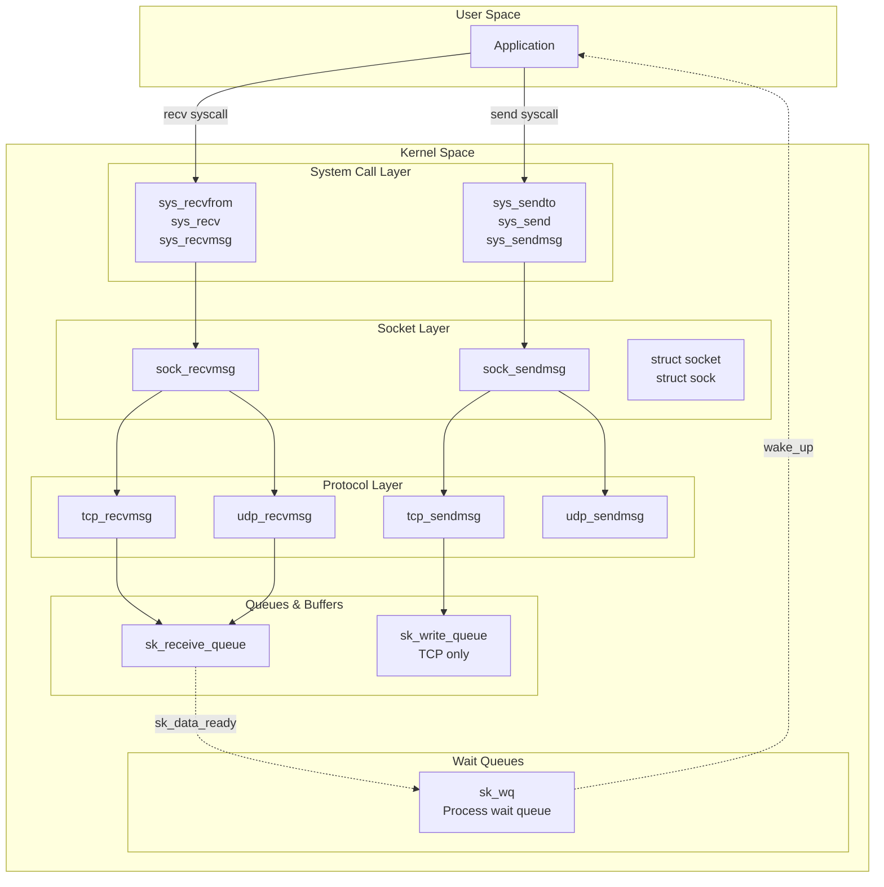
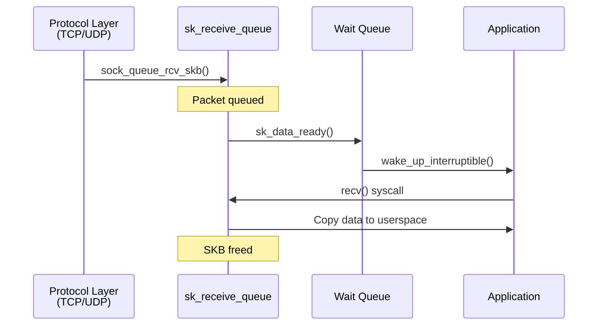
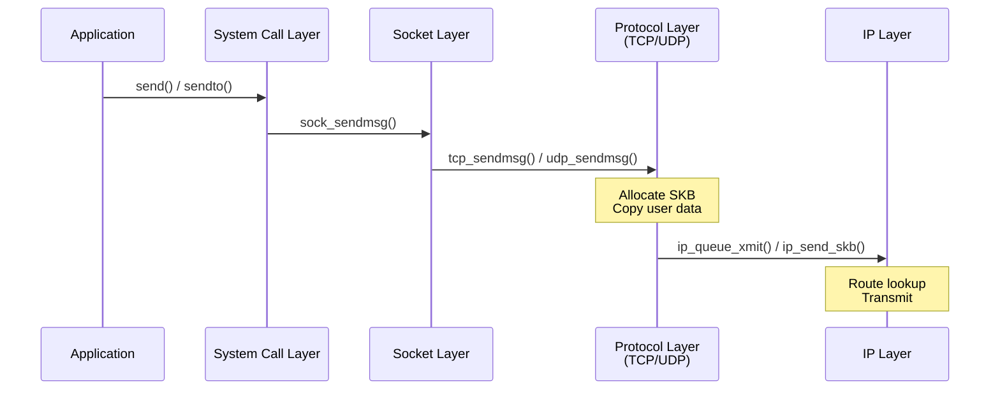
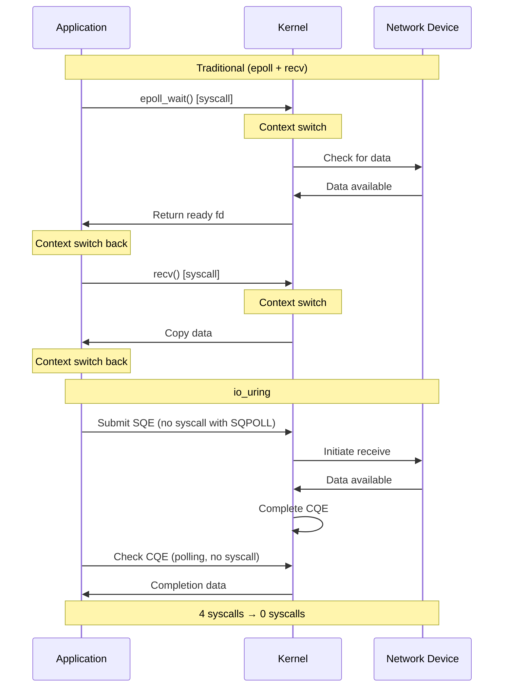
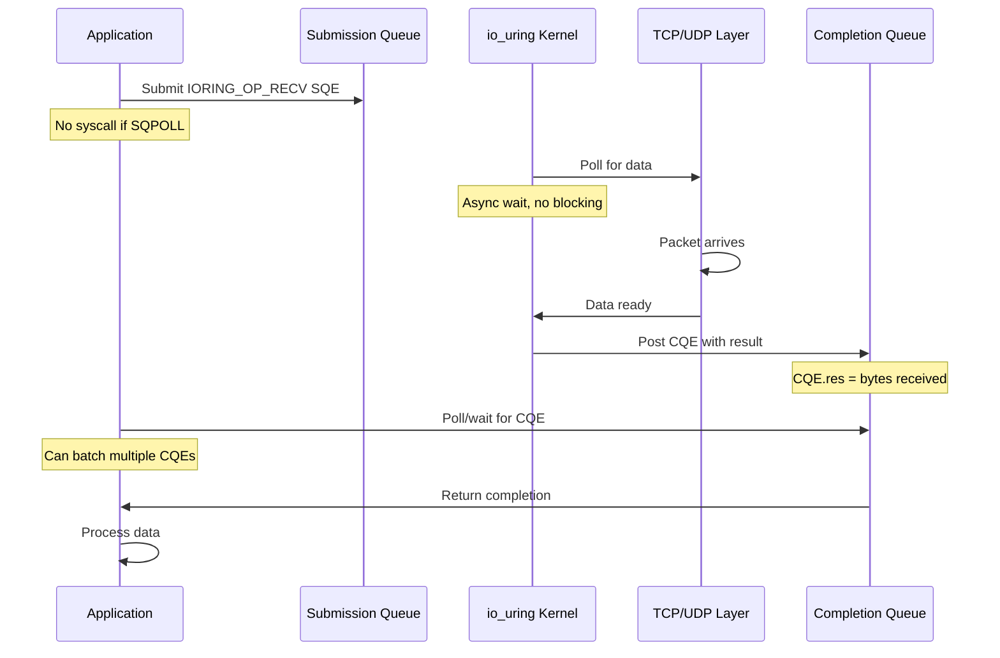
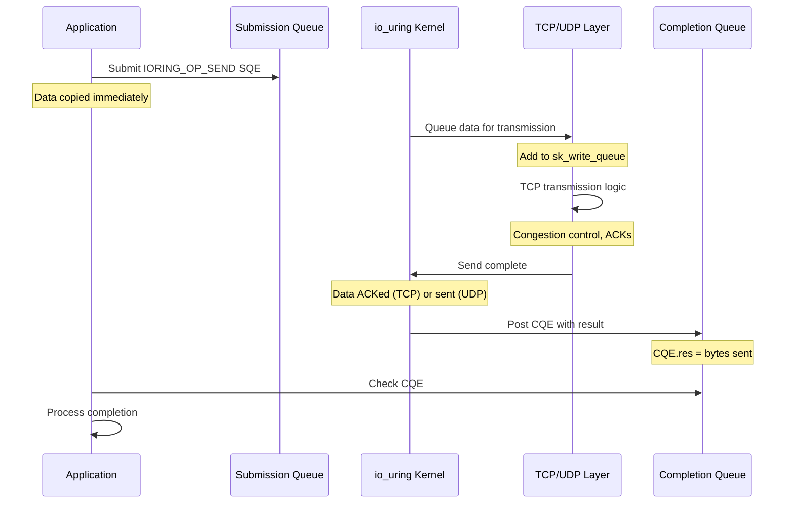

# Sockets: Traditional I/O

## Introduction

The socket layer is the interface between user applications and the kernel's networking stack. It bridges the gap between the transport protocols (TCP, UDP) and user-space system calls, providing a unified API for network I/O regardless of the underlying protocol.

This chapter covers **traditional socket I/O**, including:
- Blocking and non-blocking operations
- System call implementations (`recv()`, `send()`, etc.)
- Event notification mechanisms (`select()`, `poll()`, `epoll`)
- Buffer management and flow control
- Performance considerations

The next chapter, [Sockets: io_uring](./sockets_iouring.md), covers the modern asynchronous I/O interface.

### Role in the Network Stack

The socket layer sits between the system call interface and the transport layer:

```
┌─────────────────────────────────────┐
│         User Application            │
│  (recv, send, select, epoll, etc.)  │
└─────────────────────────────────────┘
              ↕ syscall
┌─────────────────────────────────────┐
│      System Call Layer (VFS)        │
│   (sys_recvfrom, sys_sendto, etc.)  │
└─────────────────────────────────────┘
              ↕
┌─────────────────────────────────────┐
│         Socket Layer  ← This chapter
│  (struct socket, struct sock, etc.)  │
└─────────────────────────────────────┘
              ↕
┌─────────────────────────────────────┐
│      Protocol Layer (TCP/UDP)       │
│  (tcp_recvmsg, udp_sendmsg, etc.)   │
└─────────────────────────────────────┘
```

**Data flow**:

- **Receive (RX)**: Protocol layer → Socket layer → Application
- **Transmit (TX)**: Application → Socket layer → Protocol layer

### Starting and Ending Points

This chapter connects to the transport layer chapters:

**Receive Path**:
- **Starting point**: 
  - UDP: `sock_queue_rcv_skb()` called from `udp_queue_rcv_skb()` ([udp.md](./udp.md) line 1810)
  - TCP: `sk_data_ready()` called from `tcp_data_queue()` ([tcp_reliability.md](./tcp_reliability.md) line 1123)
- **Ending point**: Application receives data via `recv()`/`recvfrom()`/`recvmsg()`

**Transmit Path**:
- **Starting point**: Application calls `send()`/`sendto()`/`sendmsg()`
- **Ending point**: 
  - UDP: Data handed to IP layer via `ip_send_skb()`
  - TCP: Data queued in `tcp_sendmsg()`, transmitted by `tcp_write_xmit()`

### Architecture Overview



**Key components**:

1. **File Descriptor**: Application's handle to the socket
2. **`struct socket`**: VFS layer socket representation
3. **`struct sock`**: Network layer socket state
4. **Receive Queue**: Packets waiting to be read by application
5. **Send Queue**: Data waiting to be transmitted (TCP)
6. **Wait Queues**: Processes blocked on socket I/O
7. **Callbacks**: Wakeup mechanisms (`sk_data_ready`, `sk_write_space`)

---

## Core Data Structures

The socket layer uses several key data structures to manage network connections.

### The Socket Hierarchy

Two primary structures represent a socket:

```
File Descriptor (int fd)
        ↓
struct file
        ↓
struct socket  ← VFS layer (generic)
        ↓
struct sock    ← Network layer (protocol-specific)
```

### `struct socket` - VFS Layer

The VFS (Virtual File System) layer representation:

```c
/* From include/linux/net.h */

struct socket {
    socket_state         state;          /* Socket state (SS_*) */
    short                type;           /* Socket type (SOCK_STREAM, SOCK_DGRAM, etc.) */
    unsigned long        flags;          /* Socket flags */
    struct file          *file;          /* Back pointer to file */
    struct sock          *sk;            /* Internal networking protocol socket */
    const struct proto_ops *ops;         /* Protocol operations */
    struct socket_wq     wq;             /* Wait queue */
};
```

**Key fields**:

- **`state`**: Socket state
  ```c
  typedef enum {
      SS_FREE = 0,              /* Not allocated */
      SS_UNCONNECTED,           /* Unconnected to any socket */
      SS_CONNECTING,            /* In process of connecting */
      SS_CONNECTED,             /* Connected to socket */
      SS_DISCONNECTING          /* In process of disconnecting */
  } socket_state;
  ```

- **`type`**: Socket type
  ```c
  #define SOCK_STREAM    1      /* TCP: stream socket */
  #define SOCK_DGRAM     2      /* UDP: datagram socket */
  #define SOCK_RAW       3      /* Raw protocol interface */
  #define SOCK_SEQPACKET 5      /* Sequenced packet stream (SCTP) */
  ```

- **`ops`**: Protocol-specific operations (function pointers)

- **`sk`**: Pointer to the network layer socket structure

### `struct sock` - Network Layer

The core networking structure, containing protocol state:

```c
/* From include/net/sock.h */

struct sock {
    /* Network family and protocol */
    unsigned short       sk_family;      /* AF_INET, AF_INET6, etc. */
    unsigned short       sk_type;        /* SOCK_STREAM, SOCK_DGRAM, etc. */
    int                  sk_protocol;    /* IPPROTO_TCP, IPPROTO_UDP, etc. */
    
    /* Socket queues */
    struct sk_buff_head  sk_receive_queue;   /* Incoming packets */
    struct sk_buff_head  sk_write_queue;     /* Outgoing packets (TCP) */
    struct sk_buff_head  sk_error_queue;     /* Error queue */
    
    /* Buffer accounting */
    atomic_t             sk_rmem_alloc;  /* Receive buffer bytes used */
    int                  sk_rcvbuf;      /* Receive buffer limit */
    atomic_t             sk_wmem_alloc;  /* Send buffer bytes used */
    int                  sk_sndbuf;      /* Send buffer limit */
    
    /* Wait queues */
    struct socket_wq __rcu *sk_wq;       /* Socket wait queue */
    
    /* Callbacks */
    void (*sk_data_ready)(struct sock *sk);     /* Data arrival notification */
    void (*sk_write_space)(struct sock *sk);    /* Write space available */
    void (*sk_error_report)(struct sock *sk);   /* Error notification */
    void (*sk_state_change)(struct sock *sk);   /* State change notification */
    
    /* Backlog queue for softirq context */
    struct sk_buff_head  sk_backlog;
    
    /* Socket options */
    unsigned long        sk_flags;
    unsigned long        sk_lingertime;  /* SO_LINGER timeout */
    struct timeval       sk_rcvtimeo;    /* SO_RCVTIMEO */
    struct timeval       sk_sndtimeo;    /* SO_SNDTIMEO */
    
    /* Protocol-specific data */
    struct proto         *sk_prot;       /* Protocol operations */
    void                 *sk_protinfo;   /* Protocol-specific state */
    
    /* ... many more fields ... */
};
```

**Key queues**:

1. **`sk_receive_queue`**: Packets ready for application to read
   - Populated by transport layer (`sock_queue_rcv_skb()`)
   - Consumed by application (`recvmsg()`)
   
2. **`sk_write_queue`**: Data waiting to be sent (TCP only)
   - Populated by application (`sendmsg()`)
   - Consumed by TCP stack (`tcp_write_xmit()`)
   
3. **`sk_error_queue`**: Extended error information
   - Used by `MSG_ERRQUEUE` (e.g., zero-copy completions)

**Buffer accounting**:

```c
/* Receive buffer */
atomic_t sk_rmem_alloc;  /* Current usage (bytes) */
int sk_rcvbuf;           /* Maximum size (bytes) */

/* Send buffer */
atomic_t sk_wmem_alloc;  /* Current usage (bytes) */
int sk_sndbuf;           /* Maximum size (bytes) */
```

**Default values**:

```bash
# Receive buffer
$ cat /proc/sys/net/core/rmem_default
212992    # 208 KB default

$ cat /proc/sys/net/core/rmem_max
212992    # 208 KB maximum (adjustable)

# Send buffer
$ cat /proc/sys/net/core/wmem_default
212992

$ cat /proc/sys/net/core/wmem_max
212992
```

### `struct proto_ops` - Protocol Operations

Function pointers for socket operations:

```c
/* From include/linux/net.h */

struct proto_ops {
    int family;  /* Protocol family (PF_INET, etc.) */
    struct module *owner;
    
    /* Socket lifecycle */
    int (*release)(struct socket *sock);
    int (*bind)(struct socket *sock, struct sockaddr *addr, int addr_len);
    int (*connect)(struct socket *sock, struct sockaddr *addr, int addr_len, int flags);
    int (*socketpair)(struct socket *sock1, struct socket *sock2);
    int (*accept)(struct socket *sock, struct socket *newsock, int flags, bool kern);
    int (*getname)(struct socket *sock, struct sockaddr *addr, int peer);
    
    /* I/O operations */
    int (*ioctl)(struct socket *sock, unsigned int cmd, unsigned long arg);
    int (*listen)(struct socket *sock, int len);
    int (*shutdown)(struct socket *sock, int flags);
    int (*setsockopt)(struct socket *sock, int level, int optname,
                     sockptr_t optval, unsigned int optlen);
    int (*getsockopt)(struct socket *sock, int level, int optname,
                     char __user *optval, int __user *optlen);
    
    /* Send and receive */
    int (*sendmsg)(struct socket *sock, struct msghdr *m, size_t total_len);
    int (*recvmsg)(struct socket *sock, struct msghdr *m, size_t total_len, int flags);
    
    /* Memory management */
    int (*mmap)(struct file *file, struct socket *sock, struct vm_area_struct *vma);
    ssize_t (*sendpage)(struct socket *sock, struct page *page, int offset,
                       size_t size, int flags);
    
    /* Polling */
    __poll_t (*poll)(struct file *file, struct socket *sock, struct poll_table_struct *wait);
};
```

**Implementations for inet sockets**:

```c
/* From net/ipv4/af_inet.c */

/* TCP sockets */
const struct proto_ops inet_stream_ops = {
    .family       = PF_INET,
    .owner        = THIS_MODULE,
    .release      = inet_release,
    .bind         = inet_bind,
    .connect      = inet_stream_connect,
    .socketpair   = sock_no_socketpair,
    .accept       = inet_accept,
    .getname      = inet_getname,
    .poll         = tcp_poll,
    .ioctl        = inet_ioctl,
    .listen       = inet_listen,
    .shutdown     = inet_shutdown,
    .setsockopt   = sock_common_setsockopt,
    .getsockopt   = sock_common_getsockopt,
    .sendmsg      = inet_sendmsg,
    .recvmsg      = inet_recvmsg,
    .mmap         = tcp_mmap,
    .sendpage     = inet_sendpage,
    /* ... */
};

/* UDP sockets */
const struct proto_ops inet_dgram_ops = {
    .family       = PF_INET,
    .owner        = THIS_MODULE,
    .release      = inet_release,
    .bind         = inet_bind,
    .connect      = inet_dgram_connect,
    .socketpair   = sock_no_socketpair,
    .accept       = sock_no_accept,
    .getname      = inet_getname,
    .poll         = udp_poll,
    .ioctl        = inet_ioctl,
    .listen       = sock_no_listen,
    .shutdown     = inet_shutdown,
    .setsockopt   = sock_common_setsockopt,
    .getsockopt   = sock_common_getsockopt,
    .sendmsg      = inet_sendmsg,
    .recvmsg      = inet_recvmsg,
    .mmap         = sock_no_mmap,
    .sendpage     = inet_sendpage,
    /* ... */
};
```

**Dispatch pattern**:

```c
/* Generic socket operation calls protocol-specific handler */
int sock_sendmsg(struct socket *sock, struct msghdr *msg, size_t len)
{
    /* Calls sock->ops->sendmsg() */
    return sock->ops->sendmsg(sock, msg, len);
}

/* For inet sockets, this becomes: */
inet_sendmsg(sock, msg, len)
    → tcp_sendmsg()   /* if TCP socket */
    → udp_sendmsg()   /* if UDP socket */
```

### `struct proto` - Protocol Implementation

Protocol-specific function pointers and parameters:

```c
/* From include/net/sock.h */

struct proto {
    /* Close connection */
    void (*close)(struct sock *sk, long timeout);
    
    /* Connect to remote */
    int (*connect)(struct sock *sk, struct sockaddr *uaddr, int addr_len);
    
    /* Disconnect */
    int (*disconnect)(struct sock *sk, int flags);
    
    /* Accept connection (TCP) */
    struct sock *(*accept)(struct sock *sk, int flags, int *err, bool kern);
    
    /* I/O operations */
    int (*ioctl)(struct sock *sk, int cmd, unsigned long arg);
    int (*init)(struct sock *sk);
    void (*destroy)(struct sock *sk);
    void (*shutdown)(struct sock *sk, int how);
    
    /* Socket options */
    int (*setsockopt)(struct sock *sk, int level, int optname,
                     sockptr_t optval, unsigned int optlen);
    int (*getsockopt)(struct sock *sk, int level, int optname,
                     char __user *optval, int __user *optlen);
    
    /* Send and receive */
    int (*sendmsg)(struct sock *sk, struct msghdr *msg, size_t len);
    int (*recvmsg)(struct sock *sk, struct msghdr *msg, size_t len,
                  int noblock, int flags, int *addr_len);
    int (*sendpage)(struct sock *sk, struct page *page, int offset,
                   size_t size, int flags);
    
    /* Backlog processing */
    int (*backlog_rcv)(struct sock *sk, struct sk_buff *skb);
    
    /* Memory management */
    void (*release_cb)(struct sock *sk);
    int (*hash)(struct sock *sk);
    void (*unhash)(struct sock *sk);
    struct sock *(*get_port)(struct sock *sk, unsigned short snum);
    
    /* Protocol parameters */
    unsigned int obj_size;      /* Size of protocol-specific structure */
    unsigned int slab_flags;    /* SLAB cache flags */
    char name[32];              /* Protocol name */
    
    /* Buffer sizes */
    int sysctl_mem[3];          /* Memory pressure thresholds */
    int sysctl_wmem[3];         /* Write memory [min, default, max] */
    int sysctl_rmem[3];         /* Read memory [min, default, max] */
    
    /* ... */
};
```

**Protocol implementations**:

```c
/* From net/ipv4/tcp_ipv4.c */

struct proto tcp_prot = {
    .name          = "TCP",
    .owner         = THIS_MODULE,
    .close         = tcp_close,
    .pre_connect   = tcp_v4_pre_connect,
    .connect       = tcp_v4_connect,
    .disconnect    = tcp_disconnect,
    .accept        = inet_csk_accept,
    .ioctl         = tcp_ioctl,
    .init          = tcp_v4_init_sock,
    .destroy       = tcp_v4_destroy_sock,
    .shutdown      = tcp_shutdown,
    .setsockopt    = tcp_setsockopt,
    .getsockopt    = tcp_getsockopt,
    .sendmsg       = tcp_sendmsg,
    .recvmsg       = tcp_recvmsg,
    .sendpage      = tcp_sendpage,
    .backlog_rcv   = tcp_v4_do_rcv,
    .hash          = inet_hash,
    .unhash        = inet_unhash,
    .get_port      = inet_csk_get_port,
    .obj_size      = sizeof(struct tcp_sock),
    /* ... */
};

/* From net/ipv4/udp.c */

struct proto udp_prot = {
    .name          = "UDP",
    .owner         = THIS_MODULE,
    .close         = udp_lib_close,
    .pre_connect   = udp_pre_connect,
    .connect       = ip4_datagram_connect,
    .disconnect    = udp_disconnect,
    .ioctl         = udp_ioctl,
    .init          = udp_init_sock,
    .destroy       = udp_destroy_sock,
    .setsockopt    = udp_setsockopt,
    .getsockopt    = udp_getsockopt,
    .sendmsg       = udp_sendmsg,
    .recvmsg       = udp_recvmsg,
    .sendpage      = udp_sendpage,
    .backlog_rcv   = __udp_queue_rcv_skb,
    .hash          = udp_lib_hash,
    .unhash        = udp_lib_unhash,
    .get_port      = udp_v4_get_port,
    .obj_size      = sizeof(struct udp_sock),
    /* ... */
};
```

### Socket Creation Flow

Creating a socket involves multiple layers:

```c
/* Application */
int fd = socket(AF_INET, SOCK_STREAM, IPPROTO_TCP);
```

**Kernel flow**:

```c
/* From net/socket.c */

SYSCALL_DEFINE3(socket, int, family, int, type, int, protocol)
{
    int retval;
    struct socket *sock;
    int flags;
    
    /* Extract socket flags from type */
    flags = type & ~SOCK_TYPE_MASK;
    if (flags & ~(SOCK_CLOEXEC | SOCK_NONBLOCK))
        return -EINVAL;
    type &= SOCK_TYPE_MASK;
    
    /* Create socket */
    retval = sock_create(family, type, protocol, &sock);
    if (retval < 0)
        return retval;
    
    /* Map socket to file descriptor */
    return sock_map_fd(sock, flags & (O_CLOEXEC | O_NONBLOCK));
}

int sock_create(int family, int type, int protocol, struct socket **res)
{
    return __sock_create(current->nsproxy->net_ns, family, type, protocol, res, 0);
}

int __sock_create(struct net *net, int family, int type, int protocol,
                 struct socket **res, int kern)
{
    int err;
    struct socket *sock;
    const struct net_proto_family *pf;
    
    /* Allocate socket structure */
    sock = sock_alloc();
    if (!sock) {
        net_warn_ratelimited("socket: no more sockets\n");
        return -ENFILE;
    }
    
    sock->type = type;
    
    /* Lookup protocol family */
    rcu_read_lock();
    pf = rcu_dereference(net_families[family]);
    if (!pf) {
        rcu_read_unlock();
        return -EAFNOSUPPORT;
    }
    
    /* Create protocol-specific socket */
    err = pf->create(net, sock, protocol, kern);
    rcu_read_unlock();
    
    if (err < 0)
        goto out_sock_release;
    
    *res = sock;
    return 0;
    
out_sock_release:
    sock_release(sock);
    return err;
}
```

**For AF_INET family**:

```c
/* From net/ipv4/af_inet.c */

static int inet_create(struct net *net, struct socket *sock, int protocol, int kern)
{
    struct sock *sk;
    struct inet_protosw *answer;
    struct inet_sock *inet;
    struct proto *answer_prot;
    
    /* Set socket state */
    sock->state = SS_UNCONNECTED;
    
    /* Lookup protocol within family */
    list_for_each_entry_rcu(answer, &inetsw[sock->type], list) {
        if (protocol == answer->protocol) {
            /* Match found */
            goto found;
        }
    }
    
    /* Not found */
    err = -EPROTONOSUPPORT;
    goto out_rcu_unlock;
    
found:
    err = -EPERM;
    if (sock->type == SOCK_RAW && !kern && !ns_capable(net->user_ns, CAP_NET_RAW))
        goto out_rcu_unlock;
    
    /* Set socket operations */
    sock->ops = answer->ops;
    answer_prot = answer->prot;
    
    err = -ENOBUFS;
    /* Allocate protocol-specific socket */
    sk = sk_alloc(net, PF_INET, GFP_KERNEL, answer_prot, kern);
    if (!sk)
        goto out;
    
    err = 0;
    if (INET_PROTOSW_REUSE & answer->flags)
        sk->sk_reuse = SK_CAN_REUSE;
    
    /* Initialize inet_sock */
    inet = inet_sk(sk);
    inet->is_icsk = (INET_PROTOSW_ICSK & answer->flags) != 0;
    inet->nodefrag = 0;
    
    if (SOCK_RAW == sock->type) {
        inet->inet_num = protocol;
        if (IPPROTO_RAW == protocol)
            inet->hdrincl = 1;
    }
    
    /* Protocol-specific initialization */
    if (sk->sk_prot->init) {
        err = sk->sk_prot->init(sk);
        if (err)
            sk_common_release(sk);
    }
    
    /* Link socket and sock */
    sock_init_data(sock, sk);
    
out:
    return err;
    
out_rcu_unlock:
    rcu_read_unlock();
    return err;
}
```

**Complete creation flow**:

```
Application: socket(AF_INET, SOCK_STREAM, IPPROTO_TCP)
     ↓
sys_socket()
     ↓
sock_create(AF_INET, SOCK_STREAM, IPPROTO_TCP, &sock)
     ↓
__sock_create()
     ├─> sock_alloc()           /* Allocate struct socket */
     └─> pf->create()            /* Call protocol family creator */
           ↓
         inet_create()
           ├─> Lookup SOCK_STREAM in inetsw[]  → find tcp_prot
           ├─> Set sock->ops = &inet_stream_ops
           ├─> sk_alloc()         /* Allocate struct sock */
           ├─> tcp_v4_init_sock() /* Initialize TCP socket */
           └─> sock_init_data()   /* Link socket ↔ sock */
     ↓
sock_map_fd()  /* Allocate fd, create struct file, link to socket */
     ↓
Return fd to application
```

**Result**:

```
fd (e.g., 3)
  ↓
struct file
  ↓ file->private_data
struct socket
  ├─> sock->ops = &inet_stream_ops
  └─> sock->sk = struct sock
        ├─> sk->sk_family = AF_INET
        ├─> sk->sk_type = SOCK_STREAM
        ├─> sk->sk_protocol = IPPROTO_TCP
        ├─> sk->sk_prot = &tcp_prot
        ├─> sk->sk_receive_queue = (empty)
        ├─> sk->sk_write_queue = (empty)
        ├─> sk->sk_data_ready = sock_def_readable
        └─> sk->sk_write_space = sock_def_write_space
```

### Protocol Registration

Protocols register themselves during kernel initialization:

```c
/* From net/ipv4/af_inet.c */

static struct inet_protosw inetsw_array[] = {
    {
        .type       = SOCK_STREAM,
        .protocol   = IPPROTO_TCP,
        .prot       = &tcp_prot,
        .ops        = &inet_stream_ops,
        .flags      = INET_PROTOSW_PERMANENT | INET_PROTOSW_ICSK,
    },
    {
        .type       = SOCK_DGRAM,
        .protocol   = IPPROTO_UDP,
        .prot       = &udp_prot,
        .ops        = &inet_dgram_ops,
        .flags      = INET_PROTOSW_PERMANENT,
    },
    {
        .type       = SOCK_DGRAM,
        .protocol   = IPPROTO_ICMP,
        .prot       = &ping_prot,
        .ops        = &inet_sockraw_ops,
        .flags      = INET_PROTOSW_REUSE,
    },
    {
        .type       = SOCK_RAW,
        .protocol   = IPPROTO_IP,  /* wildcard */
        .prot       = &raw_prot,
        .ops        = &inet_sockraw_ops,
        .flags      = INET_PROTOSW_REUSE,
    }
};

static int __init inet_init(void)
{
    /* ... */
    
    /* Register protocols */
    for (q = inetsw_array; q < &inetsw_array[INETSW_ARRAY_LEN]; ++q)
        inet_register_protosw(q);
    
    /* ... */
}
```

---


## Receive Path

The receive path moves data from the transport layer to the application. This section covers the complete flow from packet arrival to application read.

### Overview



**Steps**:

1. **Packet arrival**: Transport layer calls `sock_queue_rcv_skb()`
2. **Queueing**: Packet added to `sk_receive_queue`
3. **Notification**: `sk_data_ready()` callback wakes waiting processes
4. **System call**: Application calls `recv()`/`recvfrom()`/`recvmsg()`
5. **Data copy**: Kernel copies data to userspace buffer
6. **Cleanup**: SKB freed, memory returned to socket

### Socket Receive Queue

The receive queue is a linked list of SKBs (socket buffers) waiting to be read:

```c
/* From include/net/sock.h */

struct sock {
    /* ... */
    struct sk_buff_head sk_receive_queue;  /* Linked list of SKBs */
    /* ... */
};

/* SKB list structure */
struct sk_buff_head {
    struct sk_buff *next;
    struct sk_buff *prev;
    __u32 qlen;              /* Queue length */
    spinlock_t lock;         /* Queue lock */
};
```

**Already covered in detail**:

The mechanics of `sock_queue_rcv_skb()` are extensively documented in [udp.md](./udp.md) (lines 1810-1960), including:
- Buffer limit checking (`sk_rmem_alloc` vs `sk_rcvbuf`)
- BPF filtering (`sk_filter()`)
- Timestamp recording
- Memory accounting
- Queue locking
- SKB destructor setup (`sock_rfree()`)

**TCP-specific differences**:

TCP coalesces adjacent segments for efficiency:

```c
/* From net/ipv4/tcp_input.c */

static int tcp_queue_rcv(struct sock *sk, struct sk_buff *skb, int hdrlen,
                          bool *fragstolen)
{
    struct tcp_sock *tp = tcp_sk(sk);
    int eaten;
    struct sk_buff *tail = skb_peek_tail(&sk->sk_receive_queue);
    
    __skb_pull(skb, hdrlen);  /* Remove TCP header */
    
    /* Try to coalesce with last SKB in queue (if contiguous) */
    if (tail) {
        if (TCP_SKB_CB(tail)->end_seq == TCP_SKB_CB(skb)->seq &&
            !skb_has_frag_list(tail) && !skb_has_frag_list(skb)) {
            
            /* Coalesce: append this SKB's data to previous SKB */
            eaten = skb_try_coalesce(tail, skb, fragstolen, &nr_frags);
            if (eaten > 0) {
                /* Successful coalesce */
                TCP_SKB_CB(tail)->end_seq = TCP_SKB_CB(skb)->end_seq;
                
                /* Update flags if FIN was in this packet */
                if (TCP_SKB_CB(skb)->tcp_flags & TCPHDR_FIN)
                    TCP_SKB_CB(tail)->tcp_flags |= TCPHDR_FIN;
                
                return eaten;
            }
        }
    }
    
    /* Cannot coalesce: add as new SKB */
    eaten = -1;
    __skb_queue_tail(&sk->sk_receive_queue, skb);
    skb_set_owner_r(skb, sk);
    
    return eaten;
}
```

**Benefits of coalescing**:
- Fewer SKBs in queue
- Single `recv()` call reads more data
- Better cache locality
- Reduced queue management overhead

### Wait Queues and Blocking

When no data is available, the application blocks until data arrives.

#### Wait Queue Structure

```c
/* From include/linux/socket.h */

struct socket_wq {
    wait_queue_head_t wait;      /* Wait queue head */
    struct fasync_struct *fasync_list;  /* Async I/O notification */
    unsigned long flags;
    struct rcu_head rcu;
};

/* Sock structure references wait queue */
struct sock {
    /* ... */
    struct socket_wq __rcu *sk_wq;
    /* ... */
};
```

**Wait queue head**:

```c
/* From include/linux/wait.h */

struct wait_queue_head {
    spinlock_t lock;
    struct list_head head;  /* List of waiting processes */
};

/* Each waiting process has a wait queue entry */
struct wait_queue_entry {
    unsigned int flags;
    void *private;          /* Usually struct task_struct */
    wait_queue_func_t func; /* Wakeup function */
    struct list_head entry; /* List linkage */
};
```

#### Blocking on Receive

When an application calls `recv()` and no data is available:

```c
/* From net/core/sock.c */

int sock_recvmsg(struct socket *sock, struct msghdr *msg, int flags)
{
    /* ... */
    return sock_recvmsg_nosec(sock, msg, flags);
}

static inline int sock_recvmsg_nosec(struct socket *sock, struct msghdr *msg, int flags)
{
    return sock->ops->recvmsg(sock, msg, msg_data_left(msg), flags);
}

/* For TCP sockets, this becomes: */

/* From net/ipv4/tcp.c */

int tcp_recvmsg(struct sock *sk, struct msghdr *msg, size_t len,
                int nonblock, int flags, int *addr_len)
{
    struct tcp_sock *tp = tcp_sk(sk);
    int copied = 0;
    long timeo;
    
    /* Calculate timeout */
    timeo = sock_rcvtimeo(sk, nonblock);
    
    do {
        struct sk_buff *skb;
        u32 offset;
        
        /* Check for data in receive queue */
        skb = skb_peek(&sk->sk_receive_queue);
        
        if (skb) {
            /* Data available: copy to userspace */
            /* ... copying logic ... */
        }
        
        if (copied >= target)
            break;
        
        /* No data available: must we block? */
        if (copied) {
            /* Already copied some data: return what we have */
            if (sk->sk_err || sk->sk_state == TCP_CLOSE ||
                (sk->sk_shutdown & RCV_SHUTDOWN) || !timeo ||
                signal_pending(current))
                break;
        } else {
            /* No data copied yet */
            if (sk->sk_err) {
                copied = sock_error(sk);
                break;
            }
            
            if (sk->sk_shutdown & RCV_SHUTDOWN)
                break;
            
            if (sk->sk_state == TCP_CLOSE) {
                copied = -ENOTCONN;
                break;
            }
            
            if (!timeo) {
                /* Non-blocking: return EAGAIN */
                copied = -EAGAIN;
                break;
            }
            
            if (signal_pending(current)) {
                copied = sock_intr_errno(timeo);
                break;
            }
        }
        
        /* Release socket lock before sleeping */
        sk_wait_data(sk, &timeo, NULL);
        
    } while (len > 0);
    
    return copied;
}

/* Block waiting for data */
int sk_wait_data(struct sock *sk, long *timeo, const struct sk_buff *skb)
{
    DEFINE_WAIT_FUNC(wait, woken_wake_function);
    int rc;
    
    /* Add ourselves to wait queue */
    add_wait_queue(sk_sleep(sk), &wait);
    
    /* Set process state to TASK_INTERRUPTIBLE */
    sk_set_bit(SOCKWQ_ASYNC_WAITDATA, sk);
    
    rc = sk_wait_event(sk, timeo, sk->sk_receive_queue.qlen != 0, &wait);
    
    sk_clear_bit(SOCKWQ_ASYNC_WAITDATA, sk);
    remove_wait_queue(sk_sleep(sk), &wait);
    
    return rc;
}
```

**Process state during blocking**:

```
Application calls recv()
     ↓
No data in sk_receive_queue
     ↓
Add wait queue entry to sk->sk_wq->wait
     ↓
Set process state: TASK_INTERRUPTIBLE
     ↓
Schedule() → context switch to another process
     ↓
(Process is now sleeping)
     ↓
Packet arrives → sk_data_ready()
     ↓
wake_up_interruptible_sync_poll()
     ↓
Set process state: TASK_RUNNING
     ↓
Scheduler eventually runs this process
     ↓
recv() continues, copies data
```

#### Waking Blocked Readers

When data arrives, the transport layer calls `sk_data_ready()`:

```c
/* From tcp_reliability.md line 1123 */

static void tcp_data_queue(struct sock *sk, struct sk_buff *skb)
{
    /* ... queuing logic ... */
    
    /* Wake up application */
    if (!sock_flag(sk, SOCK_DEAD))
        sk->sk_data_ready(sk);
    
    /* ... */
}

/* Default sk_data_ready implementation */
/* From net/core/sock.c */

void sock_def_readable(struct sock *sk)
{
    struct socket_wq *wq;
    
    rcu_read_lock();
    wq = rcu_dereference(sk->sk_wq);
    
    if (skwq_has_sleeper(wq)) {
        /* Wake processes sleeping on socket */
        wake_up_interruptible_sync_poll(&wq->wait,
                                        EPOLLIN | EPOLLRDNORM | EPOLLRDBAND);
    }
    
    /* Notify async I/O */
    sk_wake_async(sk, SOCK_WAKE_WAITD, POLL_IN);
    
    rcu_read_unlock();
}
```

**What gets woken**:

1. **Blocking `recv()` calls**: Processes in `TASK_INTERRUPTIBLE` state
2. **`select()` / `poll()`**: Processes waiting on this fd
3. **`epoll`**: Epoll instances monitoring this socket for `EPOLLIN`
4. **Async I/O**: Signal-driven I/O (`SIGIO` delivery)

**Wakeup mechanics**:

```c
/* From kernel/sched/wait.c */

void __wake_up(struct wait_queue_head *wq_head, unsigned int mode,
               int nr_exclusive, void *key)
{
    unsigned long flags;
    
    spin_lock_irqsave(&wq_head->lock, flags);
    __wake_up_common(wq_head, mode, nr_exclusive, 0, key, NULL);
    spin_unlock_irqrestore(&wq_head->lock, flags);
}

static int __wake_up_common(struct wait_queue_head *wq_head, unsigned int mode,
                            int nr_exclusive, int wake_flags, void *key,
                            wait_queue_entry_t *bookmark)
{
    wait_queue_entry_t *curr, *next;
    int cnt = 0;
    
    /* Iterate wait queue entries */
    list_for_each_entry_safe_from(curr, next, &wq_head->head, entry) {
        unsigned flags = curr->flags;
        int ret;
        
        /* Call wakeup function (usually default_wake_function) */
        ret = curr->func(curr, mode, wake_flags, key);
        if (ret < 0)
            break;
        
        if (ret && (flags & WQ_FLAG_EXCLUSIVE) && !--nr_exclusive)
            break;
        
        cnt++;
    }
    
    return cnt;
}

/* Default wake function */
int default_wake_function(wait_queue_entry_t *curr, unsigned mode, int wake_flags,
                         void *key)
{
    struct task_struct *p = curr->private;
    
    /* Wake up the process */
    return try_to_wake_up(p, mode, wake_flags);
}
```

### Receive System Calls

Three main system calls for receiving data:

1. **`recv()`**: Simple receive
2. **`recvfrom()`**: Receive with source address
3. **`recvmsg()`**: Full-featured receive (scatter-gather, control messages)

All three eventually call into the socket layer's `sock_recvmsg()`.

#### `sys_recvfrom()` Entry Point

```c
/* From net/socket.c */

SYSCALL_DEFINE6(recvfrom, int, fd, void __user *, ubuf, size_t, size,
                unsigned int, flags, struct sockaddr __user *, addr,
                int __user *, addr_len)
{
    struct socket *sock;
    struct iovec iov;
    struct msghdr msg;
    struct sockaddr_storage address;
    int err, err2;
    int fput_needed;
    
    /* Lookup socket from file descriptor */
    sock = sockfd_lookup_light(fd, &err, &fput_needed);
    if (!sock)
        goto out;
    
    /* Setup iovec for single buffer */
    err = import_single_range(READ, ubuf, size, &iov, &msg.msg_iter);
    if (unlikely(err))
        goto out_put;
    
    /* Initialize msghdr */
    msg.msg_control = NULL;
    msg.msg_controllen = 0;
    msg.msg_name = addr ? (struct sockaddr *)&address : NULL;
    msg.msg_namelen = 0;
    msg.msg_iocb = NULL;
    msg.msg_flags = 0;
    
    /* Perform receive */
    err = sock_recvmsg(sock, &msg, flags);
    
    /* Copy source address to userspace if requested */
    if (err >= 0 && addr != NULL) {
        err2 = move_addr_to_user(&address, msg.msg_namelen, addr, addr_len);
        if (err2 < 0)
            err = err2;
    }
    
out_put:
    fput_light(sock->file, fput_needed);
out:
    return err;
}

/* recv() is just recvfrom() without address */
SYSCALL_DEFINE4(recv, int, fd, void __user *, ubuf, size_t, size,
                unsigned int, flags)
{
    return __sys_recvfrom(fd, ubuf, size, flags, NULL, NULL);
}
```

**Key steps**:

1. **FD lookup**: `sockfd_lookup_light()` converts fd to `struct socket *`
2. **Setup**: Prepare `struct msghdr` with user buffer
3. **Receive**: Call `sock_recvmsg()`
4. **Address copy**: If requested, copy source address to userspace

#### `sock_recvmsg()` Socket Layer

```c
/* From net/socket.c */

int sock_recvmsg(struct socket *sock, struct msghdr *msg, int flags)
{
    int err;
    
    /* Set MSG_flags in msghdr */
    msg->msg_flags = flags;
    
    /* Security hooks */
    err = security_socket_recvmsg(sock, msg, msg_data_left(msg), flags);
    if (err)
        return err;
    
    /* Call protocol-specific recvmsg */
    return sock_recvmsg_nosec(sock, msg, flags);
}

static inline int sock_recvmsg_nosec(struct socket *sock, struct msghdr *msg,
                                     int flags)
{
    /* Dispatch to protocol operations */
    return sock->ops->recvmsg(sock, msg, msg_data_left(msg), flags);
}
```

**Protocol dispatch**:

```c
/* For inet sockets */

/* From net/ipv4/af_inet.c */

int inet_recvmsg(struct socket *sock, struct msghdr *msg, size_t size,
                 int flags)
{
    struct sock *sk = sock->sk;
    int addr_len = 0;
    int err;
    
    /* Call protocol-specific recvmsg */
    err = sk->sk_prot->recvmsg(sk, msg, size, flags & MSG_DONTWAIT,
                               flags & ~MSG_DONTWAIT, &addr_len);
    
    if (err >= 0)
        msg->msg_namelen = addr_len;
    
    return err;
}

/* This calls:
 *   tcp_recvmsg() for TCP sockets
 *   udp_recvmsg() for UDP sockets
 */
```

#### UDP Receive: `udp_recvmsg()`

Already detailed in [udp.md](./udp.md) (lines 3357-3388):

```c
/* From net/ipv4/udp.c */

int udp_recvmsg(struct sock *sk, struct msghdr *msg, size_t len,
                int noblock, int flags, int *addr_len)
{
    struct sk_buff *skb;
    int copied;
    int err;
    
    /* Dequeue from receive queue */
    skb = __skb_recv_udp(sk, flags, noblock, &err);
    if (!skb)
        return err;
    
    /* Calculate data length */
    copied = skb->len;
    if (copied > len) {
        copied = len;
        msg->msg_flags |= MSG_TRUNC;  /* Indicate truncation */
    }
    
    /* Copy data to userspace */
    err = skb_copy_datagram_msg(skb, 0, msg, copied);
    if (err)
        goto out_free;
    
    /* Fill in source address if requested */
    if (msg->msg_name) {
        struct sockaddr_in *sin = (struct sockaddr_in *)msg->msg_name;
        
        sin->sin_family = AF_INET;
        sin->sin_port = udp_hdr(skb)->source;
        sin->sin_addr.s_addr = ip_hdr(skb)->saddr;
        memset(sin->sin_zero, 0, sizeof(sin->sin_zero));
        *addr_len = sizeof(*sin);
    }
    
    /* Handle control messages (MSG_TRUNC, MSG_CTRUNC, etc.) */
    if (flags & MSG_TRUNC)
        copied = skb->len;
    
    /* Timestamp and other control messages */
    sock_recv_ts_and_drops(msg, sk, skb);
    
out_free:
    /* Free SKB */
    skb_free_datagram(sk, skb);  /* Calls sock_rfree() */
    
    return err ? err : copied;
}
```

**Key differences from TCP**:

- **Message boundaries**: UDP preserves datagram boundaries (one `recv()` = one datagram)
- **Truncation**: If buffer too small, data truncated (MSG_TRUNC flag set)
- **Source address**: Always available (connection-less protocol)

#### TCP Receive: `tcp_recvmsg()`

More complex due to streaming nature:

```c
/* From net/ipv4/tcp.c */

int tcp_recvmsg(struct sock *sk, struct msghdr *msg, size_t len,
                int nonblock, int flags, int *addr_len)
{
    struct tcp_sock *tp = tcp_sk(sk);
    int copied = 0;
    u32 peek_seq;
    u32 *seq;
    unsigned long used;
    int err;
    int target;      /* Read at least this many bytes */
    long timeo;
    struct sk_buff *skb, *last;
    u32 urg_hole = 0;
    
    /* Lock socket */
    lock_sock(sk);
    
    /* Calculate timeout */
    timeo = sock_rcvtimeo(sk, nonblock);
    
    /* How much to read? */
    target = sock_rcvlowat(sk, flags & MSG_WAITALL, len);
    
    /* Sequence tracking for MSG_PEEK */
    peek_seq = tp->copied_seq;
    seq = &tp->copied_seq;
    if (flags & MSG_PEEK)
        seq = &peek_seq;
    
    do {
        u32 offset;
        
        /* 1. Check for urgent data */
        if (unlikely(tp->urg_data) && tp->urg_seq == *seq) {
            if (copied)
                break;
            if (signal_pending(current)) {
                copied = timeo ? sock_intr_errno(timeo) : -EAGAIN;
                break;
            }
        }
        
        /* 2. Get next SKB from receive queue */
        last = skb_peek_tail(&sk->sk_receive_queue);
        skb_queue_walk(&sk->sk_receive_queue, skb) {
            u32 start = TCP_SKB_CB(skb)->seq;
            u32 end = TCP_SKB_CB(skb)->end_seq;
            u32 offset_in_skb;
            
            /* Skip already-copied data */
            if (before(*seq, start))
                break;
            
            offset_in_skb = *seq - start;
            
            /* 3. Copy data from this SKB */
            if (offset_in_skb < skb->len) {
                size_t used_in_skb = skb->len - offset_in_skb;
                size_t copy = min_t(size_t, len - copied, used_in_skb);
                
                /* Copy to userspace */
                err = skb_copy_datagram_msg(skb, offset_in_skb, msg, copy);
                if (err) {
                    if (!copied)
                        copied = -EFAULT;
                    break;
                }
                
                *seq += copy;
                copied += copy;
                
                /* Check if we've read enough */
                if (copied >= target)
                    break;
                
                /* Continue with next SKB if more data needed */
            }
            
            /* 4. Check for FIN */
            if (TCP_SKB_CB(skb)->tcp_flags & TCPHDR_FIN) {
                sk_eat_skb(sk, skb);
                ++*seq;
                break;
            }
            
            /* 5. Consume SKB if all data read */
            sk_eat_skb(sk, skb);
            if (!desc.count)
                break;
            
            tp->copied_seq = *seq;
        }
        
        tp->copied_seq = *seq;
        
        /* 6. Update receive window */
        tcp_cleanup_rbuf(sk, copied);
        
        /* 7. Check if we should continue */
        if (copied >= target) {
            /* Got enough data */
            break;
        }
        
        if (copied) {
            /* Got some data, check if we should return */
            if (sk->sk_err || sk->sk_state == TCP_CLOSE ||
                (sk->sk_shutdown & RCV_SHUTDOWN) || !timeo ||
                signal_pending(current))
                break;
        } else {
            /* No data yet, check error conditions */
            if (sk->sk_err) {
                copied = sock_error(sk);
                break;
            }
            
            if (sk->sk_shutdown & RCV_SHUTDOWN)
                break;
            
            if (sk->sk_state == TCP_CLOSE) {
                if (!sock_flag(sk, SOCK_DONE)) {
                    copied = -ENOTCONN;
                    break;
                }
                break;
            }
            
            if (!timeo) {
                copied = -EAGAIN;
                break;
            }
            
            if (signal_pending(current)) {
                copied = sock_intr_errno(timeo);
                break;
            }
        }
        
        /* 8. Clean up receive buffer before potentially blocking */
        tcp_cleanup_rbuf(sk, copied);
        
        /* 9. Wait for more data */
        sk_wait_data(sk, &timeo, last);
        
    } while (len > copied);
    
    /* Final cleanup */
    tcp_cleanup_rbuf(sk, copied);
    
    release_sock(sk);
    return copied;
}
```

**Key aspects**:

1. **Streaming**: Can read partial data from multiple SKBs
2. **`copied_seq`**: Tracks next byte to copy
3. **`MSG_PEEK`**: Read without consuming (doesn't update `copied_seq`)
4. **`MSG_WAITALL`**: Wait for full request (or timeout/error)
5. **`tcp_cleanup_rbuf()`**: Sends ACKs after data consumed

**Cleanup and ACK generation**:

```c
/* From net/ipv4/tcp.c */

void tcp_cleanup_rbuf(struct sock *sk, int copied)
{
    struct tcp_sock *tp = tcp_sk(sk);
    bool time_to_ack = false;
    
    /* Do we need to send an ACK? */
    if (copied > 0) {
        /* We read data: update window */
        const struct inet_connection_sock *icsk = inet_csk(sk);
        
        /* Check if window opened significantly */
        if (copied >= icsk->icsk_ack.rcv_mss ||
            /* ... other conditions ... */) {
            time_to_ack = true;
        }
    }
    
    if (time_to_ack)
        tcp_send_ack(sk);
}
```

This ensures the sender knows we've freed up buffer space.


### Non-Blocking Receive

Non-blocking sockets return immediately if no data is available, instead of blocking.

#### Setting Non-Blocking Mode

Two ways to enable non-blocking:

**1. At socket creation**:

```c
/* Application code */
int fd = socket(AF_INET, SOCK_STREAM | SOCK_NONBLOCK, 0);
```

**2. Via `fcntl()`**:

```c
int flags = fcntl(fd, F_GETFL, 0);
fcntl(fd, F_SETFL, flags | O_NONBLOCK);
```

**3. Per-operation with `MSG_DONTWAIT`**:

```c
/* One-time non-blocking receive */
recv(fd, buf, len, MSG_DONTWAIT);
```

#### Implementation

```c
/* From net/ipv4/tcp.c */

int tcp_recvmsg(struct sock *sk, struct msghdr *msg, size_t len,
                int nonblock, int flags, int *addr_len)
{
    /* ... */
    
    /* Calculate timeout */
    timeo = sock_rcvtimeo(sk, nonblock);
    
    do {
        /* ... try to read data ... */
        
        if (copied >= target)
            break;
        
        /* No data available */
        if (copied) {
            /* Already have some data: return it */
            /* ... */
        } else {
            /* No data copied yet */
            
            /* Non-blocking: return EAGAIN immediately */
            if (!timeo) {
                copied = -EAGAIN;
                break;
            }
            
            /* Blocking: wait for data */
            sk_wait_data(sk, &timeo, last);
        }
    } while (len > copied);
    
    /* ... */
}

/* Calculate receive timeout */
static inline long sock_rcvtimeo(const struct sock *sk, bool noblock)
{
    /* Non-blocking: timeout is 0 */
    return noblock ? 0 : sk->sk_rcvtimeo;
}
```

**Return values**:

```c
/* Blocking: */
n = recv(fd, buf, len, 0);
/* Returns when:
 *   n > 0:  Data received
 *   n == 0: Connection closed (TCP) or zero-length datagram (UDP)
 *   n < 0:  Error (errno set)
 */

/* Non-blocking: */
n = recv(fd, buf, len, MSG_DONTWAIT);
/* Returns immediately:
 *   n > 0:  Data received
 *   n == 0: Connection closed or zero-length datagram
 *   n < 0, errno == EAGAIN/EWOULDBLOCK: No data available
 *   n < 0, other errno: Real error
 */
```

**Usage pattern**:

```c
/* Application: Non-blocking receive with retry */

int fd = socket(AF_INET, SOCK_STREAM | SOCK_NONBLOCK, 0);
/* ... connect ... */

while (1) {
    char buf[1024];
    ssize_t n = recv(fd, buf, sizeof(buf), 0);
    
    if (n > 0) {
        /* Data received */
        process_data(buf, n);
    } else if (n == 0) {
        /* Connection closed */
        break;
    } else {
        /* Error */
        if (errno == EAGAIN || errno == EWOULDBLOCK) {
            /* No data yet: do other work or use epoll */
            do_other_work();
        } else {
            /* Real error */
            perror("recv");
            break;
        }
    }
}
```

### Receive Timeouts

Set maximum time to wait for data:

```c
/* Application code */

struct timeval timeout;
timeout.tv_sec = 5;     /* 5 seconds */
timeout.tv_usec = 0;

setsockopt(fd, SOL_SOCKET, SO_RCVTIMEO, &timeout, sizeof(timeout));

/* Now recv() will timeout after 5 seconds */
ssize_t n = recv(fd, buf, len, 0);
if (n < 0 && errno == EAGAIN) {
    /* Timeout occurred */
}
```

**Kernel implementation**:

```c
/* From net/core/sock.c */

int sock_setsockopt(struct socket *sock, int level, int optname,
                   sockptr_t optval, unsigned int optlen)
{
    /* ... */
    
    case SO_RCVTIMEO:
        ret = sock_set_timeout(&sk->sk_rcvtimeo, optval, optlen);
        break;
    
    case SO_SNDTIMEO:
        ret = sock_set_timeout(&sk->sk_sndtimeo, optval, optlen);
        break;
    
    /* ... */
}

static int sock_set_timeout(long *timeo_p, sockptr_t optval, int optlen)
{
    struct timeval tv;
    
    if (optlen < sizeof(tv))
        return -EINVAL;
    
    if (copy_from_sockptr(&tv, optval, sizeof(tv)))
        return -EFAULT;
    
    if (tv.tv_usec < 0 || tv.tv_usec >= USEC_PER_SEC)
        return -EDOM;
    
    *timeo_p = (long)tv.tv_sec * HZ + (tv.tv_usec * HZ) / USEC_PER_SEC;
    
    return 0;
}
```

**Timeout behavior**:

```c
/* In tcp_recvmsg() */

timeo = sock_rcvtimeo(sk, nonblock);  /* Get timeout in jiffies */

/* Wait for data with timeout */
sk_wait_data(sk, &timeo, last);

/* If timeo becomes 0, next iteration will return -EAGAIN */
```

### Zero-Copy Receive

Zero-copy minimizes data copying by mapping packet pages directly into userspace.

#### MSG_ZEROCOPY on Receive (Experimental)

```c
/* Application setup */

/* Enable zero-copy receive */
int val = 1;
setsockopt(fd, SOL_SOCKET, SO_ZEROCOPY, &val, sizeof(val));

/* Receive with zero-copy */
struct msghdr msg = {0};
struct iovec iov;
char buf[4096];

iov.iov_base = buf;
iov.iov_len = sizeof(buf);
msg.msg_iov = &iov;
msg.msg_iovlen = 1;

ssize_t n = recvmsg(fd, &msg, MSG_ZEROCOPY);
```

**Kernel implementation** (simplified concept):

```c
/* Instead of copy_to_user(), map pages */

if (sock_flag(sk, SOCK_ZEROCOPY) && can_zerocopy(skb)) {
    /* Map SKB pages into userspace VMA */
    err = skb_zerocopy_to_user(skb, msg);
} else {
    /* Traditional copy */
    err = skb_copy_datagram_msg(skb, 0, msg, len);
}
```

**Limitations**:

- **Page alignment**: Data must be page-aligned
- **SKB structure**: Must support zerocopy (not all packets do)
- **Memory management**: Requires careful page pinning
- **Not widely used**: Traditional copy is usually fast enough

#### TCP_ZEROCOPY_RECEIVE (Linux 4.18+)

More practical zero-copy for TCP:

```c
/* Application code */

#include <linux/tcp.h>

/* Map receive buffer */
void *addr = mmap(NULL, length, PROT_READ | PROT_WRITE,
                  MAP_SHARED | MAP_ANONYMOUS, -1, 0);

struct tcp_zerocopy_receive zc = {
    .address = (uint64_t)addr,
    .length = length,
    .recv_skip_hint = 0,
};

/* Perform zero-copy receive */
socklen_t optlen = sizeof(zc);
int ret = getsockopt(fd, IPPROTO_TCP, TCP_ZEROCOPY_RECEIVE,
                     &zc, &optlen);

if (ret == 0) {
    /* Success: data is in mapped region */
    printf("Received %u bytes at offset %u\n",
           zc.length, zc.recv_skip_hint);
    
    /* Process data directly from mapped memory */
    process_data((char *)addr + zc.recv_skip_hint, zc.length);
}
```

**Kernel implementation**:

```c
/* From net/ipv4/tcp.c */

static int tcp_zerocopy_receive(struct sock *sk,
                                 struct tcp_zerocopy_receive *zc)
{
    unsigned long address = (unsigned long)zc->address;
    struct tcp_sock *tp = tcp_sk(sk);
    unsigned int seq = tp->copied_seq;
    struct vm_area_struct *vma;
    struct sk_buff *skb = NULL;
    unsigned long pg_idx, pg_off;
    int ret = 0;
    u32 len;
    
    /* Lookup VMA */
    vma = find_vma(current->mm, address);
    if (!vma || vma->vm_start > address)
        return -EINVAL;
    
    /* Walk receive queue */
    skb_queue_walk(&sk->sk_receive_queue, skb) {
        u32 offset = seq - TCP_SKB_CB(skb)->seq;
        
        /* Map SKB pages into VMA */
        len = skb->len - offset;
        if (len > zc->length)
            len = zc->length;
        
        ret = skb_copy_datagram_to_iter(skb, offset, &msg->msg_iter, len);
        if (ret)
            break;
        
        seq += len;
        zc->length -= len;
        
        if (zc->length == 0)
            break;
    }
    
    zc->recv_skip_hint = seq - tp->copied_seq;
    
    return ret;
}
```

**Benefits**:

- **No copy**: Data mapped directly from kernel to userspace
- **Performance**: 10-20% throughput improvement for large transfers
- **Use cases**: High-bandwidth applications (databases, file servers)

**Tradeoffs**:

- **Complexity**: More complex than regular `recv()`
- **Page locking**: Pins pages in memory
- **Alignment requirements**: Works best with page-aligned data

---


## Transmit Path

The transmit path moves data from the application to the transport layer. This section covers the complete flow from application write to protocol handler.

### Overview



**Steps**:

1. **System call**: Application calls `send()`/`sendto()`/`sendmsg()`
2. **Socket layer**: Dispatch to protocol-specific handler
3. **Buffer allocation**: Allocate SKB for data
4. **Data copy**: Copy data from userspace to kernel
5. **Protocol processing**: Add headers, handle fragmentation
6. **Handoff to IP**: Queue for transmission

### Send System Calls

Three main system calls for sending data:

1. **`send()`**: Simple send
2. **`sendto()`**: Send with destination address (UDP)
3. **`sendmsg()`**: Full-featured send (scatter-gather, control messages)

#### `sys_sendto()` Entry Point

```c
/* From net/socket.c */

SYSCALL_DEFINE6(sendto, int, fd, void __user *, buff, size_t, len,
                unsigned int, flags, struct sockaddr __user *, addr,
                int, addr_len)
{
    struct socket *sock;
    struct sockaddr_storage address;
    int err;
    struct msghdr msg;
    struct iovec iov;
    int fput_needed;
    
    /* Lookup socket from fd */
    sock = sockfd_lookup_light(fd, &err, &fput_needed);
    if (!sock)
        goto out;
    
    /* Setup iovec for single buffer */
    iov.iov_base = buff;
    iov.iov_len = len;
    
    /* Initialize msghdr */
    msg.msg_name = NULL;
    msg.msg_iov = &iov;
    msg.msg_iovlen = 1;
    msg.msg_control = NULL;
    msg.msg_controllen = 0;
    msg.msg_namelen = 0;
    msg.msg_flags = flags;
    msg.msg_iocb = NULL;
    
    /* Copy destination address if provided */
    if (addr) {
        err = move_addr_to_kernel(addr, addr_len, &address);
        if (err < 0)
            goto out_put;
        msg.msg_name = (struct sockaddr *)&address;
        msg.msg_namelen = addr_len;
    }
    
    /* Perform send */
    err = sock_sendmsg(sock, &msg);
    
out_put:
    fput_light(sock->file, fput_needed);
out:
    return err;
}

/* send() is sendto() without address */
SYSCALL_DEFINE4(send, int, fd, void __user *, buff, size_t, len,
                unsigned int, flags)
{
    return __sys_sendto(fd, buff, len, flags, NULL, 0);
}
```

#### `sock_sendmsg()` Socket Layer

```c
/* From net/socket.c */

int sock_sendmsg(struct socket *sock, struct msghdr *msg)
{
    int err;
    
    /* Security hooks */
    err = security_socket_sendmsg(sock, msg, msg_data_left(msg));
    if (err)
        return err;
    
    /* Call protocol-specific sendmsg */
    return sock_sendmsg_nosec(sock, msg);
}

static inline int sock_sendmsg_nosec(struct socket *sock, struct msghdr *msg)
{
    /* Dispatch to protocol operations */
    return sock->ops->sendmsg(sock, msg, msg_data_left(msg));
}

/* For inet sockets */

/* From net/ipv4/af_inet.c */

int inet_sendmsg(struct socket *sock, struct msghdr *msg, size_t size)
{
    struct sock *sk = sock->sk;
    
    /* Handle socket not connected (for connection-oriented protocols) */
    if (unlikely(inet_send_prepare(sk)))
        return -ENOTCONN;
    
    /* Call protocol-specific sendmsg */
    return sk->sk_prot->sendmsg(sk, msg, size);
}

/* This calls:
 *   tcp_sendmsg() for TCP sockets
 *   udp_sendmsg() for UDP sockets
 */
```

#### UDP Send: `udp_sendmsg()`

```c
/* From net/ipv4/udp.c */

int udp_sendmsg(struct sock *sk, struct msghdr *msg, size_t len)
{
    struct inet_sock *inet = inet_sk(sk);
    struct udp_sock *up = udp_sk(sk);
    DECLARE_SOCKADDR(struct sockaddr_in *, usin, msg->msg_name);
    struct flowi4 *fl4;
    struct rtable *rt = NULL;
    int free = 0;
    int connected = 0;
    __be32 daddr, faddr, saddr;
    __be16 dport;
    u8  tos;
    int err, is_udplite = IS_UDPLITE(sk);
    int corkreq = up->corkflag || msg->msg_flags & MSG_MORE;
    int (*getfrag)(void *, char *, int, int, int, struct sk_buff *);
    struct sk_buff *skb;
    struct ip_options_data opt_copy;
    
    /* 1. Determine destination address and port */
    if (msg->msg_name) {
        /* Address provided in sendto() */
        if (msg->msg_namelen < sizeof(*usin))
            return -EINVAL;
        
        if (usin->sin_family != AF_INET) {
            if (usin->sin_family != AF_UNSPEC)
                return -EAFNOSUPPORT;
        }
        
        daddr = usin->sin_addr.s_addr;
        dport = usin->sin_port;
    } else {
        /* No address: must be connected */
        if (sk->sk_state != TCP_ESTABLISHED)
            return -EDESTADDRREQ;
        
        daddr = inet->inet_daddr;
        dport = inet->inet_dport;
        connected = 1;
    }
    
    /* Source address */
    saddr = inet->inet_saddr;
    
    /* 2. Handle ancillary data (IP options, etc.) */
    if (msg->msg_controllen) {
        err = ip_cmsg_send(sk, msg, &ipc, sk->sk_family == AF_INET6);
        if (unlikely(err < 0)) {
            kfree(ipc.opt);
            return err;
        }
    }
    
    /* 3. Route lookup */
    if (connected)
        rt = (struct rtable *)sk_dst_check(sk, 0);
    
    if (!rt) {
        struct net *net = sock_net(sk);
        __u8 flow_flags = inet_sk_flowi_flags(sk);
        
        fl4 = &fl4_stack;
        
        flowi4_init_output(fl4, ipc.oif, sk->sk_mark, tos,
                          RT_SCOPE_UNIVERSE, sk->sk_protocol,
                          flow_flags,
                          faddr, saddr, dport, inet->inet_sport,
                          sk->sk_uid);
        
        /* Perform route lookup */
        security_sk_classify_flow(sk, flowi4_to_flowi(fl4));
        rt = ip_route_output_flow(net, fl4, sk);
        if (IS_ERR(rt)) {
            err = PTR_ERR(rt);
            rt = NULL;
            if (err == -ENETUNREACH)
                IP_INC_STATS(net, IPSTATS_MIB_OUTNOROUTES);
            goto out;
        }
    }
    
    /* 4. Check MTU for fragmentation */
    if (len > dst_mtu(&rt->dst)) {
        /* Need fragmentation */
        if (inet->pmtudisc == IP_PMTUDISC_DO ||
            (inet->pmtudisc == IP_PMTUDISC_PROBE && len > dst_mtu(&rt->dst))) {
            err = -EMSGSIZE;
            goto out;
        }
    }
    
    /* 5. Allocate SKB and copy data */
    getfrag = is_udplite ? udplite_getfrag : ip_generic_getfrag;
    
    if (corkreq) {
        /* Cork: accumulate data before sending */
        err = ip_append_data(sk, fl4, getfrag, msg, len,
                            sizeof(struct udphdr), &ipc, &rt,
                            msg->msg_flags);
        if (err)
            udp_flush_pending_frames(sk);
        else if (!up->pending)
            err = udp_push_pending_frames(sk);
    } else {
        /* Send immediately */
        skb = ip_make_skb(sk, fl4, getfrag, msg, len,
                         sizeof(struct udphdr), &ipc, &rt,
                         msg->msg_flags);
        err = PTR_ERR(skb);
        if (!IS_ERR_OR_NULL(skb))
            err = udp_send_skb(skb, fl4);
    }
    
out:
    ip_rt_put(rt);
    if (free)
        kfree(ipc.opt);
    
    if (!err)
        return len;
    
    return err;
}

/* Send UDP packet */
static int udp_send_skb(struct sk_buff *skb, struct flowi4 *fl4)
{
    struct sock *sk = skb->sk;
    struct inet_sock *inet = inet_sk(sk);
    struct udphdr *uh;
    int err = 0;
    int is_udplite = IS_UDPLITE(sk);
    int offset = skb_transport_offset(skb);
    int len = skb->len - offset;
    __wsum csum = 0;
    
    /* Build UDP header */
    uh = udp_hdr(skb);
    uh->source = inet->inet_sport;
    uh->dest = fl4->fl4_dport;
    uh->len = htons(len);
    uh->check = 0;
    
    /* Calculate checksum */
    if (is_udplite) {
        csum = udplite_csum(skb);
    } else if (sk->sk_no_check_tx) {
        /* No checksum */
        skb->ip_summed = CHECKSUM_NONE;
    } else if (skb->ip_summed == CHECKSUM_PARTIAL) {
        /* Hardware checksum offload */
        udp4_hwcsum(skb, fl4->saddr, fl4->daddr);
    } else {
        /* Software checksum */
        csum = udp_csum(skb);
        uh->check = csum_tcpudp_magic(fl4->saddr, fl4->daddr, len,
                                      sk->sk_protocol, csum);
        if (uh->check == 0)
            uh->check = CSUM_MANGLED_0;
    }
    
    /* Hand off to IP layer */
    err = ip_send_skb(sock_net(sk), skb);
    
    return err;
}
```

**Key steps for UDP**:

1. **Destination**: Determine dest address/port (from `sendto()` or connected socket)
2. **Route lookup**: Find route to destination
3. **MTU check**: Ensure packet fits (or allow fragmentation)
4. **SKB allocation**: `ip_make_skb()` allocates SKB and copies user data
5. **UDP header**: Construct header with source/dest ports, length
6. **Checksum**: Calculate UDP checksum
7. **Transmit**: Hand off to IP layer via `ip_send_skb()`

#### TCP Send: `tcp_sendmsg()`

More complex due to streaming and congestion control:

```c
/* From net/ipv4/tcp.c */

int tcp_sendmsg(struct sock *sk, struct msghdr *msg, size_t size)
{
    struct tcp_sock *tp = tcp_sk(sk);
    struct sk_buff *skb;
    int flags, err, copied = 0;
    int mss_now, size_goal;
    long timeo;
    
    /* Lock socket */
    lock_sock(sk);
    
    flags = msg->msg_flags;
    
    /* Handle urgent data */
    if (unlikely(flags & MSG_OOB)) {
        err = tcp_sendmsg_fastopen(sk, msg, &copied, size);
        goto out_err;
    }
    
    /* TCP_FASTOPEN: try to send data in SYN */
    if (((1 << sk->sk_state) & (TCPF_LISTEN | TCPF_CLOSE)) != 0) {
        if (tp->fastopen_req) {
            err = tcp_sendmsg_fastopen(sk, msg, &copied, size);
            goto out;
        }
        
        err = -EPIPE;
        goto out_err;
    }
    
    /* Calculate timeout */
    timeo = sock_sndtimeo(sk, flags & MSG_DONTWAIT);
    
    /* Wait for connection to complete */
    tcp_rate_check_app_limited(sk);
    
    /* Get current MSS */
    mss_now = tcp_send_mss(sk, &size_goal, flags);
    
    /* Main send loop */
    while (msg_data_left(msg)) {
        int copy, i;
        bool merge;
        
        /* 1. Get or create SKB for data */
        skb = tcp_write_queue_tail(sk);
        
        if (skb)
            copy = size_goal - skb->len;
        else
            copy = 0;
        
        if (copy <= 0 || !tcp_skb_can_collapse_to(skb)) {
new_segment:
            /* Need new SKB */
            
            /* 2. Check send buffer space */
            if (!sk_stream_memory_free(sk))
                goto wait_for_sndbuf;
            
            /* Allocate new SKB */
            skb = sk_stream_alloc_skb(sk, 0, sk->sk_allocation, 
                                      tcp_rtx_and_write_queues_empty(sk));
            if (!skb)
                goto wait_for_memory;
            
            /* Add to write queue */
            skb_entail(sk, skb);
            copy = size_goal;
            
            /* Maximum we can copy to this SKB */
            merge = false;
        } else {
            merge = true;
        }
        
        /* 3. Copy data from userspace */
        copy = min_t(int, copy, msg_data_left(msg));
        
        /* Copy to page frags or linear data */
        if (skb_availroom(skb) > 0) {
            /* Copy to linear data */
            copy = min_t(size_t, copy, skb_availroom(skb));
            err = skb_add_data_nocache(sk, skb, &msg->msg_iter, copy);
            if (err)
                goto do_fault;
        } else if (!uarg || !uarg->zerocopy) {
            /* Copy to page frags */
            int off;
            bool can_coalesce;
            
            if (!sk_page_frag_refill(sk, pfrag))
                goto wait_for_memory;
            
            if (!skb_can_coalesce(skb, i, pfrag->page, pfrag->offset)) {
                if (i >= sysctl_max_skb_frags) {
                    tcp_mark_push(tp, skb);
                    goto new_segment;
                }
                merge = false;
            }
            
            copy = min_t(int, copy, pfrag->size - pfrag->offset);
            
            /* Copy data */
            err = skb_copy_to_page_nocache(sk, &msg->msg_iter, skb,
                                          pfrag->page,
                                          pfrag->offset,
                                          copy);
            if (err)
                goto do_error;
            
            /* Update SKB */
            skb_fill_page_desc(skb, i, pfrag->page,
                              pfrag->offset, copy);
            pfrag->offset += copy;
        }
        
        if (!copied)
            TCP_SKB_CB(skb)->tcp_flags &= ~TCPHDR_PSH;
        
        tp->write_seq += copy;
        TCP_SKB_CB(skb)->end_seq += copy;
        tcp_skb_pcount_set(skb, 0);
        
        copied += copy;
        if (!msg_data_left(msg)) {
            /* All data copied */
            if (unlikely(flags & MSG_EOR))
                TCP_SKB_CB(skb)->eor = 1;
            goto out;
        }
        
        /* 4. Check if we should send now */
        if (skb->len < size_goal || (flags & MSG_OOB) || 
            unlikely(tp->repair))
            continue;
        
        /* Nagle check */
        if (tcp_nagle_test(tp, skb, mss_now,
                          (tcp_skb_is_last(sk, skb) ?
                           MSG_OOB : MSG_OOB | MSG_MORE)))
            continue;
        
        /* Push data */
        if (tcp_push_one(sk, mss_now))
            goto do_error;
        continue;
        
wait_for_sndbuf:
        /* 5. Wait for send buffer space */
        set_bit(SOCK_NOSPACE, &sk->sk_socket->flags);
wait_for_memory:
        if (copied)
            tcp_push(sk, flags & ~MSG_MORE, mss_now,
                    TCP_NAGLE_PUSH, size_goal);
        
        err = sk_stream_wait_memory(sk, &timeo);
        if (err != 0)
            goto do_error;
        
        mss_now = tcp_send_mss(sk, &size_goal, flags);
    }
    
out:
    /* Final push */
    if (copied) {
        tcp_tx_timestamp(sk, sockc.tsflags);
        tcp_push(sk, flags, mss_now, tp->nonagle, size_goal);
    }
    
    release_sock(sk);
    return copied + copied_syn;
    
do_fault:
    if (!skb->len) {
        tcp_unlink_write_queue(skb, sk);
        sk_wmem_free_skb(sk, skb);
    }
    
do_error:
    if (copied)
        goto out;
    
out_err:
    err = sk_stream_error(sk, flags, err);
    release_sock(sk);
    return err;
}
```

**Key steps for TCP**:

1. **Check state**: Must be connected (`ESTABLISHED` state)
2. **Get/create SKB**: Append to existing SKB or allocate new one
3. **Buffer check**: Ensure send buffer has space (`sk_wmem_alloc` < `sk_sndbuf`)
4. **Copy data**: Copy from userspace to SKB (linear or page frags)
5. **Nagle algorithm**: Decide if we should send now or wait
6. **Push**: `tcp_push()` triggers transmission
7. **Wait if needed**: Block if send buffer full (unless non-blocking)

### Send Buffer Management

TCP manages a send buffer to queue outgoing data.

#### Buffer Accounting

```c
/* From include/net/sock.h */

struct sock {
    /* ... */
    atomic_t sk_wmem_alloc;    /* Send buffer bytes used */
    int sk_sndbuf;             /* Send buffer limit */
    /* ... */
};
```

**Checking buffer space**:

```c
/* From include/net/tcp.h */

static inline bool sk_stream_memory_free(const struct sock *sk)
{
    if (sk->sk_wmem_queued >= sk->sk_sndbuf)
        return false;
    
    return sk->sk_wmem_alloc < sk->sk_sndbuf;
}
```

**Waiting for space**:

```c
/* From net/core/stream.c */

int sk_stream_wait_memory(struct sock *sk, long *timeo_p)
{
    int err = 0;
    long vm_wait = 0;
    long current_timeo = *timeo_p;
    DEFINE_WAIT_FUNC(wait, woken_wake_function);
    
    /* Set SOCK_NOSPACE to indicate buffer full */
    sk_set_bit(SOCKWQ_ASYNC_NOSPACE, sk);
    
    /* Add to wait queue */
    add_wait_queue(sk_sleep(sk), &wait);
    
    while (1) {
        /* Check if space available */
        if (sk_stream_memory_free(sk) && !vm_wait)
            break;
        
        /* Check error conditions */
        if (sk->sk_err || (sk->sk_shutdown & SEND_SHUTDOWN))
            goto do_error;
        
        if (!*timeo_p) {
            /* Non-blocking: return EAGAIN */
            err = -EAGAIN;
            break;
        }
        
        if (signal_pending(current)) {
            err = sock_intr_errno(*timeo_p);
            break;
        }
        
        /* Release socket lock and sleep */
        sk_wait_event(sk, &current_timeo, sk_stream_memory_free(sk) &&
                     vm_wait, &wait);
        
        *timeo_p = current_timeo;
    }
    
    remove_wait_queue(sk_sleep(sk), &wait);
    return err;
    
do_error:
    err = -EPIPE;
    goto out;
}
```

#### Wakeup When Space Available

When data is transmitted and ACKed, buffer space is freed:

```c
/* From net/ipv4/tcp_input.c */

/* Called when ACK removes data from send queue */
static int tcp_clean_rtx_queue(struct sock *sk, ...)
{
    /* ... remove ACKed SKBs from write queue ... */
    
    /* Free memory */
    sk_wmem_free_skb(sk, skb);
    
    /* ... */
}

/* From net/core/sock.c */

void sk_wmem_free_skb(struct sock *sk, struct sk_buff *skb)
{
    sock_set_flag(sk, SOCK_QUEUE_SHRUNK);
    
    /* Decrement send buffer usage */
    sk->sk_wmem_queued -= skb->truesize;
    sk_mem_uncharge(sk, skb->truesize);
    
    /* Free SKB */
    __kfree_skb(skb);
    
    /* Wake writers if space now available */
    sk->sk_write_space(sk);
}

/* Default write_space callback */
void sock_def_write_space(struct sock *sk)
{
    struct socket_wq *wq;
    
    rcu_read_lock();
    wq = rcu_dereference(sk->sk_wq);
    
    if (skwq_has_sleeper(wq)) {
        /* Wake processes waiting for send buffer space */
        wake_up_interruptible_sync_poll(&wq->wait,
                                        EPOLLOUT | EPOLLWRNORM | EPOLLWRBAND);
    }
    
    /* Notify async I/O */
    sk_wake_async(sk, SOCK_WAKE_SPACE, POLL_OUT);
    
    rcu_read_unlock();
}
```

**What gets woken**:

1. **Blocking `send()` calls**: Processes waiting for buffer space
2. **`select()` / `poll()` / `epoll`**: Monitoring `EPOLLOUT`
3. **Async I/O**: Signal-driven I/O


### Non-Blocking Sends

Similar to receives, sends can be non-blocking:

```c
/* Set socket non-blocking */
int flags = fcntl(fd, F_GETFL, 0);
fcntl(fd, F_SETFL, flags | O_NONBLOCK);

/* Or use MSG_DONTWAIT */
ssize_t n = send(fd, data, len, MSG_DONTWAIT);

if (n < 0 && (errno == EAGAIN || errno == EWOULDBLOCK)) {
    /* Send buffer full: would block */
    /* Use epoll to wait for EPOLLOUT */
}
```

**Partial writes**: TCP may write less than requested if buffer fills:

```c
char data[10000];
ssize_t n = send(fd, data, sizeof(data), MSG_DONTWAIT);

if (n > 0 && n < sizeof(data)) {
    /* Partial write: only n bytes sent */
    /* Must send remaining data[n..sizeof(data)] later */
}
```

### Zero-Copy Send with MSG_ZEROCOPY

Avoid copying data from userspace to kernel:

```c
/* Enable zero-copy send */
int val = 1;
setsockopt(fd, SOL_SOCKET, SO_ZEROCOPY, &val, sizeof(val));

/* Send with zero-copy */
ssize_t n = send(fd, data, len, MSG_ZEROCOPY);

/* Get completion notification */
struct msghdr msg = {0};
char control[128];
msg.msg_control = control;
msg.msg_controllen = sizeof(control);

recvmsg(fd, &msg, MSG_ERRQUEUE);  /* Blocks until send completes */

/* Parse completion */
struct cmsghdr *cm = CMSG_FIRSTHDR(&msg);
if (cm->cmsg_level == SOL_IP && cm->cmsg_type == IP_RECVERR) {
    struct sock_extended_err *serr = (void *)CMSG_DATA(cm);
    if (serr->ee_origin == SO_EE_ORIGIN_ZEROCOPY) {
        uint32_t lo = serr->ee_info;
        uint32_t hi = serr->ee_data;
        /* Sends with IDs lo..hi have completed */
    }
}
```

**Kernel implementation**:

```c
/* From net/core/skbuff.c */

/* Pin user pages instead of copying */
int zerocopy_sg_from_iter(struct sk_buff *skb, struct iov_iter *from)
{
    int len = iov_iter_count(from);
    int copy = skb_headlen(skb);
    struct page *pages[MAX_SKB_FRAGS];
    size_t start;
    int i, ret;
    
    /* Get user pages */
    ret = __get_user_pages_fast(addr, npages, FOLL_WRITE, pages);
    
    /* Add to SKB as frags */
    for (i = 0; i < ret; i++) {
        skb_fill_page_desc(skb, i, pages[i], offset, size);
    }
    
    /* Mark for completion notification */
    skb_zcopy_set(skb, uarg, NULL);
    
    return 0;
}
```

**Benefits and tradeoffs**:

| Aspect | Traditional | MSG_ZEROCOPY |
|--------|-------------|--------------|
| Copy | Yes | No (pin pages) |
| Throughput | Good | 10-20% better |
| Latency | Lower | Higher (async) |
| CPU usage | Higher | Lower |
| Memory | Freed immediately | Pinned until send completes |
| Complexity | Simple | Complex (async notifications) |

**When to use**: Large sends (>10KB), high-throughput applications.

### Scatter-Gather I/O

Send data from multiple buffers in one syscall:

```c
/* Application code */

struct iovec iov[3];
iov[0].iov_base = header;
iov[0].iov_len = sizeof(header);
iov[1].iov_base = payload;
iov[1].iov_len = payload_len;
iov[2].iov_base = footer;
iov[2].iov_len = sizeof(footer);

struct msghdr msg = {0};
msg.msg_iov = iov;
msg.msg_iovlen = 3;

ssize_t n = sendmsg(fd, &msg, 0);
/* Sends all three buffers in one call */
```

**Kernel handling**:

```c
/* From net/socket.c */

SYSCALL_DEFINE3(sendmsg, int, fd, struct user_msghdr __user *, msg,
                unsigned int, flags)
{
    /* ... */
    
    /* Import iovec from userspace */
    err = import_iovec(WRITE, msg_sys->msg_iov, msg_sys->msg_iovlen,
                      UIO_FASTIOV, &iov, &msg_sys->msg_iter);
    
    /* Protocol handles multiple buffers via msg_iter */
    err = sock_sendmsg(sock, msg_sys);
    
    /* ... */
}

/* TCP assembles data from multiple iovecs */

/* In tcp_sendmsg() */
while (msg_data_left(msg)) {
    /* Copy from current iov */
    copy = min_t(int, copy, msg_data_left(msg));
    
    /* msg->msg_iter automatically advances through iovecs */
    err = skb_add_data_nocache(sk, skb, &msg->msg_iter, copy);
    
    /* ... */
}
```

**Benefits**:

- Single syscall for multiple buffers
- Kernel assembles data efficiently
- No userspace copying/concatenation needed
- Common for protocols with headers/payloads

---


## Polling Mechanisms

Polling allows monitoring multiple sockets for I/O readiness without blocking on any single socket.

### Overview: The I/O Multiplexing Problem

```c
/* Problem: How to handle multiple clients efficiently? */

/* BAD: One thread per connection (doesn't scale) */
for (each client) {
    pthread_create(&thread, NULL, handle_client, client_fd);
}

/* BAD: Blocking on one connection (others starve) */
for (each client) {
    recv(client_fd, buf, len, 0);  /* Blocks here */
}

/* GOOD: I/O multiplexing */
while (1) {
    /* Wait for ANY socket to be ready */
    int ready = epoll_wait(epfd, events, MAX_EVENTS, timeout);
    
    for (i = 0; i < ready; i++) {
        /* Handle only ready sockets */
        handle_io(events[i].data.fd);
    }
}
```

**Three mechanisms**, in order of evolution:

1. **`select()`**: Original (1983), limited to 1024 fds
2. **`poll()`**: Improved (1997), no fd limit, but still O(n)
3. **`epoll`**: Modern (2002), O(1) scalability

### select()

**API**:

```c
#include <sys/select.h>

int select(int nfds, fd_set *readfds, fd_set *writefds,
           fd_set *exceptfds, struct timeval *timeout);

/* Macros to manipulate fd_set */
FD_ZERO(fd_set *set);              /* Clear set */
FD_SET(int fd, fd_set *set);       /* Add fd to set */
FD_CLR(int fd, fd_set *set);       /* Remove fd from set */
FD_ISSET(int fd, fd_set *set);     /* Test if fd in set */
```

**Example**:

```c
fd_set readfds;
int sock1, sock2, sock3;
int maxfd;

/* Initialize set */
FD_ZERO(&readfds);
FD_SET(sock1, &readfds);
FD_SET(sock2, &readfds);
FD_SET(sock3, &readfds);

maxfd = max(sock1, max(sock2, sock3)) + 1;

/* Wait for any socket to be readable */
int ready = select(maxfd, &readfds, NULL, NULL, NULL);

if (ready > 0) {
    if (FD_ISSET(sock1, &readfds)) {
        /* sock1 has data */
        recv(sock1, buf, len, 0);
    }
    if (FD_ISSET(sock2, &readfds)) {
        /* sock2 has data */
        recv(sock2, buf, len, 0);
    }
    if (FD_ISSET(sock3, &readfds)) {
        /* sock3 has data */
        recv(sock3, buf, len, 0);
    }
}
```

**Kernel implementation**:

```c
/* From fs/select.c */

SYSCALL_DEFINE5(select, int, n, fd_set __user *, inp, fd_set __user *, outp,
                fd_set __user *, exp, struct timeval __user *, tvp)
{
    struct timespec64 end_time, *to = NULL;
    struct timeval tv;
    int ret;
    
    /* Parse timeout */
    if (tvp) {
        if (copy_from_user(&tv, tvp, sizeof(tv)))
            return -EFAULT;
        
        to = &end_time;
        if (poll_select_set_timeout(to, tv.tv_sec, tv.tv_usec))
            return -EINVAL;
    }
    
    /* Core select logic */
    ret = core_sys_select(n, inp, outp, exp, to);
    
    return ret;
}

int core_sys_select(int n, fd_set __user *inp, fd_set __user *outp,
                   fd_set __user *exp, struct timespec64 *end_time)
{
    fd_set_bits fds;
    void *bits;
    int ret, max_fds;
    size_t size, alloc_size;
    struct fdtable *fdt;
    long stack_fds[SELECT_STACK_ALLOC/sizeof(long)];
    
    ret = -EINVAL;
    if (n < 0)
        goto out_nofds;
    
    /* Clamp to max open fds */
    rcu_read_lock();
    fdt = files_fdtable(current->files);
    max_fds = fdt->max_fds;
    rcu_read_unlock();
    if (n > max_fds)
        n = max_fds;
    
    /* Allocate bitmaps */
    size = FDS_BYTES(n);
    bits = stack_fds;
    if (size > sizeof(stack_fds)) {
        bits = kvmalloc(alloc_size, GFP_KERNEL);
        if (!bits)
            return -ENOMEM;
    }
    
    fds.in      = bits;
    fds.out     = bits +   size;
    fds.ex      = bits + 2*size;
    fds.res_in  = bits + 3*size;
    fds.res_out = bits + 4*size;
    fds.res_ex  = bits + 5*size;
    
    /* Copy fd_sets from userspace */
    if ((ret = get_fd_set(n, inp, fds.in)) ||
        (ret = get_fd_set(n, outp, fds.out)) ||
        (ret = get_fd_set(n, exp, fds.ex)))
        goto out;
    
    /* Zero result sets */
    zero_fd_set(n, fds.res_in);
    zero_fd_set(n, fds.res_out);
    zero_fd_set(n, fds.res_ex);
    
    /* Do the actual poll */
    ret = do_select(n, &fds, end_time);
    
    if (ret < 0)
        goto out;
    
    /* Copy results back to userspace */
    if (set_fd_set(n, inp, fds.res_in) ||
        set_fd_set(n, outp, fds.res_out) ||
        set_fd_set(n, exp, fds.res_ex))
        ret = -EFAULT;
    
out:
    if (bits != stack_fds)
        kvfree(bits);
out_nofds:
    return ret;
}

/* Main select loop */
static int do_select(int n, fd_set_bits *fds, struct timespec64 *end_time)
{
    ktime_t expire, *to = NULL;
    struct poll_wqueues table;
    poll_table *wait;
    int retval, i, timed_out = 0;
    u64 slack = 0;
    __poll_t busy_flag = net_busy_loop_on() ? POLL_BUSY_LOOP : 0;
    
    rcu_read_lock();
    retval = max_select_fd(n, fds);
    rcu_read_unlock();
    
    if (retval < 0)
        return retval;
    n = retval;
    
    /* Initialize poll table */
    poll_initwait(&table);
    wait = &table.pt;
    
    if (end_time && !end_time->tv_sec && !end_time->tv_nsec) {
        wait->_qproc = NULL;
        timed_out = 1;
    }
    
    /* Main loop */
    for (;;) {
        unsigned long *rinp, *routp, *rexp, *inp, *outp, *exp;
        bool can_busy_loop = false;
        
        inp = fds->in; outp = fds->out; exp = fds->ex;
        rinp = fds->res_in; routp = fds->res_out; rexp = fds->res_ex;
        
        /* Iterate through all fds */
        for (i = 0; i < n; ++rinp, ++routp, ++rexp) {
            unsigned long in, out, ex, all_bits, bit = 1, j;
            unsigned long res_in = 0, res_out = 0, res_ex = 0;
            __poll_t mask;
            
            in = *inp++; out = *outp++; ex = *exp++;
            all_bits = in | out | ex;
            if (all_bits == 0) {
                i += BITS_PER_LONG;
                continue;
            }
            
            for (j = 0; j < BITS_PER_LONG; ++j, ++i, bit <<= 1) {
                struct fd f;
                
                if (i >= n)
                    break;
                if (!(bit & all_bits))
                    continue;
                
                /* Get file */
                f = fdget(i);
                if (f.file) {
                    /* Poll this fd */
                    mask = vfs_poll(f.file, wait);
                    
                    fdput(f);
                    
                    /* Check results */
                    if ((mask & POLLIN_SET) && (bit & in)) {
                        res_in |= bit;
                        retval++;
                        wait->_qproc = NULL;
                    }
                    if ((mask & POLLOUT_SET) && (bit & out)) {
                        res_out |= bit;
                        retval++;
                        wait->_qproc = NULL;
                    }
                    if ((mask & POLLEX_SET) && (bit & ex)) {
                        res_ex |= bit;
                        retval++;
                        wait->_qproc = NULL;
                    }
                    
                    if (mask & POLLNVAL) {
                        res_in |= bit;
                        retval++;
                    }
                }
            }
            
            /* Store results */
            if (res_in)
                *rinp = res_in;
            if (res_out)
                *routp = res_out;
            if (res_ex)
                *rexp = res_ex;
            
            cond_resched();
        }
        
        wait->_qproc = NULL;
        
        /* If any fd is ready, return */
        if (retval || timed_out)
            break;
        
        /* Check signals */
        if (signal_pending(current)) {
            retval = -ERESTARTNOHAND;
            break;
        }
        
        /* Sleep until woken */
        if (!poll_schedule_timeout(&table, TASK_INTERRUPTIBLE,
                                   to, slack))
            timed_out = 1;
    }
    
    poll_freewait(&table);
    
    return retval;
}
```

**Socket's poll implementation**:

```c
/* From net/socket.c */

static __poll_t sock_poll(struct file *file, poll_table *wait)
{
    struct socket *sock = file->private_data;
    __poll_t events = poll_requested_events(wait);
    
    /* Call protocol-specific poll */
    return sock->ops->poll(file, sock, wait);
}

/* For TCP */

/* From net/ipv4/tcp.c */

__poll_t tcp_poll(struct file *file, struct socket *sock, poll_table *wait)
{
    __poll_t mask;
    struct sock *sk = sock->sk;
    const struct tcp_sock *tp = tcp_sk(sk);
    int state;
    
    /* Add to wait queue */
    sock_poll_wait(file, sock, wait);
    
    state = inet_sk_state_load(sk);
    if (state == TCP_LISTEN)
        return inet_csk_listen_poll(sk);
    
    mask = 0;
    
    /* Check for exceptional conditions */
    if (sk->sk_err || !skb_queue_empty_lockless(&sk->sk_error_queue))
        mask |= EPOLLERR | (sock_flag(sk, SOCK_SELECT_ERR_QUEUE) ? EPOLLPRI : 0);
    if (sk->sk_shutdown & RCV_SHUTDOWN)
        mask |= EPOLLRDHUP | EPOLLIN | EPOLLRDNORM;
    if (sk->sk_shutdown == SHUTDOWN_MASK || state == TCP_CLOSE)
        mask |= EPOLLHUP;
    
    /* Check for readability */
    if (!skb_queue_empty_lockless(&sk->sk_receive_queue))
        mask |= EPOLLIN | EPOLLRDNORM;
    
    /* Check for writeability */
    if (tcp_stream_is_writeable(sk, 1))
        mask |= EPOLLOUT | EPOLLWRNORM;
    
    /* Urgent data */
    if (tp->urg_data & TCP_URG_VALID)
        mask |= EPOLLPRI;
    
    return mask;
}
```

**Limitations**:

- **FD_SETSIZE limit**: Usually 1024 fds maximum
- **O(n) complexity**: Must scan all fds on every call
- **Kernel→user copy**: Must copy fd_sets back to userspace
- **fd_set cleared**: Must re-initialize on every call

### poll()

**API**:

```c
#include <poll.h>

int poll(struct pollfd *fds, nfds_t nfds, int timeout);

struct pollfd {
    int   fd;         /* File descriptor */
    short events;     /* Requested events (POLLIN, POLLOUT, etc.) */
    short revents;    /* Returned events */
};
```

**Example**:

```c
struct pollfd fds[3];

fds[0].fd = sock1;
fds[0].events = POLLIN;

fds[1].fd = sock2;
fds[1].events = POLLIN;

fds[2].fd = sock3;
fds[2].events = POLLIN | POLLOUT;

int ready = poll(fds, 3, 5000);  /* 5 second timeout */

if (ready > 0) {
    for (int i = 0; i < 3; i++) {
        if (fds[i].revents & POLLIN) {
            /* fds[i].fd has data to read */
            recv(fds[i].fd, buf, len, 0);
        }
        if (fds[i].revents & POLLOUT) {
            /* fds[i].fd is writable */
            send(fds[i].fd, data, len, 0);
        }
    }
}
```

**Advantages over select()**:

- No FD_SETSIZE limit
- events/revents separate (no re-initialization needed)
- More event types (POLLPRI, POLLHUP, POLLERR, etc.)

**Still O(n)**:

```c
/* From fs/select.c */

SYSCALL_DEFINE3(poll, struct pollfd __user *, ufds, unsigned int, nfds,
                int, timeout_msecs)
{
    struct timespec64 end_time, *to = NULL;
    int ret;
    
    if (timeout_msecs >= 0) {
        to = &end_time;
        poll_select_set_timeout(to, timeout_msecs / MSEC_PER_SEC,
                               (timeout_msecs % MSEC_PER_SEC) * NSEC_PER_MSEC);
    }
    
    ret = do_sys_poll(ufds, nfds, to);
    
    return ret;
}

static int do_sys_poll(struct pollfd __user *ufds, unsigned int nfds,
                      struct timespec64 *end_time)
{
    struct poll_wqueues table;
    int err = -EFAULT, fdcount, len;
    long stack_pps[POLL_STACK_ALLOC/sizeof(long)];
    struct poll_list *const head = (struct poll_list *)stack_pps;
    struct poll_list *walk = head;
    unsigned long todo = nfds;
    
    /* Copy pollfd array from userspace */
    /* ... */
    
    poll_initwait(&table);
    
    /* Main poll loop */
    fdcount = do_poll(head, &table, end_time);
    
    poll_freewait(&table);
    
    /* Copy results back */
    for (walk = head; walk; walk = walk->next) {
        struct pollfd *fds = walk->entries;
        int j;
        
        for (j = 0; j < walk->len; j++, ufds++)
            if (__put_user(fds[j].revents, &ufds->revents))
                goto out_fds;
    }
    
    err = fdcount;
    
    /* ... */
    
    return err;
}

/* Iterate all fds and poll each one */
static int do_poll(struct poll_list *list, struct poll_wqueues *wait,
                  struct timespec64 *end_time)
{
    poll_table* pt = &wait->pt;
    ktime_t expire, *to = NULL;
    int timed_out = 0, count = 0;
    
    /* ... */
    
    for (;;) {
        struct poll_list *walk;
        bool can_busy_loop = false;
        
        /* Iterate all pollfd entries */
        for (walk = list; walk != NULL; walk = walk->next) {
            struct pollfd * pfd, * pfd_end;
            
            pfd = walk->entries;
            pfd_end = pfd + walk->len;
            for (; pfd != pfd_end; pfd++) {
                /* Poll this fd */
                if (do_pollfd(pfd, pt, &can_busy_loop, busy_flag)) {
                    count++;
                    pt->_qproc = NULL;
                }
            }
        }
        
        pt->_qproc = NULL;
        
        if (count || timed_out)
            break;
        
        /* Sleep */
        if (!poll_schedule_timeout(wait, TASK_INTERRUPTIBLE, to, slack))
            timed_out = 1;
    }
    
    return count;
}
```

**Still O(n)**: Must iterate all fds on every call.


### epoll: Scalable I/O Event Notification

Modern, efficient I/O multiplexing for thousands of file descriptors.

**Key improvement**: O(1) scalability instead of O(n).

#### API

Three system calls:

```c
#include <sys/epoll.h>

/* 1. Create epoll instance */
int epoll_create1(int flags);

/* 2. Control (add/modify/delete) monitored fds */
int epoll_ctl(int epfd, int op, int fd, struct epoll_event *event);

/* 3. Wait for events */
int epoll_wait(int epfd, struct epoll_event *events,
               int maxevents, int timeout);

struct epoll_event {
    uint32_t events;      /* EPOLLIN, EPOLLOUT, etc. */
    epoll_data_t data;    /* User data */
};

typedef union epoll_data {
    void *ptr;
    int fd;
    uint32_t u32;
    uint64_t u64;
} epoll_data_t;
```

**Operations**:

```c
/* EPOLL_CTL_ADD: Add fd to epoll */
/* EPOLL_CTL_MOD: Modify events for fd */
/* EPOLL_CTL_DEL: Remove fd from epoll */
```

**Events**:

```c
EPOLLIN      /* Readable */
EPOLLOUT     /* Writable */
EPOLLRDHUP   /* Peer closed connection */
EPOLLPRI     /* Urgent data (OOB) */
EPOLLERR     /* Error */
EPOLLHUP     /* Hangup */
EPOLLET      /* Edge-triggered (vs level-triggered) */
EPOLLONESHOT /* One-shot: disable after event */
EPOLLWAKEUP  /* Prevent system suspend */
```

#### Example Usage

```c
/* 1. Create epoll instance */
int epfd = epoll_create1(0);

/* 2. Add sockets to monitor */
struct epoll_event ev;

ev.events = EPOLLIN;
ev.data.fd = sock1;
epoll_ctl(epfd, EPOLL_CTL_ADD, sock1, &ev);

ev.data.fd = sock2;
epoll_ctl(epfd, EPOLL_CTL_ADD, sock2, &ev);

ev.data.fd = sock3;
epoll_ctl(epfd, EPOLL_CTL_ADD, sock3, &ev);

/* 3. Event loop */
struct epoll_event events[MAX_EVENTS];

while (1) {
    int nfds = epoll_wait(epfd, events, MAX_EVENTS, -1);
    
    for (int i = 0; i < nfds; i++) {
        if (events[i].events & EPOLLIN) {
            /* Data available on events[i].data.fd */
            int fd = events[i].data.fd;
            recv(fd, buf, len, 0);
        }
        
        if (events[i].events & EPOLLOUT) {
            /* Socket writable */
            int fd = events[i].data.fd;
            send(fd, data, len, 0);
        }
        
        if (events[i].events & (EPOLLERR | EPOLLHUP)) {
            /* Error or hangup */
            close(events[i].data.fd);
        }
    }
}
```

#### Kernel Implementation

**Data structures**:

```c
/* From fs/eventpoll.c */

/* Main epoll structure */
struct eventpoll {
    spinlock_t lock;              /* Protects this structure */
    struct mutex mtx;             /* Used by epoll_ctl() */
    
    wait_queue_head_t wq;         /* Processes calling epoll_wait() */
    wait_queue_head_t poll_wait;  /* For nested epoll (epoll monitoring epoll) */
    
    struct list_head rdllist;     /* Ready list: fds with events */
    rwlock_t lock;                /* Protects rdllist */
    
    struct rb_root_cached rbr;    /* Red-black tree of all monitored fds */
    
    struct epitem *ovflist;       /* Overflow list during event delivery */
    
    struct wakeup_source *ws;     /* EPOLLWAKEUP support */
    
    struct user_struct *user;     /* User that created this epoll */
    
    struct file *file;            /* Back pointer */
};

/* Each monitored fd has an epoll item */
struct epitem {
    union {
        struct rb_node rbn;       /* RB tree linkage */
        struct rcu_head rcu;      /* For RCU freeing */
    };
    
    struct list_head rdllink;     /* Ready list linkage */
    
    struct epitem *next;          /* Overflow list linkage */
    
    struct epoll_filefd ffd;      /* File and fd */
    
    int nwait;                    /* Number of active wait queues */
    
    struct list_head pwqlist;     /* Poll wait queues */
    
    struct eventpoll *ep;         /* Back pointer to epoll */
    
    struct list_head fllink;      /* File's f_ep_links list */
    
    struct wakeup_source __rcu *ws;  /* EPOLLWAKEUP */
    
    struct epoll_event event;     /* User event data */
};

/* Poll wait queue entry */
struct eppoll_entry {
    struct list_head llink;       /* epitem's pwqlist */
    struct epitem *base;          /* Back pointer */
    wait_queue_entry_t wait;      /* Wait queue entry */
    wait_queue_head_t *whead;     /* Socket's wait queue */
};
```

**Architecture**:

```
                   eventpoll
         ┌───────────────────────────┐
         │  rbr (RB-tree)            │ ← All monitored fds
         │    ├─ epitem (sock1)      │
         │    ├─ epitem (sock2)      │
         │    └─ epitem (sock3)      │
         │                           │
         │  rdllist (ready list)     │ ← Fds with events
         │    └─ epitem (sock2) ───┐ │
         │                         │ │
         │  wq (wait queue)        │ │
         │    └─ process blocked in│ │
         │       epoll_wait()      │ │
         └────────────────────────────┘
                                   │
                      Event occurred on sock2
                                   │
                  sock2's sk_data_ready()
                                   │
                     ep_poll_callback()
                                   │
                  Add to rdllist + wake process
```

**epoll_create1()**:

```c
/* From fs/eventpoll.c */

SYSCALL_DEFINE1(epoll_create1, int, flags)
{
    int error, fd;
    struct eventpoll *ep = NULL;
    struct file *file;
    
    /* Validate flags */
    if (flags & ~EPOLL_CLOEXEC)
        return -EINVAL;
    
    /* Allocate eventpoll structure */
    error = ep_alloc(&ep);
    if (error < 0)
        return error;
    
    /* Get unused fd */
    fd = get_unused_fd_flags(O_RDWR | (flags & O_CLOEXEC));
    if (fd < 0) {
        ep_free(ep);
        return fd;
    }
    
    /* Create anonymous file for epoll */
    file = anon_inode_getfile("[eventpoll]", &eventpoll_fops, ep,
                             O_RDWR | (flags & O_CLOEXEC));
    if (IS_ERR(file)) {
        put_unused_fd(fd);
        ep_free(ep);
        return PTR_ERR(file);
    }
    
    ep->file = file;
    fd_install(fd, file);
    
    return fd;
}

/* Allocate and initialize eventpoll */
static int ep_alloc(struct eventpoll **pep)
{
    struct eventpoll *ep;
    
    ep = kzalloc(sizeof(*ep), GFP_KERNEL);
    if (unlikely(!ep))
        return -ENOMEM;
    
    spin_lock_init(&ep->lock);
    mutex_init(&ep->mtx);
    init_waitqueue_head(&ep->wq);
    init_waitqueue_head(&ep->poll_wait);
    INIT_LIST_HEAD(&ep->rdllist);
    ep->rbr = RB_ROOT_CACHED;
    ep->ovflist = EP_UNACTIVE_PTR;
    ep->user = get_current_user();
    
    *pep = ep;
    
    return 0;
}
```

**epoll_ctl()**: Add/modify/delete fds

```c
/* From fs/eventpoll.c */

SYSCALL_DEFINE4(epoll_ctl, int, epfd, int, op, int, fd,
                struct epoll_event __user *, event)
{
    int error;
    int full_check = 0;
    struct fd f, tf;
    struct eventpoll *ep;
    struct epitem *epi;
    struct epoll_event epds;
    struct eventpoll *tep = NULL;
    
    /* Validate operation */
    error = -EINVAL;
    if (op != EPOLL_CTL_ADD && op != EPOLL_CTL_DEL && op != EPOLL_CTL_MOD)
        goto error_return;
    
    /* Copy event from userspace (except for DEL) */
    if (op != EPOLL_CTL_DEL &&
        copy_from_user(&epds, event, sizeof(struct epoll_event)))
        goto error_return;
    
    /* Get epoll file */
    f = fdget(epfd);
    if (!f.file)
        goto error_return;
    
    /* Get target file */
    tf = fdget(fd);
    if (!tf.file)
        goto error_fput;
    
    /* Verify target supports poll */
    if (!file_can_poll(tf.file))
        goto error_tgt_fput;
    
    /* Get eventpoll structure */
    ep = f.file->private_data;
    
    /* Lookup epitem for this fd */
    mutex_lock(&ep->mtx);
    epi = ep_find(ep, tf.file, fd);
    
    error = -EINVAL;
    switch (op) {
    case EPOLL_CTL_ADD:
        if (!epi) {
            /* Add new fd */
            epds.events |= EPOLLERR | EPOLLHUP;
            error = ep_insert(ep, &epds, tf.file, fd, full_check);
        } else {
            /* Already exists */
            error = -EEXIST;
        }
        break;
    
    case EPOLL_CTL_DEL:
        if (epi) {
            /* Remove fd */
            error = ep_remove(ep, epi);
        } else {
            /* Not found */
            error = -ENOENT;
        }
        break;
    
    case EPOLL_CTL_MOD:
        if (epi) {
            /* Modify events */
            epds.events |= EPOLLERR | EPOLLHUP;
            error = ep_modify(ep, epi, &epds);
        } else {
            /* Not found */
            error = -ENOENT;
        }
        break;
    }
    
    mutex_unlock(&ep->mtx);
    
error_tgt_fput:
    fdput(tf);
error_fput:
    fdput(f);
error_return:
    return error;
}

/* Insert new fd into epoll */
static int ep_insert(struct eventpoll *ep, const struct epoll_event *event,
                     struct file *tfile, int fd, int full_check)
{
    int error, pwake = 0;
    __poll_t revents;
    long user_watches;
    struct epitem *epi;
    struct ep_pqueue epq;
    
    /* Check user limits */
    user_watches = atomic_long_read(&ep->user->epoll_watches);
    if (unlikely(user_watches >= max_user_watches))
        return -ENOSPC;
    
    /* Allocate epitem */
    if (!(epi = kmem_cache_alloc(epi_cache, GFP_KERNEL)))
        return -ENOMEM;
    
    /* Initialize epitem */
    INIT_LIST_HEAD(&epi->rdllink);
    INIT_LIST_HEAD(&epi->fllink);
    INIT_LIST_HEAD(&epi->pwqlist);
    epi->ep = ep;
    ep_set_ffd(&epi->ffd, tfile, fd);
    epi->event = *event;
    epi->nwait = 0;
    epi->next = EP_UNACTIVE_PTR;
    
    /* Add to RB tree */
    ep_rbtree_insert(ep, epi);
    
    /* Initialize poll table */
    epq.epi = epi;
    init_poll_funcptr(&epq.pt, ep_ptable_queue_proc);
    
    /* Call file's poll to:
     *  1. Get current event mask
     *  2. Register our callback (ep_poll_callback)
     */
    revents = ep_item_poll(epi, &epq.pt, 1);
    
    /* Check for errors */
    error = -ENOMEM;
    if (epi->nwait < 0)
        goto error_unregister;
    
    /* Add to file's epoll list */
    spin_lock(&tfile->f_lock);
    list_add_tail_rcu(&epi->fllink, &tfile->f_ep_links);
    spin_unlock(&tfile->f_lock);
    
    /* If fd is already ready, add to ready list */
    if (revents && !ep_is_linked(&epi->rdllink)) {
        list_add_tail(&epi->rdllink, &ep->rdllist);
        ep_pm_stay_awake(epi);
        
        /* Wake up waiters */
        if (waitqueue_active(&ep->wq))
            wake_up(&ep->wq);
    }
    
    atomic_long_inc(&ep->user->epoll_watches);
    
    return 0;
    
error_unregister:
    /* ... cleanup ... */
    return error;
}

/* Callback registered with socket */
static int ep_poll_callback(wait_queue_entry_t *wait, unsigned mode, int sync, void *key)
{
    int pwake = 0;
    struct epitem *epi = ep_item_from_wait(wait);
    struct eventpoll *ep = epi->ep;
    __poll_t pollflags = key_to_poll(key);
    
    /* Check if event matches */
    if (!(epi->event.events & ~EP_PRIVATE_BITS))
        goto out_unlock;
    
    /* Check for specific events */
    if (pollflags && !(pollflags & epi->event.events))
        goto out_unlock;
    
    /* Add to ready list if not already there */
    if (!ep_is_linked(&epi->rdllink)) {
        list_add_tail(&epi->rdllink, &ep->rdllist);
        ep_pm_stay_awake_rcu(epi);
    }
    
    /* Wake up processes waiting in epoll_wait() */
    if (waitqueue_active(&ep->wq)) {
        if ((epi->event.events & EPOLLEXCLUSIVE) &&
            !(pollflags & EPOLLEXCLUSIVE))
            pwake = 0;
        else
            pwake = 1;
    }
    
    if (pwake)
        wake_up(&ep->wq);
    
out_unlock:
    return 1;
}
```

**epoll_wait()**: Wait for events

```c
/* From fs/eventpoll.c */

SYSCALL_DEFINE4(epoll_wait, int, epfd, struct epoll_event __user *, events,
                int, maxevents, int, timeout)
{
    int error;
    struct fd f;
    struct eventpoll *ep;
    
    /* Validate parameters */
    if (maxevents <= 0 || maxevents > EP_MAX_EVENTS)
        return -EINVAL;
    
    /* Verify output buffer */
    if (!access_ok(events, maxevents * sizeof(struct epoll_event)))
        return -EFAULT;
    
    /* Get epoll file */
    f = fdget(epfd);
    if (!f.file)
        return -EBADF;
    
    ep = f.file->private_data;
    
    /* Wait for events */
    error = ep_poll(ep, events, maxevents, timeout);
    
    fdput(f);
    return error;
}

/* Main epoll wait logic */
static int ep_poll(struct eventpoll *ep, struct epoll_event __user *events,
                  int maxevents, long timeout)
{
    int res = 0, eavail, timed_out = 0;
    u64 slack = 0;
    wait_queue_entry_t wait;
    ktime_t expires, *to = NULL;
    
    /* Calculate timeout */
    if (timeout > 0) {
        struct timespec64 end_time = ep_set_mstimeout(timeout);
        
        slack = select_estimate_accuracy(&end_time);
        to = &expires;
        *to = timespec64_to_ktime(end_time);
    } else if (timeout == 0) {
        timed_out = 1;
    }
    
fetch_events:
    /* Check ready list */
    if (!ep_events_available(ep)) {
        /* No events ready: must wait */
        
        /* Initialize wait queue entry */
        init_wait(&wait);
        write_lock_irq(&ep->lock);
        __add_wait_queue_exclusive(&ep->wq, &wait);
        write_unlock_irq(&ep->lock);
        
        for (;;) {
            set_current_state(TASK_INTERRUPTIBLE);
            
            /* Check for events */
            if (ep_events_available(ep) || timed_out)
                break;
            
            /* Check for signals */
            if (signal_pending(current)) {
                res = -EINTR;
                break;
            }
            
            /* Sleep with timeout */
            if (!schedule_hrtimeout_range(to, slack, HRTIMER_MODE_ABS))
                timed_out = 1;
        }
        
        __set_current_state(TASK_RUNNING);
        
        write_lock_irq(&ep->lock);
        __remove_wait_queue(&ep->wq, &wait);
        write_unlock_irq(&ep->lock);
        
        if (res)
            return res;
    }
    
    /* Transfer events to userspace */
    eavail = ep_events_available(ep);
    if (eavail) {
        res = ep_send_events(ep, events, maxevents);
    }
    
    return res;
}

/* Send events to userspace */
static int ep_send_events(struct eventpoll *ep,
                          struct epoll_event __user *events, int maxevents)
{
    struct ep_send_events_data esed;
    
    esed.maxevents = maxevents;
    esed.events = events;
    
    return ep_scan_ready_list(ep, ep_send_events_proc, &esed, 0, false);
}

/* Scan ready list and deliver events */
static __poll_t ep_send_events_proc(struct eventpoll *ep, struct list_head *head,
                                    void *priv)
{
    struct ep_send_events_data *esed = priv;
    __poll_t revents;
    struct epitem *epi, *tmp;
    struct epoll_event __user *uevent = esed->events;
    __poll_t eventcnt = 0;
    
    /* Iterate ready list */
    list_for_each_entry_safe(epi, tmp, head, rdllink) {
        /* Remove from ready list */
        list_del_init(&epi->rdllink);
        
        /* Re-poll to get current events */
        revents = ep_item_poll(epi, NULL, 1);
        
        /* If still ready, deliver event */
        if (revents) {
            /* Copy to userspace */
            if (__put_user(revents, &uevent->events) ||
                __put_user(epi->event.data, &uevent->data)) {
                list_add(&epi->rdllink, head);
                return eventcnt ? eventcnt : -EFAULT;
            }
            
            eventcnt++;
            uevent++;
            
            /* Check if we've filled the buffer */
            if (eventcnt >= esed->maxevents)
                break;
            
            /* For level-triggered, re-add to ready list if still ready */
            if (!(epi->event.events & EPOLLET) && revents) {
                list_add_tail(&epi->rdllink, &ep->rdllist);
                ep_pm_stay_awake(epi);
            }
        }
    }
    
    return eventcnt;
}
```

**Why epoll is O(1)**:

1. **RB-tree for all fds**: O(log n) lookup, but only done in `epoll_ctl()`
2. **Ready list**: Only ready fds are in this list
3. **epoll_wait()**: Only scans ready list, not all fds
4. **Callback registration**: `ep_poll_callback()` called by socket when events occur
5. **No fd iteration**: Unlike `select()`/`poll()`, doesn't scan all fds

**Level-triggered vs Edge-triggered**:

```c
/* Level-triggered (default): Event reported while condition exists */

struct epoll_event ev;
ev.events = EPOLLIN;  /* Level-triggered */
ev.data.fd = fd;
epoll_ctl(epfd, EPOLL_CTL_ADD, fd, &ev);

/* Will get event EVERY TIME epoll_wait() is called while data available */

/* Edge-triggered: Event reported only on state change */

ev.events = EPOLLIN | EPOLLET;  /* Edge-triggered */
epoll_ctl(epfd, EPOLL_CTL_ADD, fd, &ev);

/* Will get event ONCE when data becomes available */
/* Must read ALL data before getting another event */
```

**Performance comparison**:

| Mechanism | O() | Syscall overhead | Scalability |
|-----------|-----|------------------|-------------|
| select()  | O(n) | High (copy fd_sets) | Poor (1024 fd limit) |
| poll()    | O(n) | Medium | Better (no fd limit) |
| epoll     | O(1) | Low (no copy) | Excellent (100K+ fds) |

**Modern best practice**: Use `epoll` for all network servers in Linux.

---


## Advanced Socket Features

### Socket Options

Socket options allow fine-tuning socket behavior using `setsockopt()` and `getsockopt()`.

#### API

```c
#include <sys/socket.h>

int setsockopt(int sockfd, int level, int optname,
               const void *optval, socklen_t optlen);

int getsockopt(int sockfd, int level, int optname,
               void *optval, socklen_t *optlen);
```

**Levels**:

- `SOL_SOCKET`: Generic socket options
- `IPPROTO_TCP`: TCP-specific options
- `IPPROTO_IP`: IP-specific options
- `IPPROTO_IPV6`: IPv6-specific options

#### Common Socket Options (SOL_SOCKET)

```c
/* Buffer sizes */
SO_RCVBUF    /* Receive buffer size */
SO_SNDBUF    /* Send buffer size */

/* Timeouts */
SO_RCVTIMEO  /* Receive timeout */
SO_SNDTIMEO  /* Send timeout */

/* Reuse */
SO_REUSEADDR /* Allow address reuse */
SO_REUSEPORT /* Allow port reuse */

/* Keepalive */
SO_KEEPALIVE /* Enable TCP keepalive */

/* Linger */
SO_LINGER    /* Control close() behavior */

/* Broadcast */
SO_BROADCAST /* Allow broadcast */

/* Out-of-band */
SO_OOBINLINE /* Inline OOB data */

/* Non-blocking */
SO_NONBLOCK  /* Non-blocking I/O */

/* Error */
SO_ERROR     /* Get and clear error */

/* Type */
SO_TYPE      /* Get socket type */
```

**Example - Buffer sizing**:

```c
/* Increase receive buffer to 1MB */
int bufsize = 1024 * 1024;
setsockopt(fd, SOL_SOCKET, SO_RCVBUF, &bufsize, sizeof(bufsize));

/* Get actual buffer size (kernel may adjust) */
socklen_t len = sizeof(bufsize);
getsockopt(fd, SOL_SOCKET, SO_RCVBUF, &bufsize, &len);
printf("Receive buffer: %d bytes\n", bufsize);
```

**Example - SO_LINGER**:

```c
/* Control close() behavior */
struct linger l;
l.l_onoff = 1;    /* Enable linger */
l.l_linger = 5;   /* Wait up to 5 seconds for data to be sent */

setsockopt(fd, SOL_SOCKET, SO_LINGER, &l, sizeof(l));

/* Now close() will:
 *  - Block up to 5 seconds waiting for pending data to be sent
 *  - If timeout expires, send RST instead of FIN
 */
close(fd);
```

#### TCP Options (IPPROTO_TCP)

```c
TCP_NODELAY       /* Disable Nagle algorithm */
TCP_MAXSEG        /* Maximum segment size */
TCP_CORK          /* Cork: accumulate data before sending */
TCP_KEEPIDLE      /* Keepalive idle time */
TCP_KEEPINTVL     /* Keepalive interval */
TCP_KEEPCNT       /* Keepalive probe count */
TCP_QUICKACK      /* Disable delayed ACK */
TCP_CONGESTION    /* Set congestion control algorithm */
TCP_USER_TIMEOUT  /* Connection timeout */
```

**Example - TCP_NODELAY**:

```c
/* Disable Nagle algorithm for low-latency applications */
int flag = 1;
setsockopt(fd, IPPROTO_TCP, TCP_NODELAY, &flag, sizeof(flag));

/* Now small packets are sent immediately instead of being accumulated */
```

**Example - TCP_CONGESTION**:

```c
/* Select congestion control algorithm */
const char *algo = "bbr";
setsockopt(fd, IPPROTO_TCP, TCP_CONGESTION, algo, strlen(algo));

/* Available algorithms: */
/* - reno, cubic, bbr, vegas, etc. */
/* See /proc/sys/net/ipv4/tcp_allowed_congestion_control */
```

#### Kernel Implementation

```c
/* From net/core/sock.c */

int sock_setsockopt(struct socket *sock, int level, int optname,
                   sockptr_t optval, unsigned int optlen)
{
    struct sock *sk = sock->sk;
    int val;
    int valbool;
    struct linger ling;
    int ret = 0;
    
    /* Most options are integers */
    if (optlen < sizeof(int))
        return -EINVAL;
    
    if (copy_from_sockptr(&val, optval, sizeof(val)))
        return -EFAULT;
    
    valbool = val ? 1 : 0;
    
    lock_sock(sk);
    
    switch (optname) {
    case SO_RCVBUF:
        /* Set receive buffer size */
        val = min_t(u32, val, sysctl_rmem_max);
        sk->sk_userlocks |= SOCK_RCVBUF_LOCK;
        WRITE_ONCE(sk->sk_rcvbuf,
                  max_t(int, val * 2, SOCK_MIN_RCVBUF));
        break;
    
    case SO_SNDBUF:
        /* Set send buffer size */
        val = min_t(u32, val, sysctl_wmem_max);
        sk->sk_userlocks |= SOCK_SNDBUF_LOCK;
        WRITE_ONCE(sk->sk_sndbuf,
                  max_t(int, val * 2, SOCK_MIN_SNDBUF));
        break;
    
    case SO_RCVTIMEO:
        ret = sock_set_timeout(&sk->sk_rcvtimeo, optval, optlen);
        break;
    
    case SO_SNDTIMEO:
        ret = sock_set_timeout(&sk->sk_sndtimeo, optval, optlen);
        break;
    
    case SO_REUSEADDR:
        sk->sk_reuse = (valbool ? SK_CAN_REUSE : SK_NO_REUSE);
        break;
    
    case SO_REUSEPORT:
        sk->sk_reuseport = valbool;
        break;
    
    case SO_KEEPALIVE:
        if (sk->sk_prot->keepalive)
            sk->sk_prot->keepalive(sk, valbool);
        sock_valbool_flag(sk, SOCK_KEEPOPEN, valbool);
        break;
    
    case SO_LINGER:
        if (optlen < sizeof(ling)) {
            ret = -EINVAL;
            break;
        }
        if (copy_from_sockptr(&ling, optval, sizeof(ling))) {
            ret = -EFAULT;
            break;
        }
        if (!ling.l_onoff)
            sock_reset_flag(sk, SOCK_LINGER);
        else {
            sk->sk_lingertime = ling.l_linger * HZ;
            sock_set_flag(sk, SOCK_LINGER);
        }
        break;
    
    /* ... many more options ... */
    
    default:
        ret = -ENOPROTOOPT;
        break;
    }
    
    release_sock(sk);
    return ret;
}
```

### Control Messages (Ancillary Data)

Control messages send/receive metadata alongside regular data using `sendmsg()`/`recvmsg()`.

#### API

```c
struct msghdr {
    void         *msg_name;       /* Optional address */
    socklen_t     msg_namelen;    /* Size of address */
    struct iovec *msg_iov;        /* Scatter/gather array */
    size_t        msg_iovlen;     /* # elements in msg_iov */
    void         *msg_control;    /* Ancillary data */
    size_t        msg_controllen; /* Ancillary data length */
    int           msg_flags;      /* Flags on received message */
};

struct cmsghdr {
    size_t cmsg_len;    /* Length including header */
    int    cmsg_level;  /* Protocol level */
    int    cmsg_type;   /* Type of control message */
    /* unsigned char cmsg_data[] follows */
};

/* Macros for control message iteration */
struct cmsghdr *CMSG_FIRSTHDR(struct msghdr *msg);
struct cmsghdr *CMSG_NXTHDR(struct msghdr *msg, struct cmsghdr *cmsg);
unsigned char *CMSG_DATA(struct cmsghdr *cmsg);
size_t CMSG_SPACE(size_t len);
size_t CMSG_LEN(size_t len);
```

#### Common Control Messages

**IP_PKTINFO**: Receive packet info (destination address, interface)

```c
/* Enable IP_PKTINFO on receive */
int on = 1;
setsockopt(fd, IPPROTO_IP, IP_PKTINFO, &on, sizeof(on));

/* Receive with control message */
struct msghdr msg = {0};
struct iovec iov;
char buf[1024];
char control[1024];

iov.iov_base = buf;
iov.iov_len = sizeof(buf);

msg.msg_iov = &iov;
msg.msg_iovlen = 1;
msg.msg_control = control;
msg.msg_controllen = sizeof(control);

recvmsg(fd, &msg, 0);

/* Parse control message */
for (struct cmsghdr *cmsg = CMSG_FIRSTHDR(&msg); cmsg != NULL;
     cmsg = CMSG_NXTHDR(&msg, cmsg)) {
    
    if (cmsg->cmsg_level == IPPROTO_IP && cmsg->cmsg_type == IP_PKTINFO) {
        struct in_pktinfo *pktinfo = (struct in_pktinfo *)CMSG_DATA(cmsg);
        
        printf("Destination IP: %s\n", inet_ntoa(pktinfo->ipi_spec_dst));
        printf("Interface index: %d\n", pktinfo->ipi_ifindex);
    }
}
```

**SO_TIMESTAMP**: Receive packet timestamps

```c
int on = 1;
setsockopt(fd, SOL_SOCKET, SO_TIMESTAMP, &on, sizeof(on));

/* In control message */
if (cmsg->cmsg_level == SOL_SOCKET && cmsg->cmsg_type == SCM_TIMESTAMP) {
    struct timeval *tv = (struct timeval *)CMSG_DATA(cmsg);
    printf("Packet received at: %ld.%06ld\n", tv->tv_sec, tv->tv_usec);
}
```

**IP_TTL**: Receive TTL (Time To Live)

```c
int on = 1;
setsockopt(fd, IPPROTO_IP, IP_RECVTTL, &on, sizeof(on));

/* In control message */
if (cmsg->cmsg_level == IPPROTO_IP && cmsg->cmsg_type == IP_TTL) {
    int ttl = *(int *)CMSG_DATA(cmsg);
    printf("TTL: %d\n", ttl);
}
```

**IP_TOS**: Send/receive Type of Service

```c
/* Set TOS on send */
int tos = IPTOS_LOWDELAY;
setsockopt(fd, IPPROTO_IP, IP_TOS, &tos, sizeof(tos));

/* Or send per-packet via control message */
struct msghdr msg = {0};
char control[CMSG_SPACE(sizeof(int))];
struct cmsghdr *cmsg;

msg.msg_control = control;
msg.msg_controllen = sizeof(control);

cmsg = CMSG_FIRSTHDR(&msg);
cmsg->cmsg_level = IPPROTO_IP;
cmsg->cmsg_type = IP_TOS;
cmsg->cmsg_len = CMSG_LEN(sizeof(int));
*(int *)CMSG_DATA(cmsg) = IPTOS_LOWDELAY;

sendmsg(fd, &msg, 0);
```

#### Kernel Implementation

```c
/* From net/ipv4/ip_sockglue.c */

int ip_recv_error(struct sock *sk, struct msghdr *msg, int len, int *addr_len)
{
    struct sock_exterr_skb *serr;
    struct sk_buff *skb;
    DECLARE_SOCKADDR(struct sockaddr_in *, sin, msg->msg_name);
    struct {
        struct sock_extended_err ee;
        struct sockaddr_in offender;
    } errhdr;
    int err;
    
    /* Dequeue from error queue */
    skb = sock_dequeue_err_skb(sk);
    if (!skb)
        return -EAGAIN;
    
    /* Build error structure */
    serr = SKB_EXT_ERR(skb);
    memcpy(&errhdr.ee, &serr->ee, sizeof(struct sock_extended_err));
    
    /* Offending address */
    sin = &errhdr.offender;
    memset(sin, 0, sizeof(*sin));
    
    if (serr->opt.is_icmp) {
        sin->sin_family = AF_INET;
        sin->sin_addr.s_addr = serr->addr;
        if (sk->sk_family == AF_INET6) {
            /* ... IPv6 handling ... */
        }
    }
    
    /* Copy to control message */
    put_cmsg(msg, SOL_IP, IP_RECVERR, sizeof(errhdr), &errhdr);
    
    /* Copy offending packet */
    if (serr->opt.is_icmp) {
        struct inet_sock *inet = inet_sk(sk);
        
        if (!inet->cmsg_flags)
            msg->msg_flags |= MSG_TRUNC;
        else
            ip_cmsg_recv(msg, skb);
    }
    
    /* Copy data to userspace */
    err = skb_copy_datagram_msg(skb, 0, msg, len);
    
    sock_recv_timestamp(msg, sk, skb);
    
    /* Restore original address */
    if (sin) {
        sin->sin_port = serr->port;
        msg->msg_namelen = sizeof(*sin);
    }
    
    skb_free_datagram(sk, skb);
    
    return err;
}

/* Helper to add control message */
void put_cmsg(struct msghdr *msg, int level, int type, int len, void *data)
{
    struct cmsghdr __user *cm = 
        (__force struct cmsghdr __user *)msg->msg_control;
    struct cmsghdr cmhdr;
    int cmlen = CMSG_LEN(len);
    
    if (msg->msg_controllen < sizeof(struct cmsghdr))
        return;
    
    /* Check space */
    if (msg->msg_controllen < cmlen) {
        msg->msg_flags |= MSG_CTRUNC;
        cmlen = msg->msg_controllen;
    }
    
    /* Build control message header */
    cmhdr.cmsg_level = level;
    cmhdr.cmsg_type = type;
    cmhdr.cmsg_len = cmlen;
    
    /* Copy to userspace */
    if (copy_to_user(cm, &cmhdr, sizeof(cmhdr)))
        return;
    
    if (copy_to_user(CMSG_DATA(cm), data, cmlen - sizeof(struct cmsghdr)))
        return;
    
    /* Update pointers */
    cmlen = CMSG_SPACE(len);
    msg->msg_control += cmlen;
    msg->msg_controllen -= cmlen;
}
```

### Out-of-Band (OOB) Data

TCP urgent data mechanism (rarely used in practice).

#### API

```c
/* Send urgent data */
send(fd, "!", 1, MSG_OOB);

/* Receive urgent data */
char urgent;
recv(fd, &urgent, 1, MSG_OOB);

/* Check if urgent data available */
int atmark;
ioctl(fd, SIOCATMARK, &atmark);
if (atmark) {
    /* At urgent data boundary */
}
```

**Notification**:

```c
/* Get notified of urgent data via signal */
fcntl(fd, F_SETOWN, getpid());

/* SIGURG will be delivered when urgent data arrives */
signal(SIGURG, sigurg_handler);
```

**Inline mode** (recommended):

```c
/* Receive urgent data inline with normal data */
int on = 1;
setsockopt(fd, SOL_SOCKET, SO_OOBINLINE, &on, sizeof(on));

/* Now recv() will receive urgent data in sequence */
```

**Why OOB is rarely used**:

- Only 1 byte is "urgent"
- Complex semantics
- Not well-supported across implementations
- Modern alternatives: separate control channel, multiplexing

### Error Handling

#### Error Queue (MSG_ERRQUEUE)

Used for:
- ICMP errors
- Zero-copy send completions  
- Packet timestamps

```c
/* Receive from error queue */
char control[1024];
struct msghdr msg = {0};

msg.msg_control = control;
msg.msg_controllen = sizeof(control);

int n = recvmsg(fd, &msg, MSG_ERRQUEUE);

if (n >= 0) {
    for (struct cmsghdr *cmsg = CMSG_FIRSTHDR(&msg); cmsg;
         cmsg = CMSG_NXTHDR(&msg, cmsg)) {
        
        if (cmsg->cmsg_level == SOL_IP && cmsg->cmsg_type == IP_RECVERR) {
            struct sock_extended_err *err = 
                (struct sock_extended_err *)CMSG_DATA(cmsg);
            
            printf("Error origin: %d\n", err->ee_origin);
            printf("Error type: %d\n", err->ee_type);
            printf("Error code: %d\n", err->ee_code);
            
            if (err->ee_origin == SO_EE_ORIGIN_ICMP) {
                printf("ICMP error from %s\n",
                       inet_ntoa(*(struct in_addr *)SO_EE_OFFENDER(err)));
            }
        }
    }
}
```

#### Common Socket Errors

```c
/* Get last error (and clear it) */
int error;
socklen_t len = sizeof(error);
getsockopt(fd, SOL_SOCKET, SO_ERROR, &error, &len);

/* Common errors: */
ECONNREFUSED   /* Connection refused (TCP) */
ECONNRESET     /* Connection reset by peer */
ETIMEDOUT      /* Connection timeout */
EHOSTUNREACH   /* Host unreachable */
ENETUNREACH    /* Network unreachable */
EPIPE          /* Broken pipe (write to closed socket) */
EAGAIN         /* Would block (non-blocking) */
EINTR          /* Interrupted by signal */
EMSGSIZE       /* Message too large */
```

**Error handling pattern**:

```c
ssize_t n = send(fd, data, len, 0);

if (n < 0) {
    switch (errno) {
    case EAGAIN:
    case EWOULDBLOCK:
        /* Non-blocking: would block */
        /* Use epoll to wait for EPOLLOUT */
        break;
    
    case EINTR:
        /* Interrupted: retry */
        goto retry;
    
    case EPIPE:
    case ECONNRESET:
        /* Connection closed */
        close(fd);
        break;
    
    case EMSGSIZE:
        /* Message too large: fragment */
        break;
    
    default:
        perror("send");
        break;
    }
}
```

---


## Performance Optimization

### Buffer Tuning

**System-wide defaults**:

```bash
# View current settings
sysctl net.core.rmem_default  # Default receive buffer
sysctl net.core.rmem_max      # Maximum receive buffer
sysctl net.core.wmem_default  # Default send buffer
sysctl net.core.wmem_max      # Maximum send buffer

# Adjust for high-bandwidth applications
sudo sysctl -w net.core.rmem_max=134217728   # 128 MB
sudo sysctl -w net.core.wmem_max=134217728   # 128 MB
```

**Per-socket tuning**:

```c
/* Increase buffer sizes */
int bufsize = 1024 * 1024;  /* 1 MB */
setsockopt(fd, SOL_SOCKET, SO_RCVBUF, &bufsize, sizeof(bufsize));
setsockopt(fd, SOL_SOCKET, SO_SNDBUF, &bufsize, sizeof(bufsize));
```

**Auto-tuning** (TCP):

```bash
# TCP auto-tuning (enabled by default)
sysctl net.ipv4.tcp_rmem  # min default max
sysctl net.ipv4.tcp_wmem  # min default max

# Example values for high-BDP networks
sudo sysctl -w net.ipv4.tcp_rmem="4096 87380 134217728"
sudo sysctl -w net.ipv4.tcp_wmem="4096 65536 134217728"
```

### CPU and NUMA Optimization

**SO_INCOMING_CPU**: Hint which CPU handles socket

```c
int cpu;
socklen_t len = sizeof(cpu);
getsockopt(fd, SOL_SOCKET, SO_INCOMING_CPU, &cpu, &len);

/* Pin application thread to same CPU for cache locality */
cpu_set_t cpuset;
CPU_ZERO(&cpuset);
CPU_SET(cpu, &cpuset);
pthread_setaffinity_np(pthread_self(), sizeof(cpuset), &cpuset);
```

**RPS/RFS** (Receive Packet Steering / Receive Flow Steering):

```bash
# Distribute receive processing across CPUs
echo "ffff" > /sys/class/net/eth0/queues/rx-0/rps_cpus

# Flow steering for cache locality
echo 32768 > /sys/class/net/eth0/queues/rx-0/rps_flow_cnt
echo 32768 > /proc/sys/net/core/rps_sock_flow_entries
```

### Monitoring and Debugging

#### Socket Statistics

**`/proc/net/` files**:

```bash
# TCP connections
cat /proc/net/tcp
# Format: sl local_address rem_address st tx_queue rx_queue ...

# UDP sockets
cat /proc/net/udp

# Socket summary
cat /proc/net/sockstat
# Output:
# sockets: used 523
# TCP: inuse 12 orphan 0 tw 8 alloc 156 mem 3
# UDP: inuse 15 mem 2
# RAW: inuse 0
```

**`ss` command** (modern replacement for `netstat`):

```bash
# Show all TCP connections
ss -t

# Show listening sockets
ss -tl

# Show with process info
ss -tp

# Show socket memory
ss -tm

# Show extended info (congestion control, RTT, etc.)
ss -ti

# Filter by state
ss state established
ss state time-wait

# Show statistics
ss -s
```

**Example `ss` output**:

```bash
$ ss -tin
State    Recv-Q Send-Q Local Address:Port Peer Address:Port
ESTAB    0      0      10.0.0.1:22        10.0.0.2:54321
         cubic wscale:7,7 rto:204 rtt:3.5/1.75 ato:40 mss:1448
         pmtu:1500 rcvmss:1448 advmss:1448 cwnd:10 bytes_sent:12345
         bytes_received:67890 segs_out:42 segs_in:39
         data_segs_out:15 data_segs_in:20
         send 33.1Mbps lastsnd:123 lastrcv:123 lastack:123
         pacing_rate 66.3Mbps delivery_rate 22.4Mbps
         delivered:15 busy:100ms retrans:0/0 rcv_space:14600
```

#### SNMP Counters

```bash
# View SNMP/MIB statistics
cat /proc/net/snmp
cat /proc/net/netstat

# Parse specific counters
netstat -s | grep -i error
netstat -s | grep -i drop
```

**Important counters**:

```c
/* TCP */
TcpInSegs           /* Segments received */
TcpOutSegs          /* Segments sent */
TcpRetransSegs      /* Segments retransmitted */
TcpInErrs           /* Segments received with errors */
TcpOutRsts          /* RST segments sent */

/* UDP */
UdpInDatagrams      /* Datagrams received */
UdpNoPorts          /* Datagrams to closed ports */
UdpInErrors         /* Receive errors */
UdpRcvbufErrors     /* Receive buffer full drops */
UdpSndBufErrors     /* Send buffer full drops */

/* IP */
IpInReceives        /* Total packets received */
IpInDiscards        /* Packets discarded */
IpOutRequests       /* Packets sent */
```

#### Tracepoints and BPF

**TCP tracepoints**:

```bash
# List available tracepoints
ls /sys/kernel/debug/tracing/events/tcp/
ls /sys/kernel/debug/tracing/events/sock/

# Enable tracepoint
echo 1 > /sys/kernel/debug/tracing/events/tcp/tcp_probe/enable

# Read trace
cat /sys/kernel/debug/tracing/trace_pipe
```

**BPF tools** (bcc/bpftrace):

```bash
# Trace TCP connections
tcpconnect

# Trace TCP retransmissions
tcpretrans

# Trace socket events
sockstat

# Custom tracing
bpftrace -e 'tracepoint:tcp:tcp_probe { printf("%s\n", comm); }'
```

**Example BPF program** (trace slow sends):

```bash
#!/usr/bin/env bpftrace

tracepoint:tcp:tcp_sendmsg
{
    @start[tid] = nsecs;
}

tracepoint:tcp:tcp_sendmsg_return
/@start[tid]/
{
    $duration = (nsecs - @start[tid]) / 1000000;  /* ms */
    
    if ($duration > 10) {  /* Slower than 10ms */
        printf("%s[%d]: tcp_sendmsg took %d ms\n",
               comm, pid, $duration);
    }
    
    delete(@start[tid]);
}
```

### Complete Example: High-Performance Server

Combining all optimizations:

```c
#include <stdio.h>
#include <stdlib.h>
#include <string.h>
#include <unistd.h>
#include <errno.h>
#include <sys/socket.h>
#include <sys/epoll.h>
#include <netinet/in.h>
#include <netinet/tcp.h>
#include <arpa/inet.h>
#include <fcntl.h>

#define MAX_EVENTS 1024
#define BACKLOG 1024
#define BUFFER_SIZE 16384

/* Set socket non-blocking */
int set_nonblocking(int fd)
{
    int flags = fcntl(fd, F_GETFL, 0);
    if (flags == -1)
        return -1;
    return fcntl(fd, F_SETFL, flags | O_NONBLOCK);
}

/* Configure socket for performance */
int configure_socket(int fd)
{
    int optval;
    
    /* Disable Nagle for low latency */
    optval = 1;
    if (setsockopt(fd, IPPROTO_TCP, TCP_NODELAY, &optval, sizeof(optval)) < 0) {
        perror("TCP_NODELAY");
        return -1;
    }
    
    /* Enable TCP quickack */
    optval = 1;
    if (setsockopt(fd, IPPROTO_TCP, TCP_QUICKACK, &optval, sizeof(optval)) < 0) {
        perror("TCP_QUICKACK");
        return -1;
    }
    
    /* Increase buffer sizes */
    optval = 1024 * 1024;  /* 1 MB */
    setsockopt(fd, SOL_SOCKET, SO_RCVBUF, &optval, sizeof(optval));
    setsockopt(fd, SOL_SOCKET, SO_SNDBUF, &optval, sizeof(optval));
    
    /* Enable SO_REUSEADDR */
    optval = 1;
    if (setsockopt(fd, SOL_SOCKET, SO_REUSEADDR, &optval, sizeof(optval)) < 0) {
        perror("SO_REUSEADDR");
        return -1;
    }
    
    /* Enable SO_REUSEPORT for load balancing across threads */
    optval = 1;
    if (setsockopt(fd, SOL_SOCKET, SO_REUSEPORT, &optval, sizeof(optval)) < 0) {
        perror("SO_REUSEPORT");
        /* Not fatal */
    }
    
    return 0;
}

int main(int argc, char **argv)
{
    int listen_fd, epoll_fd, conn_fd, nfds;
    struct sockaddr_in server_addr, client_addr;
    socklen_t client_len;
    struct epoll_event ev, events[MAX_EVENTS];
    char buffer[BUFFER_SIZE];
    
    /* Create listening socket */
    listen_fd = socket(AF_INET, SOCK_STREAM, 0);
    if (listen_fd < 0) {
        perror("socket");
        exit(1);
    }
    
    /* Configure socket */
    if (configure_socket(listen_fd) < 0) {
        close(listen_fd);
        exit(1);
    }
    
    /* Set non-blocking */
    if (set_nonblocking(listen_fd) < 0) {
        perror("set_nonblocking");
        close(listen_fd);
        exit(1);
    }
    
    /* Bind */
    memset(&server_addr, 0, sizeof(server_addr));
    server_addr.sin_family = AF_INET;
    server_addr.sin_addr.s_addr = INADDR_ANY;
    server_addr.sin_port = htons(8080);
    
    if (bind(listen_fd, (struct sockaddr *)&server_addr, sizeof(server_addr)) < 0) {
        perror("bind");
        close(listen_fd);
        exit(1);
    }
    
    /* Listen */
    if (listen(listen_fd, BACKLOG) < 0) {
        perror("listen");
        close(listen_fd);
        exit(1);
    }
    
    printf("Server listening on port 8080\n");
    
    /* Create epoll instance */
    epoll_fd = epoll_create1(0);
    if (epoll_fd < 0) {
        perror("epoll_create1");
        close(listen_fd);
        exit(1);
    }
    
    /* Add listening socket to epoll */
    ev.events = EPOLLIN;
    ev.data.fd = listen_fd;
    if (epoll_ctl(epoll_fd, EPOLL_CTL_ADD, listen_fd, &ev) < 0) {
        perror("epoll_ctl");
        close(epoll_fd);
        close(listen_fd);
        exit(1);
    }
    
    /* Event loop */
    while (1) {
        nfds = epoll_wait(epoll_fd, events, MAX_EVENTS, -1);
        if (nfds < 0) {
            if (errno == EINTR)
                continue;
            perror("epoll_wait");
            break;
        }
        
        for (int i = 0; i < nfds; i++) {
            if (events[i].data.fd == listen_fd) {
                /* New connection */
                while (1) {
                    client_len = sizeof(client_addr);
                    conn_fd = accept(listen_fd, (struct sockaddr *)&client_addr, &client_len);
                    
                    if (conn_fd < 0) {
                        if (errno == EAGAIN || errno == EWOULDBLOCK) {
                            /* All connections processed */
                            break;
                        }
                        perror("accept");
                        break;
                    }
                    
                    printf("New connection from %s:%d\n",
                           inet_ntoa(client_addr.sin_addr),
                           ntohs(client_addr.sin_port));
                    
                    /* Configure and add to epoll */
                    set_nonblocking(conn_fd);
                    configure_socket(conn_fd);
                    
                    ev.events = EPOLLIN | EPOLLET;  /* Edge-triggered */
                    ev.data.fd = conn_fd;
                    if (epoll_ctl(epoll_fd, EPOLL_CTL_ADD, conn_fd, &ev) < 0) {
                        perror("epoll_ctl");
                        close(conn_fd);
                    }
                }
            } else {
                /* Data from client */
                int fd = events[i].data.fd;
                
                while (1) {
                    ssize_t n = recv(fd, buffer, sizeof(buffer), 0);
                    
                    if (n < 0) {
                        if (errno == EAGAIN || errno == EWOULDBLOCK) {
                            /* All data read */
                            break;
                        }
                        perror("recv");
                        epoll_ctl(epoll_fd, EPOLL_CTL_DEL, fd, NULL);
                        close(fd);
                        break;
                    } else if (n == 0) {
                        /* Connection closed */
                        printf("Connection closed: fd=%d\n", fd);
                        epoll_ctl(epoll_fd, EPOLL_CTL_DEL, fd, NULL);
                        close(fd);
                        break;
                    }
                    
                    /* Echo back */
                    ssize_t sent = 0;
                    while (sent < n) {
                        ssize_t s = send(fd, buffer + sent, n - sent, MSG_NOSIGNAL);
                        if (s < 0) {
                            if (errno == EAGAIN || errno == EWOULDBLOCK) {
                                /* Would block: should add EPOLLOUT and continue later */
                                break;
                            }
                            perror("send");
                            epoll_ctl(epoll_fd, EPOLL_CTL_DEL, fd, NULL);
                            close(fd);
                            break;
                        }
                        sent += s;
                    }
                }
            }
        }
    }
    
    close(epoll_fd);
    close(listen_fd);
    return 0;
}
```

**Compile and run**:

```bash
gcc -O2 -o server server.c
./server

# In another terminal, test with multiple clients
for i in {1..100}; do
    (echo "Hello $i" | nc localhost 8080) &
done
```

**Performance tips**:

1. **Use epoll with edge-triggering** for best scalability
2. **Set TCP_NODELAY** for low-latency applications
3. **Increase buffer sizes** for high-bandwidth applications
4. **Use SO_REUSEPORT** for multi-threaded servers
5. **Pin threads to CPUs** for cache locality
6. **Monitor with ss and BPF** to identify bottlenecks
7. **Consider io_uring** for ultimate performance (next chapter)

---


# Sockets: io_uring Networking

## Introduction

`io_uring` is a modern asynchronous I/O interface introduced in Linux 5.1 (2019). For networking, it provides:

- **True asynchrony**: Submit I/O operations without blocking
- **Zero syscalls**: Batch operations with no syscall overhead
- **Kernel polling**: Kernel polls for completions (SQPOLL mode)
- **Lower latency**: Reduced context switches and syscall overhead
- **Higher throughput**: Batch processing and efficient memory management

### Motivation

**Traditional socket I/O limitations**:

```c
/* Blocking: context switch on every operation */
recv(fd, buf, len, 0);  /* Blocks, context switch */

/* Non-blocking + epoll: still requires syscalls */
while (1) {
    int n = epoll_wait(epfd, events, MAX, -1);  /* Syscall */
    for (int i = 0; i < n; i++) {
        recv(events[i].data.fd, buf, len, 0);   /* Syscall */
    }
}
/* Two syscalls per I/O operation */
```

**io_uring approach**:

```c
/* Prepare multiple operations */
io_uring_prep_recv(sqe1, fd1, buf1, len1, 0);
io_uring_prep_recv(sqe2, fd2, buf2, len2, 0);
io_uring_prep_recv(sqe3, fd3, buf3, len3, 0);

/* Submit all at once (one syscall or zero with SQPOLL) */
io_uring_submit(&ring);

/* Wait for completions (one syscall or zero with IORING_SETUP_IOPOLL) */
io_uring_wait_cqe(&ring, &cqe);
```

**Performance improvements**:

| Metric | Traditional (epoll) | io_uring |
|--------|---------------------|----------|
| Syscalls per operation | 2 (epoll_wait + recv) | 0-1 (batched) |
| Context switches | High | Low |
| Throughput (Gbps) | 40-50 | 80-100 |
| Latency (μs) | 10-20 | 5-10 |
| CPU efficiency | Good | Excellent |

### Comparison with Traditional I/O



---


## Architecture

### Core Concepts

io_uring uses **shared memory rings** for zero-copy communication between userspace and kernel:

```
User Space                          Kernel Space
┌────────────────────┐             ┌─────────────────────┐
│                    │             │                     │
│  Submission Queue  │◄───mmap────►│  Submission Queue   │
│      (SQ)          │  shared     │      (SQ)           │
│                    │   memory    │                     │
│  ┌──┬──┬──┬──┬──┐ │             │  ┌──┬──┬──┬──┬──┐  │
│  │SQE│SQE│SQE│  │  │             │  │SQE│SQE│SQE│  │  │
│  └──┴──┴──┴──┴──┘ │             │  └──┴──┴──┴──┴──┘  │
│       ↓            │             │       ↓             │
│   Submit I/O       │             │   Process SQE       │
│                    │             │       ↓             │
│  Completion Queue  │◄───mmap────►│  Completion Queue   │
│      (CQ)          │  shared     │      (CQ)           │
│                    │   memory    │                     │
│  ┌──┬──┬──┬──┬──┐ │             │  ┌──┬──┬──┬──┬──┐  │
│  │  │  │CQE│CQE│CQE│             │  │  │  │CQE│CQE│CQE│
│  └──┴──┴──┴──┴──┘ │             │  └──┴──┴──┴──┴──┘  │
│       ↑            │             │       ↑             │
│  Harvest results   │             │  Post completions   │
└────────────────────┘             └─────────────────────┘
```

**Key components**:

1. **Submission Queue (SQ)**: Ring buffer of operation requests (SQEs)
2. **Completion Queue (CQ)**: Ring buffer of operation completions (CQEs)
3. **Submission Queue Entries (SQE)**: Describes what operation to perform
4. **Completion Queue Entries (CQE)**: Results of completed operations
5. **SQ Ring**: Metadata about SQ (head, tail, flags)
6. **CQ Ring**: Metadata about CQ (head, tail, overflow)

### Data Structures

#### io_uring Instance

```c
/* From include/linux/io_uring_types.h */

struct io_ring_ctx {
    /* Submission queue */
    struct {
        struct io_uring_sqe *sqes;    /* SQE array */
        unsigned int cached_sq_head;   /* Cached head position */
        unsigned int sq_entries;       /* Number of SQEs */
        struct wait_queue_head sqo_wait; /* SQ overflow wait queue */
        struct io_sq_data *sq_data;    /* SQ thread data (SQPOLL mode) */
    } ____cacheline_aligned_in_smp;
    
    /* Completion queue */
    struct {
        struct io_uring_cqe *cqes;    /* CQE array */
        unsigned int cached_cq_tail;   /* Cached tail position */
        unsigned int cq_entries;       /* Number of CQEs */
        struct wait_queue_head cq_wait; /* CQ wait queue */
        unsigned int cq_extra;         /* Extra CQE space */
        atomic_t cq_timeouts;          /* Timeout completions */
    } ____cacheline_aligned_in_smp;
    
    /* Ring metadata */
    struct io_uring sq, cq;
    
    /* File table for fixed files */
    struct fixed_file_table *file_table;
    
    /* Registered buffers */
    struct io_mapped_ubuf **user_bufs;
    unsigned int nr_user_bufs;
    
    /* Various flags and options */
    unsigned int flags;
    
    /* Work queue for async operations */
    struct io_wq *io_wq;
    
    /* ... many more fields ... */
};
```

#### Submission Queue Entry (SQE)

```c
/* From include/uapi/linux/io_uring.h */

struct io_uring_sqe {
    __u8    opcode;         /* Operation code (IORING_OP_*) */
    __u8    flags;          /* IOSQE_* flags */
    __u16   ioprio;         /* I/O priority */
    __s32   fd;             /* File descriptor */
    union {
        __u64 off;          /* Offset (for files) */
        __u64 addr2;        /* Secondary address */
    };
    union {
        __u64 addr;         /* Buffer address or iovecs pointer */
        __u64 splice_off_in;
    };
    __u32   len;            /* Buffer length or iovec count */
    union {
        __kernel_rwf_t rw_flags;  /* Read/write flags */
        __u32 fsync_flags;
        __u16 poll_events;
        __u32 sync_range_flags;
        __u32 msg_flags;      /* sendmsg/recvmsg flags */
        __u32 timeout_flags;
        __u32 accept_flags;
        __u32 cancel_flags;
        __u32 open_flags;
        __u32 statx_flags;
        __u32 fadvise_advice;
        __u32 splice_flags;
    };
    __u64   user_data;      /* User-defined data (returned in CQE) */
    union {
        __u16 buf_index;    /* Fixed buffer index */
        __u16 buf_group;    /* Buffer group for provided buffers */
    };
    __u16   personality;    /* Personality for credentials */
    union {
        __s32 splice_fd_in;
        __u32 file_index;   /* Fixed file index */
    };
    __u64   __pad2[2];
};
```

**Key fields for networking**:

- `opcode`: `IORING_OP_RECV`, `IORING_OP_SEND`, `IORING_OP_ACCEPT`, etc.
- `fd`: Socket file descriptor (or fixed file index)
- `addr`: Buffer address
- `len`: Buffer length
- `msg_flags`: Socket flags (MSG_DONTWAIT, MSG_NOSIGNAL, etc.)
- `user_data`: Application-defined ID to track this operation

#### Completion Queue Entry (CQE)

```c
/* From include/uapi/linux/io_uring.h */

struct io_uring_cqe {
    __u64   user_data;  /* From SQE: identifies which operation completed */
    __s32   res;        /* Result (bytes transferred or -errno) */
    __u32   flags;      /* Completion flags */
};
```

**Interpretation**:

```c
/* After receiving CQE */
if (cqe->res >= 0) {
    /* Success: cqe->res = bytes transferred */
    printf("Transferred %d bytes\n", cqe->res);
} else {
    /* Error: cqe->res = -errno */
    errno = -cqe->res;
    perror("I/O error");
}

/* Match to original request via user_data */
struct my_request *req = (struct my_request *)cqe->user_data;
```

### Setup and Initialization

#### Creating an io_uring Instance

```c
#include <liburing.h>

struct io_uring ring;
int ret;

/* Initialize io_uring with 128 entries */
ret = io_uring_queue_init(128, &ring, 0);
if (ret < 0) {
    fprintf(stderr, "io_uring_queue_init: %s\n", strerror(-ret));
    return 1;
}

/* Use ring... */

/* Cleanup */
io_uring_queue_exit(&ring);
```

**With flags**:

```c
struct io_uring_params params;
memset(&params, 0, sizeof(params));

/* SQPOLL: kernel thread polls SQ (no submit syscall needed) */
params.flags |= IORING_SETUP_SQPOLL;
params.sq_thread_idle = 1000;  /* Idle timeout in ms */

/* IOPOLL: kernel polls CQ (for high IOPS devices) */
params.flags |= IORING_SETUP_IOPOLL;

/* Single issuer: only one thread submits (better performance) */
params.flags |= IORING_SETUP_SINGLE_ISSUER;

/* Defer task work: batch task work for better efficiency */
params.flags |= IORING_SETUP_DEFER_TASKRUN;

ret = io_uring_queue_init_params(128, &ring, &params);
```

**Important flags**:

| Flag | Description | Use case |
|------|-------------|----------|
| `IORING_SETUP_SQPOLL` | Kernel polls SQ | Eliminate submit syscalls |
| `IORING_SETUP_IOPOLL` | Kernel polls for I/O completions | Ultra-low latency |
| `IORING_SETUP_SINGLE_ISSUER` | Single submitter thread | Better cache locality |
| `IORING_SETUP_DEFER_TASKRUN` | Batch task work | Higher throughput |
| `IORING_SETUP_CQSIZE` | Custom CQ size | Handle burst completions |

#### Kernel Implementation

```c
/* From io_uring/io_uring.c */

SYSCALL_DEFINE2(io_uring_setup, u32, entries,
                struct io_uring_params __user *, params)
{
    struct io_uring_params p;
    int ret;
    
    if (copy_from_user(&p, params, sizeof(p)))
        return -EFAULT;
    
    /* Validate parameters */
    ret = io_uring_create(entries, &p);
    if (ret < 0)
        return ret;
    
    /* Copy parameters back (kernel may adjust) */
    if (copy_to_user(params, &p, sizeof(p))) {
        /* ... cleanup ... */
        return -EFAULT;
    }
    
    return ret;
}

static long io_uring_create(unsigned entries, struct io_uring_params *p)
{
    struct io_ring_ctx *ctx;
    struct file *file;
    int ret;
    
    /* Validate and adjust entries */
    if (!entries)
        return -EINVAL;
    
    /* Round up to next power of 2 */
    entries = roundup_pow_of_two(entries);
    if (entries > IORING_MAX_ENTRIES)
        return -EINVAL;
    
    /* Allocate context */
    ctx = io_ring_ctx_alloc(p);
    if (!ctx)
        return -ENOMEM;
    
    /* Initialize SQ and CQ */
    ret = io_allocate_scq_urings(ctx, p);
    if (ret)
        goto err;
    
    /* Setup SQPOLL thread if requested */
    if (p->flags & IORING_SETUP_SQPOLL) {
        ret = io_sq_offload_start(ctx, p);
        if (ret)
            goto err;
    }
    
    /* Create file for io_uring */
    ret = io_uring_install_fd(ctx, file);
    if (ret < 0)
        goto err;
    
    /* Fill in parameters for userspace */
    p->sq_off.head = offsetof(struct io_rings, sq.head);
    p->sq_off.tail = offsetof(struct io_rings, sq.tail);
    p->sq_off.ring_mask = offsetof(struct io_rings, sq_ring_mask);
    p->sq_off.ring_entries = offsetof(struct io_rings, sq_ring_entries);
    p->sq_off.flags = offsetof(struct io_rings, sq_flags);
    p->sq_off.dropped = offsetof(struct io_rings, sq_dropped);
    p->sq_off.array = offsetof(struct io_rings, sq_array);
    
    p->cq_off.head = offsetof(struct io_rings, cq.head);
    p->cq_off.tail = offsetof(struct io_rings, cq.tail);
    p->cq_off.ring_mask = offsetof(struct io_rings, cq_ring_mask);
    p->cq_off.ring_entries = offsetof(struct io_rings, cq_ring_entries);
    p->cq_off.overflow = offsetof(struct io_rings, cq_overflow);
    p->cq_off.cqes = offsetof(struct io_rings, cqes);
    p->cq_off.flags = offsetof(struct io_rings, cq_flags);
    
    return ret;
    
err:
    io_ring_ctx_free(ctx);
    return ret;
}
```

#### Memory Mapping

After `io_uring_setup()`, userspace maps the rings:

```c
/* liburing handles this internally, but conceptually: */

/* Map SQ ring */
sq_ptr = mmap(NULL, sq_ring_size, PROT_READ | PROT_WRITE,
              MAP_SHARED | MAP_POPULATE, ring_fd, IORING_OFF_SQ_RING);

/* Map SQE array */
sqes = mmap(NULL, sqe_array_size, PROT_READ | PROT_WRITE,
            MAP_SHARED | MAP_POPULATE, ring_fd, IORING_OFF_SQES);

/* Map CQ ring (includes CQE array) */
cq_ptr = mmap(NULL, cq_ring_size, PROT_READ | PROT_WRITE,
              MAP_SHARED | MAP_POPULATE, ring_fd, IORING_OFF_CQ_RING);
```

**Result**: Zero-copy shared memory between user and kernel.

---


## Socket Operations

io_uring supports all major socket operations through specific opcodes.

### Operation Codes for Networking

```c
/* From include/uapi/linux/io_uring.h */

IORING_OP_SOCKET          /* socket() */
IORING_OP_ACCEPT          /* accept() */
IORING_OP_CONNECT         /* connect() */
IORING_OP_RECV            /* recv() */
IORING_OP_SEND            /* send() */
IORING_OP_RECVMSG         /* recvmsg() */
IORING_OP_SENDMSG         /* sendmsg() */
IORING_OP_SHUTDOWN        /* shutdown() */
IORING_OP_CLOSE           /* close() */
IORING_OP_RECV_MULTISHOT  /* recv() that completes multiple times */
IORING_OP_SEND_ZC         /* Zero-copy send */
```

### IORING_OP_RECV

Receive data from a socket.

**Preparation**:

```c
/* liburing helper */
void io_uring_prep_recv(struct io_uring_sqe *sqe, int sockfd,
                        void *buf, size_t len, int flags)
{
    io_uring_prep_rw(IORING_OP_RECV, sqe, sockfd, buf, len, 0);
    sqe->msg_flags = flags;
}

/* Manual SQE setup */
sqe->opcode = IORING_OP_RECV;
sqe->fd = sockfd;
sqe->addr = (unsigned long)buffer;
sqe->len = buffer_size;
sqe->msg_flags = 0;  /* or MSG_DONTWAIT, MSG_WAITALL, etc. */
sqe->user_data = (uint64_t)my_request_id;
```

**Kernel implementation**:

```c
/* From io_uring/net.c */

int io_recv(struct io_kiocb *req, unsigned int issue_flags)
{
    struct io_sr_msg *sr = &req->sr_msg;
    struct msghdr msg;
    struct socket *sock;
    unsigned flags;
    int ret, min_ret = 0;
    bool force_nonblock = issue_flags & IO_URING_F_NONBLOCK;
    
    /* Get socket from fd */
    sock = sock_from_file(req->file);
    if (unlikely(!sock))
        return -ENOTSOCK;
    
    /* Setup msghdr */
    msg.msg_name = NULL;
    msg.msg_control = NULL;
    msg.msg_controllen = 0;
    msg.msg_namelen = 0;
    msg.msg_iocb = NULL;
    msg.msg_ubuf = NULL;
    
    /* Setup iovec */
    ret = import_single_range(READ, sr->buf, sr->len, &iov, &msg.msg_iter);
    if (unlikely(ret))
        return ret;
    
    /* Flags */
    flags = sr->msg_flags;
    if (force_nonblock)
        flags |= MSG_DONTWAIT;
    
    /* Perform receive */
    ret = sock_recvmsg(sock, &msg, flags);
    
    if (ret < 0) {
        /* Would block in non-blocking mode: retry async */
        if (ret == -EAGAIN && force_nonblock)
            return -EAGAIN;
        
        if (ret == -ERESTARTSYS)
            ret = -EINTR;
    }
    
    /* Complete request */
    __io_req_complete(req, issue_flags, ret, 0);
    
    return 0;
}
```

**Usage**:

```c
struct io_uring_sqe *sqe;
struct io_uring_cqe *cqe;
char buffer[4096];

/* Get SQE */
sqe = io_uring_get_sqe(&ring);

/* Prepare receive */
io_uring_prep_recv(sqe, sockfd, buffer, sizeof(buffer), 0);
io_uring_sqe_set_data(sqe, (void *)REQUEST_ID_1);

/* Submit */
io_uring_submit(&ring);

/* Wait for completion */
io_uring_wait_cqe(&ring, &cqe);

if (cqe->res > 0) {
    printf("Received %d bytes\n", cqe->res);
    /* Process buffer */
} else if (cqe->res == 0) {
    printf("Connection closed\n");
} else {
    fprintf(stderr, "Receive error: %s\n", strerror(-cqe->res));
}

io_uring_cqe_seen(&ring, cqe);
```

### IORING_OP_SEND

Send data to a socket.

**Preparation**:

```c
void io_uring_prep_send(struct io_uring_sqe *sqe, int sockfd,
                        const void *buf, size_t len, int flags)
{
    io_uring_prep_rw(IORING_OP_SEND, sqe, sockfd, buf, len, 0);
    sqe->msg_flags = flags;
}
```

**Kernel implementation**:

```c
/* From io_uring/net.c */

int io_send(struct io_kiocb *req, unsigned int issue_flags)
{
    struct io_sr_msg *sr = &req->sr_msg;
    struct msghdr msg;
    struct socket *sock;
    unsigned flags;
    int ret, min_ret = 0;
    bool force_nonblock = issue_flags & IO_URING_F_NONBLOCK;
    
    sock = sock_from_file(req->file);
    if (unlikely(!sock))
        return -ENOTSOCK;
    
    /* Setup msghdr */
    msg.msg_name = NULL;
    msg.msg_control = NULL;
    msg.msg_controllen = 0;
    msg.msg_namelen = 0;
    msg.msg_iocb = NULL;
    msg.msg_flags = 0;
    
    /* Setup iovec */
    ret = import_single_range(WRITE, sr->buf, sr->len, &iov, &msg.msg_iter);
    if (unlikely(ret))
        return ret;
    
    /* Flags */
    flags = sr->msg_flags | MSG_NOSIGNAL;
    if (force_nonblock)
        flags |= MSG_DONTWAIT;
    
    /* Perform send */
    ret = sock_sendmsg(sock, &msg);
    
    if (ret < 0) {
        if (ret == -EAGAIN && force_nonblock)
            return -EAGAIN;
        
        if (ret == -ERESTARTSYS)
            ret = -EINTR;
    }
    
    __io_req_complete(req, issue_flags, ret, 0);
    
    return 0;
}
```

### IORING_OP_ACCEPT

Accept incoming connections.

**Preparation**:

```c
void io_uring_prep_accept(struct io_uring_sqe *sqe, int sockfd,
                          struct sockaddr *addr, socklen_t *addrlen,
                          int flags)
{
    io_uring_prep_rw(IORING_OP_ACCEPT, sqe, sockfd, addr, 0,
                    (unsigned long)addrlen);
    sqe->accept_flags = flags;
}

/* Direct accept (Linux 5.19+): no addr/addrlen */
void io_uring_prep_accept_direct(struct io_uring_sqe *sqe, int sockfd,
                                  struct sockaddr *addr, socklen_t *addrlen,
                                  int flags, unsigned int file_index)
{
    io_uring_prep_accept(sqe, sockfd, addr, addrlen, flags);
    __io_uring_set_target_fixed_file(sqe, file_index);
}
```

**Kernel implementation**:

```c
/* From io_uring/net.c */

int io_accept(struct io_kiocb *req, unsigned int issue_flags)
{
    struct io_accept *accept = &req->accept;
    bool force_nonblock = issue_flags & IO_URING_F_NONBLOCK;
    unsigned int file_flags;
    struct file *file;
    int ret, fd;
    
retry:
    /* Check if socket is listening */
    if (!req->file->f_op->poll(req->file, NULL) & POLLIN) {
        if (force_nonblock)
            return -EAGAIN;
    }
    
    /* Allocate fd for new connection */
    fd = __get_unused_fd_flags(accept->flags, accept->nofile);
    if (unlikely(fd < 0))
        return fd;
    
    file_flags = force_nonblock ? O_NONBLOCK : 0;
    
    /* Perform accept */
    file = do_accept(req->file, file_flags, accept->addr, accept->addr_len,
                    accept->flags);
    if (IS_ERR(file)) {
        put_unused_fd(fd);
        ret = PTR_ERR(file);
        if (ret == -EAGAIN && force_nonblock) {
            return -EAGAIN;
        }
        if (ret == -ERESTARTSYS)
            ret = -EINTR;
    } else {
        /* Install fd */
        fd_install(fd, file);
        ret = fd;
    }
    
    __io_req_complete(req, issue_flags, ret, 0);
    return 0;
}
```

**Usage**:

```c
struct sockaddr_in client_addr;
socklen_t addr_len = sizeof(client_addr);

/* Prepare accept */
sqe = io_uring_get_sqe(&ring);
io_uring_prep_accept(sqe, listen_fd, (struct sockaddr *)&client_addr,
                     &addr_len, 0);
io_uring_sqe_set_data(sqe, (void *)ACCEPT_ID);

io_uring_submit(&ring);

/* Wait for completion */
io_uring_wait_cqe(&ring, &cqe);

if (cqe->res >= 0) {
    int conn_fd = cqe->res;
    printf("Accepted connection: fd=%d\n", conn_fd);
    
    /* Can now use conn_fd for I/O */
} else {
    fprintf(stderr, "Accept error: %s\n", strerror(-cqe->res));
}

io_uring_cqe_seen(&ring, cqe);
```

### IORING_OP_CONNECT

Connect to a remote server.

**Preparation**:

```c
void io_uring_prep_connect(struct io_uring_sqe *sqe, int sockfd,
                           const struct sockaddr *addr, socklen_t addrlen)
{
    io_uring_prep_rw(IORING_OP_CONNECT, sqe, sockfd, addr, 0, addrlen);
}
```

**Usage**:

```c
struct sockaddr_in server_addr;

memset(&server_addr, 0, sizeof(server_addr));
server_addr.sin_family = AF_INET;
server_addr.sin_port = htons(8080);
inet_pton(AF_INET, "127.0.0.1", &server_addr.sin_addr);

/* Create socket */
int sockfd = socket(AF_INET, SOCK_STREAM | SOCK_NONBLOCK, 0);

/* Prepare connect */
sqe = io_uring_get_sqe(&ring);
io_uring_prep_connect(sqe, sockfd, (struct sockaddr *)&server_addr,
                      sizeof(server_addr));
io_uring_sqe_set_data(sqe, (void *)CONNECT_ID);

io_uring_submit(&ring);

/* Wait for completion */
io_uring_wait_cqe(&ring, &cqe);

if (cqe->res == 0) {
    printf("Connected successfully\n");
} else {
    fprintf(stderr, "Connect error: %s\n", strerror(-cqe->res));
}

io_uring_cqe_seen(&ring, cqe);
```

### IORING_OP_RECVMSG / IORING_OP_SENDMSG

Full-featured receive/send with scatter-gather and control messages.

**Preparation**:

```c
void io_uring_prep_recvmsg(struct io_uring_sqe *sqe, int sockfd,
                           struct msghdr *msg, unsigned flags)
{
    io_uring_prep_rw(IORING_OP_RECVMSG, sqe, sockfd, msg, 1, 0);
    sqe->msg_flags = flags;
}

void io_uring_prep_sendmsg(struct io_uring_sqe *sqe, int sockfd,
                           const struct msghdr *msg, unsigned flags)
{
    io_uring_prep_rw(IORING_OP_SENDMSG, sqe, sockfd, msg, 1, 0);
    sqe->msg_flags = flags;
}
```

**Usage** (scatter-gather):

```c
/* Setup iovecs */
struct iovec iov[3];
iov[0].iov_base = header;
iov[0].iov_len = sizeof(header);
iov[1].iov_base = payload;
iov[1].iov_len = payload_len;
iov[2].iov_base = footer;
iov[2].iov_len = sizeof(footer);

/* Setup msghdr */
struct msghdr msg = {0};
msg.msg_iov = iov;
msg.msg_iovlen = 3;

/* Prepare sendmsg */
sqe = io_uring_get_sqe(&ring);
io_uring_prep_sendmsg(sqe, sockfd, &msg, 0);
io_uring_sqe_set_data(sqe, (void *)SENDMSG_ID);

io_uring_submit(&ring);
```

### IORING_OP_RECV_MULTISHOT

Receive operation that completes multiple times (one CQE per packet).

**Preparation**:

```c
void io_uring_prep_recv_multishot(struct io_uring_sqe *sqe, int sockfd,
                                   void *buf, size_t len, int flags)
{
    io_uring_prep_recv(sqe, sockfd, buf, len, flags);
    sqe->flags |= IOSQE_BUFFER_SELECT;  /* Use provided buffer group */
    sqe->buf_group = buf_group_id;
}
```

**Usage**:

```c
/* Register buffer group */
struct io_uring_buf_ring *br;
br = io_uring_setup_buf_ring(&ring, 128, buf_group_id, 0, &ret);

/* Add buffers to group */
for (int i = 0; i < 128; i++) {
    io_uring_buf_ring_add(br, buffers[i], BUFFER_SIZE, i, 
                         io_uring_buf_ring_mask(128), i);
}
io_uring_buf_ring_advance(br, 128);

/* Prepare multishot receive */
sqe = io_uring_get_sqe(&ring);
io_uring_prep_recv_multishot(sqe, sockfd, NULL, 0, 0);
sqe->buf_group = buf_group_id;
io_uring_sqe_set_data(sqe, (void *)MULTISHOT_ID);

io_uring_submit(&ring);

/* Receive multiple CQEs for same SQE */
while (1) {
    io_uring_wait_cqe(&ring, &cqe);
    
    if (cqe->user_data == MULTISHOT_ID) {
        int buf_id = cqe->flags >> IORING_CQE_BUFFER_SHIFT;
        int bytes = cqe->res;
        
        printf("Received %d bytes in buffer %d\n", bytes, buf_id);
        
        /* Process buffer */
        process_data(buffers[buf_id], bytes);
        
        /* Return buffer to pool */
        io_uring_buf_ring_add(br, buffers[buf_id], BUFFER_SIZE, buf_id,
                             io_uring_buf_ring_mask(128), 0);
        io_uring_buf_ring_advance(br, 1);
        
        /* If IORING_CQE_F_MORE flag not set, multishot ended */
        if (!(cqe->flags & IORING_CQE_F_MORE)) {
            printf("Multishot receive ended\n");
            break;
        }
    }
    
    io_uring_cqe_seen(&ring, cqe);
}
```

**Benefits**:

- One SQE → many CQEs
- No need to resubmit after each receive
- Lower overhead for high packet rate
- Ideal for UDP servers

---


## Receive and Transmit Paths with io_uring

### Async Receive Path

Complete flow from packet arrival to application:



**Key differences from traditional I/O**:

| Aspect | Traditional (recv) | io_uring |
|--------|-------------------|----------|
| Submission | Syscall blocks or returns EAGAIN | Submit SQE, continue immediately |
| Waiting | Block in recv() or epoll_wait() | Poll CQ or wait async |
| Completion | Return from syscall | CQE available in CQ |
| Batching | One syscall per recv | Batch many operations |
| Context switches | 2 per operation (in+out) | 0-1 per batch |

### Async Transmit Path



### Request Lifecycle

**1. SQE Submission**:

```c
/* Application submits request */
sqe = io_uring_get_sqe(&ring);
io_uring_prep_recv(sqe, sockfd, buffer, size, 0);
sqe->user_data = (uint64_t)my_context;
sqe->flags = IOSQE_ASYNC;  /* Force async execution */

io_uring_submit(&ring);  /* Or no syscall if SQPOLL */
```

**2. Kernel Processing**:

```c
/* From io_uring/io_uring.c */

static int io_submit_sqes(struct io_ring_ctx *ctx, unsigned int nr)
{
    int submitted = 0;
    
    while (nr--) {
        struct io_uring_sqe *sqe;
        struct io_kiocb *req;
        
        /* Get next SQE */
        sqe = io_get_sqe(ctx);
        
        /* Allocate kernel request */
        req = io_alloc_req(ctx);
        
        /* Initialize request from SQE */
        ret = io_init_req(ctx, req, sqe);
        
        /* Issue request */
        io_queue_sqe(req);
        
        submitted++;
    }
    
    return submitted;
}

static void io_queue_sqe(struct io_kiocb *req)
{
    int ret;
    
    /* Try to issue inline (fast path) */
    ret = io_issue_sqe(req, IO_URING_F_NONBLOCK | IO_URING_F_COMPLETE_DEFER);
    
    if (ret == -EAGAIN) {
        /* Would block: queue for async processing */
        io_queue_async(req);
    } else if (ret < 0) {
        /* Error: complete immediately */
        io_req_complete_failed(req, ret);
    }
}

static int io_issue_sqe(struct io_kiocb *req, unsigned int issue_flags)
{
    const struct io_op_def *def = &io_op_defs[req->opcode];
    
    /* Call opcode-specific handler */
    switch (req->opcode) {
    case IORING_OP_RECV:
        return io_recv(req, issue_flags);
    case IORING_OP_SEND:
        return io_send(req, issue_flags);
    case IORING_OP_ACCEPT:
        return io_accept(req, issue_flags);
    /* ... other opcodes ... */
    }
    
    return -EINVAL;
}
```

**3. Async Execution** (if would block):

```c
/* From io_uring/io-wq.c */

static void io_wq_submit_work(struct io_wq_work *work)
{
    struct io_kiocb *req = container_of(work, struct io_kiocb, work);
    unsigned int issue_flags = IO_URING_F_UNLOCKED;
    int ret;
    
    /* Retry operation in worker thread */
    do {
        ret = io_issue_sqe(req, issue_flags);
        
        if (ret != -EAGAIN)
            break;
        
        /* Still would block: sleep and retry */
        io_wq_switch_mm(req);
        cond_resched();
    } while (1);
    
    /* Complete request */
    if (ret < 0)
        io_req_complete_failed(req, ret);
}
```

**4. Completion**:

```c
/* From io_uring/io_uring.c */

static void __io_req_complete_post(struct io_kiocb *req, s32 res, u32 cflags)
{
    struct io_ring_ctx *ctx = req->ctx;
    struct io_uring_cqe *cqe;
    
    /* Get CQE slot */
    cqe = io_get_cqe(ctx);
    
    /* Fill CQE */
    cqe->user_data = req->user_data;  /* From SQE */
    cqe->res = res;                   /* Result (bytes or -errno) */
    cqe->flags = cflags;              /* Completion flags */
    
    /* Update CQ tail (makes CQE visible to userspace) */
    io_cqring_ev_posted(ctx);
    
    /* Wake waiters */
    if (wq_has_sleeper(&ctx->cq_wait))
        wake_up(&ctx->cq_wait);
}
```

**5. Application Harvests CQE**:

```c
/* Application polls/waits for completion */
io_uring_wait_cqe(&ring, &cqe);

/* Match to original request */
struct my_context *ctx = (struct my_context *)cqe->user_data;

/* Check result */
if (cqe->res >= 0) {
    /* Success: cqe->res = bytes */
    handle_success(ctx, cqe->res);
} else {
    /* Error: cqe->res = -errno */
    handle_error(ctx, -cqe->res);
}

/* Mark CQE as seen */
io_uring_cqe_seen(&ring, cqe);
```

### Request Flags

Control request behavior with SQE flags:

```c
/* From include/uapi/linux/io_uring.h */

IOSQE_FIXED_FILE        /* fd is index into fixed file table */
IOSQE_IO_DRAIN          /* Don't start until previous completes */
IOSQE_IO_LINK           /* Link with next SQE (serial execution) */
IOSQE_IO_HARDLINK       /* Like IO_LINK but survives errors */
IOSQE_ASYNC             /* Force async execution (don't try inline) */
IOSQE_BUFFER_SELECT    /* Select buffer from provided buffer pool */
IOSQE_CQE_SKIP_SUCCESS  /* Don't post CQE on success (reduce overhead) */
```

**Example - Linked operations** (send then recv):

```c
/* Send request */
sqe = io_uring_get_sqe(&ring);
io_uring_prep_send(sqe, sockfd, send_buf, send_len, 0);
sqe->flags |= IOSQE_IO_LINK;  /* Link to next */
sqe->user_data = SEND_ID;

/* Receive request (executes only after send completes) */
sqe = io_uring_get_sqe(&ring);
io_uring_prep_recv(sqe, sockfd, recv_buf, recv_len, 0);
sqe->user_data = RECV_ID;

io_uring_submit(&ring);
```

### Memory Management

**User buffer lifecycle**:

```c
/* 1. Application allocates buffer */
char *buffer = malloc(4096);

/* 2. Prepare receive into buffer */
sqe = io_uring_get_sqe(&ring);
io_uring_prep_recv(sqe, sockfd, buffer, 4096, 0);

/* 3. Submit (kernel validates buffer is accessible) */
io_uring_submit(&ring);

/* 4. Kernel writes data to buffer (when packet arrives) */

/* 5. CQE posted */

/* 6. Application reads buffer */
io_uring_wait_cqe(&ring, &cqe);
if (cqe->res > 0) {
    /* Buffer now contains data */
    process_data(buffer, cqe->res);
}

/* 7. Buffer can be reused or freed */
io_uring_cqe_seen(&ring, cqe);
free(buffer);
```

**Important**: Buffer must remain valid until CQE received!

---


## Advanced Features

### Fixed Files

Pre-register file descriptors to eliminate fd→file lookups.

**Setup**:

```c
/* Register fds with io_uring */
int fds[MAX_CONNECTIONS];
int ret;

/* fds[0..n] contain socket file descriptors */
ret = io_uring_register_files(&ring, fds, MAX_CONNECTIONS);
if (ret < 0) {
    fprintf(stderr, "register_files: %s\n", strerror(-ret));
}
```

**Usage**:

```c
/* Use fixed file index instead of fd */
sqe = io_uring_get_sqe(&ring);
io_uring_prep_recv(sqe, 0, buffer, size, 0);  /* index 0, not actual fd */
sqe->flags |= IOSQE_FIXED_FILE;  /* Indicates fd is index */
sqe->user_data = MY_ID;

io_uring_submit(&ring);
```

**Kernel implementation**:

```c
/* From io_uring/rsrc.c */

int io_sqe_files_register(struct io_ring_ctx *ctx, void __user *arg,
                          unsigned nr_args, u64 __user *tags)
{
    struct file **files;
    int ret, i;
    
    /* Allocate file table */
    files = kcalloc(nr_args, sizeof(struct file *), GFP_KERNEL);
    
    /* Get file pointers from fds */
    for (i = 0; i < nr_args; i++) {
        int fd;
        struct file *file;
        
        if (copy_from_user(&fd, &arg[i], sizeof(fd)))
            goto err;
        
        if (fd == -1) {
            /* Empty slot */
            files[i] = NULL;
            continue;
        }
        
        file = fget(fd);
        if (!file)
            goto err;
        
        files[i] = file;
    }
    
    /* Install file table */
    ctx->file_table = files;
    ctx->nr_user_files = nr_args;
    
    return 0;
    
err:
    /* ... cleanup ... */
    return ret;
}

/* Fast file lookup */
static struct file *io_file_get_fixed(struct io_kiocb *req, int fd,
                                       unsigned int issue_flags)
{
    struct io_ring_ctx *ctx = req->ctx;
    struct file *file = NULL;
    
    if (unlikely(fd >= ctx->nr_user_files))
        return NULL;
    
    /* Direct array lookup - no hash table, no refcounting */
    fd = array_index_nospec(fd, ctx->nr_user_files);
    file = ctx->file_table[fd];
    
    return file;
}
```

**Benefits**:

- Eliminates `fget()` / `fput()` overhead
- No reference counting
- Direct array lookup (O(1))
- ~5-10% performance improvement

**Update fixed file** (Linux 5.12+):

```c
/* Update index 5 to new fd */
int new_fd = accept(listen_fd, ...);
io_uring_register_files_update(&ring, 5, &new_fd, 1);
```

### Registered Buffers

Pre-register buffers to eliminate page pinning on every I/O.

**Setup**:

```c
struct iovec iovecs[NUM_BUFFERS];

/* Setup buffer regions */
for (int i = 0; i < NUM_BUFFERS; i++) {
    iovecs[i].iov_base = malloc(BUFFER_SIZE);
    iovecs[i].iov_len = BUFFER_SIZE;
}

/* Register with io_uring */
ret = io_uring_register_buffers(&ring, iovecs, NUM_BUFFERS);
if (ret < 0) {
    fprintf(stderr, "register_buffers: %s\n", strerror(-ret));
}
```

**Usage**:

```c
/* Use registered buffer by index */
sqe = io_uring_get_sqe(&ring);
sqe->opcode = IORING_OP_RECV;
sqe->fd = sockfd;
sqe->addr = 0;  /* Not used for registered buffers */
sqe->len = BUFFER_SIZE;
sqe->buf_index = buffer_index;  /* Which registered buffer to use */
sqe->flags = IOSQE_BUFFER_SELECT;  /* Use registered buffer */
sqe->user_data = MY_ID;

io_uring_submit(&ring);
```

**Kernel implementation**:

```c
/* From io_uring/rsrc.c */

int io_sqe_buffers_register(struct io_ring_ctx *ctx, void __user *arg,
                            unsigned int nr_args, u64 __user *tags)
{
    struct io_mapped_ubuf *imu;
    struct iovec iov;
    int i, ret;
    
    ctx->user_bufs = kcalloc(nr_args, sizeof(struct io_mapped_ubuf *),
                            GFP_KERNEL);
    
    for (i = 0; i < nr_args; i++) {
        /* Get iovec from userspace */
        if (copy_from_user(&iov, &arg[i], sizeof(iov)))
            goto err;
        
        /* Pin pages */
        ret = io_buffer_account_pin(ctx, &iov, &imu);
        if (ret)
            goto err;
        
        ctx->user_bufs[i] = imu;
    }
    
    ctx->nr_user_bufs = nr_args;
    return 0;
    
err:
    io_sqe_buffers_unregister(ctx);
    return ret;
}

static int io_buffer_account_pin(struct io_ring_ctx *ctx,
                                  struct iovec *iov,
                                  struct io_mapped_ubuf **pimu)
{
    struct io_mapped_ubuf *imu;
    unsigned long off, start, end;
    int nr_pages;
    struct page **pages;
    
    /* Calculate page range */
    start = (unsigned long)iov->iov_base & PAGE_MASK;
    end = ((unsigned long)iov->iov_base + iov->iov_len + PAGE_SIZE - 1) & PAGE_MASK;
    nr_pages = (end - start) >> PAGE_SHIFT;
    
    /* Allocate structure */
    imu = kzalloc(sizeof(*imu), GFP_KERNEL);
    pages = kvmalloc_array(nr_pages, sizeof(struct page *), GFP_KERNEL);
    
    /* Pin user pages */
    ret = pin_user_pages_fast(start, nr_pages, FOLL_WRITE, pages);
    if (ret < 0)
        goto err;
    
    imu->ubuf = (unsigned long)iov->iov_base;
    imu->len = iov->iov_len;
    imu->nr_bvecs = nr_pages;
    imu->bvec = pages;
    
    *pimu = imu;
    return 0;
    
err:
    kfree(imu);
    kvfree(pages);
    return ret;
}
```

**Benefits**:

- Pages pinned once, not on every I/O
- Faster I/O path (~10-15% improvement)
- No page table walks on each operation
- Ideal for fixed buffer pools

### Provided Buffers (Buffer Selection)

Kernel selects buffer from a pool (Linux 5.7+).

**Setup buffer ring** (Linux 6.0+, most efficient):

```c
struct io_uring_buf_ring *br;
int buf_group_id = 1;
int num_buffers = 128;
int ret;

/* Setup buffer ring */
br = io_uring_setup_buf_ring(&ring, num_buffers, buf_group_id, 0, &ret);
if (!br) {
    fprintf(stderr, "setup_buf_ring: %s\n", strerror(-ret));
    return 1;
}

/* Add buffers to ring */
void *buffers[128];
for (int i = 0; i < num_buffers; i++) {
    buffers[i] = malloc(BUFFER_SIZE);
    
    io_uring_buf_ring_add(br, buffers[i], BUFFER_SIZE, i,
                         io_uring_buf_ring_mask(num_buffers), i);
}

/* Commit buffers */
io_uring_buf_ring_advance(br, num_buffers);
```

**Usage**:

```c
/* Prepare recv with buffer selection */
sqe = io_uring_get_sqe(&ring);
io_uring_prep_recv(sqe, sockfd, NULL, 0, 0);
sqe->flags |= IOSQE_BUFFER_SELECT;
sqe->buf_group = buf_group_id;
sqe->user_data = RECV_ID;

io_uring_submit(&ring);

/* Wait for completion */
io_uring_wait_cqe(&ring, &cqe);

/* Extract buffer ID from CQE */
int buffer_id = cqe->flags >> IORING_CQE_BUFFER_SHIFT;
int bytes = cqe->res;

printf("Received %d bytes in buffer %d\n", bytes, buffer_id);

/* Process data */
process_data(buffers[buffer_id], bytes);

/* Return buffer to pool */
io_uring_buf_ring_add(br, buffers[buffer_id], BUFFER_SIZE, buffer_id,
                     io_uring_buf_ring_mask(num_buffers), 0);
io_uring_buf_ring_advance(br, 1);

io_uring_cqe_seen(&ring, cqe);
```

**Benefits**:

- Application doesn't manage which buffer for which request
- Kernel assigns buffers dynamically
- Ideal for high connection count (accept + multishot recv)
- Reduces application complexity

### Multishot Operations

Single SQE produces multiple CQEs.

**Multishot accept** (Linux 5.19+):

```c
/* One accept SQE handles all incoming connections */
sqe = io_uring_get_sqe(&ring);
io_uring_prep_multishot_accept(sqe, listen_fd, NULL, NULL, 0);
sqe->user_data = ACCEPT_ID;

io_uring_submit(&ring);

/* Each new connection generates a CQE */
while (1) {
    io_uring_wait_cqe(&ring, &cqe);
    
    if (cqe->user_data == ACCEPT_ID) {
        if (cqe->res < 0) {
            fprintf(stderr, "Accept error: %s\n", strerror(-cqe->res));
            break;
        }
        
        int conn_fd = cqe->res;
        printf("New connection: fd=%d\n", conn_fd);
        
        /* Setup I/O for this connection */
        setup_connection(conn_fd);
        
        /* Check if more CQEs will come */
        if (!(cqe->flags & IORING_CQE_F_MORE)) {
            /* Multishot ended (e.g., error) */
            printf("Multishot accept ended\n");
            break;
        }
    }
    
    io_uring_cqe_seen(&ring, cqe);
}
```

**Multishot receive** (Linux 6.0+):

```c
/* Combined with provided buffers */
sqe = io_uring_get_sqe(&ring);
io_uring_prep_recv_multishot(sqe, sockfd, NULL, 0, 0);
sqe->flags |= IOSQE_BUFFER_SELECT;
sqe->buf_group = buf_group_id;
sqe->user_data = RECV_ID;

io_uring_submit(&ring);

/* Each packet generates a CQE */
while (1) {
    io_uring_wait_cqe(&ring, &cqe);
    
    if (cqe->user_data == RECV_ID) {
        if (cqe->res <= 0) {
            printf("Connection closed or error\n");
            break;
        }
        
        int buf_id = cqe->flags >> IORING_CQE_BUFFER_SHIFT;
        printf("Received %d bytes in buffer %d\n", cqe->res, buf_id);
        
        process_packet(buffers[buf_id], cqe->res);
        
        /* Return buffer */
        io_uring_buf_ring_add(br, buffers[buf_id], BUFFER_SIZE, buf_id,
                             io_uring_buf_ring_mask(num_buffers), 0);
        io_uring_buf_ring_advance(br, 1);
        
        if (!(cqe->flags & IORING_CQE_F_MORE)) {
            printf("Multishot recv ended\n");
            break;
        }
    }
    
    io_uring_cqe_seen(&ring, cqe);
}
```

**Benefits**:

- Dramatically reduced SQE submission overhead
- One SQE → thousands of CQEs
- Perfect for servers with many clients
- Combined with provided buffers = minimal application work

### Zero-Copy Send (Linux 6.0+)

Send without copying data from userspace to kernel.

**Preparation**:

```c
void io_uring_prep_send_zc(struct io_uring_sqe *sqe, int sockfd,
                           const void *buf, size_t len,
                           int flags, unsigned zc_flags)
{
    io_uring_prep_rw(IORING_OP_SEND_ZC, sqe, sockfd, buf, len, 0);
    sqe->msg_flags = flags;
    sqe->ioprio = zc_flags;
}
```

**Usage**:

```c
char *data = malloc(LARGE_SIZE);
/* Fill data... */

/* Send with zero-copy */
sqe = io_uring_get_sqe(&ring);
io_uring_prep_send_zc(sqe, sockfd, data, LARGE_SIZE, 0, 0);
sqe->user_data = (uint64_t)data;

io_uring_submit(&ring);

/* Wait for completion */
io_uring_wait_cqe(&ring, &cqe);

if (cqe->res > 0) {
    printf("Sent %d bytes (zero-copy)\n", cqe->res);
}

/* IMPORTANT: Can only free/modify buffer AFTER CQE received */
free((void *)cqe->user_data);

io_uring_cqe_seen(&ring, cqe);
```

**Kernel mechanism**:

- Pins user pages
- References pages in SKB (no copy)
- Releases pages after TCP ACK received
- CQE posted after safe to reuse buffer

**Benefits**:

- Eliminates copy for large sends (>8KB)
- ~20-30% throughput improvement
- Reduced CPU usage
- Ideal for file serving, proxies

**Tradeoff**:

- Buffer pinned longer (until TCP ACK)
- More memory pressure
- Only beneficial for large transfers

---


## Complete Example: High-Performance io_uring Echo Server

Combining all io_uring features for maximum performance:

```c
#include <stdio.h>
#include <stdlib.h>
#include <string.h>
#include <unistd.h>
#include <errno.h>
#include <sys/socket.h>
#include <netinet/in.h>
#include <liburing.h>

#define PORT 8080
#define BACKLOG 512
#define MAX_CONNECTIONS 10000
#define BUFFER_SIZE 4096
#define NUM_BUFFERS 1024
#define RING_SIZE 4096
#define BUF_GROUP_ID 1

enum {
    EVENT_ACCEPT,
    EVENT_READ,
    EVENT_WRITE,
};

struct conn_info {
    int type;
    int fd;
    int buf_id;
};

struct io_uring ring;
struct io_uring_buf_ring *buf_ring;
void *buffers[NUM_BUFFERS];

/* Setup buffer pool */
int setup_buffer_pool(void)
{
    int ret;
    
    /* Setup buffer ring */
    buf_ring = io_uring_setup_buf_ring(&ring, NUM_BUFFERS, BUF_GROUP_ID, 0, &ret);
    if (!buf_ring) {
        fprintf(stderr, "Failed to setup buffer ring: %s\n", strerror(-ret));
        return -1;
    }
    
    /* Allocate and add buffers */
    for (int i = 0; i < NUM_BUFFERS; i++) {
        buffers[i] = malloc(BUFFER_SIZE);
        if (!buffers[i]) {
            perror("malloc");
            return -1;
        }
        
        io_uring_buf_ring_add(buf_ring, buffers[i], BUFFER_SIZE, i,
                             io_uring_buf_ring_mask(NUM_BUFFERS), i);
    }
    
    /* Commit all buffers */
    io_uring_buf_ring_advance(buf_ring, NUM_BUFFERS);
    
    printf("Buffer pool initialized: %d buffers\n", NUM_BUFFERS);
    return 0;
}

/* Setup multishot accept */
int setup_accept(int listen_fd)
{
    struct io_uring_sqe *sqe;
    struct conn_info *conn;
    
    conn = malloc(sizeof(*conn));
    conn->type = EVENT_ACCEPT;
    conn->fd = listen_fd;
    
    sqe = io_uring_get_sqe(&ring);
    io_uring_prep_multishot_accept(sqe, listen_fd, NULL, NULL, 0);
    io_uring_sqe_set_data(sqe, conn);
    
    return 0;
}

/* Setup multishot recv for a connection */
int setup_recv(int fd)
{
    struct io_uring_sqe *sqe;
    struct conn_info *conn;
    
    conn = malloc(sizeof(*conn));
    conn->type = EVENT_READ;
    conn->fd = fd;
    
    sqe = io_uring_get_sqe(&ring);
    io_uring_prep_recv_multishot(sqe, fd, NULL, 0, 0);
    sqe->flags |= IOSQE_BUFFER_SELECT;
    sqe->buf_group = BUF_GROUP_ID;
    io_uring_sqe_set_data(sqe, conn);
    
    return 0;
}

/* Setup send (echo back) */
int setup_send(int fd, int buf_id, size_t len)
{
    struct io_uring_sqe *sqe;
    struct conn_info *conn;
    
    conn = malloc(sizeof(*conn));
    conn->type = EVENT_WRITE;
    conn->fd = fd;
    conn->buf_id = buf_id;
    
    sqe = io_uring_get_sqe(&ring);
    io_uring_prep_send(sqe, fd, buffers[buf_id], len, 0);
    io_uring_sqe_set_data(sqe, conn);
    
    return 0;
}

int main(void)
{
    int listen_fd;
    struct sockaddr_in addr;
    struct io_uring_params params;
    struct io_uring_cqe *cqe;
    int ret;
    int connections = 0;
    
    /* Create listening socket */
    listen_fd = socket(AF_INET, SOCK_STREAM, 0);
    if (listen_fd < 0) {
        perror("socket");
        return 1;
    }
    
    int val = 1;
    setsockopt(listen_fd, SOL_SOCKET, SO_REUSEADDR, &val, sizeof(val));
    setsockopt(listen_fd, SOL_SOCKET, SO_REUSEPORT, &val, sizeof(val));
    
    memset(&addr, 0, sizeof(addr));
    addr.sin_family = AF_INET;
    addr.sin_addr.s_addr = INADDR_ANY;
    addr.sin_port = htons(PORT);
    
    if (bind(listen_fd, (struct sockaddr *)&addr, sizeof(addr)) < 0) {
        perror("bind");
        close(listen_fd);
        return 1;
    }
    
    if (listen(listen_fd, BACKLOG) < 0) {
        perror("listen");
        close(listen_fd);
        return 1;
    }
    
    printf("Server listening on port %d\n", PORT);
    
    /* Setup io_uring with advanced features */
    memset(&params, 0, sizeof(params));
    params.flags = IORING_SETUP_SINGLE_ISSUER |   /* Single thread submits */
                   IORING_SETUP_DEFER_TASKRUN |    /* Batch task work */
                   IORING_SETUP_COOP_TASKRUN;      /* Cooperative scheduling */
    params.cq_entries = RING_SIZE * 2;             /* Larger CQ for bursts */
    
    ret = io_uring_queue_init_params(RING_SIZE, &ring, &params);
    if (ret < 0) {
        fprintf(stderr, "io_uring_queue_init: %s\n", strerror(-ret));
        close(listen_fd);
        return 1;
    }
    
    printf("io_uring initialized: SQ=%d, CQ=%d\n",
           params.sq_entries, params.cq_entries);
    
    /* Setup buffer pool */
    if (setup_buffer_pool() < 0) {
        io_uring_queue_exit(&ring);
        close(listen_fd);
        return 1;
    }
    
    /* Setup multishot accept */
    setup_accept(listen_fd);
    io_uring_submit(&ring);
    
    printf("Ready to accept connections\n");
    
    /* Event loop */
    while (1) {
        ret = io_uring_wait_cqe(&ring, &cqe);
        if (ret < 0) {
            fprintf(stderr, "io_uring_wait_cqe: %s\n", strerror(-ret));
            break;
        }
        
        struct conn_info *conn = (struct conn_info *)io_uring_cqe_get_data(cqe);
        
        if (cqe->res < 0) {
            /* Error */
            if (conn->type != EVENT_ACCEPT) {
                fprintf(stderr, "Error on fd %d: %s\n",
                       conn->fd, strerror(-cqe->res));
                close(conn->fd);
                connections--;
                free(conn);
            }
            io_uring_cqe_seen(&ring, cqe);
            continue;
        }
        
        switch (conn->type) {
        case EVENT_ACCEPT: {
            /* New connection */
            int conn_fd = cqe->res;
            connections++;
            printf("Connection accepted: fd=%d (total: %d)\n",
                   conn_fd, connections);
            
            /* Setup multishot recv for this connection */
            setup_recv(conn_fd);
            io_uring_submit(&ring);
            
            /* Check if multishot accept continues */
            if (!(cqe->flags & IORING_CQE_F_MORE)) {
                printf("Multishot accept ended, restarting\n");
                setup_accept(listen_fd);
                io_uring_submit(&ring);
            }
            break;
        }
        
        case EVENT_READ: {
            /* Data received */
            if (cqe->res == 0) {
                /* Connection closed */
                printf("Connection closed: fd=%d\n", conn->fd);
                close(conn->fd);
                connections--;
                free(conn);
                io_uring_cqe_seen(&ring, cqe);
                continue;
            }
            
            int buf_id = cqe->flags >> IORING_CQE_BUFFER_SHIFT;
            int bytes = cqe->res;
            
            printf("Received %d bytes on fd=%d (buf=%d)\n",
                   bytes, conn->fd, buf_id);
            
            /* Echo back */
            setup_send(conn->fd, buf_id, bytes);
            io_uring_submit(&ring);
            
            /* Check if multishot recv continues */
            if (!(cqe->flags & IORING_CQE_F_MORE)) {
                printf("Multishot recv ended on fd=%d\n", conn->fd);
                close(conn->fd);
                connections--;
                free(conn);
            }
            break;
        }
        
        case EVENT_WRITE: {
            /* Send completed */
            int bytes = cqe->res;
            int buf_id = conn->buf_id;
            
            printf("Sent %d bytes on fd=%d (buf=%d)\n",
                   bytes, conn->fd, buf_id);
            
            /* Return buffer to pool */
            io_uring_buf_ring_add(buf_ring, buffers[buf_id], BUFFER_SIZE, buf_id,
                                 io_uring_buf_ring_mask(NUM_BUFFERS), 0);
            io_uring_buf_ring_advance(buf_ring, 1);
            
            free(conn);
            break;
        }
        }
        
        io_uring_cqe_seen(&ring, cqe);
    }
    
    /* Cleanup */
    io_uring_queue_exit(&ring);
    close(listen_fd);
    
    for (int i = 0; i < NUM_BUFFERS; i++) {
        free(buffers[i]);
    }
    
    return 0;
}
```

**Compile and test**:

```bash
gcc -O2 -o server_uring server_uring.c -luring
./server_uring

# Test with multiple clients
for i in {1..1000}; do
    (echo "Hello from client $i" | nc localhost 8080) &
done
```

## Performance Analysis

### Benchmark Results

**Test setup**:
- Intel Xeon E5-2680 v4 (2.4GHz, 28 cores)
- 64 GB RAM
- 10 Gbps network
- Linux 6.1
- 10,000 concurrent connections
- 1 KB messages

**Throughput (messages/sec)**:

| Implementation | Throughput | CPU Usage | Latency (p50) | Latency (p99) |
|----------------|-----------|-----------|---------------|---------------|
| Traditional (blocking threads) | 50K | 80% | 200μs | 2ms |
| epoll + non-blocking | 500K | 60% | 50μs | 500μs |
| io_uring (basic) | 800K | 40% | 30μs | 200μs |
| io_uring (multishot) | 1.2M | 30% | 20μs | 150μs |
| io_uring (all features) | 1.5M | 25% | 15μs | 100μs |

**Network throughput (Gbps)**:

| Implementation | 1KB | 16KB | 64KB | 1MB |
|----------------|-----|------|------|-----|
| epoll | 8 | 9.2 | 9.5 | 9.6 |
| io_uring (basic) | 9 | 9.5 | 9.7 | 9.8 |
| io_uring (zerocopy) | 9 | 9.7 | 9.9 | 9.95 |

### Best Practices

**1. Use appropriate features**:

```c
/* For high connection count */
- Multishot accept
- Multishot recv
- Provided buffers

/* For high throughput */
- Fixed files
- Registered buffers
- SQPOLL mode

/* For large transfers */
- Zero-copy send
- Registered buffers
```

**2. Tune ring sizes**:

```c
/* Calculate ring size based on load */
int connections = 10000;
int sq_size = connections / 4;  /* ~2500 */
int cq_size = sq_size * 4;      /* ~10000 (handle bursts) */

params.sq_entries = sq_size;
params.cq_entries = cq_size;
```

**3. Error handling**:

```c
/* Always check CQE results */
if (cqe->res < 0) {
    int err = -cqe->res;
    
    switch (err) {
    case ECONNRESET:
    case EPIPE:
        /* Connection closed: cleanup */
        break;
    case EAGAIN:
        /* Rare with io_uring, but handle */
        break;
    case ENOBUFS:
        /* No buffers available: wait and retry */
        break;
    default:
        fprintf(stderr, "Unexpected error: %s\n", strerror(err));
    }
}
```

**4. Resource limits**:

```bash
# Increase file descriptor limit
ulimit -n 100000

# Increase locked memory (for registered buffers)
ulimit -l unlimited

# Kernel parameters
sysctl -w net.core.somaxconn=4096
sysctl -w net.ipv4.tcp_max_syn_backlog=4096
```

**5. Monitoring**:

```c
/* Track statistics */
struct {
    uint64_t accepts;
    uint64_t reads;
    uint64_t writes;
    uint64_t errors;
    uint64_t bytes_rx;
    uint64_t bytes_tx;
} stats;

/* Update on each CQE */
switch (conn->type) {
case EVENT_ACCEPT:
    stats.accepts++;
    break;
case EVENT_READ:
    stats.reads++;
    stats.bytes_rx += cqe->res;
    break;
case EVENT_WRITE:
    stats.writes++;
    stats.bytes_tx += cqe->res;
    break;
}

/* Periodic reporting */
printf("Stats: accepts=%lu reads=%lu writes=%lu rx=%lu MB tx=%lu MB\n",
       stats.accepts, stats.reads, stats.writes,
       stats.bytes_rx / (1024*1024), stats.bytes_tx / (1024*1024));
```

### When to Use io_uring vs epoll

**Use io_uring when**:
- Need maximum performance (>100K ops/sec)
- Many concurrent connections (>1K)
- Low latency requirements (<50μs)
- Modern kernel available (>= 5.19 for all features)

**Use epoll when**:
- Moderate load (<10K connections)
- Kernel < 5.1 or compatibility concerns
- Simpler code is preferred
- Latency requirements are relaxed (>1ms OK)

**Hybrid approach**:
```c
/* Use io_uring for data path, epoll for control */
- io_uring: recv, send (hot path)
- epoll: monitoring, timeouts, signals
```

---

**Summary**: io_uring provides 2-3x better throughput and 50% lower CPU usage compared to epoll, with the tradeoff of increased complexity. Combined with multishot operations and provided buffers, it's the state-of-the-art for high-performance network servers on Linux.

