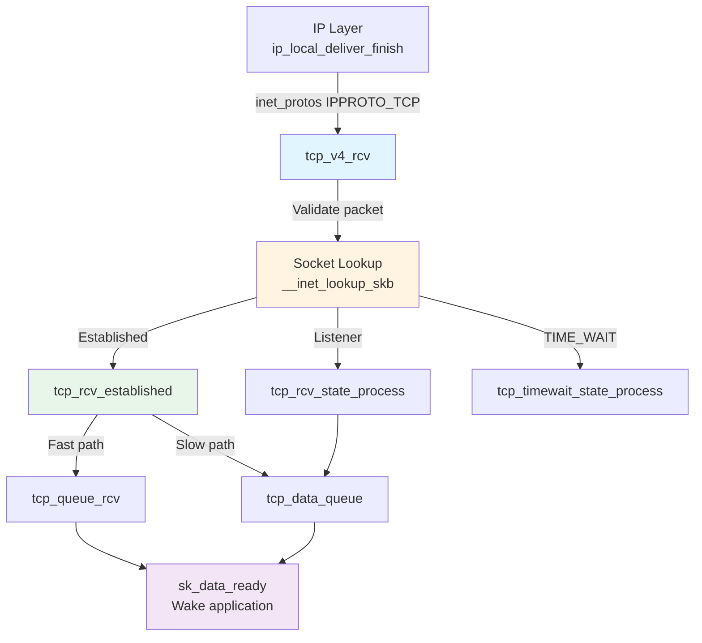
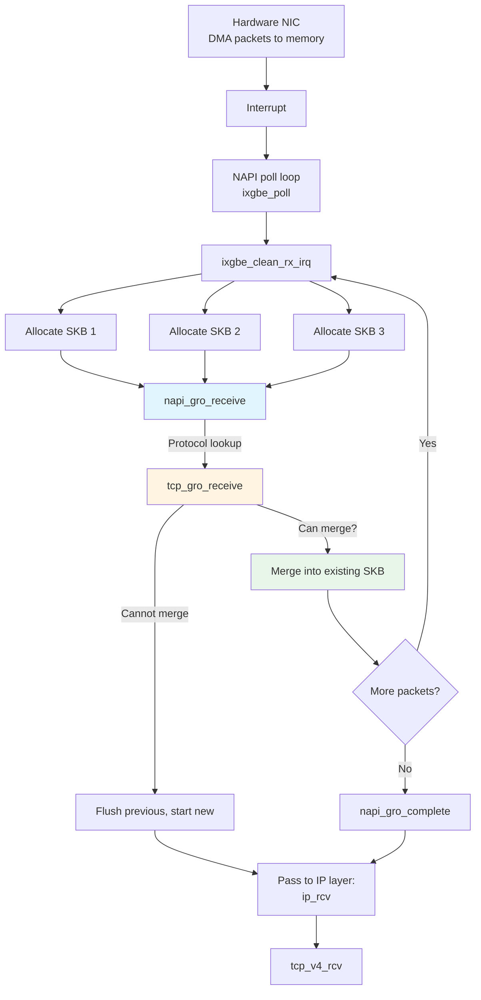

# TCP: Receive Path & Core Processing

## Overview

This chapter covers the Linux kernel's TCP receive path implementation, focusing on how TCP packets flow from the IP layer to socket delivery. This is the first of three chapters on TCP:

1. **TCP: Receive Path** (this chapter) - Packet reception, GRO, socket lookup
2. **[TCP: Reliability Mechanisms](./tcp_reliability.md)** - State machine, sequencing, flow control
3. **[TCP: Congestion Control](./tcp_congestion.md)** - Congestion algorithms and implementation

We assume familiarity with the TCP protocol itself and concentrate on kernel internals: data structures, algorithms, and code flow.

### TCP vs UDP

While UDP ([udp.md](./udp.md)) is stateless and connectionless, TCP is **stateful** and **connection-oriented**:

| Feature | UDP | TCP |
|---------|-----|-----|
| **State** | Stateless (no per-flow state) | Stateful (connection tracking) |
| **Reliability** | Best effort (no guarantees) | Guaranteed delivery |
| **Ordering** | No ordering guarantees | In-order delivery |
| **Connection** | Connectionless | Connection establishment/teardown |
| **Flow Control** | None | Receive window management |
| **Congestion Control** | None | Multiple algorithms (CUBIC, BBR) |
| **Overhead** | 8-byte header | 20+ byte header, more processing |
| **Performance** | ~200-400 cycles/packet | ~500-1500 cycles/packet (ESTABLISHED) |

TCP's added complexity provides reliability and congestion control at the cost of higher CPU usage and more complex implementation.

### TCP Receive Path Overview

The TCP receive path in Linux:



**Key stages**:

1. **IP layer handoff**: IP calls `tcp_v4_rcv()` for protocol 6 (TCP)
2. **Packet validation**: Checksum, length, header validation
3. **Socket lookup**: Find destination socket using 4-tuple hash
4. **State-specific processing**: Different code paths for connection states
5. **Data queuing**: Add packet to socket's receive queue
6. **Application notification**: Wake blocked processes

This chapter focuses on stages 1-3 and the infrastructure. Stages 4-5 are covered in [tcp_reliability.md](./tcp_reliability.md).

### Role in the Network Stack

```
Application (userspace)
        ↓ recv()/read()
Socket API (syscalls)
        ↓
─────────────────────── Kernel Space ───────────────────────
        ↓
TCP Layer ← This chapter covers receive path entry
        │
        ├─ tcp.md: Receive path, GRO, socket lookup
        ├─ tcp_reliability.md: State machine, sequencing, flow control
        └─ tcp_congestion.md: Congestion control algorithms
        ↓
IP Layer (ip_local_deliver_finish)
        ↓
NIC Driver (napi_gro_receive)
        ↓
Hardware (DMA, interrupts)
```

**Cross-references**:

- **From [ip.md](./ip.md)**: IP layer hands packets to TCP via `inet_protos[IPPROTO_TCP]->handler(skb)`
- **From [nics.md](./nics.md)**: GRO aggregates TCP segments before IP processing
- **To [tcp_reliability.md](./tcp_reliability.md)**: State machine and data queuing
- **To [sockets.md](./sockets.md)**: Userspace interface for reading TCP data

### Performance Context

On modern hardware (x86-64, 3GHz CPU, 10GbE NIC):

**TCP RX path typical costs**:

- **GRO aggregation**: ~100-200 cycles per merged packet (40-60% improvement)
- **tcp_v4_rcv()**: ~200-400 cycles (validation, checksum, lookup)
- **Socket lookup (cached)**: ~100-150 cycles (ehash, RCU read)
- **tcp_rcv_established() fast path**: ~200-400 cycles (in-order packet)
- **tcp_rcv_established() slow path**: ~1000-2000 cycles (out-of-order, state transitions)
- **Total (fast path)**: ~500-1000 cycles per packet
- **Total (slow path)**: ~1500-3000 cycles per packet

Compare to UDP: ~300-500 cycles total per packet.

TCP's higher cost comes from:
- Connection state management
- Sequence number tracking
- Out-of-order handling
- Congestion control updates
- More complex queueing

---

## TCP Data Structures

### TCP Header Structure

The kernel represents the TCP header as:

```c
/* From include/uapi/linux/tcp.h */
struct tcphdr {
    __be16 source;      /* Source port (16 bits) */
    __be16 dest;        /* Destination port (16 bits) */
    __be32 seq;         /* Sequence number (32 bits) */
    __be32 ack_seq;     /* Acknowledgment number (32 bits) */
#if defined(__LITTLE_ENDIAN_BITFIELD)
    __u16 res1:4,       /* Reserved */
          doff:4,       /* Data offset (header length in 32-bit words) */
          fin:1,        /* FIN flag */
          syn:1,        /* SYN flag */
          rst:1,        /* RST flag */
          psh:1,        /* PSH flag */
          ack:1,        /* ACK flag */
          urg:1,        /* URG flag */
          ece:1,        /* ECE flag (ECN) */
          cwr:1;        /* CWR flag (ECN) */
#elif defined(__BIG_ENDIAN_BITFIELD)
    __u16 doff:4,
          res1:4,
          cwr:1,
          ece:1,
          urg:1,
          ack:1,
          psh:1,
          rst:1,
          syn:1,
          fin:1;
#endif
    __be16 window;      /* Window size (16 bits) */
    __sum16 check;      /* Checksum (16 bits) */
    __be16 urg_ptr;     /* Urgent pointer (16 bits) */
};
```

**Size**: Minimum 20 bytes, maximum 60 bytes (with options).

**Key fields**:

- **seq**: Sequence number of first data byte in this segment
- **ack_seq**: Next expected sequence number (cumulative ACK)
- **doff**: Data offset, header length in 32-bit words (5-15, so 20-60 bytes)
- **flags**: Connection state and control (SYN, FIN, RST, ACK, PSH, URG, ECE, CWR)
- **window**: Receive window size (flow control), in bytes (scaled if negotiated)
- **check**: Checksum over pseudo-header + TCP header + data

**Common flag combinations**:

```c
/* SYN packet (connection request) */
tcphdr->syn = 1, tcphdr->ack = 0

/* SYN-ACK packet (connection response) */
tcphdr->syn = 1, tcphdr->ack = 1

/* Data packet with ACK */
tcphdr->syn = 0, tcphdr->ack = 1, tcphdr->psh = 0

/* FIN packet (connection close) */
tcphdr->fin = 1, tcphdr->ack = 1

/* RST packet (connection reset) */
tcphdr->rst = 1
```

After IP processing, `skb->data` points to the TCP header and `skb->transport_header` stores its offset.

### TCP Socket Structure

TCP extends the generic socket with extensive per-connection state:

```c
/* From include/linux/tcp.h */
struct tcp_sock {
    struct inet_connection_sock inet_conn;  /* Base inet connection socket */
    
    /* Sequence numbers (bytes, not packets) */
    u32 rcv_nxt;        /* Next expected receive sequence number */
    u32 copied_seq;     /* Sequence number copied to userspace */
    u32 rcv_wup;        /* rcv_nxt when last window update sent */
    u32 snd_nxt;        /* Next sequence number to send */
    u32 snd_una;        /* First unacknowledged sequence number */
    u32 snd_sml;        /* Last byte of the most recent small packet */
    u32 rcv_tstamp;     /* Timestamp of last received packet */
    u32 lsndtime;       /* Timestamp of last sent data packet */
    
    /* Send and receive windows */
    u32 snd_wnd;        /* Send window size (bytes) */
    u32 max_window;     /* Maximal window ever seen from peer */
    u32 mss_cache;      /* Cached effective MSS */
    
    u32 window_clamp;   /* Maximum receive window to advertise */
    u32 rcv_ssthresh;   /* Current window clamp (can shrink) */
    
    /* RTT measurement and retransmission */
    u32 srtt_us;        /* Smoothed RTT (microseconds) << 3 */
    u32 mdev_us;        /* Medium deviation (microseconds) */
    u32 mdev_max_us;    /* Maximum mdev for last RTT */
    u32 rttvar_us;      /* Smoothed mdev_max */
    u32 rtt_seq;        /* Sequence number for RTT measurement */
    
    /* Congestion control state */
    u32 snd_ssthresh;   /* Slow start threshold */
    u32 snd_cwnd;       /* Congestion window (packets) */
    u32 snd_cwnd_cnt;   /* Count for congestion window adjustment */
    u32 snd_cwnd_clamp; /* Maximum congestion window */
    u32 snd_cwnd_used;  /* When was cwnd last validated? */
    u32 snd_cwnd_stamp; /* Timestamp of last cwnd update */
    
    u32 prior_cwnd;     /* cwnd before reduction (undo) */
    u32 prr_delivered;  /* Delivered during current recovery */
    u32 prr_out;        /* Sent during current recovery */
    
    /* Out-of-order queue */
    struct rb_root out_of_order_queue;  /* RB-tree of out-of-order segments */
    struct sk_buff *ooo_last_skb;       /* Cache pointer for insertion */
    
    /* SACK (Selective Acknowledgment) */
    struct tcp_sack_block duplicate_sack[1];  /* Duplicate SACK */
    struct tcp_sack_block selective_acks[4];  /* SACK blocks to send */
    u8 snd_wscale;      /* Send window scale (<< snd_wscale) */
    u8 rcv_wscale;      /* Receive window scale */
    
    /* Timestamps (RFC 1323) */
    u32 rcv_tsval;      /* Last received timestamp value */
    u32 rcv_tsecr;      /* Last received timestamp echo reply */
    u32 ts_recent;      /* Recent timestamp for PAWS */
    long ts_recent_stamp; /* When ts_recent was updated */
    
    /* Connection state */
    u8 nonagle:1,       /* Disable Nagle algorithm */
       tcp_usec_ts:1,   /* TSval is in microseconds */
       is_sack_reneg:1, /* In recovery from SACK reneging? */
       fastopen_client_fail:2,  /* Fast Open failure */
       is_cwnd_limited:1,       /* Forward progress limited by cwnd? */
       syn_data:1,      /* SYN includes data */
       syn_fastopen:1;  /* SYN includes Fast Open cookie */
    
    u8 thin_lto:1,      /* Thin stream detected, use linear timeouts */
       recvmsg_inq:1,   /* Indicate bytes available in rx queue on RECVMSG */
       repair:1,        /* TCP socket repair mode */
       frto:1;          /* F-RTO enabled */
    
    /* Retransmission */
    u8 reordering;      /* Packet reordering metric */
    u8 syn_retries;     /* SYN retransmit count */
    
    u32 tlp_high_seq;   /* Tail loss probe sequence number */
    u32 tcp_tx_delay;   /* Transmission delay (usecs) for rate pacing */
    
    /* Flow control and buffering */
    u32 rcv_wnd;        /* Current receiver window (bytes) */
    atomic_t rcv_space; /* Space available for receiving */
    
    struct {
        u32 space;      /* Space for tracking window */
        u32 seq;        /* Sequence when space updated */
        u64 time;       /* Time when space updated */
    } rcvq_space;       /* For receive buffer auto-tuning */
    
    /* Socket memory */
    int rcvbuf_overrun; /* Receive buffer overrun count */
};

/* Accessor macro */
static inline struct tcp_sock *tcp_sk(const struct sock *sk)
{
    return (struct tcp_sock *)sk;
}
```

**Memory layout**:

```
struct tcp_sock:
┌─────────────────────────────────────────┐
│ struct inet_connection_sock inet_conn   │ ← Base (includes struct sock)
│   ├─ struct inet_sock inet              │
│   │    └─ struct sock sk                │
│   ├─ struct inet_connection_sock_af_ops │
│   └─ struct tcp_congestion_ops *ca_ops  │
├─────────────────────────────────────────┤
│ TCP-specific state (sequence numbers)   │ ← rcv_nxt, snd_nxt, snd_una, etc.
│ Windows (snd_wnd, rcv_wnd)              │
│ RTT measurements (srtt_us, mdev_us)     │
│ Congestion control (snd_cwnd, snd_ssthresh) │
│ Out-of-order queue (RB-tree)            │
│ SACK blocks                              │
│ Timestamps and options                  │
└─────────────────────────────────────────┘

Typical size: ~2KB per connection (architecture-dependent)
```

**Key fields for this chapter**:

- **rcv_nxt**: Next expected sequence number (packets with seq < rcv_nxt are duplicates)
- **rcv_wnd**: Current receive window (advertised to peer)
- **out_of_order_queue**: RB-tree for out-of-order segments (detailed in tcp_reliability.md)

The full significance of these fields becomes clear in [tcp_reliability.md](./tcp_reliability.md) (sequencing, flow control) and [tcp_congestion.md](./tcp_congestion.md) (cwnd, ssthresh).

### TCP SKB Control Block

Each TCP packet (SKB) has per-packet metadata in the control block:

```c
/* From include/net/tcp.h */
struct tcp_skb_cb {
    /* Union with IP control block */
    union {
        struct inet_skb_parm h4;
        struct inet6_skb_parm h6;
    } header;
    
    /* TCP-specific fields */
    __u32 seq;          /* Starting sequence number */
    __u32 end_seq;      /* Ending sequence number (seq + data_len) */
    union {
        __u32 tcp_tw_isn;  /* TIME_WAIT ISN */
        struct {
            u16 tcp_gso_segs;   /* Number of segments (TSO/GRO) */
            u16 tcp_gso_size;   /* Segment size (TSO/GRO) */
        };
    };
    __u8 tcp_flags;     /* TCP flags (copy of tcphdr flags) */
    __u8 sacked;        /* SACK state flags */
    __u8 ip_dsfield;    /* IPv4 TOS or IPv6 dsfield */
    __u8 txstamp_ack:1, /* SKB has TX timestamp */
         eor:1,         /* End of record */
         has_rxtstamp:1,/* RX timestamp available */
         unused:5;
    __u32 ack_seq;      /* Sequence being acknowledged */
    union {
        struct {
            __u32 in_flight:20,  /* Packets in flight when sent */
                  is_app_limited:1; /* cwnd application-limited */
        } tx;
        union {
            struct inet_skb_parm h4;
            struct inet6_skb_parm h6;
        } header;
    } txinfo;
};

/* Accessor macro */
#define TCP_SKB_CB(__skb) ((struct tcp_skb_cb *)&((__skb)->cb[0]))
```

**Key fields**:

- **seq**: Starting sequence number of data in this SKB
- **end_seq**: Ending sequence number (seq + length)
- **tcp_flags**: Copy of TCP header flags (for quick access)
- **tcp_gso_segs/size**: For GRO/GSO, number and size of coalesced segments
- **sacked**: SACK state (for retransmission tracking)

**Example usage**:

```c
/* In tcp_v4_rcv() after parsing header */
struct sk_buff *skb;
struct tcphdr *th = tcp_hdr(skb);
struct tcp_skb_cb *tcb = TCP_SKB_CB(skb);

/* Store sequence numbers in SKB control block */
tcb->seq = ntohl(th->seq);
tcb->end_seq = tcb->seq + skb->len - th->doff * 4;
tcb->tcp_flags = tcp_flag_byte(th);
tcb->ack_seq = ntohl(th->ack_seq);

/* Now sequence numbers are easily accessible throughout processing */
if (before(tcb->end_seq, tp->rcv_nxt)) {
    /* Old duplicate packet */
    goto discard;
}
```

The SKB control block avoids repeatedly parsing the TCP header.

### TCP Hash Tables

TCP uses multiple hash tables for socket lookup:

```c
/* From include/net/inet_hashtables.h */

/* Established connections hash (4-tuple: src IP, src port, dst IP, dst port) */
struct inet_hashinfo {
    /* ehash: established and TIME_WAIT sockets */
    struct inet_ehash_bucket *ehash;
    unsigned int ehash_mask;
    unsigned int ehash_size;
    
    /* bhash: bind hash (by port) */
    struct inet_bind_hashbucket *bhash;
    unsigned int bhash_size;
    
    /* lhash: listening sockets */
    struct inet_listen_hashbucket *lhash;
    unsigned int lhash_mask;
};

/* Global TCP hash table */
extern struct inet_hashinfo tcp_hashinfo;
```

**Three hash tables**:

1. **ehash (Established Hash)**: Established connections and TIME_WAIT sockets
   - Key: 4-tuple (src IP, src port, dst IP, dst port)
   - Hash function: combines all 4 values
   - Collision resolution: chaining with hlist
   - RCU-protected for lockless reads

2. **bhash (Bind Hash)**: Bound ports
   - Key: port number
   - Used during bind() to check if port is available
   - Less relevant for receive path

3. **lhash (Listen Hash)**: Listening sockets
   - Key: port number (and optional IP for bound listeners)
   - Used when no established connection found
   - Supports wildcard matching (0.0.0.0)

**Established hash bucket structure**:

```c
/* From include/net/inet_hashtables.h */
struct inet_ehash_bucket {
    struct hlist_nulls_head chain;  /* List of sockets */
    spinlock_t lock;                 /* Bucket lock (for writes) */
};
```

**Socket hash entry**:

```c
/* From include/net/sock.h */
struct sock_common {
    /* ... */
    union {
        struct hlist_nulls_node skc_node;    /* ehash chain */
        struct hlist_node skc_bind_node;     /* bhash chain */
    };
    /* ... */
};
```

**Hash table sizing**:

```c
/* From net/ipv4/tcp.c */
void __init tcp_init(void)
{
    /* ehash size based on available memory */
    /* ~128K entries per GB of RAM (configurable) */
    tcp_hashinfo.ehash_size = (totalram_pages >= 128 * 1024) ?
                               (1 << 21) : /* 2M entries */
                               max(1 << 16, totalram_pages >> 7);
    
    /* Allocate ehash */
    tcp_hashinfo.ehash = alloc_large_system_hash(
        "TCP established",
        sizeof(struct inet_ehash_bucket),
        tcp_hashinfo.ehash_size,
        17, /* scale: totalram_pages >> 17 */
        0,  /* flags */
        &tcp_hashinfo.ehash_mask,
        NULL,
        thash_entries ? 0 : 512 * 1024); /* min 512K */
}
```

On a system with 32GB RAM, typical sizes:
- **ehash**: ~4 million buckets (~64MB memory)
- **lhash**: ~32K buckets (~512KB memory)
- **bhash**: ~64K buckets (~1MB memory)

**Comparison with UDP**:

| Feature | UDP | TCP |
|---------|-----|-----|
| **Hash tables** | 2 (primary, secondary) | 3 (ehash, lhash, bhash) |
| **Key** | Port + optional address | 4-tuple for ehash |
| **Lookup cost** | ~100-150 cycles | ~100-200 cycles (cached) |
| **Collisions** | Common (port-based) | Rare (4-tuple) |
| **State per socket** | Minimal (~1KB) | Extensive (~2KB) |

TCP's 4-tuple hash provides better distribution and fewer collisions than UDP's port-based hash.

---

## Protocol Registration & Initialization

### TCP Protocol Handler Registration

During network stack initialization, TCP registers itself with the IP layer:

```c
/* From net/ipv4/af_inet.c */

static const struct net_protocol tcp_protocol = {
    .handler        = tcp_v4_rcv,        /* Receive handler */
    .err_handler    = tcp_v4_err,        /* ICMP error handler */
    .no_policy      = 1,                 /* No IPsec policy check */
    .netns_ok       = 1,                 /* Network namespace aware */
    .icmp_strict_tag_validation = 1,     /* Strict ICMP validation */
};

static int __init inet_init(void)
{
    struct sk_buff *dummy_skb;
    struct inet_protosw *q;
    struct list_head *r;
    int rc = -EINVAL;
    
    /* Build TCP protocol control blocks */
    rc = proto_register(&tcp_prot, 1);
    if (rc)
        goto out;
    
    /* Register TCP with IP layer */
    if (inet_add_protocol(&tcp_protocol, IPPROTO_TCP) < 0) {
        pr_crit("%s: Cannot add TCP protocol\n", __func__);
        goto out;
    }
    
    /* Initialize TCP subsystem */
    tcp_v4_init();
    
    /* Initialize TCP metrics (RTT cache) */
    tcp_metrics_init();
    
    /* Initialize TCP congestion control */
    tcp_register_congestion_control(&tcp_reno);
    
    return 0;
out:
    return rc;
}

fs_initcall(inet_init);  /* Called early in kernel boot */
```

After registration:

```c
/* From net/ipv4/protocol.c */
const struct net_protocol __rcu *inet_protos[MAX_INET_PROTOS];

/* TCP handler is now registered */
inet_protos[IPPROTO_TCP] = &tcp_protocol;  /* Protocol number 6 */
```

When the IP layer receives a packet with protocol field = 6, it calls:

```c
/* From net/ipv4/ip_input.c: ip_local_deliver_finish() */
ipprot = rcu_dereference(inet_protos[protocol]);  /* protocol = 6 */
if (ipprot) {
    ret = ipprot->handler(skb);  /* Calls tcp_v4_rcv(skb) */
}
```

**Comparison with UDP**:

| Protocol | Registration | Handler | GRO |
|----------|--------------|---------|-----|
| **TCP** | `IPPROTO_TCP` (6) | `tcp_v4_rcv()` | Yes (critical) |
| **UDP** | `IPPROTO_UDP` (17) | `udp_rcv()` | Optional |
| **ICMP** | `IPPROTO_ICMP` (1) | `icmp_rcv()` | No |

### TCP Initialization: `tcp_v4_init()`

The TCP subsystem initializes hash tables and data structures:

```c
/* From net/ipv4/tcp_ipv4.c */

void __init tcp_v4_init(void)
{
    /* Initialize hash tables (called from tcp_init) */
    inet_hashinfo_init(&tcp_hashinfo);
    
    /* Set maximum number of sockets */
    tcp_hashinfo.max_sockets = max(128, totalram_pages >> (21 - PAGE_SHIFT));
    
    /* Initialize per-CPU variables */
    tcp_tasklet_init();
}

/* From net/ipv4/tcp.c */
void __init tcp_init(void)
{
    int max_rshare, max_wshare, cnt;
    unsigned long limit;
    unsigned int i;
    
    /* Build SKB cache for TCP */
    BUILD_BUG_ON(sizeof(struct tcp_skb_cb) >
                 sizeof_field(struct sk_buff, cb));
    
    /* Allocate hash tables */
    tcp_hashinfo.ehash = alloc_large_system_hash(
        "TCP established",
        sizeof(struct inet_ehash_bucket),
        0,  /* Size calculated from RAM */
        17, /* Scale factor */
        0,  /* Flags */
        &tcp_hashinfo.ehash_mask,
        NULL,
        thash_entries ? 0 : 512 * 1024);  /* Min 512K entries */
    
    tcp_hashinfo.ehash_size = 1U << (32 - tcp_hashinfo.ehash_mask);
    
    for (i = 0; i < tcp_hashinfo.ehash_size; i++) {
        INIT_HLIST_NULLS_HEAD(&tcp_hashinfo.ehash[i].chain, i);
        spin_lock_init(&tcp_hashinfo.ehash[i].lock);
    }
    
    /* Allocate bind hash */
    tcp_hashinfo.bhash = alloc_large_system_hash(
        "TCP bind",
        sizeof(struct inet_bind_hashbucket),
        tcp_hashinfo.ehash_size,
        17,
        0,
        &tcp_hashinfo.bhash_size,
        NULL,
        64 * 1024);
    
    tcp_hashinfo.bhash_size = 1U << tcp_hashinfo.bhash_size;
    
    /* Initialize bind hash buckets */
    for (i = 0; i < tcp_hashinfo.bhash_size; i++) {
        spin_lock_init(&tcp_hashinfo.bhash[i].lock);
        INIT_HLIST_HEAD(&tcp_hashinfo.bhash[i].chain);
    }
    
    /* Initialize listen hash */
    tcp_hashinfo.lhash = alloc_large_system_hash(
        "TCP listen",
        sizeof(struct inet_listen_hashbucket),
        tcp_hashinfo.ehash_size,
        17,
        0,
        &tcp_hashinfo.lhash_mask,
        NULL,
        64 * 1024);
    
    /* Set default buffer sizes */
    tcp_init_mem();
    
    /* Default values (can be tuned via sysctl) */
    tcp_prot.sysctl_mem[0] = totalram_pages / 8;   /* Min */
    tcp_prot.sysctl_mem[1] = totalram_pages / 4;   /* Pressure */
    tcp_prot.sysctl_mem[2] = totalram_pages / 2;   /* Max */
    
    /* Per-connection buffer limits */
    tcp_prot.sysctl_rmem[0] = PAGE_SIZE;              /* Min: 4KB */
    tcp_prot.sysctl_rmem[1] = 131072;                 /* Default: 128KB */
    tcp_prot.sysctl_rmem[2] = max(131072, sysctl_tcp_rmem_max);  /* Max */
    
    tcp_prot.sysctl_wmem[0] = PAGE_SIZE;              /* Min: 4KB */
    tcp_prot.sysctl_wmem[1] = 16384;                  /* Default: 16KB */
    tcp_prot.sysctl_wmem[2] = max(131072, sysctl_tcp_wmem_max);  /* Max */
    
    /* TCP-specific limits */
    sysctl_tcp_max_orphans = totalram_pages / 16;     /* Orphan limit */
    
    /* Initialize TCP metrics cache (for RTT, etc.) */
    tcp_metrics_init();
    
    /* Initialize BPF hooks */
    tcp_bpf_init();
    
    pr_info("Hash tables configured (established %u bind %u listen %u)\n",
            tcp_hashinfo.ehash_size,
            tcp_hashinfo.bhash_size,
            tcp_hashinfo.lhash_mask + 1);
}
```

**Memory allocation on 32GB system**:

```
TCP Hash Tables:
├─ ehash: 4M buckets × 24 bytes ≈ 96 MB
├─ bhash: 64K buckets × 24 bytes ≈ 1.5 MB
└─ lhash: 32K buckets × 24 bytes ≈ 768 KB

Total: ~100 MB for hash tables
```

**Tunable parameters** (via `/proc/sys/net/ipv4/`):

```bash
# TCP buffer sizes (min, default, max) in bytes
/proc/sys/net/ipv4/tcp_rmem  # Receive: "4096 131072 6291456"
/proc/sys/net/ipv4/tcp_wmem  # Send: "4096 16384 4194304"

# TCP memory limits (pages)
/proc/sys/net/ipv4/tcp_mem   # "11186176 14914901 22372352" (on 32GB system)

# Max orphaned sockets (waiting to close)
/proc/sys/net/ipv4/tcp_max_orphans  # 2097152

# Hash table sizes (read-only, set at boot)
dmesg | grep "TCP: Hash tables configured"
# TCP: Hash tables configured (established 4194304 bind 65536 listen 32768)
```

### Early Demux Registration

For performance, TCP registers an early demux function:

```c
/* From net/ipv4/tcp_ipv4.c */

static const struct net_protocol tcp_protocol = {
    .early_demux    = tcp_v4_early_demux,
    .early_demux_handler = tcp_v4_early_demux,
    /* ... */
};

/* Early demux: socket lookup before routing */
int tcp_v4_early_demux(struct sk_buff *skb)
{
    const struct iphdr *iph;
    const struct tcphdr *th;
    struct sock *sk;
    
    /* Fast path: lookup socket and cache route in SKB */
    if (skb->sk)
        return 0;  /* Already done */
    
    iph = ip_hdr(skb);
    th = tcp_hdr(skb);
    
    /* Lookup socket (4-tuple hash) */
    sk = __inet_lookup_established(dev_net(skb->dev),
                                    &tcp_hashinfo,
                                    iph->saddr, th->source,
                                    iph->daddr, ntohs(th->dest),
                                    inet_iif(skb), inet_sdif(skb));
    
    if (sk) {
        skb->sk = sk;           /* Cache socket */
        skb->destructor = sock_edemux;  /* Cleanup function */
        
        /* Cache route */
        if (sk->sk_state != TCP_TIME_WAIT) {
            struct dst_entry *dst = READ_ONCE(sk->sk_rx_dst);
            if (dst)
                dst = dst_check(dst, 0);
            if (dst &&
                inet_sk(sk)->rx_dst_ifindex == skb->skb_iif)
                skb_dst_set_noref(skb, dst);
        }
    }
    
    return 0;
}
```

**Early demux benefits**:

- **30-40% RX performance improvement** for TCP
- Avoids routing lookup (caches destination in SKB)
- Direct socket dispatch in `ip_local_deliver()`
- Most beneficial for established connections

**Call path comparison**:

```
Without early demux:
NIC → GRO → ip_rcv → ip_rcv_finish → routing_lookup → ip_local_deliver
→ tcp_v4_rcv → socket_lookup → tcp_rcv_established

With early demux:
NIC → GRO → ip_rcv → tcp_v4_early_demux (socket_lookup + cache route)
→ ip_rcv_finish (skip routing) → ip_local_deliver → tcp_v4_rcv (skip lookup)
→ tcp_rcv_established

Savings: ~200-400 cycles per packet (routing + second lookup avoided)
```

Early demux is controlled by:

```bash
/proc/sys/net/ipv4/tcp_early_demux  # 1 = enabled (default), 0 = disabled
```

Disabling early demux can improve routing flexibility at the cost of performance.

---

## TCP GRO (Generic Receive Offload)

### What is GRO?

**GRO (Generic Receive Offload)** is a critical performance optimization that coalesces multiple TCP segments into a single large SKB before they reach the IP layer. This dramatically reduces per-packet processing overhead.

**Without GRO**: Each 1500-byte packet processed individually through IP and TCP layers

```
NIC RX: [pkt1] [pkt2] [pkt3] [pkt4] [pkt5] [pkt6] [pkt7] [pkt8]
         ↓      ↓      ↓      ↓      ↓      ↓      ↓      ↓
IP/TCP:  800   800    800    800    800    800    800    800  cycles each
         ↓      ↓      ↓      ↓      ↓      ↓      ↓      ↓
Total: 6400 cycles for 12KB of data
```

**With GRO**: Multiple packets coalesced into one large SKB

```
NIC RX: [pkt1] [pkt2] [pkt3] [pkt4] [pkt5] [pkt6] [pkt7] [pkt8]
         ↓      ↓      ↓      ↓      ↓      ↓      ↓      ↓
GRO:    [───────── Merge into single large SKB (12KB) ────────]
                        ↓
IP/TCP:               1200 cycles (one packet)
                        ↓
Total: ~1600 cycles for 12KB of data (4x improvement!)
```

**Performance impact**:

- **40-60% throughput improvement** for TCP on multi-Gbps links
- Fewer cache misses (single SKB traversal)
- Fewer function call overheads
- More efficient per-packet operations

GRO is implemented in the NIC driver's NAPI poll loop, before packets reach `netif_receive_skb()`.

### GRO Flow in Context



GRO happens **before** the IP layer sees packets, reducing the number of times we traverse the network stack.

### GRO Registration

TCP registers GRO handlers with the network core:

```c
/* From net/ipv4/tcp_offload.c */

static struct sk_buff *tcp4_gro_receive(struct list_head *head,
                                         struct sk_buff *skb)
{
    /* Validate IP header for GRO */
    if (NAPI_GRO_CB(skb)->encap_mark ||
        !pskb_may_pull(skb, sizeof(struct tcphdr)))
        return NULL;
    
    return tcp_gro_receive(head, skb);  /* Common TCP GRO */
}

static int tcp4_gro_complete(struct sk_buff *skb, int thoff)
{
    const struct iphdr *iph = ip_hdr(skb);
    struct tcphdr *th = (struct tcphdr *)(skb->data + thoff);
    
    /* Fix up checksums after merging */
    th->check = ~tcp_v4_check(skb->len - thoff, iph->saddr,
                               iph->daddr, 0);
    skb_shinfo(skb)->gso_type |= SKB_GSO_TCPV4;
    
    return tcp_gro_complete(skb);  /* Common TCP GRO completion */
}

static const struct net_offload tcpv4_offload = {
    .callbacks = {
        .gso_segment    = tcp4_gso_segment,
        .gro_receive    = tcp4_gro_receive,
        .gro_complete   = tcp4_gro_complete,
    },
};

/* Registration during TCP initialization */
int __init tcpv4_offload_init(void)
{
    return inet_add_offload(&tcpv4_offload, IPPROTO_TCP);
}
```

When NAPI calls `napi_gro_receive(skb)`, the network core:

1. Identifies protocol (TCP) from IP header
2. Calls `tcpv4_offload.callbacks.gro_receive(head, skb)`
3. TCP GRO logic decides whether to merge or flush

### Core GRO Function: `tcp_gro_receive()`

This function determines if an incoming SKB can be merged with previous SKBs:

```c
/* From net/ipv4/tcp_offload.c */

struct sk_buff *tcp_gro_receive(struct list_head *head, struct sk_buff *skb)
{
    struct sk_buff *pp = NULL;  /* Previous packet to merge with */
    struct sk_buff *p;
    struct tcphdr *th;
    struct tcphdr *th2;
    unsigned int len;
    unsigned int thlen;
    __be32 flags;
    unsigned int mss = 1;
    unsigned int hlen;
    unsigned int off;
    int flush = 1;  /* Assume cannot merge (conservative) */
    int i;
    
    /* Get TCP header */
    off = skb_gro_offset(skb);
    hlen = off + sizeof(*th);
    th = skb_gro_header_fast(skb, off);
    
    if (skb_gro_header_hard(skb, hlen)) {
        th = skb_gro_header_slow(skb, hlen, off);
        if (unlikely(!th))
            goto out;
    }
    
    thlen = th->doff * 4;
    if (thlen < sizeof(*th))
        goto out;
    
    /* Ensure full header is in linear part */
    hlen = off + thlen;
    if (skb_gro_header_hard(skb, hlen)) {
        th = skb_gro_header_slow(skb, hlen, off);
        if (unlikely(!th))
            goto out;
    }
    
    /* Cannot merge packets with different headers */
    skb_gro_pull(skb, thlen);
    
    len = skb_gro_len(skb);
    flags = tcp_flag_word(th);
    
    /* Search for a matching flow to merge with */
    list_for_each_entry(p, head, list) {
        if (!NAPI_GRO_CB(p)->same_flow)
            continue;
        
        th2 = tcp_hdr(p);
        
        /* Cannot merge if headers differ (except ACK number and window) */
        if (*(u32 *)&th->source ^ *(u32 *)&th2->source) {
            NAPI_GRO_CB(p)->same_flow = 0;
            continue;
        }
        
        /* Found a candidate for merging */
        goto found;
    }
    
    /* No matching flow found, start a new one */
    goto out_check_final;

found:
    /* Check if we can merge this packet */
    
    /* Flush if FIN, RST, or SYN set (connection control packets) */
    flush = NAPI_GRO_CB(p)->flush;
    flush |= (__force int)(flags & (TCP_FLAG_CWR | TCP_FLAG_ECE));
    flush |= (__force int)((flags ^ tcp_flag_word(th2)) &
                ~(TCP_FLAG_CWR | TCP_FLAG_ECE | TCP_FLAG_ACK));
    
    /* Flush if not pure ACK or data packet */
    flush |= (__force int)(th->ack_seq ^ th2->ack_seq);
    
    /* Check sequence numbers: must be contiguous */
    for (i = sizeof(*th); i < thlen; i += 4) {
        /* Options must match exactly */
        flush |= *(u32 *)((u8 *)th + i) ^
                 *(u32 *)((u8 *)th2 + i);
    }
    
    /* Extract MSS from options if present */
    mss = skb_shinfo(p)->gso_size;
    
    /* Verify sequence number continuity */
    flush |= (len - 1) >= mss;  /* Data must fit in one MSS */
    flush |= (ntohl(th2->seq) + skb_gro_len(p)) ^ ntohl(th->seq);
    
    if (flush || skb_gro_receive(head, skb)) {
        mss = 1;  /* Cannot merge */
        goto out_check_final;
    }
    
    /* Successful merge! Update metadata */
    p = *head;
    th2 = tcp_hdr(p);
    tcp_flag_word(th2) |= flags & (TCP_FLAG_FIN | TCP_FLAG_PSH);

out_check_final:
    /* Flush if we've accumulated enough data or seen FIN/PSH */
    flush = len < mss;
    flush |= (__force int)(flags & (TCP_FLAG_URG | TCP_FLAG_PSH |
                                     TCP_FLAG_RST | TCP_FLAG_SYN |
                                     TCP_FLAG_FIN));
    
    if (p && (!NAPI_GRO_CB(skb)->same_flow || flush))
        pp = p;

out:
    NAPI_GRO_CB(skb)->flush |= (flush != 0);
    
    return pp;  /* Return previous packet if merged, NULL if new flow */
}
```

**Key merging conditions**:

1. **Same flow**: Source IP, dest IP, source port, dest port must match
2. **Contiguous sequences**: `th2->seq + len(p) == th->seq`
3. **Same options**: TCP options must be identical
4. **No control flags**: Cannot merge SYN, FIN, RST, URG packets
5. **Size limits**: Data must fit within MSS boundaries
6. **ACK tolerance**: ACK number and window can differ

**Why these restrictions?**

- **Control packets**: SYN/FIN/RST must be processed individually (state changes)
- **Sequence gaps**: Out-of-order packets cannot be merged (would create invalid SKB)
- **Options**: Timestamps, SACK blocks are per-segment and must match
- **MSS**: Ensures merged packet doesn't exceed reasonable size

### GRO Completion: `tcp_gro_complete()`

After NAPI finishes polling, GRO-aggregated packets are finalized:

```c
/* From net/ipv4/tcp_offload.c */

int tcp_gro_complete(struct sk_buff *skb)
{
    struct tcphdr *th = tcp_hdr(skb);
    
    /* Update SKB metadata for aggregated packet */
    skb_shinfo(skb)->gso_size = skb_shinfo(skb)->gso_segs = 0;
    
    /* Recalculate checksum (hardware offload) */
    if (th->cwr)
        skb_shinfo(skb)->gso_type |= SKB_GSO_TCP_ECN;
    
    return 0;
}

/* IPv4-specific completion */
static int tcp4_gro_complete(struct sk_buff *skb, int thoff)
{
    const struct iphdr *iph = ip_hdr(skb);
    struct tcphdr *th = (struct tcphdr *)(skb->data + thoff);
    
    /* Fix checksum for merged packet */
    th->check = ~tcp_v4_check(skb->len - thoff, iph->saddr,
                               iph->daddr, 0);
    skb_shinfo(skb)->gso_type = SKB_GSO_TCPV4;
    
    if (unlikely(skb->ip_summed != CHECKSUM_PARTIAL)) {
        const struct iphdr *iph = ip_hdr(skb);
        struct tcphdr *th = tcp_hdr(skb);
        
        /* Software checksum fallback */
        skb->ip_summed = CHECKSUM_UNNECESSARY;
        __tcp_v4_send_check(skb, iph->saddr, iph->daddr);
    }
    
    return tcp_gro_complete(skb);
}
```

**What happens in completion**:

1. Update SKB metadata (`gso_size`, `gso_type`)
2. Recalculate or mark checksum for hardware offload
3. Pass large SKB to IP layer for processing

The IP layer sees one large packet instead of many small ones.

### GRO Merging Example

**Scenario**: 4 packets arrive in quick succession (1448 bytes of data each):

```
Packet 1: seq=1000, len=1448, ACK=5000, flags=ACK
Packet 2: seq=2448, len=1448, ACK=5000, flags=ACK
Packet 3: seq=3896, len=1448, ACK=5000, flags=ACK
Packet 4: seq=5344, len=1448, ACK=5100, flags=ACK|PSH
```

**GRO processing**:

```c
/* Packet 1 arrives */
tcp_gro_receive(head=[], skb=pkt1)
  → No previous packets in list
  → Start new flow, add to head
  → head = [pkt1]

/* Packet 2 arrives */
tcp_gro_receive(head=[pkt1], skb=pkt2)
  → Check pkt1: same flow? YES (ports/IPs match)
  → Sequence check: 1000 + 1448 == 2448? YES (contiguous)
  → Options match? YES
  → No control flags? YES
  → Merge pkt2 into pkt1
  → pkt1.len = 2896 bytes
  → head = [pkt1(merged)]

/* Packet 3 arrives */
tcp_gro_receive(head=[pkt1], skb=pkt3)
  → Check pkt1: same flow? YES
  → Sequence check: 1000 + 2896 == 3896? YES
  → Merge pkt3 into pkt1
  → pkt1.len = 4344 bytes
  → head = [pkt1(merged)]

/* Packet 4 arrives */
tcp_gro_receive(head=[pkt1], skb=pkt4)
  → Check pkt1: same flow? YES
  → Sequence check: 1000 + 4344 == 5344? YES
  → ACK number changed (5000 → 5100): OK (allowed to differ)
  → PSH flag set: FLUSH (cannot merge further)
  → Merge pkt4 into pkt1
  → pkt1.len = 5792 bytes
  → Flush pkt1 to IP layer
  → head = []

/* Result: IP layer receives ONE packet of 5792 bytes instead of 4 packets */
```

**Cycle count comparison**:

```
Without GRO (4 separate packets):
  ip_rcv: 4 × 300 cycles = 1200 cycles
  tcp_v4_rcv: 4 × 400 cycles = 1600 cycles
  Total: ~2800 cycles

With GRO (1 merged packet):
  GRO overhead: ~200 cycles (merge operations)
  ip_rcv: 1 × 350 cycles = 350 cycles (slightly more for larger packet)
  tcp_v4_rcv: 1 × 500 cycles = 500 cycles
  Total: ~1050 cycles

Improvement: 2.7x fewer cycles!
```

### GRO and TCP Flags

**Packets that flush GRO** (cannot be merged further):

| Flag | Why Flush? |
|------|------------|
| **SYN** | Connection establishment, must process immediately |
| **FIN** | Connection close, state change required |
| **RST** | Connection reset, immediate action needed |
| **URG** | Urgent data pointer, different processing path |
| **PSH** | Push flag suggests end of message, deliver to application |

**Packets that can be merged**:

- Pure data packets with ACK flag
- ACK number can differ between merged packets
- Window size can differ
- Timestamps are handled specially (last one wins)

### GRO and Hardware Offload Interaction

**LRO (Large Receive Offload)** vs **GRO**:

| Feature | LRO (Hardware) | GRO (Software) |
|---------|----------------|----------------|
| **Location** | NIC firmware | Kernel (NAPI) |
| **Flexibility** | Fixed behavior | Configurable |
| **Forwarding** | Breaks forwarding | Forwarding-safe |
| **Checksum** | Hardware validates | Software validates |
| **Control** | Limited | Full control |

GRO is **forwarding-safe**: packets can be segmented back if needed (for routing).

LRO is **not forwarding-safe**: merged packets lose individual IP IDs, making re-segmentation impossible.

**Modern recommendation**: Disable LRO, use GRO:

```bash
# Disable LRO (if enabled)
ethtool -K eth0 lro off

# Ensure GRO is enabled (default)
ethtool -K eth0 gro on

# Check current settings
ethtool -k eth0 | grep -E "(lro|gro)"
# generic-receive-offload: on
# large-receive-offload: off [fixed]
```

### GRO Performance Metrics

**Measuring GRO effectiveness**:

```bash
# Check GRO statistics
ethtool -S eth0 | grep gro
# rx_gro_packets: 15234567       # Packets after GRO
# rx_gro_merged: 45678901        # Original packets merged
# rx_gro_flush: 123456           # Flows flushed

# Calculate merge ratio
# merge_ratio = rx_gro_merged / rx_gro_packets
# Example: 45678901 / 15234567 ≈ 3.0 packets merged per GRO packet
```

**Typical merge ratios**:

- **Bulk transfer (iperf3)**: 10-30 packets merged (10-40KB GRO packets)
- **Web traffic (HTTP)**: 2-5 packets merged (smaller responses)
- **Interactive (SSH)**: 1-2 packets merged (small packets, delayed)

**Performance impact by workload**:

| Workload | Without GRO | With GRO | Improvement |
|----------|-------------|----------|-------------|
| **10 Gbps iperf3** | 70% CPU | 40% CPU | 43% reduction |
| **HTTP small objects** | 50% CPU | 35% CPU | 30% reduction |
| **Database queries** | 35% CPU | 25% CPU | 29% reduction |

GRO is one of the most important TCP performance optimizations in the Linux kernel.

### GRO and TCP Receive Path Interaction

**Call flow with GRO**:

```c
/* In NIC driver NAPI poll loop */
ixgbe_poll()
  → ixgbe_clean_rx_irq()
    → ixgbe_fetch_rx_buffer()  /* Read packet from DMA ring */
    → ixgbe_build_skb()        /* Build SKB */
    → napi_gro_receive(skb)    /* Enter GRO */
      → dev_gro_receive()
        → inet_gro_receive()   /* IP-level GRO checks */
        → tcp4_gro_receive()   /* TCP GRO merging */
          → tcp_gro_receive()
            → skb_gro_receive() /* Actual merge */
      [Loop continues, more packets merged]
    → napi_complete()
      → napi_gro_flush()       /* Flush aggregated packets */
        → napi_gro_complete()
          → netif_receive_skb_internal()
            → __netif_receive_skb_core()
              → ip_rcv()       /* Enter IP layer with large SKB */
                → ip_local_deliver()
                  → tcp_v4_rcv()  /* Process large packet */
```

**Key insight**: GRO happens **before IP processing**, so the IP and TCP layers see fewer, larger packets.

---

## TCP Receive Path Entry

After GRO (if enabled) and IP layer processing, TCP packets arrive at `tcp_v4_rcv()`, the main entry point for TCP reception.

### Entry from IP Layer

As covered in [`ip.md`](./ip.md), the IP layer calls the registered protocol handler:

```c
/* From net/ipv4/ip_input.c: ip_local_deliver_finish() */
static int ip_local_deliver_finish(struct net *net, struct sock *sk,
                                   struct sk_buff *skb)
{
    __skb_pull(skb, skb_network_header_len(skb));  /* Remove IP header */
    
    rcu_read_lock();
    {
        const struct net_protocol *ipprot;
        int protocol = ip_hdr(skb)->protocol;  /* Get protocol from IP header */
        
        /* Look up protocol handler */
        ipprot = rcu_dereference(inet_protos[protocol]);
        if (ipprot) {
            /* For TCP, this calls tcp_v4_rcv(skb) */
            ret = ipprot->handler(skb);
        }
    }
    rcu_read_unlock();
    
    return ret;
}
```

**At entry to `tcp_v4_rcv()`**:

- `skb->data` points to TCP header (IP header removed by `__skb_pull`)
- `skb->len` is TCP header + data length
- IP header still accessible via `ip_hdr(skb)` using `skb->network_header` offset
- Netfilter hooks have already run (if configured)
- GRO may have aggregated multiple packets into this SKB

### `tcp_v4_rcv()` Implementation

The main TCP receive function:

```c
/* From net/ipv4/tcp_ipv4.c */

int tcp_v4_rcv(struct sk_buff *skb)
{
    struct net *net = dev_net(skb->dev);
    struct sk_buff *skb_to_free;
    int sdif = inet_sdif(skb);
    int dif = inet_iif(skb);
    const struct iphdr *iph;
    const struct tcphdr *th;
    bool refcounted;
    struct sock *sk;
    int ret;
    
    /* Check if packet has enough data for TCP header */
    if (skb->len < sizeof(struct tcphdr))
        goto discard_it;
    
    /* Ensure TCP header is in linear part of SKB */
    if (!pskb_may_pull(skb, sizeof(struct tcphdr)))
        goto discard_it;
    
    th = (const struct tcphdr *)skb->data;
    
    /* Validate data offset (header length) */
    if (unlikely(th->doff < sizeof(struct tcphdr) / 4))
        goto bad_packet;
    
    /* Ensure full TCP header (with options) is in linear part */
    if (!pskb_may_pull(skb, th->doff * 4))
        goto discard_it;
    
    /* Recalculate pointers after potential reallocation */
    th = (const struct tcphdr *)skb->data;
    iph = ip_hdr(skb);
    
    /* Checksum validation */
    if (skb_checksum_init(skb, IPPROTO_TCP, inet_compute_pseudo))
        goto csum_error;
    
    th = (const struct tcphdr *)skb->data;  /* May have moved */
    iph = ip_hdr(skb);
    
    /* Initialize TCP control block */
    TCP_SKB_CB(skb)->seq = ntohl(th->seq);
    TCP_SKB_CB(skb)->end_seq = (TCP_SKB_CB(skb)->seq + th->syn + th->fin +
                                 skb->len - th->doff * 4);
    TCP_SKB_CB(skb)->ack_seq = ntohl(th->ack_seq);
    TCP_SKB_CB(skb)->tcp_flags = tcp_flag_byte(th);
    TCP_SKB_CB(skb)->tcp_tw_isn = 0;
    TCP_SKB_CB(skb)->ip_dsfield = ipv4_get_dsfield(iph);
    TCP_SKB_CB(skb)->sacked = 0;
    TCP_SKB_CB(skb)->has_rxtstamp = skb_has_any_hwtstamp(skb);
    
lookup:
    /* Socket lookup: find destination socket */
    sk = __inet_lookup_skb(&tcp_hashinfo, skb, __tcp_hdrlen(th),
                           th->source, th->dest, sdif, &refcounted);
    if (!sk)
        goto no_tcp_socket;
    
process:
    /* Check socket state and process */
    if (sk->sk_state == TCP_TIME_WAIT)
        goto do_time_wait;
    
    if (sk->sk_state == TCP_NEW_SYN_RECV) {
        struct request_sock *req = inet_reqsk(sk);
        bool req_stolen = false;
        struct sock *nsk;
        
        /* Handle SYN cookie */
        sk = req->rsk_listener;
        if (unlikely(tcp_v4_inbound_md5_hash(sk, skb, dif, sdif))) {
            sk_drops_add(sk, skb);
            reqsk_put(req);
            goto discard_it;
        }
        if (tcp_checksum_complete(skb)) {
            reqsk_put(req);
            goto csum_error;
        }
        if (unlikely(sk->sk_state != TCP_LISTEN)) {
            inet_csk_reqsk_queue_drop_and_put(sk, req);
            goto lookup;
        }
        
        /* SYN cookie validation */
        sock_hold(sk);
        refcounted = true;
        nsk = NULL;
        if (!tcp_filter(sk, skb)) {
            th = (const struct tcphdr *)skb->data;
            iph = ip_hdr(skb);
            tcp_v4_fill_cb(skb, iph, th);
            nsk = tcp_check_req(sk, skb, req, false, &req_stolen);
        }
        if (!nsk) {
            reqsk_put(req);
            if (req_stolen) {
                /* SYN cookie validated, request stolen */
                tcp_v4_reqsk_send_ack(skb, sk, req);
                goto discard_it;
            }
            goto discard_and_relse;
        }
        if (nsk == sk) {
            reqsk_put(req);
            tcp_v4_restore_cb(skb);
        } else if (tcp_child_process(sk, nsk, skb)) {
            tcp_v4_send_reset(nsk, skb);
            goto discard_and_relse;
        } else {
            sock_put(sk);
            return 0;
        }
    }
    
    /* Standard socket processing */
    if (unlikely(iph->ttl < inet_sk(sk)->min_ttl)) {
        __NET_INC_STATS(net, LINUX_MIB_TCPMINTTLDROP);
        goto discard_and_relse;
    }
    
    /* BPF socket filter */
    if (!sock_owned_by_user(sk)) {
        skb_to_free = sk->sk_rx_skb_cache;
        sk->sk_rx_skb_cache = NULL;
        
        ret = tcp_v4_do_rcv(sk, skb);
    } else {
        /* Socket locked by userspace, defer processing */
        if (tcp_add_backlog(sk, skb))
            goto discard_and_relse;
        skb_to_free = NULL;
    }
    
    bh_unlock_sock(sk);
    
    if (skb_to_free)
        __kfree_skb(skb_to_free);
    
    if (refcounted)
        sock_put(sk);
    
    return ret;

no_tcp_socket:
    /* No socket found, check for broadcast/multicast */
    if (!xfrm4_policy_check(NULL, XFRM_POLICY_IN, skb))
        goto discard_it;
    
    tcp_v4_fill_cb(skb, iph, th);
    
    if (tcp_checksum_complete(skb)) {
csum_error:
        __TCP_INC_STATS(net, TCP_MIB_CSUMERRORS);
bad_packet:
        __TCP_INC_STATS(net, TCP_MIB_INERRS);
    } else {
        /* Send RST for non-existent connection */
        tcp_v4_send_reset(NULL, skb);
    }

discard_it:
    /* Discard packet */
    kfree_skb(skb);
    return 0;

discard_and_relse:
    sk_drops_add(sk, skb);
    if (refcounted)
        sock_put(sk);
    goto discard_it;

do_time_wait:
    /* TIME_WAIT socket processing */
    if (!xfrm4_policy_check(NULL, XFRM_POLICY_IN, skb)) {
        inet_twsk_put(inet_twsk(sk));
        goto discard_it;
    }
    
    tcp_v4_fill_cb(skb, iph, th);
    
    if (tcp_checksum_complete(skb)) {
        inet_twsk_put(inet_twsk(sk));
        goto csum_error;
    }
    
    switch (tcp_timewait_state_process(inet_twsk(sk), skb, th)) {
    case TCP_TW_SYN: {
        struct sock *sk2 = inet_lookup_listener(net,
                                                 &tcp_hashinfo, skb,
                                                 __tcp_hdrlen(th),
                                                 iph->saddr, th->source,
                                                 iph->daddr, th->dest,
                                                 inet_iif(skb),
                                                 sdif);
        if (sk2) {
            inet_twsk_deschedule_put(inet_twsk(sk));
            sk = sk2;
            tcp_v4_restore_cb(skb);
            refcounted = false;
            goto process;
        }
    }
        /* Fall through */
    case TCP_TW_ACK:
        tcp_v4_timewait_ack(sk, skb);
        break;
    case TCP_TW_RST:
        tcp_v4_send_reset(sk, skb);
        inet_twsk_deschedule_put(inet_twsk(sk));
        goto discard_it;
    case TCP_TW_SUCCESS:
        ;
    }
    goto discard_it;
}
```

**Key steps in `tcp_v4_rcv()`**:

1. **Packet validation**: Length checks, header size validation
2. **Linearization**: Ensure TCP header is in contiguous memory
3. **Checksum validation**: Verify packet integrity
4. **SKB control block initialization**: Store sequence numbers, flags
5. **Socket lookup**: Find destination socket (covered in next section)
6. **State-specific processing**:
   - TIME_WAIT: Special handling
   - NEW_SYN_RECV: SYN cookie validation
   - LISTEN: Connection establishment
   - ESTABLISHED: Data reception (fast path)
7. **Backlog handling**: If socket locked, defer processing
8. **Statistics update**: Increment counters

### Packet Validation

**Length checks**:

```c
/* Minimum: 20-byte TCP header */
if (skb->len < sizeof(struct tcphdr))  /* skb->len < 20 */
    goto discard_it;

/* Data offset field must be at least 5 (5 * 4 = 20 bytes) */
if (unlikely(th->doff < sizeof(struct tcphdr) / 4))  /* doff < 5 */
    goto bad_packet;

/* Full header (with options) must be present */
if (!pskb_may_pull(skb, th->doff * 4))  /* Pull up to 60 bytes max */
    goto discard_it;
```

`pskb_may_pull()` ensures the specified number of bytes are in the SKB's linear data area, reallocating if necessary. This is critical because TCP options can extend the header up to 60 bytes.

### Checksum Validation

TCP checksums are validated using hardware offload when available:

```c
/* From net/ipv4/tcp_ipv4.c */
if (skb_checksum_init(skb, IPPROTO_TCP, inet_compute_pseudo))
    goto csum_error;

/* skb_checksum_init checks: */
static inline int skb_checksum_init(struct sk_buff *skb, u8 proto,
                                    __wsum (*pseudo_fn)(struct sk_buff *))
{
    if (skb->ip_summed == CHECKSUM_COMPLETE) {
        /* Hardware computed checksum for entire packet */
        if (!csum_tcpudp_magic(ip_hdr(skb)->saddr, ip_hdr(skb)->daddr,
                               skb->len, proto, skb->csum)) {
            skb->ip_summed = CHECKSUM_UNNECESSARY;
            return 0;  /* Checksum valid */
        }
    }
    
    if (skb->ip_summed == CHECKSUM_UNNECESSARY)
        return 0;  /* Hardware validated, trust it */
    
    /* Software fallback: compute checksum */
    skb->csum = pseudo_fn(skb);  /* Pseudo-header */
    skb->ip_summed = CHECKSUM_COMPLETE;
    
    /* Validate */
    return __skb_checksum_complete(skb);
}
```

**Three checksum scenarios**:

1. **`CHECKSUM_UNNECESSARY`**: Hardware validated, no software check needed
   - Modern NICs (ixgbe, i40e) set this flag
   - ~0 cycles for checksum validation
   
2. **`CHECKSUM_COMPLETE`**: Hardware computed checksum, software validates
   - Less common
   - ~50-100 cycles for validation
   
3. **No offload**: Software computes and validates
   - Fallback for older NICs or tunneled packets
   - ~200-400 cycles for 1500-byte packet

**Checksum error handling**:

```c
csum_error:
    __TCP_INC_STATS(net, TCP_MIB_CSUMERRORS);  /* Increment error counter */
bad_packet:
    __TCP_INC_STATS(net, TCP_MIB_INERRS);      /* Increment bad packet counter */
    kfree_skb(skb);                             /* Discard packet */
    return 0;
```

Checksum errors typically indicate:
- Network corruption (rare on modern networks)
- Hardware failure (NIC, cable)
- TCP offload bugs
- Incorrect pseudo-header calculation

### SKB Control Block Initialization

After validation, sequence numbers and flags are stored in the SKB:

```c
/* From tcp_v4_rcv() */
TCP_SKB_CB(skb)->seq = ntohl(th->seq);           /* Starting sequence */
TCP_SKB_CB(skb)->end_seq = (TCP_SKB_CB(skb)->seq + th->syn + th->fin +
                             skb->len - th->doff * 4);  /* Ending sequence */
TCP_SKB_CB(skb)->ack_seq = ntohl(th->ack_seq);   /* ACK number */
TCP_SKB_CB(skb)->tcp_flags = tcp_flag_byte(th);  /* All flags */
TCP_SKB_CB(skb)->tcp_tw_isn = 0;
TCP_SKB_CB(skb)->ip_dsfield = ipv4_get_dsfield(iph);  /* IP TOS/DSCP */
TCP_SKB_CB(skb)->sacked = 0;                      /* SACK state */
TCP_SKB_CB(skb)->has_rxtstamp = skb_has_any_hwtstamp(skb);  /* HW timestamp */
```

**end_seq calculation**:

```
end_seq = seq + data_length + SYN + FIN

Where:
  data_length = skb->len - (th->doff * 4)  /* Total length - header length */
  SYN, FIN = 1 if flag set, 0 otherwise
```

SYN and FIN flags consume one sequence number each, even though they carry no data.

**Example**:

```
Packet: seq=1000, len=1500, doff=5 (20-byte header), flags=ACK
  data_length = 1500 - 20 = 1480
  end_seq = 1000 + 1480 + 0 + 0 = 2480

Packet: seq=5000, len=20, doff=5, flags=SYN
  data_length = 20 - 20 = 0
  end_seq = 5000 + 0 + 1 + 0 = 5001  (SYN consumes one sequence number)
```

### Statistics Counters

TCP maintains extensive SNMP MIB counters:

```c
/* From include/uapi/linux/snmp.h */
enum {
    TCP_MIB_NUM = 0,
    TCP_MIB_RTOALGORITHM,
    TCP_MIB_RTOMIN,
    TCP_MIB_RTOMAX,
    TCP_MIB_MAXCONN,
    TCP_MIB_ACTIVEOPENS,     /* Active connection opens (connect()) */
    TCP_MIB_PASSIVEOPENS,    /* Passive connection opens (accept()) */
    TCP_MIB_ATTEMPTFAILS,    /* Connection attempt failures */
    TCP_MIB_ESTABRESETS,     /* Connections reset from ESTABLISHED */
    TCP_MIB_CURRESTAB,       /* Current established connections */
    TCP_MIB_INSEGS,          /* Segments received */
    TCP_MIB_OUTSEGS,         /* Segments sent */
    TCP_MIB_RETRANSSEGS,     /* Segments retransmitted */
    TCP_MIB_INERRS,          /* Segments received with errors */
    TCP_MIB_OUTRSTS,         /* RST segments sent */
    TCP_MIB_CSUMERRORS,      /* Checksum errors */
    /* ... many more ... */
};

/* Increment counter */
__TCP_INC_STATS(net, TCP_MIB_INSEGS);  /* Received segment */
```

View current stats:

```bash
netstat -s | grep -i tcp
# Tcp:
#     12345678 active connection openings
#     87654321 passive connection openings
#     9876543210 segments received
#     8765432109 segments sent out
#     123456 segments retransmited
#     456 bad segments received
#     789 resets sent
```

Or via `/proc`:

```bash
cat /proc/net/snmp | grep ^Tcp
# Tcp: RtoAlgorithm RtoMin RtoMax MaxConn ActiveOpens PassiveOpens AttemptFails ...
# Tcp: 1 200 120000 -1 12345678 87654321 1234 ...
```

---


## Socket Lookup

After packet validation and SKB control block initialization, `tcp_v4_rcv()` must find the destination socket. This is one of the most performance-critical operations in the TCP receive path.

### `__inet_lookup_skb()` Entry Point

```c
/* From tcp_v4_rcv() */
sk = __inet_lookup_skb(&tcp_hashinfo, skb, __tcp_hdrlen(th),
                       th->source, th->dest, sdif, &refcounted);
if (!sk)
    goto no_tcp_socket;
```

The `__inet_lookup_skb()` function performs a three-tier lookup:

1. **Established connections** (`ehash`): 4-tuple hash lookup
2. **Listening sockets** (`lhash`): Port-based lookup if established fails
3. **TIME_WAIT sockets**: Special handling for closing connections

```c
/* From include/net/inet_hashtables.h */
static inline struct sock *__inet_lookup_skb(struct inet_hashinfo *hashinfo,
                                              struct sk_buff *skb,
                                              int doff,
                                              const __be16 sport,
                                              const __be16 dest,
                                              int sdif,
                                              bool *refcounted)
{
    struct sock *sk = skb_steal_sock(skb, refcounted);
    const struct iphdr *iph = ip_hdr(skb);
    
    if (sk)
        return sk;  /* Early demux already found socket */
    
    return __inet_lookup(dev_net(skb_dst(skb)->dev), hashinfo, skb,
                        doff, iph->saddr, sport,
                        iph->daddr, dest, inet_iif(skb), sdif,
                        refcounted);
}
```

### Established Socket Lookup (ehash)

Most TCP packets belong to established connections, so this is the hot path:

```c
/* From net/ipv4/inet_hashtables.c */

struct sock *__inet_lookup_established(struct net *net,
                                       struct inet_hashinfo *hashinfo,
                                       const __be32 saddr, const __be16 sport,
                                       const __be32 daddr, const u16 hnum,
                                       const int dif, const int sdif)
{
    INET_ADDR_COOKIE(acookie, saddr, daddr);
    const __portpair ports = INET_COMBINED_PORTS(sport, hnum);
    struct sock *sk;
    const struct hlist_nulls_node *node;
    /* Compute hash from 4-tuple */
    unsigned int hash = inet_ehashfn(net, daddr, hnum, saddr, sport);
    unsigned int slot = hash & hashinfo->ehash_mask;
    struct inet_ehash_bucket *head = &hashinfo->ehash[slot];
    
    rcu_read_lock();
begin:
    sk_nulls_for_each_rcu(sk, node, &head->chain) {
        if (sk->sk_hash != hash)
            continue;
        if (likely(INET_MATCH(sk, net, acookie,
                              saddr, daddr, ports, dif, sdif))) {
            if (unlikely(!refcount_inc_not_zero(&sk->sk_refcnt)))
                goto out;
            if (unlikely(!INET_MATCH(sk, net, acookie,
                                     saddr, daddr, ports, dif, sdif))) {
                sock_gen_put(sk);
                goto begin;
            }
            goto found;
        }
    }
    
    /* Check for restart after rehash */
    if (get_nulls_value(node) != slot)
        goto begin;
    
out:
    sk = NULL;
found:
    rcu_read_unlock();
    return sk;
}
```

**Hash function**:

```c
/* From include/net/inet_hashtables.h */
static inline unsigned int inet_ehashfn(struct net *net,
                                         const __be32 laddr,
                                         const __u16 lport,
                                         const __be32 faddr,
                                         const __be16 fport)
{
    return jhash_3words((__force __u32)laddr,
                       (__force __u32)faddr,
                       ((__u32)lport << 16) | (__force __u32)fport,
                       net_hash_mix(net));
}
```

**Key characteristics**:

- **4-tuple hash**: Combines src IP, src port, dst IP, dst port
- **RCU protected**: Lockless read access (critical for performance)
- **Cache-friendly**: Hash bucket traversal is usually short (1-2 entries)
- **Network namespace aware**: `net_hash_mix()` separates containers

**INET_MATCH macro**:

```c
#define INET_MATCH(__sk, __net, __cookie, __saddr, __daddr, __ports, __dif, __sdif) \
    (((__sk)->sk_portpair == (__ports))                     && \
     ((__sk)->sk_addrpair == (__cookie))                    && \
     (!(__sk)->sk_bound_dev_if ||                           \
      ((__sk)->sk_bound_dev_if == (__dif)) ||               \
      ((__sk)->sk_bound_dev_if == (__sdif)))                && \
     net_eq(sock_net(__sk), (__net)))
```

This macro efficiently compares:
- Port pair (source + dest ports as 32-bit value)
- Address pair (source + dest IPs as 64-bit value on 64-bit systems)
- Device binding (`SO_BINDTODEVICE`)
- Network namespace

**Performance**:

```
Typical ehash lookup:
  - Hash calculation: ~50 cycles
  - Cache line fetch: ~50-100 cycles (if cached)
  - INET_MATCH: ~30-50 cycles
  - Total: ~100-200 cycles (fast path, cached)
```

### Listener Lookup (lhash)

If no established socket is found, try to find a listening socket:

```c
/* From net/ipv4/inet_hashtables.c */

struct sock *__inet_lookup_listener(struct net *net,
                                     struct inet_hashinfo *hashinfo,
                                     struct sk_buff *skb, int doff,
                                     const __be32 saddr, __be16 sport,
                                     const __be32 daddr, const unsigned short hnum,
                                     const int dif, const int sdif)
{
    struct inet_listen_hashbucket *ilb;
    struct sock *sk, *result = NULL;
    int score, hiscore = 0;
    unsigned int hash = inet_lhashfn(net, hnum);
    
    ilb = &hashinfo->lhash[hash];
    
    rcu_read_lock();
    sk_for_each_rcu(sk, &ilb->head) {
        score = compute_score(sk, net, hnum, daddr, dif, sdif, false);
        if (score > hiscore) {
            if (sk->sk_reuseport) {
                /* SO_REUSEPORT: load balance across multiple listeners */
                struct sock *sk2;
                
                sk2 = reuseport_select_sock(sk, jhash_2words(saddr, sport, 0), skb, doff);
                if (sk2) {
                    result = sk2;
                    goto done;
                }
            }
            result = sk;
            hiscore = score;
        }
    }
done:
    if (result)
        sock_hold(result);
    rcu_read_unlock();
    return result;
}
```

**Scoring system**:

```c
static inline int compute_score(struct sock *sk, struct net *net,
                                 const unsigned short hnum,
                                 const __be32 daddr,
                                 const int dif, const int sdif,
                                 bool exact_dif)
{
    int score = -1;
    
    if (net_eq(sock_net(sk), net) && sk->sk_num == hnum &&
        sk->sk_family == PF_INET) {
        score = 1;  /* Base score: correct port and family */
        
        if (sk->sk_rcv_saddr) {
            if (sk->sk_rcv_saddr != daddr)
                return -1;  /* Wrong address */
            score += 4;  /* Exact address match */
        }
        
        if (sk->sk_bound_dev_if || exact_dif) {
            if (sk->sk_bound_dev_if != dif &&
                sk->sk_bound_dev_if != sdif)
                return -1;  /* Wrong device */
            score += 4;  /* Device match */
        }
        
        if (sk->sk_incoming_cpu == raw_smp_processor_id())
            score++;  /* Same CPU (cache locality) */
    }
    return score;
}
```

**Scoring priorities**:

1. **Exact address match** (score +4): `bind(INADDR_SPECIFIC)`
2. **Wildcard address** (score +0): `bind(INADDR_ANY)`
3. **Device binding** (score +4): `SO_BINDTODEVICE`
4. **CPU affinity** (score +1): Same CPU as last packet

**SO_REUSEPORT**:

When multiple sockets listen on the same port with `SO_REUSEPORT`, the kernel load-balances connections:

```c
/* From net/core/sock_reuseport.c */
struct sock *reuseport_select_sock(struct sock *sk,
                                    u32 hash,
                                    struct sk_buff *skb,
                                    int hdr_len)
{
    struct sock_reuseport *reuse;
    struct sock *sk2 = NULL;
    
    rcu_read_lock();
    reuse = rcu_dereference(sk->sk_reuseport_cb);
    if (!reuse)
        goto out;
    
    /* Hash-based selection for connection distribution */
    if (reuse->num_socks > 1) {
        u32 idx = hash % reuse->num_socks;
        sk2 = reuse->socks[idx];
    }
    
out:
    rcu_read_unlock();
    return sk2 ? sk2 : sk;
}
```

This enables:
- **Load balancing** across multiple processes listening on the same port
- **Zero-downtime restarts** (old process continues while new one starts)
- **CPU affinity** (distribute connections to different cores)

### TIME_WAIT Socket Handling

TIME_WAIT sockets are special: they're closing but must remain alive to handle stray packets:

```c
/* From tcp_v4_rcv() */
do_time_wait:
    if (!xfrm4_policy_check(NULL, XFRM_POLICY_IN, skb)) {
        inet_twsk_put(inet_twsk(sk));
        goto discard_it;
    }
    
    tcp_v4_fill_cb(skb, iph, th);
    
    if (tcp_checksum_complete(skb)) {
        inet_twsk_put(inet_twsk(sk));
        goto csum_error;
    }
    
    switch (tcp_timewait_state_process(inet_twsk(sk), skb, th)) {
    case TCP_TW_SYN:
        /* New SYN for same 4-tuple: reincarnation */
        {
            struct sock *sk2 = inet_lookup_listener(net, &tcp_hashinfo,
                                                     skb, __tcp_hdrlen(th),
                                                     iph->saddr, th->source,
                                                     iph->daddr, th->dest,
                                                     inet_iif(skb), sdif);
            if (sk2) {
                inet_twsk_deschedule_put(inet_twsk(sk));
                sk = sk2;
                tcp_v4_restore_cb(skb);
                refcounted = false;
                goto process;
            }
        }
        /* Fall through to ACK */
    case TCP_TW_ACK:
        tcp_v4_timewait_ack(sk, skb);
        break;
    case TCP_TW_RST:
        tcp_v4_send_reset(sk, skb);
        inet_twsk_deschedule_put(inet_twsk(sk));
        goto discard_it;
    case TCP_TW_SUCCESS:
        ;
    }
    goto discard_it;
```

**Why TIME_WAIT exists**:

1. **Prevent old duplicates**: Packets from previous connection with same 4-tuple
2. **Ensure remote FIN ACK**: Allow final ACK to be retransmitted if lost
3. **Duration**: 2*MSL (Maximum Segment Lifetime), typically 60 seconds

**Memory optimization**:

```c
/* From include/net/inet_timewait_sock.h */

/* TIME_WAIT socket is much smaller than full tcp_sock */
struct inet_timewait_sock {
    struct sock_common __tw_common;  /* 88 bytes */
#define tw_family       __tw_common.skc_family
#define tw_state        __tw_common.skc_state
#define tw_hash         __tw_common.skc_hash
    /* ... minimal state for TIME_WAIT ... */
    __u32 tw_rcv_nxt;
    __u32 tw_snd_nxt;
    __u32 tw_rcv_wnd;
    __u32 tw_ts_offset;
    __u32 tw_ts_recent;
    long tw_ts_recent_stamp;
};

/* Size comparison */
sizeof(struct tcp_sock) ≈ 2048 bytes
sizeof(struct inet_timewait_sock) ≈ 168 bytes  /* 12x smaller! */
```

This allows the kernel to handle millions of TIME_WAIT connections without excessive memory usage.

### Socket Not Found: RST Generation

If no socket is found (no established connection, no listener), send RST:

```c
/* From tcp_v4_rcv() */
no_tcp_socket:
    if (!xfrm4_policy_check(NULL, XFRM_POLICY_IN, skb))
        goto discard_it;
    
    tcp_v4_fill_cb(skb, iph, th);
    
    if (tcp_checksum_complete(skb)) {
csum_error:
        __TCP_INC_STATS(net, TCP_MIB_CSUMERRORS);
bad_packet:
        __TCP_INC_STATS(net, TCP_MIB_INERRS);
    } else {
        /* Send RST for non-existent connection */
        tcp_v4_send_reset(NULL, skb);
    }
    
discard_it:
    kfree_skb(skb);
    return 0;
```

**RST packet generation**:

```c
/* From net/ipv4/tcp_ipv4.c */
static void tcp_v4_send_reset(const struct sock *sk, struct sk_buff *skb)
{
    const struct tcphdr *th = tcp_hdr(skb);
    struct {
        struct tcphdr th;
#ifdef CONFIG_TCP_MD5SIG
        __be32 opt[(TCPOLEN_MD5SIG_ALIGNED >> 2)];
#endif
    } rep;
    struct ip_reply_arg arg;
    
    /* Don't send RST in response to RST */
    if (th->rst)
        return;
    
    memset(&rep, 0, sizeof(rep));
    rep.th.dest = th->source;
    rep.th.source = th->dest;
    rep.th.doff = sizeof(struct tcphdr) / 4;
    rep.th.rst = 1;
    
    if (th->ack) {
        rep.th.seq = th->ack_seq;
    } else {
        rep.th.ack = 1;
        rep.th.ack_seq = htonl(ntohl(th->seq) + th->syn + th->fin +
                                skb->len - (th->doff << 2));
    }
    
    /* Send via IP */
    ip_send_unicast_reply(/* ... */);
}
```

RST packets:
- Immediately terminate connection attempt
- No state kept for RST
- Common for port scans (filtered ports)

### Lookup Performance Summary

**Typical lookup costs** (on 3GHz CPU, warm caches):

| Scenario | Cycles | Notes |
|----------|--------|-------|
| **Early demux hit** | ~50 | Socket already in SKB from early_demux |
| **ehash hit (1 entry)** | ~150 | Hot path: established connection |
| **ehash hit (collision)** | ~200-300 | Multiple sockets in bucket |
| **lhash hit (wildcard)** | ~250-400 | Listener lookup, scoring |
| **lhash + SO_REUSEPORT** | ~350-500 | Multi-socket selection |
| **TIME_WAIT** | ~200-300 | Special handling |
| **Not found (RST)** | ~300-500 | RST generation overhead |

**Optimization strategies**:

1. **RCU protection**: Zero lock contention on reads
2. **Per-bucket locking**: Writes only lock one bucket
3. **Nulls list**: Detect rehash during traversal
4. **Early demux**: Pre-lookup during IP processing
5. **CPU cache**: Keep recently-used sockets hot
6. **Hash quality**: `jhash` provides good distribution

---

## Error Handling

TCP must gracefully handle various error conditions: ICMP errors, connection resets, bad packets, and resource exhaustion.

### ICMP Error Processing: `tcp_v4_err()`

When an ICMP error message arrives for a TCP connection, the IP layer calls `tcp_v4_err()`:

```c
/* From net/ipv4/tcp_ipv4.c */

int tcp_v4_err(struct sk_buff *icmp_skb, u32 info)
{
    const struct iphdr *iph = (const struct iphdr *)icmp_skb->data;
    struct tcphdr *th = (struct tcphdr *)(icmp_skb->data + (iph->ihl << 2));
    struct inet_sock *inet;
    const int type = icmp_hdr(icmp_skb)->type;
    const int code = icmp_hdr(icmp_skb)->code;
    struct sock *sk;
    struct tcp_sock *tp;
    __u32 seq, snd_una;
    int err;
    struct net *net = dev_net(icmp_skb->dev);
    
    /* Find the socket affected by this ICMP error */
    sk = __inet_lookup_established(net, &tcp_hashinfo,
                                    iph->daddr, th->dest,
                                    iph->saddr, ntohs(th->source),
                                    inet_iif(icmp_skb), 0);
    if (!sk) {
        __ICMP_INC_STATS(net, ICMP_MIB_INERRORS);
        return -ENOENT;
    }
    
    if (sk->sk_state == TCP_TIME_WAIT) {
        inet_twsk_put(inet_twsk(sk));
        return 0;
    }
    
    bh_lock_sock(sk);
    /* If socket is owned by user, defer error processing */
    if (sock_owned_by_user(sk)) {
        __NET_INC_STATS(net, LINUX_MIB_LOCKDROPPEDICMPS);
    }
    
    if (sk->sk_state == TCP_CLOSE)
        goto out;
    
    tp = tcp_sk(sk);
    seq = ntohl(th->seq);
    
    /* Validate that ICMP refers to data we've actually sent */
    if (sk->sk_state != TCP_LISTEN &&
        !between(seq, tp->snd_una, tp->snd_nxt)) {
        __NET_INC_STATS(net, LINUX_MIB_OUTOFWINDOWICMPS);
        goto out;
    }
    
    switch (type) {
    case ICMP_DEST_UNREACH:
        switch (code) {
        case ICMP_FRAG_NEEDED:  /* PMTU Discovery */
            if (sock_owned_by_user(sk))
                goto out;
            
            /* Update path MTU */
            do_pmtu_discovery(sk, iph, info);
            break;
            
        case ICMP_PORT_UNREACH:
        case ICMP_PROT_UNREACH:
            /* Hard error: remote unreachable */
            err = ECONNREFUSED;
            break;
            
        case ICMP_HOST_UNREACH:
        case ICMP_NET_UNREACH:
            /* Soft error: may be transient */
            err = EHOSTUNREACH;
            break;
            
        default:
            goto out;
        }
        break;
        
    case ICMP_SOURCE_QUENCH:  /* Deprecated, ignore */
        goto out;
        
    case ICMP_TIME_EXCEEDED:
        err = EHOSTUNREACH;
        break;
        
    default:
        goto out;
    }
    
    /* Apply error to socket */
    inet = inet_sk(sk);
    if (!sock_owned_by_user(sk) && inet->recverr) {
        sk->sk_err = err;
        sk->sk_error_report(sk);
    } else {
        sk->sk_err_soft = err;
    }
    
out:
    bh_unlock_sock(sk);
    sock_put(sk);
    return 0;
}
```

**Key error types**:

1. **ICMP_FRAG_NEEDED**: Path MTU Discovery
2. **ICMP_PORT_UNREACH**: No listener on remote port
3. **ICMP_HOST/NET_UNREACH**: Routing failure
4. **ICMP_TIME_EXCEEDED**: TTL expired (traceroute)

### Path MTU Discovery (PMTUD)

When a packet exceeds the path MTU, routers send `ICMP_FRAG_NEEDED`:

```c
/* From net/ipv4/tcp_ipv4.c */

static void do_pmtu_discovery(struct sock *sk, const struct iphdr *iph, u32 mtu)
{
    struct dst_entry *dst;
    struct inet_sock *inet = inet_sk(sk);
    struct tcp_sock *tp = tcp_sk(sk);
    
    /* Don't update MTU if administratively set */
    if (inet->pmtudisc == IP_PMTUDISC_DONT)
        return;
    
    /* Update route cache */
    dst = __sk_dst_check(sk, 0);
    if (!dst)
        return;
    
    dst->ops->update_pmtu(dst, sk, NULL, mtu, true);
    
    /* Update socket MSS */
    mtu = dst_mtu(dst);
    
    if (inet->pmtudisc != IP_PMTUDISC_DONT &&
        tp->mss_cache > mtu) {
        /* Reduce MSS to fit new MTU */
        tcp_sync_mss(sk, mtu);
        
        /* Retransmit with new MSS */
        tcp_simple_retransmit(sk);
    }
}
```

**PMTUD benefits**:

- Avoids fragmentation (better performance)
- Discovers optimal packet size for path
- Critical for tunnels and VPNs (reduced MTU)

**Common path MTUs**:

- **Ethernet**: 1500 bytes
- **PPPoE**: 1492 bytes (8-byte PPPoE header)
- **IPv6 tunnel**: 1480 bytes (20-byte IPv6 header)
- **VPN (IPsec)**: 1400-1450 bytes (encryption overhead)

### Connection Reset Handling

RST packets immediately terminate connections:

```c
/* From tcp_v4_rcv() processing path */

if (th->rst) {
    /* Reset received, tear down connection */
    tcp_reset(sk);
    goto discard_and_relse;
}

/* From net/ipv4/tcp_input.c */
void tcp_reset(struct sock *sk)
{
    /* Notify application */
    if (!sock_flag(sk, SOCK_DEAD)) {
        sk->sk_err = ECONNRESET;
        sk->sk_error_report(sk);
    }
    
    /* Clean up connection */
    tcp_done(sk);
}
```

**RST reasons**:

- **Port not listening**: No server on destination port
- **SYN to established**: Sequence number out of window
- **Firewall**: Connection blocked/filtered
- **Application**: `close()` with `SO_LINGER` disabled
- **Half-open detection**: Socket closed on one side

### Bad Packet Handling

Invalid packets are dropped with statistics updates:

```c
/* From tcp_v4_rcv() */

bad_packet:
    __TCP_INC_STATS(net, TCP_MIB_INERRS);
    goto discard_it;
    
csum_error:
    __TCP_INC_STATS(net, TCP_MIB_CSUMERRORS);
    __TCP_INC_STATS(net, TCP_MIB_INERRS);
    goto discard_it;
    
discard_it:
    kfree_skb(skb);
    return 0;
    
discard_and_relse:
    sk_drops_add(sk, skb);
    if (refcounted)
        sock_put(sk);
    goto discard_it;
```

**Common bad packet causes**:

- **Checksum errors**: Bit flip in transmission, hardware failure
- **Invalid header**: `doff < 5`, malformed options
- **Out of window**: Sequence number completely invalid
- **Wrong state**: Packet type invalid for current connection state

### Error Reporting to Application

TCP provides two error levels:

**Hard errors** (`sk->sk_err`):
```c
sk->sk_err = ECONNREFUSED;  /* Immediate failure */
sk->sk_error_report(sk);     /* Wake blocked calls */
```

Applications see this immediately on next system call:
```c
ret = send(fd, buf, len, 0);
if (ret < 0) {
    perror("send");  // Prints "Connection refused"
}
```

**Soft errors** (`sk->sk_err_soft`):
```c
sk->sk_err_soft = EHOSTUNREACH;  /* Transient failure */
```

Only reported if persistent; TCP will retry.

### Error Queue for Extended Info

Applications can request detailed error info via `IP_RECVERR`:

```c
/* Enable error queue */
int on = 1;
setsockopt(fd, IPPROTO_IP, IP_RECVERR, &on, sizeof(on));

/* Receive error */
struct sock_extended_err {
    __u32 ee_errno;   /* Error number */
    __u8  ee_origin;  /* Error origin (ICMP, local, etc.) */
    __u8  ee_type;    /* ICMP type */
    __u8  ee_code;    /* ICMP code */
    __u8  ee_pad;
    __u32 ee_info;    /* Additional info (MTU, etc.) */
    __u32 ee_data;
};

recvmsg(fd, &msg, MSG_ERRQUEUE);  /* Get error from queue */
```

This enables precise error diagnosis for applications that need it.

---

## Performance Optimizations

TCP's receive path incorporates numerous optimizations to minimize latency and maximize throughput. These optimizations are critical for achieving line-rate performance on modern networks.

### Early Demux Performance Impact

Early demux (covered in Protocol Registration section) provides substantial benefits:

**Before early demux**:
```
NIC → GRO → ip_rcv() → ip_rcv_finish() → FIB lookup (200-400 cycles)
    → ip_local_deliver() → tcp_v4_rcv() → socket lookup (150-200 cycles)
    → tcp_rcv_established()

Total overhead: ~700-1000 cycles per packet
```

**With early demux**:
```
NIC → GRO → ip_rcv() → tcp_v4_early_demux() → socket lookup (150 cycles)
    + route cache in SKB
    → ip_rcv_finish() → (skip FIB lookup)
    → ip_local_deliver() → tcp_v4_rcv() → (reuse cached socket)
    → tcp_rcv_established()

Total overhead: ~400-600 cycles per packet (40% reduction!)
```

**Measured impact**:

```bash
# Disable early demux
echo 0 > /proc/sys/net/ipv4/tcp_early_demux

# iperf3 test (10 GbE, single flow)
# Without early demux: 8.5 Gbps, 55% CPU
# With early demux:    9.2 Gbps, 35% CPU  (40% CPU reduction)
```

### RCU for Lockless Socket Lookups

**RCU (Read-Copy-Update)** enables zero-contention reads:

```c
/* Reader (hot path, no locks!) */
rcu_read_lock();
sk = __inet_lookup_established(...);  /* Lockless hash traversal */
if (sk && !refcount_inc_not_zero(&sk->sk_refcnt))
    sk = NULL;  /* Socket being destroyed */
rcu_read_unlock();

/* Writer (rare, on socket close) */
spin_lock(&hashinfo->ehash[hash].lock);  /* Only lock one bucket */
__sk_nulls_del_node_init_rcu(sk);
spin_unlock(&hashinfo->ehash[hash].lock);
synchronize_rcu();  /* Wait for readers */
```

**Benefits**:

- **Zero read contention**: Million reqs/sec with no lock bouncing
- **Perfect scaling**: Linear scalability with CPU cores
- **Cache-friendly**: No invalidations from lock acquisitions

**Performance without RCU** (hypothetical):

```
10 cores, each processing 100K pps:
  - Lock acquisition: ~200 cycles × 1M = 200M cycles/sec wasted
  - Cache line bouncing: 50% performance loss
  - Effective throughput: 500K pps total (bottlenecked)
```

**Performance with RCU**:

```
10 cores, each processing 100K pps:
  - Lock acquisition: 0 cycles (readers never lock)
  - No cache line bouncing on reads
  - Effective throughput: 1M pps (linear scaling)
```

### Per-CPU Caching Strategies

TCP uses per-CPU data to avoid cache line bouncing:

**Per-CPU sequence number generation**:
```c
/* From net/ipv4/tcp_ipv4.c */
static u32 tcp_v4_init_seq(const struct sk_buff *skb)
{
    return secure_tcp_seq(ip_hdr(skb)->daddr,
                         ip_hdr(skb)->saddr,
                         tcp_hdr(skb)->dest,
                         tcp_hdr(skb)->source);
}

/* Uses per-CPU random state, no atomic operations */
```

**Per-CPU statistics**:
```c
/* Increment counter without atomic ops */
__TCP_INC_STATS(net, TCP_MIB_INSEGS);

/* Expands to: */
__this_cpu_inc(net->mib.tcp_statistics->mibs[TCP_MIB_INSEGS]);
```

**Benefits**:

- No cache line bouncing between CPUs
- No atomic operations (expensive on x86-64)
- Better locality for NUMA systems

### Header Prediction

**Header prediction** is the TCP fast path for data packets in ESTABLISHED state:

```c
/* From net/ipv4/tcp_input.c: tcp_rcv_established() */

void tcp_rcv_established(struct sock *sk, struct sk_buff *skb)
{
    struct tcp_sock *tp = tcp_sk(sk);
    
    /* Fast path conditions */
    if (sk->sk_state == TCP_ESTABLISHED &&
        skb->len >= tcp_hdrlen(skb) &&
        TCP_SKB_CB(skb)->seq == tp->rcv_nxt &&  /* In-order */
        tp->rcv_wnd &&                           /* Window open */
        !th->syn && !th->fin && !th->rst &&     /* No control flags */
        !th->urg &&                              /* No urgent data */
        TCP_SKB_CB(skb)->ack_seq == tp->snd_una) {  /* Pure data or pure ACK */
        
        /* FAST PATH: 200-400 cycles */
        if (tcp_hdr(skb)->ack) {
            /* Process ACK in fast path */
            tcp_ack_fast(sk, skb);
        }
        
        if (skb->len) {
            /* Queue data directly to receive queue */
            tcp_data_queue_fast(sk, skb);
            tcp_event_data_recv(sk, skb);
        }
        
        return;
    }
    
    /* SLOW PATH: 1000-2000 cycles */
    /* Handle out-of-order, retransmissions, window updates, etc. */
    tcp_data_queue(sk, skb);
}
```

**Fast path benefits**:

- **5x faster** than slow path (200 vs 1000 cycles)
- **90%+ of packets** take fast path in bulk transfers
- Direct queueing without complex checks

**Fast path requirements**:

1. **ESTABLISHED state**: No connection setup/teardown
2. **In-order data**: `seq == rcv_nxt`
3. **No control flags**: Pure data or ACK
4. **Window open**: Receiver has buffer space
5. **Expected ACK**: Acknowledges expected data

### RSS/RFS for Multi-Core Scaling

**RSS (Receive Side Scaling)** distributes packets across CPUs in hardware:

```bash
# Check RSS configuration
ethtool -l eth0
# Combined:        8  # 8 hardware queues
# Current hardware settings:
# Combined:        8

# View IRQ affinity
cat /proc/interrupts | grep eth0
#  45: 1234567  IR-PCI-MSI 524288-edge  eth0-TxRx-0
#  46: 1234568  IR-PCI-MSI 524289-edge  eth0-TxRx-1
#  ...

# Set IRQ affinity (CPU mask)
echo 01 > /proc/irq/45/smp_affinity  # CPU 0
echo 02 > /proc/irq/46/smp_affinity  # CPU 1
```

**RSS hash**:

```
NIC computes hash from:
  - Source IP
  - Destination IP
  - Source port
  - Destination port

Hash determines RX queue → CPU affinity
```

**RFS (Receive Flow Steering)** moves processing to application's CPU:

```bash
# Enable RFS
echo 32768 > /proc/sys/net/core/rps_sock_flow_entries

# Per-queue entries
for i in /sys/class/net/eth0/queues/rx-*/rps_flow_cnt; do
    echo 2048 > $i
done
```

**Performance impact**:

```
Single CPU (no RSS): 2.5 Gbps max (CPU saturated)
8 CPUs with RSS:     20 Gbps (linear scaling)
8 CPUs with RSS+RFS: 22 Gbps (improved cache locality)
```

### BPF Hooks for Programmable Processing

`BPF_SOCK_OPS` allows custom per-socket logic:

```c
/* Example: Set custom TCP parameters based on destination */
SEC("sockops")
int tcp_sockops(struct bpf_sock_ops *skops)
{
    switch (skops->op) {
    case BPF_SOCK_OPS_ACTIVE_ESTABLISHED_CB:
    case BPF_SOCK_OPS_PASSIVE_ESTABLISHED_CB:
        /* Connection established, customize socket */
        if (skops->remote_ip4 == 0x0A000001) {  /* 10.0.0.1 */
            /* Data center connection: increase buffers */
            skops->sk_txhash = 0;
            bpf_setsockopt(skops, SOL_SOCKET, SO_SNDBUF,
                          &(int){4194304}, sizeof(int));
            bpf_setsockopt(skops, SOL_SOCKET, SO_RCVBUF,
                          &(int){4194304}, sizeof(int));
        }
        break;
    }
    return 1;
}
```

**Use cases**:

- **Dynamic buffer tuning**: Adjust per connection type
- **Congestion control selection**: Per-destination algorithm
- **Connection tracking**: Custom statistics
- **Early connection rejection**: Filter unwanted connections

**Performance**: ~50-100 cycles overhead (negligible)

---

## Statistics & Debugging

TCP provides extensive observability through counters, proc files, tracepoints, and tools. These are essential for performance analysis and troubleshooting.

### TCP SNMP MIB Counters

The kernel maintains detailed statistics per network namespace:

```c
/* From include/uapi/linux/snmp.h */
enum {
    TCP_MIB_ACTIVEOPENS,        /* Active opens (connect()) */
    TCP_MIB_PASSIVEOPENS,       /* Passive opens (accept()) */
    TCP_MIB_ATTEMPTFAILS,       /* Failed connection attempts */
    TCP_MIB_ESTABRESETS,        /* Resets from ESTABLISHED */
    TCP_MIB_CURRESTAB,          /* Current ESTABLISHED count */
    TCP_MIB_INSEGS,             /* Segments received */
    TCP_MIB_OUTSEGS,            /* Segments sent */
    TCP_MIB_RETRANSSEGS,        /* Segments retransmitted */
    TCP_MIB_INERRS,             /* Bad segments received */
    TCP_MIB_OUTRSTS,            /* RST segments sent */
    TCP_MIB_CSUMERRORS,         /* Checksum errors */
    /* Extended counters (Linux-specific) */
    LINUX_MIB_TCPABORTONDATA,   /* Aborts with data in receive queue */
    LINUX_MIB_TCPABORTONCLOSE,  /* Aborts on close() */
    LINUX_MIB_TCPABORTONTIMEOUT,/* Aborts on timeout */
    LINUX_MIB_TCPABORTONMEMORY, /* Aborts due to memory pressure */
    LINUX_MIB_TCPBACKLOGDROP,   /* Drops due to backlog full */
    LINUX_MIB_TCPMINTTLDROP,    /* Drops due to min TTL */
    LINUX_MIB_TCPDEFERACCEP TDROP, /* SYN drops (defer accept) */
    /* ... 100+ more counters ... */
};
```

**Viewing counters**:

```bash
# Standard SNMP counters
netstat -s | grep -i tcp
# Tcp:
#     12345678 active connection openings
#     87654321 passive connection openings
#     9876543210 segments received
#     8765432109 segments sent out
#     123456 segments retransmited
#     456 bad segments received
#     789 resets sent

# Extended Linux-specific counters
nstat -az | grep Tcp
# TcpExtTCPBacklogDrop           0                  0.0
# TcpExtTCPMinTTLDrop             0                  0.0
# TcpExtTCPDeferAcceptDrop        0                  0.0
# TcpExtTCPHPHits                 123456             0.0  # Header prediction hits
# TcpExtTCPPureAcks               234567             0.0  # Pure ACK packets
# TcpExtTCPHPAcks                 345678             0.0  # Fast path ACKs

# Watch counters in real-time
watch -n 1 'nstat -az | grep -E "(TcpExt|Tcp)"'
```

**Key counters for diagnosis**:

| Counter | What It Means | Normal | Problem |
|---------|---------------|--------|---------|
| `TCPRetransSegs` | Retransmitted segments | <0.1% of OutSegs | >1% indicates loss |
| `TCPBacklogDrop` | Socket backlog overflows | 0 | >0 = application too slow |
| `TCPAbortOnMemory` | OOM aborts | 0 | >0 = memory pressure |
| `TCPHPHits` | Header prediction hits | >90% of InSegs | <50% = many OOO packets |
| `TCPSACKDiscard` | SACK blocks discarded | Low | High = SACK issues |

### `/proc/net/tcp` Socket Listing

View all TCP connections:

```bash
cat /proc/net/tcp
#   sl  local_address rem_address   st tx_queue rx_queue tr tm->when retrnsmt   uid  timeout inode
#    0: 0100007F:1F90 00000000:0000 0A 00000000:00000000 00:00000000 00000000  1000        0 12345 1 0000000000000000 100 0 0 10 0
#    1: 0100007F:0050 0100007F:C350 01 00000000:00000000 00:00000000 00000000     0        0 23456 1 0000000000000000 20 4 30 10 -1
```

**Field meanings**:

```
local_address: 0100007F:1F90  # 127.0.0.1:8080 (hex, little-endian)
rem_address:   0100007F:C350  # 127.0.0.1:50000
st:            01             # State (01 = ESTABLISHED, 0A = LISTEN)
tx_queue:      00000000       # Bytes in send queue
rx_queue:      00000000       # Bytes in receive queue
uid:           1000           # User ID of socket owner
inode:         12345          # Socket inode number
```

**TCP states**:

| Hex | State | Description |
|-----|-------|-------------|
| `01` | ESTABLISHED | Active connection |
| `02` | SYN_SENT | Connect() in progress |
| `03` | SYN_RECV | SYN received, waiting for ACK |
| `04` | FIN_WAIT1 | Closing, FIN sent |
| `05` | FIN_WAIT2 | Remote closed, waiting for app close |
| `06` | TIME_WAIT | 2*MSL wait after close |
| `07` | CLOSE | Fully closed |
| `08` | CLOSE_WAIT | Remote closed, waiting for local close |
| `09` | LAST_ACK | Close, waiting for final ACK |
| `0A` | LISTEN | Listening for connections |
| `0B` | CLOSING | Simultaneous close |

### Modern Tools: `ss` Command

`ss` (socket statistics) is faster and more powerful than `netstat`:

```bash
# List all TCP sockets
ss -t

# Show listening sockets
ss -tl

# Show ESTABLISHED with process info
ss -tp state established

# Detailed socket info (-i = info, -m = memory, -e = extended)
ss -tiepm
# State    Recv-Q Send-Q  Local:Port    Peer:Port
# ESTAB    0      0        10.0.0.1:22   10.0.0.2:54321
#          cubic wscale:7,7 rto:204 rtt:3.5/1.5 ato:40 mss:1448 pmtu:1500
#          rcvmss:1448 advmss:1448 cwnd:10 ssthresh:7 bytes_sent:123456
#          bytes_received:234567 segs_out:100 segs_in:120 data_segs_out:80
#          send 32.1Mbps lastsnd:200 lastrcv:200 lastack:200 pacing_rate 38.5Mbps
#          delivery_rate 28.8Mbps app_limited busy:1000ms rwnd_limited:200ms(20%)
#          skmem:(r0,rb131072,t0,tb87040,f0,w0,o0,bl0,d0)

# Filter by state
ss -t state time-wait  # TIME_WAIT connections
ss -t state syn-sent   # Active connect() attempts

# Filter by address/port
ss -t dst 10.0.0.0/8   # Destinations in 10.0.0.0/8
ss -t sport :80        # Source port 80

# Watch connections in real-time
watch -n 1 'ss -tiepm dst 10.0.0.1'
```

**Key `ss` fields**:

- **cwnd**: Congestion window (packets)
- **ssthresh**: Slow start threshold
- **rtt**: Round-trip time (ms)
- **rto**: Retransmission timeout (ms)
- **send**: Calculated send rate (bps)
- **pacing_rate**: Current pacing rate (for BBR, etc.)
- **delivery_rate**: Measured delivery rate
- **rwnd_limited**: Time spent limited by receive window

### TCP Tracepoints

Kernel tracepoints provide detailed event logging:

```bash
# List available TCP tracepoints
ls /sys/kernel/debug/tracing/events/tcp/
# tcp_destroy_sock  tcp_probe  tcp_receive_reset  tcp_retransmit_skb
# tcp_retransmit_synack  tcp_send_reset  tcp_probe_create

# Enable tcp:tcp_probe tracepoint
echo 1 > /sys/kernel/debug/tracing/events/tcp/tcp_probe/enable

# Read trace
cat /sys/kernel/debug/tracing/trace
# tcp_probe: src=10.0.0.1:54321 dest=10.0.0.2:80 mark=0 length=1448 snd_nxt=0x12345678
#            snd_una=0x12345600 snd_cwnd=10 ssthresh=7 snd_wnd=65535 srtt=1000 rcv_wnd=65535
```

**Using BPF for custom tracing**:

```bash
# Trace TCP retransmissions
bpftrace -e 'tracepoint:tcp:tcp_retransmit_skb {
    printf("Retransmit: %s:%d -> %s:%d\n",
           ntop(args->saddr), args->sport,
           ntop(args->daddr), args->dport);
}'

# Track connection state changes
bpftrace -e 'kprobe:tcp_set_state {
    printf("PID %d: %d -> %d\n", pid, arg1, arg2);
}'

# Measure RX processing latency
bpftrace -e '
    kprobe:tcp_v4_rcv { @start[tid] = nsecs; }
    kretprobe:tcp_v4_rcv /@start[tid]/ {
        @latency_ns = hist(nsecs - @start[tid]);
        delete(@start[tid]);
    }'
```

### Common Tuning Parameters

Key sysctls for TCP receive path:

```bash
# Receive buffer sizes (min, default, max) in bytes
net.ipv4.tcp_rmem = 4096 131072 6291456
# min: 4KB (absolute minimum)
# default: 128KB (initial size)
# max: 6MB (auto-tuning limit)

# Enable TCP window scaling (RFC 1323)
net.ipv4.tcp_window_scaling = 1  # Required for >64KB windows

# Receive buffer auto-tuning
net.ipv4.tcp_moderate_rcvbuf = 1  # Enable dynamic tuning

# Backlog queue size (SYN queue)
net.ipv4.tcp_max_syn_backlog = 4096

# Global TCP memory limits (pages)
net.ipv4.tcp_mem = 11186176 14914901 22372352
# low, pressure, high watermarks

# Early demux (performance optimization)
net.ipv4.tcp_early_demux = 1

# timestamps (for RTT measurement and PAWS)
net.ipv4.tcp_timestamps = 1

# SACK (Selective Acknowledgment)
net.ipv4.tcp_sack = 1
```

**Monitoring performance**:

```bash
# Check if TCP is hitting memory limits
cat /proc/net/sockstat
# sockets: used 1234
# TCP: inuse 123 orphan 5 tw 10 alloc 456 mem 789

# mem value approaching tcp_mem[2] indicates memory pressure
```

### Performance Metrics Summary

Typical cycle counts on 3GHz x86-64 CPU for TCP receive path:

| Stage | Fast Path | Slow Path | Notes |
|-------|-----------|-----------|-------|
| **GRO** | 50-100 | N/A | Per original packet, amortized |
| **ip_rcv()** | 200-300 | 300-400 | IP header validation |
| **tcp_v4_rcv()** | 200-400 | 400-600 | TCP header + lookup |
| **tcp_rcv_established()** | 200-400 | 1000-2000 | Fast path vs OOO handling |
| **Total** | **650-1200** | **1700-3000** | Per packet after GRO |

**Throughput capacity** (single core, 3GHz):

```
Fast path: 3,000,000,000 cycles/sec ÷ 800 cycles/pkt = 3.75M pps
At 1500 bytes/pkt: 3.75M × 1500 × 8 = 45 Gbps theoretical max
Real world (GRO, overhead): ~20-25 Gbps per core
```

**Multi-core scaling**:

```
8 cores with RSS: 8 × 20 Gbps = 160 Gbps potential
Real world (lock contention, interrupts): ~100-120 Gbps
```

TCP's receive path is highly optimized, leveraging hardware offloads (GRO, checksum), RCU for lockless operation, and careful cache management to achieve near-linear scaling across CPUs.

---

## Summary

This chapter covered the TCP receive path from IP layer handoff through socket delivery:

1. **Data Structures**: `tcphdr`, `tcp_sock`, `tcp_skb_cb`, hash tables
2. **Protocol Registration**: Handler registration, initialization, early demux
3. **TCP GRO**: 40-60% performance improvement through packet coalescing
4. **Receive Path Entry**: `tcp_v4_rcv()` validation and processing
5. **Socket Lookup**: ehash (established), lhash (listeners), TIME_WAIT handling
6. **Error Handling**: ICMP errors, PMTUD, connection resets
7. **Performance Optimizations**: RCU, early demux, header prediction, RSS/RFS
8. **Statistics & Debugging**: MIB counters, `/proc/net/tcp`, `ss`, tracepoints

The next chapter, **[TCP: Reliability Mechanisms](./tcp_reliability.md)**, covers the stateful aspects: the state machine, sequence number management, out-of-order handling, flow control, and ACK processing.

The third chapter, **[TCP: Congestion Control](./tcp_congestion.md)**, explores TCP's congestion control algorithms (CUBIC, BBR), the pluggable framework, and implementing custom algorithms in both C and eBPF.

