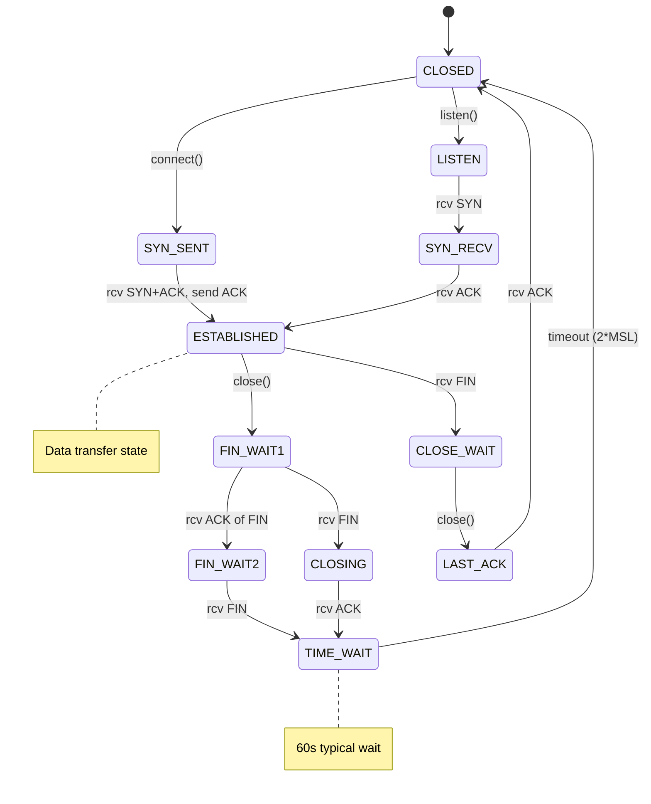

# TCP: Reliability Mechanisms

## Introduction

This chapter covers TCP's reliability mechanisms in the Linux kernel: how TCP ensures reliable, ordered delivery of data despite an unreliable network. This is the second of three TCP chapters:

1. **[TCP: Receive Path](./tcp.md)** - Packet reception, GRO, socket lookup
2. **TCP: Reliability Mechanisms** (this chapter) - State machine, sequencing, flow control
3. **[TCP: Congestion Control](./tcp_congestion.md)** - Congestion algorithms and implementation

We assume familiarity with the TCP protocol and focus on kernel implementation: state machines, data structures, and algorithms that make TCP reliable.

### TCP Reliability vs Other Protocols

**UDP** ([udp.md](./udp.md)) provides no reliability guarantees:
- No acknowledgments
- No retransmission
- No ordering
- No flow control

**TCP** guarantees:
- **Reliable delivery**: Lost packets are retransmitted
- **In-order delivery**: Data arrives in the order sent
- **Flow control**: Receiver controls sender rate
- **Connection state**: Explicit setup and teardown

### Mechanisms Covered

This chapter explores:

1. **State Machine**: Connection establishment and teardown (LISTEN, SYN_RECV, ESTABLISHED, FIN_WAIT, TIME_WAIT, etc.)
2. **Sequence Numbers**: Tracking sent/received data, detecting duplicates and gaps
3. **Data Queuing**: In-order queue and out-of-order queue (RB-tree)
4. **Flow Control**: Receive window management, zero window probes
5. **ACK Processing**: Cumulative acknowledgments, delayed ACKs, RTT estimation
6. **TCP Options**: Timestamps, window scaling, SACK, MSS, Fast Open

### Prerequisites

Read **[tcp.md](./tcp.md)** first, which covers:
- TCP data structures (`tcp_sock`, `tcphdr`, `tcp_skb_cb`)
- Protocol registration and initialization
- GRO (Generic Receive Offload)
- Socket lookup (ehash, lhash)

This chapter picks up where tcp.md ends: after socket lookup, packets enter state-specific processing.

### Cross-References

- **[tcp_congestion.md](./tcp_congestion.md)**: Congestion window (cwnd) vs flow control window (rwnd)
- **[ip.md](./ip.md)**: IP layer handoff
- **[sockets.md](./sockets.md)**: Userspace interface
- **[nics.md](./nics.md)**: Hardware context

---

## TCP State Machine

TCP connections follow a well-defined state machine that manages connection lifecycle from establishment through data transfer to termination.

### Connection States

```c
/* From include/net/tcp_states.h */

enum {
    TCP_ESTABLISHED = 1,    /* Data transfer state */
    TCP_SYN_SENT,          /* Active open, SYN sent */
    TCP_SYN_RECV,          /* Passive open, SYN received */
    TCP_FIN_WAIT1,         /* Closing, FIN sent */
    TCP_FIN_WAIT2,         /* Remote closed, waiting for app close */
    TCP_TIME_WAIT,         /* 2*MSL wait after close */
    TCP_CLOSE,             /* Closed */
    TCP_CLOSE_WAIT,        /* Remote closed, waiting for local close */
    TCP_LAST_ACK,          /* Closing, waiting for final ACK */
    TCP_LISTEN,            /* Listening for connections */
    TCP_CLOSING,           /* Simultaneous close */
    TCP_NEW_SYN_RECV,      /* Request socket (SYN cookie) */
    
    TCP_MAX_STATES         /* Leave at the end */
};
```

**State meanings**:

| State | Description | Send | Receive | Notes |
|-------|-------------|------|---------|-------|
| **CLOSED** | No connection | No | No | Virtual state, socket doesn't exist |
| **LISTEN** | Waiting for connection | No | SYN | Server waiting for client |
| **SYN_SENT** | Sent SYN, waiting for SYN-ACK | No | SYN-ACK | Active open (client) |
| **SYN_RECV** | Received SYN, sent SYN-ACK | No | ACK | Passive open (server) |
| **ESTABLISHED** | Connection open | Yes | Yes | Normal data transfer |
| **FIN_WAIT1** | Sent FIN, waiting for ACK | No | Data/FIN | Active close, step 1 |
| **FIN_WAIT2** | FIN ACKed, waiting for remote FIN | No | FIN | Active close, step 2 |
| **CLOSE_WAIT** | Remote sent FIN | Yes | No | Passive close, app must close |
| **LAST_ACK** | Sent FIN, waiting for ACK | No | ACK | Passive close, final step |
| **CLOSING** | Both sides closing | No | ACK | Rare: simultaneous close |
| **TIME_WAIT** | Wait 2*MSL for old packets | No | No | Prevent old duplicates |

### State Transition Diagram



### State-Specific Processing: `tcp_rcv_state_process()`

For non-ESTABLISHED states, `tcp_rcv_state_process()` handles state transitions:

```c
/* From net/ipv4/tcp_input.c */

int tcp_rcv_state_process(struct sock *sk, struct sk_buff *skb)
{
    struct tcp_sock *tp = tcp_sk(sk);
    struct inet_connection_sock *icsk = inet_csk(sk);
    const struct tcphdr *th = tcp_hdr(skb);
    struct request_sock *req;
    int queued = 0;
    bool acceptable;
    
    /* Check sequence number validity for all states except LISTEN/SYN_SENT */
    switch (sk->sk_state) {
    case TCP_LISTEN:
        /* Listener processing (covered in connection establishment) */
        return tcp_v4_conn_request(sk, skb);
        
    case TCP_SYN_SENT:
        /* Active open: waiting for SYN-ACK */
        queued = tcp_rcv_synsent_state_process(sk, skb, th);
        if (queued >= 0)
            return queued;
        
        /* Process any ACKs we sent */
        tcp_urg(sk, skb, th);
        __kfree_skb(skb);
        tcp_data_snd_check(sk);
        return 0;
    }
    
    /* All other states: validate sequence number first */
    acceptable = tcp_sequence(tp, TCP_SKB_CB(skb)->seq, TCP_SKB_CB(skb)->end_seq);
    
    if (!acceptable) {
        /* Out of window packet */
        if (RST_flag_set)
            goto discard;
        
        tcp_send_dupack(sk, skb);  /* Send duplicate ACK */
        goto discard;
    }
    
    /* Process RST flag */
    if (th->rst) {
        tcp_reset(sk);
        goto discard;
    }
    
    /* Check SYN in non-SYN states (invalid) */
    if (th->syn) {
        tcp_reset(sk);
        return 1;
    }
    
    /* Process ACK */
    if (!th->ack)
        goto discard;
    
    switch (sk->sk_state) {
    case TCP_SYN_RECV:
        /* Received final ACK of three-way handshake */
        if (!tcp_validate_incoming(sk, skb, th, 0))
            return 0;
        
        /* Move to ESTABLISHED */
        tcp_set_state(sk, TCP_ESTABLISHED);
        sk->sk_state_change(sk);
        
        /* Initialize congestion control */
        tp->copied_seq = tp->rcv_nxt;
        tcp_init_metrics(sk);
        tcp_init_congestion_control(sk);
        
        /* Connection established! */
        if (sock_flag(sk, SOCK_KEEPOPEN))
            inet_csk_reset_keepalive_timer(sk, keepalive_time_when(tp));
        
        if (!sock_flag(sk, SOCK_DEAD)) {
            sk->sk_state_change(sk);
            sk_wake_async(sk, SOCK_WAKE_IO, POLL_OUT);
        }
        
        /* Fall through to process any data in this packet */
        break;
        
    case TCP_FIN_WAIT1: {
        int tmo;
        
        /* Process data and FIN */
        if (tcp_ack(sk, skb, FLAG_SLOWPATH | FLAG_UPDATE_TS_RECENT) < 0)
            return 1;
        
        /* If our FIN is acked, move to FIN_WAIT2 */
        if (tp->snd_una == tp->write_seq) {
            tcp_set_state(sk, TCP_FIN_WAIT2);
            sk->sk_shutdown |= SEND_SHUTDOWN;
            
            /* Start FIN_WAIT2 timer if needed */
            if (sock_flag(sk, SOCK_LINGER) && !sk->sk_lingertime)
                tmo = 0;
            else if (tcp_fin_time(sk) < TCP_TIMEWAIT_LEN)
                tmo = tcp_fin_time(sk);
            else {
                /* Enter TIME_WAIT immediately if quick close */
                if (tmo > TCP_TIMEWAIT_LEN) {
                    inet_csk_reset_keepalive_timer(sk, tmo - TCP_TIMEWAIT_LEN);
                } else if (th->fin || sock_owned_by_user(sk)) {
                    /* Bad case: should not happen */
                    tmo = TCP_TIMEWAIT_LEN;
                }
                
                inet_csk_schedule_timewait_timer(sk, tmo);
            }
        } else {
            /* FIN not yet acked, stay in FIN_WAIT1 */
        }
        break;
    }
    
    case TCP_FIN_WAIT2:
        /* Waiting for remote FIN */
        if (tcp_ack(sk, skb, FLAG_SLOWPATH | FLAG_UPDATE_TS_RECENT) < 0)
            return 1;
        break;
        
    case TCP_CLOSE_WAIT:
    case TCP_CLOSING:
        /* Process ACKs */
        if (tcp_ack(sk, skb, FLAG_SLOWPATH | FLAG_UPDATE_TS_RECENT) < 0)
            return 1;
        
        if (sk->sk_state == TCP_CLOSING && tp->snd_una == tp->write_seq) {
            /* Both sides closed, move to TIME_WAIT */
            tcp_time_wait(sk, TCP_TIME_WAIT, 0);
            goto discard;
        }
        break;
        
    case TCP_LAST_ACK:
        /* Waiting for final ACK */
        if (tp->snd_una == tp->write_seq) {
            tcp_done(sk);  /* Connection closed */
            goto discard;
        }
        break;
    }
    
    /* Process data and FIN flag */
    tcp_data_queue(sk, skb);
    tcp_urg(sk, skb, th);
    tcp_ack_snd_check(sk);
    
    if (th->fin)
        tcp_fin(sk);
    
    return 0;
    
discard:
    __kfree_skb(skb);
    return 0;
}
```

**Key points**:

- **Sequence validation**: All states except LISTEN/SYN_SENT check sequence numbers
- **State transitions**: Triggered by flags (ACK, FIN) and conditions
- **Timers**: Each state may set different timers (keepalive, FIN_WAIT2, TIME_WAIT)
- **Error handling**: RST, invalid SYN handled per-state

### Connection Establishment: Three-Way Handshake

**Server side** (passive open):

```c
/* From net/ipv4/tcp_ipv4.c */

/* Step 1: Receive SYN */
int tcp_v4_conn_request(struct sock *sk, struct sk_buff *skb)
{
    struct request_sock *req;
    struct tcp_sock *tp = tcp_sk(sk);
    struct inet_request_sock *ireq;
    struct tcp_options_received tmp_opt;
    const struct tcphdr *th = tcp_hdr(skb);
    __u32 isn;
    
    /* Check SYN flood protection */
    if (inet_csk_reqsk_queue_is_full(sk) && !isn) {
        /* Queue full: use SYN cookies */
        want_cookie = tcp_syn_flood_action(sk, skb, "TCP");
        if (!want_cookie)
            goto drop;
    }
    
    /* Check listen backlog */
    if (sk_acceptq_is_full(sk)) {
        __NET_INC_STATS(sock_net(sk), LINUX_MIB_LISTENOVERFLOWS);
        goto drop;
    }
    
    /* Allocate request socket (mini-socket for SYN_RECV state) */
    req = inet_reqsk_alloc(&tcp_request_sock_ops, sk, !want_cookie);
    if (!req)
        goto drop;
    
    /* Parse TCP options from SYN */
    tcp_clear_options(&tmp_opt);
    tmp_opt.mss_clamp = TCP_MSS_DEFAULT;
    tmp_opt.user_mss = tp->rx_opt.user_mss;
    tcp_parse_options(sock_net(sk), skb, &tmp_opt, 0, NULL);
    
    /* Handle SYN cookies if needed */
    if (want_cookie) {
        isn = cookie_v4_init_sequence(sk, skb, &req->mss);
        req->cookie_ts = tmp_opt.tstamp_ok;
    } else {
        /* Normal case: allocate ISN */
        isn = tcp_v4_init_sequence(skb);
    }
    
    /* Initialize request socket */
    ireq = inet_rsk(req);
    ireq->ir_num = ntohs(th->dest);
    ireq->ir_rmt_port = th->source;
    ireq->ir_iif = inet_request_bound_dev_if(sk, skb);
    ireq->ir_mark = inet_request_mark(sk, skb);
    
    /* Store options */
    ireq->snd_wscale = tmp_opt.snd_wscale;
    ireq->sack_ok = tmp_opt.sack_ok;
    ireq->wscale_ok = tmp_opt.wscale_ok;
    ireq->tstamp_ok = tmp_opt.tstamp_ok;
    
    /* Add to SYN queue */
    inet_csk_reqsk_queue_hash_add(sk, req, TCP_TIMEOUT_INIT);
    
    /* Send SYN-ACK */
    err = tcp_v4_send_synack(sk, NULL, req, NULL);
    if (err)
        goto drop_and_free;
    
    return 0;
    
drop_and_free:
    reqsk_free(req);
drop:
    tcp_listendrop(sk);
    return 0;
}
```

**Step 2: Send SYN-ACK**:

```c
/* From net/ipv4/tcp_output.c */
int tcp_v4_send_synack(const struct sock *sk, struct dst_entry *dst,
                       struct request_sock *req,
                       struct tcp_fastopen_cookie *foc)
{
    const struct inet_request_sock *ireq = inet_rsk(req);
    struct flowi4 fl4;
    struct sk_buff *skb;
    struct tcphdr *th;
    
    /* Allocate SKB for SYN-ACK */
    skb = tcp_make_synack(sk, dst, req, foc, TFO_SERVER);
    if (!skb)
        return -ENOMEM;
    
    /* Send via IP layer */
    err = ip_build_and_send_pkt(skb, sk, ireq->ir_loc_addr,
                                 ireq->ir_rmt_addr,
                                 rcu_dereference(ireq->ireq_opt),
                                 sock_net_uid(sk, sk_fullsock(sk) ? sk : NULL));
    return err;
}
```

**Step 3: Receive final ACK**:

```c
/* From net/ipv4/tcp_input.c: tcp_rcv_state_process() */

case TCP_SYN_RECV:
    /* Validate ACK number */
    if (!tcp_validate_incoming(sk, skb, th, 0))
        return 0;
    
    /* Check if ACK acknowledges our SYN */
    if (!before(TCP_SKB_CB(skb)->ack_seq, tp->snd_una) &&
        !after(TCP_SKB_CB(skb)->ack_seq, tp->snd_nxt)) {
        
        /* Valid ACK: connection established! */
        tcp_set_state(sk, TCP_ESTABLISHED);
        
        /* Initialize metrics and congestion control */
        tcp_init_metrics(sk);
        tcp_init_buffer_space(sk);
        tcp_init_congestion_control(sk);
        
        /* Move from SYN queue to accept queue */
        inet_csk_reqsk_queue_drop(sk, req);
        
        /* Wake up accept() */
        sk->sk_state_change(sk);
    }
    break;
```

**SYN Cookies** (defense against SYN flood):

When SYN queue is full, encode connection info in ISN:

```c
/* From net/ipv4/syncookies.c */

__u32 cookie_v4_init_sequence(const struct sock *sk, const struct sk_buff *skb,
                               __u16 *mssp)
{
    const struct iphdr *iph = ip_hdr(skb);
    const struct tcphdr *th = tcp_hdr(skb);
    __u32 seq;
    
    /* Encode in ISN:
     * - MSS (3 bits)
     * - Timestamp (if enabled)
     * - Cryptographic hash of connection 4-tuple
     */
    seq = secure_tcp_syn_cookie(iph->saddr, iph->daddr,
                                  th->source, th->dest,
                                  ntohl(th->seq),
                                  jiffies / (HZ * 60), *mssp);
    
    return seq;
}

/* Later, validate the cookie when ACK arrives */
struct sock *cookie_v4_check(struct sock *sk, struct sk_buff *skb)
{
    struct tcp_sock *tp = tcp_sk(sk);
    const struct tcphdr *th = tcp_hdr(skb);
    __u32 cookie = ntohl(th->ack_seq) - 1;
    struct sock *ret = sk;
    struct request_sock *req;
    
    /* Decode and validate cookie */
    if (!cookie_timestamp_decode(cookie_opt))
        goto out;
    
    /* Cookie valid: create full connection */
    req = inet_reqsk_alloc(&tcp_request_sock_ops, sk, false);
    if (!req)
        goto out;
    
    /* ... initialize request socket from cookie ... */
    
    /* Move directly to ESTABLISHED */
    ret = tcp_check_req(sk, skb, req, true, &own_req);
    
out:
    return ret;
}
```

**SYN cookie benefits**:
- No memory allocation until valid ACK
- Survives SYN flood attacks
- Transparent to legitimate clients

**SYN cookie limitations**:
- Cannot store options reliably
- Slightly slower (crypto overhead)
- Window scaling negotiation degraded

### Connection Termination: Four-Way Handshake

**Active close** (application calls `close()`):

```c
/* Step 1: Application closes socket */
void tcp_close(struct sock *sk, long timeout)
{
    struct sk_buff *skb;
    int data_was_unread = 0;
    int state;
    
    lock_sock(sk);
    sk->sk_shutdown = SHUTDOWN_MASK;
    
    /* Check if we have data in receive queue */
    if (sk->sk_receive_queue.qlen > 0) {
        /* Application closed without reading data: send RST */
        data_was_unread = 1;
    }
    
    if (data_was_unread) {
        /* Abort connection (RST) */
        tcp_set_state(sk, TCP_CLOSE);
        tcp_send_active_reset(sk, GFP_KERNEL);
        __NET_INC_STATS(sock_net(sk), LINUX_MIB_TCPABORTONCLOSE);
    } else {
        /* Normal close: send FIN */
        tcp_send_fin(sk);
        
        /* Transition to FIN_WAIT1 */
        switch (sk->sk_state) {
        case TCP_ESTABLISHED:
            tcp_set_state(sk, TCP_FIN_WAIT1);
            break;
        case TCP_CLOSE_WAIT:
            tcp_set_state(sk, TCP_LAST_ACK);
            break;
        }
    }
    
    /* Wait for close to complete or timeout */
    if (timeout) {
        schedule_timeout(timeout);
    }
    
    release_sock(sk);
    sock_put(sk);
}
```

**Processing incoming FIN**:

```c
/* From net/ipv4/tcp_input.c */

void tcp_fin(struct sock *sk)
{
    struct tcp_sock *tp = tcp_sk(sk);
    
    /* Mark end of stream */
    tp->rcv_nxt++;
    
    /* Update state based on current state */
    switch (sk->sk_state) {
    case TCP_ESTABLISHED:
        /* Remote side closing */
        tcp_set_state(sk, TCP_CLOSE_WAIT);
        inet_csk(sk)->icsk_ack.pingpong = 1;  /* Force delayed ACK */
        break;
        
    case TCP_FIN_WAIT1:
        /* Simultaneous close or FIN before FIN ACK */
        tcp_set_state(sk, TCP_CLOSING);
        break;
        
    case TCP_FIN_WAIT2:
        /* Expected: remote FIN after our FIN was ACKed */
        tcp_set_state(sk, TCP_TIME_WAIT);
        tcp_time_wait(sk, TCP_TIME_WAIT, 0);
        break;
    }
    
    /* Wake up application (poll/select will see EOF) */
    sk->sk_state_change(sk);
    sk->sk_shutdown |= RCV_SHUTDOWN;
    
    if (!sock_flag(sk, SOCK_DEAD)) {
        sk_wake_async(sk, SOCK_WAKE_WAITD, POLL_IN);
    }
    
    /* Send ACK for FIN */
    tcp_send_ack(sk);
}
```

### TIME_WAIT State

**Why TIME_WAIT exists**:

1. **Prevent old duplicates**: Packets from previous connection with same 4-tuple
2. **Ensure remote receives final ACK**: Allow retransmission if lost
3. **Duration**: 2*MSL (Maximum Segment Lifetime), typically 60 seconds

```c
/* From net/ipv4/tcp_minisocks.c */

void tcp_time_wait(struct sock *sk, int state, int timeo)
{
    struct inet_timewait_sock *tw;
    const struct inet_connection_sock *icsk = inet_csk(sk);
    const struct tcp_sock *tp = tcp_sk(sk);
    bool recycle_ok = false;
    
    /* Create TIME_WAIT mini-socket (much smaller than full tcp_sock) */
    tw = inet_twsk_alloc(sk, tcp_death_row, state);
    if (tw) {
        struct tcp_timewait_sock *tcptw = tcp_twsk((struct sock *)tw);
        const int rto = (icsk->icsk_rto << 2) - (icsk->icsk_rto >> 1);
        
        /* Copy essential state */
        tw->tw_rcv_wscale = tp->rx_opt.rcv_wscale;
        tcptw->tw_rcv_nxt = tp->rcv_nxt;
        tcptw->tw_snd_nxt = tp->snd_nxt;
        tcptw->tw_ts_recent = tp->rx_opt.ts_recent;
        tcptw->tw_ts_recent_stamp = tp->rx_opt.ts_recent_stamp;
        
        /* Set TIME_WAIT timer */
        inet_twsk_schedule(tw, timeo);
        
        /* Replace full socket with mini-socket */
        inet_twsk_hashdance(tw, sk, &tcp_hashinfo);
        inet_twsk_put(tw);
    } else {
        /* Failed to allocate: purge immediately */
        tcp_done(sk);
    }
}
```

**TIME_WAIT socket structure** (compare to full `tcp_sock`):

```c
/* From include/net/tcp.h */

struct tcp_timewait_sock {
    struct inet_timewait_sock tw_sk;  /* ~168 bytes */
    __u32   tw_rcv_nxt;
    __u32   tw_snd_nxt;
    __u32   tw_rcv_wnd;
    __u32   tw_ts_offset;
    __u32   tw_ts_recent;
    long    tw_ts_recent_stamp;
};

/* Size comparison: */
sizeof(struct tcp_sock) ≈ 2048 bytes
sizeof(struct tcp_timewait_sock) ≈ 200 bytes  /* 10x smaller! */
```

**TIME_WAIT assassination hazard**:

If a new SYN arrives with the same 4-tuple while in TIME_WAIT:

```c
/* From net/ipv4/tcp_minisocks.c */

enum tcp_tw_status tcp_timewait_state_process(struct inet_timewait_sock *tw,
                                               struct sk_buff *skb,
                                               const struct tcphdr *th)
{
    struct tcp_timewait_sock *tcptw = tcp_twsk((struct sock *)tw);
    
    /* Check if this is a new SYN (connection reincarnation) */
    if (th->syn && !th->rst && !th->ack &&
        after(TCP_SKB_CB(skb)->seq, tcptw->tw_rcv_nxt)) {
        /* Sequence number advanced: allow new connection */
        return TCP_TW_SYN;
    }
    
    /* Normal TIME_WAIT processing: ACK old packets, ignore data */
    if (th->ack) {
        return TCP_TW_ACK;  /* Send ACK */
    }
    
    if (th->rst) {
        return TCP_TW_RST;  /* Process RST */
    }
    
    return TCP_TW_SUCCESS;  /* Drop packet silently */
}
```

**Tuning TIME_WAIT**:

```bash
# Reduce TIME_WAIT duration (not recommended for Internet)
# Default: 60 seconds (2 * MSL)
# /proc/sys/net/ipv4/tcp_fin_timeout controls FIN_WAIT2, not TIME_WAIT

# Reuse TIME_WAIT sockets for outgoing connections
echo 1 > /proc/sys/net/ipv4/tcp_tw_reuse  # Safe

# Recycle TIME_WAIT sockets (not recommended, breaks NAT)
echo 0 > /proc/sys/net/ipv4/tcp_tw_recycle  # Removed in Linux 4.12

# Maximum TIME_WAIT sockets
net.ipv4.tcp_max_tw_buckets = 262144
```

**TIME_WAIT in production**:

High-traffic servers (web, API) can accumulate many TIME_WAIT sockets:

```bash
# Count TIME_WAIT connections
ss -tan | grep TIME-WAIT | wc -l
# 50000

# Total memory used (200 bytes each)
# 50000 × 200 = ~10 MB (acceptable)

# Compare to full sockets (2KB each)
# 50000 × 2048 = ~100 MB (significant!)
```

TIME_WAIT is a feature, not a bug: it provides correctness guarantees. The mini-socket optimization makes it affordable.

---


## Sequence Number Management

TCP uses 32-bit sequence numbers to track every byte of data. Understanding sequence number handling is critical for reliability and ordering.

### Sequence Number Space

```c
/* 32-bit sequence numbers wrap around */
#define SEQ_MAX 0xFFFFFFFF

/* Macros for sequence number comparison (handle wrapping) */
/* From include/net/tcp.h */

static inline bool before(__u32 seq1, __u32 seq2)
{
    return (__s32)(seq1 - seq2) < 0;
}

static inline bool after(__u32 seq1, __u32 seq2)
{
    return (__s32)(seq2 - seq1) < 0;
}

/* Examples:
 * before(100, 200) = true   (100 < 200)
 * after(200, 100) = true    (200 > 100)
 * before(0xFFFFFF00, 0x00000100) = true  (handles wrap!)
 */
```

**Why signed comparison?**

```c
/* Without wrapping (simple case): */
seq1 = 100, seq2 = 200
seq1 - seq2 = -100 (negative) → seq1 before seq2 ✓

/* With wrapping: */
seq1 = 0xFFFFFF00, seq2 = 0x00000100
seq1 - seq2 = 0xFFFFFE00 (as signed: -512) → seq1 before seq2 ✓
```

The signed arithmetic makes wraparound transparent.

### ESTABLISHED Fast Path: `tcp_rcv_established()`

For ESTABLISHED connections, most packets take the fast path:

```c
/* From net/ipv4/tcp_input.c */

void tcp_rcv_established(struct sock *sk, struct sk_buff *skb)
{
    struct tcp_sock *tp = tcp_sk(sk);
    const struct tcphdr *th = (const struct tcphdr *)skb->data;
    unsigned int len = skb->len;
    
    /* Fast path conditions check (header prediction) */
    if (len == tcp_header_len &&
        th->ack &&
        !th->syn && !th->fin && !th->rst && !th->urg &&
        TCP_SKB_CB(skb)->seq == tp->rcv_nxt &&
        tp->rcv_wnd &&
        tp->snd_nxt == tp->snd_una) {
        
        /* FAST PATH: In-order data, no out-of-order packets pending */
        
        if (len) {
            /* Pure data packet or data+ACK */
            int eaten = tcp_queue_rcv(sk, skb, tcp_header_len, &fragstolen);
            
            /* Update receive sequence number */
            tp->rcv_nxt = TCP_SKB_CB(skb)->end_seq;
            
            /* Update window */
            tcp_event_data_recv(sk, skb);
            
            /* Check if we need to send ACK */
            if (th->ack)
                tcp_ack(sk, skb, FLAG_DATA);
            
            /* Wake application */
            if (!sock_flag(sk, SOCK_DEAD))
                sk->sk_data_ready(sk);
            
            if (fragstolen)
                kfree_skb_partial(skb, fragstolen);
            else
                consume_skb(skb);
            
            return;
        }
        
        if (th->ack) {
            /* Pure ACK */
            tcp_ack(sk, skb, 0);
            __kfree_skb(skb);
            return;
        }
    }
    
    /* SLOW PATH: Out-of-order, retransmissions, or special processing */
    
    /* Validate sequence number */
    if (!tcp_validate_incoming(sk, skb, th, 1))
        return;
    
step5:
    /* Process ACK */
    if (th->ack) {
        if (tcp_ack(sk, skb, FLAG_SLOWPATH | FLAG_UPDATE_TS_RECENT) < 0)
            goto discard;
    }
    
    /* Process urgent data */
    tcp_urg(sk, skb, th);
    
    /* Process data (may be out-of-order) */
    tcp_data_queue(sk, skb);
    
    /* Check if we should send ACK */
    tcp_ack_snd_check(sk);
    return;
    
discard:
    __kfree_skb(skb);
}
```

**Header prediction** (fast path conditions):

1. **Expected sequence**: `seq == rcv_nxt` (in-order)
2. **No control flags**: No SYN, FIN, RST, URG
3. **Window open**: `rcv_wnd > 0` (receiver has buffer space)
4. **No unacknowledged data**: `snd_nxt == snd_una` (all sent data is ACKed)
5. **Standard header**: No TCP options or standard options only

**Performance impact**:

```
Fast path: ~200-400 cycles per packet
Slow path: ~1000-2000 cycles per packet

In bulk transfers: >90% of packets take fast path
```

### Sequence Number Validation

Before processing any packet, validate the sequence number:

```c
/* From net/ipv4/tcp_input.c */

static bool tcp_validate_incoming(struct sock *sk, struct sk_buff *skb,
                                   const struct tcphdr *th, int syn_inerr)
{
    struct tcp_sock *tp = tcp_sk(sk);
    bool acceptable;
    
    /* Check if sequence number is in valid window */
    acceptable = tcp_sequence(tp, TCP_SKB_CB(skb)->seq, 
                               TCP_SKB_CB(skb)->end_seq);
    
    if (!acceptable) {
        /* Packet outside receive window */
        
        if (th->rst)
            return false;  /* Drop invalid RST */
        
        /* Send duplicate ACK to indicate we're still waiting */
        tcp_send_dupack(sk, skb);
        goto discard;
    }
    
    /* Check for RST in valid window */
    if (th->rst) {
        if (TCP_SKB_CB(skb)->seq == tp->rcv_nxt) {
            tcp_reset(sk);
            return false;
        }
        goto discard;
    }
    
    /* Check for SYN (invalid in ESTABLISHED state) */
    if (th->syn) {
        tcp_reset(sk);
        return false;
    }
    
    /* Valid packet */
    return true;
    
discard:
    __kfree_skb(skb);
    return false;
}

/* Check if sequence is in receive window */
static inline bool tcp_sequence(const struct tcp_sock *tp, u32 seq, u32 end_seq)
{
    /* Valid if:
     *   rcv_wnd > 0 AND
     *   seq is in [rcv_nxt, rcv_nxt + rcv_wnd]
     */
    return !before(end_seq, tp->rcv_nxt) &&
           !after(seq, tp->rcv_nxt + tp->rcv_wnd);
}
```

**Sequence number scenarios**:

```
Current state: rcv_nxt = 1000, rcv_wnd = 10000

1. In-order packet:
   seq = 1000, end_seq = 1500
   → Accept immediately, update rcv_nxt = 1500

2. Out-of-order (gap):
   seq = 2000, end_seq = 2500
   → Queue in out-of-order queue, wait for gap fill

3. Duplicate:
   seq = 500, end_seq = 1000
   → Discard, send duplicate ACK

4. Outside window:
   seq = 15000, end_seq = 15500
   → Discard, send ACK with current rcv_nxt

5. Partial overlap (left):
   seq = 800, end_seq = 1200
   → Trim to [1000, 1200], accept

6. Partial overlap (right):
   seq = 10500, end_seq = 11000
   → Beyond window, discard
```

### Handling Sequence Number Wrapping

Sequence numbers wrap after 4GB of data:

```c
/* Example: Connection transfers 5GB */

Initial ISN: 0x10000000 (268,435,456)

After 4GB:
  seq = 0x10000000 + 0xFFFFFFFF = 0x0FFFFFFF (wrapped)

Detection:
  before(0x0FFFFFFF, 0x10000000) = true  (handles wrap correctly)
```

**Maximum window size**:

```c
/* Without window scaling: */
max_window = 65535 bytes (2^16 - 1)

/* With window scaling (wscale = 14): */
max_window = 65535 << 14 = 1,073,725,440 bytes (~1GB)

/* This ensures sequence numbers don't wrap within one window */
```

### Detecting Old Duplicates

TCP must distinguish between:
- **Retransmission**: Lost packet resent (should accept)
- **Old duplicate**: Packet from previous connection (should reject)

**PAWS (Protection Against Wrapped Sequences)**:

Uses timestamps to detect old duplicates:

```c
/* From net/ipv4/tcp_input.c */

static bool tcp_paws_discard(const struct sock *sk, const struct sk_buff *skb)
{
    const struct tcp_sock *tp = tcp_sk(sk);
    
    /* Check if packet has timestamp option */
    if (!tp->rx_opt.ts_recent_stamp)
        return false;
    
    /* Compare timestamp in packet with last seen timestamp */
    if (tcp_time_stamp(tp) - tp->rx_opt.ts_recent_stamp > TCP_PAWS_MSL) {
        /* Timestamp is old, but might be valid (MSL expired) */
        return false;
    }
    
    /* Reject if timestamp goes backward */
    if (tp->rx_opt.ts_recent > TCP_SKB_CB(skb)->when) {
        /* Old duplicate detected! */
        __NET_INC_STATS(sock_net(sk), LINUX_MIB_PAWSESTABREJECTED);
        return true;
    }
    
    return false;
}
```

**PAWS ensures**:
- Old packets from previous connections are rejected
- Even with sequence number wrap
- 60-second MSL (Maximum Segment Lifetime)

---

## Data Reception & Queuing

TCP must handle data arriving in any order, buffering out-of-order segments until gaps are filled.

### Data Queuing Overview

Two queues per socket:

1. **In-order queue** (`sk->sk_receive_queue`): Ready for application
2. **Out-of-order queue** (`tp->out_of_order_queue`): RB-tree of gaps

```
Application reads ← sk_receive_queue (linked list, in-order)
                          ↑
                    tcp_data_queue()
                     /            \
                    /              \
            In-order?              Out-of-order
                   ↓                      ↓
            tcp_queue_rcv()      tcp_data_queue_ofo()
                   ↓                      ↓
            sk_receive_queue      out_of_order_queue (RB-tree)
                                         ↓
                                  (Wait for gap fill)
```

### Main Data Queuing Function: `tcp_data_queue()`

```c
/* From net/ipv4/tcp_input.c */

static void tcp_data_queue(struct sock *sk, struct sk_buff *skb)
{
    struct tcp_sock *tp = tcp_sk(sk);
    bool fragstolen = false;
    int eaten;
    
    /* Check if this is the expected sequence number (in-order) */
    if (TCP_SKB_CB(skb)->seq == tp->rcv_nxt) {
        /* IN-ORDER DATA */
        
        /* Check for zero window condition */
        if (tp->rcv_wnd == 0) {
            /* Receiver has no buffer space */
            goto out_of_window;
        }
        
        /* Queue directly to receive queue */
        eaten = tcp_queue_rcv(sk, skb, &fragstolen);
        
        /* Update next expected sequence */
        tp->rcv_nxt = TCP_SKB_CB(skb)->end_seq;
        
        /* Update window */
        tcp_event_data_recv(sk, skb);
        
        /* Check if this fills a gap in out-of-order queue */
        if (!RB_EMPTY_ROOT(&tp->out_of_order_queue)) {
            tcp_ofo_queue(sk);
            
            /* Check if we can now read data */
            if (tp->rcv_nxt == tp->copied_seq)
                tcp_fast_path_check(sk);
        }
        
        /* Check if we should send ACK */
        if (eaten > 0)
            tcp_data_snd_check(sk);
        
        /* Wake up application */
        if (!sock_flag(sk, SOCK_DEAD))
            sk->sk_data_ready(sk);
        
        if (fragstolen)
            kfree_skb_partial(skb, fragstolen);
        else
            consume_skb(skb);
        
        return;
    }
    
    /* OUT-OF-ORDER DATA */
    
    /* Check if completely outside window */
    if (!after(TCP_SKB_CB(skb)->end_seq, tp->rcv_nxt)) {
        /* Old duplicate, discard */
        __kfree_skb(skb);
        return;
    }
    
    if (after(TCP_SKB_CB(skb)->seq, tp->rcv_nxt + tp->rcv_wnd)) {
        /* Beyond window, discard */
        goto out_of_window;
    }
    
    /* Valid out-of-order segment: add to OOO queue */
    tcp_data_queue_ofo(sk, skb);
    
    return;
    
out_of_window:
    tcp_enter_quickack_mode(sk, TCP_MAX_QUICKACKS);
    inet_csk_schedule_ack(sk);
drop:
    tcp_drop(sk, skb);
}
```

### In-Order Data Path: `tcp_queue_rcv()`

```c
/* From net/ipv4/tcp_input.c */

static int tcp_queue_rcv(struct sock *sk, struct sk_buff *skb, int hdrlen,
                          bool *fragstolen)
{
    struct tcp_sock *tp = tcp_sk(sk);
    int eaten;
    struct sk_buff *tail = skb_peek_tail(&sk->sk_receive_queue);
    
    __skb_pull(skb, hdrlen);  /* Remove TCP header */
    
    /* Try to coalesce with last SKB in queue (if contiguous) */
    if (tail) {
        if (TCP_SKB_CB(tail)->end_seq == TCP_SKB_CB(skb)->seq &&
            !skb_has_frag_list(tail) && !skb_has_frag_list(skb)) {
            
            /* Coalesce: append this SKB's data to previous SKB */
            eaten = skb_try_coalesce(tail, skb, fragstolen, &nr_frags);
            if (eaten > 0) {
                /* Successful coalesce */
                TCP_SKB_CB(tail)->end_seq = TCP_SKB_CB(skb)->end_seq;
                
                /* Update flags if FIN was in this packet */
                if (TCP_SKB_CB(skb)->tcp_flags & TCPHDR_FIN)
                    TCP_SKB_CB(tail)->tcp_flags |= TCPHDR_FIN;
                
                return eaten;
            }
        }
    }
    
    /* Cannot coalesce: add as new SKB */
    eaten = -1;
    __skb_queue_tail(&sk->sk_receive_queue, skb);
    skb_set_owner_r(skb, sk);
    
    return eaten;
}
```

**Coalescing benefits**:

```
Without coalescing:
  Receive 10 packets of 1448 bytes each
  → 10 SKBs in queue
  → Application calls read() 10 times (or once with scatter-gather)

With coalescing:
  Receive 10 packets of 1448 bytes each
  → 1 SKB in queue (14,480 bytes)
  → Application calls read() once
  → 10x fewer queue operations, better cache locality
```

### Out-of-Order Queue: `tcp_data_queue_ofo()`

The out-of-order queue is an **RB-tree** (Red-Black tree) sorted by sequence number:

```c
/* From net/ipv4/tcp_input.c */

static void tcp_data_queue_ofo(struct sock *sk, struct sk_buff *skb)
{
    struct tcp_sock *tp = tcp_sk(sk);
    struct rb_node **p, *parent;
    struct sk_buff *skb1;
    u32 seq = TCP_SKB_CB(skb)->seq;
    u32 end_seq = TCP_SKB_CB(skb)->end_seq;
    
    /* Fast path: empty OOO queue */
    if (RB_EMPTY_ROOT(&tp->out_of_order_queue)) {
        rb_link_node(&skb->rbnode, NULL, &tp->out_of_order_queue.rb_node);
        rb_insert_color(&skb->rbnode, &tp->out_of_order_queue);
        tp->ooo_last_skb = skb;
        goto end;
    }
    
    /* Try to append to last SKB (common case: sequential out-of-order) */
    if (tp->ooo_last_skb &&
        seq == TCP_SKB_CB(tp->ooo_last_skb)->end_seq &&
        !tcp_has_rxtstamp(tp->ooo_last_skb) &&
        !tcp_has_rxtstamp(skb)) {
        
        /* Can coalesce with last OOO SKB */
        if (!skb_try_coalesce(tp->ooo_last_skb, skb, &fragstolen, &nr_frags)) {
            /* Coalesce failed, add as new node */
            rb_link_node(&skb->rbnode, &tp->ooo_last_skb->rbnode,
                        &tp->ooo_last_skb->rbnode.rb_right);
            rb_insert_color(&skb->rbnode, &tp->out_of_order_queue);
            tp->ooo_last_skb = skb;
        } else {
            /* Successful coalesce */
            TCP_SKB_CB(tp->ooo_last_skb)->end_seq = end_seq;
            if (TCP_SKB_CB(skb)->tcp_flags & TCPHDR_FIN)
                TCP_SKB_CB(tp->ooo_last_skb)->tcp_flags |= TCPHDR_FIN;
            __kfree_skb(skb);
        }
        goto end;
    }
    
    /* General case: find insertion point in RB-tree */
    p = &tp->out_of_order_queue.rb_node;
    parent = NULL;
    
    while (*p) {
        parent = *p;
        skb1 = rb_to_skb(parent);
        
        if (before(seq, TCP_SKB_CB(skb1)->seq)) {
            /* Insert left */
            p = &parent->rb_left;
            
            /* Check if we can merge with previous segment */
            if (parent == rb_first(&tp->out_of_order_queue))
                goto insert;
            
        } else if (after(seq, TCP_SKB_CB(skb1)->end_seq)) {
            /* Insert right */
            p = &parent->rb_right;
            
        } else {
            /* Overlap detected */
            
            if (seq == TCP_SKB_CB(skb1)->seq &&
                end_seq == TCP_SKB_CB(skb1)->end_seq) {
                /* Exact duplicate */
                tcp_drop(sk, skb);
                return;
            }
            
            /* Partial overlap: trim or split */
            tcp_drop_overlap(sk, skb, skb1);
            goto insert;
        }
    }
    
insert:
    /* Insert into RB-tree */
    rb_link_node(&skb->rbnode, parent, p);
    rb_insert_color(&skb->rbnode, &tp->out_of_order_queue);
    
    /* Update cached last SKB if appropriate */
    if (!tp->ooo_last_skb ||
        after(end_seq, TCP_SKB_CB(tp->ooo_last_skb)->end_seq)) {
        tp->ooo_last_skb = skb;
    }
    
end:
    /* Check if we should prune OOO queue (memory pressure) */
    if (atomic_read(&sk->sk_rmem_alloc) > sk->sk_rcvbuf ||
        RB_EMPTY_ROOT(&tp->out_of_order_queue) == false) {
        tcp_data_queue_ofo_prune(sk);
    }
    
    /* Send SACK to inform sender */
    tcp_sack_new_ofo_skb(sk, seq, end_seq);
}
```

**RB-tree advantages**:

- **O(log n) insertion**: Fast even with many gaps
- **Sorted order**: Easy to find gaps and merge
- **Cache-friendly**: Better than linked list for large OOO queues

**Example OOO queue**:

```
Expected: rcv_nxt = 1000

Received packets:
  1. seq=2000-2500 (gap)
  2. seq=1500-2000 (gap)
  3. seq=3000-3500 (gap)

RB-tree structure:
         [2000-2500]
         /         \
   [1500-2000]   [3000-3500]

When seq=1000-1500 arrives:
  → Merge [1000-1500] + [1500-2000] + [2000-2500]
  → Move all to receive queue
  → rcv_nxt = 2500
  → [3000-3500] remains in OOO
```

### Merging Out-of-Order Data: `tcp_ofo_queue()`

When in-order data fills a gap, check if OOO data can be moved:

```c
/* From net/ipv4/tcp_input.c */

static void tcp_ofo_queue(struct sock *sk)
{
    struct tcp_sock *tp = tcp_sk(sk);
    struct sk_buff *skb, *tail;
    struct rb_node *p;
    
    p = rb_first(&tp->out_of_order_queue);
    while (p) {
        skb = rb_to_skb(p);
        
        /* Check if this SKB fills the gap */
        if (after(TCP_SKB_CB(skb)->seq, tp->rcv_nxt))
            break;  /* Still a gap */
        
        /* This SKB (or part of it) is now in order */
        
        if (before(TCP_SKB_CB(skb)->seq, tp->rcv_nxt)) {
            /* Partial overlap: trim already-received data */
            __pskb_trim_head(skb, tp->rcv_nxt - TCP_SKB_CB(skb)->seq);
            TCP_SKB_CB(skb)->seq = tp->rcv_nxt;
        }
        
        /* Remove from OOO queue */
        p = rb_next(p);
        rb_erase(&skb->rbnode, &tp->out_of_order_queue);
        
        /* Move to receive queue */
        tail = skb_peek_tail(&sk->sk_receive_queue);
        __skb_queue_tail(&sk->sk_receive_queue, skb);
        
        /* Update next expected sequence */
        tp->rcv_nxt = TCP_SKB_CB(skb)->end_seq;
        
        /* Check for FIN */
        if (TCP_SKB_CB(skb)->tcp_flags & TCPHDR_FIN)
            tcp_fin(sk);
    }
}
```

**Performance impact**:

```
Large file transfer with 0.1% packet loss:

Without OOO queue (drop all OOO packets):
  - Every loss requires retransmit
  - Throughput: ~50% of bandwidth
  - 10 Gbps link → 5 Gbps actual

With OOO queue (buffer and merge):
  - Fast retransmit (3 dupacks)
  - Minimal throughput impact
  - 10 Gbps link → 9.8 Gbps actual

OOO queue is essential for TCP performance!
```

### Receive Buffer Management

```c
/* From include/net/sock.h */

/* Check if receive buffer has space */
static inline bool sk_rmem_schedule(struct sock *sk, struct sk_buff *skb,
                                     int size)
{
    if (!sk_has_account(sk))
        return true;
    
    /* Check against receive buffer limit */
    return size <= sk->sk_forward_alloc ||
           __sk_mem_schedule(sk, size, SK_MEM_RECV);
}

/* Account for received data */
static inline void skb_set_owner_r(struct sk_buff *skb, struct sock *sk)
{
    skb->sk = sk;
    skb->destructor = sock_rfree;
    atomic_add(skb->truesize, &sk->sk_rmem_alloc);
    sk_mem_charge(sk, skb->truesize);
}
```

**Buffer limits**:

```bash
# Per-socket receive buffer (bytes)
net.ipv4.tcp_rmem = 4096 131072 6291456
# min    default   max

# Current buffer usage
ss -tm
# ESTAB  0  0  10.0.0.1:22  10.0.0.2:54321
#        skmem:(r0,rb131072,t0,tb87040,f0,w0,o0,bl0,d0)
#        r0: receive queue bytes
#        rb131072: receive buffer size
```

### Memory Pressure and Pruning

When memory is tight, TCP must prune queues:

```c
/* From net/ipv4/tcp_input.c */

static int tcp_prune_queue(struct sock *sk)
{
    struct tcp_sock *tp = tcp_sk(sk);
    
    SOCK_DEBUG(sk, "prune_queue: c=%x\n", tp->copied_seq);
    
    /* Clear out-of-order queue first */
    if (!RB_EMPTY_ROOT(&tp->out_of_order_queue)) {
        __NET_INC_STATS(sock_net(sk), LINUX_MIB_PRUNECALLED);
        tcp_collapse_ofo_queue(sk);
    }
    
    /* Collapse receive queue (remove gaps) */
    if (!skb_queue_empty(&sk->sk_receive_queue))
        tcp_collapse(&sk->sk_receive_queue,
                     skb_peek(&sk->sk_receive_queue),
                     skb_peek_tail(&sk->sk_receive_queue),
                     tp->copied_seq, tp->rcv_nxt);
    
    /* Still over limit? Reduce window */
    if (atomic_read(&sk->sk_rmem_alloc) >= sk->sk_rcvbuf)
        tcp_clamp_window(sk);
    
    return 0;
}
```

**Pruning strategy**:

1. **Drop OOO data**: Less critical than in-order data
2. **Collapse queues**: Remove redundant data
3. **Clamp window**: Advertise zero window to stop sender
4. **Last resort**: Drop connection (ENOBUFS)

### Auto-Tuning Receive Buffer

TCP automatically adjusts receive buffer based on measured bandwidth-delay product (BDP):

```c
/* From net/ipv4/tcp_input.c */

void tcp_rcv_space_adjust(struct sock *sk)
{
    struct tcp_sock *tp = tcp_sk(sk);
    int time;
    int copied;
    
    time = tcp_stamp_us_delta(tp->tcp_mstamp, tp->rcvq_space.time);
    if (time < (tp->rcv_rtt_est.rtt_us >> 3) || tp->rcv_rtt_est.rtt_us == 0)
        return;
    
    /* Calculate bytes copied since last adjustment */
    copied = tp->copied_seq - tp->rcvq_space.seq;
    if (copied <= tp->rcvq_space.space)
        goto new_measure;
    
    /* Estimate required buffer size */
    /* BDP = bandwidth × RTT */
    if (sock_net(sk)->ipv4.sysctl_tcp_moderate_rcvbuf &&
        !(sk->sk_userlocks & SOCK_RCVBUF_LOCK)) {
        int rcvmem, rcvbuf;
        u64 rcvwin, grow;
        
        /* Calculate receive window we should advertise */
        rcvwin = ((u64)copied << 1) + 16 * tp->advmss;
        
        /* Grow buffer exponentially (but limited) */
        grow = rcvwin * (copied - tp->rcvq_space.space);
        do_div(grow, tp->rcvq_space.space);
        rcvwin += grow;
        
        rcvmem = SKB_TRUESIZE(tp->advmss + MAX_TCP_HEADER);
        while (tcp_win_from_space(sk, rcvmem) < tp->advmss)
            rcvmem += 128;
        
        do_div(rcvwin, tp->advmss);
        rcvbuf = min_t(u64, rcvwin * rcvmem,
                       sock_net(sk)->ipv4.sysctl_tcp_rmem[2]);
        
        if (rcvbuf > sk->sk_rcvbuf) {
            sk->sk_rcvbuf = min(rcvbuf, sock_net(sk)->ipv4.sysctl_tcp_rmem[2]);
            
            /* Update window scaling */
            tp->window_clamp = tcp_win_from_space(sk, rcvbuf);
        }
    }
    
new_measure:
    tp->rcvq_space.seq = tp->copied_seq;
    tp->rcvq_space.time = tp->tcp_mstamp;
}
```

**Auto-tuning example**:

```
Connection: 10 Gbps, 10ms RTT
BDP = 10 Gbps × 10ms = 12.5 MB

Initial buffer: 128 KB (default)
After 1 RTT: Buffer grows to 256 KB
After 2 RTT: Buffer grows to 512 KB
After 3 RTT: Buffer grows to 1 MB
...
Steady state: Buffer reaches ~12.5 MB (optimal for link)

Result: Maximum throughput without manual tuning!
```

---


## Flow Control

Flow control prevents the sender from overwhelming the receiver's buffer. TCP uses a **sliding window** protocol where the receiver advertises how much buffer space it has available.

### Receive Window (`rcv_wnd`)

The receive window tells the sender how much data it can send:

```c
/* From include/linux/tcp.h */

struct tcp_sock {
    /* ... */
    u32  rcv_wnd;        /* Current receive window advertised */
    u32  rcv_ssthresh;   /* Current window clamp */
    
    /* Window scaling */
    u8   rcv_wscale;     /* Window scaling factor (0-14) */
    
    /* ... */
};
```

**Window calculation**:

```c
/* From net/ipv4/tcp_input.c */

static u16 tcp_select_window(struct sock *sk)
{
    struct tcp_sock *tp = tcp_sk(sk);
    u32 cur_win = tcp_receive_window(tp);
    u32 new_win = __tcp_select_window(sk);
    
    /* Never shrink window */
    if (new_win < cur_win) {
        /* Shrinking window is illegal, keep current */
        new_win = cur_win;
    }
    
    /* Apply window scaling */
    tp->rcv_wnd = new_win;
    return new_win >> tp->rcv_wscale;
}

static inline u32 tcp_receive_window(const struct tcp_sock *tp)
{
    s32 win = tp->rcv_wup + tp->rcv_wnd - tp->rcv_nxt;
    
    if (win < 0)
        win = 0;
    return (u32) win;
}

static u32 __tcp_select_window(struct sock *sk)
{
    struct tcp_sock *tp = tcp_sk(sk);
    u32 old_win = tp->rcv_wnd;
    u32 cur_win, new_win;
    
    /* Current available space in receive buffer */
    cur_win = tcp_win_from_space(sk, sk->sk_rcvbuf - atomic_read(&sk->sk_rmem_alloc));
    
    /* Apply maximum window clamp */
    new_win = min(cur_win, tp->window_clamp);
    
    /* Round down to MSS boundary */
    new_win = ALIGN(new_win, tp->advmss);
    
    /* Ensure we advertise at least some window if space available */
    if (new_win == 0 && cur_win != 0) {
        /* Advertise 1 MSS if we have space */
        new_win = tp->advmss;
    }
    
    return new_win;
}
```

**Window advertisement example**:

```
Socket buffer: 128 KB
Currently used: 64 KB
Available: 64 KB

Advertised window (without scaling):
  min(64 KB, 65535) = 64 KB

Advertised window (with wscale=7):
  Window field in TCP header = 64 KB >> 7 = 512
  Actual window = 512 << 7 = 64 KB
```

### Window Scaling

TCP header has 16-bit window field (max 65535 bytes). Window scaling extends this:

```c
/* From net/ipv4/tcp_output.c */

/* Negotiate window scale during SYN */
static void tcp_syn_build_options(__be32 *ptr, struct tcp_sock *tp,
                                   struct tcp_out_options *opts)
{
    /* ... */
    
    if (opts->ws) {
        /* Window scale option: option-kind(1) length(1) shift-count(1) */
        *ptr++ = htonl((TCPOPT_NOP << 24) |
                      (TCPOPT_WINDOW << 16) |
                      (TCPOLEN_WINDOW << 8) |
                      opts->ws);
    }
    
    /* ... */
}

/* Calculate window scale during connection setup */
void tcp_select_initial_window(const struct sock *sk, int __space,
                                 __u32 mss, __u32 *rcv_wnd,
                                 __u32 *window_clamp,
                                 int wscale_ok, __u8 *rcv_wscale,
                                 __u32 init_rcv_wnd)
{
    unsigned int space = (__space < 0 ? 0 : __space);
    
    /* Maximum window clamp */
    if (*window_clamp == 0)
        *window_clamp = (U16_MAX << TCP_MAX_WSCALE);  /* ~1 GB */
    
    space = min(*window_clamp, space);
    
    /* Calculate scaling factor */
    if (wscale_ok) {
        /* Find scaling to fit space in 16-bit window field */
        *rcv_wscale = 0;
        while (space > U16_MAX && *rcv_wscale < TCP_MAX_WSCALE) {
            space >>= 1;
            (*rcv_wscale)++;
        }
    } else {
        *rcv_wscale = 0;
        space = min(space, (__u32)U16_MAX);
    }
    
    /* Set initial receive window */
    if (init_rcv_wnd)
        *rcv_wnd = min(*rcv_wnd, init_rcv_wnd * mss);
    else
        *rcv_wnd = space;
}
```

**Window scale examples**:

```
# Small buffer (< 64 KB): No scaling needed
Buffer: 32 KB
wscale = 0
Advertised: 32768 (fits in 16 bits)

# Medium buffer (< 1 MB): Light scaling
Buffer: 256 KB
wscale = 2 (scale by 4)
Advertised: 256 KB >> 2 = 64 KB (fits in 16 bits)
Actual window: 64 KB << 2 = 256 KB

# Large buffer (> 1 MB): Heavy scaling
Buffer: 16 MB
wscale = 8 (scale by 256)
Advertised: 16 MB >> 8 = 64 KB (fits in 16 bits)
Actual window: 64 KB << 8 = 16 MB

# Maximum: wscale = 14
Buffer: 1 GB
wscale = 14 (scale by 16384)
Advertised: 65535 (max 16-bit)
Actual window: 65535 << 14 = 1,073,725,440 bytes (~1 GB)
```

### Zero Window and Window Probes

When receiver buffer is full, it advertises a zero window:

```c
/* From net/ipv4/tcp_output.c */

/* Sender's perspective: handle zero window */
static int tcp_write_wakeup(struct sock *sk, int mib)
{
    struct tcp_sock *tp = tcp_sk(sk);
    struct sk_buff *skb;
    
    /* Send window probe (1 byte) */
    skb = tcp_send_head(sk);
    if (skb && before(TCP_SKB_CB(skb)->seq, tcp_wnd_end(tp))) {
        /* Window is actually open */
        return tcp_write_xmit(sk, tcp_current_mss(sk), TCP_NAGLE_OFF, 2, GFP_ATOMIC);
    }
    
    /* Zero window: send probe */
    if (sk->sk_send_head) {
        /* Send 1 byte to probe if window opened */
        tcp_send_probe0(sk);
        return 0;
    }
    
    return -1;
}

/* Window probe (sender polls receiver) */
void tcp_send_probe0(struct sock *sk)
{
    struct inet_connection_sock *icsk = inet_csk(sk);
    struct tcp_sock *tp = tcp_sk(sk);
    struct net *net = sock_net(sk);
    int err;
    
    err = tcp_write_wakeup(sk, LINUX_MIB_TCPWINPROBE);
    
    /* Exponential backoff for probes */
    if (tp->packets_out || tcp_write_queue_empty(sk)) {
        /* Reset probe timer */
        icsk->icsk_backoff = 0;
        icsk->icsk_probes_out = 0;
        return;
    }
    
    icsk->icsk_probes_out++;
    if (err <= 0) {
        /* Increase probe interval (up to 120 seconds) */
        if (icsk->icsk_backoff < net->ipv4.sysctl_tcp_retries2)
            icsk->icsk_backoff++;
        
        icsk->icsk_probes_tstamp = tcp_jiffies32;
        inet_csk_reset_xmit_timer(sk, ICSK_TIME_PROBE0,
                                  tcp_probe0_when(sk, TCP_RTO_MAX),
                                  TCP_RTO_MAX);
    } else {
        /* Probe succeeded or connection broken */
        if (icsk->icsk_backoff)
            icsk->icsk_backoff--;
    }
}
```

**Zero window scenario**:

```
Timeline:
  t=0:    Receiver buffer full → advertise win=0
  t=1s:   Sender sends window probe (1 byte)
  t=3s:   No response, sender sends probe again
  t=7s:   No response, sender sends probe again (exponential backoff)
  t=15s:  No response, sender sends probe again
  ...
  t=60s:  Application reads data, buffer space available
  t=60s:  Receiver responds to probe with win > 0
  t=60s:  Sender resumes transmission

If no response after ~15 minutes → connection times out
```

### Silly Window Syndrome

**Problem**: Receiver advertises tiny windows, sender sends tiny segments → inefficiency

**Prevention (receiver side)**:

```c
/* From net/ipv4/tcp_output.c */

/* Don't advertise small window increase */
static u16 tcp_select_window(struct sock *sk)
{
    struct tcp_sock *tp = tcp_sk(sk);
    u32 cur_win = tcp_receive_window(tp);
    u32 new_win = __tcp_select_window(sk);
    
    /* Don't update window if increase is too small */
    if (new_win < cur_win + (cur_win >> 1)) {
        /* Increase < 50% of current → don't update */
        return cur_win >> tp->rcv_wscale;
    }
    
    /* Significant increase → update window */
    return new_win >> tp->rcv_wscale;
}
```

**Prevention (sender side - Nagle's algorithm)**:

```c
/* From net/ipv4/tcp_output.c */

/* Nagle's algorithm: Don't send small segments if data is unacknowledged */
static inline bool tcp_nagle_check(const struct tcp_sock *tp,
                                    const struct sk_buff *skb,
                                    unsigned int mss_now, int nonagle)
{
    return skb->len < mss_now &&
           ((nonagle & TCP_NAGLE_CORK) ||
            (!nonagle && tp->packets_out && tcp_minshall_check(tp)));
}

static inline bool tcp_minshall_check(const struct tcp_sock *tp)
{
    /* Don't send if we have unacknowledged small packets */
    return after(tp->snd_sml, tp->snd_una) &&
           !after(tp->snd_sml, tp->snd_nxt);
}
```

**Silly Window prevention rules**:

```
Receiver:
  - Don't advertise window < min(MSS, buffer/2)
  - Wait until significant space available

Sender (Nagle):
  - Send full-sized segments (MSS) when possible
  - OR send immediately if all previous data ACKed
  - OR send if push flag set
  - OR send if socket has TCP_NODELAY option
```

### Window Updates

When should receiver send a window update?

```c
/* From net/ipv4/tcp_output.c */

/* Check if we should send an ACK to update window */
void tcp_ack_snd_check(struct sock *sk)
{
    struct tcp_sock *tp = tcp_sk(sk);
    
    if (!inet_csk_ack_scheduled(sk)) {
        /* No ACK scheduled */
        return;
    }
    
    /* Send ACK if:
     * 1. We have data to send (ACK can piggyback)
     * 2. Delayed ACK timer expired
     * 3. Window update is significant
     */
    
    if (tcp_send_head(sk))
        return;  /* Will piggyback on data */
    
    /* Check for quick ACK mode */
    if (inet_csk_in_quickack_mode(sk)) {
        tcp_send_ack(sk);
        return;
    }
    
    /* Check if window update is significant */
    if (tcp_should_send_ack(sk)) {
        tcp_send_ack(sk);
    }
}

static bool tcp_should_send_ack(const struct sock *sk)
{
    const struct tcp_sock *tp = tcp_sk(sk);
    
    /* Send ACK if window increased significantly */
    return tp->rcv_wnd > (tp->rcv_wup + tp->rcv_wnd) >> 1;
}
```

**Window update example**:

```
Initial state:
  rcv_wnd = 64 KB
  rcv_wup = 1000 (last window update seq)
  
Application reads 32 KB:
  New available space = 32 KB
  32 KB < 64 KB / 2 → Don't send update yet
  
Application reads another 32 KB:
  New available space = 64 KB  
  64 KB > 64 KB / 2 → Send window update!
  
New ACK sent:
  ack = rcv_nxt
  win = 64 KB
  rcv_wup = rcv_nxt (updated)
```

### Monitoring Window State

```bash
# View receive window and buffer usage
ss -tm

# Example output:
# State    Recv-Q Send-Q  Local:Port   Peer:Port
# ESTAB    0      0       10.0.0.1:22  10.0.0.2:54321
#  ts sack cubic wscale:7,7 rto:204 rtt:3.5/1.75
#  rcv_space:14600 rcv_ssthresh:64088
#  skmem:(r0,rb131072,t0,tb87040,f0,w0,o0,bl0,d0)

# Recv-Q: Bytes in receive queue (waiting for application)
# rcv_space: Current receive window
# rcv_ssthresh: Window clamp
# rb131072: Receive buffer size (bytes)
# r0: Current receive queue usage
```

**Troubleshooting small windows**:

```bash
# Check receive buffer limits
sysctl net.ipv4.tcp_rmem
# net.ipv4.tcp_rmem = 4096 131072 6291456

# Check auto-tuning
sysctl net.ipv4.tcp_moderate_rcvbuf
# net.ipv4.tcp_moderate_rcvbuf = 1 (enabled)

# Check per-socket buffer
cat /proc/net/tcp
# Shows sl, local_address, rem_address, st, tx_queue, rx_queue, ...
```

---


## ACK Processing

ACKs are the heart of TCP reliability, confirming data receipt and driving retransmission, congestion control, and flow control.

### ACK Entry Point: `tcp_ack()`

```c
/* From net/ipv4/tcp_input.c */

static int tcp_ack(struct sock *sk, const struct sk_buff *skb, int flag)
{
    struct tcp_sock *tp = tcp_sk(sk);
    u32 prior_snd_una = tp->snd_una;
    u32 ack = TCP_SKB_CB(skb)->ack_seq;
    int prior_packets = tp->packets_out;
    u32 delivered;
    
    /* Validate ACK sequence number */
    if (after(ack, tp->snd_nxt))
        goto invalid_ack;  /* ACKing unsent data */
    
    if (before(ack, prior_snd_una))
        goto old_ack;  /* Duplicate ACK or old */
    
    /* Valid new ACK: Updates snd_una */
    
    /* Clear retransmission timer if all data ACKed */
    if (tcp_write_queue_empty(sk))
        inet_csk_clear_xmit_timer(sk, ICSK_TIME_RETRANS);
    
    /* Update RTT estimate */
    if (!(flag & FLAG_RETRANS_DATA_ACKED))
        tcp_ack_update_rtt(sk, flag, seq_rtt_us);
    
    /* Process SACK blocks if present */
    if (tp->rx_opt.sack_ok)
        tcp_sacktag_write_queue(sk, skb, prior_snd_una);
    
    /* Remove ACKed packets from send queue */
    delivered = tcp_clean_rtx_queue(sk, prior_snd_una, ack,
                                     &sack_state, &acked_pcount);
    
    /* Update congestion window */
    tcp_cong_control(sk, ack, delivered, flag, &sack_state);
    
    /* Send more data if possible */
    tcp_xmit_recovery(sk, rexmit);
    tcp_write_xmit(sk, tcp_current_mss(sk), tp->nonagle,
                   0, GFP_ATOMIC);
    
    return 1;
    
invalid_ack:
    SOCK_DEBUG(sk, "Ack %u after %u:%u\n", ack, tp->snd_una, tp->snd_nxt);
    return -1;
    
old_ack:
    /* Old/duplicate ACK processing */
    if (TCP_SKB_CB(skb)->sacked & TCPCB_SACKED_ACKED)
        return 0;  /* Already processed via SACK */
    
    /* Duplicate ACK: May trigger fast retransmit */
    tcp_fastretrans_alert(sk, acked_pcount, prior_unsacked,
                          flag, &sack_state);
    return 0;
}
```

**ACK validation**:

```
Send state:
  snd_una = 1000 (oldest unacknowledged byte)
  snd_nxt = 2000 (next byte to send)

Valid ACK: 1000 <= ack <= 2000
  - ack=1500: Acknowledges bytes 1000-1499 ✓
  - ack=2000: Acknowledges all sent data ✓

Invalid ACK: ack > snd_nxt
  - ack=2500: ACKing unsent data → suspicious, likely attack

Old ACK: ack < snd_una
  - ack=900: Already acknowledged → duplicate or reordered
```

### RTT (Round-Trip Time) Measurement

TCP continuously measures RTT to set retransmission timeout:

```c
/* From net/ipv4/tcp_input.c */

static void tcp_ack_update_rtt(struct sock *sk, const int flag,
                                 long seq_rtt_us)
{
    struct tcp_sock *tp = tcp_sk(sk);
    
    /* Don't update RTT for retransmitted packets (ambiguous) */
    if (flag & FLAG_RETRANS_DATA_ACKED)
        return;
    
    /* Update RTT estimate using timestamps or sequence-based timing */
    if (seq_rtt_us < 0) {
        /* Use TCP timestamp option if available */
        seq_rtt_us = tcp_stamp_us_delta(tp->tcp_mstamp,
                                         tp->rx_opt.rcv_tsecr);
        if (seq_rtt_us < 0)
            return;
    }
    
    /* Update smoothed RTT and RTT variance */
    tcp_rtt_estimator(sk, seq_rtt_us);
    
    /* Update RTO (retransmission timeout) */
    tcp_set_rto(sk);
}

/* RFC 6298: RTT estimation algorithm */
static void tcp_rtt_estimator(struct sock *sk, long m)
{
    struct tcp_sock *tp = tcp_sk(sk);
    long srtt = tp->srtt_us;  /* Smoothed RTT */
    
    if (srtt != 0) {
        /* Update existing estimate */
        /* srtt = 7/8 srtt + 1/8 m */
        m -= (srtt >> 3);
        srtt += m;
        if (m < 0) {
            m = -m;
            m -= (tp->mdev_us >> 2);
            /* ... */
        } else {
            m -= (tp->mdev_us >> 2);
            /* ... */
        }
        tp->srtt_us = max(1U, srtt);
        
        /* Update variance (mean deviation) */
        /* mdev = 3/4 mdev + 1/4 |srtt - m| */
        if (m < 0)
            m = -m;
        m -= tp->mdev_us >> 2;
        tp->mdev_us += m;
        
        /* Track maximum variance */
        if (tp->mdev_us > tp->mdev_max_us) {
            tp->mdev_max_us = tp->mdev_us;
            if (tp->mdev_max_us > tp->rttvar_us)
                tp->rttvar_us = tp->mdev_max_us;
        }
        
    } else {
        /* First RTT measurement */
        srtt = m << 3;  /* srtt = m */
        tp->mdev_us = m << 1;  /* mdev = m / 2 */
        tp->rttvar_us = max(tp->mdev_us, tcp_rto_min_us(sk));
        tp->mdev_max_us = tp->rttvar_us;
        tp->srtt_us = max(1U, srtt);
    }
}

/* Set retransmission timeout (RTO) */
static inline void tcp_set_rto(struct sock *sk)
{
    const struct tcp_sock *tp = tcp_sk(sk);
    
    /* RTO = srtt + 4 * rttvar (RFC 6298) */
    inet_csk(sk)->icsk_rto = __tcp_set_rto(tp);
    
    /* Bound RTO to [200ms, 120s] */
    inet_csk(sk)->icsk_rto = tcp_bound_rto(inet_csk(sk)->icsk_rto);
}

static inline u32 __tcp_set_rto(const struct tcp_sock *tp)
{
    return usecs_to_jiffies((tp->srtt_us >> 3) + tp->rttvar_us);
}
```

**RTT estimation example**:

```
Initial state:
  srtt = 0 (no estimate yet)
  
First ACK: m = 50ms
  srtt = 50ms << 3 = 400ms (scaled)
  mdev = 50ms << 1 = 100ms
  RTO = (400ms >> 3) + 100ms = 150ms
  
Second ACK: m = 60ms
  srtt = 7/8 * 400 + 1/8 * (60 << 3) = 410ms
  mdev = 3/4 * 100 + 1/4 * |50 - 60| = 77.5ms
  RTO = (410 >> 3) + 77.5 = 128ms
  
Stable network (low variance):
  srtt ≈ actual RTT
  RTO ≈ RTT + small buffer
  
Variable network (high variance):
  srtt ≈ actual RTT
  RTO = RTT + large buffer (4 * mdev)
```

### Delayed ACK

TCP delays ACKs to reduce overhead and allow ACK piggybacking:

```c
/* From include/net/tcp.h */

#define TCP_DELACK_MAX    ((unsigned)(HZ/5))  /* Max delay: 200ms */
#define TCP_DELACK_MIN    ((unsigned)(HZ/25))  /* Min delay: 40ms */
#define TCP_ATO_MIN       ((unsigned)(HZ/25))

/* From net/ipv4/tcp_input.c */

void tcp_send_delayed_ack(struct sock *sk)
{
    struct inet_connection_sock *icsk = inet_csk(sk);
    int ato = icsk->icsk_ack.ato;  /* ACK timeout */
    unsigned long timeout;
    
    /* Quick ACK mode: Send immediately */
    if (icsk->icsk_ack.quick) {
        tcp_send_ack(sk);
        return;
    }
    
    /* Calculate delay time */
    if (icsk->icsk_ack.pingpong) {
        /* Interactive mode: Longer delay (allow piggybacking) */
        ato = TCP_ATO_MIN;
    }
    
    /* Bound delay */
    timeout = jiffies + ato;
    
    /* Don't delay longer than 200ms (RFC 1122) */
    if (time_after(timeout, jiffies + TCP_DELACK_MAX))
        timeout = jiffies + TCP_DELACK_MAX;
    
    /* Schedule delayed ACK timer */
    icsk->icsk_ack.pending |= ICSK_ACK_TIMER;
    icsk->icsk_ack.timeout = timeout;
    sk_reset_timer(sk, &icsk->icsk_delack_timer, timeout);
}
```

**Delayed ACK rules (RFC 1122)**:

```
1. ACK every other full-sized segment
2. ACK within 200ms if not sending data
3. ACK immediately for:
   - Out-of-order segment (to trigger fast retransmit)
   - Segment fills gap in out-of-order queue
   - Window update needed

Implementation:
  - Counter: icsk_ack.pending
  - Timer: icsk_delack_timer (40-200ms)
  - Mode: Quick ACK (immediate) or delayed
```

**Delayed ACK benefits**:

```
Without delayed ACK:
  Client: DATA[1-1448]  →
  Server:              ← ACK[1449]
  Client: DATA[1449-2896] →
  Server:              ← ACK[2897]
  Total: 4 packets

With delayed ACK:
  Client: DATA[1-1448]  →
  Client: DATA[1449-2896] →
  Server:              ← ACK[2897] (acknowledges both)
  Total: 3 packets (25% reduction!)
```

### Duplicate ACKs and Fast Retransmit

Receiving the same ACK multiple times indicates packet loss:

```c
/* From net/ipv4/tcp_input.c */

static void tcp_fastretrans_alert(struct sock *sk, const int acked,
                                   bool is_dupack, int flag,
                                   struct tcp_sacktag_state *sack_state)
{
    struct tcp_sock *tp = tcp_sk(sk);
    int do_lost = is_dupack || sack_state->reord;
    
    /* Duplicate ACK counter */
    if (is_dupack)
        tp->delivered++;  /* Track duplicate ACKs */
    
    /* Check for fast retransmit threshold (3 dupacks) */
    if (tcp_is_reno(tp)) {
        /* Reno (no SACK): Use dupack counter */
        if (tp->snd_una != tp->high_seq) {
            /* Already in recovery */
            goto recovery;
        }
        
        if (icsk->icsk_ca_state < TCP_CA_Disorder) {
            /* Normal state: Check dupack threshold */
            if (!tcp_dupack_threshold_exceeded(tp, skb))
                return;
        }
        
        /* 3+ dupacks: Enter fast retransmit */
        tcp_enter_recovery(sk, false);
        tcp_xmit_retransmit_queue(sk);
        
    } else {
        /* SACK: More precise loss detection */
        if (tcp_head_timedout(sk)) {
            tcp_enter_recovery(sk, true);
        }
    }
    
recovery:
    /* Already in recovery: Continue retransmission */
    tcp_xmit_retransmit_queue(sk);
}

/* Check if dupack threshold exceeded (3 dupacks) */
static bool tcp_dupack_threshold_exceeded(struct tcp_sock *tp,
                                           const struct sk_buff *skb)
{
    return tp->sacked_out >= tp->reordering ||
           (tp->sacked_out >= (tp->packets_out >> 1)) ||
           after(TCP_SKB_CB(skb)->ack_seq, tp->high_seq);
}
```

**Fast retransmit example**:

```
Timeline:
  t=0:   Send segments 1000-1500, 1500-2000, 2000-2500, 2500-3000
  t=10:  Segment 1500-2000 lost
  t=20:  Receive ACK 1500 (first segment)
  t=30:  Receive ACK 1500 (dupack 1, seg 2000-2500 arrived)
  t=40:  Receive ACK 1500 (dupack 2, seg 2500-3000 arrived)
  t=50:  Receive ACK 1500 (dupack 3, threshold!)
  t=50:  FAST RETRANSMIT: Resend 1500-2000 immediately
  t=60:  Receive ACK 3000 (all data now ACKed)

Fast retransmit: ~60ms recovery
Without (RTO): ~200-1000ms recovery

3-4x faster recovery!
```

### SACK (Selective Acknowledgment)

SACK allows receiver to acknowledge non-contiguous blocks:

```c
/* From include/linux/tcp.h */

/* SACK block structure */
struct tcp_sack_block {
    u32 start_seq;
    u32 end_seq;
};

#define TCP_NUM_SACKS 4  /* Max SACK blocks per ACK */

struct tcp_sock {
    /* ... */
    struct tcp_sack_block duplicate_sack[1];  /* D-SACK */
    struct tcp_sack_block selective_acks[4];  /* SACK blocks */
    /* ... */
};

/* From net/ipv4/tcp_input.c */

/* Process SACK option in received ACK */
static int tcp_sacktag_write_queue(struct sock *sk, const struct sk_buff *ack_skb,
                                     u32 prior_snd_una)
{
    struct tcp_sock *tp = tcp_sk(sk);
    const unsigned char *ptr = (const unsigned char *)(tcp_hdr(ack_skb) + 1);
    struct tcp_sack_block_wire *sp_wire = (struct tcp_sack_block_wire *)(ptr+2);
    struct tcp_sack_block sp[TCP_NUM_SACKS];
    int num_sacks = min(TCP_NUM_SACKS, (ptr[1] - TCPOLEN_SACK_BASE) >> 3);
    int i;
    
    /* Parse SACK blocks from option */
    for (i = 0; i < num_sacks; i++) {
        sp[i].start_seq = get_unaligned_be32(&sp_wire[i].start_seq);
        sp[i].end_seq = get_unaligned_be32(&sp_wire[i].end_seq);
    }
    
    /* Mark SACKed segments in retransmit queue */
    for (i = 0; i < num_sacks; i++) {
        struct sk_buff *skb;
        
        tcp_for_write_queue(skb, sk) {
            if (skb == tcp_send_head(sk))
                break;
            
            /* Check if this SKB is covered by SACK block */
            if (after(TCP_SKB_CB(skb)->seq, sp[i].start_seq) &&
                before(TCP_SKB_CB(skb)->end_seq, sp[i].end_seq)) {
                
                /* Mark as SACKed */
                TCP_SKB_CB(skb)->sacked |= TCPCB_SACKED_ACKED;
                tp->sacked_out++;
                
                /* Remove from retransmit queue */
                tcp_skb_mark_lost_uncond_verify(tp, skb);
            }
        }
    }
    
    return 0;
}
```

**SACK example**:

```
Sent data:
  [1000-1500] [1500-2000] [2000-2500] [2500-3000]
  
Lost packet: 1500-2000

Without SACK:
  Receive: ACK 1500 (dupack)
  Receive: ACK 1500 (dupack)
  Receive: ACK 1500 (dupack)
  → Fast retransmit: Resend 1500-2000
  → Don't know if 2000-2500, 2500-3000 received
  → May retransmit unnecessarily

With SACK:
  Receive: ACK 1500, SACK[2000-2500]
  Receive: ACK 1500, SACK[2000-2500][2500-3000]
  → Know exactly what's missing: only 1500-2000
  → Retransmit only lost segment
  → More efficient!

SACK TCP option format:
  Kind=5, Length=N
  Block1: start_seq, end_seq (8 bytes)
  Block2: start_seq, end_seq (8 bytes)
  Block3: start_seq, end_seq (8 bytes)
  Block4: start_seq, end_seq (8 bytes)
  
Max 4 blocks per ACK (option space limit: 40 bytes)
```

### Cleaning Acknowledged Data: `tcp_clean_rtx_queue()`

Remove ACKed packets from retransmission queue:

```c
/* From net/ipv4/tcp_input.c */

static int tcp_clean_rtx_queue(struct sock *sk, u32 prior_snd_una,
                                 u32 ack_seq,
                                 struct tcp_sacktag_state *sack,
                                 u32 *acked_pcount)
{
    struct tcp_sock *tp = tcp_sk(sk);
    struct sk_buff *skb, *next;
    u32 now = tcp_jiffies32;
    int fully_acked = true;
    int acked_packets = 0;
    long seq_rtt_us = -1L;
    
    /* Walk retransmit queue */
    skb = tcp_write_queue_head(sk);
    while (skb != tcp_send_head(sk)) {
        next = tcp_write_queue_next(sk, skb);
        
        /* Check if this SKB is fully acknowledged */
        if (after(TCP_SKB_CB(skb)->end_seq, ack_seq)) {
            /* Not fully ACKed */
            if (tcp_skb_pcount(skb) == 1 ||
                !after(ack_seq, TCP_SKB_CB(skb)->seq))
                break;
            
            /* Partial ACK: Split SKB */
            tcp_fragment(sk, TCP_FRAG_IN_RTX_QUEUE, skb,
                        ack_seq - TCP_SKB_CB(skb)->seq,
                        tp->mss_cache, GFP_ATOMIC);
            fully_acked = false;
        }
        
        /* SKB fully ACKed: Remove from queue */
        
        /* Measure RTT from this packet */
        if (!prior_retransmitted &&
            !(TCP_SKB_CB(skb)->sacked & TCPCB_SACKED_ACKED)) {
            seq_rtt_us = tcp_stamp_us_delta(now, tcp_skb_timestamp_us(skb));
        }
        
        /* Update counters */
        acked_packets += tcp_skb_pcount(skb);
        tp->packets_out -= tcp_skb_pcount(skb);
        
        /* Remove from retransmit queue */
        tcp_unlink_write_queue(skb, sk);
        sk_wmem_free_skb(sk, skb);
        
        skb = next;
    }
    
    /* Update snd_una (oldest unacknowledged) */
    if (acked_packets) {
        tp->snd_una = ack_seq;
        *acked_pcount = acked_packets;
    }
    
    /* Return RTT measurement for this ACK */
    return seq_rtt_us;
}
```

**Retransmit queue cleanup**:

```
Before ACK:
  snd_una = 1000
  Retransmit queue: [1000-1500] [1500-2000] [2000-2500]
  packets_out = 3

Receive ACK 2000:
  1. Remove [1000-1500] from queue → packets_out = 2
  2. Remove [1500-2000] from queue → packets_out = 1
  3. Update snd_una = 2000
  4. Measure RTT from [1000-1500] timestamp
  5. Update congestion window (in tcp_cong_control)

After ACK:
  snd_una = 2000
  Retransmit queue: [2000-2500]
  packets_out = 1
```

---


## TCP Options

TCP options extend the protocol with additional features. They appear in the TCP header after the standard 20-byte header.

### Option Format

```c
/* TCP option structure */
struct tcp_option {
    u8 kind;     /* Option type */
    u8 length;   /* Total length including kind and length (if > 1 byte) */
    u8 data[];   /* Option-specific data */
};

/* Common option kinds (from include/uapi/linux/tcp.h) */
#define TCPOPT_EOL         0   /* End of options list */
#define TCPOPT_NOP         1   /* No-operation (padding) */
#define TCPOPT_MSS         2   /* Maximum segment size */
#define TCPOPT_WINDOW      3   /* Window scaling */
#define TCPOPT_SACK_PERM   4   /* SACK permitted */
#define TCPOPT_SACK        5   /* SACK block */
#define TCPOPT_TIMESTAMP   8   /* Timestamps */
#define TCPOPT_MD5SIG      19  /* MD5 signature */
#define TCPOPT_FASTOPEN    34  /* TCP Fast Open cookie */
#define TCPOPT_EXP         254 /* Experimental */
```

**Option encoding examples**:

```
MSS option (4 bytes):
  Kind=2, Length=4, MSS=1460
  Hex: 02 04 05 B4

Window scale option (3 bytes):
  Kind=3, Length=3, Shift=7
  Hex: 03 03 07

SACK permitted option (2 bytes):
  Kind=4, Length=2
  Hex: 04 02

Timestamp option (10 bytes):
  Kind=8, Length=10, TSval=0x12345678, TSecr=0x87654321
  Hex: 08 0A 12 34 56 78 87 65 43 21

SACK option (variable, 10-34 bytes):
  Kind=5, Length=10, Block1=[1000-1500]
  Hex: 05 0A 00 00 03 E8 00 00 05 DC
```

### Option Parsing

```c
/* From net/ipv4/tcp_input.c */

void tcp_parse_options(const struct net *net,
                        const struct sk_buff *skb,
                        struct tcp_options_received *opt_rx,
                        int estab,
                        struct tcp_fastopen_cookie *foc)
{
    const unsigned char *ptr;
    const struct tcphdr *th = tcp_hdr(skb);
    int length = (th->doff * 4) - sizeof(struct tcphdr);
    
    ptr = (const unsigned char *)(th + 1);
    opt_rx->saw_tstamp = 0;
    
    while (length > 0) {
        int opcode = *ptr++;
        int opsize;
        
        switch (opcode) {
        case TCPOPT_EOL:
            return;  /* End of option list */
            
        case TCPOPT_NOP:
            length--;
            continue;  /* Padding */
            
        default:
            opsize = *ptr++;
            if (opsize < 2 || opsize > length)
                return;  /* Invalid option */
            
            switch (opcode) {
            case TCPOPT_MSS:
                if (opsize == TCPOLEN_MSS && th->syn && !estab) {
                    u16 in_mss = get_unaligned_be16(ptr);
                    if (in_mss) {
                        if (opt_rx->user_mss && opt_rx->user_mss < in_mss)
                            in_mss = opt_rx->user_mss;
                        opt_rx->mss_clamp = in_mss;
                    }
                }
                break;
                
            case TCPOPT_WINDOW:
                if (opsize == TCPOLEN_WINDOW && th->syn && !estab) {
                    if (net->ipv4.sysctl_tcp_window_scaling) {
                        __u8 snd_wscale = *(__u8 *)ptr;
                        opt_rx->wscale_ok = 1;
                        if (snd_wscale > TCP_MAX_WSCALE) {
                            net_info_ratelimited("tcp_parse_options: Illegal window scaling value %d > %d received\n",
                                               snd_wscale, TCP_MAX_WSCALE);
                            snd_wscale = TCP_MAX_WSCALE;
                        }
                        opt_rx->snd_wscale = snd_wscale;
                    }
                }
                break;
                
            case TCPOPT_TIMESTAMP:
                if (opsize == TCPOLEN_TIMESTAMP) {
                    if ((estab && opt_rx->tstamp_ok) ||
                        (!estab && net->ipv4.sysctl_tcp_timestamps)) {
                        opt_rx->saw_tstamp = 1;
                        opt_rx->rcv_tsval = get_unaligned_be32(ptr);
                        opt_rx->rcv_tsecr = get_unaligned_be32(ptr + 4);
                    }
                }
                break;
                
            case TCPOPT_SACK_PERM:
                if (opsize == TCPOLEN_SACK_PERM && th->syn && !estab) {
                    if (net->ipv4.sysctl_tcp_sack) {
                        opt_rx->sack_ok = 1;
                        tcp_sack_reset(opt_rx);
                    }
                }
                break;
                
            case TCPOPT_SACK:
                if ((opsize >= (TCPOLEN_SACK_BASE + TCPOLEN_SACK_PERBLOCK)) &&
                    !((opsize - TCPOLEN_SACK_BASE) % TCPOLEN_SACK_PERBLOCK) &&
                    opt_rx->sack_ok) {
                    TCP_SKB_CB(skb)->sacked = (ptr - 2) - (unsigned char *)th;
                }
                break;
                
            case TCPOPT_FASTOPEN:
                if (opsize >= TCPOLEN_FASTOPEN_BASE && th->syn &&
                    foc && !estab) {
                    foc->len = opsize - TCPOLEN_FASTOPEN_BASE;
                    if (foc->len >= TCP_FASTOPEN_COOKIE_MIN &&
                        foc->len <= TCP_FASTOPEN_COOKIE_MAX)
                        memcpy(foc->val, ptr, foc->len);
                    else
                        foc->len = -1;
                }
                break;
            }
            
            ptr += opsize - 2;
            length -= opsize;
        }
    }
}
```

### MSS (Maximum Segment Size)

MSS advertises the maximum TCP payload the sender can receive:

```c
/* From net/ipv4/tcp_output.c */

/* Advertise MSS in SYN */
static unsigned int tcp_syn_options(struct sock *sk, struct sk_buff *skb,
                                     struct tcp_out_options *opts,
                                     struct tcp_md5sig_key **md5)
{
    struct tcp_sock *tp = tcp_sk(sk);
    unsigned int remaining = MAX_TCP_OPTION_SPACE;
    struct tcp_fastopen_request *fastopen = tp->fastopen_req;
    
    /* MSS option (4 bytes) */
    opts->mss = tcp_advertise_mss(sk);
    remaining -= TCPOLEN_MSS_ALIGNED;
    
    /* ... other options ... */
    
    return MAX_TCP_OPTION_SPACE - remaining;
}

u16 tcp_advertise_mss(struct sock *sk)
{
    struct tcp_sock *tp = tcp_sk(sk);
    const struct dst_entry *dst = __sk_dst_get(sk);
    int mss = tp->advmss;
    
    if (dst) {
        unsigned int metric = dst_metric_advmss(dst);
        
        if (metric < mss) {
            mss = metric;
            tp->advmss = mss;
        }
    }
    
    return (__u16)mss;
}
```

**MSS calculation**:

```
MTU (Maximum Transmission Unit):
  Ethernet: 1500 bytes
  
IPv4 header: 20 bytes (without options)
TCP header: 20 bytes (without options)

MSS = MTU - IP header - TCP header
    = 1500 - 20 - 20
    = 1460 bytes

With IPv6 (40-byte header):
  MSS = 1500 - 40 - 20 = 1440 bytes

With jumbo frames (MTU=9000):
  MSS = 9000 - 20 - 20 = 8960 bytes
```

**Path MTU Discovery**:

```c
/* From net/ipv4/tcp_output.c */

/* Handle ICMP "Fragmentation Needed" */
void tcp_mtu_probing(struct inet_connection_sock *icsk, struct sock *sk)
{
    const struct net *net = sock_net(sk);
    int mss;
    
    /* Reduce MSS if ICMP indicates smaller MTU */
    if (icsk->icsk_mtup.probe_size) {
        mss = tcp_mtu_to_mss(sk, icsk->icsk_mtup.probe_size);
    } else {
        mss = tcp_mss_to_mtu(sk, inet_csk(sk)->icsk_pmtu_cookie) -
              inet_csk(sk)->icsk_ext_hdr_len -
              tcp_sk(sk)->tcp_header_len;
    }
    
    mss = max(mss, net->ipv4.sysctl_tcp_base_mss);
    icsk->icsk_mtup.search_low = tcp_mss_to_mtu(sk, mss);
}
```

### Timestamps (RFC 7323)

Timestamps enable RTT measurement for every packet and PAWS:

```c
/* From net/ipv4/tcp_output.c */

/* Add timestamp option to outgoing packet */
static void tcp_options_write(__be32 *ptr, struct tcp_sock *tp,
                               struct tcp_out_options *opts)
{
    /* ... */
    
    if (unlikely(opts->tsval)) {
        *ptr++ = htonl((TCPOPT_NOP << 24) |
                      (TCPOPT_NOP << 16) |
                      (TCPOPT_TIMESTAMP << 8) |
                      TCPOLEN_TIMESTAMP);
        *ptr++ = htonl(opts->tsval);
        *ptr++ = htonl(opts->tsecr);
    }
    
    /* ... */
}

/* From net/ipv4/tcp_input.c */

/* Update timestamp on received packet */
static bool tcp_paws_check(const struct tcp_options_received *rx_opt,
                            int paws_win)
{
    if ((s32)(rx_opt->ts_recent - rx_opt->rcv_tsval) <= paws_win)
        return true;  /* Valid timestamp */
    
    /* Old timestamp: Reject as duplicate */
    return false;
}
```

**Timestamp format**:

```
Option: Kind=8, Length=10
  TSval: Sender's timestamp (4 bytes)
  TSecr: Echo reply timestamp (4 bytes)

Sender:
  TSval = current_time (monotonic clock)
  TSecr = last_received_TSval

Receiver:
  Store TSval → ts_recent
  Echo back in TSecr

RTT calculation:
  RTT = current_time - TSecr (when ACK received)
```

**Benefits**:

1. **Accurate RTT**: Every packet can be timed (even retransmissions)
2. **PAWS**: Reject old duplicates based on timestamp
3. **Eifel detection**: Detect spurious retransmissions

### Window Scaling (RFC 7323)

Extends window size beyond 65535 bytes:

```c
/* From net/ipv4/tcp_output.c */

/* Negotiate window scale in SYN */
void tcp_select_initial_window(const struct sock *sk, int __space,
                                 __u32 mss, __u32 *rcv_wnd,
                                 __u32 *window_clamp, int wscale_ok,
                                 __u8 *rcv_wscale, __u32 init_rcv_wnd)
{
    unsigned int space = (__space < 0 ? 0 : __space);
    
    /* Calculate scaling factor */
    if (wscale_ok) {
        *rcv_wscale = 0;
        while (space > U16_MAX && *rcv_wscale < TCP_MAX_WSCALE) {
            space >>= 1;
            (*rcv_wscale)++;
        }
    }
    
    /* ... */
}
```

**Window scaling examples**: (covered earlier in Flow Control section)

### SACK (Selective Acknowledgment)

Already covered in ACK Processing section. Key points:

- **SACK Permitted**: Negotiated in SYN (kind=4)
- **SACK Blocks**: Up to 4 blocks per ACK (kind=5)
- **D-SACK**: Duplicate SACK reports duplicate reception

### TCP Fast Open (TFO)

Allows data in SYN to reduce connection latency:

```c
/* From net/ipv4/tcp_fastopen.c */

/* Generate Fast Open cookie */
void tcp_fastopen_cookie_gen(struct sock *sk,
                              struct request_sock *req,
                              struct sk_buff *syn,
                              struct tcp_fastopen_cookie *foc)
{
    __be32 addr = inet_rsk(req)->ir_rmt_addr;
    struct tcp_fastopen_context *ctx;
    
    /* Generate cookie using SipHash keyed with server secret */
    ctx = rcu_dereference(sock_net(sk)->ipv4.tcp_fastopen_ctx);
    if (ctx) {
        __be32 cookie[4];
        
        /* Hash: client_ip || server_key */
        crypto_cipher_encrypt_one(ctx->tfm, (u8 *)cookie, (u8 *)&addr);
        
        foc->len = TCP_FASTOPEN_COOKIE_SIZE;
        memcpy(foc->val, cookie, foc->len);
    }
}

/* Process Fast Open SYN with data */
struct sock *tcp_try_fastopen(struct sock *sk, struct sk_buff *skb,
                                struct request_sock *req,
                                struct tcp_fastopen_cookie *foc,
                                const struct dst_entry *dst)
{
    struct tcp_fastopen_cookie valid_foc = { .len = -1 };
    struct sock *child;
    
    /* Validate cookie */
    if (foc->len > 0) {
        tcp_fastopen_cookie_gen(sk, req, skb, &valid_foc);
        
        if (foc->len == valid_foc.len &&
            !memcmp(foc->val, valid_foc.val, foc->len)) {
            /* Valid cookie: Accept data in SYN */
            
            /* Create child socket immediately */
            child = inet_csk(sk)->icsk_af_ops->syn_recv_sock(sk, skb, req, dst,
                                                              NULL, NULL);
            if (child) {
                /* Queue data from SYN */
                tcp_rsk(req)->rcv_nxt = TCP_SKB_CB(skb)->end_seq;
                
                /* Child socket ready! */
                return child;
            }
        }
    }
    
    /* Invalid/missing cookie: Fall back to standard 3-way handshake */
    return NULL;
}
```

**TFO handshake**:

```
Standard 3-way handshake (1.5 RTT for data):
  Client: SYN →
  Server:     ← SYN+ACK
  Client: ACK + DATA →
  Server:     ← DATA
  Total: 1.5 RTT before data exchange

With TFO (0 RTT for data):
  Client: SYN + TFO cookie + DATA →
  Server:     ← SYN+ACK + DATA
  Total: 0 RTT (data sent with SYN!)

First connection (get cookie):
  Client: SYN + TFO request →
  Server:     ← SYN+ACK + TFO cookie
  Client: ACK →
  (Cookie cached for future use)

Security: Cookie is keyed hash of client IP, prevents SYN floods
```

### Experimental Options (MPTCP, etc.)

```c
/* Experimental option format */
#define TCPOPT_EXP  254

/* Example: Multipath TCP (MPTCP) */
struct mptcp_option {
    u8 kind;      /* 254 (experimental) */
    u8 length;    /* Option length */
    u16 magic;    /* 0x1E2D (MPTCP magic number) */
    u8 subtype;   /* MPTCP subtype */
    u8 data[];    /* Subtype-specific data */
};
```

### Option Space Limitations

TCP header allows max 40 bytes of options (60-byte max header - 20-byte standard header):

```c
/* From include/net/tcp.h */

#define MAX_TCP_OPTION_SPACE 40

/* Common option sizes */
#define TCPOLEN_MSS          4
#define TCPOLEN_WINDOW       3
#define TCPOLEN_SACK_PERM    2
#define TCPOLEN_TIMESTAMP    10

/* Typical SYN options (32 bytes): */
/* MSS(4) + SACK_PERM(2) + Timestamps(10) + Window(3) + padding(13) = 32 */

/* Typical data packet options (12 bytes): */
/* NOP(1) + NOP(1) + Timestamps(10) = 12 */

/* With SACK (up to 34 bytes for options): */
/* NOP(1) + NOP(1) + Timestamps(10) + SACK(2+4*8) = 44 → trimmed to 4 blocks max */
```

**Option negotiation strategy**:

```c
/* From net/ipv4/tcp_output.c */

static unsigned int tcp_established_options(struct sock *sk,
                                             struct sk_buff *skb,
                                             struct tcp_out_options *opts,
                                             struct tcp_md5sig_key **md5)
{
    struct tcp_sock *tp = tcp_sk(sk);
    unsigned int size = 0;
    
    /* Always include timestamps if negotiated */
    if (likely(tp->rx_opt.tstamp_ok)) {
        opts->options |= OPTION_TS;
        opts->tsval = tcp_skb_timestamp(skb) + tp->tsoffset;
        opts->tsecr = tp->rx_opt.ts_recent;
        size += TCPOLEN_TSTAMP_ALIGNED;  /* 12 bytes (with NOPs) */
    }
    
    /* Include SACK blocks if available and space permits */
    if (unlikely(tp->rx_opt.sack_ok && tp->sack_blocks_num)) {
        unsigned int eff_sacks = min(tp->sack_blocks_num, 
                                     (MAX_TCP_OPTION_SPACE - size) / TCPOLEN_SACK_PERBLOCK);
        opts->num_sack_blocks = eff_sacks;
        size += TCPOLEN_SACK_BASE_ALIGNED + eff_sacks * TCPOLEN_SACK_PERBLOCK;
    }
    
    return size;
}
```

### Monitoring TCP Options

```bash
# Capture and display TCP options
tcpdump -i eth0 -vvv 'tcp[tcpflags] & tcp-syn != 0'

# Example output:
# 10.0.0.1.54321 > 10.0.0.2.80: Flags [S], seq 123456789, win 29200,
#   options [mss 1460,sackOK,TS val 123456 ecr 0,nop,wscale 7], length 0

# View negotiated options per connection
ss -tinom

# Example output:
# State  Recv-Q  Send-Q  Local:Port   Peer:Port
# ESTAB  0       0       10.0.0.1:22  10.0.0.2:54321
#  ts sack cubic wscale:7,7 rto:204 rtt:3.5/1.75 mss:1448

# Explanation:
#   ts: Timestamps enabled
#   sack: SACK enabled
#   cubic: Congestion control algorithm
#   wscale:7,7: Window scaling factor (local, remote)
#   mss:1448: Maximum segment size
```

---

## Summary

TCP reliability is built on several cooperating mechanisms:

1. **State Machine**: Tracks connection lifecycle (LISTEN → ESTABLISHED → FIN_WAIT → etc.)

2. **Sequence Numbers**: 32-bit wraparound-safe counters for every byte
   - `rcv_nxt`: Next expected byte
   - `snd_una`: Oldest unacknowledged byte
   - `before()`/`after()` macros handle wraparound

3. **Data Queuing**:
   - In-order queue: `sk_receive_queue` (ready for application)
   - Out-of-order queue: RB-tree for gaps
   - Coalescing: Merge adjacent segments for efficiency

4. **Flow Control**:
   - Receive window (`rcv_wnd`): Advertises buffer space
   - Window scaling: Supports >64KB windows
   - Zero window probes: Poll when receiver full

5. **ACK Processing**:
   - RTT measurement: Estimate round-trip time
   - Delayed ACK: Reduce overhead (200ms max)
   - Duplicate ACKs: Detect loss (fast retransmit at 3 dupacks)
   - SACK: Selectively acknowledge non-contiguous blocks

6. **TCP Options**:
   - MSS: Advertise maximum segment size
   - Timestamps: RTT measurement + PAWS
   - Window Scaling: Large windows (up to 1GB)
   - SACK: Selective acknowledgment
   - Fast Open: 0-RTT connection establishment

These mechanisms work together to provide **reliable, ordered, flow-controlled** delivery of byte streams over unreliable networks.

The next chapter covers **TCP Congestion Control**, which prevents network overload and maximizes throughput by dynamically adjusting the sending rate based on network conditions.

---

## Further Reading

- **RFC 793**: Transmission Control Protocol (original specification)
- **RFC 1122**: Requirements for Internet Hosts (TCP clarifications)
- **RFC 2018**: TCP Selective Acknowledgment Options (SACK)
- **RFC 2883**: An Extension to the Selective Acknowledgment (D-SACK)
- **RFC 6298**: Computing TCP's Retransmission Timer
- **RFC 7323**: TCP Extensions for High Performance (timestamps, window scaling)
- **RFC 7413**: TCP Fast Open

**Kernel Documentation**:
- `Documentation/networking/ip-sysctl.txt` - TCP sysctls
- `include/net/tcp.h` - Core TCP data structures
- `net/ipv4/tcp_input.c` - TCP receive path implementation

