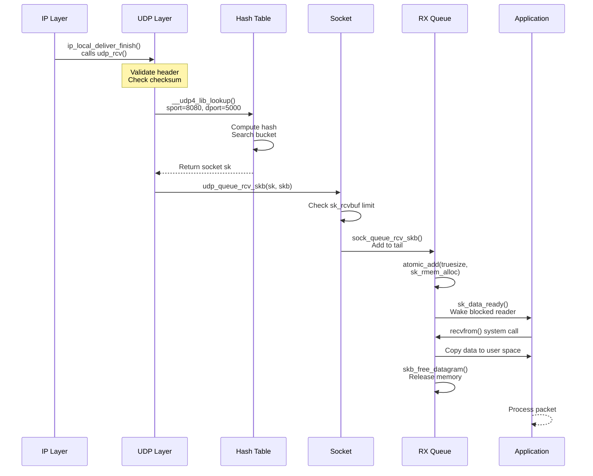

# UDP Implementation

## Overview

This chapter covers the Linux kernel's UDP implementation, focusing on the receive path from where the IP layer hands off packets to UDP through to socket delivery. We assume familiarity with the UDP protocol itself and concentrate on kernel internals: data structures, algorithms, and code flow.

The UDP receive path in Linux:

```
IP Layer (ip_local_deliver_finish)
        │
        │ ipprot->handler(skb)
        ▼
    udp_rcv() ──────────────────────┐
        │                           │
        │ __udp4_lib_rcv()           │
        ▼                           │
Socket Lookup (hash table)          │
        │                           │
        ├─ Exact match              │ UDP Layer
        ├─ Wildcard match           │ (net/ipv4/udp.c)
        ├─ Multicast/broadcast      │
        │                           │
        ▼                           │
udp_queue_rcv_skb()                 │
        │                           │
        ▼                           │
sock_queue_rcv_skb() ───────────────┘
        │
        │ Add to sk_receive_queue
        ▼
    Wake application
```

This chapter starts where [`ip.md`](ip.md) ends (IP protocol demultiplexing) and concludes where packets are queued to sockets, ready for application retrieval via socket APIs covered in [`sockets.md`](sockets.md).

## UDP Subsystem Initialization & Data Structures

### UDP Header Structure

The kernel represents the UDP header as:

```c
/* From include/uapi/linux/udp.h */
struct udphdr {
    __be16 source;      /* Source port */
    __be16 dest;        /* Destination port */
    __be16 len;         /* Length (header + data) */
    __sum16 check;      /* Checksum */
};
```

This matches the wire format exactly (8 bytes). After IP processing, `skb->data` points to this header and `skb->transport_header` stores its offset from `skb->head`.

### UDP Socket Structure

UDP extends the generic socket structure:

```c
/* From include/linux/udp.h */
struct udp_sock {
    struct inet_sock inet;      /* Base inet socket */
    
    int pending;                /* Number of pending frames */
    unsigned int corkflag;      /* Cork is required */
    
    __u8 encap_type;            /* Encapsulation type (ESP, L2TP, etc.) */
    unsigned char no_check6_tx:1,  /* Don't send UDP checksum on TX (IPv6) */
                  no_check6_rx:1,  /* Don't check UDP checksum on RX (IPv6) */
                  encap_enabled:1, /* Encapsulation enabled */
                  gro_enabled:1,   /* GRO enabled */
                  accept_udp_l4:1, /* Accept L4 (non-tunneled) UDP */
                  accept_udp_fraglist:1; /* Accept fragmented UDP packets */
    
    /* Encapsulation receive callback */
    int (*encap_rcv)(struct sock *sk, struct sk_buff *skb);
    void (*encap_destroy)(struct sock *sk);
    
    /* GRO callbacks */
    struct sk_buff * (*gro_receive)(struct sock *sk,
                                    struct list_head *head,
                                    struct sk_buff *skb);
    int (*gro_complete)(struct sock *sk, struct sk_buff *skb,
                        int nhoff);
};

/* Accessor macro */
static inline struct udp_sock *udp_sk(const struct sock *sk)
{
    return (struct udp_sock *)sk;
}
```

**Memory layout**:

```
struct udp_sock:
┌──────────────────────────────────────┐
│ struct inet_sock inet                │ ← Base (includes struct sock)
│   ├─ struct sock sk                  │
│   ├─ Source/dest ports               │
│   └─ IP addresses                    │
├──────────────────────────────────────┤
│ UDP-specific fields:                 │
│   pending, corkflag                  │
│   encap_type, flags                  │
│   encap_rcv (function pointer)       │
│   gro_receive/complete (callbacks)   │
└──────────────────────────────────────┘
```

### UDP Hash Table

UDP uses a global hash table for socket lookup:

```c
/* From include/net/udp.h */
struct udp_table {
    struct udp_hslot *hash;     /* Hash table (array of slots) */
    struct udp_hslot *hash2;    /* Secondary hash (port + address) */
    unsigned int mask;          /* Hash mask (table size - 1) */
    unsigned int log;           /* log2(table size) */
};

struct udp_hslot {
    struct hlist_head head;     /* List of sockets in this slot */
    int count;                  /* Number of sockets */
    spinlock_t lock;            /* Protects this slot */
} __attribute__((aligned(2 * sizeof(long))));
```

**Global UDP tables**:

```c
/* From net/ipv4/udp.c */
struct udp_table udp_table __read_mostly;
struct udp_table udplite_table __read_mostly;

/* Default hash table size */
#define UDP_HTABLE_SIZE_MIN     (CONFIG_BASE_SMALL ? 128 : 256)
```

The hash table is sized based on system memory:

```c
/* From net/ipv4/udp.c */
void __init udp_table_init(struct udp_table *table, const char *name)
{
    unsigned int i;
    
    /* Calculate table size based on memory */
    table->hash = alloc_large_system_hash(name,
                                          2 * sizeof(struct udp_hslot),
                                          uhash_entries,
                                          21, /* one slot per 2MB */
                                          0,
                                          &table->log,
                                          &table->mask,
                                          UDP_HTABLE_SIZE_MIN,
                                          64 * 1024);
    
    table->hash2 = table->hash + (table->mask + 1);
    
    /* Initialize each slot */
    for (i = 0; i <= table->mask; i++) {
        INIT_HLIST_HEAD(&table->hash[i].head);
        table->hash[i].count = 0;
        spin_lock_init(&table->hash[i].lock);
    }
    
    for (i = 0; i <= table->mask; i++) {
        INIT_HLIST_HEAD(&table->hash2[i].head);
        table->hash2[i].count = 0;
        spin_lock_init(&table->hash2[i].lock);
    }
}
```

**Hash table structure**:

```
udp_table.hash (primary hash: port only):
┌─────────┬─────────┬─────────┬─────────┬─────────┐
│ Slot 0  │ Slot 1  │ Slot 2  │  ...    │ Slot N  │
├─────────┼─────────┼─────────┼─────────┼─────────┤
│ lock    │ lock    │ lock    │         │ lock    │
│ count   │ count   │ count   │         │ count   │
│ head ───┼>head ───┼>head    │         │ head    │
└─────────┴────|────┴─────────┴─────────┴─────────┘
               │
               ▼
          Socket list (hlist_head)
          ┌─────────┐    ┌─────────┐
          │ sock 1  │───>│ sock 2  │
          │ port=80 │    │ port=80 │
          └─────────┘    └─────────┘

udp_table.hash2 (secondary hash: port + address):
Used for connected sockets or when primary lookup returns many results
```

The dual hash table design optimizes different scenarios:
- **hash**: Fast lookup by destination port (unconnected sockets)
- **hash2**: Exact match by port + address (connected sockets, reduces collisions)

### Protocol Handler Registration

During network stack initialization, UDP registers itself with the IP layer:

```c
/* From include/net/protocol.h */
struct net_protocol {
    int (*handler)(struct sk_buff *skb);        /* RX handler */
    int (*err_handler)(struct sk_buff *skb, u32 info);  /* ICMP error handler */
    unsigned int no_policy:1,
                 netns_ok:1,
                 /* GRO */
                 gro_receive_enabled:1;
    int (*gro_receive)(struct list_head *head, struct sk_buff *skb);
    int (*gro_complete)(struct sk_buff *skb, int nhoff);
};

/* From net/ipv4/af_inet.c */
static const struct net_protocol udp_protocol = {
    .handler        = udp_rcv,              /* Entry point for UDP packets */
    .err_handler    = udp_err,              /* ICMP error handling */
    .no_policy      = 1,
    .netns_ok       = 1,
};

static const struct net_protocol udplite_protocol = {
    .handler        = udplite_rcv,
    .err_handler    = udplite_err,
    .no_policy      = 1,
    .netns_ok       = 1,
};
```

**Registration during kernel init**:

```c
/* From net/ipv4/af_inet.c */
static int __init inet_init(void)
{
    /* ... earlier initialization ... */
    
    /* Register UDP with IP layer */
    if (inet_add_protocol(&udp_protocol, IPPROTO_UDP) < 0)
        pr_crit("%s: Cannot add UDP protocol\n", __func__);
    
    if (inet_add_protocol(&udplite_protocol, IPPROTO_UDPLITE) < 0)
        pr_crit("%s: Cannot add UDP-Lite protocol\n", __func__);
    
    /* Initialize UDP hash tables */
    udp_table_init(&udp_table, "UDP");
    udplite_table_init(&udplite_table, "UDP-Lite");
    
    /* ... */
    return 0;
}

fs_initcall(inet_init);
```

After registration, the IP layer's `inet_protos` array contains:

```c
/* From net/ipv4/protocol.c */
const struct net_protocol __rcu *inet_protos[MAX_INET_PROTOS] __read_mostly;

/* Populated by inet_add_protocol(): */
inet_protos[IPPROTO_UDP] = &udp_protocol;      /* Protocol number 17 */
inet_protos[IPPROTO_UDPLITE] = &udplite_protocol;  /* Protocol number 136 */
```

When an IP packet with protocol field = 17 arrives, the IP layer calls `udp_protocol.handler(skb)`, which is `udp_rcv()`.

### Early Demux Hook

For performance optimization, UDP registers an early demux callback:

```c
/* From include/net/protocol.h */
struct net_protocol {
    /* ... other fields ... */
    int (*early_demux)(struct sk_buff *skb);
    int (*early_demux_handler)(struct sk_buff *skb);
};

/* From net/ipv4/udp.c */
static const struct net_protocol udp_protocol = {
    /* ... */
    .early_demux        = udp_v4_early_demux,
    .early_demux_handler = udp_v4_early_demux,
};
```

The early demux runs during IP processing (before routing lookup) to cache the socket and routing information in the SKB, avoiding repeated lookups. This is covered in detail in the Performance Optimizations section.

---

This establishes the foundational data structures and initialization. The next section covers the actual receive path starting with `udp_rcv()`.

## UDP Receive Path Entry Point

### Entry from IP Layer

As shown in [`ip.md`](ip.md), after IP header processing and local delivery decision, `ip_local_deliver_finish()` delivers the packet to the transport protocol:

```c
/* From net/ipv4/ip_input.c */
static int ip_local_deliver_finish(struct net *net, struct sock *sk,
                                   struct sk_buff *skb)
{
    __skb_pull(skb, skb_network_header_len(skb));  /* Remove IP header */
    
    rcu_read_lock();
    {
        const struct net_protocol *ipprot;
        int protocol = ip_hdr(skb)->protocol;
        
resubmit:
        /* Look up protocol handler */
        ipprot = rcu_dereference(inet_protos[protocol]);
        if (ipprot) {
            /* For UDP, this calls udp_rcv() */
            ret = ipprot->handler(skb);
            /* ... */
        }
    }
    rcu_read_unlock();
    
    return 0;
}
```

At this point:
- `skb->data` points to the UDP header (IP header removed)
- `skb->len` is UDP header + payload length
- IP header still accessible via `ip_hdr(skb)` using `skb->network_header` offset
- Netfilter hooks (if any) have already run

### `udp_rcv()` Implementation

The UDP receive entry point:

```c
/* From net/ipv4/udp.c */
int udp_rcv(struct sk_buff *skb)
{
    return __udp4_lib_rcv(skb, &udp_table, IPPROTO_UDP);
}

int __must_check __udp4_lib_rcv(struct sk_buff *skb, struct udp_table *udptable,
                                 int proto)
{
    struct sock *sk;
    struct udphdr *uh;
    unsigned short ulen;
    struct rtable *rt = skb_rtable(skb);
    __be32 saddr, daddr;
    struct net *net = dev_net(skb->dev);
    bool refcounted;
    
    /* ==================== STEP 1: Header Validation ==================== */
    
    /* Ensure UDP header is present and in linear part of skb */
    if (!pskb_may_pull(skb, sizeof(struct udphdr)))
        goto drop;
    
    uh = udp_hdr(skb);
    
    /* Extract UDP length field */
    ulen = ntohs(uh->len);
    
    /* Validate length field */
    if (ulen > skb->len)
        goto short_packet;
    
    if (proto == IPPROTO_UDP) {
        /* For UDP, length must include header (8 bytes minimum) */
        if (ulen < sizeof(*uh))
            goto short_packet;
    }
    
    /* UDP length might be less than skb->len due to IP/link padding */
    if (ulen < skb->len) {
        if (pskb_trim_rcsum(skb, ulen))
            goto drop;
        uh = udp_hdr(skb);  /* May have changed after trim */
    }
    
    /* ==================== STEP 2: Checksum Validation ==================== */
    
    /* Check if hardware already verified checksum */
    if (skb->ip_summed == CHECKSUM_COMPLETE) {
        /* Hardware computed full checksum */
        if (!csum_tcpudp_magic(ip_hdr(skb)->saddr, ip_hdr(skb)->daddr,
                               ulen, IPPROTO_UDP, skb->csum))
            skb->ip_summed = CHECKSUM_UNNECESSARY;
    }
    
    if (skb->ip_summed != CHECKSUM_UNNECESSARY) {
        /* Need to verify checksum in software */
        if (uh->check == 0) {
            /* Zero checksum - special case */
            if (proto == IPPROTO_UDP) {
                /* UDP allows zero checksum (means no checksum) */
                skb->ip_summed = CHECKSUM_UNNECESSARY;
            } else {
                /* UDP-Lite requires checksum */
                goto csum_error;
            }
        } else {
            /* Compute and verify checksum */
            if (udp_lib_checksum_complete(skb))
                goto csum_error;
        }
    }
    
    /* ==================== STEP 3: Extract Addresses ==================== */
    
    saddr = ip_hdr(skb)->saddr;  /* Source IP */
    daddr = ip_hdr(skb)->daddr;  /* Destination IP */
    
    /* ==================== STEP 4: Encapsulation Check ==================== */
    
    /* Check if this is an encapsulated packet (ESP, L2TP, VXLAN, etc.) */
    if (udp_encap_needed()) {
        /* Try encapsulation receive path first */
        int ret = udp_gro_receive(/* ... */);
        if (ret > 0) {
            /* Encapsulation handler consumed packet */
            return 0;
        }
    }
    
    /* ==================== STEP 5: Socket Lookup ==================== */
    
    sk = __udp4_lib_lookup_skb(skb, uh->source, uh->dest, udptable);
    if (sk) {
        int ret;
        
        /* Found matching socket */
        if (inet_get_convert_csum(sk) && uh->check && !IS_UDPLITE(sk))
            skb_checksum_try_convert(skb, IPPROTO_UDP, uh->check,
                                    inet_compute_pseudo);
        
        /* Deliver to socket */
        ret = udp_queue_rcv_skb(sk, skb);
        
        /* Release socket reference */
        sock_put(sk);
        
        /* ret > 0 means packet consumed successfully */
        if (ret > 0)
            return 0;
        
        /* ret == 0 means packet consumed (but maybe dropped due to queue full) */
        return 0;
    }
    
    /* ==================== STEP 6: No Socket Found ==================== */
    
    /* Check if multicast/broadcast */
    if (!xfrm4_policy_check(NULL, XFRM_POLICY_IN, skb))
        goto drop;
    nf_reset_ct(skb);
    
    /* Check for broadcast/multicast delivery */
    if (rt->rt_flags & (RTCF_BROADCAST | RTCF_MULTICAST))
        return __udp4_lib_mcast_deliver(net, skb, uh,
                                        saddr, daddr, udptable, proto);
    
    /* No socket listening on this port */
    
    /* Don't send ICMP errors for broadcast/multicast */
    if (skb->pkt_type == PACKET_BROADCAST ||
        skb->pkt_type == PACKET_MULTICAST)
        goto drop;
    
    /* Send ICMP Port Unreachable */
    icmp_send(skb, ICMP_DEST_UNREACH, ICMP_PORT_UNREACH, 0);
    
    /* ==================== Drop Path ==================== */
drop:
    __UDP_INC_STATS(net, UDP_MIB_INERRORS, proto == IPPROTO_UDPLITE);
    kfree_skb(skb);
    return 0;

short_packet:
    net_dbg_ratelimited("UDP%s: short packet: From %pI4:%u %d/%d to %pI4:%u\n",
                       proto == IPPROTO_UDPLITE ? "-Lite" : "",
                       &saddr, ntohs(uh->source),
                       ulen, skb->len,
                       &daddr, ntohs(uh->dest));
    goto drop;

csum_error:
    __UDP_INC_STATS(net, UDP_MIB_CSUMERRORS, proto == IPPROTO_UDPLITE);
    net_dbg_ratelimited("UDP%s: bad checksum. From %pI4:%u to %pI4:%u ulen %d\n",
                       proto == IPPROTO_UDPLITE ? "-Lite" : "",
                       &saddr, ntohs(uh->source),
                       &daddr, ntohs(uh->dest),
                       ulen);
    __UDP_INC_STATS(net, UDP_MIB_INERRORS, proto == IPPROTO_UDPLITE);
    goto drop;
}
```

### Checksum Validation Details

UDP checksum validation is critical for data integrity:

```c
/* From net/ipv4/udp.c */
static inline int udp_lib_checksum_complete(struct sk_buff *skb)
{
    /* Compute UDP checksum using pseudo-header + UDP header + data */
    return !skb_csum_unnecessary(skb) &&
           __skb_checksum_complete(skb);
}

/* UDP pseudo-header for checksum (per RFC 768): */
/*
 *   0      7 8     15 16    23 24    31
 *  +--------+--------+--------+--------+
 *  |          Source Address           |
 *  +--------+--------+--------+--------+
 *  |        Destination Address        |
 *  +--------+--------+--------+--------+
 *  |  zero  |Protocol|   UDP Length    |
 *  +--------+--------+--------+--------+
 */
```

**Checksum computation**:

```c
/* From include/net/checksum.h */
static inline __sum16 csum_tcpudp_magic(__be32 saddr, __be32 daddr,
                                        __u32 len, __u8 proto,
                                        __wsum csum)
{
    return csum_fold(csum_tcpudp_nofold(saddr, daddr, len, proto, csum));
}
```

On x86-64, this uses optimized assembly:

```c
/* From arch/x86/include/asm/checksum_64.h */
static inline __wsum csum_tcpudp_nofold(__be32 saddr, __be32 daddr,
                                        __u32 len, __u8 proto,
                                        __wsum sum)
{
    asm("addl %1, %0\n"
        "adcl %2, %0\n"
        "adcl %3, %0\n"
        "adcl $0, %0\n"
        : "=r" (sum)
        : "g" (daddr), "g" (saddr),
          "g" ((len + proto) << 8), "0" (sum));
    return sum;
}
```

**Hardware checksum offload**:

Modern NICs compute checksums in hardware:

```c
/* Set by NIC driver if hardware verified checksum */
skb->ip_summed = CHECKSUM_UNNECESSARY;

/* Or if hardware computed full packet checksum */
skb->ip_summed = CHECKSUM_COMPLETE;
skb->csum = <hardware checksum>;
```

This avoids software checksum computation, saving CPU cycles. See [`nics.md`](nics.md) for details on NIC checksum offload.

### Statistics Updates

UDP maintains detailed statistics:

```c
/* From include/uapi/linux/snmp.h */
enum {
    UDP_MIB_INDATAGRAMS,        /* Datagrams received */
    UDP_MIB_NOPORTS,            /* Datagrams to unknown port */
    UDP_MIB_INERRORS,           /* Errors on receive */
    UDP_MIB_OUTDATAGRAMS,       /* Datagrams sent */
    UDP_MIB_RCVBUFERRORS,       /* Receive buffer errors */
    UDP_MIB_SNDBUFERRORS,       /* Send buffer errors */
    UDP_MIB_CSUMERRORS,         /* Checksum errors */
    UDP_MIB_IGNOREDMULTI,       /* Ignored multicast packets */
    __UDP_MIB_MAX
};

/* Update statistics */
#define __UDP_INC_STATS(net, field, is_udplite) \
    __SNMP_INC_STATS((net)->mib.udp_stats_in_kernel, field)
```

Viewable via `/proc/net/snmp`:

```bash
$ cat /proc/net/snmp | grep Udp:
Udp: InDatagrams NoPorts InErrors OutDatagrams RcvbufErrors SndbufErrors
Udp: 1234567 123 45 2345678 12 0
```

---

This covers the entry point and initial validation. The next section dives deep into the socket lookup mechanism, which is the most complex part of UDP receive processing.

## Socket Lookup: Hash Tables and Matching

Socket lookup is the core of UDP receive processing. Given a packet with source/destination IP addresses and ports, the kernel must efficiently find the matching socket(s).

### Lookup Overview

The lookup process:

```
1. Extract 4-tuple from packet:
   - Source IP (saddr)
   - Source port (sport) 
   - Destination IP (daddr)
   - Destination port (dport)

2. Compute hash based on dport (and optionally daddr)

3. Search hash bucket for matching socket

4. Match criteria (in order of specificity):
   - Exact match: all 4 fields match (connected socket)
   - Wildcard remote: daddr+dport match, remote=ANY (unconnected socket)
   - Wildcard local addr: dport matches, laddr=INADDR_ANY
   - Multiple matches: use scoring to select best

5. Return socket or NULL
```

### Primary Lookup Function

```c
/* From net/ipv4/udp.c */
struct sock *__udp4_lib_lookup_skb(struct sk_buff *skb,
                                   __be16 sport, __be16 dport,
                                   struct udp_table *udptable)
{
    const struct iphdr *iph = ip_hdr(skb);
    
    return __udp4_lib_lookup(dev_net(skb->dev), iph->saddr, sport,
                            iph->daddr, dport, inet_iif(skb),
                            inet_sdif(skb), udptable, skb);
}

struct sock *__udp4_lib_lookup(struct net *net, __be32 saddr, __be16 sport,
                               __be32 daddr, __be16 dport, int dif, int sdif,
                               struct udp_table *udptable, struct sk_buff *skb)
{
    struct sock *result = NULL;
    unsigned short hnum = ntohs(dport);
    unsigned int hash2, slot2;
    struct udp_hslot *hslot2, *hslot;
    int score, badness;
    
    /* ==================== STEP 1: Try Secondary Hash (Exact Match) ==================== */
    
    /* Secondary hash includes both port and address */
    hash2 = ipv4_portaddr_hash(net, daddr, hnum);
    slot2 = hash2 & udptable->mask;
    hslot2 = &udptable->hash2[slot2];
    
    /* Try exact match first (connected sockets) */
    result = udp4_lib_lookup2(net, saddr, sport,
                              daddr, hnum, dif, sdif,
                              hslot2, skb);
    if (result)
        return result;
    
    /* ==================== STEP 2: Try Primary Hash (Port Only) ==================== */
    
    /* Primary hash based on port only */
    hash2 = ipv4_portaddr_hash(net, htonl(INADDR_ANY), hnum);
    slot2 = hash2 & udptable->mask;
    hslot2 = &udptable->hash2[slot2];
    
    /* Look for sockets bound to INADDR_ANY */
    result = udp4_lib_lookup2(net, saddr, sport,
                              htonl(INADDR_ANY), hnum, dif, sdif,
                              hslot2, skb);
    if (result)
        return result;
    
    /* ==================== STEP 3: Fallback to Primary Hash Table ==================== */
    
    /* Use old hash table (port-only hash) as fallback */
    hash2 = udp_hashfn(net, hnum, udptable->mask);
    hslot = &udptable->hash[hash2];
    
    /* Scan bucket for matching socket */
    result = udp4_lib_lookup2(net, saddr, sport,
                              daddr, hnum, dif, sdif,
                              hslot, skb);
    return result;
}
```

### Hash Function

The hash function distributes sockets across buckets:

```c
/* From include/net/udp.h */
static inline u32 udp_hashfn(struct net *net, u32 num, u32 mask)
{
    return (num + net_hash_mix(net)) & mask;
}

/* For secondary hash (port + address) */
static inline u32 ipv4_portaddr_hash(const struct net *net,
                                     __be32 daddr,
                                     unsigned int num)
{
    return jhash_1word((__force u32)daddr, net_hash_mix(net) ^ num);
}
```

**Jenkins hash** (`jhash_1word`) provides good distribution:

```c
/* From include/linux/jhash.h */
static inline u32 jhash_1word(u32 a, u32 initval)
{
    /* Mix and rotate bits for good distribution */
    a += initval;
    a += JHASH_GOLDEN_RATIO;
    __jhash_final(a, 0, 0);
    return c;
}
```

Network namespace mixing (`net_hash_mix`) ensures different namespaces don't interfere with each other's hash buckets.

### Bucket Search with Scoring

Within a hash bucket, multiple sockets might match. The kernel uses a scoring system:

```c
/* From net/ipv4/udp.c */
static struct sock *udp4_lib_lookup2(struct net *net,
                                     __be32 saddr, __be16 sport,
                                     __be32 daddr, unsigned int hnum,
                                     int dif, int sdif,
                                     struct udp_hslot *hslot2,
                                     struct sk_buff *skb)
{
    struct sock *sk, *result = NULL;
    int score, badness = 0;
    
    /* Acquire RCU read lock for lock-free iteration */
    rcu_read_lock();
    
    /* Iterate all sockets in this hash slot */
    sk_for_each_rcu(sk, &hslot2->head) {
        /* Compute match score for this socket */
        score = compute_score(sk, net, saddr, sport,
                             daddr, hnum, dif, sdif);
        
        if (score > badness) {
            /* Better match than previous best */
            
            /* Check if we need to take a reference */
            if (IS_ENABLED(CONFIG_SOCK_RX_QUEUE_MAPPING) &&
                sk->sk_rx_queue_mapping != skb->queue_mapping)
                continue;  /* RFS: skip if wrong CPU */
            
            /* Try to get socket reference */
            if (unlikely(!refcount_inc_not_zero(&sk->sk_refcnt)))
                continue;  /* Socket being destroyed */
            
            /* This is our new best match */
            if (result)
                sock_put(result);  /* Release previous best */
            
            result = sk;
            badness = score;
            
            /* Perfect score? Stop searching */
            if (score == SCORE_MAX)
                break;
        }
    }
    
    rcu_read_unlock();
    return result;
}
```

### Socket Matching Score

The scoring function determines how well a socket matches the packet:

```c
/* From net/ipv4/udp.c */
static int compute_score(struct sock *sk, struct net *net,
                        __be32 saddr, __be16 sport,
                        __be32 daddr, unsigned short hnum,
                        int dif, int sdif)
{
    int score;
    struct inet_sock *inet;
    bool dev_match;
    
    /* Wrong network namespace? No match */
    if (!net_eq(sock_net(sk), net))
        return -1;
    
    /* Port must match */
    if (udp_sk(sk)->udp_port_hash != hnum)
        return -1;
    
    score = (sk->sk_family == PF_INET) ? 2 : 1;
    
    inet = inet_sk(sk);
    
    /* Check destination address (local address of socket) */
    if (inet->inet_rcv_saddr) {
        /* Socket bound to specific address */
        if (inet->inet_rcv_saddr != daddr)
            return -1;  /* No match */
        score += 4;  /* Exact local address match */
    }
    
    /* Check source address (remote address of socket) */
    if (inet->inet_daddr) {
        /* Socket connected to specific remote address */
        if (inet->inet_daddr != saddr)
            return -1;  /* No match */
        score += 4;  /* Exact remote address match */
    }
    
    /* Check source port (remote port of socket) */
    if (inet->inet_dport) {
        /* Socket connected to specific remote port */
        if (inet->inet_dport != sport)
            return -1;  /* No match */
        score += 4;  /* Exact remote port match */
    }
    
    /* Check device binding (SO_BINDTODEVICE) */
    dev_match = udp_sk_bound_dev_eq(net, sk->sk_bound_dev_if, dif, sdif);
    if (!dev_match)
        return -1;  /* Wrong interface */
    
    if (sk->sk_bound_dev_if)
        score += 4;  /* Bound to specific interface */
    
    /* Check if socket can receive on this CPU (RFS optimization) */
    if (sk->sk_incoming_cpu == raw_smp_processor_id())
        score++;
    
    return score;
}

/* Maximum possible score */
#define SCORE_MAX (2 + 4 + 4 + 4 + 4 + 1)  /* = 19 */
```

**Score breakdown**:
- Base score: 2 points (IPv4 socket)
- Local address match: +4 points
- Remote address match: +4 points
- Remote port match: +4 points
- Device binding match: +4 points
- CPU affinity: +1 point

**Examples**:

1. **Connected socket** (most specific):
   ```
   Socket: 192.168.1.10:5000 <-> 10.0.0.5:8080 on eth0
   Packet: from 10.0.0.5:8080 to 192.168.1.10:5000
   Score: 2 + 4 + 4 + 4 + 4 = 18 (near perfect match)
   ```

2. **Unconnected socket bound to specific address**:
   ```
   Socket: 192.168.1.10:5000 (no remote address)
   Packet: from 10.0.0.5:8080 to 192.168.1.10:5000
   Score: 2 + 4 = 6
   ```

3. **Wildcard socket** (INADDR_ANY):
   ```
   Socket: 0.0.0.0:5000 (accepts from any address/port)
   Packet: from 10.0.0.5:8080 to 192.168.1.10:5000
   Score: 2 (base only)
   ```

If multiple sockets match, the one with the highest score wins.

### Hash Bucket Structure and Locking

Each hash bucket is protected independently:

```c
/* From include/net/udp.h */
struct udp_hslot {
    struct hlist_head head;     /* Linked list of sockets */
    int count;                  /* Number of sockets in this slot */
    spinlock_t lock;            /* Protects this slot during modifications */
} __attribute__((aligned(2 * sizeof(long))));
```

**Locking strategy**:

- **Read path (lookup)**: RCU read lock only, no spinlock
  - `rcu_read_lock()` / `rcu_read_unlock()`
  - Lock-free iteration using `sk_for_each_rcu()`
  - Very fast, scales well with multiple CPUs
  
- **Write path (bind/close)**: Spinlock
  - `spin_lock_bh(&hslot->lock)` / `spin_unlock_bh(&hslot->lock)`
  - Disables softirqs to prevent deadlock
  - Only needed when adding/removing sockets from hash

**RCU iteration**:

```c
/* From include/net/sock.h */
#define sk_for_each_rcu(sk, list) \
    hlist_for_each_entry_rcu(sk, list, sk_node)

/* Example iteration (lock-free on read): */
rcu_read_lock();
sk_for_each_rcu(sk, &hslot->head) {
    /* Access socket fields safely */
    /* Socket cannot be freed during RCU read section */
}
rcu_read_unlock();
```

This RCU-based approach allows concurrent lookups without lock contention, critical for high packet rates.

### Connected vs Unconnected Sockets

**Unconnected socket**:
```c
/* Application code: */
socket(AF_INET, SOCK_DGRAM, 0);
bind(fd, {.sin_addr = INADDR_ANY, .sin_port = 5000}, ...);

/* Kernel state: */
inet->inet_rcv_saddr = INADDR_ANY;  /* Local: any address */
inet->inet_num = 5000;               /* Local: port 5000 */
inet->inet_daddr = 0;                /* Remote: not connected */
inet->inet_dport = 0;                /* Remote: not connected */

/* Hash: port-only (primary hash table) */
/* Receives packets from ANY remote address/port to port 5000 */
```

**Connected socket**:
```c
/* Application code: */
socket(AF_INET, SOCK_DGRAM, 0);
bind(fd, {.sin_addr = 192.168.1.10, .sin_port = 5000}, ...);
connect(fd, {.sin_addr = 10.0.0.5, .sin_port = 8080}, ...);

/* Kernel state: */
inet->inet_rcv_saddr = 192.168.1.10; /* Local: specific address */
inet->inet_num = 5000;                /* Local: port 5000 */
inet->inet_daddr = 10.0.0.5;          /* Remote: connected to this */
inet->inet_dport = 8080;              /* Remote: connected to this */

/* Hash: port+address (secondary hash table) */
/* Only receives packets from 10.0.0.5:8080 to 192.168.1.10:5000 */
```

Connected UDP sockets are faster to lookup (secondary hash, higher score) and benefit from early demux caching.

### SO_REUSEADDR and SO_REUSEPORT

Multiple sockets can bind to the same port:

```c
/* SO_REUSEADDR: allows binding to same port if addresses differ */
setsockopt(fd, SOL_SOCKET, SO_REUSEADDR, &one, sizeof(one));

/* SO_REUSEPORT: load balancing across multiple sockets on same port */
setsockopt(fd, SOL_SOCKET, SO_REUSEPORT, &one, sizeof(one));
```

**Hash table with multiple sockets on same port**:

```
Hash bucket for port 5000:
┌─────────────────────────────────────────────────┐
│ Socket 1: 192.168.1.10:5000 (score=6)          │
├─────────────────────────────────────────────────┤
│ Socket 2: 192.168.1.20:5000 (score=6)          │
├─────────────────────────────────────────────────┤
│ Socket 3: 0.0.0.0:5000      (score=2)          │ ← Wildcard, lowest score
└─────────────────────────────────────────────────┘

Packet to 192.168.1.10:5000 → Socket 1 (highest score)
Packet to 192.168.1.20:5000 → Socket 2 (highest score)
Packet to 192.168.1.30:5000 → Socket 3 (wildcard catches rest)
```

**SO_REUSEPORT with load balancing**:

```c
/* When SO_REUSEPORT is set, kernel uses hash-based selection: */
selected_sk = reuseport_select_sock(sk, skb, /* ... */);

/* Hash on 4-tuple to distribute load */
hash = jhash_3words(saddr, daddr, (sport << 16) | dport, /* ... */);
index = hash % num_sockets_in_group;
```

This distributes packets across multiple worker threads for scalability.

---

This completes the core socket lookup mechanism. The next sections will cover special cases like multicast/broadcast, encapsulation, and the final steps of queuing packets to sockets.

## Multicast and Broadcast Handling

When a UDP packet is destined for a broadcast or multicast address, it may need to be delivered to multiple sockets. The kernel handles this by cloning the packet and delivering copies to each matching socket.

### Broadcast and Multicast Detection

In `__udp4_lib_rcv()`, after the unicast socket lookup fails:

```c
/* From net/ipv4/udp.c */
int __udp4_lib_rcv(struct sk_buff *skb, struct udp_table *udptable, int proto)
{
    /* ... unicast lookup failed ... */
    
    /* Get routing information */
    struct rtable *rt = skb_rtable(skb);
    
    /* Check if broadcast or multicast */
    if (rt->rt_flags & (RTCF_BROADCAST | RTCF_MULTICAST))
        return __udp4_lib_mcast_deliver(net, skb, uh,
                                        saddr, daddr, udptable, proto);
    
    /* Not multicast/broadcast and no socket found */
    /* Send ICMP Port Unreachable ... */
}
```

The routing table entry (`struct rtable`) contains flags indicating if the destination is broadcast or multicast:
- `RTCF_BROADCAST`: Limited broadcast (255.255.255.255) or subnet broadcast
- `RTCF_MULTICAST`: IP multicast address (224.0.0.0/4)

### Multicast Delivery Implementation

```c
/* From net/ipv4/udp.c */
static int __udp4_lib_mcast_deliver(struct net *net, struct sk_buff *skb,
                                    struct udphdr *uh,
                                    __be32 saddr, __be32 daddr,
                                    struct udp_table *udptable,
                                    int proto)
{
    struct sock *sk, *first = NULL;
    unsigned short hnum = ntohs(uh->dest);
    struct udp_hslot *hslot = udp_hashslot(udptable, net, hnum);
    unsigned int hash2 = 0, hash2_any = 0, use_hash2 = (hslot->count > 10);
    unsigned int offset = offsetof(typeof(*sk), sk_node);
    int dif = skb->dev->ifindex;
    int sdif = inet_sdif(skb);
    struct hlist_node *node;
    struct sk_buff *nskb;
    
    /* Use secondary hash if primary bucket too large */
    if (use_hash2) {
        hash2_any = ipv4_portaddr_hash(net, htonl(INADDR_ANY), hnum) &
                    udptable->mask;
        hash2 = ipv4_portaddr_hash(net, daddr, hnum) & udptable->mask;
start_lookup:
        hslot = &udptable->hash2[hash2];
        offset = offsetof(typeof(*sk), __sk_common.skc_portaddr_node);
    }
    
    /* Iterate all sockets in hash slot */
    sk_for_each_entry_offset_rcu(sk, node, &hslot->head, offset) {
        /* Check if socket matches this multicast/broadcast packet */
        if (!__udp_is_mcast_sock(net, sk, uh->dest, daddr,
                                 uh->source, saddr, dif, sdif, hnum))
            continue;
        
        /* Socket matches */
        
        if (!first) {
            /* First matching socket - no cloning yet */
            first = sk;
            continue;
        }
        
        /* Clone packet for this socket */
        nskb = skb_clone(skb, GFP_ATOMIC);
        
        if (unlikely(!nskb)) {
            atomic_inc(&sk->sk_drops);
            __UDP_INC_STATS(net, UDP_MIB_RCVBUFERRORS, IS_UDPLITE(sk));
            __UDP_INC_STATS(net, UDP_MIB_INERRORS, IS_UDPLITE(sk));
            continue;  /* Skip this socket on clone failure */
        }
        
        /* Deliver cloned packet to this socket */
        if (udp_queue_rcv_skb(sk, nskb) > 0)
            consume_skb(nskb);
    }
    
    /* Use secondary hash with wildcard if needed */
    if (use_hash2 && hash2 != hash2_any) {
        hash2 = hash2_any;
        goto start_lookup;
    }
    
    /* Deliver original packet to first matching socket */
    if (first) {
        if (udp_queue_rcv_skb(first, skb) > 0)
            consume_skb(skb);
    } else {
        /* No matching sockets */
        consume_skb(skb);
        __UDP_INC_STATS(net, UDP_MIB_IGNOREDMULTI, proto == IPPROTO_UDPLITE);
    }
    
    return 0;
}
```

### Socket Matching for Multicast

The matching function checks group membership and socket options:

```c
/* From net/ipv4/udp.c */
static int __udp_is_mcast_sock(struct net *net, struct sock *sk,
                               __be16 loc_port, __be32 loc_addr,
                               __be16 rmt_port, __be32 rmt_addr,
                               int dif, int sdif, unsigned short hnum)
{
    struct inet_sock *inet = inet_sk(sk);
    
    /* Basic checks */
    if (!net_eq(sock_net(sk), net) ||
        udp_sk(sk)->udp_port_hash != hnum ||
        (inet->inet_daddr && inet->inet_daddr != rmt_addr) ||
        (inet->inet_dport != rmt_port && inet->inet_dport) ||
        (inet->inet_rcv_saddr && inet->inet_rcv_saddr != loc_addr) ||
        ipv6_only_sock(sk))
        return 0;
    
    /* Check device binding */
    if (!udp_sk_bound_dev_eq(net, sk->sk_bound_dev_if, dif, sdif))
        return 0;
    
    /* Check multicast group membership */
    if (!ip_mc_sf_allow(sk, loc_addr, rmt_addr, dif, sdif))
        return 0;
    
    return 1;
}
```

### Multicast Group Membership

Sockets join multicast groups using `IP_ADD_MEMBERSHIP`:

```c
/* Application code: */
struct ip_mreqn mreq = {
    .imr_multiaddr = {.s_addr = inet_addr("239.1.1.1")},  /* Group */
    .imr_address = {.s_addr = INADDR_ANY},                /* Interface */
    .imr_ifindex = 0                                      /* Any interface */
};
setsockopt(fd, IPPROTO_IP, IP_ADD_MEMBERSHIP, &mreq, sizeof(mreq));
```

**Kernel tracking**:

```c
/* From include/linux/igmp.h */
struct ip_mc_socklist {
    struct ip_mc_socklist __rcu *next_rcu;
    struct ip_mreqn multi;          /* Multicast group address */
    unsigned int sfmode;            /* Source filter mode */
    struct ip_sf_socklist *sflist;  /* Source filter list */
    struct rcu_head rcu;
};

/* In struct sock: */
struct sock {
    /* ... */
    struct ip_mc_socklist __rcu *ip_mc_list;  /* Multicast groups */
    /* ... */
};
```

The kernel maintains per-socket multicast group lists and checks membership during delivery.

### SKB Cloning for Multiple Recipients

```c
/* From net/core/skbuff.c */
struct sk_buff *skb_clone(struct sk_buff *skb, gfp_t gfp_mask)
{
    struct sk_buff *n;
    
    /* Allocate new sk_buff structure */
    n = kmem_cache_alloc(skbuff_head_cache, gfp_mask);
    if (!n)
        return NULL;
    
    /* Copy sk_buff metadata (not data) */
    memcpy(n, skb, offsetof(struct sk_buff, tail));
    
    /* Share data buffers with original */
    n->cloned = 1;
    skb->cloned = 1;
    
    /* Increment data buffer refcount */
    atomic_inc(&skb_shinfo(skb)->dataref);
    
    /* Each clone gets its own destructor, cb[], etc. */
    n->destructor = NULL;
    
    return n;
}
```

**Clone vs Copy**:
- **Clone**: New `sk_buff` header, **shared** data buffers (fast, cheap)
- **Copy**: New `sk_buff` header, **new** data buffers (slow, expensive)

For multicast, cloning is sufficient because:
- Each socket gets its own `sk_buff` for metadata
- Data is read-only (sockets only read packet contents)
- Much faster than copying packet data

**Memory diagram**:

```
Original SKB:                   Cloned SKB:
┌──────────────┐               ┌──────────────┐
│ sk_buff      │               │ sk_buff      │
│ metadata     │               │ metadata     │
└──────┬───────┘               └──────┬───────┘
       │                              │
       └──────────┬───────────────────┘
                  ▼
           ┌─────────────┐
           │ Shared data │ ← refcount = 2
           │ (packet)    │
           └─────────────┘
```

### Broadcast Handling

Broadcast packets follow the same multicast delivery path but have simpler membership checks (no group membership required):

```c
/* Broadcast types: */
1. Limited broadcast: 255.255.255.255
   - Never forwarded by routers
   - Delivered to all interfaces
   
2. Subnet-directed broadcast: 192.168.1.255 (for 192.168.1.0/24)
   - Subnet-specific
   - May be forwarded by routers (if configured)
   
3. All-subnets-directed broadcast: 10.255.255.255 (for 10.0.0.0/8)
   - Classful network broadcast
   - Legacy, rarely used
```

Sockets receive broadcasts if:
- Bound to the destination port
- `SO_BROADCAST` option is set (required to send broadcasts, not receive)
- Not filtered by firewall rules

### Performance Implications

**Multicast/broadcast overhead**:

```
Unicast packet:
  1 packet in → 1 socket lookup → 1 packet queued
  Cost: O(1)

Multicast to N sockets:
  1 packet in → 1 hash lookup → N socket matches
  → (N-1) skb_clone operations
  → N packet queued
  Cost: O(N)
```

For large N, this can be expensive:
- Memory allocation for clones
- Multiple queue operations
- Potential for queue overflow on all sockets

**Optimization strategies**:

1. **Hash2 usage** (when `hslot->count > 10`): Reduces iteration
2. **RCU iteration**: Lock-free, allows concurrent processing
3. **Atomic drops**: Track dropped clones for monitoring

**When multicast/broadcast becomes problematic**:
- Many sockets on same multicast group (100s)
- High packet rate
- Each clone consumes memory and CPU
- Solutions: Use SO_REUSEPORT for load balancing, or handle at application level

### IGMP Protocol Integration

The kernel tracks multicast group membership via IGMP (Internet Group Management Protocol):

```c
/* From include/linux/igmp.h */
struct ip_mc_list {
    struct in_device *interface;    /* Interface for this group */
    __be32 multiaddr;               /* Multicast group address */
    unsigned int users;             /* Number of users */
    unsigned char tm_running;       /* Timer running */
    unsigned char reporter;         /* Are we the reporter */
    unsigned char unsolicit_count;  /* Unsolicited reports to send */
    struct timer_list timer;        /* Group-specific timer */
    /* ... */
};
```

When a socket joins a multicast group, the kernel sends IGMP membership reports to routers, enabling multicast routing. This is handled by `ip_mc_join_group()` and related functions in `net/ipv4/igmp.c`.

---

This covers multicast and broadcast delivery. Next, we'll examine UDP encapsulation for tunneling protocols.

## UDP Encapsulation

UDP encapsulation allows other protocols to be tunneled inside UDP packets. This is widely used for VPNs, tunneling, and NAT traversal.

### Encapsulation Overview

Common UDP encapsulation protocols:

1. **ESP in UDP (RFC 3948)**: IPsec NAT traversal
   - UDP port 4500
   - Encapsulates encrypted ESP packets

2. **L2TP (Layer 2 Tunneling Protocol)**:
   - UDP port 1701
   - Tunnels PPP frames

3. **VXLAN (Virtual Extensible LAN)**:
   - UDP port 4789
   - Network virtualization overlay

4. **GUE (Generic UDP Encapsulation)**:
   - Flexible encapsulation framework
   - Variable protocol support

5. **FOU (Foo-over-UDP)**:
   - Simple IP-in-UDP tunneling
   - Minimal overhead

### Encapsulation Receive Hook

UDP sockets can register encapsulation handlers:

```c
/* From include/linux/udp.h */
struct udp_sock {
    /* ... */
    __u8 encap_type;    /* Encapsulation type */
    
    /* Encapsulation receive callback */
    int (*encap_rcv)(struct sock *sk, struct sk_buff *skb);
    
    /* Cleanup on socket close */
    void (*encap_destroy)(struct sock *sk);
    /* ... */
};

/* Encapsulation types */
enum {
    UDP_ENCAP_ESPINUDP_NON_IKE = 1,  /* IKE not used */
    UDP_ENCAP_ESPINUDP,              /* IKE used */
    UDP_ENCAP_L2TPINUDP,             /* L2TP */
    UDP_ENCAP_GUE,                   /* Generic UDP Encapsulation */
    UDP_ENCAP_RXRPC,                 /* RxRPC */
};
```

### Setting Up Encapsulation

Application or kernel module sets encapsulation on a socket:

```c
/* From net/ipv4/udp.c */
int udp_lib_setsockopt(struct sock *sk, int level, int optname,
                       sockptr_t optval, unsigned int optlen)
{
    struct udp_sock *up = udp_sk(sk);
    int val, err = 0;
    
    switch (optname) {
    case UDP_ENCAP:
        if (optlen < sizeof(int))
            return -EINVAL;
        if (copy_from_sockptr(&val, optval, sizeof(val)))
            return -EFAULT;
        
        switch (val) {
        case 0:
            /* Disable encapsulation */
            up->encap_rcv = NULL;
            up->encap_type = 0;
            break;
            
        case UDP_ENCAP_ESPINUDP:
        case UDP_ENCAP_ESPINUDP_NON_IKE:
            /* Enable ESP in UDP */
            up->encap_rcv = xfrm4_udp_encap_rcv;
            up->encap_type = val;
            up->encap_enabled = 1;
            break;
            
        case UDP_ENCAP_L2TPINUDP:
            /* L2TP module must set callback */
            up->encap_type = val;
            up->encap_enabled = 1;
            break;
            
        case UDP_ENCAP_GUE:
            /* GUE callback set by GUE module */
            up->encap_type = val;
            up->encap_enabled = 1;
            break;
            
        default:
            err = -ENOPROTOOPT;
            break;
        }
        break;
    /* ... */
    }
    return err;
}
```

### Encapsulation Receive Path

In `udp_queue_rcv_skb()`, before queueing to socket:

```c
/* From net/ipv4/udp.c */
static int udp_queue_rcv_skb(struct sock *sk, struct sk_buff *skb)
{
    struct udp_sock *up = udp_sk(sk);
    int ret;
    
    /* Check for encapsulation */
    if (up->encap_enabled) {
        /* Call encapsulation receive handler */
        ret = (*up->encap_rcv)(sk, skb);
        if (ret <= 0) {
            /* Handler consumed packet (ret < 0) or error (ret == 0) */
            __UDP_INC_STATS(net, UDP_MIB_INDATAGRAMS, is_udplite);
            return -ret;
        }
        /* ret > 0: handler did not consume, continue normal processing */
    }
    
    /* Normal UDP processing continues... */
}
```

**Encapsulation handler return values**:
- `ret < 0`: Packet consumed, negate and return (success)
- `ret == 0`: Error, drop packet
- `ret > 0`: Handler didn't consume, continue normal UDP processing

### ESP in UDP Example

IPsec ESP encapsulation for NAT traversal:

```c
/* From net/xfrm/xfrm_input.c */
int xfrm4_udp_encap_rcv(struct sock *sk, struct sk_buff *skb)
{
    struct udphdr *uh;
    struct iphdr *iph;
    int udpdata_offset;
    __be32 *udpdata;
    __be32 spi;
    int err;
    
    /* UDP header already validated */
    uh = udp_hdr(skb);
    
    /* Get to encapsulated data (after UDP header) */
    udpdata_offset = sizeof(struct udphdr);
    udpdata = (__be32 *)(skb->data + udpdata_offset);
    
    /* Check ESP non-IKE marker (RFC 3948) */
    if (udpdata[0] == 0 && udpdata[1] == 0) {
        /* Non-ESP marker present, skip it */
        udpdata_offset += 2 * sizeof(__be32);
        udpdata += 2;
    }
    
    /* Extract SPI (Security Parameters Index) */
    spi = udpdata[0];
    if (spi == 0) {
        /* SPI of 0 is invalid */
        goto drop;
    }
    
    /* Remove UDP header, keep only ESP packet */
    __skb_pull(skb, udpdata_offset);
    
    /* Hand off to IPsec ESP processing */
    err = xfrm4_rcv_encap(skb, IPPROTO_ESP, spi, udp_encap_type(sk));
    
    /* Packet consumed by IPsec layer */
    return -err;
    
drop:
    kfree_skb(skb);
    return 0;
}
```

**ESP in UDP packet format**:

```
┌─────────────────────────────────────┐
│ IP Header                           │
├─────────────────────────────────────┤
│ UDP Header                          │
│   Source Port                       │
│   Dest Port = 4500                  │
│   Length, Checksum                  │
├─────────────────────────────────────┤
│ Non-ESP Marker (optional)           │
│   0x00000000 0x00000000             │
├─────────────────────────────────────┤
│ ESP Header                          │
│   SPI                               │
│   Sequence Number                   │
├─────────────────────────────────────┤
│ Encrypted Data                      │
│   ...                               │
├─────────────────────────────────────┤
│ ESP Trailer & Auth                  │
└─────────────────────────────────────┘
```

After `__skb_pull()`, the skb contains only the ESP packet, which is then processed by the IPsec subsystem.

### VXLAN Example

VXLAN encapsulates Ethernet frames in UDP:

```c
/* From drivers/net/vxlan.c */
static int vxlan_udp_encap_recv(struct sock *sk, struct sk_buff *skb)
{
    struct vxlan_sock *vs;
    struct vxlanhdr *vxh;
    __be32 vni;
    
    /* Get VXLAN socket context */
    vs = rcu_dereference_sk_user_data(sk);
    if (!vs)
        goto drop;
    
    /* Ensure we have VXLAN header */
    if (!pskb_may_pull(skb, sizeof(struct vxlanhdr)))
        goto drop;
    
    vxh = (struct vxlanhdr *)skb->data;
    
    /* Validate VXLAN header */
    if (vxh->vx_flags != htonl(VXLAN_HF_VNI))
        goto drop;
    
    /* Extract VNI (VXLAN Network Identifier) */
    vni = vxh->vx_vni;
    
    /* Remove UDP and VXLAN headers */
    __skb_pull(skb, sizeof(struct vxlanhdr));
    
    /* Reset network header to inner Ethernet frame */
    skb_reset_network_header(skb);
    skb_reset_mac_header(skb);
    
    /* Process inner Ethernet frame */
    vxlan_rcv(vs, skb, vni);
    
    return 0;  /* Packet consumed */
    
drop:
    kfree_skb(skb);
    return 0;
}
```

**VXLAN packet format**:

```
┌─────────────────────────────────────┐
│ Outer IP Header                     │
├─────────────────────────────────────┤
│ Outer UDP Header                    │
│   Dest Port = 4789                  │
├─────────────────────────────────────┤
│ VXLAN Header (8 bytes)              │
│   Flags, VNI, Reserved              │
├─────────────────────────────────────┤
│ Inner Ethernet Frame                │
│   ├─ Ethernet Header                │
│   ├─ IP Header                      │
│   └─ Payload                        │
└─────────────────────────────────────┘
```

### GUE (Generic UDP Encapsulation)

GUE provides a flexible framework for encapsulating arbitrary protocols:

```c
/* From net/ipv4/fou.c */
static int gue_udp_recv(struct sock *sk, struct sk_buff *skb)
{
    const struct guehdr *guehdr;
    u8 proto_ctype;
    
    /* Parse GUE header */
    if (!pskb_may_pull(skb, sizeof(struct guehdr)))
        goto drop;
    
    guehdr = (struct guehdr *)skb->data;
    
    /* Extract protocol type */
    proto_ctype = guehdr->proto_ctype;
    
    /* Remove GUE header */
    __skb_pull(skb, sizeof(struct guehdr) + (guehdr->hlen << 2));
    
    /* Process based on inner protocol */
    switch (proto_ctype) {
    case IPPROTO_IPIP:
        /* IP-in-UDP */
        return gue_udp_recv_ipv4(skb);
    case IPPROTO_IPV6:
        /* IPv6-in-UDP */
        return gue_udp_recv_ipv6(skb);
    /* ... other protocols ... */
    default:
        goto drop;
    }
    
drop:
    kfree_skb(skb);
    return 0;
}
```

### Encapsulation and Socket Lookup Interaction

Encapsulated packets still go through normal socket lookup. The encapsulation socket must be bound to the well-known port (e.g., 4500 for ESP, 4789 for VXLAN).

**Flow with encapsulation**:

```
1. Packet arrives: dst=4500 (ESP in UDP)
2. Socket lookup: Find socket bound to port 4500
3. Check: up->encap_enabled == 1
4. Call: up->encap_rcv(sk, skb) → xfrm4_udp_encap_rcv()
5. Handler removes UDP header, delivers to IPsec
6. IPsec decrypts, processes inner IP packet
7. Inner packet re-enters network stack
```

This allows transparent tunneling while maintaining the UDP socket abstraction.

---

This covers UDP encapsulation. Next, we'll examine how packets are queued to sockets.

## Socket Receive Queue

After socket lookup and encapsulation handling, the packet is ready to be queued to the socket's receive buffer where applications can retrieve it.

### Entry Point: `udp_queue_rcv_skb()`

```c
/* From net/ipv4/udp.c */
static int udp_queue_rcv_skb(struct sock *sk, struct sk_buff *skb)
{
    struct udp_sock *up = udp_sk(sk);
    int is_udplite = IS_UDPLITE(sk);
    
    /* ==================== STEP 1: Encapsulation Check ==================== */
    
    if (up->encap_enabled) {
        int ret;
        
        /* Try encapsulation receive */
        ret = (*up->encap_rcv)(sk, skb);
        if (ret <= 0) {
            __UDP_INC_STATS(net, UDP_MIB_INDATAGRAMS, is_udplite);
            return -ret;
        }
        /* Fall through for normal processing */
    }
    
    /* ==================== STEP 2: Early Filtering ==================== */
    
    /* Check for early packet filter (BPF) */
    if (static_branch_unlikely(&udp_encap_needed_key)) {
        if (up->encap_type) {
            int (*encap_rcv)(struct sock *sk, struct sk_buff *skb);
            
            encap_rcv = READ_ONCE(up->encap_rcv);
            if (encap_rcv) {
                int ret = encap_rcv(sk, skb);
                if (ret <= 0) {
                    __UDP_INC_STATS(net, UDP_MIB_INDATAGRAMS,
                                   is_udplite);
                    return -ret;
                }
            }
        }
    }
    
    /* ==================== STEP 3: Checksum Finalization ==================== */
    
    /* Ensure checksum is validated */
    if (inet_get_convert_csum(sk) && skb->ip_summed == CHECKSUM_UNNECESSARY)
        skb->csum_valid = 1;
    
    /* ==================== STEP 4: Receive Buffer Space Check ==================== */
    
    /* Check if socket receive buffer has space */
    if (sock_queue_rcv_skb(sk, skb) < 0) {
        __UDP_INC_STATS(net, UDP_MIB_RCVBUFERRORS, is_udplite);
        return -1;
    }
    
    /* Success */
    return 0;
}
```

### Receive Buffer Accounting

Every socket has receive buffer limits:

```c
/* From include/net/sock.h */
struct sock {
    /* ... */
    atomic_t sk_rmem_alloc;    /* Current receive buffer usage (bytes) */
    int sk_rcvbuf;             /* Receive buffer size limit (bytes) */
    /* ... */
};

/* Default and maximum values (in bytes) */
#define SK_RMEM_MAX (sysctl_rmem_max)         /* Configurable maximum */
#define SK_RCVBUF_DEF (256 * 1024)            /* Default: 256 KB */
```

Applications can adjust buffer size:

```c
/* Application code: */
int bufsize = 1024 * 1024;  /* 1 MB */
setsockopt(fd, SOL_SOCKET, SO_RCVBUF, &bufsize, sizeof(bufsize));
```

Kernel enforces limits via sysct parameters:

```bash
$ cat /proc/sys/net/core/rmem_default
212992    # Default RX buffer size

$ cat /proc/sys/net/core/rmem_max  
212992    # Maximum RX buffer size
```

### Queueing to Socket: `sock_queue_rcv_skb()`

```c
/* From net/core/sock.c */
int sock_queue_rcv_skb(struct sock *sk, struct sk_buff *skb)
{
    int err;
    
    /* ==================== STEP 1: Buffer Limit Check ==================== */
    
    /* Calculate memory needed for this packet */
    unsigned long size = skb->truesize;
    
    /* Check if adding this packet would exceed buffer limit */
    if (atomic_read(&sk->sk_rmem_alloc) + size > (unsigned int)sk->sk_rcvbuf) {
        atomic_inc(&sk->sk_drops);
        trace_sock_rcvqueue_full(sk, skb);
        return -ENOMEM;  /* Buffer full */
    }
    
    /* ==================== STEP 2: Socket Filter (BPF) ==================== */
    
    /* Run BPF filter if attached */
    err = sk_filter(sk, skb);
    if (err)
        return err;  /* Packet filtered out */
    
    /* ==================== STEP 3: Timestamp Recording ==================== */
    
    /* Record timestamp if SO_TIMESTAMP option set */
    if (sock_flag(sk, SOCK_RCVTSTAMP))
        __net_timestamp(skb);
    
    /* ==================== STEP 4: Account Memory ==================== */
    
    /* Charge socket's receive buffer */
    skb->sk = sk;
    skb->destructor = sock_rfree;  /* Will be called when skb freed */
    atomic_add(skb->truesize, &sk->sk_rmem_alloc);
    
    /* ==================== STEP 5: Add to Queue ==================== */
    
    /* Acquire queue lock */
    spin_lock(&sk->sk_receive_queue.lock);
    
    /* Add skb to tail of receive queue */
    __skb_queue_tail(&sk->sk_receive_queue, skb);
    
    spin_unlock(&sk->sk_receive_queue.lock);
    
    /* ==================== STEP 6: Wake Sleeping Readers ==================== */
    
    /* Notify waiters that data is available */
    sk->sk_data_ready(sk);
    
    return 0;
}
```

### Socket Receive Queue Structure

```c
/* From include/linux/skbuff.h */
struct sk_buff_head {
    struct sk_buff *next;       /* First skb in queue */
    struct sk_buff *prev;       /* Last skb in queue */
    __u32 qlen;                 /* Number of skbs in queue */
    spinlock_t lock;            /* Protects queue */
};

/* In struct sock: */
struct sock {
    /* ... */
    struct sk_buff_head sk_receive_queue;  /* Received packets waiting */
    /* ... */
};
```

**Queue visualization**:

```
sk->sk_receive_queue:
┌────────────────────────────────────────────┐
│ spinlock_t lock                            │
│ qlen = 3                                   │
└────┬───────────────────────────────────────┘
     │
     ▼
┌─────────┐    ┌─────────┐    ┌─────────┐
│ SKB 1   │───>│ SKB 2   │───>│ SKB 3   │
│ (oldest)│    │         │    │ (newest)│
└─────────┘    └─────────┘    └─────────┘
```

### Memory Accounting and `skb->truesize`

`skb->truesize` includes both sk_buff struct and data buffers:

```c
/* Calculate true memory cost */
skb->truesize = sizeof(struct sk_buff) + skb->data_len;

/* For packets with shared info (fragments): */
skb->truesize += sizeof(struct skb_shared_info);
skb->truesize += sum_of_all_fragment_sizes;
```

**Example**:
```
1500-byte UDP packet:
  sk_buff struct:        ~240 bytes
  Linear data:          1518 bytes (Ethernet frame)
  skb_shared_info:        ~320 bytes
  Total truesize:        ~2078 bytes

Charged to sk_rmem_alloc: 2078 bytes
```

### Destructor and Memory Release

When an skb is freed (after application reads it):

```c
/* From net/core/skbuff.c */
void kfree_skb(struct sk_buff *skb)
{
    if (!skb)
        return;
    
    /* Call destructor if present */
    if (skb->destructor) {
        skb->destructor(skb);  /* sock_rfree() for receive queue */
    }
    
    /* Free the skb */
    __kfree_skb(skb);
}

/* From net/core/sock.c */
void sock_rfree(struct sk_buff *skb)
{
    struct sock *sk = skb->sk;
    unsigned int len = skb->truesize;
    
    /* Return memory to socket's receive buffer */
    atomic_sub(len, &sk->sk_rmem_alloc);
    
    /* Wake writers if they were blocked on buffer space */
    sk_mem_reclaim(sk);
}
```

This ensures accurate accounting: memory charged on enqueue, released on dequeue.

### Waking Blocked Readers: `sk_data_ready()`

When a packet is queued, the socket's `sk_data_ready()` callback wakes waiting applications:

```c
/* From net/core/sock.c */
void sock_def_readable(struct sock *sk)
{
    struct socket_wq *wq;
    
    rcu_read_lock();
    wq = rcu_dereference(sk->sk_wq);
    
    if (skwq_has_sleeper(wq)) {
        /* Wake processes sleeping on socket */
        wake_up_interruptible_sync_poll(&wq->wait,
                                        EPOLLIN | EPOLLRDNORM | EPOLLRDBAND);
    }
    
    /* Notify async I/O */
    sk_wake_async(sk, SOCK_WAKE_WAITD, POLL_IN);
    
    rcu_read_unlock();
}
```

**What gets woken**:
1. **Blocking reads**: `recvfrom()`, `recvmsg()` waiting on this socket
2. **select/poll**: Processes waiting in `select()` or `poll()` with this fd
3. **epoll**: Epoll instances monitoring this socket for `EPOLLIN`
4. **Async I/O**: Signal-driven I/O (SIGIO)

### Buffer Overflow and Packet Drops

When `sk_rcvbuf` is full:

```c
/* From net/core/sock.c */
int sock_queue_rcv_skb(struct sock *sk, struct sk_buff *skb)
{
    /* ... */
    
    /* Buffer full check */
    if (atomic_read(&sk->sk_rmem_alloc) + skb->truesize > 
        (unsigned int)sk->sk_rcvbuf) {
        atomic_inc(&sk->sk_drops);
        trace_sock_rcvqueue_full(sk, skb);
        return -ENOMEM;
    }
    
    /* ... */
}
```

**When buffer overflows happen**:
- Application not reading fast enough
- Burst of packets exceeds buffer capacity
- Buffer size too small for workload

**Consequences**:
- Packet dropped silently (no error to sender - UDP is unreliable)
- `UDP_MIB_RCVBUFERRORS` counter incremented
- Application sees packet loss
- `sk_drops` tracks per-socket drops

**Monitoring**:
```bash
$ netstat -su | grep -i buffer
    1234 packet receive errors
    567 receive buffer errors    ← Dropped due to full buffer
```

### Control Messages (Ancillary Data)

UDP can attach metadata as control messages:

```c
/* Application receives with recvmsg(): */
struct msghdr msg = {0};
char control[1024];
msg.msg_control = control;
msg.msg_controllen = sizeof(control);

recvmsg(fd, &msg, 0);

/* Iterate control messages */
for (struct cmsghdr *cmsg = CMSG_FIRSTHDR(&msg);
     cmsg != NULL;
     cmsg = CMSG_NXTHDR(&msg, cmsg)) {
    
    if (cmsg->cmsg_level == SOL_SOCKET && cmsg->cmsg_type == SO_TIMESTAMP) {
        struct timeval *tv = (struct timeval *)CMSG_DATA(cmsg);
        printf("Received at: %ld.%06ld\n", tv->tv_sec, tv->tv_usec);
    }
}
```

**Common control messages**:
- `SO_TIMESTAMP`: Packet arrival timestamp
- `IP_PKTINFO`: Destination address and interface
- `IP_TTL`: IP TTL value
- `IP_TOS`: Type of Service
- `IP_RECVERR`: Extended error information

These are prepared in `sock_queue_rcv_skb()` and `__sock_recv_timestamp()`.

---

This covers socket receive queuing. Next, we'll cover UDP-Lite and error handling.

## UDP-Lite Support

**UDP-Lite** (Lightweight User Datagram Protocol, RFC 3828) is a variant of UDP that allows partial checksum coverage. This is useful for real-time multimedia applications where some corruption can be tolerated.

### UDP-Lite Differences

Standard UDP checksums the entire packet (header + payload). UDP-Lite allows specifying how much of the packet is covered by the checksum:

```
Standard UDP:
┌────────────┬──────────────────────┐
│ UDP Header │      Payload         │
│ (8 bytes)  │     (N bytes)        │
└────────────┴──────────────────────┘
      └────── Checksum covers all ───┘

UDP-Lite with partial checksum:
┌────────────┬──────────┬───────────┐
│ UDP Header │ Critical │ Optional  │
│ (8 bytes)  │   Data   │   Data    │
└────────────┴──────────┴───────────┘
      └─ Checksum ─┘      └─ Not covered ┘
```

**Use cases**:
- Video streaming: checksum headers and key frames, not all data
- Voice over IP: corrupted audio samples may be acceptable
- Avoids retransmission delay for real-time traffic

### UDP-Lite Protocol Number

UDP-Lite uses a different IP protocol number:

```c
/* From include/uapi/linux/in.h */
#define IPPROTO_UDP      17      /* Standard UDP */
#define IPPROTO_UDPLITE  136     /* UDP-Lite */
```

This allows separate handling in the IP layer.

### UDP-Lite Header

The header structure is identical to UDP, but the `len` field has different semantics:

```c
/* From include/uapi/linux/udp.h */
struct udphdr {
    __be16 source;
    __be16 dest;
    __be16 len;       /* UDP: packet length; UDP-Lite: checksum coverage */
    __sum16 check;
};
```

**Interpretation of `len` field**:
- **UDP**: Total length of UDP header + data
- **UDP-Lite**: Checksum coverage length (0 = full coverage, like UDP)

### UDP-Lite Registration

UDP-Lite registers as a separate protocol:

```c
/* From net/ipv4/udplite.c */
static const struct net_protocol udplite_protocol = {
    .handler        = udplite_rcv,        /* Entry point */
    .err_handler    = udplite_err,        /* ICMP errors */
    .no_policy      = 1,
    .netns_ok       = 1,
};

static int __init udplite4_register(void)
{
    return inet_add_protocol(&udplite_protocol, IPPROTO_UDPLITE);
}
```

### UDP-Lite Receive Path

```c
/* From net/ipv4/udplite.c */
int udplite_rcv(struct sk_buff *skb)
{
    return __udp4_lib_rcv(skb, &udplite_table, IPPROTO_UDPLITE);
}
```

UDP-Lite uses the same receive logic as UDP but with a separate hash table (`udplite_table`) and different checksum handling.

### Checksum Coverage Validation

```c
/* From net/ipv4/udp.c */
static int udp_lib_checksum_complete(struct sk_buff *skb)
{
    if (IS_UDPLITE(sk)) {
        struct udphdr *uh = udp_hdr(skb);
        u16 cscov = ntohs(uh->len);  /* Checksum coverage */
        
        /* Coverage of 0 means full packet */
        if (cscov == 0)
            cscov = skb->len;
        
        /* Coverage must be at least 8 (UDP header size) */
        if (cscov < sizeof(struct udphdr))
            return 1;  /* Invalid */
        
        /* Coverage cannot exceed packet length */
        if (cscov > skb->len)
            return 1;  /* Invalid */
        
        /* Compute checksum only over covered area */
        return udplite_checksum_complete(skb, cscov);
    }
    
    /* Standard UDP: checksum entire packet */
    return __skb_checksum_complete(skb);
}
```

### Partial Checksum Computation

```c
/* From net/ipv4/udplite.c */
static inline int udplite_checksum_complete(struct sk_buff *skb, u16 cscov)
{
    __wsum csum;
    
    /* Compute checksum of covered portion */
    csum = skb_checksum(skb, 0, cscov, 0);
    
    /* Add pseudo-header */
    csum = csum_tcpudp_nofold(ip_hdr(skb)->saddr,
                              ip_hdr(skb)->daddr,
                              cscov,
                              IPPROTO_UDPLITE,
                              csum);
    
    /* Fold and compare to zero */
    return csum_fold(csum);
}
```

### Application Usage

```c
/* Create UDP-Lite socket */
int fd = socket(AF_INET, SOCK_DGRAM, IPPROTO_UDPLITE);

/* Set checksum coverage (send side) */
int coverage = 32;  /* Cover first 32 bytes only */
setsockopt(fd, IPPROTO_UDPLITE, UDPLITE_SEND_CSCOV,
           &coverage, sizeof(coverage));

/* Set checksum coverage (receive side) */
coverage = 32;
setsockopt(fd, IPPROTO_UDPLITE, UDPLITE_RECV_CSCOV,
           &coverage, sizeof(coverage));
```

### UDP vs UDP-Lite Summary

| Feature | UDP | UDP-Lite |
|---------|-----|----------|
| Protocol number | 17 | 136 |
| Checksum coverage | Full packet | Configurable (min 8 bytes) |
| `len` field meaning | Packet length | Checksum coverage |
| Zero checksum | Allowed (means no checksum) | Not allowed |
| Hash table | `udp_table` | `udplite_table` |
| Use cases | General purpose | Real-time multimedia |

UDP-Lite is less common than standard UDP but provides flexibility for applications that can tolerate partial data corruption.

---

Next, we'll examine error handling and ICMP integration.

## Error Handling and ICMP Integration

UDP interacts with ICMP (Internet Control Message Protocol) to handle errors and exceptional conditions.

### ICMP Error Handler Registration

```c
/* From net/ipv4/af_inet.c */
static const struct net_protocol udp_protocol = {
    .handler        = udp_rcv,
    .err_handler    = udp_err,      /* ICMP error handler */
    /* ... */
};
```

When an ICMP error message arrives for a UDP packet, the IP layer calls `udp_err()`.

### `udp_err()` Implementation

```c
/* From net/ipv4/udp.c */
int udp_err(struct sk_buff *skb, u32 info)
{
    return __udp4_lib_err(skb, info, &udp_table);
}

int __udp4_lib_err(struct sk_buff *skb, u32 info, struct udp_table *udptable)
{
    struct inet_sock *inet;
    const struct iphdr *iph = (const struct iphdr *)skb->data;
    struct udphdr *uh = (struct udphdr *)(skb->data + (iph->ihl << 2));
    const int type = icmp_hdr(skb)->type;
    const int code = icmp_hdr(skb)->code;
    struct sock *sk;
    int harderr;
    int err;
    struct net *net = dev_net(skb->dev);
    
    /* Extract addresses and ports from original packet (in ICMP payload) */
    __be32 saddr = iph->saddr;
    __be32 daddr = iph->daddr;
    __be16 sport = uh->source;
    __be16 dport = uh->dest;
    
    /* ==================== STEP 1: Find Affected Socket ==================== */
    
    /* Look up socket that sent the original packet */
    sk = __udp4_lib_lookup(net, daddr, dport, saddr, sport,
                          skb->dev->ifindex, 0, udptable, NULL);
    
    if (!sk) {
        /* No socket found - error for unbound port */
        __ICMP_INC_STATS(net, ICMP_MIB_INERRORS);
        return -ENOENT;
    }
    
    /* ==================== STEP 2: Determine Error Type ==================== */
    
    inet = inet_sk(sk);
    harderr = 0;
    err = 0;
    
    switch (type) {
    case ICMP_DEST_UNREACH:
        switch (code) {
        case ICMP_PORT_UNREACH:
            /* Destination port unreachable */
            err = ECONNREFUSED;
            break;
            
        case ICMP_FRAG_NEEDED:
            /* Packet too big (Path MTU Discovery) */
            if (inet->pmtudisc != IP_PMTUDISC_DONT) {
                err = EMSGSIZE;
                harderr = 1;
                /* Update cached PMTU */
                ip_rt_update_pmtu(sk, info);
            }
            break;
            
        case ICMP_NET_UNREACH:
        case ICMP_HOST_UNREACH:
            /* Network/host unreachable */
            err = ENETUNREACH;
            break;
            
        case ICMP_PROT_UNREACH:
            /* Protocol unreachable */
            err = EPROTONOSUPPORT;
            harderr = 1;
            break;
            
        default:
            err = EHOSTUNREACH;
            break;
        }
        break;
        
    case ICMP_SOURCE_QUENCH:
        /* Source quench (deprecated, treated as soft error) */
        break;
        
    case ICMP_TIME_EXCEEDED:
        /* TTL exceeded */
        err = EHOSTUNREACH;
        break;
        
    case ICMP_PARAMETERPROB:
        /* Parameter problem */
        err = EPROTO;
        harderr = 1;
        break;
        
    default:
        goto out;
    }
    
    /* ==================== STEP 3: Deliver Error to Socket ==================== */
    
    /* For connected sockets or hard errors, report to application */
    if (inet->recverr || harderr) {
        /* Queue error on error queue for MSG_ERRQUEUE */
        ip_icmp_error(sk, skb, err, uh->dest, info, (u8 *)(uh + 1));
    }
    
    /* Set socket error state (returned by next operation) */
    sk->sk_err = err;
    sk->sk_error_report(sk);
    
out:
    return 0;
}
```

### ICMP Error Types

**ICMP Destination Unreachable** (Type 3):
- **Port Unreachable (Code 3)**: No socket listening on destination port
  - Most common UDP ICMP error
  - Application receives `ECONNREFUSED`
  
- **Fragmentation Needed (Code 4)**: Packet too large, DF flag set
  - Used for Path MTU Discovery
  - Application receives `EMSGSIZE`
  - Kernel updates cached MTU
  
- **Network/Host Unreachable (Code 0/1)**: Routing failure
  - Application receives `ENETUNREACH`

**ICMP Time Exceeded** (Type 11):
- **TTL Exceeded (Code 0)**: Packet expired in transit
  - Application receives `EHOSTUNREACH`
  
**ICMP Parameter Problem** (Type 12):
- Malformed IP header
- Application receives `EPROTO`

### Error Queue (MSG_ERRQUEUE)

Applications can enable extended error reporting:

```c
/* Application code: */
int on = 1;
setsockopt(fd, IPPROTO_IP, IP_RECVERR, &on, sizeof(on));

/* Receive error with recvmsg(): */
struct msghdr msg = {0};
char control[1024];
msg.msg_control = control;
msg.msg_controllen = sizeof(control);
msg.msg_flags = MSG_ERRQUEUE;  /* Read from error queue */

recvmsg(fd, &msg, MSG_ERRQUEUE);

/* Parse error from control message */
for (struct cmsghdr *cmsg = CMSG_FIRSTHDR(&msg); cmsg; 
     cmsg = CMSG_NXTHDR(&msg, cmsg)) {
    
    if (cmsg->cmsg_level == IPPROTO_IP && cmsg->cmsg_type == IP_RECVERR) {
        struct sock_extended_err *ee = (struct sock_extended_err *)CMSG_DATA(cmsg);
        
        printf("Error origin: %d\n", ee->ee_origin);  /* SO_EE_ORIGIN_ICMP */
        printf("Error type: %d\n", ee->ee_type);      /* ICMP type */
        printf("Error code: %d\n", ee->ee_code);      /* ICMP code */
        printf("Error info: %d\n", ee->ee_info);      /* MTU, etc. */
    }
}
```

**Extended error structure**:

```c
/* From include/uapi/linux/errqueue.h */
struct sock_extended_err {
    __u32 ee_errno;      /* Error number */
    __u8  ee_origin;     /* Origin (ICMP, local, etc.) */
    __u8  ee_type;       /* ICMP type */
    __u8  ee_code;       /* ICMP code */
    __u8  ee_pad;
    __u32 ee_info;       /* Additional info (MTU for FRAG_NEEDED) */
    __u32 ee_data;       /* Protocol-specific data */
};

/* Error origins */
#define SO_EE_ORIGIN_NONE   0
#define SO_EE_ORIGIN_LOCAL  1
#define SO_EE_ORIGIN_ICMP   2
#define SO_EE_ORIGIN_ICMP6  3
```

### Path MTU Discovery

When an ICMP Fragmentation Needed message arrives:

```c
/* From net/ipv4/route.c */
void ip_rt_update_pmtu(struct sock *sk, u32 mtu)
{
    struct dst_entry *dst = sk_dst_get(sk);
    
    if (dst && dst_mtu(dst) > mtu) {
        /* Update cached MTU */
        dst->ops->update_pmtu(dst, sk, NULL, mtu, true);
        
        /* Notify socket */
        sk->sk_write_space(sk);
    }
}
```

This allows UDP applications to discover the path MTU and avoid fragmentation.

### Connected vs Unconnected Error Handling

**Connected UDP sockets**:
```c
connect(fd, &addr, sizeof(addr));  /* "Connect" UDP socket */
```

- Receive ICMP errors
- Next `send()` returns error
- Application can detect failures

**Unconnected UDP sockets**:
```c
/* No connect(), just sendto() */
```

- ICMP errors delivered only if `IP_RECVERR` set
- Otherwise, errors are silent
- Application unaware of delivery failures

### Socket Error State

When an ICMP error arrives:

```c
/* From include/net/sock.h */
struct sock {
    /* ... */
    int sk_err;              /* Last error */
    int sk_err_soft;         /* Soft error (not fatal) */
    /* ... */
};

/* Set error */
sk->sk_err = ECONNREFUSED;

/* Wake anyone waiting on socket */
sk->sk_error_report(sk);
```

Next socket operation returns the error:

```c
/* Application calls send() or recv() */
ssize_t send(int fd, const void *buf, size_t len, int flags)
{
    /* ... in kernel ... */
    if (sk->sk_err) {
        err = sock_error(sk);  /* Clears sk_err */
        return -err;
    }
    /* ... */
}
```

### Statistics

ICMP errors update statistics:

```c
__UDP_INC_STATS(net, UDP_MIB_INERRORS, is_udplite);
__ICMP_INC_STATS(net, ICMP_MIB_INERRORS);
```

Viewable via `/proc/net/snmp` and `/proc/net/udp`.

---

This covers error handling. Next, we'll examine performance optimizations.

## Performance Optimizations

The Linux UDP implementation includes several optimizations for high-performance networking.

### Early Demux

**Early demux** caches routing and socket information during IP processing, avoiding repeated lookups.

#### Early Demux Handler

```c
/* From net/ipv4/udp.c */
int udp_v4_early_demux(struct sk_buff *skb)
{
    struct net *net = dev_net(skb->dev);
    struct iphdr *iph;
    struct udphdr *uh;
    struct sock *sk;
    struct dst_entry *dst;
    int dif = skb->dev->ifindex;
    int sdif = inet_sdif(skb);
    
    /* Ensure UDP header is accessible */
    if (!pskb_may_pull(skb, sizeof(struct udphdr)))
        return 0;
    
    iph = ip_hdr(skb);
    uh = udp_hdr(skb);
    
    /* Look up socket */
    sk = __udp4_lib_lookup_skb(skb, uh->source, uh->dest, &udp_table);
    if (!sk || !refcount_inc_not_zero(&sk->sk_refcnt))
        return 0;
    
    /* Cache socket in SKB */
    skb->sk = sk;
    skb->destructor = sock_efree;
    
    /* Cache routing information */
    dst = READ_ONCE(sk->sk_rx_dst);
    if (dst)
        dst = dst_check(dst, 0);
    
    if (dst) {
        /* Use cached route */
        skb_dst_set_noref(skb, dst);
    }
    
    return 0;
}
```

**Benefits**:
1. **Socket cached**: `__udp4_lib_rcv()` can skip lookup
2. **Route cached**: IP forwarding can skip route lookup
3. **Connected sockets**: Huge benefit for request/response patterns

**Flow with early demux**:

```
Without early demux:
  IP RX → Routing lookup → UDP RX → Socket lookup → Queue

With early demux:
  IP RX → Early demux (cache socket & route) → UDP RX → Use cached socket → Queue
          └─ Single lookup ─────────────────────────┘
```

**Performance impact**: 10-20% improvement for connected UDP sockets with high packet rates.

### GRO (Generic Receive Offload)

GRO coalesces multiple packets into a single large packet before passing to the protocol layer, reducing per-packet overhead.

#### UDP GRO Receive

```c
/* From net/ipv4/udp_offload.c */
struct sk_buff *udp_gro_receive(struct list_head *head, struct sk_buff *skb)
{
    struct udphdr *uh = udp_hdr(skb);
    struct sk_buff *pp = NULL;
    struct sk_buff *p;
    
    /* Check if GRO is possible */
    if (!sk || !udp_sk(sk)->gro_enabled)
        goto out;
    
    /* UDP GRO requires matching flow */
    list_for_each_entry(p, head, list) {
        if (!NAPI_GRO_CB(p)->same_flow)
            continue;
        
        /* Check if packets can be merged */
        struct udphdr *uh2 = udp_hdr(p);
        
        /* Source/dest must match */
        if (uh->source != uh2->source || uh->dest != uh2->dest ||
            ip_hdr(skb)->saddr != ip_hdr(p)->saddr ||
            ip_hdr(skb)->daddr != ip_hdr(p)->daddr)
            continue;
        
        /* Found matching flow */
        pp = p;
        break;
    }
    
    if (pp) {
        /* Append skb data to pp */
        if (udp_gro_append(pp, skb) < 0)
            goto out;
        
        /* Mark as merged */
        NAPI_GRO_CB(skb)->flush = 1;
        return pp;
    }
    
out:
    /* Cannot merge, process separately */
    return NULL;
}
```

**GRO benefits**:
- Fewer trips through network stack
- Better CPU cache utilization
- Reduced per-packet overhead
- Can achieve 20-30% performance improvement for bulk transfers

**Requirements**:
- Packets from same flow (4-tuple match)
- Sequential data
- GRO enabled on socket (`UDP_GRO` socket option)

### RFS (Receive Flow Steering)

RFS directs packets to the CPU where the application is running, improving cache locality.

#### CPU Affinity in Socket Lookup

```c
/* From net/ipv4/udp.c */
static int compute_score(struct sock *sk, struct net *net, ...)
{
    /* ... other scoring ... */
    
    /* Bonus point if packet processed on socket's CPU */
    if (sk->sk_incoming_cpu == raw_smp_processor_id())
        score++;
    
    return score;
}
```

**RFS flow**:
```
1. Application runs on CPU 2
2. Socket has sk_incoming_cpu = 2
3. Packet arrives, processed by NAPI on CPU 0
4. RPS/RFS redirects to CPU 2
5. Socket lookup gives bonus to socket with matching CPU
6. Future packets steered to CPU 2 automatically
```

**Benefits**:
- Reduced cache thrashing
- Better CPU cache locality
- Lower latency for request/response patterns

### RCU for Lock-Free Lookups

Hash table lookups use RCU for lock-free reads:

```c
/* From net/ipv4/udp.c */
static struct sock *udp4_lib_lookup2(...)
{
    struct sock *sk, *result = NULL;
    
    /* RCU read-side critical section */
    rcu_read_lock();
    
    /* Lock-free iteration */
    sk_for_each_rcu(sk, &hslot->head) {
        /* Check match, get reference */
        if (score > badness) {
            if (refcount_inc_not_zero(&sk->sk_refcnt)) {
                result = sk;
                badness = score;
            }
        }
    }
    
    rcu_read_unlock();
    return result;
}
```

**RCU benefits**:
- No lock contention on read path
- Scales linearly with CPU count
- Writers (bind/close) still take spinlock, but rare
- Critical for high packet rates (millions pps)

### Hash Table Sizing

UDP hash table size scales with system memory:

```c
/* From net/ipv4/udp.c */
void __init udp_table_init(struct udp_table *table, const char *name)
{
    table->hash = alloc_large_system_hash(name,
                                          2 * sizeof(struct udp_hslot),
                                          uhash_entries,
                                          21,  /* 1 slot per 2MB of RAM */
                                          0,
                                          &table->log,
                                          &table->mask,
                                          UDP_HTABLE_SIZE_MIN,
                                          64 * 1024);  /* Max 64K slots */
}
```

**Typical sizes**:
- 4 GB RAM: ~2048 slots
- 16 GB RAM: ~8192 slots
- 64 GB RAM: ~32768 slots

Larger tables reduce hash collisions, improving lookup performance.

### SO_REUSEPORT Load Balancing

SO_REUSEPORT distributes connections across multiple sockets/threads:

```c
/* From net/core/sock_reuseport.c */
struct sock *reuseport_select_sock(struct sock *sk, u32 hash, struct sk_buff *skb)
{
    struct sock_reuseport *reuse;
    struct sock *sk2 = NULL;
    u32 index;
    
    reuse = rcu_dereference(sk->sk_reuseport_cb);
    if (!reuse)
        return sk;
    
    /* Use hash to select socket */
    index = reciprocal_scale(hash, reuse->num_socks);
    sk2 = reuse->socks[index];
    
    return sk2;
}
```

**Use case**: Multi-threaded server

```c
/* Thread 1, 2, 3, ... all do: */
int fd = socket(AF_INET, SOCK_DGRAM, 0);
setsockopt(fd, SOL_SOCKET, SO_REUSEPORT, &on, sizeof(on));
bind(fd, &addr, sizeof(addr));  /* Same port */

/* Kernel distributes incoming packets across threads */
```

**Benefits**:
- Scales across CPU cores
- Each thread processes different flows
- No lock contention
- Near-linear scaling

### Optimization Summary

| Optimization | Benefit | When to Use |
|-------------|---------|-------------|
| Early demux | 10-20% | Connected sockets, high pps |
| GRO | 20-30% | Bulk transfers, sequential data |
| RFS/RPS | Lower latency | Multi-core systems |
| RCU lookups | Scalability | High packet rates |
| SO_REUSEPORT | Linear scaling | Multi-threaded servers |

---

Next, we'll cover statistics and debugging.

## UDP Statistics and Debugging

The kernel maintains extensive UDP statistics for monitoring and troubleshooting.

### SNMP MIB Counters

UDP statistics follow SNMP MIB (Management Information Base) definitions:

```c
/* From include/uapi/linux/snmp.h */
enum {
    UDP_MIB_INDATAGRAMS,       /* Datagrams received */
    UDP_MIB_NOPORTS,           /* Datagrams to unknown port */
    UDP_MIB_INERRORS,          /* Input errors */
    UDP_MIB_OUTDATAGRAMS,      /* Datagrams sent */
    UDP_MIB_RCVBUFERRORS,      /* Receive buffer full */
    UDP_MIB_SNDBUFERRORS,      /* Send buffer full */
    UDP_MIB_CSUMERRORS,        /* Checksum errors */
    UDP_MIB_IGNOREDMULTI,      /* Ignored multicast */
    UDP_MIB_MEMERRORS,         /* Memory allocation errors */
    __UDP_MIB_MAX
};
```

**Viewing statistics**:

```bash
$ cat /proc/net/snmp | grep ^Udp:
Udp: InDatagrams NoPorts InErrors OutDatagrams RcvbufErrors SndbufErrors
Udp: 12345678 1234 567 23456789 89 12
```

**Counter meanings**:
- `InDatagrams`: Successfully received and delivered packets
- `NoPorts`: Packets to ports with no listener → ICMP Port Unreachable
- `InErrors`: Checksum errors, malformed packets, etc.
- `OutDatagrams`: Successfully sent packets
- `RcvbufErrors`: Dropped due to full socket receive buffer
- `SndbufErrors`: Dropped due to full socket send buffer

### Per-Socket Statistics

```bash
$ cat /proc/net/udp
  sl  local_address rem_address   st tx_queue rx_queue tr tm->when retrnsmt   uid  timeout inode ref pointer drops
  123: 0100007F:1F90 00000000:0000 07 00000000:00000000 00:00000000 00000000  1000        0 12345 2 ffff880012340000 567
```

**Fields**:
- `local_address`: Local IP:port (hex)
- `rem_address`: Remote IP:port (00000000:0000 = unconnected)
- `st`: Socket state (07 = TCP_CLOSE for UDP - always)
- `tx_queue`: TX buffer usage
- `rx_queue`: RX buffer usage
- `drops`: Packets dropped (buffer overflow, etc.)

### Detailed Per-Socket Info

```bash
$ ss -u -a -n -e -m
State    Recv-Q Send-Q Local Address:Port  Peer Address:Port
UNCONN   0      0      0.0.0.0:5353        0.0.0.0:*
         uid:1000 ino:12345 sk:ffff880012340000 <->
         skmem:(r0,rb212992,t0,tb212992,f0,w0,o0,bl0,d0)
```

**skmem fields**:
- `r`: Current receive buffer usage
- `rb`: Receive buffer size
- `t`: Current transmit buffer usage
- `tb`: Transmit buffer size
- `f`: Forward alloc
- `w`: Write buffer
- `o`: Optional memory
- `bl`: Backlog
- `d`: Dropped packets

### Tracepoints

UDP has kernel tracepoints for detailed debugging:

```bash
# Enable UDP tracepoints
echo 1 > /sys/kernel/debug/tracing/events/udp/enable

# View trace
cat /sys/kernel/debug/tracing/trace

# Example output:
<idle>-0    [002] ..s. 1234.567890: udp_rcv: saddr=10.0.0.5 daddr=192.168.1.10 sport=8080 dport=5000 len=1472
<idle>-0    [002] ..s. 1234.567891: udp_queue_rcv_skb: sk=ffff880012340000 skb=ffff880023450000
```

**Available tracepoints**:
- `udp:udp_rcv`: Packet received
- `udp:udp_queue_rcv_skb`: Queued to socket
- `udp:udp_fail_queue_rcv_skb`: Queue failed
- `sock:sock_rcvqueue_full`: Receive buffer full
- `sock:sock_exceed_buf_limit`: Buffer limit exceeded

### BPF Observability

Use BPF for advanced monitoring:

```c
/* Example BPF program to track UDP drops */
#include <uapi/linux/bpf.h>
#include <uapi/linux/udp.h>

SEC("tracepoint/udp/udp_fail_queue_rcv_skb")
int trace_udp_drop(struct trace_event_raw_udp_fail_queue_rcv_skb *ctx)
{
    u32 dport = ctx->dport;
    u64 *count;
    
    /* Increment drop counter for this port */
    count = bpf_map_lookup_elem(&drops_by_port, &dport);
    if (count)
        (*count)++;
    
    return 0;
}
```

### SystemTap/DTrace

SystemTap scripts for UDP analysis:

```bash
# Count UDP packets by port
stap -e 'probe kernel.function("udp_queue_rcv_skb") {
    printf("%d\n", @cast($skb, "sk_buff")->sk->__sk_common->skc_dport);
}' | sort | uniq -c
```

### Network Namespace Statistics

Each network namespace maintains separate statistics:

```bash
# Enter namespace
ip netns exec myns bash

# View namespace-specific stats
cat /proc/net/snmp | grep Udp
cat /proc/net/udp
```

This allows monitoring containers independently.

### Common Issues and Diagnosis

**Symptom**: High `RcvbufErrors`
- **Cause**: Application not reading fast enough
- **Solution**: Increase `SO_RCVBUF`, optimize application

**Symptom**: High `NoPorts`
- **Cause**: Packets to non-listening ports
- **Solution**: Check port configuration, firewall rules

**Symptom**: High `InErrors`
- **Cause**: Checksum errors, malformed packets
- **Solution**: Check NIC hardware, cable quality

**Symptom**: Drops in `/proc/net/udp`
- **Cause**: Socket buffer overflow
- **Solution**: Increase buffer size, use SO_REUSEPORT

### Performance Monitoring

```bash
# Real-time packet rate
watch -n1 'cat /proc/net/snmp | grep "^Udp:"'

# Per-second rates using sar
sar -n UDP 1

# Socket buffer usage
ss -u -a -n -m | grep skmem
```

---

This completes the statistics and debugging section. The final section will provide a complete end-to-end example.

## Complete UDP Receive Flow

This section traces a complete UDP packet from IP layer handoff through socket delivery, tying together all the concepts covered.

### Example Scenario

**Setup**:
- Application listening on UDP port 5000
- Server IP: 192.168.1.10
- Client sends packet from 10.0.0.5:8080
- Packet size: 1472 bytes (typical for non-jumbo frames)
- No encapsulation, no multicast

### Step-by-Step Flow

#### Step 1: IP Layer Delivers to UDP

```c
/* From net/ipv4/ip_input.c */
static int ip_local_deliver_finish(struct net *net, struct sock *sk,
                                   struct sk_buff *skb)
{
    __skb_pull(skb, skb_network_header_len(skb));  /* Remove IP header */
    
    /* SKB state at this point:
     * skb->data points to UDP header
     * skb->len = 1480 bytes (UDP header + payload)
     * IP header accessible via ip_hdr(skb)
     */
    
    rcu_read_lock();
    {
        const struct net_protocol *ipprot;
        int protocol = ip_hdr(skb)->protocol;  /* 17 = IPPROTO_UDP */
        
        /* Look up protocol handler */
        ipprot = rcu_dereference(inet_protos[protocol]);
        
        /* Call udp_rcv() */
        ret = ipprot->handler(skb);  /* = udp_rcv(skb) */
    }
    rcu_read_unlock();
    
    return 0;
}
```

**SKB state after IP processing**:
```
skb->data → ┌────────────────┐
            │ UDP Header (8) │
            ├────────────────┤
            │ UDP Payload    │
            │ (1472 bytes)   │
            └────────────────┘

skb->network_header points to IP header (already processed)
skb->transport_header = skb->data (UDP header)
skb->len = 1480 bytes
```

#### Step 2: UDP Validates Header

```c
/* From net/ipv4/udp.c */
int __udp4_lib_rcv(struct sk_buff *skb, struct udp_table *udptable, int proto)
{
    struct udphdr *uh;
    
    /* Ensure UDP header accessible */
    if (!pskb_may_pull(skb, sizeof(struct udphdr)))
        goto drop;  /* Truncated packet */
    
    uh = udp_hdr(skb);
    
    /* Extract and validate length */
    ulen = ntohs(uh->len);  /* 1480 bytes */
    
    if (ulen > skb->len)
        goto short_packet;  /* Claimed length exceeds actual */
    
    if (ulen < sizeof(*uh))
        goto short_packet;  /* Too short to contain header */
    
    /* Trim padding if present */
    if (ulen < skb->len) {
        pskb_trim_rcsum(skb, ulen);
        uh = udp_hdr(skb);  /* May have moved */
    }
    
    /* Now: skb->len == ulen == 1480 bytes */
}
```

#### Step 3: Checksum Verification

```c
    /* Check checksum */
    if (skb->ip_summed == CHECKSUM_COMPLETE) {
        /* NIC computed full checksum */
        if (!csum_tcpudp_magic(ip_hdr(skb)->saddr,    /* 10.0.0.5 */
                               ip_hdr(skb)->daddr,    /* 192.168.1.10 */
                               ulen,                  /* 1480 */
                               IPPROTO_UDP,           /* 17 */
                               skb->csum)) {
            skb->ip_summed = CHECKSUM_UNNECESSARY;  /* Valid */
        }
    }
    
    if (skb->ip_summed != CHECKSUM_UNNECESSARY) {
        if (uh->check == 0) {
            /* Zero checksum = disabled (allowed for UDP) */
            skb->ip_summed = CHECKSUM_UNNECESSARY;
        } else {
            /* Compute in software */
            if (udp_lib_checksum_complete(skb))
                goto csum_error;  /* Invalid checksum */
        }
    }
    
    /* Checksum valid, continue */
```

#### Step 4: Socket Lookup

```c
    /* Extract addresses and ports */
    saddr = ip_hdr(skb)->saddr;  /* 10.0.0.5 */
    daddr = ip_hdr(skb)->daddr;  /* 192.168.1.10 */
    sport = uh->source;          /* 8080 */
    dport = uh->dest;            /* 5000 */
    
    /* Look up socket */
    sk = __udp4_lib_lookup_skb(skb, sport, dport, udptable);
```

**Hash computation**:

```c
/* From net/ipv4/udp.c */
struct sock *__udp4_lib_lookup(struct net *net, __be32 saddr, __be16 sport,
                               __be32 daddr, __be16 dport, ...)
{
    unsigned short hnum = ntohs(dport);  /* 5000 */
    
    /* Try secondary hash (port + address) */
    hash2 = ipv4_portaddr_hash(net, daddr, hnum);
    /* hash2 = jhash_1word(192.168.1.10, mix ^ 5000) & mask */
    
    slot2 = hash2 & udptable->mask;  /* e.g., hash2 & 0x1FF = slot 123 */
    hslot2 = &udptable->hash2[slot2];
    
    /* Search bucket */
    result = udp4_lib_lookup2(net, saddr, sport, daddr, hnum,
                              dif, sdif, hslot2, skb);
}
```

**Bucket iteration**:

```c
/* Search hash bucket 123 */
rcu_read_lock();

sk_for_each_rcu(sk, &hslot2->head) {
    /* Check socket 1: bound to 192.168.1.10:5000 */
    score = compute_score(sk, net, saddr, sport, daddr, hnum, dif, sdif);
    /* score = 2 (base) + 4 (local addr) = 6 */
    
    if (score > badness) {
        /* This is our best match */
        if (refcount_inc_not_zero(&sk->sk_refcnt)) {
            result = sk;
            badness = 6;
        }
    }
}

rcu_read_unlock();
/* Found socket sk = 0xffff880012340000 */
```

#### Step 5: Queue to Socket

```c
    if (sk) {
        /* Deliver to socket */
        ret = udp_queue_rcv_skb(sk, skb);
        
        sock_put(sk);  /* Release reference */
        return 0;
    }
```

**Inside udp_queue_rcv_skb()**:

```c
static int udp_queue_rcv_skb(struct sock *sk, struct sk_buff *skb)
{
    /* No encapsulation in our example */
    
    /* Queue to socket receive buffer */
    if (sock_queue_rcv_skb(sk, skb) < 0) {
        __UDP_INC_STATS(net, UDP_MIB_RCVBUFERRORS, is_udplite);
        return -1;  /* Buffer full */
    }
    
    return 0;
}
```

#### Step 6: Receive Buffer Check

```c
/* From net/core/sock.c */
int sock_queue_rcv_skb(struct sock *sk, struct sk_buff *skb)
{
    unsigned long size = skb->truesize;  /* ~2048 bytes for 1480-byte payload */
    
    /* Check buffer limit */
    if (atomic_read(&sk->sk_rmem_alloc) + size > sk->sk_rcvbuf) {
        /* Buffer full - drop packet */
        atomic_inc(&sk->sk_drops);
        return -ENOMEM;
    }
    
    /* Buffer has space, proceed */
}
```

**Memory accounting**:

```
Before:
  sk_rmem_alloc = 8192 bytes (4 packets queued)
  sk_rcvbuf = 212992 bytes (default)
  Available = 212992 - 8192 = 204800 bytes

This packet:
  skb->truesize = 2048 bytes
  
After:
  sk_rmem_alloc = 8192 + 2048 = 10240 bytes
  Available = 202752 bytes
```

#### Step 7: Add to Queue

```c
    /* Set destructor for memory tracking */
    skb->sk = sk;
    skb->destructor = sock_rfree;
    atomic_add(skb->truesize, &sk->sk_rmem_alloc);
    
    /* Acquire queue lock */
    spin_lock(&sk->sk_receive_queue.lock);
    
    /* Add to tail of queue */
    __skb_queue_tail(&sk->sk_receive_queue, skb);
    sk->sk_receive_queue.qlen++;  /* Now 5 packets in queue */
    
    spin_unlock(&sk->sk_receive_queue.lock);
```

**Queue state**:

```
sk->sk_receive_queue:
┌─────────┐   ┌─────────┐   ┌─────────┐   ┌─────────┐   ┌─────────┐
│ Packet 1│──>│ Packet 2│──>│ Packet 3│──>│ Packet 4│──>│ NEW PKT │
└─────────┘   └─────────┘   └─────────┘   └─────────┘   └─────────┘
                                                          1472 bytes
                                                          src: 10.0.0.5:8080
                                                          dst: 192.168.1.10:5000
```

#### Step 8: Wake Application

```c
    /* Notify waiters */
    sk->sk_data_ready(sk);  /* = sock_def_readable(sk) */
}

void sock_def_readable(struct sock *sk)
{
    struct socket_wq *wq;
    
    rcu_read_lock();
    wq = rcu_dereference(sk->sk_wq);
    
    if (skwq_has_sleeper(wq)) {
        /* Wake up process blocked in recvfrom() */
        wake_up_interruptible_sync_poll(&wq->wait,
                                        EPOLLIN | EPOLLRDNORM);
    }
    
    /* Notify epoll/select */
    sk_wake_async(sk, SOCK_WAKE_WAITD, POLL_IN);
    
    rcu_read_unlock();
}
```

**Application wakeup**:

```
Kernel space:
  sock_def_readable()
    └─> wake_up_interruptible(&wq->wait)
        └─> Wakeup task in TASK_INTERRUPTIBLE state

User space:
  Application blocked in recvfrom()
    └─> Woken up, returns to user space
        └─> recvfrom() returns with data
```

#### Step 9: Application Reads Data

```c
/* Application code: */
char buf[2048];
struct sockaddr_in from;
socklen_t fromlen = sizeof(from);

ssize_t n = recvfrom(fd, buf, sizeof(buf), 0,
                     (struct sockaddr *)&from, &fromlen);

/* Kernel dequeues packet */
```

**Kernel dequeue**:

```c
/* From net/ipv4/udp.c */
int udp_recvmsg(struct sock *sk, struct msghdr *msg, size_t len,
                int noblock, int flags, int *addr_len)
{
    struct sk_buff *skb;
    
    /* Dequeue from receive queue */
    skb = __skb_recv_udp(sk, flags, noblock, &err);
    if (!skb)
        return err;
    
    /* Copy data to user space */
    copied = skb->len;
    if (copied > len) {
        copied = len;
        msg->msg_flags |= MSG_TRUNC;
    }
    
    err = skb_copy_datagram_msg(skb, 0, msg, copied);
    
    /* Fill in source address */
    if (msg->msg_name) {
        struct sockaddr_in *sin = msg->msg_name;
        sin->sin_family = AF_INET;
        sin->sin_port = udp_hdr(skb)->source;  /* 8080 */
        sin->sin_addr.s_addr = ip_hdr(skb)->saddr;  /* 10.0.0.5 */
    }
    
    /* Free skb */
    skb_free_datagram(sk, skb);  /* Calls sock_rfree() to release memory */
    
    return copied;  /* 1472 bytes */
}
```

**Memory released**:

```c
void sock_rfree(struct sk_buff *skb)
{
    atomic_sub(skb->truesize, &sk->sk_rmem_alloc);
    /* sk_rmem_alloc: 10240 - 2048 = 8192 bytes */
}
```

### Complete Flow Diagram



### Performance Characteristics

For this example packet flow:

**CPU cycles** (approximate, 3 GHz processor):
- IP processing: ~500 cycles
- UDP header validation: ~200 cycles
- Socket lookup (hash): ~300 cycles (RCU, cached)
- Queue operations: ~400 cycles (spinlock, memory ops)
- Wake application: ~200 cycles
- **Total**: ~1600 cycles = ~0.5 microseconds

**Memory operations**:
- SKB allocation: Already done by NIC driver
- Memory charge: Atomic add operation
- Queue insertion: Pointer manipulation
- No data copying until application reads

**Scalability**:
- RCU lookup: Lock-free, scales with CPUs
- Per-socket queues: No contention between sockets
- NAPI context: Batch processing of packets

### Common Variations

**With early demux**:
- Socket cached in SKB during IP processing
- Skip lookup in `__udp4_lib_rcv()`
- Saves ~300 cycles

**With GRO**:
- Multiple packets merged before UDP processing
- Single trip through stack for N packets
- Reduced per-packet overhead

**Connected socket**:
- Higher match score (exact 4-tuple)
- Benefits from early demux
- Faster lookup in secondary hash

**Buffer overflow**:
- `sock_queue_rcv_skb()` returns -ENOMEM
- Packet dropped silently
- `sk_drops` incremented
- `UDP_MIB_RCVBUFERRORS` incremented
- Application unaware of loss

### Summary

This UDP receive flow demonstrates:

1. **IP to UDP handoff**: Protocol demultiplexing via `inet_protos[]`
2. **Header validation**: Length and checksum verification
3. **Socket lookup**: Hash-based, RCU-protected, scored matching
4. **Memory management**: Accurate accounting via `skb->truesize`
5. **Queueing**: Per-socket FIFO with buffer limits
6. **Application wakeup**: Efficient notification of data availability

The implementation balances performance (RCU, early demux, GRO) with correctness (checksums, buffer limits) while maintaining the simplicity of UDP's connectionless, unreliable semantics.

---

## Conclusion

This chapter covered the complete UDP receive implementation in the Linux kernel:

- **Data structures**: `udp_sock`, `udp_table`, hash buckets
- **Registration**: Protocol handler setup during `inet_init()`
- **Receive path**: From `udp_rcv()` through validation to queueing
- **Socket lookup**: Dual hash tables, scoring, RCU iteration
- **Multicast/broadcast**: SKB cloning, group membership
- **Encapsulation**: ESP, VXLAN, GUE, L2TP support
- **Queueing**: Buffer management, memory accounting, wakeups
- **UDP-Lite**: Partial checksum coverage
- **Error handling**: ICMP integration, error queues
- **Optimizations**: Early demux, GRO, RFS, SO_REUSEPORT
- **Debugging**: Statistics, tracepoints, /proc interfaces

The UDP implementation showcases the Linux kernel's attention to both correctness and performance, using sophisticated techniques (RCU, hash tables, early demux) while maintaining a clean, understandable code structure.

For related topics:
- **IP layer**: See [ip.md](ip.md) for packet delivery to UDP
- **Sockets**: See [sockets.md](sockets.md) for socket API and syscalls
- **NICs**: See [nics.md](nics.md) for packet reception context
- **Interrupts**: See [Linux Interrupt Handling](linux_interrupts.md) for NAPI and softirq processing
